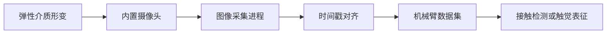

# DTact 视觉触觉传感器接入

DTact 通过摄像头观察弹性介质的形变，将接触过程转换为可保存、可同步的图像序列。这类传感器适合用于检测首次接触、滑移、夹持稳定性和物体局部几何。本节给出一条与机械臂数据采集兼容的接入方法，不依赖特定机型。

## 数据链



触觉图像不应单独保存。每帧图像至少需要对齐以下信息：

- 单调递增的时间戳；
- 机械臂关节位置与夹爪开度；
- 任务、回合和帧索引；
- 如果可用，力、力矩或电流估计。

## 环境准备

如果采集程序使用 ROS，可先安装工作空间与依赖管理工具：

```bash
sudo apt update
sudo apt install -y \
  python3-rosdep \
  python3-rosinstall \
  python3-rosinstall-generator \
  python3-wstool \
  build-essential
```

这些软件包只负责构建和解析 ROS 工作空间，不包含 DTact 的设备驱动。还需要根据实际摄像头型号安装 V4L2 或厂商提供的驱动。

## 设备检查

连接传感器后，先确认系统能够枚举视频设备：

```bash
v4l2-ctl --list-devices
```

选定设备节点后，读取它支持的分辨率与帧率：

```bash
export TACTILE_DEVICE=/dev/video2
v4l2-ctl --device "$TACTILE_DEVICE" --list-formats-ext
```

**检查点 1：** 视频设备名称、设备节点和支持的图像格式应与实物一致。如果重启后设备编号变化，应使用 `udev` 规则创建稳定设备名，而不是把 `/dev/video2` 写死在采集程序中。

## 标定与同步

1. 在无接触状态下采集背景图像，用于表示弹性介质的初始外观。
2. 使用已知形状的压头在多个位置施加可重复接触，检查成像亮度、视野和形变方向是否稳定。
3. 在采集程序中记录单调时钟，与关节状态使用同一时间基准。
4. 在完整回合前先执行一次慢速闭合夹爪实验，检查触觉图像变化与夹爪开度变化是否同步。

**检查点 2：** 在接触发生时，触觉图像应出现连续形变，且对齐后的关节状态不应出现数帧以上的系统性延迟。

## 数据集接口

在 LeRobot 数据集中，可将触觉图像定义为独立观测键，例如 `observation.images.tactile_left` 和 `observation.images.tactile_right`。视觉触觉与普通摄像头都是图像流，但两者的意义不同：普通摄像头描述环境，触觉摄像头描述接触界面。训练前应分别计算它们的图像统计量，不共用一组图像归一化参数。

## 常见问题

- **图像闪烁或色彩漂移：** 固定曝光、增益和白平衡，避免自动成像参数改变接触特征。
- **图像正常但与动作不同步：** 先比较采集时间戳，再检查视频缓冲区和编码队列；不要仅根据保存完成时间对齐。
- **刚性接触时形变区域过小：** 检查弹性介质硬度、镜头焦距和照明结构，不要通过增大夹持力补偿成像问题。

传感器的系统选型方法参见[传感器选型与数据采集](./06传感器选型与数据采集.md)。
