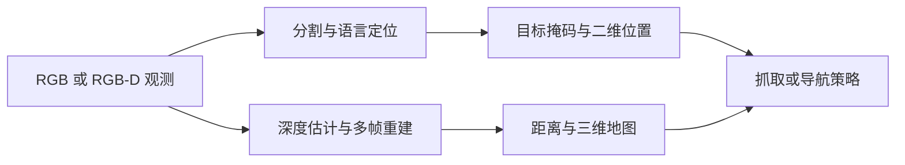

# 具身场景视觉与三维重建

本专题围绕机器人“看见目标、理解距离、建立地图、根据语言定位”四类能力组织。每章既给出感知模块的输入输出，也说明其在机器人系统中的接口位置。

## 学习顺序

1. [SAM 分割与单目深度估计](01-sam和深度估计.md)：从图像点击获得目标掩码和相对深度。
2. [抓取注意力热图](02-抓取注意力热图.md)：理解检测器和策略网络关注的图像区域。
3. [LingBot-Map 视频流式三维重建](03-LingBot-Map视频流式三维重建.md)：将连续视频转为点云地图。
4. [Locate Anything 视觉语言定位](04-Locate-Anything视觉语言定位.md)：用自然语言在图像中定位机器人任务目标。

## 系统关系

## 完成标准

- 能说明二维掩码、深度、点云和语言目标框之间的区别。
- 能运行至少一个感知示例，并核对输入、模型权重和输出文件。
- 能判断感知结果是否足以直接控制机器人，或仍需标定、规划和安全约束。
