# Open Duck Mini 与 Microduck：从 URDF 模型到强化学习走路、踢球与网页部署

这一节带大家拆解两代“小鸭子”开源双足机器人：[Open Duck Mini v2](https://github.com/apirrone/Open_Duck_Mini/tree/v2) 和 [Microduck](https://github.com/pollen-robotics/microduck)。我们不把它们当成同一个仓库里的两个脚本，而是把整条链路看清楚：机器人描述文件从哪里下载，强化学习环境如何组装，PPO 如何学习走路与踢球，以及 checkpoint 怎样导出为 ONNX 并在 RDK 或浏览器中运行。

学完这一节后，大家应该能够：

- 区分 Open Duck Mini v2、Open Duck Playground、Microduck 和 Microduck RL 四个工程的责任边界；
- 只下载 Open Duck Mini v2 的 URDF 及其 STL 网格，并检查资产是否完整；
- 对 Microduck RL 先跑 `64 个环境 x 5 次迭代` 的 smoke test，再启动正式训练；
- 拆解 `Mjlab-BallKick-Flat-MicroDuck` 的非对称 actor-critic、奖励、球体随机化和左右脚训练方式；
- 在本地启动基于 MuJoCo WebAssembly 与 `onnxruntime-web` 的 Microduck Sandbox，并替换为自己导出的踢球策略；
- 回放策略、录制仿真视频、导出带观测归一化的 ONNX，并让 RDK X5 作为策略大脑驱动 Ubuntu 电脑中的 MuJoCo；
- 理解一个“仿真里会走”的策略距离真机上 50 Hz 稳定走路还缺哪些工程环节。

## 一、先分清四个项目

“Open Duck”项目经过了机械设计、参考动作生成、MuJoCo 强化学习和新一代真机运行时的多次迭代。名字很像，但文件格式和命令不能混用。

| 项目 | 角色 | 机器人描述 | 学习时怎么用 |
| :-- | :-- | :-- | :-- |
| [Open Duck Mini v2](https://github.com/apirrone/Open_Duck_Mini/tree/v2) | 约 42 cm 的开源机械与嵌入式资源中心 | `robot.urdf` 和 `robot.xml`，同目录保存 STL | 学 URDF、机械结构和早期 sim-to-real |
| [Open Duck Reference Motion Generator](https://github.com/apirrone/Open_Duck_reference_motion_generator) | 用 Placo 生成步态参考动作 | 内置多代 Duck 的 URDF 和网格 | 给模仿奖励生成 `polynomial_coefficients.pkl` |
| [Open Duck Playground](https://github.com/apirrone/Open_Duck_Playground) | Open Duck Mini v2 的 MuJoCo Playground/JAX 训练线 | 使用仓库内 MJCF | 复现旧款大鸭子的 walking policy |
| [Microduck RL](https://github.com/pollen-robotics/microduck_rl) + [Microduck](https://github.com/pollen-robotics/microduck) | 新一代约 25 cm、800 g 小鸭子的训练端与真机端 | 训练主线使用 MJCF，不以 URDF 为入口 | 学 `mjlab + MuJoCo Warp + PPO + ONNX + 50 Hz runtime` 完整链路 |

> **关键判断：** 如果你的目标是“下载 URDF 研究机械结构”，从 Open Duck Mini v2 开始；如果目标是“跑当前官方的强化学习训练”，从 Microduck RL 开始。将 Open Duck Mini v2 的 URDF 直接替换进 Microduck RL 不会自动成功，因为关节名、自由度、组件质量、碰撞体和策略的观测/动作契约都不同。

## 二、官方效果先建立直觉

<p align="center">
  
</p>

**图 1 Microduck RL 官方项目总览。** 新一代项目并不只训一个向前走路策略，而是把速度跟踪、起身、坐立、叼取、踢球、前滚翻和轮滑等任务都放进共享的任务注册表中。它们共用 61 维 actor observation 和 14 维 action 契约，因此真机运行时可以在走路、站立和技巧策略之间切换。

<p align="center"><sub>来源：Pollen Robotics 官方 `microduck_rl` 仓库 README 页首图，原项目以 Apache-2.0 许可证发布。</sub></p>

<video controls muted playsinline preload="metadata" width="100%">
  <source src="assets/official_videos/microduck_real_walking.mp4" type="video/mp4">
</video>

**视频 1 Microduck 官方真机走路片段。** 这段素材来自 Microduck RL 官方项目页的真机演示，教程截取了前 20 秒并转为浏览器更易播放的 H.264 MP4。这展示的是官方策略效果，不是本教程在本地重新训练收敛的结果。

[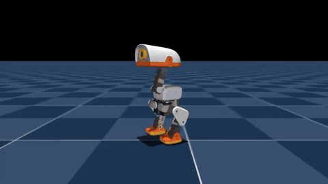](assets/local_videos/microduck_4096env_6000iter_walk.mp4)

**视频 2 本教程实际完成的 4096 环境强化学习结果。** 我们从 `microduck_rl` 的 `29e887e` 版本出发，在 `Mjlab-Velocity-Flat-MicroDuck` 上训练 6000 次 PPO 迭代，再用最终的 `model_5999.pt` 以固定 `0.4 m/s` 前进命令回放。录像关闭了测试阶段的外力推搡事件，但没有对 checkpoint 做后处理或剪接成功片段。页面展示的是同一视频生成的 GIF，点击画面可打开 960×540 的 H.264 原视频。

| 复现实验项 | 实际值 |
| :-- | :-- |
| 并行环境数 | 4096 |
| 每环境每轮采样步数 | 24 |
| PPO 迭代数 | 6000 |
| 累计仿真 transition | 589,824,000 |
| 训练耗时 | 1 小时 27 分 41 秒 |
| 最终 mean reward / mean episode length | 119.57 / 972.52 |
| 导出 ONNX 契约 | `[1, 61] -> [1, 14]` |

这些数值用于说明本节展示视频的来源和复现规模，不应脱离代码版本、随机种子和 curriculum 与其他实验直接横向排名。

本次训练的完整阶段权重、最终 ONNX、配置、TensorBoard 日志与验证视频已经发布到 [Datawhale/Microduck-RL-4096x6000](https://huggingface.co/Datawhale/Microduck-RL-4096x6000)。模型仓库同时提供 `SHA256SUMS`，方便下载后校验文件是否完整。

[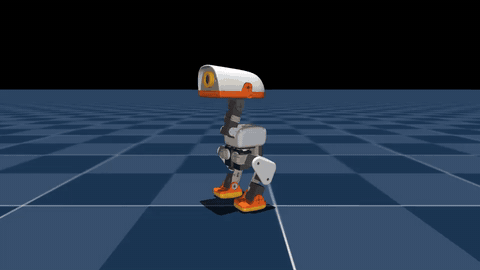](assets/local_videos/microduck_command_dance.mp4)

**视频 3 本教程用同一 walking policy 完成的命令编舞。** 这不是单独训练的 dance checkpoint，而是按时间改变 `vx / vy / yaw rate` 和四维头部姿态命令，让已经训练好的 61 维策略实时执行点头、侧移、左右转向、前后步和弧线动作。整段 12 秒视频来自连续闭环 rollout，没有逐帧修改机器人姿态。页面展示的是压缩 GIF，点击画面可打开 960×540 的 H.264 原视频。

[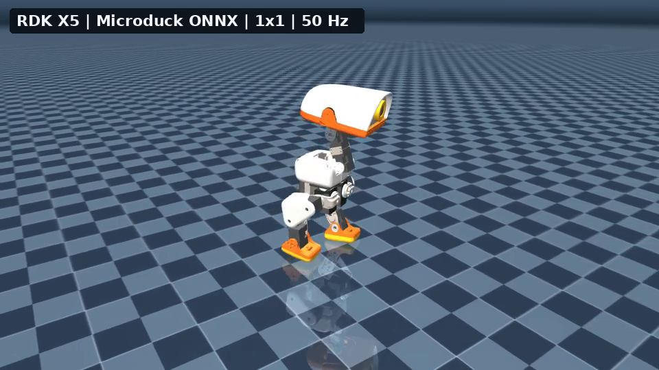](assets/local_videos/microduck_rdk_brain_single_12s.mp4)

**视频 4 RDK X5 策略大脑控制单只 Microduck。** Ubuntu 电脑只负责 MuJoCo 物理仿真与画面渲染；每个 50 Hz 控制周期生成的 61 维观测都通过局域网发给 RDK，RDK 运行 `microduck_policy_5999.onnx` 后返回 14 维动作。视频为连续 12 秒、600 个控制周期、360 帧的完整闭环，不是预先算好动作后再播放。点击画面可打开 960×540、30 FPS 的 H.264 原视频。

[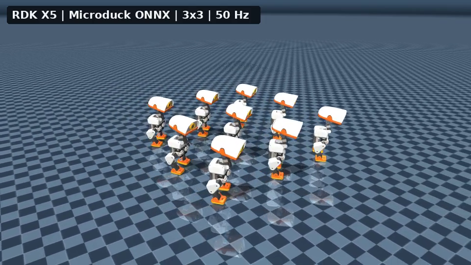](assets/local_videos/microduck_rdk_brain_3x3_12s.mp4)

**视频 5 RDK X5 策略大脑控制 3×3 Microduck 方阵。** 九只鸭子位于同一个 MuJoCo world，每只都有独立的自由基座、关节状态、IMU 观测、历史动作和 BAM M6 XL330 执行器状态。Ubuntu 电脑把九组观测打包为一次网络请求，RDK 逐组执行 ONNX 并返回九组动作，再分别写回对应机器人。它验证的是单策略的批量边缘推理与多实例可视化，不代表九只机器人学会了通信或多智能体协同。

[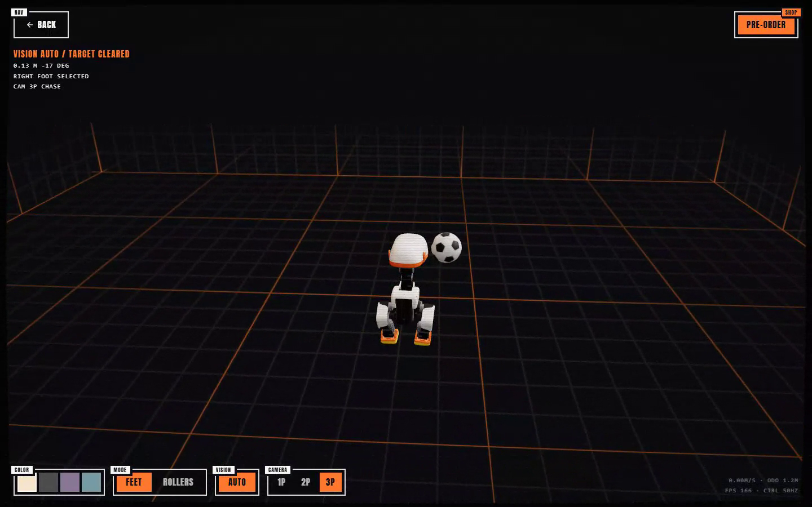](assets/local_videos/microduck_visual_soccer_continuous_chase.mp4)

**视频 6A 三视角追逐同一颗球并连续踢三次。** 浏览器只在开局把球放置一次，之后不再改写球的位置、姿态或速度。鸭子完成第一脚后等待球在 MuJoCo 中自然滚动，再重新检测、追赶、对准并踢出第二脚和第三脚；因此这不是把球反复摆回脚边的三段动作拼接。视频开头短暂展示头部传感器第一视角和近距离跟随第二视角，随后切到默认第三视角，并在追逐、脚位对齐、BallKick 策略切换、触球和稳定收尾阶段持续把鸭子保持在画面中部。本轮三次均由状态机选择右脚，单脚触球窗口内足球平面位移约为 `0.112 m`、`0.288 m` 和 `0.376 m`；每次触球后控制权都返回 walking policy，机体全程保持直立。点击封面可播放 1440×900、25 FPS、H.264 原视频。

[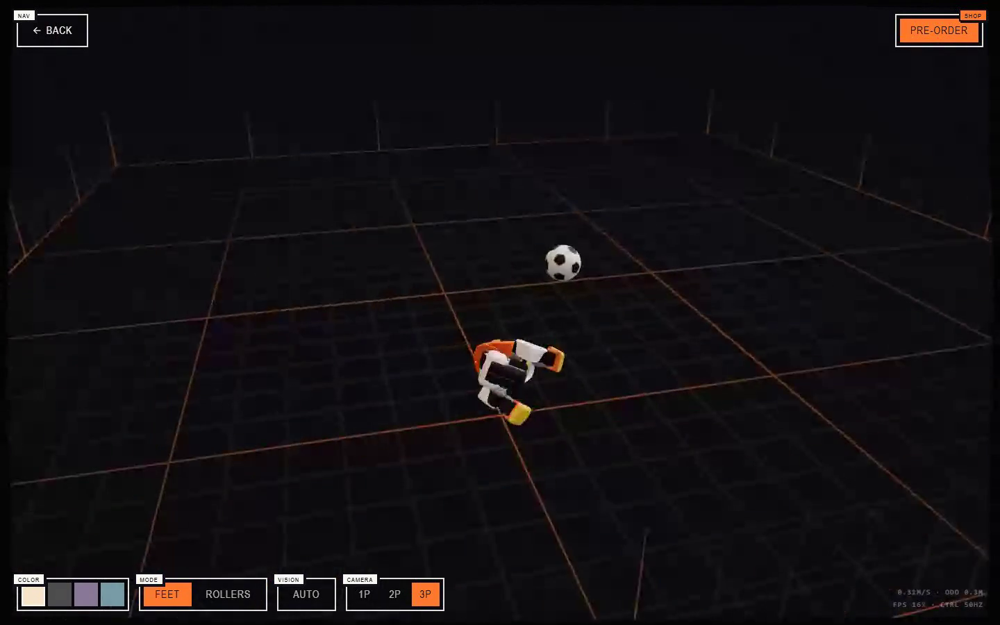](assets/local_videos/microduck_physical_impulse_recovery.mp4)

**视频 6B 物理扰动与自动起身。** 这段恢复测试与踢球主片分开录制。测试不直接改写机器人位姿或四元数，而是给浮动基座施加一次横向线速度与滚转角速度冲量；后续倾倒、地面接触和姿态变化全部由 MuJoCo 的重力、碰撞、关节约束和求解器自然推进。摔倒检测器确认失稳后，stand policy 接管并在约 `1.96 s` 后恢复直立，再把控制权交还 walking policy。最终 `gravity_z=-0.99998`、基座高度约 `0.1165 m`。该视频验证的是外力扰动下的恢复链路，不把“直接把模型放倒”冒充物理实验。

<video controls muted playsinline preload="metadata" width="100%">
  <source src="assets/official_videos/open_duck_mini_v2_sim_walking.mp4" type="video/mp4">
</video>

**视频 7 Open Duck Mini v2 官方仿真走路片段。** 这段视频来自 Open Duck Mini v2 项目中“转向 MuJoCo Playground”部分。它对应旧款 42 cm 机器人，不对应新 Microduck 的 14 自由度策略契约。

## 三、从架构图看完整训练链路

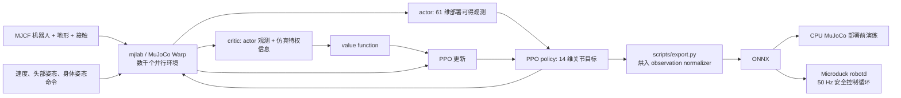

**图 2 Microduck RL 的数据流。** 这个架构有五个不能跳过的模块。

### 1. 机器人与执行器模型

Microduck RL 的主要 MJCF 位于：

```text
src/mjlab_microduck/robot/microduck/
├── robot_walk.xml
├── robot_allcollisions.xml
├── robot_allcollisions_rollers.xml
├── robot_*_backlash.xml
└── scene*.xml
```

`robot_walk.xml` 用于速度跟踪，精简了不必要的躯干和头部接触；`robot_allcollisions.xml` 保留身体碰撞，用于起身、坐立、叼取和前滚翻；rollers 版本则增加脚底无驱动轮。训练没有把电机当成理想 PD 执行器，而是使用 [BAM](https://github.com/Rhoban/bam) 的 Dynamixel XL330 执行器模型，加入反电动势、库仑/静摩擦、负载相关摩擦和电池电压等因素。

### 2. 观测、命令和动作契约

新版策略的 actor 输入是 61 维，输出是 14 维关节动作。其中命令槽位固定为：

```text
twist 速度命令 3 维
+ head pose 命令 4 维
+ body pose 命令 6 维
= 13 维命令子向量
```

其余观测来自 IMU、关节位置/速度和历史动作。actor 不使用真机难以可靠获取的 base linear velocity；critic 在训练时可以额外读取这项仿真真值。这是典型的 asymmetric actor-critic：价值网络用更完整的信息加速学习，策略网络保持部署可行。

### 3. 奖励不是“往前走”一项

主任务 `Mjlab-Velocity-Flat-MicroDuck` 的奖励和约束大致可分成：

| 类别 | 代表项 | 作用 |
| :-- | :-- | :-- |
| 任务奖励 | linear/angular velocity tracking | 跟踪 `vx, vy, yaw rate` 命令 |
| 姿态奖励 | upright、pose、head pose tracking | 避免为了速度而倾覆，同时保留头部控制 |
| 步态奖励 | air time、foot clearance、swing height | 促使脚真正离地，避免蹭地滑行 |
| 平滑与安全 | action rate、self collision、foot slip | 抑制高频抖动、自碰撞和过度滑脚 |
| 课程学习 | standing fraction、head-pose range、reward weight | 先学会基本步态，再逐步加大命令范围和规整强度 |

这里最值得学的不是某一个权重，而是奖励项之间的竞争。例如 foot-slip 罚得太重，小机器人原地转向所需的枢轴运动也会被压制；action-rate 从第一步就过重，策略还没学会迈步就被迫保持不动。所以官方配置使用 curriculum，让平滑约束和更大的命令范围在后续阶段逐步引入。

### 4. Sim-to-real 的四层保护

Microduck RL 并不依赖一个完全准确的仿真器，而是同时做四件事：

1. 用 BAM 缩小理想电机与小型舵机之间的执行器差距；
2. 对质量/惯量、质心、摩擦、电压、IMU 安装偏差、编码器零偏和动作延迟做 domain randomization；
3. 提供 `Backlash` 任务变体，用无驱动的被动铰链模拟齿轮回程间隙；
4. 在真机前先用 `infer_policy.py` 重演与 runtime 相同的 observation/action 契约和策略切换。

## 四、推荐主线：训练新 Microduck 走路策略

### 0. 环境前提

官方工程当前要求：

- Linux x86_64 或官方已适配的 Linux ARM 环境；
- 支持当前训练栈的 CUDA GPU，训练通过 MuJoCo Warp 执行；不要求某个具体显卡型号；
- Python `>=3.12,<3.13`，由 `uv` 按 `uv.lock` 创建；
- 正式训练默认使用 Weights & Biases 保存实验和 checkpoint。

先检查 GPU 和基础工具：

```bash
nvidia-smi
git --version
curl --version
```

### 1. 克隆与安装

工作目录：任意不含空格的 Linux 工作区。

```bash
curl -LsSf https://astral.sh/uv/install.sh | sh
source "$HOME/.local/bin/env"

git clone https://github.com/pollen-robotics/microduck_rl.git
cd microduck_rl
uv sync

# 正式训练前登录 W&B，用于记录曲线和 checkpoint
uv run wandb login
```

如果本地环境暂时不方便，也可以把同一套命令放到云端开发机执行。例如在算力自由创建 Linux 开发实例后，直接从控制台进入 Jupyter Terminal 或复制 SSH 命令登录，不需要改变 Microduck RL 的训练代码。

> [!TIP]
> **算力自由推荐镜像：[Mujoco 物理引擎：机器人学习研究与仿真到现实](https://www.gpufree.cn/images/101302)**
>
> 该镜像已经准备好 Ubuntu 22.04、CUDA 12.8、MuJoCo 3.4.1、`mujoco_warp` 和 `mujoco_playground`，适合从浏览器远程桌面观察仿真，也可以直接使用 Jupyter 或 SSH 运行下面的命令。镜像自带的 Playground 环境不是 Microduck RL 项目的锁定环境，因此仍要执行 `git clone` 和 `uv sync`，不要跳过项目自己的依赖安装。

建议把项目、依赖缓存和训练输出都放在数据盘，而不是默认系统盘：

```bash
export WORKSPACE=/root/gpufree-data/microduck
export UV_CACHE_DIR=/root/gpufree-data/.cache/uv

mkdir -p "$WORKSPACE" "$UV_CACHE_DIR"
cd "$WORKSPACE"

git clone https://github.com/pollen-robotics/microduck_rl.git
cd microduck_rl
uv sync
```

接下来仍然按照本节的 smoke test、正式训练和 ONNX 导出顺序执行。这样 `logs/`、checkpoint、录像和 `output.onnx` 都保存在数据盘目录中，可以通过 Jupyter 文件列表下载。暂时离开时先在控制台关机；确认已经下载结果且不再使用后，再决定是否释放实例，避免把“关机”和“删除数据”混为一谈。

DGX Spark/GB10 或 Jetson 等 ARM 机器首次下载 CUDA wheel 时，官方建议增大 `uv` 超时：

```bash
export UV_HTTP_TIMEOUT=600
uv sync
```

**Checkpoint 1：**不要立即训练，先确认任务注册表和 CPU 单元测试正常。

```bash
uv run list-envs | grep MicroDuck
uv run --with pytest pytest tests/
```

看到 `Mjlab-Velocity-Flat-MicroDuck` 等任务，且测试通过，只能证明依赖、注册表和配置约束可用，不代表 GPU 训练已经可以长时间稳定运行。

### 2. 必做的五迭代 smoke test

官方维护者在 `AGENTS.md` 里明确建议，长训前先跑 64 个并行环境、5 次 PPO 迭代：

```bash
uv run train Mjlab-Velocity-Flat-MicroDuck \
  --env.scene.num-envs 64 \
  --agent.max_iterations 5
```

**Checkpoint 2：**这个小测试要证明的是：

- MuJoCo Warp 能在 CUDA 上创建并行环境；
- actor observation 和 action 维度与模型一致；
- 每个 reward/termination/event 都能完成一次计算；
- rollout 没有在数步内产生 NaN；
- checkpoint 能够写入 `logs/` 目录。

它不证明策略已经学会走路。5 次迭代时的动作仍然接近随机是正常现象。

### 3. 正式训练

```bash
uv run train Mjlab-Velocity-Flat-MicroDuck \
  --env.scene.num-envs 4096
```

官方 README 给出的经验是，4096 个环境下约 1–2 小时可以看到可用步态，但真正的收敛时间会受 GPU、当前配置、随机种子和 curriculum 影响。不要把这个数字当成硬性保证。

本节视频采用的完整命令如下。`WANDB_MODE=offline` 让训练日志只写入本地，适合暂时不连接 W&B 的工作站；需要云端实验追踪时，删除这一项并提前执行 `wandb login`。

```bash
WANDB_MODE=offline uv run train Mjlab-Velocity-Flat-MicroDuck \
  --env.scene.num-envs 4096 \
  --agent.max_iterations 6000 \
  --agent.save-interval 500 \
  --agent.run-name every-embodied-4096x6000
```

如果目标是先完整经历“训练、保存 checkpoint、导出 ONNX、回放”的全过程，可以沿用 smoke test 的 64 个环境，但把迭代数提高。下面是一条更容易在普通开发机或云端实例上启动的练习配置：

```bash
uv run train Mjlab-Velocity-Flat-MicroDuck \
  --env.scene.num-envs 64 \
  --agent.max_iterations 10000
```

这里的 `64 x 10000` 是缩小并行规模后的教学配置，不是把五轮 smoke test 直接当成训练结果，也不等价于官方 4096 环境配置的训练效率。第一次练习可以在确认 checkpoint 已经正常写入、奖励曲线持续变化后主动停止，再进入导出环节；需要更好的步态时，再延长训练或提高并行环境数。

一次正常训练至少应监控：

| 指标 | 应该看什么 | 常见误判 |
| :-- | :-- | :-- |
| mean reward | 长期趋势上升，不是每次迭代都上升 | 只看总奖励，忽略策略在奖励钻空子 |
| episode length | 与当前 curriculum 阶段和摔倒率一起解读 | 越长一定越好 |
| velocity tracking | 线速度和角速度两项都提升 | 只会向前走就当成已掌握转向 |
| penalty terms | 加权后的 penalty 应为非正 | 符号反了，策略通过自碰撞等行为刷分 |
| 动作和姿态视频 | 是否蹭地、屁股跳、头部撑地或高频抖动 | 只看曲线，不看物理行为 |

中断后恢复的官方命令形式为：

```bash
uv run train Mjlab-Velocity-Flat-MicroDuck \
  --env.scene.num-envs 4096 \
  --agent.run-name resume \
  --agent.load-checkpoint model_29999.pt \
  --agent.resume True
```

#### 下载本教程公开权重

不想重新完成 6000 次 PPO 迭代时，可以从 Datawhale 的 Hugging Face 模型仓库下载本节实际使用的权重。仓库保留 `model_0.pt`、每 500 次迭代的阶段 checkpoint 以及最终 `model_5999.pt`，还包含对应的 `agent.yaml`、`env.yaml`、训练日志和 61 维输入 ONNX。

```bash
# 安装或更新 Hugging Face CLI
python -m pip install -U huggingface_hub

# 下载最终 checkpoint
hf download Datawhale/Microduck-RL-4096x6000 \
  checkpoints/model_5999.pt \
  --local-dir Microduck-RL-4096x6000

# 下载全部阶段权重和复现材料
hf download Datawhale/Microduck-RL-4096x6000 \
  --local-dir Microduck-RL-4096x6000
```

下载后建议先核对 [模型卡](https://huggingface.co/Datawhale/Microduck-RL-4096x6000) 中记录的上游提交、观测契约和许可边界。训练末轮的 `mean reward = 119.57` 只是该次运行的日志值，不应当作跨随机种子 benchmark。

### 4. 回放与录制走路或编舞视频

官方 quickstart 使用 W&B run path 定位 checkpoint：

```bash
uv run play Mjlab-Velocity-Flat-MicroDuck \
  --wandb-run-path <entity/project/run_id>
```

如果 checkpoint 保存在本地，可以直接用 `--checkpoint-file` 回放：

```bash
uv run play Mjlab-Velocity-Flat-MicroDuck \
  --checkpoint-file logs/rsl_rl/velocity/<run-name>/model_<iteration>.pt
```

官方 `play` 命令适合交互观察，但录完指定帧数后仍会继续运行 Viser 服务。为了在无桌面的 Linux 工作站上自动生成一段有限时长、近景跟拍的视频，本教程提供了 `record_microduck_policy.py`：

```bash
export EVERY_EMBODIED=/path/to/every-embodied

MUJOCO_GL=egl uv run python \
  "$EVERY_EMBODIED/05-具身场景的深度和强化学习/05-OpenDuckMini与Microduck双足强化学习/record_microduck_policy.py" \
  --checkpoint logs/rsl_rl/velocity/<run-name>/model_<iteration>.pt \
  --output-dir artifacts/microduck-video \
  --frames 600 \
  --width 960 \
  --height 540 \
  --speed 0.4 \
  --seed 42
```

`--motion walk` 是默认模式。脚本会关闭训练中的外力推搡事件，固定向前速度命令，并在录完 600 帧后主动关闭环境。视频写入 `artifacts/microduck-video/`。它只改变回放条件，不改变 checkpoint；录像是检查步态、滑脚、摔倒和抖动的物理证据，不能用总奖励曲线替代。

#### 用同一个策略编排一段舞蹈

walking policy 的 61 维观测已经包含 `twist(3) + head_pose(4) + body_pose(6)` 命令槽位，因此不必为了每一段展示动作重新训练策略。增加 `--motion dance` 后，脚本会在 12 秒内写入一组有界、连续变化的命令：

```bash
MUJOCO_GL=egl uv run python \
  "$EVERY_EMBODIED/05-具身场景的深度和强化学习/05-OpenDuckMini与Microduck双足强化学习/record_microduck_policy.py" \
  --checkpoint logs/rsl_rl/velocity/<run-name>/model_<iteration>.pt \
  --output-dir artifacts/microduck-dance \
  --motion dance \
  --frames 600 \
  --width 960 \
  --height 540 \
  --seed 42
```

| 时间 | 写入的主要命令 | 可见动作 |
| :-- | :-- | :-- |
| 0-2 s | 速度为零，头部正弦运动 | 原地点头、摆头和侧倾 |
| 2-4 s | `vy` 左右变化 | 横向踏步 |
| 4-6 s | `yaw rate` 左右变化 | 左右转身 |
| 6-8 s | `vx` 正负变化 | 前进后退 |
| 8-10 s | 正向 `vx` 加固定 `yaw rate` | 绕弧线移动 |
| 10-12 s | 侧移、转向和头部命令叠加 | 组合收尾 |

脚本每个控制周期先更新 `command_manager` 中的命令张量，再构造 observation、调用 policy 并推进 MuJoCo。动作仍由 PPO policy 输出，不是直接把预设关节角写入仿真。所有速度和头部命令都限制在该策略训练时的采样范围内。

这里要区分“命令编舞”和“新技能训练”。命令编舞复用已有 walking policy，适合快速验证统一命令接口；前滚翻、踢球和轮滑旋转改变了接触模式或机器人模型，需要训练各自的官方任务：

| 想展示的技巧 | 官方任务 | 是否复用 walking checkpoint |
| :-- | :-- | :-- |
| 坐下再站起 | `Mjlab-SitStand-Flat-MicroDuck` | 否 |
| 前滚翻 | `Mjlab-Roulade-Flat-MicroDuck` | 否 |
| 踢球 | `Mjlab-BallKick-Flat-MicroDuck` | 否 |
| 轮滑旋转 | `Mjlab-Spin-Flat-MicroDuck` | 否，且使用 rollers 模型 |

Microduck RL 当前没有名为 `Dance` 的注册任务。因此，本教程把上面的视频准确标为 command choreography；如果要训练可抗扰动、可任意触发的舞蹈技能，应新增带相位或参考动作的任务配置，而不是把展示脚本当作训练结果。

### 5. 训练踢球策略，并把策略放进浏览器

走路策略解决的是持续速度跟踪，踢球则是一次性的接触技能。两者虽然都输出 14 维关节目标，但状态分布和奖励完全不同：走路策略需要连续追踪速度命令，踢球策略要先稳定站立，再用一条腿快速摆动、保持支撑脚不离地，并在动作结束后回到可交接的站姿。因此，不能把行走 ONNX 改名为踢球策略，也不能在展示脚本中直接写死关节角后声称完成了强化学习。

#### 5.1 BallKick 的任务结构

官方任务 ID 是 `Mjlab-BallKick-Flat-MicroDuck`，核心配置位于：

```text
src/mjlab_microduck/tasks/microduck_ball_kick_env_cfg.py
```

这个任务使用直径 70 mm、质量 15 g 的自由球体。每个 episode 长 5 秒，球心初始位置在踢球脚前方约 `x=0.09 m`、`|y|=0.042 m`，并在平面内加入 `±0.015 m` 的位置扰动。这个扰动很关键：策略没有视觉输入，真机上需要操作者先把机器人对准球，策略只能通过训练时的位置随机化容忍少量瞄准误差。

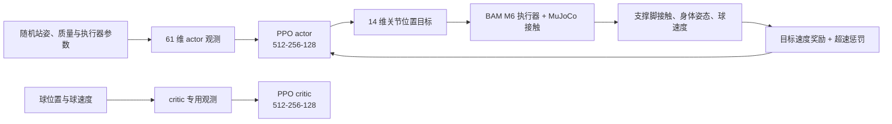

**图 3 BallKick 的非对称 actor-critic 数据流。** actor 只读取 IMU、关节、本轮命令和历史动作，critic 在训练时额外读取球的位置与速度。部署时只保留 actor，因此策略不依赖仿真器中的球真值。

BallKick 的 61 维 actor 输入仍遵守所有 Microduck 策略共用的契约：

| 分块 | 维度 | 作用 |
| :-- | --: | :-- |
| 基座角速度 | 3 | 判断身体旋转状态 |
| 投影重力 | 3 | 判断倾斜与是否保持直立 |
| 14 个关节位置 | 14 | 当前姿态 |
| 14 个关节速度 | 14 | 当前运动趋势 |
| 上一步动作 | 14 | 抑制突变并形成短期动作记忆 |
| `twist + head + body` 命令槽 | 13 | 本任务只保留统一接口，未使用的槽位补零 |
| 合计 | 61 | ONNX 输入形状为 `[1,61]` |

训练采用 asymmetric actor-critic：critic 额外看到 `ball_position(3) + ball_velocity(3)`，actor 不看球。这样既能让价值函数更准确地判断“这一脚是否会碰到球”，又不会把真机上不存在的球真值传感器带进部署模型。

奖励不是简单的“球滚得越远越好”。当前配置把目标球速设为 `1.0 m/s`，由下列几组约束共同塑形：

| 奖励或约束 | 主要作用 |
| :-- | :-- |
| `ball_forward_velocity` | 奖励球沿机器人初始朝向前进，并在目标速度处截断 |
| `ball_speed_overshoot` | 惩罚超过目标的速度，避免策略只追求暴力击球 |
| `support_foot_grounded` | 要求非踢球脚持续接地，抑制双脚起跳和乱跑撞球 |
| `pose_stand_legs` / `pose_stand_neck` | 动作前后回到可交接的站姿 |
| `upright` / `height_stand` | 防止蹲得过低、侧倒或用身体撞球 |
| `action_rate_l2` | 经课程学习逐步加大动作平滑约束 |
| 自碰撞、角动量等正则项 | 降低仿真中特有的投机动作 |

训练中还会随机化躯干与头部质心、惯量、关节摩擦、armature、IMU 安装角、编码器偏置和外部推力。课程学习先让策略发现摆腿动作，再逐步把动作变化惩罚和外力推搡加进来；如果一开始就施加全部扰动，短促接触动作通常更难探索出来。

#### 5.2 先做小规模训练检查

教程目录提供了 [`train_microduck_ballkick.sh`](train_microduck_ballkick.sh)。脚本不修改官方任务，只把环境数量、迭代数、保存间隔和 W&B 模式变成环境变量。进入 `microduck_rl` 根目录后，先用 64 个环境跑 5 次迭代：

```bash
export MICRODUCK_RL=$PWD
export NUM_ENVS=64
export MAX_ITERATIONS=5
export SAVE_INTERVAL=5
export WANDB_MODE=offline

bash /path/to/every-embodied/05-具身场景的深度和强化学习/05-OpenDuckMini与Microduck双足强化学习/train_microduck_ballkick.sh
```

这一步只证明五件事：任务注册成功、球体资产可加载、接触传感器可工作、PPO 能完成反向传播、checkpoint 能写入磁盘。5 次迭代不会学出可用踢球动作，不能把 smoke test 录像当成训练结果。

本教程已在上游提交 `29e887e` 上实际完成这组 `64 env x 5 iterations` 检查：进程正常退出，共采样 7680 步，写出了 `model_0.pt`、`model_4.pt` 和 ONNX；末轮平均回报为 `1.31`。这些数字只用于验证执行链路，不代表策略质量。机器可读的环境、哈希和末轮指标见 [`microduck_ballkick_smoke.json`](assets/local_reports/microduck_ballkick_smoke.json)。

确认显存和日志正常后，再启动正式训练：

```bash
export MICRODUCK_RL=$PWD
export NUM_ENVS=4096
export MAX_ITERATIONS=6000
export SAVE_INTERVAL=250
export WANDB_MODE=offline

bash /path/to/every-embodied/05-具身场景的深度和强化学习/05-OpenDuckMini与Microduck双足强化学习/train_microduck_ballkick.sh \
  2>&1 | tee ballkick_train.log
```

默认 `KICK_FOOT = "right"`，因此上面训练右脚策略。左右脚策略需要分成两次运行；训练左脚时，在独立 Git 分支中把 `microduck_ball_kick_env_cfg.py` 顶部的 `KICK_FOOT` 改为 `"left"`，不要在同一日志目录中覆盖右脚运行。官方明确关闭了该任务的左右对称数据增强，因为“哪条腿踢、哪条腿支撑”本身就是任务语义。

6000 次迭代是本教程采用的训练预算，不是官方保证收敛点。检查 checkpoint 时至少观察：

1. 球是否由脚接触后沿机器人朝向运动，而不是初始化穿模或身体碰撞造成位移；
2. 支撑脚在击球阶段是否保持接地；
3. 机器人是否在击球后恢复站姿；
4. 不同球初始偏差、随机种子和外力扰动下是否仍能命中；
5. 是否出现“踢得更猛但超速惩罚更高”的策略退化。

#### 5.3 导出本地 checkpoint

本地离线训练不必先上传 W&B。使用 `--checkpoint-file` 指向保存的模型，官方导出器会把 observation normalizer 一并烘入 ONNX：

```bash
uv run scripts/export.py Mjlab-BallKick-Flat-MicroDuck \
  --checkpoint-file logs/rsl_rl/ball_kick_right/<run-name>/model_5999.pt \
  --onnx-file ball_kick_right.onnx
```

导出后先按下一节的 ONNX 契约检查验证 `[1,61] -> [1,14]`。如果输入变成 51 维，说明拿到了旧命令布局的模型，不能直接塞进当前网页模拟器。

#### 5.4 截图中的网页模拟器是怎样运行的

截图对应 Pollen Robotics 官方 [Microduck Sandbox](https://huggingface.co/spaces/pollen-robotics/microduck-simulator)。它不是把 Ubuntu 桌面通过视频流传给浏览器，也没有 Python 推理后端；MuJoCo 物理和 ONNX 网络都在当前浏览器标签页内执行：

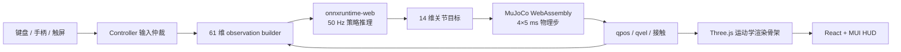

**图 4 Microduck Sandbox 浏览器闭环。** 浏览器每个控制周期执行一次 ONNX，再推进 4 个 `5 ms` MuJoCo 物理步，得到约 50 Hz 的控制频率；Three.js 读取 `qpos` 更新可视化网格。

源码分工如下：

| 文件 | 责任 |
| :-- | :-- |
| `app/src/game/game.js` | 加载 MJCF、注入地面/围栏/球，构造 61 维观测，运行 50 Hz 策略与物理循环 |
| `app/src/game/duck.js` | 从 `kinematics.json` 和 STL/GLB 构建 Three.js 机器人骨架 |
| `app/src/game/controls/` | 统一键盘、手柄、触屏和 waypoint 输入 |
| `app/src/game/ball-actor.js` | 管理球的出现、消失和物理姿态同步 |
| `app/src/scene/GameCanvas.jsx` | 管理 React Three Fiber 画布、灯光与每帧更新 |
| `app/src/store.js` | 用 Zustand 在仿真核心和 React HUD 之间传递状态 |
| `app/public/policies/` | walking、sitstand、roulade、左右脚 kick 等 ONNX |
| `app/public/robot/mjlab/` | MJCF、运动学描述和经过处理的机器人网格 |

多人半透明机器人使用 Trystero 通过公共 Nostr relay 建立 WebRTC 点对点连接，只以 10 Hz 广播姿态；它与本地物理闭环相互独立。公共 relay 临时不可达时，多人“幽灵”会消失，但单机走路、踢球和 ONNX 推理仍能工作。

<p align="center">
  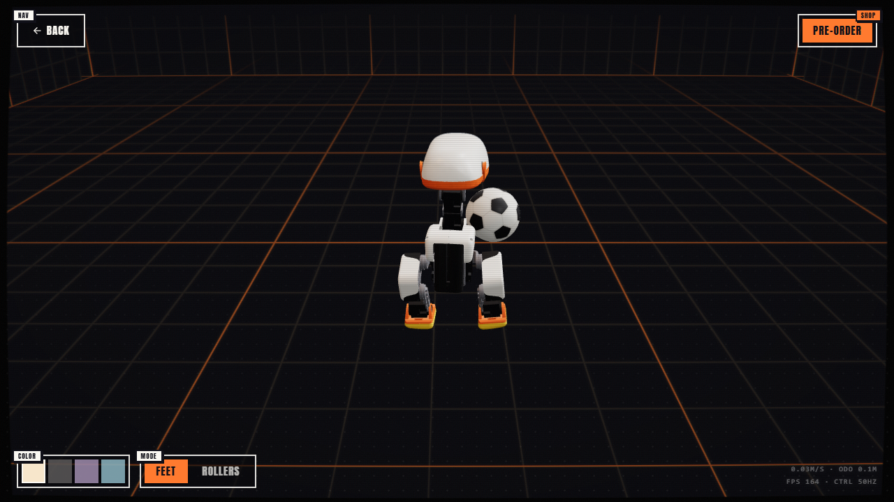
</p>

**图 5 本教程在本机浏览器触发右脚 BallKick 的瞬间。** 页面使用官方 `ball_kick_right.onnx`，自动化验收先把球放到训练任务的右脚标称位置，再触发一次 one-shot 策略。球在平面内位移约 `1.11 m`，证明 WASM 物理、ONNX 推理、策略切换与球接触都已实际运行。完整机器可读记录见 [`microduck_web_kick_qa.json`](assets/local_reports/microduck_web_kick_qa.json)。

需要注意，网页是交互沙盒，不是训练 benchmark：当前网页把球设为 30 g，并允许把球随机生成到鸭子前方较远位置；训练任务使用 15 g 球并在脚尖附近做 `±1.5 cm` 随机化。网页中的击球距离不能直接当作训练指标。

#### 5.5 在本地或局域网启动网页

先安装 Git LFS。ONNX、STL、GLB 和音频都由 LFS 管理；只拉到几十字节的 pointer 文件时，页面会在启动阶段报 `Unexpected token 'v'`，因为 `version https://git-lfs...` 被误当成模型或 JSON 解析。

```bash
git lfs install
git clone https://huggingface.co/spaces/pollen-robotics/microduck-simulator
cd microduck-simulator
git lfs pull

cd app
npm ci
npm test
npm run dev -- --host 0.0.0.0 --port 5175
```

本机打开 `http://localhost:5175/`。同一局域网内的其他设备访问 `http://<运行网页电脑的局域网地址>:5175/`；如果页面无法连接，先检查系统防火墙是否允许 Node.js 监听 5175 端口。手机建议横屏使用。

常用操作如下：

| 输入 | 行为 |
| :-- | :-- |
| 方向键或 WASD/ZQSD | 前后移动与转向 |
| Q / E | 左脚 / 右脚踢球 |
| F | 左右脚交替踢球 |
| R | 腿式坐下/站起，轮式下蹲滑行 |
| G | 低头叼取 |
| M | 切换 FEET / ROLLERS |
| C | 切换跟随镜头 |
| Space | 重置场景 |

网页中的踢球策略只接管 25 个控制周期，即 `0.5 s`；随后还有 `0.4 s` 输入锁定，再交还 walking policy。这种“短时技能策略 -> 稳定策略”的热切换方式与真机运行时一致，避免一次性策略在动作结束后继续输出无意义关节目标。

要换成本地训练出的右脚策略，只替换同名 ONNX 后重新构建：

```bash
cp /path/to/ball_kick_right.onnx \
  app/public/policies/ball_kick_right.onnx

cd app
npm test
npm run build
npm run preview -- --host 0.0.0.0 --port 5175
```

生产静态文件位于 `app/dist/`，可以交给 Nginx、GitHub Pages 类静态托管或容器服务。官方 Space 使用 Docker 构建 Vite，再由非特权 Nginx 在 8080 端口提供静态文件；运行时不需要 GPU，也不需要服务器保存仿真状态。当前 Space 可以公开读取源码，但仓库根目录没有单独的 `LICENSE` 文件；学习和本地运行没有障碍，若要分发修改版网页，应先向维护者确认网页壳代码和配套素材的许可范围。

#### 5.6 网页端常见问题

| 现象 | 判断与处理 |
| :-- | :-- |
| BIOS 停在 `SYSTEM HALTED`，并出现 LFS pointer 文本 | 执行 `git lfs pull`，确认 ONNX 文件约数百 KB 而不是几十字节 |
| 页面只有 HUD、没有机器人 | 检查 WebGL2 与浏览器硬件加速，查看第一个 WASM/MJCF 加载错误 |
| 控制台反复出现 Nostr/WebSocket 错误 | 只影响多人姿态同步；本地 `CTRL 50HZ` 正常即可继续 |
| 按 Q/E 有摆腿但没有碰到球 | 该策略看不到球，需要先走到合适距离并让球对准对应脚 |
| 替换 ONNX 后机器人立即倒下 | 先核对 `[1,61] -> [1,14]`、normalizer 是否烘入、关节顺序和训练所用 MJCF |
| 手机界面过窄 | 切到横屏；触屏摇杆与动作按钮会按移动端布局显示 |
| 开发服务器关闭后网页失效 | `npm run dev` 是前台进程；长期展示应使用 `npm run build` 后托管 `dist/` |

#### 5.7 从“盲踢”扩展为多视角自主踢球

官方 BallKick ONNX 只看 61 维本体观测，输入中没有图像、检测框或球坐标。它擅长的是“球已经在脚前时，稳定地完成一次摆腿接触”，不能独立解决找球和走到球前。因此，一个完整的自主踢球系统至少要分成三层：

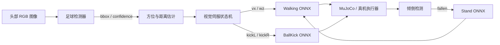

这不是把几个模型同时输出再平均，而是有明确职责和所有权的分层控制：检测器回答“球在哪里”，walking policy 负责连续移动，左右 BallKick policy 只在接触窗口内短时接管，stand policy 只在跌倒状态接管。

##### 5.7.1 浏览器检测框的含义

本教程网页演示用 MuJoCo 中的球真值坐标生成一个与真实检测器相同形状的接口。设机器人平面位姿为 `(x_r, y_r, θ)`，球心为 `(x_b, y_b)`，先把世界坐标差旋转到机体坐标系：

```text
dx = x_b - x_r,  dy = y_b - y_r
ball_x =  cos(θ) * dx + sin(θ) * dy
ball_y = -sin(θ) * dx + cos(θ) * dy
bearing = atan2(ball_y, ball_x)
```

再把三维球心投影到相机，依据投影中心与球半径生成 `bbox = [left, top, right, bottom]`。HUD 展示 `BALL xx%`、距离、角度和检测框。这种做法验证了相机、检测输出、控制状态机和策略切换的完整接口，但**不是训练好的视觉检测器，也不能把检测精度当成实验结果**。接到 RDK 或真机时，只需用 YOLO 等检测器替换 `bbox/confidence` 来源，状态机不需要重写。

自动控制与观看视角彼此独立，打开 `AUTO` 后仍可随时切换：

| 按钮 | 视角 | 适合检查的内容 |
| :-- | :-- | :-- |
| `1P` | 头部传感器第一视角 | 球是否进入视场、检测框是否落在目标上、近距离视觉盲区 |
| `2P` | 轻微偏肩的近距离跟随视角 | 鸭身、足球和落脚点的相对位置，左右脚对齐过程 |
| `3P` | 默认的居中追拍视角 | 完整观看接近、触球、摔倒和恢复；相机平滑跟随并始终朝向鸭身中心 |

第三视角中，足球可能与鸭身发生图像遮挡。此时只保留由控制状态机计算的距离、方位和选脚信息，不绘制二维检测框，避免把被遮挡球的投影误画到机器人身体上。普通链接默认是**单鸭模式**；只有显式添加 `?multiplayer=1` 才连接联机房间并显示其他标签页或设备中的鸭子，因此同时打开多个普通本地页面也不会再出现“场景里莫名多出一只鸭子”。

##### 5.7.2 为什么要“晚选脚”

球刚进入视野时的左右位置会随机器人转向不断变化。如果第一次检测就永久选择左脚或右脚，最终到达脚前时可能已经跨过身体中线。本教程在距离小于 `0.24 m` 后才依据 `ball_y` 选择脚，并在踢球发出前允许更新：

| 条件 | 决策 |
| :-- | :-- |
| `ball_y > 0.006 m` | 倾向左脚，目标横向位置约 `+0.043 m` |
| 其他情况 | 倾向右脚，目标横向位置约 `-0.043 m` |
| 人工键盘、手柄或触屏输入出现 | 人工输入立即抢占，自动命令归零 |

这里的正负方向是 Microduck 机体坐标定义，不应照搬到关节命名或相机镜像方向不同的机器人上。

##### 5.7.3 六阶段视觉伺服

| 状态 | 进入条件 | 输出与退出条件 |
| :-- | :-- | :-- |
| `searching` | 没有球或球不在视场 | 原地搜索；检测到球后转入对准 |
| `aligning` | 球方位角较大 | 用 walking policy 转向，带滞回避免左右抖动 |
| `approaching` | 球在前方且距离较远 | 直行接近，只保留小角速度修正 |
| `aligning-foot` | 球进入约 `0.17 m` 的近场 | 原地转动，把球移到选定脚的横向接触带 |
| `approaching-foot` | 横向位置合格、纵向仍稍远 | 低速直行到脚尖前方 |
| `kick-ready / kicking` | `x≈0.07–0.122 m` 且横向误差足够小 | 先零命令站稳约 `0.55 s`，再让对应 BallKick ONNX 接管 `0.5 s` |

转向和前进采用离散阶段而不是长期同时给较小的 `vx+wz`。原因不是经典控制器不能画弧线，而是该 walking policy 在低速复合命令附近可能收敛到几乎静止的姿态；先转、再走并加入滞回，对这个已训练策略更稳定。

##### 5.7.4 用接触扫描确定踢球窗口

“看起来离脚很近”不是可靠阈值。本教程在同一 MuJoCo 网页运行时固定机器人站姿，遍历 `x={0.08,0.10,0.12,0.14,0.16} m`、`y={-0.08,-0.04,0,+0.04,+0.08} m`，分别执行左右脚策略并记录球的水平位移。结果表明有效接触集中在：

| 策略 | 主要接触带 | 扫描中最大位移 |
| :-- | :-- | :-- |
| 左脚 | `x≈0.08–0.12 m, y≈+0.04 m` | 约 `1.03 m` |
| 右脚 | `x≈0.08–0.12 m, y≈-0.04 m` | 约 `0.93 m` |

最大位移只用于定位接触热区，不是稳健性统计。正式验收还要从较远的偏置球位开始，要求 walking policy 自己走过去，并以球坐标变化而非“状态进入 kicking”判定成功。视频 6A 只在开局以机体坐标 `(0.42, -0.11) m` 放球一次，后续两轮直接追逐上一脚踢走后仍在运动的同一颗球。第一脚触球终点 `(-0.070, -0.134) m` 与第二轮追踪起点 `(0.052, -0.150) m` 不相同，是因为球在重新捕获前继续受惯性、摩擦和接触约束运动；脚本没有写入新的球坐标。第二脚到第三脚同理。三轮都产生可测位移，最终重力投影 `gravity_z=-0.99996`，机体保持直立。

##### 5.7.5 摔倒检测与恢复

网页每个 50 Hz 控制周期检查机体坐标系中的重力投影。若 `gravity_z > -0.5` 持续 `0.2 s`，说明躯干倾角已经明显偏离直立，状态机先冻结 `0.3 s` 等待碰撞稳定，再切换 stand policy。只有 `gravity_z < -0.85` 连续 `1 s` 才算恢复成功并交还 walking policy；尝试 `6 s` 仍未恢复则重置，避免坏状态无限运行。

恢复验收使用广义速度冲量模拟瞬时外力：浮动基座横向速度增加 `1.55 m/s`、滚转角速度增加 `5.4 rad/s`。这种测试等价于对自由基座施加理想瞬时冲量，改变的是速度而不是位姿；后续运动仍满足仿真动力学。若要做持续推力或接触式碰撞实验，可进一步在多个 MuJoCo 子步内写入 `qfrc_applied`，并同步记录外力、接触冲量和能量变化。

训练出的最终 checkpoint、右脚 ONNX 和机器可读验收记录发布在 [Datawhale/Microduck-BallKick-4096x6000](https://huggingface.co/Datawhale/Microduck-BallKick-4096x6000)。本地下载：

```bash
hf download Datawhale/Microduck-BallKick-4096x6000 \
  --local-dir Microduck-BallKick-4096x6000
```

详细训练与网页数据见 [`microduck_ballkick_visual_qa.json`](assets/local_reports/microduck_ballkick_visual_qa.json)。复现时至少同时保存：代码提交、任务名、并行环境数、checkpoint/ONNX 哈希、球初始位姿、选脚结果、球位移和最终机体状态；只上传一个视频无法判断策略契约是否一致。


### 6. 导出 ONNX 与 CPU MuJoCo 演练

```bash
uv run scripts/export.py Mjlab-Velocity-Flat-MicroDuck \
  --wandb-run-path <entity/project/run_id> \
  --onnx-file output.onnx

uv run scripts/infer_policy.py --walking output.onnx --new-cmd-obs
```

`scripts/export.py` 不只是把 PyTorch 网络改个后缀。它会把训练时的 observation normalizer 烘入 ONNX 计算图。手工转换 checkpoint 即使维度对得上，也可能因为输入未归一化而在部署时完全失效。

在打开 MuJoCo 窗口之前，建议先做一次不依赖显示器的 ONNX 契约检查：

```bash
uv run python - <<'PY'
import numpy as np
import onnxruntime as ort

session = ort.InferenceSession("output.onnx")
model_input = session.get_inputs()[0]
model_output = session.get_outputs()[0]
print(f"input : {model_input.name} {model_input.shape} {model_input.type}")
print(f"output: {model_output.name} {model_output.shape} {model_output.type}")

assert model_input.shape == [1, 61], model_input.shape
assert model_output.shape == [1, 14], model_output.shape
action = session.run(None, {model_input.name: np.zeros((1, 61), dtype=np.float32)})[0]
assert action.shape == (1, 14) and np.isfinite(action).all()
print("ONNX contract and one-step inference: PASS")
PY
```

当前策略的 61 维输入由 48 维本体观测和 13 维命令组成，命令布局是 `twist(3) + head_pose(4) + body_pose(6)`。`infer_policy.py` 为兼容旧 checkpoint，默认仍构造 51 维输入，即 48 维本体观测加旧版 3 维命令；因此，新模型若漏掉 `--new-cmd-obs`，就会出现 `Got: 51 Expected: 61`。这里应修正推理参数，不能随意裁剪模型输入或在末尾盲目补零，因为命令槽位的语义和排列也必须与训练一致。

`infer_policy.py` 支持键盘速度命令，也能同时加载 walking、standing、sit-stand 和 roulade 等策略：

```bash
uv run scripts/infer_policy.py \
  --walking walk.onnx \
  --standing stand.onnx \
  --sitstand sitstand.onnx \
  --roulade roulade.onnx \
  --new-cmd-obs
```

这一步要检查三件事：ONNX 输入/输出是否为 `[1,61] -> [1,14]`，命令槽位是否与 runtime 一致，策略切换时是否出现姿态突跳。

`infer_policy.py` 使用原生 MuJoCo 交互窗口，需要有效的桌面会话和 OpenGL 上下文。通过纯 SSH 终端启动时，模型维度修正后仍可能遇到 `GLXBadDrawable`；这属于显示链路错误，与 ONNX 本身是两个问题。需要键盘控制时，应在本机桌面或远程桌面/VNC 会话的终端中运行上面的命令。只想在无桌面服务器上验证模型时，先运行契约检查；需要生成非交互视频时，使用上一节的录制脚本并启用 EGL：

```bash
MUJOCO_GL=egl uv run python \
  "$EVERY_EMBODIED/05-具身场景的深度和强化学习/05-OpenDuckMini与Microduck双足强化学习/record_microduck_policy.py" \
  --checkpoint logs/rsl_rl/velocity/<run-name>/model_<iteration>.pt \
  --output-dir artifacts/microduck-video
```

若契约检查通过而交互窗口失败，就只排查 `DISPLAY`、远程桌面会话和 OpenGL/GLX，不要重新导出 ONNX；若契约检查本身失败，再回到 checkpoint、导出脚本和 observation contract 排查。

### 7. RDK X5 作为策略大脑，Ubuntu 电脑负责仿真与渲染

直接在 RDK 上运行 MuJoCo 是可行的。本教程实测在 RDK X5 上安装 `mujoco==3.3.7` 后，可以编译 Microduck 官方 MJCF、运行 BAM 执行器和输出 H.264 视频。但 RDK 的板载 EGL 驱动没有暴露 MuJoCo 离屏渲染所需的 `eglQueryDevicesEXT`，改用 OSMesa 后，渲染详细 STL 网格的成本又远高于策略推理。更符合真实机器人系统分工的做法是：

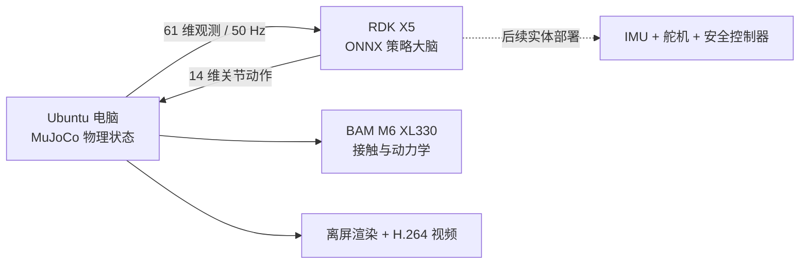

**图 3 RDK 策略大脑与 Ubuntu 仿真端的职责划分。** 这不是把 ONNX 留在 Ubuntu 上假装板端部署。远程模式下，渲染脚本不会创建本地 ONNX Runtime session；RDK 服务启动时先返回模型的输入/输出维度和 SHA256，随后在一条持久 TCP 连接上接收观测并返回动作。Ubuntu 电脑只保存和推进物理状态，因此断开 RDK 或返回维度不一致时，仿真会直接停止。

本教程提供三个脚本：

| 脚本 | 运行位置 | 用途 |
| :-- | :-- | :-- |
| [`rdk_policy_smoke.py`](rdk_policy_smoke.py) | RDK | 检查 ONNX 契约、纯推理延迟和 50 Hz deadline |
| [`rdk_policy_server.py`](rdk_policy_server.py) | RDK | 通过持久 TCP 连接提供批量 `61 -> 14` 策略推理 |
| [`rdk_microduck_video.py`](rdk_microduck_video.py) | Ubuntu 电脑 | 运行单鸭或多鸭 MuJoCo，向 RDK 请求动作并编码 MP4 |

#### 第一步：在 RDK 上启动策略服务

先把 ONNX 和 `rdk_policy_server.py` 放到 RDK。板端不需要安装 `mjlab`、PyTorch 或 MuJoCo，只需要 NumPy 与 ONNX Runtime：

```bash
python3 -m pip install --user numpy onnxruntime

python3 rdk_policy_smoke.py \
  --model microduck_policy_5999.onnx \
  --iterations 2000 \
  --paced-steps 250 \
  --control-hz 50 \
  --json-output rdk_smoke_report.json

python3 rdk_policy_server.py \
  --model microduck_policy_5999.onnx \
  --host 0.0.0.0 \
  --port 8765
```

服务端协议先发送 `MDP1 + 输入维度 + 输出维度 + 模型 SHA256` 握手。每个请求由一个批量大小和连续的 `float32` 观测组成，响应为相同批量大小的 `float32` 动作。单鸭请求是 `[1,61] -> [1,14]`；九鸭方阵则在一次控制周期内发送 `[9,61]`，RDK 使用固定批量为 1 的 ONNX 逐组推理，再返回 `[9,14]`。这一设计和当前模型的静态 batch 契约一致，也避免为展示视频重新导出另一个模型。

#### 第二步：在 Ubuntu 电脑上生成单鸭视频

Ubuntu 电脑需要已经安装好的 Microduck RL 环境和 `ffmpeg`。`--policy-host` 必须填写 RDK 在同一局域网中的地址；远程模式不需要 `--model`：

```bash
export EVERY_EMBODIED=/path/to/every-embodied
export MICRODUCK_RL=/path/to/microduck_rl
cd "$MICRODUCK_RL"

MUJOCO_GL=egl uv run python \
  "$EVERY_EMBODIED/05-具身场景的深度和强化学习/05-OpenDuckMini与Microduck双足强化学习/rdk_microduck_video.py" \
  --microduck-repo "$MICRODUCK_RL" \
  --policy-host <RDK_IP> \
  --policy-port 8765 \
  --output microduck_rdk_brain_single_12s.mp4 \
  --rows 1 --cols 1 \
  --duration 12 --fps 30 \
  --width 960 --height 540 \
  --speed 0.30 \
  --camera-distance 0.70
```

脚本使用训练同源的投影重力、关节相对位置、关节速度、历史动作和 13 维命令槽位构造观测，并以 `4 x 0.005 s = 20 ms` 的控制周期推进物理。视频旁边还会生成同名 JSON，记录模型哈希、控制步数、RDK 往返延迟、每只机器人的位移、最低躯干高度和视频编码参数。

#### 第三步：在同一场景生成九鸭方阵

方阵不是把单鸭视频复制九份。脚本通过 MuJoCo `MjSpec.attach` 将九份带独立命名前缀的 Microduck 机器人合并到同一个 world，再给每只机器人分别建立关节、IMU、历史动作和执行器索引：

```bash
MUJOCO_GL=egl uv run python \
  "$EVERY_EMBODIED/05-具身场景的深度和强化学习/05-OpenDuckMini与Microduck双足强化学习/rdk_microduck_video.py" \
  --microduck-repo "$MICRODUCK_RL" \
  --policy-host <RDK_IP> \
  --policy-port 8765 \
  --output microduck_rdk_brain_3x3_12s.mp4 \
  --rows 3 --cols 3 \
  --duration 12 --fps 30 \
  --width 960 --height 540 \
  --speed 0.30 \
  --camera-distance 1.65
```

这里的九只鸭子共享同一个策略权重和速度命令，但不共享物理状态。它们的动作看起来同步，是因为初始姿态和确定性策略相同；轻微差异来自同一 world 中各自的接触求解。要研究队形保持、避碰或通信，应在 observation、reward 和训练任务中显式加入邻居状态，这不属于本次边缘部署验证。

#### 本次实际验证记录

| 检查项 | RDK X5 实测结果 |
| :-- | :-- |
| 系统与推理运行时 | RDK 系统 `3.3.3`，ARM64，ONNX Runtime `1.23.2` |
| 模型契约 | `obs [1,61] -> actions [1,14]` |
| 模型 SHA256 | `216fff94da1b88159327c426686fcfcca4763f571b4d123be6b2ca549042f9f0` |
| 2000 次板内推理 | 平均 `0.315 ms`，p50 `0.309 ms`，p99 `0.437 ms` |
| 250 步 50 Hz 定时循环 | p50 `0.399 ms`，p99 `0.785 ms`，最大 `0.809 ms`，deadline miss `0/250` |
| 单鸭完整闭环 | 12 秒，600 次 RDK 控制请求，360 帧 H.264 视频 |
| 3×3 方阵完整闭环 | 12 秒，600 次批量请求、共 5400 次 RDK ONNX 推理，360 帧 H.264 视频 |

板内定时测试与完整运行记录分别保存在 [`rdk_policy_smoke_report.json`](assets/local_reports/rdk_policy_smoke_report.json)、[`microduck_rdk_brain_single_12s.json`](assets/local_reports/microduck_rdk_brain_single_12s.json) 和 [`microduck_rdk_brain_3x3_12s.json`](assets/local_reports/microduck_rdk_brain_3x3_12s.json)。这组数据的用途是证明板端模型契约、持续推理和闭环控制链路已经跑通，不用于和其他硬件做速度排名。

RDK 系统虽然提供 `hobot_dnn`、`hrt_model_exec` 和 BPU 设备节点，但 `hrt_model_exec` 不能直接加载普通 ONNX，它需要先用匹配版本的地瓜工具链转换为板端模型。当前 14 自由度 MLP 在 CPU 上已经远小于 20 ms 控制预算，因此把小策略强行迁移到 BPU 没有实际收益；后续接入视觉检测或深度网络时，再把 BPU 留给计算量更大的感知模型更合理。

#### 第四步：把 RDK 扩展为多技能策略大脑

前面的 `MDP1` 服务只装载一个 walking 模型，适合验证单鸭与方阵。踢球网页需要在行走、左右脚踢球和跌倒恢复之间切换，因此本教程又提供了 `MDP2` 多策略协议。RDK 启动时返回具名策略目录，Ubuntu 或网页按照名称请求动作：

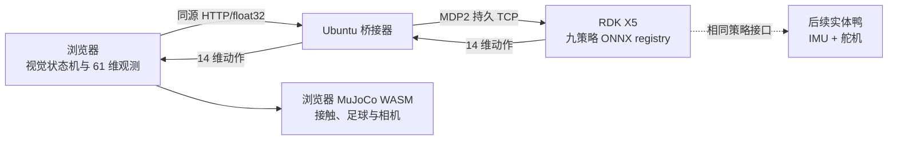

这里的职责边界必须明确：浏览器负责球检测结果、自动接近、对准、左右脚选择和 MuJoCo；RDK X5 只根据 61 维 actor 观测运行被选中的 ONNX 并返回 14 维动作。BallKick actor 在训练时看不到球，球状态只供 critic 使用，所以“追球”本来就应由视觉控制层完成，不能把球坐标偷偷塞进部署 actor。

新增脚本如下：

| 文件 | 运行位置 | 作用 |
| :-- | :-- | :-- |
| [`rdk_policy_protocol.py`](rdk_policy_protocol.py) | 两端 | `MDP2` 握手、具名请求与错误响应 |
| [`rdk_multi_policy_server.py`](rdk_multi_policy_server.py) | RDK X5 | 多客户端、九策略 registry；每个模型均公开维度与 SHA256 |
| [`start_rdk_brain.sh`](start_rdk_brain.sh) | RDK X5 | 用固定策略名启动完整网页技能集 |
| [`rdk_policy_client.py`](rdk_policy_client.py) | Ubuntu | 严格客户端；维度、有限值、必需策略和延迟检查 |
| [`rdk_multi_policy_smoke.py`](rdk_multi_policy_smoke.py) | Ubuntu | 网页在线时也能并发验收 walking/左右踢球 |
| [`rdk_web_policy_bridge.py`](rdk_web_policy_bridge.py) | Ubuntu | 浏览器 HTTP 与板端 MDP2 TCP 之间的薄桥接，可同时托管网页静态文件 |
| [`rdk_web_policy_provider.js`](rdk_web_policy_provider.js) | 浏览器源码 | 将 `walk/kickL/kickR/...` 映射为 RDK 策略名并校验响应 |
| [`rdk_microduck_soccer.py`](rdk_microduck_soccer.py) | Ubuntu | 原生 MuJoCo 离屏闭环、连续追同一只球并编码 MP4 |

把浏览器仿真器的九个 ONNX 放入 RDK。下例假定已将上述 Python 和 shell 文件放在 `~/microduck_policy_v2/`：

```bash
# 在 Ubuntu 电脑执行；<RDK_IP> 换成开发板地址。
scp microduck-simulator/app/public/policies/*.onnx \
  sunrise@<RDK_IP>:~/microduck_policy_v2/models/

scp rdk_policy_protocol.py rdk_multi_policy_server.py start_rdk_brain.sh \
  sunrise@<RDK_IP>:~/microduck_policy_v2/

ssh sunrise@<RDK_IP> \
  'chmod +x ~/microduck_policy_v2/start_rdk_brain.sh && \
   cd ~/microduck_policy_v2 && \
   nohup ./start_rdk_brain.sh >logs/server.log 2>&1 &'
```

九个名称不是文件名猜测，而是网页状态机与板端 registry 的稳定接口：

| RDK 名称 | ONNX 文件 | 网页行为 |
| :-- | :-- | :-- |
| `walking` | `BEST_alpha_walking.onnx` | 行走、转向、追球和脚位调整 |
| `kick_left` / `kick_right` | `ball_kick_left.onnx` / `ball_kick_right.onnx` | 左右脚单次技巧动作 |
| `stand` | `BEST_alpha_stand.onnx` | 摔倒后的站起控制 |
| `sitstand` | `BEST_alpha_sitstand.onnx` | 坐下与起立 |
| `roll` | `roulade.onnx` | 翻滚技巧 |
| `groundpick` | `alpha_ground_pick.onnx` | 低头捡拾 |
| `drive` / `crouch` | `BEST_roller.onnx` / `BEST_roller_crouch.onnx` | 轮滑与蹲滑 |

先做独立验收。脚本建立第二条 TCP 连接，因此可以在网页长连接保持在线时运行：

```bash
python rdk_multi_policy_smoke.py \
  --host <RDK_IP> --port 8766 \
  --iterations 100 \
  --json-output rdk_multi_policy_smoke_report.json
```

看到 catalog 中九个策略均为 `[1,61] -> [1,14]`，且 walking、`kick_left`、`kick_right` 都返回有限值，才进入网页闭环。报告会把板端 ONNX Runtime provider、每个模型的 SHA256 和网络往返延迟一起保存，避免拿错 checkpoint 后只凭画面猜测。

#### 第五步：网页 MuJoCo 由 RDK X5 供应动作

浏览器不能直接建立原始 TCP，因此 Ubuntu 上需要薄桥接器。桥接器不做推理，只转发 `float32` 观测和动作；RDK 重启后会重连一次，但不会创建本地 ONNX session。先构建修改后的 Microduck Sandbox：

```bash
cd /path/to/microduck-simulator/app
npm ci
npm run build

python "$EVERY_EMBODIED/05-具身场景的深度和强化学习/05-OpenDuckMini与Microduck双足强化学习/rdk_web_policy_bridge.py" \
  --rdk-host <RDK_IP> --rdk-port 8766 \
  --listen-host 0.0.0.0 --listen-port 8767 \
  --static-root "$PWD/dist"
```

同一局域网浏览器打开：

```text
http://<UBUNTU_IP>:8767/?rdk=self
```

`rdk=self` 表示网页和策略桥接 API 使用同一个 origin，不会在每个 50 Hz 周期额外触发 CORS 预检。开发时也可以在 Vite 中把 `/rdk-api` 反向代理到 `127.0.0.1:8767`，再打开 `http://localhost:5173/?rdk=/rdk-api`。

网页集成时，将原来的：

```js
const out = await activeSession().run({
  obs: new ort.Tensor("float32", observation, [1, 61]),
});
const action = out.actions.data;
```

替换为：

```js
const rdk = await RdkPolicyProvider.connect(window.location.origin);
const { actions, latencyMs } = await rdk.run(activePolicySlot(), observation);
```

远程模式不要再下载 walking、kick 或 stand ONNX。catalog 缺少必需策略时启动失败；运行中 RDK 断线时停止控制并显示 `RDK X5 / OFFLINE`。只有这种 fail-closed 行为，才能证明网页画面中的动作确实来自开发板。

本次实测从网页初始场景重新启动，第三视角依次进入 `AUTO APPROACH`、`ALIGN TARGET`，触发 `kick_right` 后又回到 `SEARCH BALL`，继续搜索未被重置的同一颗球。HUD 全程显示 `BRAIN RDK X5 / ONLINE`；桥接日志记录到 walking 和 `kick_right` 的成功响应，网页未加载本地策略作为后备。独立 300 次 smoke 的局域网往返均值约 `2.1 ms`，原始记录见 [`rdk_multi_policy_smoke_report.json`](assets/local_reports/rdk_multi_policy_smoke_report.json)。这些数字用于检查 20 ms 控制预算，不用于硬件排名。

#### 第六步：Ubuntu 原生 MuJoCo 生成踢球视频

需要无浏览器、可归档的 H.264 视频时运行原生脚本。球只在开局放置一次，后续踢完不会瞬移复位；控制器继续寻找滚走的同一只球：

```bash
MUJOCO_GL=egl uv run python \
  "$EVERY_EMBODIED/05-具身场景的深度和强化学习/05-OpenDuckMini与Microduck双足强化学习/rdk_microduck_soccer.py" \
  --microduck-repo "$MICRODUCK_RL" \
  --policy-host <RDK_IP> --policy-port 8766 \
  --output microduck_rdk_soccer.mp4 \
  --max-kicks 3 --max-duration 90 \
  --fps 30 --width 1280 --height 720
```

脚本不会接受本地 `--model` 参数，也不会断线降级。只有 JSON 中 `ball_placement_count = 1`、`completed_kicks = 3`，且 `rdk_latency` 同时出现 walking 和踢球策略，才算完成连续追球验收。

后续在显卡工作站训练新动作时，不需要改变协议：用官方 exporter 生成 `[1,61] -> [1,14]` ONNX，复制到 RDK，在 `start_rdk_brain.sh` 增加一条 `--policy 技能名=models/文件.onnx`，再在网页状态机增加同名映射即可。显卡负责训练，Ubuntu 负责世界与画面，RDK X5 始终是部署侧策略大脑。

### 8. 真机部署边界

Microduck 真机仓库中的 `robotd` 以 50 Hz 运行，读取 IMU 和舵机状态，生成 61 维观测，调用 ONNX 策略，再将 14 维动作变成关节目标。但从 `output.onnx` 到真机之间仍然必须有：

- 关节顺序、方向、零位和限位校验；
- IMU 坐标系和安装偏差校准；
- 失联、过温、跌倒、异常动作幅度和策略加载失败保护；
- 悬空小幅度测试、支撑架测试、带保护绳落地测试，最后才是自由走路。

因此，本节的命令到 CPU MuJoCo 演练为止。没有完成上述硬件校准和安全门禁时，不应将新策略直接写入真机。

## 五、下载 Open Duck Mini v2 URDF 和完整网格

Open Duck Mini v2 的 `robot.urdf` 不是单文件模型。它包含 21 个 link、20 个 joint，并引用同目录下的 45 类 STL 网格。只在 GitHub 网页上下载 `robot.urdf`，加载时会出现 `body_front.stl not found` 一类错误。

### 方式 A：稀疏克隆机器人模型目录

```bash
git clone --depth 1 --filter=blob:none --sparse --branch v2 \
  https://github.com/apirrone/Open_Duck_Mini.git
cd Open_Duck_Mini
git sparse-checkout set mini_bdx/robots/open_duck_mini_v2
```

下载后的关键文件为：

```text
Open_Duck_Mini/mini_bdx/robots/open_duck_mini_v2/
├── robot.urdf
├── robot.xml
├── robot_motors.xml
├── config.json
├── *.stl
└── *.part
```

用下面的命令做完整性检查：

```bash
MODEL_DIR=mini_bdx/robots/open_duck_mini_v2
test -f "$MODEL_DIR/robot.urdf"
test "$(find "$MODEL_DIR" -maxdepth 1 -name '*.stl' | wc -l)" -gt 0
grep -n 'mesh filename' "$MODEL_DIR/robot.urdf" | head
```

URDF 中的网格路径写成 `package:///body_front.stl` 这类形式。不同加载器对空 package 名的解析有差异；如果查看器找不到网格，应先把 package/resource root 指向这个模型目录，而不是删掉所有 mesh 引用。

在已安装 ROS 的环境中，可先做 XML/连杆树检查：

```bash
check_urdf "$MODEL_DIR/robot.urdf"
```

`check_urdf` 通过不代表网格路径、惯量、碰撞体和关节方向已经在目标仿真器中验证，它只是第一道结构检查。

### 方式 B：下载参考动作仓库中的 URDF

如果目标是生成模仿学习参考轨迹，直接克隆 reference-motion 仓库更合适。该仓库使用 Git LFS：

```bash
sudo apt update
sudo apt install -y git-lfs
git lfs install

git clone https://github.com/apirrone/Open_Duck_reference_motion_generator.git
cd Open_Duck_reference_motion_generator
git lfs pull

uv run scripts/auto_waddle.py -j4 \
  --duck open_duck_mini_v2 \
  --sweep

uv run scripts/fit_poly.py --ref_motion recordings/
uv run scripts/replay_motion.py -f recordings/<motion-file>.json
```

`-j` 后应显式给出并行数，例如 `-j4`。官方 README 特别提醒，单独使用 `-j` 会尝试占用全部 CPU 核心，普通机器可能因内存和调度压力失去响应。

## 六、复现旧 Open Duck Mini v2 训练线

如果大家的目标就是 42 cm Open Duck Mini v2，应使用与它配套的 Open Duck Playground，而不是新 Microduck 任务。

```bash
git clone https://github.com/apirrone/Open_Duck_Playground.git
cd Open_Duck_Playground

curl -LsSf https://astral.sh/uv/install.sh | sh
source "$HOME/.local/bin/env"

uv run playground/open_duck_mini_v2/runner.py \
  --task flat_terrain_backlash \
  --num_timesteps 300000000
```

回放导出的 ONNX：

```bash
uv run playground/open_duck_mini_v2/mujoco_infer.py \
  -o <path-to-policy.onnx>
```

如果要启用模仿奖励，需要将上一节生成的 `polynomial_coefficients.pkl` 复制到：

```text
playground/open_duck_mini_v2/data/polynomial_coefficients.pkl
```

然后在 `playground/open_duck_mini_v2/joystick.py` 中将 `USE_IMITATION_REWARD` 设为 `True`。这是一条独立的旧款机器人复现线，不应把它的 checkpoint 直接放到新 Microduck `robotd` 中。

## 七、常见失败与排查

| 现象 | 根因 | 处理 |
| :-- | :-- | :-- |
| `uv sync` 下载 CUDA wheel 超时 | ARM 首次需下载数 GB 依赖 | `export UV_HTTP_TIMEOUT=600` 后重试 |
| 训练启动时找不到 GPU | 安装了 CPU-only PyTorch，或 CUDA/driver 不可用 | 检查 `nvidia-smi` 和 `uv run python -c "import torch; print(torch.cuda.is_available())"` |
| URDF 只显示坐标轴，没有机器人外观 | 只下载了 `robot.urdf`，或 resource root 错误 | 下载整个 `open_duck_mini_v2/` 目录，将资源根指向 STL 所在目录 |
| 训练 reward 上升但机器人不走 | 奖励钻空子，例如原地晃动或局部擦地 | 录制回放，分项检查 tracking、air-time、slip 和 action-rate |
| 仿真回放正常，手工导出的 ONNX 失效 | observation normalizer 没有进入计算图 | 只用 `scripts/export.py` 导出 |
| ONNX Runtime 报 `Got: 51 Expected: 61` | 新版 61 维模型使用了旧版 51 维推理观测 | 先做 ONNX 契约检查，再给 `infer_policy.py` 增加 `--new-cmd-obs` |
| 远程运行报 `GLXBadDrawable` | SSH 会话没有可用的桌面/GLX 上下文，或图形窗口已失效 | 交互回放改在本机桌面或 VNC 中运行；无界面录像使用 `MUJOCO_GL=egl` |
| 策略在真机上高频抖动 | 动作延迟、关节顺序、零位或执行器动力学不匹配 | 退回 CPU MuJoCo 演练和悬空小幅度测试，不要在地面上继续试错 |
| Reference generator 提示 STL storage representation 错误 | Git LFS 网格未拉取 | 在仓库中执行 `git lfs pull` |

## 八、建议的学习顺序

1. 先看本节的两段官方视频，明确真机和仿真的目标效果。
2. 稀疏克隆 Open Duck Mini v2 模型目录，弄清 URDF、STL、link 和 joint 的对应关系。
3. 在 Microduck RL 中跑通 CPU tests 和 `64 env x 5 iterations` smoke test。
4. 启动 4096 环境正式训练，同时看分项奖励和行为视频。
5. 单独训练 BallKick，检查击球方向、支撑脚接触和动作后站稳，不用 walking checkpoint 冒充技巧策略。
6. 使用官方导出脚本生成 ONNX，先在 CPU MuJoCo 演练，再替换进 Microduck Sandbox 做浏览器闭环验证。
7. 只有在观测契约、关节标定和硬件安全机制都通过后，才进入真机。

## 九、参考资料与素材来源

- [Pollen Robotics Microduck 真机运行时](https://github.com/pollen-robotics/microduck)
- [Pollen Robotics Microduck RL](https://github.com/pollen-robotics/microduck_rl)
- [Pollen Robotics Microduck Sandbox（官方浏览器模拟器）](https://huggingface.co/spaces/pollen-robotics/microduck-simulator)
- [Microduck Sandbox 源码](https://huggingface.co/spaces/pollen-robotics/microduck-simulator/tree/main)
- [Open Duck Mini v2](https://github.com/apirrone/Open_Duck_Mini/tree/v2)
- [Open Duck Playground](https://github.com/apirrone/Open_Duck_Playground)
- [Open Duck Reference Motion Generator](https://github.com/apirrone/Open_Duck_reference_motion_generator)
- [BAM: Better Actuator Models](https://github.com/Rhoban/bam)
- [mjlab](https://github.com/mujocolab/mjlab)
- [MuJoCo Playground](https://github.com/google-deepmind/mujoco_playground)
- [microduck 小白完整训练教程（Bilibili）](https://www.bilibili.com/video/BV1jUtG6KEiC/)

本节官方视频和页首图来自上述项目页；视频仅做格式转换、缩放和片段截取，未改变实验内容。图 5 是本教程对官方 Sandbox 的本机运行截图。Microduck 与 Microduck RL 软件代码采用 Apache-2.0，Microduck RL 中的 3D 模型采用 Creative Commons BY-SA-NC；Sandbox 当前公开源码但没有单独的根目录许可证，因此本教程不镜像其完整源码。Open Duck Mini 的代码与机械资产也应分别以对应仓库当前的 `LICENSE` 和第三方资产声明为准。Bilibili 教程仅提供原页面链接，不在本仓库转载其视频文件。
