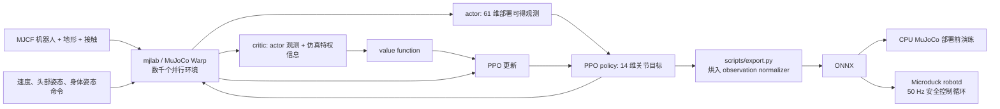

# Open Duck Mini 与 Microduck：从 URDF 模型到双足强化学习走路

这一节带大家拆解两代“小鸭子”开源双足机器人：[Open Duck Mini v2](https://github.com/apirrone/Open_Duck_Mini/tree/v2) 和 [Microduck](https://github.com/pollen-robotics/microduck)。我们不把它们当成同一个仓库里的两个脚本，而是把整条链路看清楚：机器人描述文件从哪里下载，强化学习环境如何组装，PPO 如何学会速度跟踪，以及 checkpoint 为什么必须经过官方导出脚本才能变成真机可用的 ONNX 策略。

学完这一节后，大家应该能够：

- 区分 Open Duck Mini v2、Open Duck Playground、Microduck 和 Microduck RL 四个工程的责任边界；
- 只下载 Open Duck Mini v2 的 URDF 及其 STL 网格，并检查资产是否完整；
- 对 Microduck RL 先跑 `64 个环境 x 5 次迭代` 的 smoke test，再启动正式训练；
- 回放策略、录制仿真视频、导出带观测归一化的 ONNX，并在 CPU MuJoCo 中做部署前演练；
- 理解一个“仿真里会走”的策略距离真机上 50 Hz 稳定走路还缺哪些工程环节。

## 一、先分清四个项目

“Open Duck”项目经过了机械设计、参考动作生成、MuJoCo 强化学习和新一代真机运行时的多次迭代。名字很像，但文件格式和命令不能混用。

| 项目 | 角色 | 机器人描述 | 学习时怎么用 |
| :-- | :-- | :-- | :-- |
| [Open Duck Mini v2](https://github.com/apirrone/Open_Duck_Mini/tree/v2) | 约 42 cm 的开源机械与嵌入式资源中心 | `robot.urdf` 和 `robot.xml`，同目录保存 STL | 学 URDF、机械结构和早期 sim-to-real |
| [Open Duck Reference Motion Generator](https://github.com/apirrone/Open_Duck_reference_motion_generator) | 用 Placo 生成步态参考动作 | 内置多代 Duck 的 URDF 和网格 | 给模仿奖励生成 `polynomial_coefficients.pkl` |
| [Open Duck Playground](https://github.com/apirrone/Open_Duck_Playground) | Open Duck Mini v2 的 MuJoCo Playground/JAX 训练线 | 使用仓库内 MJCF | 复现旧款大鸭子的 walking policy |
| [Microduck RL](https://github.com/pollen-robotics/microduck_rl) + [Microduck](https://github.com/pollen-robotics/microduck) | 新一代约 25 cm、800 g 小鸭子的训练端与真机端 | 训练主线使用 MJCF，不以 URDF 为入口 | 学 `mjlab + MuJoCo Warp + PPO + ONNX + 50 Hz runtime` 完整链路 |

> **关键判断：** 如果你的目标是“下载 URDF 研究机械结构”，从 Open Duck Mini v2 开始；如果目标是“跑当前官方的强化学习训练”，从 Microduck RL 开始。将 Open Duck Mini v2 的 URDF 直接替换进 Microduck RL 不会自动成功，因为关节名、自由度、组件质量、碰撞体和策略的观测/动作契约都不同。

## 二、官方效果先建立直觉

<p align="center">
  
</p>

**图 1 Microduck RL 官方项目总览。** 新一代项目并不只训一个向前走路策略，而是把速度跟踪、起身、坐立、叼取、踢球、前滚翻和轮滑等任务都放进共享的任务注册表中。它们共用 61 维 actor observation 和 14 维 action 契约，因此真机运行时可以在走路、站立和技巧策略之间切换。

<p align="center"><sub>来源：Pollen Robotics 官方 `microduck_rl` 仓库 README 页首图，原项目以 Apache-2.0 许可证发布。</sub></p>

<video controls muted playsinline preload="metadata" width="100%">
  <source src="assets/official_videos/microduck_real_walking.mp4" type="video/mp4">
</video>

**视频 1 Microduck 官方真机走路片段。** 这段素材来自 Microduck RL 官方项目页的真机演示，教程截取了前 20 秒并转为浏览器更易播放的 H.264 MP4。这展示的是官方策略效果，不是本教程在本地重新训练收敛的结果。

<video controls muted playsinline preload="metadata" width="100%">
  <source src="assets/official_videos/open_duck_mini_v2_sim_walking.mp4" type="video/mp4">
</video>

**视频 2 Open Duck Mini v2 官方仿真走路片段。** 这段视频来自 Open Duck Mini v2 项目中“转向 MuJoCo Playground”部分。它对应旧款 42 cm 机器人，不对应新 Microduck 的 14 自由度策略契约。

## 三、从架构图看完整训练链路



**图 2 Microduck RL 的数据流。** 这个架构有五个不能跳过的模块。

### 1. 机器人与执行器模型

Microduck RL 的主要 MJCF 位于：

```text
src/mjlab_microduck/robot/microduck/
├── robot_walk.xml
├── robot_allcollisions.xml
├── robot_allcollisions_rollers.xml
├── robot_*_backlash.xml
└── scene*.xml
```

`robot_walk.xml` 用于速度跟踪，精简了不必要的躯干和头部接触；`robot_allcollisions.xml` 保留身体碰撞，用于起身、坐立、叼取和前滚翻；rollers 版本则增加脚底无驱动轮。训练没有把电机当成理想 PD 执行器，而是使用 [BAM](https://github.com/Rhoban/bam) 的 Dynamixel XL330 执行器模型，加入反电动势、库仑/静摩擦、负载相关摩擦和电池电压等因素。

### 2. 观测、命令和动作契约

新版策略的 actor 输入是 61 维，输出是 14 维关节动作。其中命令槽位固定为：

```text
twist 速度命令 3 维
+ head pose 命令 4 维
+ body pose 命令 6 维
= 13 维命令子向量
```

其余观测来自 IMU、关节位置/速度和历史动作。actor 不使用真机难以可靠获取的 base linear velocity；critic 在训练时可以额外读取这项仿真真值。这是典型的 asymmetric actor-critic：价值网络用更完整的信息加速学习，策略网络保持部署可行。

### 3. 奖励不是“往前走”一项

主任务 `Mjlab-Velocity-Flat-MicroDuck` 的奖励和约束大致可分成：

| 类别 | 代表项 | 作用 |
| :-- | :-- | :-- |
| 任务奖励 | linear/angular velocity tracking | 跟踪 `vx, vy, yaw rate` 命令 |
| 姿态奖励 | upright、pose、head pose tracking | 避免为了速度而倾覆，同时保留头部控制 |
| 步态奖励 | air time、foot clearance、swing height | 促使脚真正离地，避免蹭地滑行 |
| 平滑与安全 | action rate、self collision、foot slip | 抑制高频抖动、自碰撞和过度滑脚 |
| 课程学习 | standing fraction、head-pose range、reward weight | 先学会基本步态，再逐步加大命令范围和规整强度 |

这里最值得学的不是某一个权重，而是奖励项之间的竞争。例如 foot-slip 罚得太重，小机器人原地转向所需的枢轴运动也会被压制；action-rate 从第一步就过重，策略还没学会迈步就被迫保持不动。所以官方配置使用 curriculum，让平滑约束和更大的命令范围在后续阶段逐步引入。

### 4. Sim-to-real 的四层保护

Microduck RL 并不依赖一个完全准确的仿真器，而是同时做四件事：

1. 用 BAM 缩小理想电机与小型舵机之间的执行器差距；
2. 对质量/惯量、质心、摩擦、电压、IMU 安装偏差、编码器零偏和动作延迟做 domain randomization；
3. 提供 `Backlash` 任务变体，用无驱动的被动铰链模拟齿轮回程间隙；
4. 在真机前先用 `infer_policy.py` 重演与 runtime 相同的 observation/action 契约和策略切换。

## 四、推荐主线：训练新 Microduck 走路策略

### 0. 环境前提

官方工程当前要求：

- Linux x86_64 或官方已适配的 Linux ARM 环境；
- NVIDIA CUDA GPU，训练通过 MuJoCo Warp 执行；
- Python `>=3.12,<3.13`，由 `uv` 按 `uv.lock` 创建；
- 正式训练默认使用 Weights & Biases 保存实验和 checkpoint。

先检查 GPU 和基础工具：

```bash
nvidia-smi
git --version
curl --version
```

### 1. 克隆与安装

工作目录：任意不含空格的 Linux 工作区。

```bash
curl -LsSf https://astral.sh/uv/install.sh | sh
source "$HOME/.local/bin/env"

git clone https://github.com/pollen-robotics/microduck_rl.git
cd microduck_rl
uv sync

# 正式训练前登录 W&B，用于记录曲线和 checkpoint
uv run wandb login
```

DGX Spark/GB10 或 Jetson 等 ARM 机器首次下载 CUDA wheel 时，官方建议增大 `uv` 超时：

```bash
export UV_HTTP_TIMEOUT=600
uv sync
```

**Checkpoint 1：**不要立即训练，先确认任务注册表和 CPU 单元测试正常。

```bash
uv run list-envs | grep MicroDuck
uv run --with pytest pytest tests/
```

看到 `Mjlab-Velocity-Flat-MicroDuck` 等任务，且测试通过，只能证明依赖、注册表和配置约束可用，不代表 GPU 训练已经可以长时间稳定运行。

### 2. 必做的五迭代 smoke test

官方维护者在 `AGENTS.md` 里明确建议，长训前先跑 64 个并行环境、5 次 PPO 迭代：

```bash
uv run train Mjlab-Velocity-Flat-MicroDuck \
  --env.scene.num-envs 64 \
  --agent.max_iterations 5
```

**Checkpoint 2：**这个小测试要证明的是：

- MuJoCo Warp 能在 CUDA 上创建并行环境；
- actor observation 和 action 维度与模型一致；
- 每个 reward/termination/event 都能完成一次计算；
- rollout 没有在数步内产生 NaN；
- checkpoint 能够写入 `logs/` 目录。

它不证明策略已经学会走路。5 次迭代时的动作仍然接近随机是正常现象。

### 3. 正式训练

```bash
uv run train Mjlab-Velocity-Flat-MicroDuck \
  --env.scene.num-envs 4096
```

官方 README 给出的经验是，4096 个环境下约 1–2 小时可以看到可用步态，但真正的收敛时间会受 GPU、当前配置、随机种子和 curriculum 影响。不要把这个数字当成硬性保证。

一次正常训练至少应监控：

| 指标 | 应该看什么 | 常见误判 |
| :-- | :-- | :-- |
| mean reward | 长期趋势上升，不是每次迭代都上升 | 只看总奖励，忽略策略在奖励钻空子 |
| episode length | 与当前 curriculum 阶段和摔倒率一起解读 | 越长一定越好 |
| velocity tracking | 线速度和角速度两项都提升 | 只会向前走就当成已掌握转向 |
| penalty terms | 加权后的 penalty 应为非正 | 符号反了，策略通过自碰撞等行为刷分 |
| 动作和姿态视频 | 是否蹭地、屁股跳、头部撑地或高频抖动 | 只看曲线，不看物理行为 |

中断后恢复的官方命令形式为：

```bash
uv run train Mjlab-Velocity-Flat-MicroDuck \
  --env.scene.num-envs 4096 \
  --agent.run-name resume \
  --agent.load-checkpoint model_29999.pt \
  --agent.resume True
```

### 4. 回放与录制走路视频

官方 quickstart 使用 W&B run path 定位 checkpoint：

```bash
uv run play Mjlab-Velocity-Flat-MicroDuck \
  --wandb-run-path <entity/project/run_id>
```

如果需要保留视频，导出脚本本身提供 `--video`、`--video-length`、`--video-width` 和 `--video-height` 参数：

```bash
uv run scripts/export.py Mjlab-Velocity-Flat-MicroDuck \
  --wandb-run-path <entity/project/run_id> \
  --video \
  --video-length 600 \
  --video-width 1280 \
  --video-height 720 \
  --onnx-file output.onnx
```

录像会写到 checkpoint 日志目录下的 `videos/play/`。它是检查步态物理行为的证据，不能用总奖励曲线替代。

### 5. 导出 ONNX 与 CPU MuJoCo 演练

```bash
uv run scripts/export.py Mjlab-Velocity-Flat-MicroDuck \
  --wandb-run-path <entity/project/run_id> \
  --onnx-file output.onnx

uv run scripts/infer_policy.py --walking output.onnx
```

`scripts/export.py` 不只是把 PyTorch 网络改个后缀。它会把训练时的 observation normalizer 烘入 ONNX 计算图。手工转换 checkpoint 即使维度对得上，也可能因为输入未归一化而在部署时完全失效。

`infer_policy.py` 支持键盘速度命令，也能同时加载 walking、standing、sit-stand 和 roulade 等策略：

```bash
uv run scripts/infer_policy.py \
  --walking walk.onnx \
  --standing stand.onnx \
  --sitstand sitstand.onnx \
  --roulade roulade.onnx \
  --new-cmd-obs
```

这一步要检查三件事：ONNX 输入/输出是否为 `[1,61] -> [1,14]`，命令槽位是否与 runtime 一致，策略切换时是否出现姿态突跳。

### 6. 真机部署边界

Microduck 真机仓库中的 `robotd` 以 50 Hz 运行，读取 IMU 和舵机状态，生成 61 维观测，调用 ONNX 策略，再将 14 维动作变成关节目标。但从 `output.onnx` 到真机之间仍然必须有：

- 关节顺序、方向、零位和限位校验；
- IMU 坐标系和安装偏差校准；
- 失联、过温、跌倒、异常动作幅度和策略加载失败保护；
- 悬空小幅度测试、支撑架测试、带保护绳落地测试，最后才是自由走路。

因此，本节的命令到 CPU MuJoCo 演练为止。没有完成上述硬件校准和安全门禁时，不应将新策略直接写入真机。

## 五、下载 Open Duck Mini v2 URDF 和完整网格

Open Duck Mini v2 的 `robot.urdf` 不是单文件模型。它包含 21 个 link、20 个 joint，并引用同目录下的 45 类 STL 网格。只在 GitHub 网页上下载 `robot.urdf`，加载时会出现 `body_front.stl not found` 一类错误。

### 方式 A：稀疏克隆机器人模型目录

```bash
git clone --depth 1 --filter=blob:none --sparse --branch v2 \
  https://github.com/apirrone/Open_Duck_Mini.git
cd Open_Duck_Mini
git sparse-checkout set mini_bdx/robots/open_duck_mini_v2
```

下载后的关键文件为：

```text
Open_Duck_Mini/mini_bdx/robots/open_duck_mini_v2/
├── robot.urdf
├── robot.xml
├── robot_motors.xml
├── config.json
├── *.stl
└── *.part
```

用下面的命令做完整性检查：

```bash
MODEL_DIR=mini_bdx/robots/open_duck_mini_v2
test -f "$MODEL_DIR/robot.urdf"
test "$(find "$MODEL_DIR" -maxdepth 1 -name '*.stl' | wc -l)" -gt 0
grep -n 'mesh filename' "$MODEL_DIR/robot.urdf" | head
```

URDF 中的网格路径写成 `package:///body_front.stl` 这类形式。不同加载器对空 package 名的解析有差异；如果查看器找不到网格，应先把 package/resource root 指向这个模型目录，而不是删掉所有 mesh 引用。

在已安装 ROS 的环境中，可先做 XML/连杆树检查：

```bash
check_urdf "$MODEL_DIR/robot.urdf"
```

`check_urdf` 通过不代表网格路径、惯量、碰撞体和关节方向已经在目标仿真器中验证，它只是第一道结构检查。

### 方式 B：下载参考动作仓库中的 URDF

如果目标是生成模仿学习参考轨迹，直接克隆 reference-motion 仓库更合适。该仓库使用 Git LFS：

```bash
sudo apt update
sudo apt install -y git-lfs
git lfs install

git clone https://github.com/apirrone/Open_Duck_reference_motion_generator.git
cd Open_Duck_reference_motion_generator
git lfs pull

uv run scripts/auto_waddle.py -j4 \
  --duck open_duck_mini_v2 \
  --sweep

uv run scripts/fit_poly.py --ref_motion recordings/
uv run scripts/replay_motion.py -f recordings/<motion-file>.json
```

`-j` 后应显式给出并行数，例如 `-j4`。官方 README 特别提醒，单独使用 `-j` 会尝试占用全部 CPU 核心，普通机器可能因内存和调度压力失去响应。

## 六、复现旧 Open Duck Mini v2 训练线

如果大家的目标就是 42 cm Open Duck Mini v2，应使用与它配套的 Open Duck Playground，而不是新 Microduck 任务。

```bash
git clone https://github.com/apirrone/Open_Duck_Playground.git
cd Open_Duck_Playground

curl -LsSf https://astral.sh/uv/install.sh | sh
source "$HOME/.local/bin/env"

uv run playground/open_duck_mini_v2/runner.py \
  --task flat_terrain_backlash \
  --num_timesteps 300000000
```

回放导出的 ONNX：

```bash
uv run playground/open_duck_mini_v2/mujoco_infer.py \
  -o <path-to-policy.onnx>
```

如果要启用模仿奖励，需要将上一节生成的 `polynomial_coefficients.pkl` 复制到：

```text
playground/open_duck_mini_v2/data/polynomial_coefficients.pkl
```

然后在 `playground/open_duck_mini_v2/joystick.py` 中将 `USE_IMITATION_REWARD` 设为 `True`。这是一条独立的旧款机器人复现线，不应把它的 checkpoint 直接放到新 Microduck `robotd` 中。

## 七、常见失败与排查

| 现象 | 根因 | 处理 |
| :-- | :-- | :-- |
| `uv sync` 下载 CUDA wheel 超时 | ARM 首次需下载数 GB 依赖 | `export UV_HTTP_TIMEOUT=600` 后重试 |
| 训练启动时找不到 GPU | 安装了 CPU-only PyTorch，或 CUDA/driver 不可用 | 检查 `nvidia-smi` 和 `uv run python -c "import torch; print(torch.cuda.is_available())"` |
| URDF 只显示坐标轴，没有机器人外观 | 只下载了 `robot.urdf`，或 resource root 错误 | 下载整个 `open_duck_mini_v2/` 目录，将资源根指向 STL 所在目录 |
| 训练 reward 上升但机器人不走 | 奖励钻空子，例如原地晃动或局部擦地 | 录制回放，分项检查 tracking、air-time、slip 和 action-rate |
| 仿真回放正常，手工导出的 ONNX 失效 | observation normalizer 没有进入计算图 | 只用 `scripts/export.py` 导出 |
| 策略在真机上高频抖动 | 动作延迟、关节顺序、零位或执行器动力学不匹配 | 退回 CPU MuJoCo 演练和悬空小幅度测试，不要在地面上继续试错 |
| Reference generator 提示 STL storage representation 错误 | Git LFS 网格未拉取 | 在仓库中执行 `git lfs pull` |

## 八、建议的学习顺序

1. 先看本节的两段官方视频，明确真机和仿真的目标效果。
2. 稀疏克隆 Open Duck Mini v2 模型目录，弄清 URDF、STL、link 和 joint 的对应关系。
3. 在 Microduck RL 中跑通 CPU tests 和 `64 env x 5 iterations` smoke test。
4. 启动 4096 环境正式训练，同时看分项奖励和行为视频。
5. 使用官方导出脚本生成 ONNX，在 CPU MuJoCo 里演练键盘控制和策略切换。
6. 只有在观测契约、关节标定和硬件安全机制都通过后，才进入真机。

## 九、参考资料与素材来源

- [Pollen Robotics Microduck 真机运行时](https://github.com/pollen-robotics/microduck)
- [Pollen Robotics Microduck RL](https://github.com/pollen-robotics/microduck_rl)
- [Open Duck Mini v2](https://github.com/apirrone/Open_Duck_Mini/tree/v2)
- [Open Duck Playground](https://github.com/apirrone/Open_Duck_Playground)
- [Open Duck Reference Motion Generator](https://github.com/apirrone/Open_Duck_reference_motion_generator)
- [BAM: Better Actuator Models](https://github.com/Rhoban/bam)
- [mjlab](https://github.com/mujocolab/mjlab)
- [MuJoCo Playground](https://github.com/google-deepmind/mujoco_playground)

本节两段视频和页首图均来自上述官方项目页；视频仅做格式转换、缩放和片段截取，未改变实验内容。Open Duck Mini、Microduck 和 Microduck RL 仓库均以 Apache-2.0 许可证发布；使用前仍应以各仓库当前的 `LICENSE` 和第三方资产声明为准。
