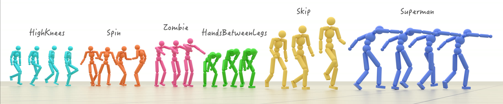
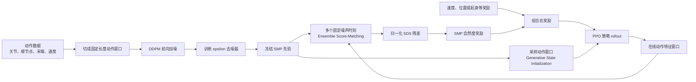

# SMP：用可复用分数匹配运动先验训练人形机器人

这一节介绍 [SMP（Score-Matching Motion Priors）](https://yxmu.foo/smp-page/)：先用动作数据训练一个小型扩散模型，再冻结它，把它变成强化学习阶段的“动作自然度奖励”。这样，同一个运动先验可以重复服务于速度跟踪、转向、目标位置、躲避、物体交互等不同任务，而不必为每个新任务重新训练一个判别器。

本节同时讲清楚两套容易混淆的代码：

- [xbpeng/MimicKit](https://github.com/xbpeng/MimicKit) 是论文作者发布的原始参考实现；
- [SUZ-tsinghua/smp](https://github.com/SUZ-tsinghua/smp) 是基于 `mjlab` 的 Unitree G1 课程复现，提供 G1 特征管线、四个任务和三个预训练运动先验。

学完后，大家应该能够回答四个问题：SMP 为什么不是普通动作生成器；扩散模型如何变成 PPO 奖励；ESM、Adaptive Normalization 和 GSI 分别解决什么问题；怎样使用清华复现仓库先跳过先验预训练，直接进入 G1 强化学习。

## 一、先给结论：它解决了什么问题

传统 AMP 一类对抗式运动先验通常把判别器和当前策略一起训练。换一个下游任务，策略访问到的状态分布会变化，判别器往往也要重新训练，并继续读取原始动作数据。SMP 把这两个阶段拆开：

1. **先验预训练：**只看动作窗口，训练扩散去噪网络学习“自然动作分布”；
2. **下游控制：**冻结扩散模型，用它评估策略动作是否靠近该分布，再把分数作为 PPO 奖励；
3. **任务复用：**更换速度、方向、位置或交互目标时，只替换任务奖励和环境，不必重新训练运动先验。

因此，SMP 的核心不是“用扩散模型直接逐帧控制机器人”，而是：

> **用冻结扩散模型给一段动作窗口打分，再用这个分数约束强化学习策略。**

论文项目页展示了单一先验服务多任务、100 多种风格、风格组合、人体与物体联合动作以及 G1 真机迁移。论文已收入 SIGGRAPH 2026 对应的 ACM Transactions on Graphics 论文集；arXiv 当前版本为 2026 年 4 月更新的 v3。

## 二、先看官方效果

<p align="center">
  
</p>

**图 1 SMP 官方多风格动作示例。** 不同颜色对应不同动作风格。这里展示的是冻结先验可以约束多种自然动作，而不是让每个任务单独拟合一条参考轨迹。

<p align="center"><sub>来源：SMP 官方代码仓库 `xbpeng/MimicKit`。原图仅做网页尺寸压缩。</sub></p>

<video controls muted playsinline preload="metadata" width="100%">
  <source src="assets/official_videos/smp_pipeline.mp4" type="video/mp4">
</video>

**视频 1 SMP 官方方法流程。** 动作扩散模型先在参考动作上预训练；PPO 阶段加入噪声，让冻结去噪器预测该噪声，预测残差再转成运动先验奖励。视频来自论文项目页，已转为浏览器兼容的 H.264 MP4。

<video controls muted playsinline preload="metadata" width="100%">
  <source src="assets/official_videos/g1_forward.mp4" type="video/mp4">
</video>

**视频 2 清华复现的 G1 前进任务。** 该任务在代码中采样 `0.5-5.0 m/s` 的目标速度。这个区间是命令配置，不等价于“所有回合均稳定达到 5 m/s”，实际速度仍需从 rollout 日志逐回合测量。

<video controls muted playsinline preload="metadata" width="100%">
  <source src="assets/official_videos/g1_steering.mp4" type="video/mp4">
</video>

**视频 3 清华复现的 G1 转向任务。** 目标速度方向与身体朝向可以不同，策略不仅要移动，还要在 SMP 约束下形成较自然的侧步和交叉步。

<p align="center"><sub>视频 2、3 来源：`SUZ-tsinghua/smp` 仓库的 `assets` 分支；GIF 已转为 H.264 MP4。</sub></p>

## 三、整体架构：扩散先验如何进入 PPO



**图 2 SMP 的训练与复用链路。** 上半部分只训练一次运动扩散先验；下半部分可以针对多个任务重复运行。冻结先验同时承担动作打分和状态初始化两项职责。

这套架构可以拆成六个模块。

### 1. 动作窗口表示

扩散模型不直接读取渲染图像，而是读取连续若干帧的结构化运动状态。清华 G1 复现默认使用 10 帧窗口，每帧 59 维：

```text
root_pos(3)
+ root_rot(6)
+ joint_pos(29)
+ end_effector_pos(15)
+ root_linear_velocity(3)
+ root_angular_velocity(3)
= 59 dimensions / frame
```

五个末端点是左右脚、躯干以及左右手。空间量统一变换到窗口最后一帧的 yaw 局部坐标系，根位置也相对最后一帧处理。这个设计移除了世界坐标中的平移和全局朝向，使先验关注“身体怎样运动”，而不是“机器人在仿真网格的哪个位置”。

### 2. DDPM 噪声预测器

给标准化动作窗口 $x_0$ 加入高斯噪声：

$$
x_t=\sqrt{\bar\alpha_t}x_0+\sqrt{1-\bar\alpha_t}\epsilon,
\qquad \epsilon\sim\mathcal N(0,I).
$$

去噪器 $\epsilon_\theta(x_t,t)$ 的预训练目标是恢复真实噪声。清华复现使用 L1 噪声预测损失；关键不是从头生成一条完整动作，而是让网络学会不同噪声尺度下动作数据分布的局部方向。

### 3. SDS：把去噪误差变成奖励

策略产生新的动作窗口后，同样进行加噪并计算：

$$
e_t(x_0)=\left\|\epsilon_\theta(x_t,t)-\epsilon\right\|^2.
$$

如果窗口靠近训练动作流形，冻结去噪器更容易判断加入了什么噪声，残差通常较小；不自然、失衡或脱离动作分布的窗口会得到较大残差。残差经过指数映射形成非负奖励：

$$
r_{\mathrm{SMP}}(x_0)=
\exp\left(-\lambda\,\bar e(x_0)\right).
$$

这里不是让 PPO 对扩散模型反向传播。扩散模型始终冻结，PPO 仍通过策略梯度优化自己的动作分布。

### 4. ESM：一次评估多个噪声时刻

单独随机采一个扩散时刻 $t$，奖励方差会很大：低噪声更关注动作细节，高噪声更关注整体结构，不同 batch 抽到的尺度不同会让 PPO 的 value target 抖动。Ensemble Score-Matching（ESM）使用固定时刻集合 $K$ 聚合残差：

$$
\bar e(x_0)=\frac{1}{|K|}\sum_{t\in K}
\frac{e_t(x_0)}{\mu_t+\varepsilon}.
$$

清华复现默认选取 `(8, 15, 22)` 三个时刻。多尺度平均降低了奖励估计方差，也避免为每一步遍历全部扩散时刻。

### 5. Adaptive Normalization：让不同噪声层可比较

不同 $t$ 的原始 SDS 误差量级差别很大，不同先验 checkpoint 的尺度也会变化。直接求平均会让某个误差天然较大的时刻主导奖励。SMP 为每个时刻维护运行均值 $\mu_t$，先按尺度归一化再聚合，减少重新调节 `sds_loss_scale` 的工作量。

这也解释了为什么清华复现强调 `datasets/norm_stats.npz`：动作特征还需要用足够宽的数据分布计算 q01/q99，再映射到 `[-1,1]`。如果只用很窄的几条动作估计范围，PPO 探索到分布外状态时特征会过早饱和，先验恰好在最需要提供纠偏信号的位置失真。

### 6. GSI：从先验采样初始状态

Generative State Initialization（GSI）让冻结扩散模型生成动作窗口，用最后一帧初始化仿真状态，并用完整窗口预热在线特征缓存。它有两个作用：

- 让策略从站立、迈步、跑动或倒地后的多样状态开始探索，而不是永远从单一 T-pose 起步；
- 第一个环境 step 就拥有完整动作窗口，SMP 奖励不会因为历史帧为空而失效。

原始 MimicKit 的多动作任务默认开启 GSI，因此下游策略训练不再读取原始动作文件。这里的“不读取”只指下游 PPO 阶段；扩散先验本身仍然必须先用动作数据训练。

## 四、原论文与 G1 复现的关键差异

| 项目 | 原始 SMP / MimicKit | `SUZ-tsinghua/smp` G1 复现 |
| :-- | :-- | :-- |
| 角色 | 论文参考实现 | 基于 `mjlab` 的课程复现 |
| 机器人 | 论文中的多种角色与任务，包含 G1 真机展示 | Unitree G1 仿真任务配置 |
| 仿真入口 | Isaac Gym / Isaac Lab / Newton 等 MimicKit 后端 | `mjlab` 固定 revision + MuJoCo |
| 先验奖励组合 | $w_t r_{task}+w_s r_{SMP}$ | $r_{task}\times r_{SMP}$ |
| 已带先验 | MimicKit 提供论文配置和部分模型 | 仓库直接附带 3 个约 2.8 MB 的 G1 先验 |
| 下游任务 | 位置、转向、躲避、单动作模仿等 | 前进、转向、目标位置、起身 |
| G1 目标 | 论文含 sim-to-real 演示 | README 明确定位为课程复现，不是完整真机部署栈 |

原论文使用加法奖励，可以独立控制任务完成度和动作先验的权重：

$$
r=w_{task}r_{task}+w_{SMP}r_{SMP}.
$$

G1 复现有意改成乘法门控：

$$
r=r_{task}\cdot r_{SMP}.
$$

乘法的直觉是“任务做对并且动作自然”才有高奖励，减少一个任务与先验权重比；代价是任一项接近零都会压低总奖励，早期探索可能更依赖 GSI 和奖励尺度。阅读结果时必须注明这不是论文原始配方。

## 五、G1 复现仓库的代码模块

克隆后最重要的目录如下：

```text
smp/
├── datasets/
│   ├── pretrain_ckpt/        # 3 个随仓库发布的冻结先验
│   └── norm_stats.npz        # 动作特征 q01/q99
├── scripts/
│   ├── csv_to_npz.py         # CSV 重放、FK、插值和窗口化
│   ├── compute_norm_stats.py # 计算特征分位数
│   ├── pretrain.py           # 训练 DDPM epsilon predictor
│   ├── train.py              # 注册 SMP 任务并调用 mjlab train
│   └── play.py               # 加载 W&B run 回放策略
└── src/smp/
    ├── pretrain/             # 数据集、去噪器和扩散调度器
    └── rl/
        ├── events.py         # 先验加载、GSI reset/refresh
        ├── rewards.py        # ESM SDS 奖励与 task x SMP
        ├── utils.py          # 59 维 MotionFeatureBuffer
        └── tasks/            # Forward/Steering/Location/Getup
```

三个预训练先验已经和任务配置绑定：

| checkpoint | 训练动作 | 默认服务的任务 |
| :-- | :-- | :-- |
| `pretrained_loco.pt` | walk / jog / run | `Smp-Forward-G1` |
| `pretrained_lafan_run.pt` | LAFAN run 子集 | `Smp-Steering-G1`、`Smp-Location-G1` |
| `pretrained_getup_f2s2.pt` | fall-to-stand | `Smp-Getup-G1` |

这意味着第一次体验不需要下载 LAFAN1，也不需要先跑 10000 个 epoch 的扩散预训练。

## 六、最快复现：直接使用随仓库发布的先验

### 0. 环境边界

建议使用 Linux、NVIDIA GPU 和可用的 CUDA 驱动。项目要求 Python `>=3.10,<3.14`，依赖由 `uv.lock` 锁定，其中 `mjlab` 固定到特定 Git revision。仓库没有提供 Windows 原生运行说明，也没有承诺 AMD ROCm 训练链路。

以下命令都在普通 Linux 工作区运行：

```bash
curl -LsSf https://astral.sh/uv/install.sh | sh
source "$HOME/.local/bin/env"

git clone https://github.com/SUZ-tsinghua/smp.git
cd smp
uv sync
```

**Checkpoint 1：** 确认三个先验确实下载到了普通 Git 工作树，而不是 Git LFS 指针：

```bash
ls -lh datasets/pretrain_ckpt/*.pt
uv run python -c "import torch; print(torch.cuda.is_available(), torch.__version__)"
```

当前三个 `.pt` 文件各约 2.8 MB。若文件只有几 KB，应重新检查克隆是否完整。

### 1. 五次迭代 smoke test

先缩小并行环境和训练迭代数，只验证数据流：

```bash
uv run scripts/train.py Smp-Forward-G1 \
  --env.scene.num-envs=64 \
  --agent.max-iterations=5
```

如果当前 `mjlab` CLI 将下划线参数原样暴露，可用 `--agent.max_iterations=5`；以 `uv run scripts/train.py --help` 输出为准。

这个 smoke test 只证明以下链路可以工作：环境创建、G1 先验加载、GSI 初始化、59 维窗口更新、三时刻 ESM、PPO 反向传播和 checkpoint 写入。五次迭代不可能证明机器人已经学会稳定跑步。

### 2. 正式训练

```bash
uv run scripts/train.py Smp-Forward-G1 \
  --env.scene.num-envs=4096
```

替换任务名即可训练其他能力：

```bash
uv run scripts/train.py Smp-Steering-G1 --env.scene.num-envs=4096
uv run scripts/train.py Smp-Location-G1 --env.scene.num-envs=4096
uv run scripts/train.py Smp-Getup-G1 --env.scene.num-envs=4096
```

默认 RL 配置的最大迭代数为 30000。正式实验至少保存以下曲线：任务奖励、SMP 奖励、原始 SDS error、episode length、目标速度与实际速度。只看总 reward 无法判断策略是在真正跟踪速度，还是被先验奖励主导。

### 3. 回放策略

训练结果默认写入 `logs/` 并通过 W&B 记录。使用 run path 回放：

```bash
uv run scripts/play.py Smp-Forward-G1 \
  --wandb-run-path <org>/<project>/<run> \
  --num-envs 4
```

需要保留可复核的视频时，可直接使用 `mjlab` 回放入口的录像参数：

```bash
uv run scripts/play.py Smp-Forward-G1 \
  --wandb-run-path <org>/<project>/<run> \
  --num-envs 1 \
  --video \
  --video-length 600 \
  --video-width 1280 \
  --video-height 720
```

视频会保存到 checkpoint 所在 run 的 `videos/play/`。如果 checkpoint 已经在本地，也可以把 `--wandb-run-path` 替换为 `--checkpoint-file /path/to/model.pt`。

**Checkpoint 2：** 回放时同时观察目标箭头、实际前进方向、脚底滑动、上身抖动和摔倒恢复。对“5 m/s”应记录实际根节点速度的时间均值、标准差和成功回合比例，而不是只根据命令范围或单段视频下结论。

## 七、完整路线：从 LAFAN1 训练自己的先验

只有当大家要更换动作风格、特征表示或机器人形态时，才需要走完整路线。

### 1. 下载 G1 重定向动作

```bash
uv pip install -U huggingface_hub

hf download lvhaidong/LAFAN1_Retargeting_Dataset \
  --repo-type dataset \
  --include "g1/*.csv" \
  --local-dir datasets/csv/_lafan_dl

mkdir -p datasets/csv/lafan
mv datasets/csv/_lafan_dl/g1/*.csv datasets/csv/lafan/
```

`csv_to_npz.py` 只扫描输入目录第一层的 `*.csv`，所以不能把文件留在嵌套的 `g1/` 子目录中。

### 2. CSV 重放、插值和窗口化

```bash
uv run scripts/csv_to_npz.py \
  --input-dir datasets/csv/lafan \
  --output-dir datasets/npz/lafan
```

脚本按 G1 的 29 个关节顺序读取无表头 CSV，在 MuJoCo 中做 forward kinematics，将 30 fps 插值到 50 fps，再切成 `(N, 10, 59)` 窗口。输出为每条动作一个压缩 NPZ。

### 3. 计算标准化统计量

```bash
uv run scripts/compute_norm_stats.py \
  --input-dir datasets/npz/lafan \
  --output datasets/norm_stats.npz
```

默认计算逐特征 q01/q99。除非改变了 59 维特征布局，否则优先保留仓库用完整 LAFAN G1 数据计算的统计量；不要只用一条跑步动作覆盖它。

### 4. 训练扩散先验

以仓库 README 的前进先验配置为例：

```bash
uv run scripts/pretrain.py \
  --data-dir datasets/npz/forward/ \
  --num-layers 2 \
  --no-use-ema \
  --save-interval 5000 \
  --num-epochs 10000 \
  --train-split 1.0 \
  --d-model 128
```

最终先验会写到 `logs/pretrain/<name>/<timestamp>/pretrained.pt`。将新 checkpoint 接入任务时，必须同时核对窗口长度、特征维数、q01/q99、关节顺序、末端点顺序和控制频率；模型能成功 `load_state_dict` 不代表这些语义契约一致。

## 八、论文原始 MimicKit 怎么跑

如果目标是复现论文配方、风格组合或 dodgeball，而不是 G1 课程实现，应使用 MimicKit：

```bash
git clone https://github.com/xbpeng/MimicKit.git
cd MimicKit
# 按仓库 README 选择并安装 Isaac Gym、Isaac Lab 或 Newton 后端
pip install -r requirements.txt
```

随后还要从 [MimicKit README 给出的官方数据包](https://github.com/xbpeng/MimicKit#installation) 下载角色资产、预训练模型和动作数据，并解压到仓库的 `data/`。只克隆代码仓库不足以运行下面的训练命令。

使用预训练 LaFAN1 先验训练 location 策略的官方命令为：

```bash
python mimickit/run.py \
  --mode train \
  --num_envs 4096 \
  --engine_config data/engines/isaac_gym_engine.yaml \
  --env_config data/envs/smp_location_humanoid_env.yaml \
  --agent_config data/agents/smp_task_humanoid_agent.yaml \
  --visualize false \
  --out_dir output/
```

训练新先验的入口为：

```bash
python tools/diffusion_model/train_tinymdm.py \
  --cfg_path tools/diffusion_model/config/tinymdm_multi_clip.yaml \
  --out_dir output/smp_prior
```

然后在 agent 配置中更新：

```yaml
smp_prior_cfg: output/smp_prior/diffusion_config.yaml
smp_prior_model: output/smp_prior/model.pt
```

MimicKit 的 `docs/README_SMP.md` 给出的调参优先级是：

```text
smp_reward_weight > sds_loss_scale >= diffusion_steps
```

它反映的是原论文的加法奖励，不应直接套到清华复现的乘法奖励上。

## 九、常见问题

| 现象 | 优先检查 | 原因 |
| :-- | :-- | :-- |
| `uv sync` 卡在 `mjlab` | GitHub 连接、锁定 revision、CUDA wheel | 项目依赖包含 Git revision，不是纯 PyPI 安装 |
| 找不到动作 CSV | CSV 是否直接位于 `--input-dir` | 转换脚本不递归扫描子目录 |
| checkpoint 能加载但 SMP reward 异常 | feature dim、window size、q01/q99、控制频率 | 先验和环境存在隐含语义契约 |
| reward 很快接近零 | 检查 GSI、特征饱和和 SDS running mean | 乘法奖励会放大先验评分失效的影响 |
| reward 上升但实际速度不高 | 分开画 target speed 与 root velocity | `0.5-5.0 m/s` 是命令范围，不是实测保证 |
| 仿真效果好，真机不可用 | 动力学随机化、观测契约、延迟和安全层 | 清华仓库是 G1 仿真复现，不是完整部署系统 |

## 十、这个方法的价值与边界

SMP 最有价值的地方是把动作数据压缩成一个可冻结、可复用的 reward model。相比每个任务重新训练判别器，它更模块化；相比严格逐帧跟踪参考动作，它又给任务策略保留了发现新步态和新动作组合的空间。项目页中“3 秒数据学习连续速度变化”“一个先验服务多个任务”正是在验证这两点。

但需要保留三条边界：

1. **先验不是物理仿真器。** 接触、动力学和任务成败仍由 MuJoCo、Isaac Gym 等环境计算；
2. **自然不等于正确。** SMP 只约束动作分布，仍需任务奖励说明要去哪里、跑多快、是否拿到物体；
3. **仿真复现不等于真机系统。** 真机还需要观测对齐、执行器模型、延迟随机化、安全控制和系统辨识。

## 十一、推荐学习顺序

1. 先看图 2 和视频 1，理解“扩散模型作为奖励”而不是“扩散模型直接控制”。
2. 克隆 `SUZ-tsinghua/smp`，直接用附带先验跑 64 环境 smoke test。
3. 阅读 `src/smp/rl/rewards.py`，对照 ESM、Adaptive Normalization 和乘法奖励公式。
4. 回放前进和转向策略，分别记录命令速度与实际速度。
5. 最后再下载 LAFAN1、训练新先验，并尝试更换动作风格或机器人特征。

## 十二、参考资料

- [SMP 官方项目页](https://yxmu.foo/smp-page/)
- [SMP 论文：arXiv:2512.03028](https://arxiv.org/abs/2512.03028)
- [论文原始代码：xbpeng/MimicKit](https://github.com/xbpeng/MimicKit)
- [Unitree G1 课程复现：SUZ-tsinghua/smp](https://github.com/SUZ-tsinghua/smp)
- [LAFAN1 G1 重定向数据集](https://huggingface.co/datasets/lvhaidong/LAFAN1_Retargeting_Dataset)
- [mjlab](https://github.com/mujocolab/mjlab)
- [本节线索来源：小红书“开源｜最快 5 m/s，浅尝 SMP”](https://www.xiaohongshu.com/explore/6a8cf8eb0000000010022cf6)

本节引用的图片和视频均来自论文项目页或上述官方代码仓库，并在图注中标明来源。教程只做格式转换和网页尺寸压缩，不把第三方转载视频作为方法证据。
