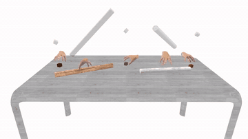
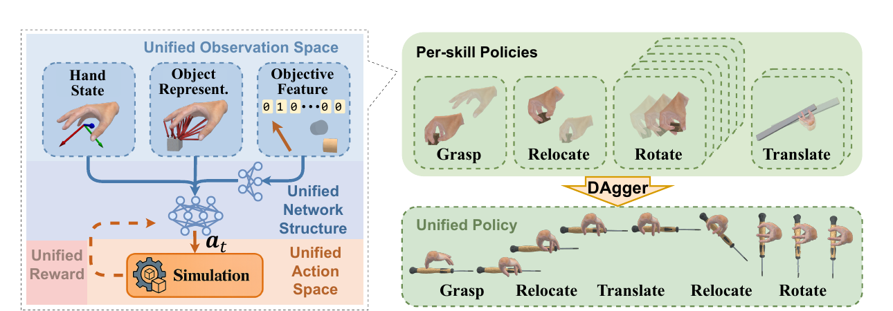
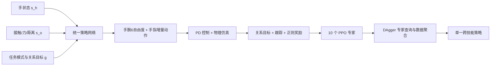
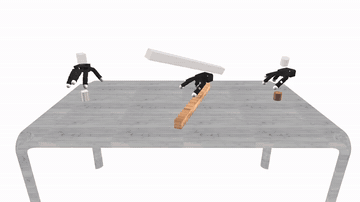
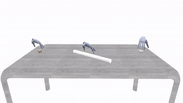
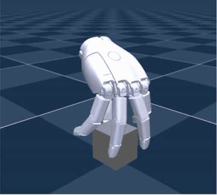

# UniCross：用统一关系表述串联抓取、搬移与手内操作

[UniCross](https://zdchan.github.io/UniCross/) 的全名是 *Unified Cross-Skill Dexterous Manipulation Synthesis*。它研究的不是“如何再训练一个抓取策略”，而是更基础的问题：抓取、搬移、手内旋转和手内平移能否写成同一种任务，从而让一个策略连续完成多段灵巧操作。

这篇工作适合放在强化学习与灵巧操作章节，而不是 VLA 或世界模型章节。它的输入是结构化的手部、物体和目标状态，输出是手腕与手指关节命令；训练依赖物理仿真、PPO 和 DAgger，没有语言模型、图像语言模型或未来视频生成模块。

学完本节后，应该能够回答四个问题：

- UniCross 为什么不直接把四种技能分别训练、运行和切换；
- “手-物关系运动”如何统一四种接触模式差异很大的技能；
- 十个 PPO 专家为什么可以用普通 DAgger 蒸馏到一个同结构策略；
- 论文结果证明了什么，以及当前公开材料还不能支持哪些复现操作。

## 一、论文与公开资源

| 资源 | 地址 | 当前作用 |
| :-- | :-- | :-- |
| 项目主页 | [zdchan.github.io/UniCross](https://zdchan.github.io/UniCross/) | 官方视频、方法概览和跨手型结果 |
| 论文 | [arXiv:2607.28198](https://arxiv.org/abs/2607.28198) | 完整方法、实验、消融和超参数 |
| 代码 | 项目页的 `Code` 按钮当前仍是占位入口 | 暂时不能据此提供可信的克隆与运行命令 |

截至 2026 年 9 月 4 日，项目页已经公开论文和大量结果视频，并展示了 Isaac Gym、Isaac Lab 与 mjlab 中的效果；但 `Code` 按钮尚未指向可用仓库。因此，本节是方法导读和复现准备清单，不把尚未公开的工程目录或命令写成已经可运行的教程。

## 二、先看它到底统一了什么

**视频 1 UniCross 的连续技能组合。** 同一个策略依次完成抓取、搬移和手内操作。关键不只是每一段都能成功，而是上一段结束时的手-物状态可以直接成为下一段的有效初始状态。来源：[UniCross 官方项目页](https://zdchan.github.io/UniCross/)。

论文把“物体始终由手稳定约束”的灵巧操作拆成四类关系运动：

| 技能 | 保持不变的关系 | 需要改变的关系 | 直观含义 |
| :-- | :-- | :-- | :-- |
| Grasp 抓取 | 物体在根坐标系中的姿态 | 手在根坐标系中的位置 | 手接近并包住静止物体 |
| Relocate 搬移 | 物体相对手的位姿 | 手与物体在根坐标系中的位姿 | 抓稳后靠手腕把物体送到目标位姿 |
| Rotate 手内旋转 | 手腕根坐标系位姿、物体相对手的位置 | 物体相对手的朝向 | 手腕不动，手指换接触让物体绕指定轴转动 |
| Translate 手内平移 | 手腕根坐标系位姿、物体相对手的朝向 | 物体相对手的位置 | 手腕不动，物体沿指定轴在手内滑移 |

这个视角绕开了“每种接触模式单独写任务”的惯性。抓取需要建立接触，旋转和平移需要不断重构接触，表面上差异很大；但它们都可以写成“跟踪某些手-物关系、固定另一些关系、释放剩余自由度”。统一由此发生在任务表述层，而不是事后把四个完全不同的策略强行拼接。

## 三、从架构图拆解完整数据流

  

**图 1 UniCross 总体框架。** 左侧用统一观测、网络、动作和奖励训练每项技能；右侧先得到十个专家，再通过 DAgger 聚合成一个统一策略。来源：[UniCross 官方论文 Figure 2](https://arxiv.org/abs/2607.28198)。

### 1. 统一观测不是简单拼一个 skill ID

策略观测写成：

$$
o_t=(s_t^h,s_t^o,g_t).
$$

其中三部分分别承担不同职责。

**手状态 $s_t^h$。** 它包含当前关节位置 $q_t$ 和上一步目标关节位置 $q_{t-1}^{target}$。后者让策略知道执行器刚刚被要求做什么，减少只看当前位置时的时序歧义。

**交互感知物体表述 $s_t^o$。** 对每个手部 link，模型读取：

- 是否接触物体的二值状态 $c_t$；
- 接触力幅值 $f_t$；
- 该 link 到物体表面最近点的三维距离向量 $v_t$。

这不是直接输入物体类别或完整 mesh。距离向量描述局部几何，接触和力描述当前约束状态；两者一起告诉策略“哪根手指靠近哪里、是否已经接触、抓得多紧”。论文消融中去掉 contact 后，旋转成功率从 `98.8%` 降到 `82.7%`，平均旋转量从 `13.6 rad` 降到 `8.78 rad`，说明动态手内操作尤其依赖接触状态。

**关系目标 $g_t$。** 这是 55 维目标特征：

$$
g_t=[I_t,d_t^h,g_t^{current},g_t^{target}].
$$

$I_t$ 是十种专家模式的 one-hot 编码，$d_t^h$ 是手坐标系中的三维目标轴，后两项分别描述当前和目标的手-物多坐标系位姿。十种模式来自 `1 个抓取 + 1 个搬移 + 6 个旋转方向 + 2 个平移方向`。

### 2. 为什么同时使用 hand frame 和 root frame

只在世界坐标系写目标，会让策略把全局位置变化误当成技能本身；只在手坐标系写目标，又无法描述手腕应该把物体搬到哪里。UniCross 同时维护：

- 物体在手坐标系中的位置与姿态 $(x_o^h,q_o^h)$；
- 物体在根坐标系中的位置与姿态 $(x_o^r,q_o^r)$；
- 手在根坐标系中的位置与姿态 $(x_h^r,q_h^r)$。

根坐标系在每个 episode 开始时由初始手腕位姿建立，随后保持不变。这样，搬移目标可以在根坐标系里表达，手内旋转与平移则可以在手坐标系里表达，同时减少对绝对世界位置的依赖。

### 3. 统一动作空间

动作覆盖六个虚拟手腕关节和全部手指关节。策略输出增量动作 $a_t$，再转成目标关节位置：

$$
q_t^{act}=\operatorname{clamp}(q_t^{ref}+\alpha\odot a_t,q_{min},q_{max}).
$$

手指的参考值是上一时刻目标位置，手腕的参考值则来自当前关系目标。最后由 PD 控制器将目标位置转成关节力矩。残差式动作让手指变化更连续，也让大范围手腕运动不必完全依赖策略从零探索。

### 4. 统一奖励结构

四种技能共享同一个奖励骨架：

$$
r_t=r_t^{goal}+r_t^{track}+r_t^{reg}.
$$

| 组成 | 主要信号 | 解决的问题 |
| :-- | :-- | :-- |
| $r_t^{goal}$ | link-物体距离、接触状态、接触力、沿目标轴的物体运动 | 既要稳定持物，也要朝任务方向运动 |
| $r_t^{track}$ | 手和物体在 root/hand frame 中对目标位姿的误差 | 把四种关系任务变成同一种目标跟踪 |
| $r_t^{reg}$ | 手指偏离初始姿态、手腕速度、能量和掉落惩罚 | 抑制抖动、过度动作、能耗和松手刷分 |

“统一奖励”不等于每项权重完全相同。论文仍会根据技能调整交互目标权重，但奖励项的语义和结构保持一致，所以不同专家学到的状态分布更容易兼容。

## 四、为什么先训练十个专家，再蒸馏一个策略

直接用一个策略同时探索十种模式，早期会遇到严重的梯度竞争：抓取首先要学会接近和建触，旋转则要求物体已经被抓住后继续换指。UniCross 先分别用 PPO 训练专家，避免所有技能从同一个随机策略共同冷启动。

所有专家共享观测、动作、网络和奖励结构后，统一策略的蒸馏变得很直接：

1. 运行当前统一策略访问状态；
2. 根据该环境的 `(物体, 技能)` 查询对应专家动作；
3. 把新状态和专家动作加入 replay buffer；
4. 用 MSE 行为克隆损失更新统一策略；
5. 重复收集和聚合，减少统一策略偏离专家分布后的误差累积。

这就是标准 DAgger，而不是额外设计的 mixture-of-experts 路由器。论文配置的专家查询率为 `100%`，replay buffer 为 `1,000,000`，每轮 rollout `32` 步，最多训练 `3500` 个 epoch。消融表中统一策略与十个专家几乎持平，例如旋转成功率为 `98.8%` 对 `99.1%`。这说明真正重要的是前面建立了兼容的任务空间，而不是蒸馏算法本身有多复杂。

## 五、实验怎么做，数字应该怎样读

### 1. 数据与仿真协议

论文主要在 Isaac Gym 中训练，物理频率为 `120 Hz`，控制频率为 `20 Hz`。训练物体由 box 和 cylinder 随机生成，分为可包覆和细长两类，共 `400` 个训练物体和 `400` 个测试物体。PPO 采用 `0.99` 折扣因子、`0.95` GAE、`32768` batch size；旋转 episode 为 `400` 步，其他技能为 `64` 步。

这不是套用现成公开 benchmark 后报一个总分，而是论文自建的技能协议。每类技能的成功定义不同：

| 技能 | 主要成功条件 |
| :-- | :-- |
| 抓取 | 运行 75 步，第 50 步后抬腕，物体全程不掉落 |
| 搬移 | 到目标位置 `3 cm`、姿态 `0.15 rad` 内且不掉落 |
| 旋转 | 400 步内旋转超过 $\pi/2$ 且不掉落 |
| 平移 | 50 步内沿目标方向移动超过 `5 cm` 且不掉落 |

因此不能只比较不同列的 success rate，也不能把旋转弧度和平移厘米混成统一分数。

### 2. 单技能性能

在论文更一般的设置中，UniCross 对四类技能分别达到：抓取 `98.7%`、搬移 `99.0%`、旋转 `98.8%`、平移 `99.1%` 成功率。对比方法包括 GraspXL、RotateIt 和单独的手内平移方法；搬移没有完全对应的已有方法，作者构建了收紧手指加手腕 PD 的基线。

这些高成功率说明统一表述没有明显牺牲单技能能力，但不能直接推导为真实机器人成功率。论文展示的是仿真中的运动合成与策略兼容性，没有报告真实灵巧手闭环实验。

### 3. 未见物体、扰动和跨手型

未见物体使用 sphere、hexagonal prism 和 elongated octagonal prism。策略只在 box/cylinder 上训练，仍保持接近训练形状的结果。扰动实验对物体持续施加最高 `10 m_obj g` 的随机力，四类技能仅小幅下降。

| Allegro Hand | Sharpa Wave |
| :--: | :--: |
|  |  |

**视频 2 不同手型上的技能组合。** 作者没有把 Allegro 的关节权重直接复制到 Sharpa，而是在相同任务表述下为每种形态分别训练统一策略。这里证明的是 formulation 可迁移，不是同一个 checkpoint 零样本跨手部署。来源：[UniCross 官方项目页](https://zdchan.github.io/UniCross/)。

论文还在 26-DoF MANO 和 28-DoF Sharpa Wave（均计入 6 个虚拟手腕自由度）上验证。Sharpa 的四类成功率仍为 `99.1% / 98.0% / 98.5% / 99.0%`；MANO 因关节范围更受限，旋转和平移幅度下降，但四项成功率仍超过 `94%`。

### 4. 长时程组合

真正检验统一策略的是组合任务。论文报告：

| 序列 | 抓取 SR | 搬移 SR | 手内操作 SR | 整体 SR |
| :-- | --: | --: | --: | --: |
| Grasp + Relocate + Rotate | 99.7 | 92.2 | 95.1 | 87.4 |
| Grasp + Relocate + Translate | 99.9 | 98.3 | 98.0 | 96.3 |

整体成功率低于每个阶段的单项成功率是正常的，因为三个阶段必须在同一个连续 rollout 中全部成功。旋转链更难，是因为搬移后手掌可能处于向下或斜向下姿态，物体更容易滑落。

## 六、Isaac Gym、Isaac Lab 与 mjlab 的关系

**视频 3 官方项目页展示的 mjlab 运行效果。** 论文主体说明训练使用 Isaac Gym，项目页随后展示了 IsaacLab、IsaacGym 和 mjlab 三种实现效果。视频能确认作者已经完成跨仿真器运行，但在代码入口开放前，不能据此确认公开仓库的安装步骤、版本锁定、资产许可或三套后端是否同时发布。来源：[UniCross 官方项目页](https://zdchan.github.io/UniCross/)。

代码开放后，复现应按下面的顺序推进：

1. 先固定作者给出的 commit、仿真器版本和手部资产版本；
2. 用一个物体、一个抓取专家和少量并行环境做 smoke test；
3. 检查 contact flag、contact force 与 nearest-surface vector 的 shape 和坐标系；
4. 分别训练十个专家并复核每项技能的成功判据；
5. 再启动 DAgger，检查专家查询、buffer 增长和统一策略 MSE；
6. 最后做连续三阶段评测，不能用单技能平均值替代整体成功率。

在官方仓库出现前，不建议根据论文重新猜一套工程并称为“UniCross 复现”。最难补齐的不是 PPO，而是手部碰撞几何、接触传感定义、物体采样、初始抓取分布和目标关系更新规则。

## 七、这个工作强在哪里，又有哪些边界

UniCross 最有价值的创新不是换了更大的网络，而是找到一个能跨技能保持一致的任务坐标系。统一观测和奖励让专家的状态分布天然相容，所以普通 DAgger 就能接近无损地蒸馏；同一策略也能在技能切换时继续利用当前接触，而不必重置物体或回到预设 palm-up 姿态。

边界同样清楚：

- 它是 state-based 仿真控制，不处理真实 RGB、自然语言或开放词汇任务；
- 不同手型需要分别训练策略，不是一个 checkpoint 直接控制所有灵巧手；
- 训练对象主要是程序化基本几何，未见形状测试仍与这些几何族接近；
- 论文没有真实机器人实验，domain randomization 只能证明仿真扰动鲁棒性；
- 当前没有可用代码仓库，不能完成严格的端到端复现审计。

因此，UniCross 更像“通用灵巧操作任务表述”的一块基础设施。未来把视觉感知、语言目标或 VLA 接到它上面时，VLA 可以负责提出关系目标和技能序列，UniCross 风格的低层策略负责在接触约束下连续执行。这种分层接口比让 VLA 直接输出所有手指关节更容易验证，也更适合长时程技能组合。

## 八、参考资料

1. Hui Zhang, Julian Ferchow, Jie Song, Mirko Meboldt. [UniCross: Unified Cross-Skill Dexterous Manipulation Synthesis](https://arxiv.org/abs/2607.28198), 2026.
2. [UniCross 官方项目页](https://zdchan.github.io/UniCross/).
