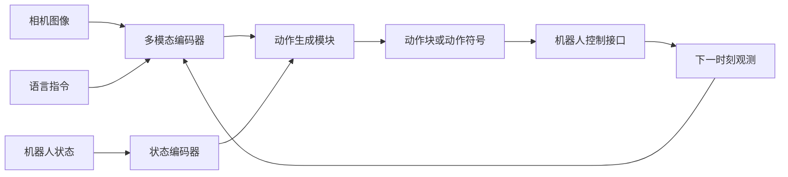

# 视觉-语言-动作模型概述

本章建立 VLA（Vision-Language-Action，视觉-语言-动作）模型的基本分析框架。学完后，读者应能说明 VLA 的输入、输出和训练目标，并能根据数据规模、动作表示、计算资源与部署要求选择合适的模型路线。

## 1. VLA 解决什么问题

传统机器人系统通常把视觉感知、任务规划和低层控制拆成多个模块。VLA 模型尝试用统一策略连接三类信息：

- **视觉观测**：环境图像、相机序列或视觉特征；
- **语言条件**：任务指令、目标描述或上下文提示；
- **机器人状态**：关节位置、末端位姿、夹爪状态等本体信息。

模型输出一段机器人动作，可以是离散动作符号、连续关节控制量，也可以是通过扩散或流匹配过程生成的动作块。训练时常用示教数据进行行为克隆；在此基础上，还可加入多任务预训练、策略后训练或强化学习。

VLA 并不替代全部机器人软件。相机标定、动作限幅、碰撞检查、控制频率、通信和安全停止仍需由系统工程保证。

## 2. 统一计算流程

闭环部署时，模型必须持续读取新观测并更新动作。离线损失下降只说明模型更接近数据集中的动作分布，不能代替真实环境中的任务成功率。

## 3. 代表性模型

下表用于比较建模路线，不用于给模型排出统一名次。不同工作采用的数据、机器人、任务定义和评估协议不同，论文中的成功率通常不能直接横向比较。

| 模型 | 核心输入与输出 | 动作表示 | 适合观察的研究问题 |
| --- | --- | --- | --- |
| RT-1 | 图像与语言指令输入，直接预测机器人动作 | 离散动作符号 | 大规模多任务示教能否支持单机器人泛化 |
| RT-2 | 在视觉语言模型上联合训练网络数据与机器人数据 | 文本词表中的动作符号 | 网络知识如何迁移到机器人控制 |
| Octo | 多种机器人观测与任务条件输入 | 连续动作生成 | 跨机器人数据预训练与策略微调 |
| OpenVLA | DINOv2 与 SigLIP 视觉特征接入 Llama 2 | 离散动作符号 | 开源大参数 VLA 的微调和部署 |
| SmolVLA | SigLIP、SmolLM2 与动作专家组合 | 流匹配动作块 | 单卡训练、低成本复现与异步推理 |
| Isaac GR00T | 视觉语言主干与动作生成模块分工 | 连续动作块 | 人形机器人、多具身数据与工程化后训练 |

### 3.1 RT-1 与 RT-2

RT-1 证明了 Transformer 可以在大量真实机器人示教上学习多任务策略。RT-2 进一步把机器人动作编码为视觉语言模型可生成的符号，使网络规模视觉语言预训练中的语义知识能够参与动作选择。RT-2 的关键贡献是联合使用网页视觉语言数据与机器人数据，而不是简单地在语言模型后附加一个控制器。

参考资料：[RT-2 官方介绍](https://deepmind.google/blog/rt-2-new-model-translates-vision-and-language-into-action/)、[Open X-Embodiment 与 RT-X 官方介绍](https://deepmind.google/blog/scaling-up-learning-across-many-different-robot-types/)。

### 3.2 OpenVLA

OpenVLA 是 7B 参数的开源 VLA，视觉端融合 DINOv2 的空间特征与 SigLIP 的语义特征，语言主干采用 Llama 2。它适合研究参数高效微调、动作符号化以及大模型推理服务，但显存、推理延迟和控制频率需要在部署前单独测量。

参考资料：[OpenVLA 项目主页](https://openvla.github.io/)。

### 3.3 SmolVLA

SmolVLA 采用约 450M 参数的紧凑架构，由 SigLIP 视觉编码器、SmolLM2 语言解码器和动作专家组成。动作专家通过流匹配生成连续动作块。官方同时提供预训练、微调、从架构初始化训练和异步推理流程，适合作为单卡 VLA 教学基线。

参考资料：[SmolVLA 官方教程](https://huggingface.co/blog/smolvla)、[SmolVLA 基础权重](https://huggingface.co/lerobot/smolvla_base)。

### 3.4 Isaac GR00T

Isaac GR00T 系列使用视觉语言模块理解观测和指令，再由动作生成模块输出连续控制序列。该路线强调多机器人数据、仿真与真实数据组合、后训练以及部署工具链，适合研究人形机器人和跨具身策略。使用时应记录具体版本，因为不同版本的视觉语言主干、数据和导出能力会变化。

参考资料：[Isaac GR00T N1 官方介绍](https://developer.nvidia.com/blog/accelerate-generalist-humanoid-robot-development-with-nvidia-isaac-gr00t-n1/)。

## 4. 动作表示决定了什么

### 4.1 离散动作符号

连续动作被分桶后映射为词表符号。这样可以复用语言模型的生成接口，但量化精度、符号范围和解码频率会影响控制平滑度。

### 4.2 连续动作回归

模型直接预测关节、末端或夹爪控制量。实现简单，但多峰动作分布容易被均值化，长动作块还可能累积误差。

### 4.3 扩散与流匹配动作块

模型从噪声或简单分布逐步生成一段连续动作。这类方法能够表达多种可行动作，但采样步数、动作块长度和在线重规划频率共同决定推理延迟。

## 5. 模型选择清单

在确定模型前，先回答以下问题：

1. 数据是否包含语言指令、相机图像和一致定义的动作？
2. 动作空间是关节位置、关节速度，还是末端增量？
3. 训练数据与部署机器人的自由度、相机顺序和控制频率是否一致？
4. 单次推理延迟能否满足闭环控制周期？
5. 是否需要跨任务、跨场景或跨机器人泛化？
6. 评估是否包含固定种子、任务成功判定和失败阶段统计？

资源有限时，可先用 ACT 或 SmolVLA 建立可复现基线；需要研究大模型语义迁移时，再考虑 OpenVLA 等较大模型；面向人形机器人和多具身数据时，可评估 GR00T 一类工程化路线。

## 6. 训练与评估的最小闭环

一个可复现的 VLA 实验至少包含：

1. 固定数据版本，并检查相机、状态、动作和语言字段；
2. 保存归一化统计、模型配置和训练日志；
3. 在验证集上观察损失与动作误差；
4. 在环境中运行闭环评估，按任务记录成功率；
5. 保存成功与失败回放，定位感知、接近、抓取、搬运和放置阶段的问题。

## 7. 本章检查点

- 能画出视觉、语言、状态到动作的闭环数据流。
- 能区分离散动作、连续回归、扩散和流匹配动作块。
- 能解释离线损失与闭环成功率为什么不能互相替代。
- 能依据数据、算力、控制频率和机器人形态选择基线模型。
