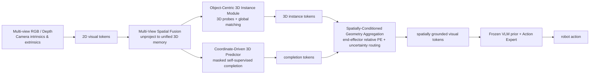

# 3DVLA：给 VLA 注入三维空间和实例理解的即插即用框架

这篇导读对应论文 **3DVLA: Enhancing Vision-Language-Action Models via 3D Spatial and Instance Understanding**，来自北京大学王选计算机研究所，arXiv 于 2026-05-28 提交。它适合放在本仓库的 `06-策略抓取或抓取VLA/大模型控制、VLA、VLM` 章节中，接在 OpenVLA、DiT4DiT、EventVLA、WALL-OSS/WALL-X 之后。

学完这一节后，大家需要抓住一个核心判断：

> 3DVLA 不是重新训练一个新的 VLA 基座，而是在已有 VLA 的视觉 token 和 action expert 之间，插入一组 3D 空间、3D 实例和遮挡补全模块，让原本偏 2D 的 VLA 更稳定地理解物体在哪里、哪个实例是目标、被遮挡的几何结构可能是什么。

这篇很适合放进“操作控制”路线，也可以作为“感知建图”和“VLA 前沿”之间的桥。它讨论的不是单纯识别物体，而是把 3D 空间理解变成 action prediction 可用的 token。

## 1. 论文和代码状态

| 项目 | 当前状态 |
| :--- | :--- |
| 论文 | [arXiv:2605.29416](https://arxiv.org/abs/2605.29416)，提交于 2026-05-28 |
| arXiv HTML | [3DVLA HTML](https://arxiv.org/html/2605.29416v1) |
| 作者单位 | Wangxuan Institute of Computer Technology, Peking University |
| 代码状态 | 截至 2026-07-18，未找到该论文的官方 GitHub 仓库 |
| 注意事项 | 搜索到的 [UMass-Embodied-AGI/3D-VLA](https://github.com/UMass-Embodied-AGI/3D-VLA) 是 2024 年另一篇 **3D-VLA: A 3D Vision-Language-Action Generative World Model**，不是北大这篇 2026 年 3DVLA |
| 复现建议 | 当前适合写方法导读和后续跟踪入口，不适合写成“一键复现论文结果” |

这里要讲得很实在：用户如果现在去 GitHub 搜 `3DVLA`，很容易搜到 UMass 那篇 2024 年的 `3D-VLA`。它也是机器人和 3D/VLA 相关，但题目、作者、方法目标都不同，不能把那个仓库当作北大 3DVLA 的代码。北大这篇论文当前更适合先读方法图和实验表，等官方仓库放出后再补复现教程。

## 2. 这篇到底解决什么问题

传统 VLA 常见输入是多视角 RGB 图像、语言指令和历史观测，然后输出 action token、末端位姿增量或 action chunk。这类模型的优势是可以继承 VLM 的语义理解能力，但问题也很明显：很多 VLA 还是在 2D 图像 token 上做融合，对机器人真正关心的 3D 空间关系理解不够强。

论文把这个问题拆成三个具体痛点：

| 痛点 | 具体表现 | 对机器人操作的影响 |
| :--- | :--- | :--- |
| 3D 空间位置弱 | 多视角图像只是松散拼接或融合，没有显式统一到同一个 3D 坐标系 | 相机换角度、物体换位置后，模型不知道物体在机器人坐标系里到底在哪里 |
| 3D 实例理解弱 | 只能把物体当成 2D 区域，缺少跨视角一致的实例表示 | 同一个杯子在两个相机里形状不同，模型容易把目标实例、背景实例或遮挡区域混起来 |
| 遮挡下推理脆弱 | 目标物体局部被挡住时，2D token 只看到残缺外观 | 抓取、放置、擦拭等任务需要推断不可见部分，纯 2D VLA 容易动作漂移 |

3DVLA 的核心想法是：不要推翻已有 VLA，也不要单独训练一个和 VLM 不兼容的重型 3D 感知网络，而是把 3D 几何信息整理成 VLA 能吃的 token，再注入 action expert。

可以把它理解成：

```text
多视角 RGB / 深度 / 相机参数
        ↓
统一到 3D 空间的视觉记忆
        ↓
抽取跨视角一致的 3D instance token
        ↓
对遮挡区域做 3D feature completion
        ↓
按夹爪相对位置聚合成 affordance-aware token
        ↓
拼回原 VLA token 流，交给 action expert 输出动作
```

所以它不是“再接一个点云 encoder”这么简单。真正关键的是：**3D token 要和原 VLA 的 2D/VLM token 兼容，还要能被下游 action expert 用起来。**

## 3. 总览图：它为什么叫 plug-and-play

<p align="center">
  
</p>

**图 1 3DVLA 总览。** 橙色部分表示跨视角一致的 3D instance，黄色部分表示对遮挡几何的补全。3DVLA 的目标不是替代 VLA，而是把这些空间 token 聚合回动作模型。

来源：[3DVLA arXiv HTML](https://arxiv.org/html/2605.29416v1)。

这张图可以按三层来读。

第一层是传统 VLA 的输入。机器人看到多视角图像，收到语言指令，然后要输出动作。如果没有 3D 辅助，模型通常只能在图像平面里学“目标大概在哪”，但很难知道目标相对夹爪的真实空间偏移。

第二层是 3DVLA 增加的 3D 理解。它从多视角观测里抽取 3D instance，让同一个物体在不同视角下对应同一个 3D 实体；同时对被遮挡或视角不可见的结构做几何补全。

第三层是动作侧的使用方式。3DVLA 最后并不是输出一个独立的 3D 检测结果给人看，而是把 3D instance token、completion token 和空间偏置注入 action expert，让动作生成更稳定。

“即插即用”主要体现在两点：

- 大的 VLM backbone 冻结，不需要抛弃已有 VLA 预训练知识。
- 新增 3D 模块输出的是和 VLA token 流兼容的特征，最后拼接到视觉 token 里给 action expert 使用。

这也是它和很多 3D perception 方法的区别。普通 3D 检测或点云分割可以给出 box、mask 或 point cloud，但不一定知道如何接入 VLA 的 token/action 结构。3DVLA 关心的是“如何让 3D 理解变成动作预测有用的信息”。

## 4. 总体架构：四个模块串起来

<p align="center">
  
</p>

**图 2 3DVLA 总体架构。** 论文把方法拆成四个模块：Multi-View Spatial Fusion、Object-Centric 3D Instance Module、Coordinate-Driven 3D Self-Supervised Predictor、Spatially-Conditioned Geometry Aggregation。

来源：[3DVLA arXiv HTML](https://arxiv.org/html/2605.29416v1)。

这张图是整篇论文最重要的图。可以把四个模块翻译成更直白的话：

| 模块 | 中文理解 | 解决的问题 |
| :--- | :--- | :--- |
| Multi-View Spatial Fusion | 多视角空间融合 | 把不同相机看到的 2D token 提升到统一 3D 记忆里 |
| Object-Centric 3D Instance Module | 以物体为中心的 3D 实例模块 | 用 3D probe 找到跨视角一致的物体实例 |
| Coordinate-Driven 3D Self-Supervised Predictor | 坐标驱动的 3D 自监督预测器 | 对被遮挡或未观察到的几何结构做 feature completion |
| Spatially-Conditioned Geometry Aggregation | 空间条件几何聚合 | 把 3D instance / completion 按夹爪相对位置聚合成 action expert 能用的 token |

一个简化版数据流如下：



注意这里的 `Camera intrinsics & extrinsics` 很关键。3DVLA 不是从单张 RGB 图里凭空猜 3D，而是利用多视角观测、深度和相机参数，把图像 token 绑定到连续 3D 坐标。没有这个几何对齐，它就退化成普通多视角特征融合。

## 5. 模块一：Multi-View Spatial Fusion

这个模块解决“多个相机看到的是同一个世界”这个问题。

很多 VLA 也支持多视角图像，但常见做法是把不同视角的图像 token 直接拼起来，或者在 transformer 里做 attention 融合。这样模型看到的是多个 2D 平面，缺少一个统一的 3D 参考系。比如左相机看到杯子在画面右侧，腕部相机看到杯子在画面中央，这两个 2D 位置并不能直接告诉 action expert 杯子相对夹爪在哪里。

3DVLA 的做法是把视觉特征和 3D 坐标绑定。它利用相机内参、外参和深度，把多视角特征映射到统一 3D 空间中，再用 transformer encoder 建立跨视角几何对应关系。论文还使用 Continuous 3D RoPE，把相对 3D 距离编码进 attention 的 query/key，让模型能感知欧氏距离关系。

这一步有两个价值：

- **跨视角一致性**：同一个物理点不会因为换相机就变成完全不同的 token。
- **动作可用性**：物体位置可以放到机器人操作所需的空间参考系里，而不是停留在图像坐标里。

这也是它区别于“多视角图片拼接”的地方。图片拼接只是在 2D token 数量上变多，3DVLA 是把 token 放回三维空间。

## 6. 模块二：Object-Centric 3D Instance Module

<p align="center">
  
</p>

**图 3 3D instance 建模和几何聚合。** 左侧是用 3D probe 建模跨视角一致实例；右侧是把实例 token 和补全几何按空间条件聚合，再送入动作模型。

来源：[3DVLA arXiv HTML](https://arxiv.org/html/2605.29416v1)。

机器人操作里，“看到物体”还不够，模型还要知道哪个物体是目标、它在 3D 空间里占据什么位置、和夹爪相对关系如何。2D mask 或 2D box 在多视角场景中有一个天然问题：同一个物体在不同相机里形状、大小、可见区域都不同，如果每个视角单独匹配 instance，很容易出现 ID 冲突。

3DVLA 的 3D Instance Module 用的是 **3D probe**。每个 probe 包含两类状态：

- semantic state：这个实体是什么、语义特征是什么；
- 3D reference point：这个实体在连续 3D 空间中的参考位置。

probe 会投影到不同相机视角，从多尺度 2D 特征里采样纹理和语义信息。为了避免某些视角被遮挡或看不清带来的噪声，模块还引入 occlusion-aware gating，对不可靠视角降低权重。

这里最值得注意的是 **global 3D matching**。论文不是在每个视角里单独做 2D Hungarian matching，而是把伪标签从 2D box/mask 反投影成 3D centroid，然后在 3D 空间里做全局匹配。这样同一个物理物体对应同一个 3D instance，避免跨视角 ID 打架。

伪标签来自 frozen perception model，例如 VL-SAM-v2 一类开放世界检测/分割模型。这个设计让 3DVLA 不需要额外人工 instance-level 标注，但仍然能用伪 mask 和伪 box 训练 instance module。

## 7. 模块三：Coordinate-Driven 3D Self-Supervised Predictor

<p align="center">
  
</p>

**图 4 坐标驱动的 3D 自监督预测器。** 这个分支保留 masked self-supervised predictor，在推理时查询遮挡或未观察位置的 3D token，用来补全不可见几何。

来源：[3DVLA arXiv HTML](https://arxiv.org/html/2605.29416v1)。

这个模块是论文里比较精妙的部分。很多自监督视觉方法会在预训练时使用 masked prediction，但下游部署时把 predictor 丢掉，只保留 encoder。3DVLA 反过来利用这个 predictor：既然机器人操作经常遇到遮挡，那就让 predictor 在 3D 坐标空间里补全不可见区域的 feature。

训练时，它定义两类坐标：

- mask coordinates：训练自监督预测时被遮住的位置；
- completion coordinates：真实场景中不可见或遮挡的几何位置。

模型通过 asymmetric multi-view masking 学会从可见视角推断不可见结构。这里不能只靠普通 2D 插值，否则模型可能学到“从邻近像素抄答案”。论文使用 50% asymmetric masking，让模型必须利用跨视角 3D 几何关系来恢复 feature。

为了生成 completion coordinates，论文流程大致是：

1. 把 2D mask 反投影成 raw point cloud；
2. 用密度聚类做去噪；
3. 使用预训练 point cloud completion network 预测完整形状；
4. 从远离可见点的区域采样不可见结构；
5. 用 farthest point sampling 得到均匀 completion query。

推理时不再随机 mask，而是直接用 completion coordinates 查询连续空间，生成 occluded feature。对机器人来说，这相当于在目标被挡住一部分时，仍然给 action expert 一个“可能的完整几何结构”提示。

它解决的不是视觉美观问题，而是动作稳定性问题。例如夹爪只能看到杯子的一侧，但抓取需要估计杯子整体的中心和边界；纯 2D token 很容易偏，3D completion token 可以提供更完整的空间线索。

## 8. 模块四：Spatially-Conditioned Geometry Aggregation

3D 信息最终必须服务动作，否则只是额外感知结果。3DVLA 在 aggregation 里做了两件事。

第一是 **end-effector centric relative positional encoding**。机器人动作通常是相对夹爪执行的。给 policy 一个物体的绝对世界坐标并不够，模型还得自己学“物体到夹爪的相对偏移”和机器人运动学关系。3DVLA 直接把几何表示转成相对 end-effector 的 offset，再用 sinusoidal / MLP 编码成 token，加入 instance 和 completion 特征。

这一步非常工程化。机器人真正需要知道的往往不是“杯子在世界坐标 x=0.4”，而是：

```text
目标相对夹爪：前方 8 cm，左侧 2 cm，下方 4 cm
```

这种相对坐标对动作生成更直接。

第二是 **uncertainty-guided routing**。如果 2D 视觉已经很确定，强行把大量 3D completion feature 注入 instance token，可能会污染原本可靠的视觉表示。论文用 instance module 的分类 logit 估计不确定性，再决定是否注入局部 3D 几何上下文。

这个 routing 的思想可以简单理解为：

| 视觉状态 | 是否需要更多 3D completion |
| :--- | :--- |
| 目标清楚、实例置信度高 | 少注入，保护原始 VLM/VLA 表征 |
| 目标被挡住、视角模糊、实例不确定 | 多注入，用 3D completion 帮助推理 |

论文还提到 routing 的最后线性层做 zero initialization，并设置常数 bias，让训练一开始接近 identity mapping。这个细节很重要：它避免新 3D 模块一开始把预训练 VLA 的特征扰乱。

## 9. 多视角一致性和遮挡补全效果

<p align="center">
  
</p>

**图 5 多视角实例一致性与 3D completion。** 左侧和中间展示同一实例在不同视角下保持一致，右侧展示可见点和补全几何在世界坐标中的关系。

来源：[3DVLA arXiv HTML](https://arxiv.org/html/2605.29416v1)。

这张图虽然不大，但信息很集中。它展示的是 3DVLA 相比普通 2D VLA 最核心的能力：

- 同一物体在不同相机中能保持 instance 一致；
- 物体的 2D mask 可以投回 3D 空间；
- 被遮挡或未观察到的结构可以通过 completion predictor 生成；
- 这些结果不是最终输出，而是会继续转成 action expert 的 token。

对真实操作任务来说，这类能力尤其重要。桌面机器人经常遇到腕部相机遮挡、目标物被夹爪挡住、容器内物体只露出一部分、双臂互相遮挡等情况。纯 2D 模型会把“看不见”当成“没有信息”，而 3DVLA 试图让模型从多视角和 3D 几何里补足不可见信息。

## 10. 实验结果怎么读

论文主要在两个仿真 benchmark 上评测：LIBERO-Plus 和 RoboTwin 2.0。指标是 success rate。

### 10.1 LIBERO-Plus

LIBERO-Plus 是在 LIBERO 基础上做鲁棒性分析的 benchmark，包含 Camera、Robot、Language、Light、Background、Noise、Layout 等扰动。论文报告的主结果如下：

| Method | Camera | Robot | Language | Light | Background | Noise | Layout | Avg. |
| :--- | ---: | ---: | ---: | ---: | ---: | ---: | ---: | ---: |
| WorldVLA | 0.1 | 27.9 | 41.6 | 43.7 | 17.1 | 10.9 | 38.0 | 25.0 |
| OpenVLA | 0.8 | 3.5 | 23.0 | 8.1 | 34.8 | 15.2 | 28.5 | 15.6 |
| NORA | 2.2 | 37.0 | 65.1 | 45.7 | 58.6 | 12.8 | 62.1 | 39.0 |
| UniVLA | 1.8 | 46.2 | 69.6 | 69.0 | 81.0 | 21.2 | 31.9 | 42.9 |
| π0-Fast | 65.1 | 21.6 | 61.0 | 73.2 | 73.2 | 74.4 | 68.8 | 61.6 |
| RIPT-VLA | 55.2 | 31.2 | 77.6 | 88.4 | 91.6 | 73.5 | 74.2 | 68.4 |
| OpenVLA-OFT | 56.4 | 31.9 | 79.5 | 88.7 | 93.3 | 75.8 | 74.2 | 69.6 |
| π0 | 61.0 | 40.8 | 63.5 | 89.3 | 84.1 | 80.1 | 76.4 | 69.4 |
| π0.5 | 71.2 | 77.1 | 89.9 | 94.7 | 94.0 | 84.2 | 84.3 | 84.2 |
| π0.5 + 3DVLA | 75.6 | 77.4 | 88.6 | 97.4 | 97.7 | 85.3 | 86.6 | 86.0 |

这张表最值得看的是 Camera 和 Layout。3DVLA 对这些空间扰动有提升，说明 3D 空间锚定确实对视角变化和布局变化更敏感。它不是把所有指标都大幅拉爆，而是在一个已经很强的 π0.5 基座上继续提升平均成功率到 86.0。

也要注意一个边界：Language 上 π0.5 是 89.9，π0.5 + 3DVLA 是 88.6，略低。这说明 3DVLA 的主要价值不是语言理解增强，而是 3D 空间和遮挡鲁棒性增强。

### 10.2 RoboTwin 2.0

RoboTwin 2.0 更强调多视角、接触、双臂、遮挡和物理丰富的操作任务。论文报告：

| Method | Easy | Hard |
| :--- | ---: | ---: |
| DP | 28.0% | 0.6% |
| ACT | 29.7% | 1.7% |
| RDT | 34.5% | 13.7% |
| DP3 | 55.2% | 5.0% |
| π0 | 46.4% | 16.3% |
| π0 + 3DVLA | 54.5% | 23.2% |
| X-VLA | 70.0% | 39.0% |
| X-VLA + 3DVLA | 72.6% | 42.1% |

这里可以看出两件事。

第一，3DVLA 可以插到不同 VLA baseline 上。π0 加上 3DVLA 后 Easy 从 46.4% 到 54.5%，Hard 从 16.3% 到 23.2%；X-VLA 加上 3DVLA 后 Easy 从 70.0% 到 72.6%，Hard 从 39.0% 到 42.1%。这支持“plug-and-play”叙事。

第二，Hard 任务的提升更有意义。Hard 通常包含更强遮挡、更复杂接触和更细粒度空间关系。3DVLA 在 Hard 上提升，说明 3D instance 和 completion 不是只在简单视觉扰动里有用。

### 10.3 消融实验

论文消融把模块逐步加上：

| Model | Instance | Predictor | Routing | RoboTwin Easy | RoboTwin Hard |
| :--- | :---: | :---: | :---: | ---: | ---: |
| π0 baseline |  |  |  | 46.4% | 16.3% |
| A | ✓ |  |  | 50.1% | 18.9% |
| B | ✓ | ✓ |  | 53.4% | 21.8% |
| C | ✓ | ✓ | ✓ | 54.5% | 23.2% |
| X-VLA baseline |  |  |  | 70.0% | 39.0% |
| A | ✓ |  |  | 71.3% | 40.4% |
| B | ✓ | ✓ |  | 72.1% | 41.6% |
| C | ✓ | ✓ | ✓ | 72.6% | 42.1% |

这个消融很清楚：3D instance module、3D predictor、routing 都有增益，但增益不是一个模块独自完成的。可以把三者理解成：

- Instance 负责“哪个物体，在哪个 3D 位置”；
- Predictor 负责“看不见的部分可能是什么”；
- Routing 负责“什么时候该把这些 3D 信息注入原 VLA token”。

## 11. 训练和算力成本

论文附录给出了一些很实用的实现信息。

训练策略是两阶段：

| 阶段 | 训练内容 | 目的 |
| :--- | :--- | :--- |
| Stage 1 | Multi-View Spatial Fusion、3D Instance Module、action expert | 先学稳定的 2D-to-3D 实例锚定 |
| Stage 2 | 冻结 Stage 1 模块，训练 3D Self-Supervised Predictor、Geometry Aggregation，并继续更新 action expert | 再学遮挡补全和几何聚合，避免连续 feature regression 早期训练崩掉 |

论文还写到：大 VLM backbone 在训练时保持冻结，只更新新增 3D perception modules 和 downstream action expert。Object-Centric 3D Instance Module 会初始化 100 个 state probes，经过 matching 和 uncertainty filtering 后，每个场景最多保留 16 个高置信 instance tokens。3D Predictor 最多处理 6 个被遮挡实例，每个实例采样 5 个 completion coordinate queries。

算力方面，论文报告两阶段训练在 4 张 NVIDIA A800 的单节点上完成：Stage 1 大约 5 小时，Stage 2 大约 9 小时，总训练约 14 小时。评测更耗时，主要瓶颈在仿真渲染和物理 step，而不是模型推理；论文使用 8 张 A800 完成完整仿真评测，约 14 小时。

这意味着 3DVLA 不是那种需要从头预训练超大 VLA 的工作。它的算力门槛仍然不低，但作为 VLA 插件式增强模块，训练成本比重训基座低很多。

## 12. 它和其他 3D / VLA 方法的区别

| 方法 | 核心思路 | 和 3DVLA 的区别 |
| :--- | :--- | :--- |
| OpenVLA / π0 / π0.5 | 用 VLM prior 直接把视觉语言映射到动作 | 语义强，但 3D 空间和实例理解仍需补强 |
| DP3 | 用 3D point cloud 表示做 visuomotor policy | 更偏点云策略；3DVLA 强调兼容 VLM/VLA token 和预训练 prior |
| DiT4DiT | 用 diffusion transformer 组织视觉/动作生成 | 重点是动作生成范式；3DVLA 重点是 3D perception injection |
| EventVLA | 长时域视觉证据记忆 | 解决长期记忆，不直接解决 3D instance 和遮挡补全 |
| WALL-OSS / WALL-X | 开源 VLA 模型和工程框架 | 解决模型/训练/部署入口；3DVLA 是空间理解增强插件 |
| LeWM / RAW-Dream / RoboDream | 世界模型、想象 rollout 或数据合成 | 3DVLA 不是 world model，不生成未来视频，主要增强当前观测的 3D 表征 |

一句话定位：

> 3DVLA 不是把 VLA 变成世界模型，也不是把 VLA 改成纯点云策略，而是给已有 VLA 加一层可训练、可插拔、与 VLM token 兼容的 3D 空间实例理解。

## 13. 复现时应该怎么跟进

由于官方代码尚未公开，当前不建议把它写成手把手复现。但可以提前整理后续复现 checklist。

| 模块 | 后续复现需要什么 |
| :--- | :--- |
| 基座 VLA | π0 / π0.5 / X-VLA 或作者实际开源配置 |
| 多视角输入 | RGB、depth、camera intrinsics、camera extrinsics |
| 伪标签生成 | frozen perception model，例如 VL-SAM-v2 类开放世界检测/分割模型 |
| 3D instance | state probes、3D matching、mask/box/centroid losses |
| 3D completion | point cloud completion network、mask coordinates、completion coordinates |
| action expert | 与目标 VLA 的动作空间、action chunk、控制频率对齐 |
| benchmark | LIBERO-Plus、RoboTwin 2.0 官方评测协议 |

后续如果出现官方代码，建议优先复现三个最小问题：

1. **能否跑通 inference 或 evaluation demo**：先验证仓库依赖、模型加载和 benchmark 接口。
2. **能否复现一个 baseline + 3DVLA 的增益**：优先选 RoboTwin 2.0 的 π0 + 3DVLA 或 X-VLA + 3DVLA。
3. **能否可视化 3D instance 和 completion token**：不只看成功率，也要检查 3D 模块是否真的学到跨视角一致性。

## 14. 值得注意的边界

第一，3DVLA 不是强物理世界模型。它不会预测未来视频，也不会在内部 rollout 多步物理交互。它增强的是当前观测下的 3D 空间/实例表征。

第二，它依赖多视角、深度和相机几何。没有可靠相机标定和深度对齐，Multi-View Spatial Fusion 的基础会变弱。真实机器人复现时，标定误差可能比论文里更麻烦。

第三，伪标签质量会影响 instance module。论文用 frozen perception model 生成 2D box/mask 伪标签，再反投影到 3D。如果检测或分割模型在目标域表现差，3D instance 学习也会被带偏。

第四，当前代码未正式公开。这篇当前应作为方法导读和后续跟踪入口，不能写成“已经可以一键复现论文结果”。

第五，它的实验主要是仿真 benchmark。LIBERO-Plus 和 RoboTwin 2.0 都很有价值，但它还没有证明真实机器人上复杂遮挡、标定误差、传感器噪声和接触偏差下也有同样增益。

## 15. 和本教程其他文章的阅读顺序

建议按下面顺序读：

| 文章 | 先学什么 |
| :--- | :--- |
| [OpenVLA 复现](../02OpenVLA复现/02openvla复现.md) | VLA 基本输入输出和部署方式 |
| [MuJoCo ACT/Pi0/SmolVLA](../04mujoco复现ACT、Pi0、SmolVLA/README.md) | 机器人动作策略、数据采集和仿真训练 |
| [DiT4DiT-LIBERO](../05DiT4DiT-LIBERO/01DiT4DiT-LIBERO训练与评估.md) | diffusion / transformer 如何做动作生成 |
| [EventVLA](../06EventVLA视觉证据记忆导读/README.md) | 长时域任务里的视觉证据记忆 |
| [WALL-OSS / WALL-X](../07WALL-OSS开源VLA模型导读/README.md) | 开源 VLA 模型和工程框架 |
| 本文 3DVLA | 3D 空间、实例和遮挡补全如何增强 VLA |

如果只用一句话总结这篇：

> 3DVLA 的价值在于把“机器人到底在 3D 空间里看到哪个物体、看不见的部分可能是什么、这些几何信息相对夹爪在哪里”变成 VLA action expert 能直接使用的 token。

## 16. 参考链接

- 论文：[3DVLA: Enhancing Vision-Language-Action Models via 3D Spatial and Instance Understanding](https://arxiv.org/abs/2605.29416)
- arXiv HTML 图文版：[https://arxiv.org/html/2605.29416v1](https://arxiv.org/html/2605.29416v1)
- 注意区分的旧同名项目：[UMass-Embodied-AGI/3D-VLA](https://github.com/UMass-Embodied-AGI/3D-VLA)
