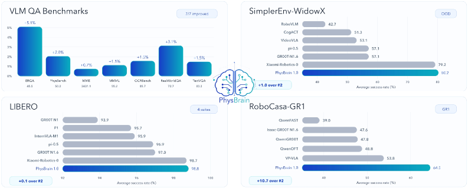
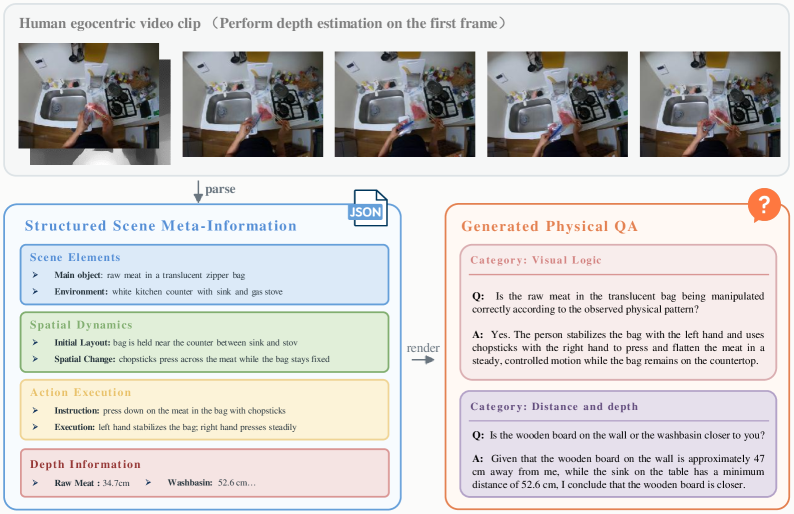
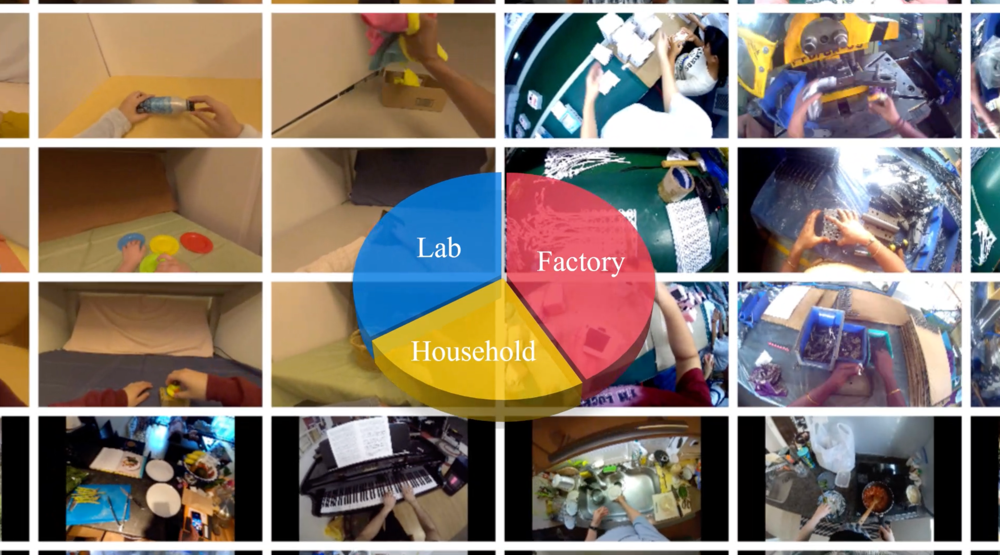
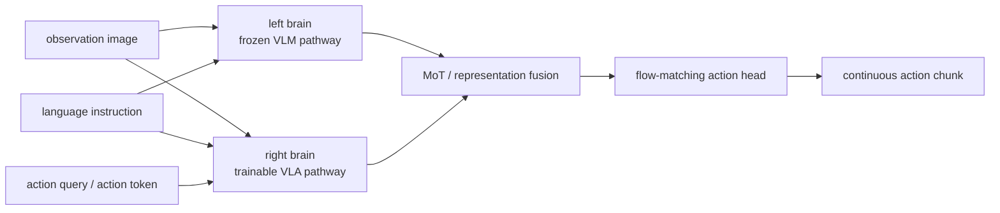

# PhysBrain 1.0：先学物理常识，再做机器人控制

这一节对应论文 **PhysBrain 1.0 Technical Report**，论文号为 [arXiv:2605.15298](https://arxiv.org/abs/2605.15298)，项目页为 [phys-brain.github.io](https://phys-brain.github.io/)，VLA 代码仓库为 [Phys-Brain/PhysBrain-VLA](https://github.com/Phys-Brain/PhysBrain-VLA)。

它适合放在本仓库的 `06-策略抓取或抓取VLA/大模型控制、VLA、VLM` 章节中，接在 OpenVLA、DiT4DiT、EventVLA、WALL-OSS/WALL-X、3DVLA 之后。原因很直接：PhysBrain 1.0 最终服务的是机器人控制和 VLA 后训练，它不是一个可以像仿真器一样 `step(action)` 的世界模型，也不是专门做视频 rollout 的神经世界模型。

学完这一节后，大家需要抓住一个核心判断：

> PhysBrain 1.0 的关键不是“从更多机器人轨迹里模仿动作”，而是先把大规模人类第一人称视频编译成结构化物理常识监督，训练一个更懂物理关系、接触过程、空间距离和行动可行性的 VLM，再通过能力保持和语言敏感的 VLA 适配，把这些物理先验迁移到机器人动作生成。

换句话说，它走的是：

```text
人类第一人称视频
        ↓
结构化物理元信息
        ↓
深度增强和物理 QA
        ↓
PhysBrain VLM
        ↓
TwinBrainVLA + LangForce
        ↓
机器人控制策略
```

这条路线和最近很多 VLA 工作形成了互补：WALL-OSS 更强调 VLM 到 VLA 的开源模型和工程入口，3DVLA 更强调 3D 空间和实例 token 注入动作专家，PhysBrain 1.0 则强调“物理常识从哪里来，以及如何在 VLA 微调时不被机器人轨迹数据冲掉”。

## 1. 论文、项目和开源状态

| 项目 | 当前状态 |
| :--- | :--- |
| 论文 | [arXiv:2605.15298](https://arxiv.org/abs/2605.15298)，提交于 2026-05-14 |
| 官方项目页 | [PhysBrain 1.0](https://phys-brain.github.io/) |
| VLA 代码仓库 | [Phys-Brain/PhysBrain-VLA](https://github.com/Phys-Brain/PhysBrain-VLA)，Apache-2.0 |
| Hugging Face 论文页 | [HF Papers: 2605.15298](https://huggingface.co/papers/2605.15298) |
| 模型集合 | [PhysBrain 1.0 VLA collection](https://huggingface.co/collections/Phys-Brain/physbrain-10-vla) |
| 已公开 checkpoint | RoboCasa-GR1、LIBERO、SIMPLER-Bridge、SIMPLER-Fractal |
| 推荐复现方式 | 不从头训练数据引擎和 VLM；优先阅读方法、下载 checkpoint，在 starVLA 框架中加载 VLA 适配代码 |

这里要把开源边界讲清楚。当前 [PhysBrain-VLA](https://github.com/Phys-Brain/PhysBrain-VLA) 仓库已经公开了 VLA 侧的模型代码和 checkpoint 入口，README 也说明了它基于 `starVLA` scaffold，需要把 `physbrain_vla/PhysBrainVLA.py` 拷贝到 `starVLA/model/framework/` 下，再按 starVLA 的标准 checkpoint workflow 加载和部署。

但是它不是一个完整的“从 3000 小时人类视频到 PhysBrain VLM 再到所有机器人 benchmark”的一键训练仓库。数据引擎、全部标注数据、完整训练脚本和大规模算力配置目前不应被默认视为已经完整开放。教程里更适合把它作为方法导读和 checkpoint 复用入口，而不是承诺复现论文全流程。

## 2. 它到底解决什么问题

很多 VLA 的训练逻辑可以概括为：

```text
机器人观测 + 语言指令 + 示教动作
        ↓
行为克隆 / diffusion / flow matching
        ↓
新场景执行
```

这条路线有效，但有一个硬问题：机器人轨迹很贵，而且覆盖面很窄。一个机械臂数据集里可能有很多抓取、放置、开抽屉轨迹，却很难覆盖人类日常世界中丰富的物理现象，例如透明袋子、柔性物体、容器是否装满、手和物体的接触顺序、物体之间的遮挡和深度关系、一个动作失败时通常是什么物理原因。

PhysBrain 1.0 的切入点是：人类第一人称视频里天然包含大量交互经验。人类做饭、收纳、装配、实验操作、工业流程时，视频中已经出现了手、物体、工具、接触、移动、遮挡、状态变化和任务阶段。问题是这些视频不能直接拿来训练机器人控制，因为它们没有机器人 action，也没有统一的结构化标签。

所以论文做了一个转换：

| 原始视频里隐含的信息 | PhysBrain 要显式抽出来的监督 |
| :--- | :--- |
| 桌面上有哪些东西 | `scene_elements`：主操作物、邻近物体、材料、几何、状态 |
| 手和物体如何接近、接触、分离 | `spatial_dynamics`：初始布局、相对位置变化、空间关系演化 |
| 人到底在执行什么步骤 | `action_execution`：简短任务意图和细化执行过程 |
| 物体离相机/手有多远 | depth-aware relations：相对深度、绝对距离、可达性 |
| 这个动作下一步应该怎么做 | physical QA：下一步预测、可操作性、安全性、长时域规划 |

这个思路的价值在于，它不要求人类视频和机器人动作一一对应。人类视频先用来训练“物理理解脑”，机器人数据再用来训练“身体如何执行”。这就是论文里反复强调的 **understanding first, action next**。

## 3. 总览图：PhysBrain 1.0 在哪些任务上验证

<p align="center">
  
</p>

**图 1 PhysBrain 1.0 的评测总览。** 这张图不是模型结构图，而是论文给出的整体结果摘要：左侧覆盖 VLM QA benchmark，右侧覆盖 SimplerEnv、LIBERO 和 RoboCasa-GR1 等机器人控制 benchmark。

来源：[PhysBrain 1.0 arXiv HTML](https://arxiv.org/html/2605.15298v1)。

图 1 可以按两条线来读。

第一条线是 VLM 侧。PhysBrain 1.0 不只是说“我最终能控制机器人”，它先在 ERQA、PhysBench、MME、MMMU、OCRBench、RealWorldQA、TextVQA 等多模态理解 benchmark 上验证物理常识和通用视觉语言能力。这个设计是为了证明：人类第一人称视频转换出来的监督，不只是给机器人动作头喂一点额外特征，而是真的改善了 base VLM 的空间、状态、计划和物理理解。

第二条线是 VLA 侧。论文在 SimplerEnv-WidowX、SimplerEnv-GoogleRobot、LIBERO 和 RoboCasa-GR1 上验证控制能力，其中尤其强调 out-of-domain 场景。论文给出的叙事是：如果 VLM 已经掌握更强的人类交互物理先验，那么在有限机器人数据适配后，它对新环境、新物体、新任务的控制会更稳。

这里不能简单理解成“PhysBrain 训练了一个世界模型”。它没有生成一个可交互环境，也没有在 imagined rollout 里更新 policy。它更像是在 VLA 前面补了一个物理常识预训练阶段，然后在 VLA 微调时通过架构和损失设计保护这个常识不被遗忘。

## 4. 数据引擎：把第一人称视频编译成物理 QA

<p align="center">
  
</p>

**图 2 从人类第一人称视频到结构化物理 QA。** 一个短视频片段先被均匀采样成多帧，再解析成 `scene_elements`、`spatial_dynamics`、`action_execution` 和 depth information，最后渲染成可训练的自然语言 QA。

来源：[PhysBrain 1.0 arXiv HTML](https://arxiv.org/html/2605.15298v1)。

这张图是理解 PhysBrain 的关键。它没有把视频直接写成一句 caption，例如“一个人在厨房里用筷子处理肉”。这种 caption 对 VLM 有用，但对机器人控制太粗了。机器人真正需要的是更细的物理结构：

- 主操作物是什么，材质和状态是什么；
- 旁边有哪些干扰物，哪些可能影响操作；
- 手从哪个方向接近，是否发生接触；
- 物体相对桌面、水槽、工具的位置如何变化；
- 动作是按压、拨动、抓取、放置、旋转还是稳定；
- 哪些对象更近、更远、更高、更低；
- 如果要继续完成任务，下一步应该做什么。

论文把这个过程设计成三层。

第一层是 **结构化场景元信息**。每个视频 clip 会被解析成 JSON 风格的 source record，核心字段包括：

| 字段 | 记录什么 | 为什么对机器人有用 |
| :--- | :--- | :--- |
| `scene_elements` | 主操作物、邻近物体、环境、材料、几何和物理状态 | 让模型知道物体不只是类别，还包括刚性、透明、柔性、是否装满等操作属性 |
| `spatial_dynamics` | 初始布局、手与物体距离变化、物体相对位置变化 | 让模型学习“接近、接触、移动、分离”的空间过程 |
| `action_execution` | 简短意图和细化执行过程 | 把观察到的动作拆成可执行步骤，而不是只做视频摘要 |
| `depth_info` | 物体中心点、相对深度、绝对距离等 | 给后续 QA 提供 3D 和 metric grounding |

第二层是 **深度增强**。论文使用 Depth Anything v3 系列深度模型，为有 grounding metadata 的对象补充 point-wise depth 和距离信息。这个步骤的意义很大：纯语言描述很容易停留在“左边、右边、靠近、远离”，但机器人动作通常需要连续位移、末端位姿和空间尺度。引入深度信息后，QA 可以问“哪个物体更近”“两者距离大约多少”“这个位置是否可达”，这会把 VLM 的空间理解从语义关系推向物理尺度。

第三层是 **物理 QA 生成**。结构化 record 不是最终训练目标，最终目标仍然是自然语言问答。这样做有两个好处：一方面，VLM 可以用熟悉的 QA 形式学习；另一方面，QA 的内容来自结构化 record，能够控制问题覆盖物体、空间、深度、状态变化、行动可行性和长时域计划。

论文列出的 QA family 非常广，可以大致分成四类：

| 类别 | 代表问题 | 训练作用 |
| :--- | :--- | :--- |
| 空间与度量 | 空间关系、距离和深度、尺寸估计、坐标 grounding、视角推理 | 提升 3D 空间理解和 metric grounding |
| 动作与计划 | 下一步预测、路线规划、可操作性与安全、长时域规划 | 提升 embodied decision making |
| 动态与因果 | 物体状态变化、动作识别、时间顺序、动作定位、反事实推理 | 学习接触、变化和动作后果 |
| 通用能力保持 | 计数、细粒度属性、存在性检查、OCR、图表分析、科学知识、视觉逻辑 | 防止模型只会“机器人题”，保留通用 VLM 能力 |

这解释了为什么 PhysBrain 不只是一个“视频标注数据集”。它更像一个物理监督编译器：先把视频拆成机器可检查的物理记录，再把记录渲染成多样化 QA，用 QA 训练出更稳的 embodied VLM。

## 5. PhysBrain base model：为什么不能只靠机器人轨迹

<p align="center">
  
</p>

**图 3 PhysBrain 项目页展示的人类第一人称视频语料覆盖。** 画面来自家庭、实验室和工业流程，强调物理常识监督并不局限在桌面机械臂示教里。

来源：[PhysBrain 1.0 官方项目页](https://phys-brain.github.io/)。

这张图虽然不是网络结构图，但非常能说明 PhysBrain 的数据哲学。传统机器人数据通常受限于固定机械臂、固定相机、固定任务和固定物体类别。它们对动作学习很直接，但对“世界里的物理常识”覆盖有限。

人类第一人称视频恰好相反：它不是机器人 action 数据，不能直接监督机械臂关节或末端执行器；但它覆盖大量真实物理交互，包括厨房、实验室、工厂、家庭收纳、手持工具、柔性物体、透明容器、遮挡物体和复杂接触。PhysBrain 选择先从这些视频里学习物理理解，再把理解迁移到机器人。

这也是它和 Open X-Embodiment 类机器人轨迹数据的关系：机器人轨迹负责让 policy 学会“这个身体怎么动”，人类视频负责让 VLM 学会“这个世界里什么动作合理、什么状态可能发生、什么空间关系重要”。两者不是替代关系。

一个简化的数据流如下：

```mermaid
flowchart LR
    A["Ego4D / BuildAI / EgoDex / EPIC / SEA-Small<br/>human egocentric clips"] --> B["quality filtering<br/>visual quality + camera motion"]
    B --> C["structured meta extraction<br/>scene_elements / spatial_dynamics / action_execution"]
    C --> D["depth-aware augmentation<br/>relative depth + metric distance"]
    D --> E["physical QA generation<br/>multi-model annotator pool"]
    E --> F["PhysBrain VLM training<br/>mixed with general multimodal data"]
    F --> G["VLA adaptation<br/>TwinBrainVLA + LangForce"]
    G --> H["robot actions<br/>SimplerEnv / LIBERO / RoboCasa / real Franka"]
```



这个流程里最重要的是“结构化中间层”。如果直接让大模型看视频生成 QA，很容易得到风格统一但物理依据不稳定的问答。PhysBrain 先要求模型输出结构化元信息，再基于元信息生成 QA，相当于把视频监督拆成了可检查、可组合、可扩展的中间表示。

## 6. TwinBrainVLA：左脑保能力，右脑学控制

<p align="center">
  
</p>

**图 4 TwinBrainVLA 双脑结构。** 左侧通路保留通用视觉语言能力，右侧通路面向机器人动作适配；两者通过 MoT 等机制交互，目标是在学习控制时尽量减少 VLM 能力遗忘。

来源：[PhysBrain 1.0 官方项目页](https://phys-brain.github.io/)。

VLM 迁移到 VLA 时有一个常见问题：机器人数据规模比通用图文数据小得多，而且分布很窄。如果直接把整个 VLM 拿去做机器人行为克隆，模型可能会学会某个 benchmark 的视觉捷径，却损伤原有的语言理解、空间推理和泛化能力。这就是论文强调的 capability-preserving adaptation。

TwinBrainVLA 的直觉可以概括成：

| 组件 | 作用 | 直观理解 |
| :--- | :--- | :--- |
| Frozen left brain | 保留原 PhysBrain/VLM 的通用视觉语言表示 | 不让小规模机器人轨迹把通用能力冲坏 |
| Trainable right brain | 适配机器人动作和具体 embodiment | 学会把观测、语言和动作 token 转成可执行策略 |
| MoT / feature fusion | 让两条通路交互 | 右脑能借用左脑的物理常识，但不能完全依赖视觉捷径 |
| Flow-matching action head | 生成连续动作 chunk | 处理机器人控制中连续、高维、时间相关的动作输出 |

从开源代码中的注释和实现可以看到，TwinBrainVLA 明确区分了左右脑输入。左脑处理视觉和语言，右脑则在不同模式下处理视觉、语言和 action query / action token。这样做不是为了“仿生”概念，而是为了把两个目标拆开：

- 保留 PhysBrain 已经学到的物理常识和语言理解；
- 允许一个可训练分支吸收机器人数据、动作空间和 embodiment-specific 行为。

这比简单外接 action head 更稳。简单 action head 的问题是：如果 backbone 冻结太多，动作适配可能不够；如果 backbone 全量微调，又容易遗忘。TwinBrainVLA 用双通路把这两个冲突目标分开处理。

可以用下面的简化图理解：



如果只看执行阶段，模型接收当前图像、语言指令和机器人本体状态，输出一段动作 chunk。动作头采用 flow matching / diffusion 风格连续动作生成，而不是把全部动作都离散成语言 token。这样更适合机械臂末端位姿、夹爪开合、关节控制等连续控制场景。

## 7. LangForce：防止 VLA 学成“只看图不听话”

<p align="center">
  
</p>

**图 5 LangForce 训练策略。** 这张图强调 VLA 适配时不仅要拟合动作，还要让动作分支保持对语言目标的敏感性，避免模型只靠视觉分布捷径完成训练集任务。

来源：[PhysBrain 1.0 官方项目页](https://phys-brain.github.io/)。

VLA 行为克隆里常见一个隐性问题：如果训练集任务很固定，视觉画面本身就能强烈暗示动作，模型可能不真正理解语言。比如画面里桌上只有一个杯子，指令是“拿起杯子”，模型只看图就能猜动作；但到了多物体、相似物、长指令或组合目标时，它就容易忽略语言细节。

PhysBrain 把这个问题称为 visual shortcut dilemma。LangForce 的目标是让 VLA 训练不只是拟合动作，还要保持“语言确实影响动作”的条件关系。

从开源实现的注释可以看到，LangForce 使用了 prior / posterior 两种输入组织方式：

| 模式 | 输入顺序 | 作用 |
| :--- | :--- | :--- |
| left brain | `V + L` | 保留视觉语言基准理解，不直接接 action token |
| right brain prior | `V + A + L` | 让模型在动作条件下仍然解释语言 |
| right brain posterior | `V + L + A` | 贴近执行时的动作预测路径 |

其中 `V` 表示视觉观测，`L` 表示语言指令，`A` 表示动作 token 或 action query。LangForce 的核心正则可以理解成一个语言似然比约束：动作条件下的语言解释能力，不能比只看视觉语言的基准路径退化太多。开源代码注释里把它写成类似：

```text
log p(L | V, A_prior) - sg(log p(L | V))
```

这里 `sg` 表示 stop-gradient。直观含义是：右脑在学习动作时，不能简单从左脑拿视觉特征就忽略语言；它需要在动作和语言之间保持统计关联。这样可以降低“训练集里看图就会做，测试时换语言就崩”的风险。

LangForce 的价值不在于某个公式本身，而在于它指出了 VLA 后训练里一个很实用的问题：动作监督容易把模型推向视觉捷径，尤其是在小规模、任务固定、物体分布窄的数据集上。语言敏感性需要在训练目标里被显式保护。

## 8. 和世界模型的区别

PhysBrain 经常会被放到“世界模型、物理常识、机器人控制”这一类讨论里，但它和本仓库 `17-具身世界模型` 里的 RAW-Dream、WoG、WALL-WM、RoboDream、Gamma-World 不一样。

| 方法类型 | 输入输出 | 是否像仿真器一样 rollout | 代表例子 |
| :--- | :--- | :--- | :--- |
| 视频/动作世界模型 | 当前观测、动作或条件，预测未来图像/状态/事件 | 通常可以生成未来片段，某些方法服务 imagined RL | RAW-Dream、WALL-WM、Gamma-World |
| 条件空间世界模型 | 从未来观测蒸馏动作相关 latent condition | 不一定显式生成完整未来视频 | WoG |
| 数据合成世界模型 | 组合 robot-only 轨迹、场景先验、物体先验生成示教视频 | 更像数据合成引擎，不是实时 simulator | RoboDream |
| 物理常识增强 VLA | 从人类视频学习物理 QA，再迁移到 VLA 控制 | 不 rollout，不作为交互环境 | PhysBrain 1.0 |

所以 PhysBrain 可以和世界模型章节互相引用，但主章节更应该放在 VLA/操作控制。它不是“在脑内模拟未来再决策”，而是“先把人类视频里的物理规律学成 VLM 常识，再让 VLA 用这些常识控制机器人”。

## 9. 实验基准怎么读

PhysBrain 1.0 的实验覆盖面比较宽，但要分清楚每个 benchmark 在证明什么。

| 评测类别 | Benchmark | 主要证明 |
| :--- | :--- | :--- |
| VLM QA | ERQA、PhysBench、MME、MMMU、OCRBench、RealWorldQA、TextVQA | PhysBrain 是否提升空间、深度、视觉语言、物理推理和通用能力 |
| 仿真控制 | SimplerEnv-WidowX、SimplerEnv-GoogleRobot | 物理常识先验是否能迁移到桌面操作和 OOD 场景 |
| 长时域/多任务控制 | LIBERO | 是否能在机器人 manipulation benchmark 上提升任务成功率 |
| 人形/通用机器人环境 | RoboCasa-GR1 | 是否能迁移到更复杂的家务操作和 GR1 相关环境 |
| 真机验证 | Franka 单物体抓取和长时域语义指令 | 是否在真实机器人上也有提升 |

论文报告的真实 Franka 结果里，PhysBrain 1.0 将单物体蔬菜抓取平均成功率从 47.1% 提升到 63.3%，将长时域语义指令平均成功率从 31.0% 提升到 45.0%。这组结果说明方法确实不仅停留在离线 QA 或仿真 benchmark 上。

但也要注意两点。

第一，真实机器人规模仍然有限。它能证明“物理常识增强 VLA 的迁移方向可行”，但不能单独证明已经解决开放世界机器人泛化。

第二，很多强结果依赖 benchmark-specific robot adaptation。PhysBrain 先学物理常识，但最终变成可执行策略仍需要机器人数据和具体 embodiment 适配。不能把它理解成“只看人类视频就直接控制任意机械臂”。

## 10. 如果大家想复现，建议怎么做

这一节暂时不建议写成从头复现训练。更现实的路线是 checkpoint 复用和代码阅读。

### 10.1 阅读顺序

建议先按下面顺序读：

1. 读论文摘要和第 2 节，搞清楚数据引擎如何把人类视频变成结构化物理 QA。
2. 看项目页的 `TwinBrainVLA` 和 `LangForce` 图，理解 VLA 适配不是普通 action head。
3. 打开 [PhysBrain-VLA](https://github.com/Phys-Brain/PhysBrain-VLA) 的 `physbrain_vla/PhysBrainVLA.py`，重点看 left brain / right brain、prior / posterior、LLR loss、action query、flow matching action head。
4. 到 Hugging Face 下载和自己目标 benchmark 最接近的 checkpoint。

### 10.2 可用模型入口

当前可以优先关注这些模型：

| 模型 | 用途 |
| :--- | :--- |
| [PhysBrainVLA-RoboCasaGR1](https://huggingface.co/Phys-Brain/PhysBrainVLA-RoboCasaGR1) | RoboCasa-GR1 相关任务 |
| [PhysBrainVLA-LIBERO](https://huggingface.co/Phys-Brain/PhysBrainVLA-LIBERO) | LIBERO 相关评估 |
| [PhysBrainVLA-SIMPLER-Bridge](https://huggingface.co/Phys-Brain/PhysBrainVLA-SIMPLER-Bridge) | SimplerEnv Bridge / WidowX 相关任务 |
| [PhysBrainVLA-SIMPLER-Fractal](https://huggingface.co/Phys-Brain/PhysBrainVLA-SIMPLER-Fractal) | SimplerEnv Google Robot / Fractal 相关任务 |

### 10.3 最小代码接入思路

官方 README 当前给出的接入方式是基于 `starVLA`。可以把下面命令看作目录组织示例：

```bash
git clone https://github.com/Phys-Brain/PhysBrain-VLA.git
git clone <starVLA-repo-url> starVLA

cp PhysBrain-VLA/physbrain_vla/PhysBrainVLA.py \
  starVLA/starVLA/model/framework/
```

接下来按 starVLA 的 checkpoint 加载和部署方式执行。这里没有写成完整命令，是因为 `starVLA` 本身的安装、配置、benchmark runner 和 checkpoint 解析方式需要以官方环境为准。教程读者更稳妥的做法是先完成三个检查：

| 检查项 | 目的 |
| :--- | :--- |
| 能否 import `PhysBrainVLA` | 证明 Python 环境、依赖和文件位置正确 |
| 能否加载目标 HF checkpoint | 证明模型权重路径、配置和 tokenizer/action head 对齐 |
| 能否跑一条 benchmark 推理 | 证明 observation、language instruction、proprio state、action output 的接口闭环 |

一个 smoke test 只证明模型能加载、前向推理能通、动作输出形状正确；它不证明论文成功率，也不证明真实机器人可直接部署。

## 11. 这篇最值得借鉴的思路

PhysBrain 1.0 最值得借鉴的不是某个单独模块，而是它对 VLA 数据瓶颈的重新拆分：

| 问题 | 传统做法 | PhysBrain 的做法 |
| :--- | :--- | :--- |
| 机器人数据太贵 | 继续扩大机器人轨迹采集 | 先用人类第一人称视频学习物理常识 |
| 视频监督太粗 | 用 caption 或普通 VQA | 先抽结构化物理元信息，再生成 QA |
| VLM 微调容易遗忘 | 冻结 backbone 或小学习率微调 | 双脑结构保留通用通路，右脑适配控制 |
| VLA 容易只看图 | 行为克隆拟合动作 | LangForce 保持语言对动作分支的约束 |
| 空间关系不够细 | 用 2D 语义关系 | 引入深度增强、metric distance 和物理 QA |

对做具身智能课程或项目的同学来说，这篇可以带来三个具体启发。

第一，机器人控制不一定只能从机器人轨迹里学。人类视频虽然没有机器人 action，但可以提供物体状态、接触过程、空间布局、行动可行性这些更底层的物理常识。

第二，数据工程比模型名字更重要。PhysBrain 的关键不只是用了一个强 VLM，而是设计了从视频到结构化 record 再到 QA 的监督链路。这个链路把“物理因素”显式暴露出来，减少了普通 caption 的信息损失。

第三，VLA 后训练要防止能力坍缩。很多模型在 benchmark 上看起来能执行动作，但换语言、换场景、换物体后掉得很快。TwinBrainVLA 和 LangForce 都是在处理这个现实问题：怎样让模型学会动作，同时还保留 VLM 的语言、空间和物理理解。

## 12. 当前边界和阅读提醒

最后再把边界说清楚。

PhysBrain 1.0 不是 pi0.5、OpenVLA 或 WALL-OSS 那种单纯 VLA 基座发布；它更像一套“物理常识预训练 + VLA 适配”的系统报告。

它不是可操作世界模型。不能把它理解成一个可以键盘上下左右控制、可以在里面 rollout 未来轨迹的可交互 simulator。

它的 VLA 侧代码和 checkpoint 已经有公开入口，但完整数据引擎和大规模训练链路不适合假设为完全复现友好。当前最适合的学习目标是：读懂结构化物理监督如何构造、TwinBrainVLA 如何保留通用能力、LangForce 如何限制视觉捷径，以及这些设计怎样服务机器人控制。

## 13. 参考链接

- [PhysBrain 1.0 Technical Report, arXiv:2605.15298](https://arxiv.org/abs/2605.15298)
- [PhysBrain 1.0 官方项目页](https://phys-brain.github.io/)
- [Phys-Brain/PhysBrain-VLA 代码仓库](https://github.com/Phys-Brain/PhysBrain-VLA)
- [PhysBrain 1.0 VLA Hugging Face collection](https://huggingface.co/collections/Phys-Brain/physbrain-10-vla)
- [Hugging Face Papers: PhysBrain 1.0 Technical Report](https://huggingface.co/papers/2605.15298)
- [PhysBrain / PhysVLA 早期项目页](https://zgc-embodyai.github.io/PhysBrain/)
