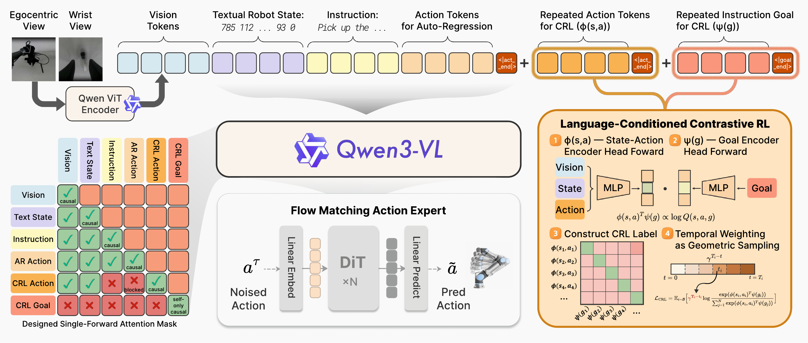
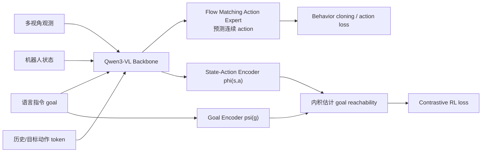
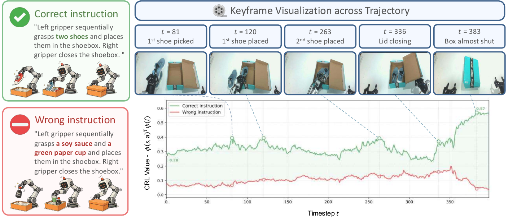
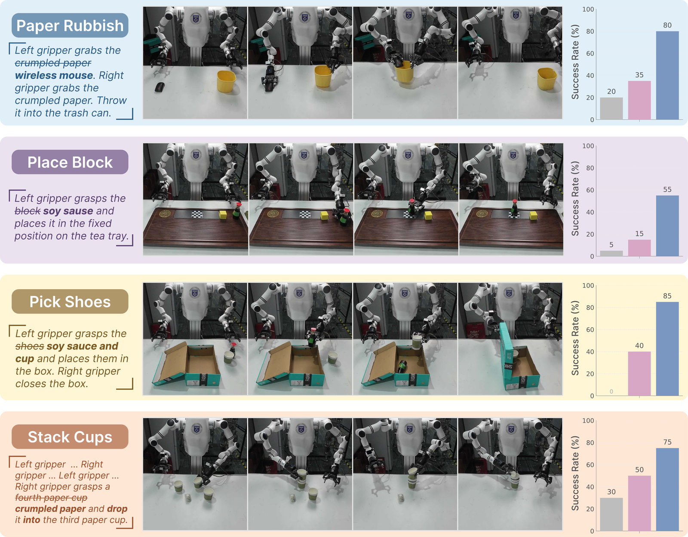
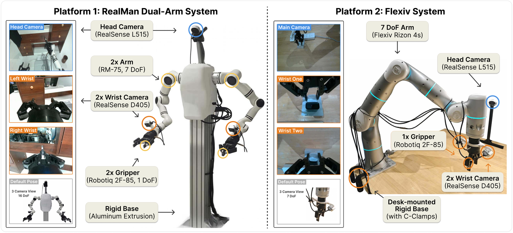
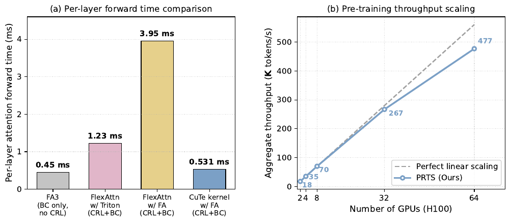

# PRTS：把强化学习原生目标可达性放进 VLA 预训练

> 本文导读 **PRTS: A Primitive Reasoning and Tasking System via Contrastive Representations**。这篇工作来自中国电信人工智能研究院 TeleAI、清华大学、上海交通大学、复旦大学等团队。PRTS 是一个强化学习原生的 VLA 基础模型，核心不是在行为克隆后面补一点 RL，而是把 reward-label-free contrastive reinforcement learning 放进 VLA 预训练本身。

## 1. 先说结论

PRTS 值得放进本教程有两个原因。

第一，它在方法上提出了一个很清楚的问题：**大多数 VLA 只学“专家在这个状态下做了什么”，但没有显式学“当前状态和动作距离语言目标还有多远”。** 这会导致模型在长时程任务、扰动恢复、换初始位姿、换语言表达时容易只模仿局部动作，而缺少任务进度感。

第二，它在基准上有明确公开结果。官方 GitHub News 写明：`PRTS-Droid` 在 MolmoSpaces Leaderboard 上排名第 3，成功率 `42.4%`，超过 NVIDIA DreamZero、MolmoAct2 和 π0.5 等模型。MolmoSpaces `/ms` 榜单搜索结果也能看到 `PRTS-Droid, TeleAI` 的 Combined 条目、TOP3 排名字段和 5B 参数口径。

一句话概括：

> PRTS 的关键不是“换了一个更大的 VLA backbone”，而是把语言目标看成 goal，用轨迹时序结构构造对比 RL 监督，让同一个 Qwen3-VL backbone 同时学动作生成和 goal-reachability awareness。

它应该放在 `06-策略抓取或抓取VLA/大模型控制、VLA、VLM`，接在 PhysBrain 之后。它不是世界模型，也不是导航 benchmark，而是 VLA 预训练范式的一次重要变化。

## 2. 论文、项目、代码和权重

| 条目 | 链接 | 当前状态 |
| :--- | :--- | :--- |
| 论文 | [arXiv:2604.27472](https://arxiv.org/abs/2604.27472) / [HTML](https://arxiv.org/html/2604.27472v1) | 2026-04-30 提交 |
| 项目页 | [rhodes-team-prts.github.io](https://rhodes-team-prts.github.io/) | 官方项目页 |
| GitHub | [TeleHuman/PRTS](https://github.com/TeleHuman/PRTS) | 官方实现，已开源最小 SFT post-training code、LIBERO evaluation、CRL value visualization scripts |
| 预训练权重 | [TeleEmbodied/PRTS-4B](https://huggingface.co/TeleEmbodied/PRTS-4B) | 已公开，HF 模型卡写明基于 Qwen3-VL-4B，约 167B tokens 预训练 |
| LIBERO checkpoint | [TeleEmbodied/PRTS-4B-LIBERO](https://huggingface.co/TeleEmbodied/PRTS-4B-LIBERO) | 官方 README 写为论文 LIBERO 数字对应 checkpoint |
| MolmoSpaces 榜单 | [MolmoSpaces Leaderboard](https://molmospaces.allen.ai/leaderboard/ms) | `PRTS-Droid, TeleAI` 位列 TOP3，官方 README 记录 42.4% SR |

开源边界要写清楚。GitHub README 当前的 release plan 显示：

- PRTS arXiv preprint 已公开。
- PRTS-4B pre-trained checkpoint 已公开。
- Standard LIBERO LeRobot-v2.1 dataset 示例已公开。
- Minimal SFT post-training code for LIBERO + real-robot platforms 已公开。
- LIBERO evaluation of PRTS 已公开。
- PRTS-4B post-trained checkpoint for LIBERO 已公开。
- CRL value visualization scripts 已公开。
- PRTS-4B post-trained checkpoint for SimplerEnv WidowX 仍在后续计划中。

许可证也需要注意：GitHub README 写明项目使用 **CC BY-NC 4.0**，代码和权重可用于学术和非商业用途，商业使用不被该许可证允许。

## 3. MolmoSpaces 排名说明

MolmoSpaces 是 Ai2 推出的开放具身智能生态和基准系统。官方介绍中写到，它统一了 23 万多个室内环境、13 万多个物体模型和 4200 万个稳定抓取标注，并支持 MuJoCo、Isaac、ManiSkill 等常见模拟器。MolmoSpaces-Bench 覆盖静态操作、移动操作、导航和多房间长时程任务，用来评估机器人策略在大规模多样场景里的泛化能力。

PRTS 这次引起关注，是因为 `PRTS-Droid` 进入 MolmoSpaces policy leaderboard 全球 TOP3。这里建议分清两个数字：

| 数字 | 来源 | 含义 |
| :--- | :--- | :--- |
| `42.4%` SR | PRTS 官方 GitHub News | PRTS-Droid 在 MolmoSpaces Leaderboard 上的 success rate 口径 |
| `65.36` | MolmoSpaces `/ms` 榜单搜索结果 | leaderboard 页面展示的 Combined / score 字段之一 |

对教程来说，不需要把这件事写成“PRTS 已经全面超过所有 VLA”。更准确的表述是：

> 在 MolmoSpaces 这个公开具身评测平台上，TeleAI 的 PRTS-Droid 进入 TOP3，说明 reward-label-free contrastive RL pretraining 在 DROID / MolmoSpaces 这类开放场景评测上具有竞争力。

## 4. 为什么普通行为克隆不够

传统 VLA 训练经常可以概括成：

```text
图像 + 语言指令 + 机器人状态
        ↓
预测专家动作
```

这就是 behavior cloning。它非常有效，但有一个盲点：模型只知道当前专家做了什么，不一定知道 **这个动作是否让任务更接近成功**。

举例来说，指令是“把杯子放进盒子”。机器人当前可能处在几种状态：

- 夹爪刚靠近杯子。
- 杯子已经被抓住。
- 杯子已经移动到盒子上方。
- 杯子掉到桌面边缘。
- 杯子放进盒子但盒盖没关。

行为克隆可以在训练轨迹里模仿这些局部动作，但如果遇到偏离示教的状态，它不一定知道“现在离目标更近还是更远”。PRTS 想让 VLA 内部形成一种可量化的任务进度感：当前 state-action 和语言 goal 的匹配程度，近似表示从这里继续执行能到达目标的概率。

论文把这件事称为 **goal-reachability awareness**。

## 5. 主架构图：Qwen3-VL + Flow Matching Action Expert + CRL



**图 1 PRTS 总览。** 左侧是多视角图像、文本机器人状态、语言指令和动作 token；中间是 Qwen3-VL backbone 与 flow matching action expert；右侧是 language-conditioned contrastive RL 分支，用 state-action embedding 与 goal embedding 的内积估计 goal reachability。  
来源：[TeleHuman/PRTS 官方 GitHub](https://github.com/TeleHuman/PRTS)。

这张图可以分成四块读。

第一块是 **输入 token 流**。PRTS 不只看单张图，它包含 egocentric view、wrist view、vision tokens、textual robot state、instruction 和 action tokens。文本化 robot state 是一个重要细节：机器人状态被放进语言模型可处理的序列里，让 backbone 同时看到视觉、语言、状态和动作上下文。

第二块是 **Designed Single-Forward Attention Mask**。图中左下角的 mask 表示哪些 token 可以互相注意。它的作用是让行为克隆动作预测和 CRL value 学习在同一次 forward 内完成，同时避免不该泄漏的信息进入因果路径。例如 CRL action 和 CRL goal 不是随便全互看，而是按自监督目标构造可用上下文。

第三块是 **Flow Matching Action Expert**。PRTS 最终仍然要输出连续机器人动作，所以它在 Qwen3-VL 表征上接了 flow matching action expert，用 DiT 结构从 noised action 预测 denoised action。这个部分和现代连续动作 VLA 的做法一致：不把复杂 6DoF/关节动作硬离散成语言 token，而是用连续生成模型处理动作。

第四块是 **Language-Conditioned Contrastive RL**。这是 PRTS 的核心：构造 state-action encoder `phi(s,a)` 和 goal encoder `psi(g)`，让二者内积近似 `log Q(s,a,g)`，也就是“从当前状态-动作出发，最终到达语言目标 g 的可达性”。

可以用下面这张简化图理解：



## 6. CRL 到底怎么“无奖励”训练

PRTS 的 CRL 不是依赖人工标注 reward。它利用的是演示轨迹天然的时序结构。

在一条成功轨迹中，越靠近后面的状态，通常越接近语言目标。比如“打开抽屉并放入物体”：

```text
t0: 机器人还没接触抽屉
t1: 夹爪靠近把手
t2: 抽屉打开
t3: 物体放入抽屉
t4: 任务完成
```

PRTS 从这种轨迹结构里构造对比监督：同一任务目标下，后续能通向成功的 state-action 应该和 goal embedding 更接近；不匹配的 goal 或错误阶段应该距离更远。论文使用 geometric temporal weighting，让远近时间步对监督强度产生不同贡献。

这就是它所谓 reward-label-free 的含义：

| 普通 RL | PRTS CRL |
| :--- | :--- |
| 需要环境 reward 或人工成功标签 | 从离线轨迹时序中构造目标可达性监督 |
| 通常训练额外 value / Q 网络 | value head 与 VLA backbone 同 forward 联训 |
| 容易比 BC 贵很多 | 官方强调接近 BC compute |
| 常见于 post-training | PRTS 放进 pre-training |

注意这里不是说 PRTS 不需要机器人数据。它仍然需要大量动作标注和具身推理数据。它的“无奖励”指的是不需要额外人工 reward label，不是无数据、无监督。

## 7. Value 可视化：模型真的在看任务进度吗



**图 2 PRTS 的 CRL value 可视化。** 绿色曲线对应正确指令，红色曲线对应错误指令。随着任务推进，正确指令的 goal-reachability value 整体上升，而错误指令保持较低。  
来源：[TeleHuman/PRTS 官方 GitHub](https://github.com/TeleHuman/PRTS)。

这张图非常适合讲 PRTS 和普通 VLA 的差异。

左侧给了两个语言 goal：

- 正确指令：把两只鞋放入鞋盒，右夹爪关上鞋盒。
- 错误指令：把酱油和绿色纸杯放入鞋盒，右夹爪关上鞋盒。

右侧轨迹关键帧显示真实任务进度：第一只鞋被拿起、第一只鞋放入、第二只鞋放入、盒盖关闭、盒子几乎关好。绿色 value 曲线在这些关键阶段附近逐步升高，最后达到更高分；红色曲线始终较低。

这说明 PRTS 的 value 不只是“看图像是否像训练数据”，而是在语言目标条件下判断任务是否更接近完成。对机器人控制来说，这种能力很重要：一旦动作偏离示教，模型需要知道当前状态是否还能通向目标，而不是机械重复下一步。

## 8. 任务泛化：为什么 long-horizon 和 novel instruction 更受益



**图 3 PRTS 的真实任务泛化示例。** 图中展示了 Paper Rubbish、Place Block、Pick Shoes、Stack Cups 等双臂任务，左侧文字中划掉的是训练/原始指令元素，粗体是测试时替换的新物体或新目标。  
来源：[TeleHuman/PRTS 官方 GitHub](https://github.com/TeleHuman/PRTS)。

这张图展示的不是简单抓取，而是指令和物体发生变化后的任务执行。PRTS 的优势应该从两个角度理解。

第一是 **语言目标变化**。例如原任务里可能是抓纸团，测试时换成无线鼠标；原任务可能是放积木，测试时换成酱油瓶。纯行为克隆容易把训练中常见物体和动作模板绑定死，而 CRL 把 state-action 与 language goal 对齐，有助于在新指令下保持任务目标感。

第二是 **长时程阶段变化**。Stack Cups、Pick Shoes 这类任务不是一步抓取结束，而是多个阶段串联。机器人需要知道“已经完成了哪一步，下一步是否还朝目标推进”。goal-reachability representation 正是在补这个短板。

论文里也强调，PRTS 在 long-horizon、contact-rich、zero-shot novel-instruction 设置中收益更明显。这和方法设计是一致的：越是长流程和扰动大的任务，越需要模型理解任务进度，而不只是模仿局部动作。

## 9. 真实硬件平台



**图 4 PRTS 真实机器人评测硬件。** 左侧是 RealMan 双臂系统，右侧是 Flexiv Rizon 4s 单臂系统。图中标出了 head camera、wrist camera、夹爪和默认视角。  
来源：[TeleHuman/PRTS 官方 GitHub](https://github.com/TeleHuman/PRTS)。

PRTS 不只做仿真 benchmark，也做了真实机器人评测。论文中提到两类真实平台：

| 平台 | 形态 | 任务特点 |
| :--- | :--- | :--- |
| RealMan Dual-Arm | 双臂、头部相机、双腕部相机、双夹爪 | 多任务混合后训练，考察双臂长时程和多任务干扰 |
| Flexiv System | 7DoF 单臂、主相机、腕部相机、Robotiq 夹爪 | 细粒度、接触丰富任务，考察空间 grounding 和误差累积 |

论文报告的真实任务包括 Office Long Term、Stack Cups、Flip Tennis Tube、Gear Assembly、Block Combination、Flower Arrangement 等。这里要冷静看：这些是真实验证，但不是人人可一键复现的公开硬件 benchmark。教程里更适合把它作为方法有效性的证据，而不是承诺本地能跑出相同真机结果。

## 10. 预训练效率和 post-training 成本



**图 5 PRTS 预训练效率图。** 官方图强调 PRTS 通过把 CRL 目标合入同一次前向，在接近 BC 的计算成本下获得 goal-reachability 表征。  
来源：[TeleHuman/PRTS 官方 GitHub](https://github.com/TeleHuman/PRTS)。

PRTS 的一个重要卖点是：它不是用极重的在线 RL 或离线 RL pipeline 去补救 VLA，而是在预训练中用额外的对比目标塑形 representation。这样做的好处是：

- 训练阶段可以利用离线轨迹，不依赖真实环境在线试错。
- 不需要人工 reward label。
- 不需要额外训练一个完全分离的 value model。
- 后训练阶段仍然可以接普通 flow matching / SFT action expert。

论文在 LIBERO 上给出的一个关键信息是：PRTS 在标准四套 LIBERO 上平均 SR 达到 98.4，接近或匹配最强 prior 结果，并且在同等 post-training budget 下相比 ABot-M0 更稳，尤其 Long suite 更能体现 goal-reachability-aware representation 的价值。

## 11. MolmoSpaces 这件事到底说明了什么

MolmoSpaces TOP3 是一个值得写进 News 的结果，但它证明的是一件比较具体的事：

> 在 MolmoSpaces 这种更大规模、多场景、偏 zero-shot 泛化的机器人策略榜单上，PRTS-Droid 的 checkpoint 具有很强竞争力。

它不能直接推出：

- PRTS 已经在所有真实机器人任务上超过所有模型。
- PRTS 的每个 checkpoint 都能不适配直接上任意机器人。
- Contrastive RL pretraining 已经替代全部行为克隆或后训练。

更准确的判断是：MolmoSpaces 排名强化了 PRTS 论文的核心论点，即 **给 VLA 预训练加入目标可达性意识，确实可能提升开放场景和长时程泛化能力**。

## 12. 现在怎么复现

当前最现实的复现路径不是从头预训练 PRTS，因为官方 HF 模型卡写明预训练用了约 167B tokens 和 64 张 H100。对于教程学习，建议按三档来做。

### 12.1 只加载 checkpoint

HF 模型卡给出最小加载方式：

```bash
pip install "transformers==4.57.3" torch safetensors huggingface_hub \
    numpy pillow sentencepiece protobuf colorama tokenizers
pip install accelerate
```

```python
import torch
from transformers import AutoConfig, AutoModel, AutoProcessor

repo_id = "TeleEmbodied/PRTS-4B"

config = AutoConfig.from_pretrained(repo_id, trust_remote_code=True)
model = AutoModel.from_pretrained(
    repo_id,
    trust_remote_code=True,
    torch_dtype=torch.bfloat16,
    device_map="auto",
)
processor = AutoProcessor.from_pretrained(repo_id, trust_remote_code=True)
```

这个 smoke test 只能说明：

- HF 权重能下载。
- custom code 能被 `transformers` 加载。
- 模型结构和 processor 能初始化。

它不能说明：

- 机器人 action 输出已经能控制真实硬件。
- MolmoSpaces 排名可以本地复现。
- CRL value 可视化和 LIBERO 评测已经跑通。

### 12.2 跑 LIBERO / LeRobot 示例

如果要进一步复现，建议从官方 LIBERO checkpoint 和 LeRobot-format 数据开始。官方 GitHub 提供了 `configs`、`examples`、`scripts`、`prts` 等目录，并发布了 minimal SFT post-training code。

学习顺序建议：

1. 克隆仓库。
2. 安装 `requirements.txt`。
3. 下载 `TeleEmbodied/PRTS-4B-LIBERO`。
4. 使用官方 LIBERO LeRobot-v2.1 数据。
5. 先跑 evaluation，再考虑改 post-training 配置。

不要一开始就改自己的机械臂数据。PRTS 的输入包含视觉、文本状态、指令、动作 token、CRL action / goal 等多种 token，action layout 和 mask 一旦错，模型可能能跑但结果不可用。

### 12.3 复现 MolmoSpaces 排名

MolmoSpaces 排名复现需要更多条件：

- DROID 对应 checkpoint 或 fine-tuning launcher。
- MolmoSpaces benchmark 环境。
- 指定任务、场景、相机、机器人初始状态和 evaluation protocol。
- policy wrapper 与 MolmoSpaces evaluation harness 适配。

官方 GitHub News 提到 MolmoSpaces checkpoint 是用最新 DROID fine-tuning launcher 训练的。教程当前不建议写成手把手 MolmoSpaces 复现，因为完整跑榜成本和工程依赖较高。更合理的是先把榜单作为阅读入口和方法验证证据。

## 13. 和其他 VLA 工作的关系

| 方法 | 主要关注点 | 和 PRTS 的区别 |
| :--- | :--- | :--- |
| OpenVLA / OpenVLA-OFT | 开源 VLA 基座与 fine-tuning 流水线 | PRTS 强调 CRL 预训练中的目标可达性 |
| π0 / π0.5 | 强 VLA policy baseline | PRTS 在论文和 MolmoSpaces 中把 π0.5 作为对比对象 |
| 3DVLA | 3D 空间和实例 token 注入 VLA | PRTS 不是几何模块，而是目标可达性表征学习 |
| PhysBrain | 从人类视频中抽取物理常识再适配 VLA | PRTS 从离线轨迹时序中构造 CRL goal-reachability 监督 |
| RAW-Dream | 在 task-agnostic world model 里强化 VLA | PRTS 不是 world model rollout RL，而是 VLA 预训练目标改造 |
| WALL-OSS | 开源 VLA 模型和工程框架 | PRTS 更突出 reward-free contrastive RL into pre-training |

如果按“VLA 为什么失败”来分类：

- 3DVLA 认为失败常来自 3D 空间和实例理解不足。
- PhysBrain 认为失败常来自物理常识不足。
- PRTS 认为失败常来自任务进度和目标可达性不足。

这三篇可以放在同一个 Task04 里对比，非常适合组队学习。

## 14. 局限和需要冷静看的地方

第一，MolmoSpaces TOP3 是很强的榜单结果，但排行榜会更新。教程写的是截至 2026-07-18 检索到的状态，后续排名可能变化。

第二，PRTS 不是无成本 RL。它不需要人工 reward label，但仍需要大量离线轨迹、动作标注和具身推理数据。HF 模型卡写明预训练规模约 167B tokens，使用 64 张 H100。

第三，商业使用受限。当前项目许可证是 CC BY-NC 4.0，不能默认用于商业产品。

第四，完整复现 MolmoSpaces 排名不是轻量任务。它需要 MolmoSpaces 环境、DROID checkpoint、评测 harness 和较高算力。

第五，goal-reachability 不是万能奖励。它能帮助模型判断任务进度，但在极端接触、柔性物体、传感器噪声、执行器误差和 unseen hardware 上，仍然需要后训练、控制器适配和安全约束。

## 15. 推荐作业

组队学习里可以把 PRTS 放在操作控制方向 Task04：

> 对比 3DVLA、PhysBrain、PRTS：三者分别从 3D 空间、物理常识、目标可达性三个角度增强 VLA。它们的输入、训练信号、输出动作和开源边界分别是什么？

推荐交付：

- 解释 PRTS 为什么叫 reward-label-free contrastive RL。
- 画出 `phi(s,a)`、`psi(g)` 和 action expert 的关系。
- 说明 MolmoSpaces TOP3 证明了什么，没有证明什么。
- 说明当前 PRTS-4B、PRTS-4B-LIBERO、GitHub code 能复现到哪一步。
- 对比 PRTS 和 π0.5：π0.5 是 baseline，不是 PRTS 基座。

## 16. 引用与图片来源

本文图片来自 [TeleHuman/PRTS 官方 GitHub](https://github.com/TeleHuman/PRTS)，为了教程稳定访问已保存到本地 `assets/`。论文内容参考 [arXiv:2604.27472](https://arxiv.org/abs/2604.27472)、[PRTS-4B Hugging Face 模型卡](https://huggingface.co/TeleEmbodied/PRTS-4B)、[MolmoSpaces Leaderboard](https://molmospaces.allen.ai/leaderboard/ms)、[MolmoSpaces 论文](https://arxiv.org/abs/2602.11337) 和 [Ai2 MolmoSpaces 介绍](https://allenai.org/blog/molmospaces)。

