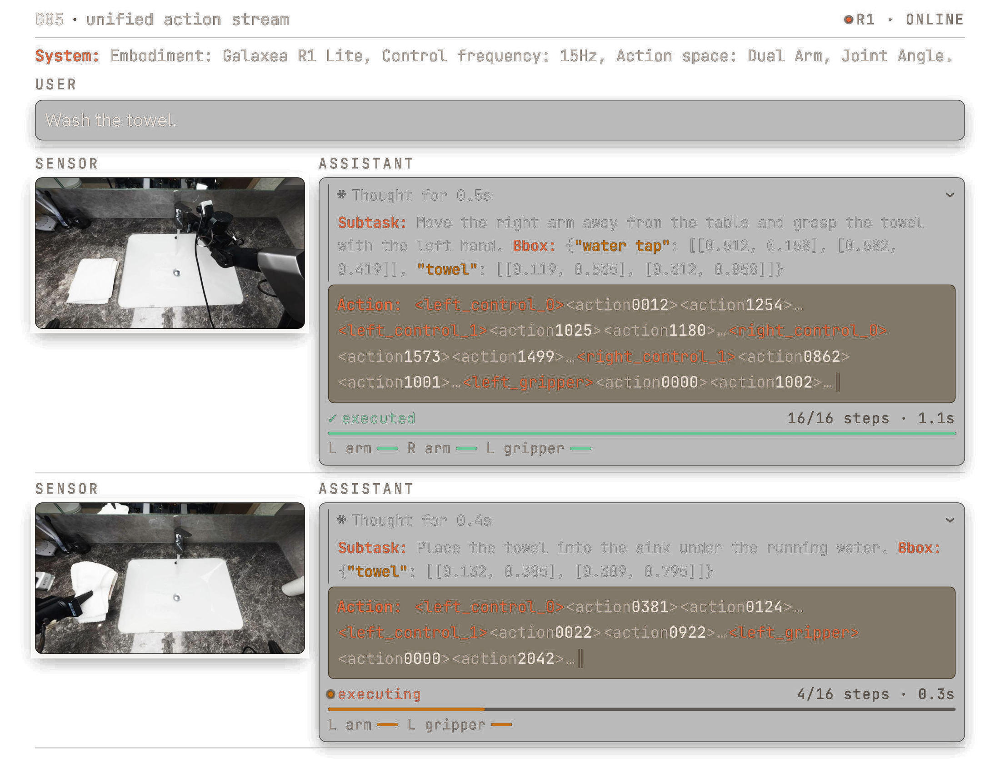
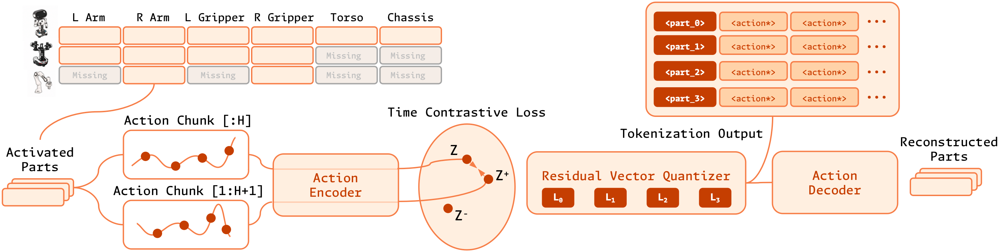
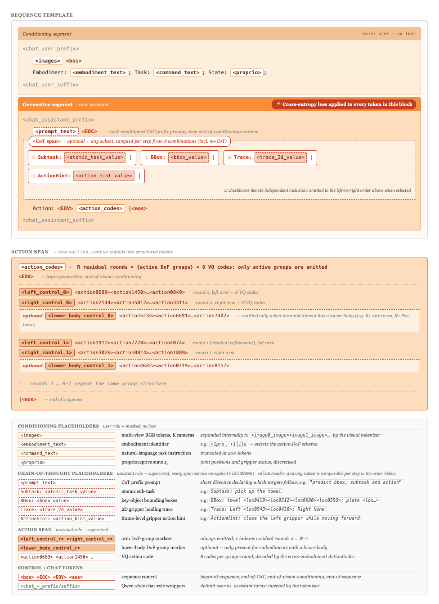
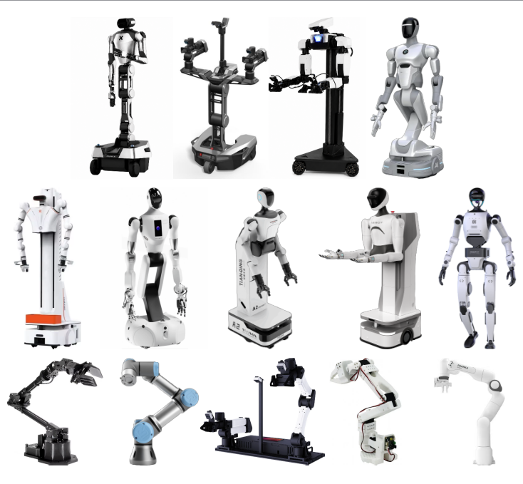
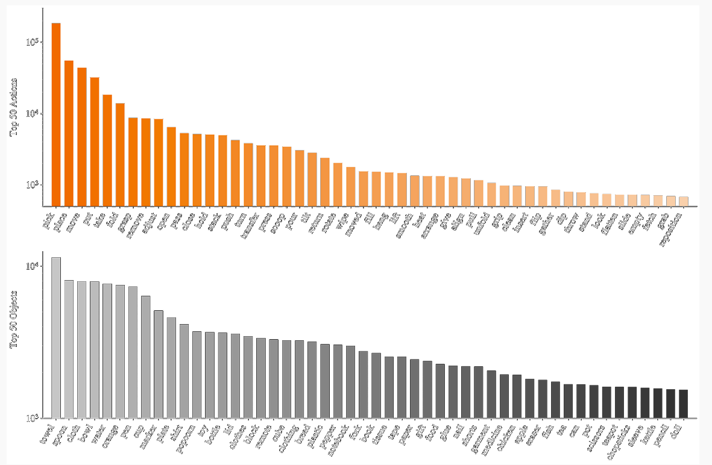
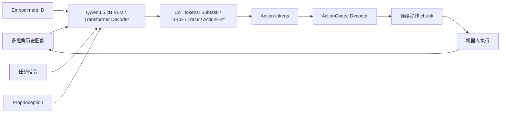
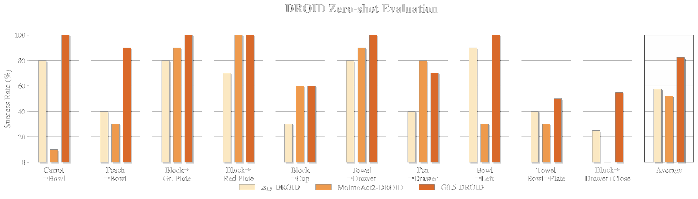
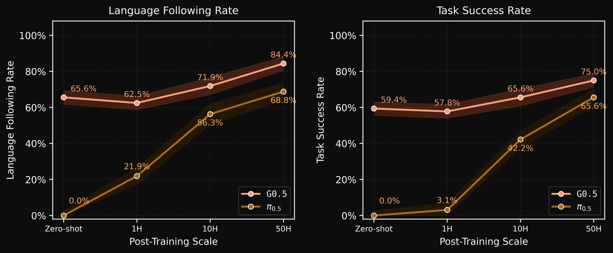
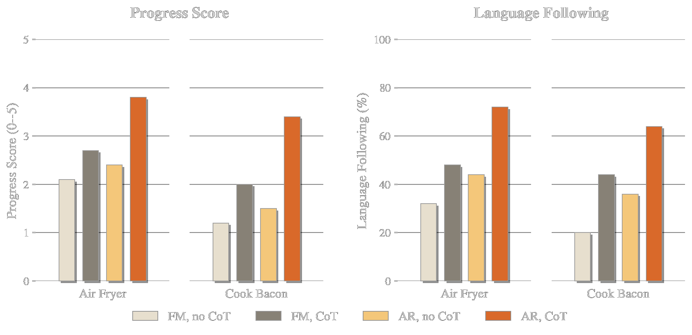

# Galaxea G0.5：记忆、CoT 与动作 token 统一到一条自回归 VLA 流

> 本文导读 **Galaxea G0.5 Technical Report**。G0.5 是 Galaxea 在 2026 年 6 月公开的自回归 Vision-Language-Action 模型。它的核心不是把 VLM 当视觉语言编码器，然后在后面接一个单独动作头，而是让同一个 transformer decoder 直接生成 reasoning tokens 和 action tokens，把“看见什么、现在做什么子任务、目标在哪里、该输出哪组动作 token”放在同一条 next-token prediction 链路里。

## 1. 先说结论：记忆 + CoT + 动作表征为什么能打

如果把 G0.5 用一句话概括，就是：

> G0.5 把过去几秒的多视角视觉记忆、可选的结构化 Chain-of-Thought、跨本体动作 tokenization 放到同一个自回归序列里，让 VLA 不再只是“看当前帧 -> 回归动作”，而是“读历史观测 -> 写出中间推理 -> 继续写动作 token -> 解码成动作 chunk”。

它确实是当前 VLA 里很值得关注的一条路线。官方 README 和模型卡给出的公开结果包括：DROID zero-shot `82.5%`、Bridge-SimplerEnv `87.3%`、RoboTwin 2.0 `93.3%`、LIBERO `98.9%`、BEHAVIOR-1K task success score `0.3136`，以及 R1-Lite / R1-Pro 真实机器人 fine-tuning 后平均成功率 `76.7%`。

但这个“SOTA”需要冷静理解。G0.5 的强，不是单点 trick，而是三件事叠在一起：

1. **自回归统一接口**：推理文本和动作 token 都是同一个 decoder 写出来的 token，而不是外部 planner 写推理、另一个 action head 出动作。
2. **ActionCodec 动作表征**：把不同机器人动作映射到共享的 27 维动作空间，再用 residual vector quantizer 离散成 token，使 autoregressive VLA 真正能在 token 空间输出动作。
3. **视觉记忆与结构化 CoT**：使用 5 秒窗口内 6 帧历史图像，并允许生成 `Subtask`、`BBox`、`Trace`、`ActionHint` 等结构化中间 token，让后续动作 token 能直接 attend 到这些中间结果。

所以它适合放在本教程的 `06-策略抓取或抓取VLA/大模型控制、VLA、VLM` 章节，接在 PRTS 之后。G0.5 不是世界模型，也不是导航规划框架，而是 VLA 结构和动作表征的一次重要工程化推进。

## 2. 论文、项目、代码和权重

| 条目 | 链接 | 当前状态 |
| :--- | :--- | :--- |
| 技术报告 | [Galaxea G0.5 Technical Report](https://opengalaxea.github.io/G05/Galaxea_G0_5.pdf) | 2026 年技术报告 |
| 项目页 | [opengalaxea.github.io/G05](https://opengalaxea.github.io/G05/) | 官方项目页，包含图、视频和 benchmark 展示 |
| GitHub | [OpenGalaxea/GalaxeaVLA](https://github.com/OpenGalaxea/GalaxeaVLA) | 官方开源仓库，包含训练、评测、部署入口 |
| 模型权重 | [OpenGalaxea/G05](https://huggingface.co/OpenGalaxea/G05) | Hugging Face gated model，需要登录并同意条件 |
| 数据集 | [OpenGalaxea/Galaxea-Open-World-Dataset](https://huggingface.co/datasets/OpenGalaxea/Galaxea-Open-World-Dataset) | 官方开放世界机器人数据集 |
| 旧版 G0-VLA | [OpenGalaxea/G0-VLA](https://huggingface.co/OpenGalaxea/G0-VLA) | G0 / G0Plus 历史权重入口 |

开源边界要特别说明。GitHub README 写明，G0.5 相关内容从 2026-06-16 之后采用 **G0.5 Community License Agreement**，允许非商业用途，包括学术研究、个人使用、教育和评测；商业部署、向第三方提供服务或产品化需要单独商业授权。HF 模型卡也显示模型仓库虽然公开可见，但需要同意访问条件才能下载文件。

## 3. 输入输出：它到底吃什么、吐什么

G0.5 的输入可以写成：

```text
过去 5 秒内采样的 6 帧多视角 RGB 图像
    + Embodiment ID / embodiment text
    + 自然语言任务指令
    + Proprioception / robot state
```

输出可以写成：

```text
可选 CoT reasoning tokens
    + 必需 action token sequence
    -> ActionCodec decoder
    -> 连续机器人控制动作 chunk
```

一个典型生成片段类似：

```text
Subtask: grasp the towel
BBox: {"towel": [[x1, y1], [x2, y2]]}
Trace: Left <loc0543><loc0436>; Right None
ActionHint: close the left gripper while moving forward
Action:
<left_control_0><action0689><action1450>...
<right_control_0><action2144><action5012>...
<left_gripper><action0000><action1002>...
```

这里最重要的不是“模型会不会输出一段看起来像推理的话”，而是 **推理 token 和动作 token 在同一个 assistant span 里连续生成**。这意味着动作 token 的生成上下文里能直接看到前面的 `Subtask`、`BBox`、`Trace` 和 `ActionHint`。如果 CoT 是外部模块或离线标注，动作头只能间接利用它；G0.5 的设计是让 action token 本身沿着这条 token 流继续生成。

## 4. 总览图：G0.5 把机器人控制做成 token 流



**图 1 G0.5 的统一动作流示例。** 左侧是传感器图像和自然语言任务，右侧 assistant 先生成 `Subtask` 与 `BBox`，再继续生成 action tokens。图中还能看到 action chunk 以 16 step 为一段被执行，执行过程中模型会在新观测到来后继续闭环重规划。  
来源：[G0.5 官方项目页](https://opengalaxea.github.io/G05/)。

这张图可以直接回答“记忆 + CoT + 动作表征是不是 SOTA”的核心逻辑：

第一，G0.5 明确把机器人控制写成 **chat-like sequence**。系统消息里有 embodiment、控制频率和动作空间，用户消息里有任务指令，sensor 区域给出视觉观测，assistant 输出里既有思考字段，也有动作字段。

第二，动作不是一句自然语言，而是结构化 action token。例如 `<left_control_0><action0012><action1254>...` 表示左臂某一轮 residual quantization 的动作 token；`<left_gripper>` 后面接夹爪 token；多组动作 token 组合起来，再由 ActionCodec 解码为连续控制。

第三，执行是 chunked closed-loop。图中第一段 action 已执行完 `16/16 steps`，第二段正在执行 `4/16 steps`。这说明 G0.5 不是一次性预测整条长轨迹，而是每次根据新观测重新生成后续 action chunk。

## 5. ActionCodec：为什么动作表征是关键



**图 2 G0.5 的 ActionCodec tokenizer。** 不同机器人有不同自由度和动作布局，G0.5 先把活跃运动部件映射到共享动作空间，再用 residual vector quantizer 产生离散 action tokens，最后由 action decoder 重构对应部件的连续动作。  
来源：[OpenGalaxea/GalaxeaVLA 官方仓库](https://github.com/OpenGalaxea/GalaxeaVLA)。

VLA 做动作有两条常见路线：

| 路线 | 优点 | 问题 |
| :--- | :--- | :--- |
| 连续动作回归 / diffusion / flow matching | 适合高维连续控制，动作平滑 | 不天然适配 LLM 的 token 生成接口 |
| 离散 action token | 可以和语言 token 共用自回归接口 | 如果 tokenization 不好，会损失控制精度和跨机器人泛化 |

G0.5 选择第二条路线，并用 ActionCodec 缓解离散化的问题。

官方 README 写明，G0.5 把异构机器人动作映射到共享的 27 维动作空间：

```text
left_control(9)
left_gripper(1)
right_control(9)
right_gripper(1)
lower_body(7)
```

这个设计的关键是 **按部件分组**。双臂机器人、单臂机器人、移动底盘、人形机器人并不是每个自由度都一样。G0.5 不强行让所有机器人输出完整 27 维动作，而是只生成 active motion groups。图中左侧 `Activated Parts` 表示当前机器人和当前动作需要哪些部件，右侧 tokenization output 只对这些部件输出 token，空闲或不存在的自由度不需要填充无意义 token。

Residual vector quantizer 的作用可以理解成多轮精修：

```text
连续动作 chunk
    -> action encoder
    -> 第 0 轮 VQ code 给出粗动作
    -> 第 1 轮 VQ code 修残差
    -> ...
    -> action token 序列
    -> action decoder 重构连续控制
```

这样做的好处是动作 token 能被 LLM 式 decoder 生成，同时又不只用一个粗糙离散码表示复杂动作。对机器人来说，这比把每个关节角简单分桶更合理，因为真实动作往往有部件相关性和时间连续性。

## 6. Token 模板：CoT 不是自由发挥，而是结构化接口



**图 3 G0.5 的 token sequence template。** conditioning segment 放图像、embodiment、任务和状态；generative segment 由 assistant 生成，CoT span 可以包含 `Subtask`、`BBox`、`Trace`、`ActionHint`，随后生成 `Action: <action_codes>`。  
来源：[OpenGalaxea/GalaxeaVLA 官方仓库](https://github.com/OpenGalaxea/GalaxeaVLA)。

这张图很重要，因为它解释了 G0.5 的 CoT 不是随便让模型“想一想”。它把 CoT 限定为机器人控制可用的中间变量：

| 字段 | 含义 | 对动作有什么帮助 |
| :--- | :--- | :--- |
| `Subtask` | 当前原子子任务 | 把长任务拆成短阶段，例如先抓毛巾、再移到水池 |
| `BBox` | 关键目标框 | 把语言目标落到图像位置，降低抓错物体概率 |
| `Trace` | 2D gripper landing trace | 给出夹爪落点和粗轨迹，帮助动作 token 对齐目标 |
| `ActionHint` | 帧级动作提示 | 用短语约束动作趋势，例如靠近、闭合夹爪、移动到容器上方 |

这些字段都是可选的，图中也写了 CoT span 可以采样任意子集，甚至 no-CoT。也就是说，G0.5 不是每一步都必须输出完整解释，而是可以根据任务复杂度决定是否生成中间推理。

从训练目标看，conditioning segment 是用户侧输入，不计算 loss；assistant 侧的 reasoning tokens 和 action tokens 都用 cross-entropy 训练。这就是 G0.5 很“LLM 化”的地方：动作也被纳入 next-token prediction，而不是在语言模型之外单独训练一个动作回归器。

## 7. 视觉记忆：为什么是过去 5 秒 6 帧

很多 VLA 失败不是因为单帧看不清，而是因为单帧不知道“刚才发生了什么”。例如：

- 毛巾已经被夹爪碰过，但当前帧看起来还在桌面附近。
- 抽屉刚被拉开，目标物体只在前几帧出现过。
- 机械臂遮挡目标，当前帧只看到夹爪和背景。
- 长任务中当前步骤依赖上一个步骤是否完成。

G0.5 使用多秒视觉历史，把过去 5 秒内的 6 帧多视角 RGB 图像送入视觉编码器，并用 factorized spatial-temporal attention 注入历史信息。官方 README 还提到，预训练时使用 stochastic history-frame dropout，降低模型死记某个固定历史帧组合的风险；历史 token 在最后一层被丢弃，用来控制推理延迟。

这可以理解成一种 **短期视觉工作记忆**。它不像数据库检索那样保存分钟级经验，也不是世界模型 rollout；它更像给动作生成器补上最近几秒的视觉上下文，让模型知道“当前动作处在任务过程的哪个阶段”。

## 8. 多本体数据：为什么要有 Embodiment ID



**图 4 G0.5 涉及的多机器人本体。** 项目页展示了多类机器人形态，包括双臂移动机器人、单臂机械臂、人形平台等。不同本体的动作空间不同，因此必须有 embodiment 条件和统一动作编码。  
来源：[G0.5 官方项目页](https://opengalaxea.github.io/G05/)。

G0.5 预训练来自 14 种 embodiment 的机器人演示，同时混合大规模 web 和 embodied VQA 数据。这里有一个关键设计：**embodiment id 不是附属标签，而是输入序列的一部分**。模型需要知道自己控制的是 R1 Lite、R1 Pro、SO-100/101、DROID/Franka，还是其他机器人形态。

这件事和 ActionCodec 是配套的：

```text
同一句指令：pick up the towel
    + R1 Lite embodiment -> 双臂 + 底盘布局
    + SO-101 embodiment  -> 低成本单臂布局
    + DROID embodiment   -> Franka / DROID 控制布局
    -> 生成不同 active action groups
```

如果没有 embodiment 条件，统一动作 token 会变成歧义接口。相同的 `<left_control_0>` 对不同机器人可能没有意义，或者对应完全不同的物理执行器。

## 9. 数据分布：它学到的是开放世界操作词汇



**图 5 G0.5 项目页展示的数据动作和物体分布。** 上半部分是高频动作词，下半部分是高频物体词。可以看到 `pick`、`place`、`move`、`put`、`take` 等操作词，以及 towel、spoon、cloth、bowl、water、cup 等日常物体。  
来源：[G0.5 官方项目页](https://opengalaxea.github.io/G05/)。

G0.5 的任务不是只在一个 tabletop benchmark 上过拟合。它强调 open-world manipulation，因此数据里覆盖了大量家庭、厨房、零售、办公室场景，以及大量日常物体和动作。官方数据集说明 Galaxea Open-World Dataset 包含 500+ 小时真实移动操作数据，并提供 RLDS 和 LeRobot 格式。

这解释了为什么 G0.5 在“Pick up Anything & Place Anywhere”这类任务上有竞争力：模型不是只见过固定几种方块/杯子，而是预训练阶段已经接触了很多日常操作语言和物体视觉外观。

但也要注意：数据多样性不等于任意任务都会成功。VLA 的泛化仍然受限于相机视角、动作接口、夹爪能力、物体材质、接触动力学、任务安全约束和后训练数据质量。

## 10. 训练目标：VQA 和 action 用同一个 CE 目标

G0.5 的预训练不是纯机器人轨迹训练。官方 README 写明，它从 Qwen3.5 2B VLM 初始化，在 14 种 embodiment 的机器人演示、大规模 web 数据和 embodied VQA 数据上训练。机器人 action samples 和 VQA samples 使用同一个 cross-entropy objective，VQA-to-action mixing ratio 为 `1:4`。

这个选择有两层含义。

第一，保留 VLM 能力。很多 VLA 如果只在动作数据上训练，很容易损失语言理解、视觉问答和开放词汇 grounding 能力。G0.5 继续混合 VQA，是为了让模型仍然能理解任务、物体和场景。

第二，把动作纳入语言模型式训练。只要动作可以被 ActionCodec 离散成 token，模型就能用和语言相同的 CE loss 学动作序列。这也是它“VLM-as-Actor”的核心：不是 VLM 给特征，action expert 做控制；而是 VLM decoder 本身就是 action token generator。

可以用下面的流程理解：



## 11. DROID zero-shot：它证明了什么



**图 6 G0.5 在 DROID zero-shot evaluation 上的结果。** 官方项目页对比了 `π0.5-DROID`、`MolmoAct2-DROID` 和 `G0.5-DROID`，平均成功率柱状图中 G0.5 最高。  
来源：[G0.5 官方项目页](https://opengalaxea.github.io/G05/)。

DROID zero-shot 结果能说明的是：在 DROID/Franka 这一类真实机器人数据和任务设定下，G0.5 的自回归动作 token 路线有很强的 zero-shot 操作能力。官方 README 给出的数字是 `82.5%` zero-shot success on DROID。

它不能说明的是：

- G0.5 对任意机器人都能零样本部署。
- G0.5 已经解决所有长时程家庭操作。
- Action token 一定比 flow matching / diffusion action head 在所有任务上更好。

更准确的判断是：DROID 结果支持 G0.5 的一个核心论点，即 **只要动作 tokenization 足够好，自回归 decoder 可以直接承担动作生成，而不是只能做语言规划或视觉编码**。

## 12. Pick-and-Place Benchmark：少量后训练为什么有效



**图 7 G0.5 在 Pick up Anything & Place Anywhere 设置中的数据规模曲线。** 横轴是 post-training 数据规模，纵轴分别是语言跟随率和任务成功率。G0.5 在 zero-shot、1H、10H、50H 设置下都明显高于 π0.5 曲线。  
来源：[G0.5 官方项目页](https://opengalaxea.github.io/G05/)。

这张图适合和实际项目联系起来。很多团队没有几千小时机器人数据，只能做少量任务数据后训练。G0.5 的曲线显示，强预训练模型在 1H、10H、50H 的 post-training 下能快速适配任务，特别是语言跟随率上升很明显。

但这里也要看清楚评测定义。Pick-and-Place Benchmark 是官方设定的任务，场景包含多个物体和容器，要求模型先根据语言找目标，再 pick，再 place。它很有价值，但不是通用真实家庭任务的全部。它更适合作为“语言 grounding + 抓放动作泛化”的局部证据。

## 13. CoT 消融：为什么 AR + CoT 更适合长时程任务



**图 8 G0.5 对 CoT 和动作头的探针实验。** 图中比较了 `FM, no CoT`、`FM, CoT`、`AR, no CoT`、`AR, CoT` 四种组合，在 Air Fryer 和 Cook Bacon 两个未见长时程任务上的 process score 和 language following。`AR, CoT` 的提升最明显。  
来源：[G0.5 官方项目页](https://opengalaxea.github.io/G05/)。

这个实验回答了一个常见疑问：CoT 会不会只是“好看的解释”，对机器人控制没有实际帮助？

项目页给出的结论是：在单阶段 PP Bench 上，开启 CoT 对 AR 成功率提升不大；但在 Air Fryer 和 Cook Bacon 这类五阶段、未见过的长时程任务上，CoT 带来的提升明显。原因也比较合理：短任务没有太多可分解结构，CoT 可发挥空间有限；长任务需要先拆阶段、再找物体、再规划动作顺序，结构化 CoT 更容易帮助动作 token 跟随任务进度。

更关键的是 AR 和 FM 的差异。G0.5 项目页中提出的解释是：AR action tokens 与 CoT 在同一生成流里，动作 token 可以直接 attend 到前面的 CoT；而 flow-matching expert 通常只能条件在隐藏状态摘要上，利用 CoT 的方式更间接。因此在 matched CoT 条件下，AR head 更受益。

## 14. 和 G0 / G0Plus 的关系

G0.5 不是最早的 Galaxea VLA。它是在 G0、G0Plus 之后的新一代路线。

| 版本 | 主要形态 | 当前教程里的理解 |
| :--- | :--- | :--- |
| G0 | dual-system VLA，VLM 做多模态规划，VLA 做细粒度执行 | 更像 planner + executor 的组合 |
| G0Plus / G0Tiny | 更大规模 teleoperation/web 数据、更轻量 edge 模型、G0Plus 任务 checkpoint | 旧 release line，历史权重仍在 HF |
| G0.5 | unified autoregressive VLA，reasoning tokens 和 action tokens 同流生成 | 当前最值得重点读的路线 |

官方 README 也明确说，当前分支聚焦 G0.5，旧的 G0Plus Dockerfiles、Fold Towels/Handover Gift demo guides 和 pi0/pi0fast training configs 不再包含在当前分支中；如果需要旧版文件布局，需要查看指定历史 commit。

## 15. 现在怎么复现

这里不建议把教程写成“从头复现 G0.5 训练”。更现实的是三档复现。

### 15.1 只做代码和权重入口检查

官方 README 给出的基础环境要求：

| 模式 | 显存需求 | 示例 GPU |
| :--- | :--- | :--- |
| Inference | `> 8 GB` | RTX 3090 / RTX 4090 |
| Full fine-tuning | `> 70 GB` | A100 80GB / H20 96GB |

官方测试环境包括 Linux、Python `>=3.10.16,<3.11`、CUDA 12.8、PyTorch 2.7.1 cu128 wheels、`flash-attn-4`、`flash-linear-attention` 和 `ffmpeg`。

最小安装路径：

```bash
git clone https://github.com/OpenGalaxea/GalaxeaVLA
cd GalaxeaVLA
uv sync --index-strategy unsafe-best-match
source .venv/bin/activate
```

下载 HF 模型：

```bash
huggingface-cli download OpenGalaxea/G05 \
    --repo-type model \
    --local-dir checkpoints
```

注意：HF 仓库需要登录并同意访问条件。完整 checkpoint 布局比较大，官方 README 提到包含 RoboTwin checkpoint 时约 55GB；单个 G0.5 model checkpoint 约 11GB，共享 `action_tokenizer.pt` 约 484MB。

### 15.2 跑官方 lightweight validation

官方 README 建议在昂贵任务前先跑轻量检查：

```bash
python tools/resolve_config.py r1pro --key model.model_arch
python tools/resolve_config.py r1pro --key data.embodiment_datasets.galaxea_r1pro.dataset_groups
python -c "import torch, g05; print(torch.__version__); print(g05.__file__)"
```

这个 smoke test 只能说明：

- 代码环境可导入。
- 配置系统能解析。
- PyTorch 和 `g05` 包路径可见。

它不能说明：

- 模型权重已经下载完整。
- 真实机器人可以安全执行。
- LIBERO / RoboTwin / DROID benchmark 已经复现。

### 15.3 选择一个官方入口继续做

如果只是学习，优先级可以这样排：

| 目标 | 官方入口 | 难度 |
| :--- | :--- | :--- |
| 看模型和配置 | `tools/resolve_config.py` | 低 |
| LIBERO evaluation | `experiments/libero` / `scripts/run/eval_libero.sh` | 中，需要 LIBERO simulator |
| RoboTwin 2.0 evaluation | `experiments/robotwin` | 中高，需要 RoboTwin 依赖和资产 |
| SO-100/101 部署 | `experiments/so100` | 中高，需要真实硬件 |
| R1 Lite / R1 Pro 部署 | `experiments/r1lite` / `experiments/r1pro` | 高，需要 Galaxea 硬件和 ROS2 |
| DROID / Franka 部署 | `experiments/droid` + `OpenGalaxea/droid-franka-client` | 高，需要 Franka/DROID 控制链路 |

不要一开始就改自己的机器人。G0.5 的 action token 与 embodiment、parts meta、dataset stats、ActionCodec tokenizer 是绑定的。换机器人时，最容易出错的不是模型 forward，而是 action layout、normalization stats、active parts、ROS topic 和安全限幅。

## 16. 和其他 VLA 工作的关系

| 方法 | 主要增强点 | 和 G0.5 的区别 |
| :--- | :--- | :--- |
| OpenVLA / OpenVLA-OFT | 开源 VLA 基座和 fine-tuning 流水线 | G0.5 更强调 VLM-as-Actor 和自回归 action token |
| π0 / π0.5 | 强连续动作 VLA baseline | G0.5 在项目页中把 π0.5 作为 DROID / PP Bench 对比对象 |
| EventVLA | 视觉证据记忆 | G0.5 的视觉记忆是短时多帧历史，不是事件记忆库 |
| 3DVLA | 3D 空间和实例理解 | G0.5 重点是 token 流、ActionCodec 和 CoT |
| PhysBrain | 物理常识预训练 | G0.5 更偏 action representation 和多本体控制接口 |
| PRTS | CRL 目标可达性预训练 | G0.5 更偏自回归接口和动作 tokenization |
| RAW-Dream | 世界模型里 imagined RL | G0.5 不是 world model rollout，而是直接输出动作的 VLA policy |

如果按“VLA 为什么失败”来分类：

- EventVLA 认为失败来自长时域视觉证据丢失。
- 3DVLA 认为失败来自 3D 空间和实例理解不足。
- PhysBrain 认为失败来自物理常识不足。
- PRTS 认为失败来自目标可达性和任务进度感不足。
- G0.5 认为失败还来自接口割裂：推理、动作表征、跨本体控制没有放到同一条可训练、可生成、可部署的 token 流里。

## 17. 局限和需要冷静看的地方

第一，G0.5 的公开权重虽然在 HF 上，但需要接受访问条件，不是无门槛匿名下载。G0.5 Community License 也限制商业使用。

第二，ActionCodec 解决的是统一动作表征问题，不等于任意新机器人都能直接接入。新 embodiment 仍然需要清楚定义 active parts、动作维度、归一化统计、控制频率、观测相机和安全控制链路。

第三，CoT 有帮助，但不是越长越好。短任务里 CoT 的收益有限；长任务中如果中间 grounding 错了，后续 action token 可能沿着错误目标继续执行。

第四，视觉记忆是短期历史，不是长期任务记忆。过去 5 秒 6 帧适合补充最近状态变化，但不能替代长期语义记忆、检索式经验库或世界模型规划。

第五，benchmark 结果要看协议。DROID、Bridge-SimplerEnv、RoboTwin、LIBERO、BEHAVIOR-1K、真实 R1 任务的机器人、本体、数据和评价口径都不同，不能只用一个平均数字概括模型能力。

## 18. 推荐作业

组队学习里可以把 G0.5 放在操作控制方向 Task04：

> 对比 EventVLA、PRTS、G0.5：三者分别从视觉记忆、目标可达性、统一自回归动作流解决 VLA 的什么问题？它们的输入、训练信号、动作输出和复现边界分别是什么？

作业可以回答这些问题：

- G0.5 为什么说是 VLM-as-Actor，而不是 VLM-as-Encoder？
- ActionCodec 的 27 维共享动作空间怎么组织？
- `Subtask`、`BBox`、`Trace`、`ActionHint` 分别对应什么中间信息？
- 为什么 AR + CoT 在长时程任务中比 no-CoT 更明显？
- 当前官方代码和权重能复现到哪一步，哪些需要真实机器人或大算力？

## 19. 引用与图片来源

本文图片来自 [G0.5 官方项目页](https://opengalaxea.github.io/G05/) 和 [OpenGalaxea/GalaxeaVLA 官方仓库](https://github.com/OpenGalaxea/GalaxeaVLA)，为了教程稳定访问已保存到本地 `assets/`。文字内容参考 [Galaxea G0.5 Technical Report](https://opengalaxea.github.io/G05/Galaxea_G0_5.pdf)、[OpenGalaxea/G05 Hugging Face 模型卡](https://huggingface.co/OpenGalaxea/G05) 和 [Galaxea Open-World Dataset](https://huggingface.co/datasets/OpenGalaxea/Galaxea-Open-World-Dataset)。
