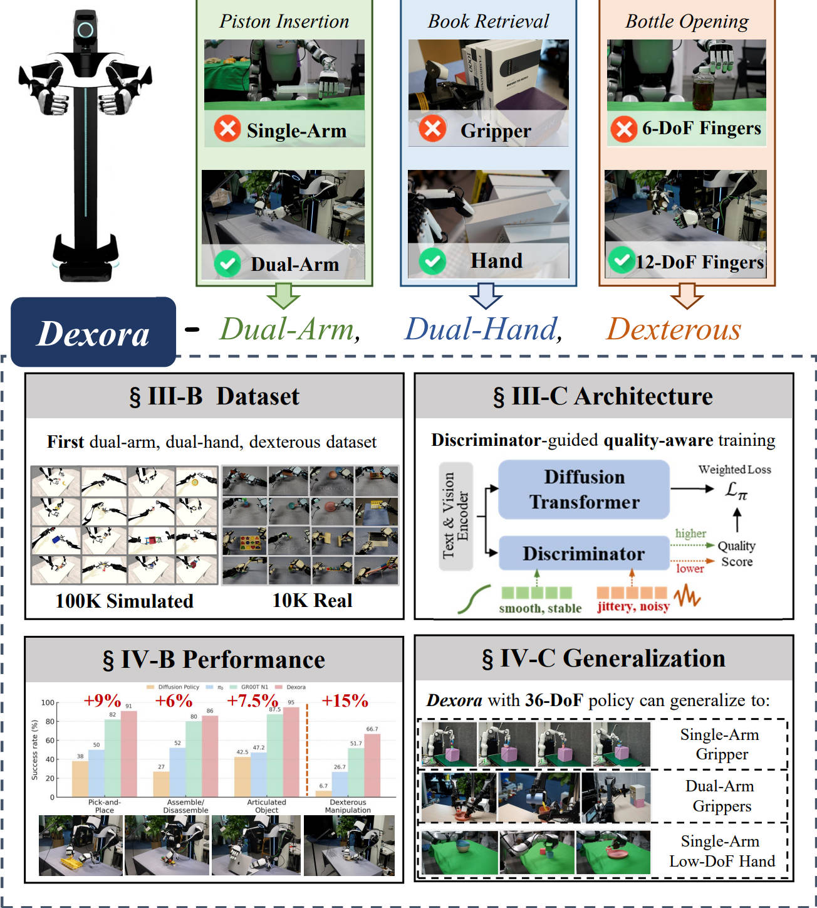
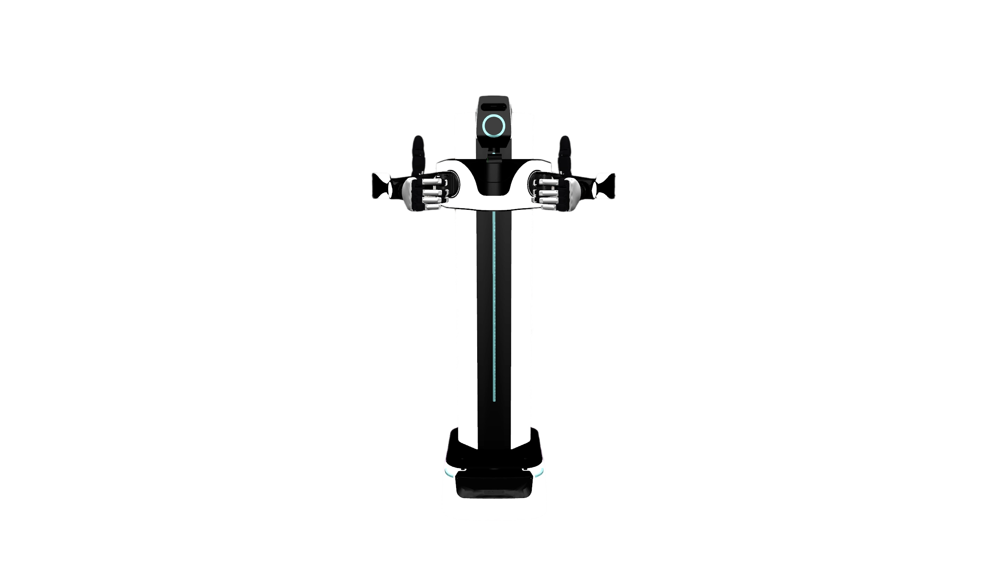
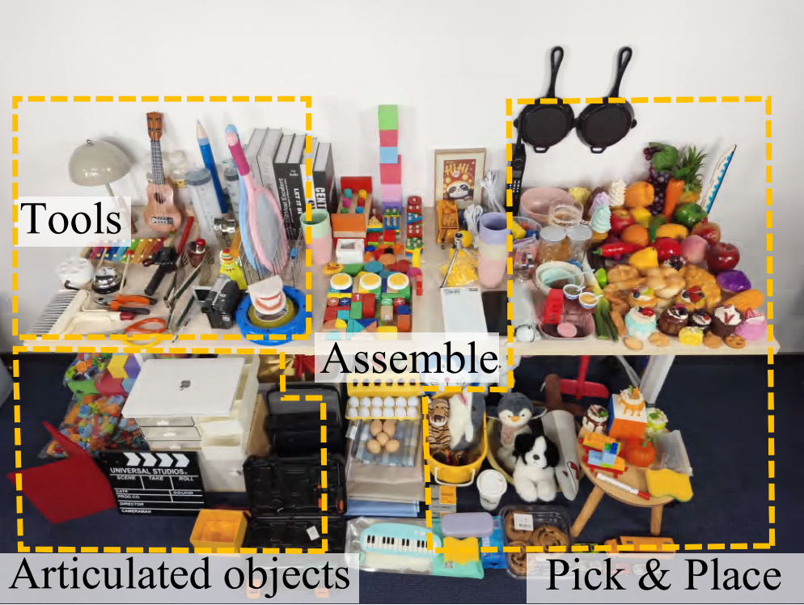
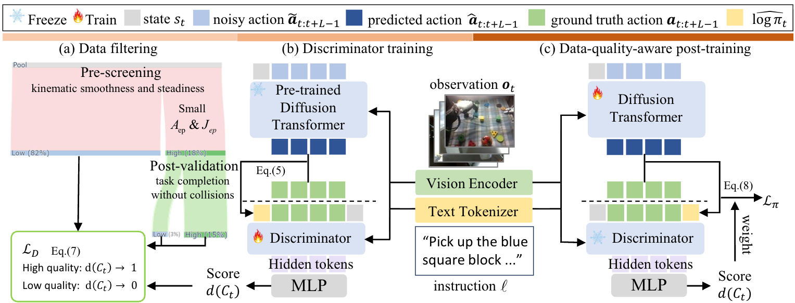
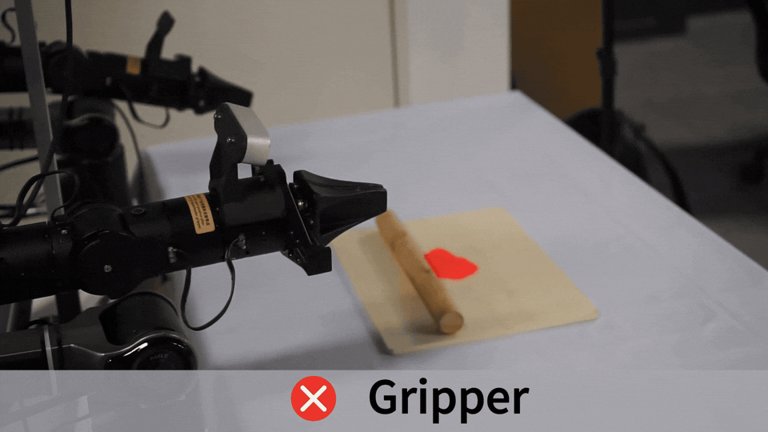

# Dexora：面向 36-DoF 双臂双灵巧手的开源 VLA 系统

> 本文导读 **Dexora: Open-source VLA for High-DoF Bimanual Dexterity**。这篇工作来自清华大学、北京智源人工智能研究院、香港大学、上海交通大学、上海科技大学、北京大学等团队，arXiv 编号为 `2605.18722v1`。ICRA 2026 官方奖项页面将 Dexora 列入 **Best Paper Award on Robot Manipulation and Locomotion** 候选论文名单。

## 1. 高自由度双臂灵巧操作难在哪里

Dexora 解决的是一个很明确的问题：现有 VLA 大多停留在单臂夹爪、双臂低自由度夹爪，或者单臂灵巧手。它们能做抓取、放置、开关抽屉等任务，但一旦任务同时需要 **双臂协同** 和 **多手指精细接触**，动作空间、数据采集和训练稳定性都会变难。

Dexora 的目标是把 VLA 推到更高自由度的机器人形态：

```text
双臂 + 双灵巧手 + 36 DoF
    -> 切菜、揉面、拧瓶盖、从书架抽书、双手搬运、装配拆卸
```

这里需要先纠正一个常见误读：宣传里容易写成“6 自由度双手”，但论文和项目页强调的是 **36-DoF dual-arm dual-hand system**。图中出现的 `6-DoF Fingers` 是一个对照条件，意思是低自由度手指在拧瓶盖任务上不如 `12-DoF Fingers`，不是说 Dexora 只有 6 个自由度。

Dexora 的关键不是只换了一个更会说话的 VLM，而是把三件事放到一条系统链路里：

1. **高自由度硬件和 MuJoCo 数字孪生**：物理机器人和仿真机器人具有一致的双臂双手 embodiment。
2. **混合遥操作数据采集**：外骨骼背包负责双臂大范围运动，Apple Vision Pro markerless hand tracking 负责手指精细动作。
3. **质量感知 VLA 训练**：离线 discriminator 给 teleoperation clip 打质量分，再把分数变成 diffusion-transformer policy 的加权损失，降低抖动、失败、碰撞演示的负面影响。

Dexora 研究的是 VLA 在高自由度双手操作上的系统工程和训练范式：从双臂双手本体、遥操作数据到质量感知策略训练形成完整链路，而不是预测动作条件下的未来视频。

## 2. 论文、项目、代码和数据入口

| 条目 | 链接 | 当前状态 |
| :--- | :--- | :--- |
| 论文 | [arXiv:2605.18722](https://arxiv.org/abs/2605.18722) / [HTML](https://arxiv.org/html/2605.18722v1) | 2026-05-18 提交 |
| 项目页 | [dexoravla.github.io](https://dexoravla.github.io/) | 官方项目页，包含动图、方法图、数据展示和结果说明 |
| 代码入口 | [dexoravla/Dexora](https://github.com/dexoravla/Dexora) | 项目页 Code 指向的仓库，README 写明包含训练、推理、数据处理和遥操作代码 |
| 数据集 | [Dexora/Dexora_Real-World_Dataset](https://huggingface.co/datasets/Dexora/Dexora_Real-World_Dataset) | Hugging Face 数据集，包含真实遥操作数据和任务级视图 |
| ICRA 2026 | [Award Finalists](https://2026.ieee-icra.org/awards/) | 入围 Best Paper Award on Robot Manipulation and Locomotion |

项目页、论文、代码入口和真实数据集页面已经公开，可用于方法学习、数据结构分析和轻量代码检查。完整复现高自由度真机实验还需要双臂双手硬件、遥操作设备、MuJoCo 数字孪生资产、模型权重和训练算力。

## 3. 总览图：Dexora 的四个核心块



**图 1 Dexora 总览。** 上方用 Piston Insertion、Book Retrieval、Bottle Opening 三个例子说明为什么单臂、夹爪和低自由度手指不够；中间强调 Dexora 同时覆盖 dual-arm、dual-hand 和 dexterous；下方依次给出数据集、架构、性能和跨本体泛化。  
来源：[Dexora 官方项目页](https://dexoravla.github.io/)。

这张图是整篇论文最适合放在教程里的主图，可以拆成四层看。

第一层是 **动机**。Piston insertion 需要两只机械臂同时定位和施力；book retrieval 需要手指插入书缝、夹持、抽出，普通夹爪很难完成；bottle opening 需要手指包覆、旋转和稳定瓶身，低自由度手指会缺少接触姿态。

第二层是 **数据**。Dexora 构建了 embodiment-matched dataset：一部分来自 MuJoCo 数字孪生里的大规模模拟轨迹，一部分来自真实机器人遥操作。论文摘要写的是 `100K` simulated trajectories、`6.5M` frames，以及 `10K` real teleoperated episodes、`2.92M` frames；当前 Hugging Face 数据卡和代码 README 的真实数据 release 口径写为 `12.2K` teleoperated episodes、`2.92M` frames、`40.5h`。这些口径略有差异，教程里可以统一理解为：Dexora 使用了 **10K+ 级真实遥操作 episodes + 100K 级仿真轨迹**。

第三层是 **训练架构**。Dexora 不是把所有演示一视同仁地喂给 policy，而是先训练一个 discriminator 估计 clip 质量。平滑、稳定、能完成任务的片段权重大；抖动、噪声大、容易失败的片段权重小。

第四层是 **性能和泛化**。论文报告 Dexora 在 basic tasks 上达到约 `90%` 成功率，在 dexterous benchmark 上平均成功率 `66.7%`，高于对比基线 `51.7%`；同时展示了从 36-DoF 双臂双手 policy 向单臂夹爪、双臂夹爪、单臂低自由度手的迁移。

## 4. 为什么高自由度双手 VLA 难

普通夹爪任务的动作空间通常比较低维：

```text
末端位姿增量 + 夹爪开合
```

双臂双灵巧手任务会复杂很多：

```text
左臂姿态 + 右臂姿态
    + 左手多指关节
    + 右手多指关节
    + 双手接触时序
    + 物体受力和摩擦状态
```

这带来三个困难。

第一是 **动作维度变高**。维度越高，同样数量的数据覆盖的状态-动作空间越稀疏。夹爪可以靠少量示教学会“靠近、闭合、抬起”，灵巧手还要学每根手指什么时候弯、弯多少、如何避免把物体弹飞。

第二是 **双臂时序耦合**。双手任务不是左右臂各做各的。例如拧瓶盖时，一只手要稳定瓶身，另一只手旋转瓶盖；抽书时，一只手可能撑开空间，另一只手插入并抽出。任何一侧的延迟、过冲或接触失败都会传递给另一侧。

第三是 **遥操作数据噪声更大**。高自由度 teleop 很容易出现手指抖动、关节微振、接触不稳、碰撞、任务完成但轨迹质量差等问题。直接行为克隆这些数据，policy 会把不稳定动作也学进去。

Dexora 的 discriminator-guided training 就是针对第三个问题：承认遥操作数据不完美，再让训练过程少学坏片段、多学好片段。

## 5. 硬件和遥操作：外骨骼管手臂，Vision Pro 管手指



**图 2 Dexora 双臂双手机器人外观。** Dexora 目标机器人是双臂、双灵巧手、高自由度平台，用来执行双手协同和精细手指操作。  
来源：[Dexora 官方项目页](https://dexoravla.github.io/)。

Dexora 的遥操作链路很关键。论文写明它采用 hybrid teleoperation pipeline：

```text
外骨骼背包
    -> 捕捉双臂大范围 kinematics

Apple Vision Pro markerless hand tracking
    -> 捕捉手指精细 articulation

同一套动作
    -> 驱动物理双臂双手机器人
    -> 同步驱动 MuJoCo digital twin
```

这样设计有两个好处。

第一，手臂和手指分工采集。双臂的位置、速度和大范围运动用外骨骼更稳定；手指关节用 Vision Pro 的 markerless tracking 更方便，不需要给每根手指贴复杂 marker。

第二，真实和仿真使用同一套接口。操作者控制物理机器人时，MuJoCo 数字孪生也能镜像演示。这能降低 sim-to-real 之间的 embodiment mismatch，让模拟数据和真实数据更容易合到一起训练。

项目页还展示了低延迟 teleoperation，文字说明平均端到端延迟约 `11 ms`。这个数字对高自由度操作很重要：如果延迟太大，操作者会过度补偿，采集到的动作会更抖，后续 VLA 训练质量也会下降。

## 6. 数据集：为什么“仿真规模 + 真实精细度”都需要



**图 3 Dexora 真实数据物体与场景。** 项目页展示了工具、装配物体、铰接物体、抓放物体等类别，真实环境包含大量日常物体、遮挡、杂乱背景和不同光照。  
来源：[Dexora 官方项目页](https://dexoravla.github.io/)。

Dexora 的数据构成可以分成两部分：

| 数据 | 作用 | 公开口径 |
| :--- | :--- | :--- |
| MuJoCo 仿真数据 | 提供规模、任务覆盖和 embodiment-matched 预训练 | 100K trajectories、6.5M frames、约 361h video |
| 真实遥操作数据 | 提供真实接触、视觉、摩擦、手指细节 | 论文/项目页约 10K episodes；HF/README release 写 12.2K episodes、2.92M frames、40.5h |

仿真数据和真实数据的职责不同。仿真适合做大规模基础技能覆盖，例如 pick-and-place、assembly、articulation；真实数据适合提供高自由度手指接触、物体材质、照明、遮挡和操作者策略。

Hugging Face 数据集页面写明，真实数据包含四路同步视角：头部 ego-centric camera、左右腕部 camera、第三人称 scene camera，并同步 36-DoF robot proprioception。数据结构遵循 LeRobot / LIBERO-2.1 风格，包含 observation、robot state、action 和 language instruction。

对学习者来说，这个数据集的价值不只是“有很多视频”。更重要的是它把高自由度双手操作拆成可以研究的标准格式：

```text
multi-view RGB
    + 36-DoF proprioception
    + low-level action
    + language instruction
    + task/category metadata
```

这让后续研究可以围绕同一批数据做动作表示、质量筛选、模仿学习、数据重采样、跨本体迁移等实验。

## 7. 方法图：discriminator-guided quality-aware training



**图 4 Dexora 的质量感知训练流程。** 左侧先用运动学平滑性和仿真 replay 做数据过滤；中间冻结预训练 diffusion transformer，训练 discriminator 给 clip 打质量分；右侧 post-training 时把质量分转成 diffusion loss 权重。  
来源：[Dexora 官方项目页](https://dexoravla.github.io/)。

Dexora 的训练核心可以写成三步。

第一步是 **data filtering**。真实遥操作数据先按运动学指标预筛，例如 acceleration 和 jerk。如果一个片段关节变化很抖、接触很乱，通常说明示教质量不高。之后再通过 replay / post-validation 检查任务是否完成、是否碰撞，把明显坏的片段过滤掉。

第二步是 **discriminator training**。在冻结预训练 diffusion transformer policy 的条件下，Dexora 用 observation 和 language 作为条件，训练一个 discriminator 输出 clip 质量分 `d(C_t) ∈ (0, 1]`。高质量 clip 分数接近 1，低质量 clip 分数接近 0。

第三步是 **quality-aware post-training**。训练 policy 时，不同 clip 对 loss 的贡献不一样：

```text
高质量 clip -> 更大权重
低质量 clip -> 更小权重
```

这件事对高自由度特别重要。低自由度夹爪策略有时能靠后处理或控制器滤波掩盖示教抖动；双手灵巧操作中，手指接触的微小抖动会直接导致滑落、卡住、撞物体或左右手不同步。Dexora 的 discriminator 实际上是在告诉模型：不要平均学习所有示教，优先学习“平滑、稳定、能完成任务”的片段。

推理时只使用 policy，不需要 discriminator 参与在线控制。因此 discriminator 是训练阶段的质量调节器，不是运行时 reward model。

## 8. 一个官方 GIF：夹爪揉面为什么难



**图 5 Roll Dough gripper 对照示例。** 项目页用夹爪和手的对比说明：揉面、拧瓶盖、抽书、用笔等任务不是简单抓放，手指接触面积、姿态和连续施力会直接影响成功率。  
来源：[Dexora 官方项目页](https://dexoravla.github.io/)。

这类示例的重点不是“看起来像人手”这么简单，而是说明任务本身对 embodiment 有要求。揉面需要连续滚动、按压和保持接触；拧瓶盖需要一只手固定瓶身、另一只手施加扭矩；抽书需要手指插入薄缝并稳定夹持。夹爪可以完成很多工业抓放任务，但在这些日常 dexterous task 上很容易受限。

这也是 Dexora 的研究价值：它不是又做了一个 tabletop pick-and-place VLA，而是把 VLA 的动作空间推进到更接近人手日常操作的区域。

## 9. 结果怎么看：强，但不是“所有灵巧操作都解决了”

论文和项目页给出的核心结果可以概括为：

| 评测方向 | 论文/项目页结论 | 应该怎么理解 |
| :--- | :--- | :--- |
| Basic tasks | Pick-and-place、assemble/disassemble、articulated object 上平均成功率约 90% | 双臂双手 VLA 不只会灵巧任务，也能覆盖基础操作 |
| Dexterous tasks | 平均 dexterous success `66.7%`，对比基线 `51.7%` | 高自由度手指和质量感知训练带来明显收益 |
| OOD generalization | 测 unseen background、lighting、object、occlusion、clutter、height change | 检查视觉和物理扰动下是否稳 |
| Cross-embodiment | 从 36-DoF policy 迁移到 single-arm gripper、dual-arm grippers、single-arm low-DoF hand | 高到低迁移相对可行，低到高仍然困难 |
| Discriminator ablation | 有 discriminator 时动作更平滑、任务更容易成功 | 数据质量权重是核心贡献之一 |

这里不能把 Dexora 说成“灵巧操作已经完全解决”。项目页本身也展示了 failure cases，包括 instruction ambiguity、视觉相似物体误判、抓取摩擦不足、双臂不同步、pose drift 和 workspace boundary violation。这些失败恰好说明高自由度 VLA 仍然有很多开放问题：语言 grounding、物理接触、长时程误差积累、双臂同步和硬件工作空间约束。

## 10. 现在怎么复现

Dexora 不适合写成“所有人都能一键复现真机切菜”的教程。更合理的是按三档学习。

### 10.1 论文和项目页复盘

第一档只需要阅读论文、项目页和官方图。重点回答：

- 为什么单臂/夹爪/低自由度手不够？
- 36-DoF 动作空间包含哪些部分？
- 仿真数据和真实数据分别解决什么问题？
- discriminator 为什么能降低 teleoperation 噪声？
- OOD 和 cross-embodiment 结果证明了什么，没有证明什么？

这档最适合组队学习 Task04，不需要硬件和大算力。

### 10.2 数据集结构检查

第二档可以从 Hugging Face 数据集入手。数据集页面给出了 episode-centric / task-level 的结构，核心字段包括：

```text
data/chunk-xxx/episode_xxxxxx.parquet
videos/chunk-xxx/observation.images.*
meta/info.json
meta/episodes.jsonl
meta/episodes_stats.jsonl
meta/modality.json
meta/stats.json
meta/tasks.jsonl
```

可以做的轻量任务包括：

1. 下载一个小任务子集。
2. 查看 `meta/info.json` 和 `modality.json`。
3. 读取一条 parquet episode。
4. 对齐多视角视频、36-DoF state/action 和 language instruction。
5. 写一页报告说明 Dexora 数据格式和普通夹爪数据集有什么不同。

### 10.3 代码入口和完整复现边界

第三档才是看代码。项目页当前 Code 指向：

```bash
git clone https://github.com/dexoravla/Dexora
cd Dexora
```

从 README 描述看，仓库围绕这些部分组织：

```text
training pipeline
real-robot inference stack
BSON -> LeRobot v2.1 converters
Vision-Pro teleoperation tools
MuJoCo digital twin / replay validation
```

完整复现实验需要：

- 双臂双灵巧手硬件或等价 digital twin。
- 外骨骼和 Apple Vision Pro 遥操作链路。
- MuJoCo 资产和机器人模型。
- 真实数据或仿真数据下载权限和足够磁盘。
- diffusion-transformer policy 训练算力。
- 安全限幅、碰撞检查、同步控制和急停机制。

所以教程当前建议把 Dexora 作为 **方法拆解 + 数据结构学习 + 代码入口导航**。等代码、模型、仿真数据和硬件配置进一步稳定后，再补手把手复现。

## 11. 和其他 VLA 工作的关系

| 方法 | 主要增强点 | 和 Dexora 的区别 |
| :--- | :--- | :--- |
| OpenVLA / OpenVLA-OFT | 开源 VLA 基座和 fine-tuning 流水线 | Dexora 重点是高自由度双臂双手 embodiment |
| π0 / π0.5 | 强通用操作 VLA baseline | Dexora 关注双手灵巧操作和高 DoF 数据 |
| EventVLA | 长时域视觉证据记忆 | Dexora 更关注动作空间、遥操作数据和质量加权 |
| 3DVLA | 3D 空间和实例理解 | Dexora 更关注双臂双手执行器形态和高维动作 |
| PhysBrain | 物理常识预训练 | Dexora 直接在真实高自由度接触数据上训练 |
| PRTS | 目标可达性/CRL 预训练 | Dexora 用 discriminator 处理遥操作质量 |
| G0.5 | 自回归 CoT + action token 流 | Dexora 使用 diffusion-transformer policy 和质量感知训练 |
| HumanoidMimicGen | 少量人形示教生成全身数据 | Dexora 是双臂双手灵巧操作 VLA，不是全身 loco-manipulation 数据生成 |

如果按“VLA 为什么失败”来分类：

- EventVLA 认为失败来自长时域视觉证据丢失。
- 3DVLA 认为失败来自 3D 空间实例理解不足。
- PRTS 认为失败来自目标可达性和任务进度感不足。
- G0.5 认为失败来自推理、动作 token 和跨本体接口割裂。
- Dexora 认为失败还来自 embodiment 太简单：低自由度夹爪无法表达真实双手灵巧操作，同时高自由度遥操作数据本身需要质量建模。

## 12. 推荐作业

组队学习里可以把 Dexora 放在操作控制方向 Task04：

> 对比 G0.5、PRTS、Dexora：G0.5 强调统一自回归动作流，PRTS 强调目标可达性预训练，Dexora 强调 36-DoF 双臂双手 embodiment、混合遥操作和质量感知训练。三者分别解决 VLA 的哪个瓶颈？

作业可以回答这些问题：

- Dexora 为什么不是普通双臂夹爪 VLA？
- 外骨骼和 Apple Vision Pro 在遥操作中分别负责什么？
- 仿真数据和真实数据为什么都需要？
- discriminator-guided quality-aware training 为什么适合高自由度 teleop 数据？
- ICRA 2026 入围说明了什么，不能说明什么？
- 当前公开入口适合做到哪一步，完整真机复现还缺哪些条件？

## 13. 引用与图片来源

本文图片和 GIF 来自 [Dexora 官方项目页](https://dexoravla.github.io/)，为了教程稳定访问已保存到本地 `assets/`。文字内容参考 [arXiv:2605.18722](https://arxiv.org/abs/2605.18722)、[dexoravla/Dexora GitHub 仓库](https://github.com/dexoravla/Dexora)、[Dexora Real-World Dataset](https://huggingface.co/datasets/Dexora/Dexora_Real-World_Dataset) 和 [ICRA 2026 Award Finalists](https://2026.ieee-icra.org/awards/)。
