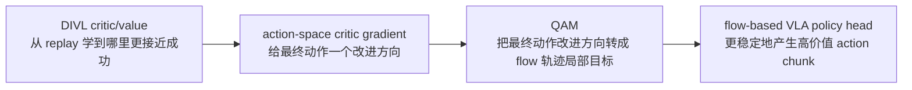

# LWD：智元机器人真机机群强化学习导读

> 本文导读 **Learning while Deploying: Fleet-Scale Reinforcement Learning for Generalist Robot Policies**。这篇工作来自 Shanghai Innovation Institute、AGIBOT Finch 和 Columbia University，arXiv 编号为 `2605.00416v1`，官方项目页发布时间为 2026 年 4 月 30 日。

## 1. LWD 如何把部署变成学习闭环

LWD 的全称是 **Learning While Deploying**，可以直译为“边部署边学习”。它想解决的问题很直接：通用 VLA 只靠离线示教预训练，很难覆盖真实部署时遇到的长尾物体、用户指令、失败状态、环境变化和中途纠错。机器人一旦被部署到真实场景，本身就会不断产生新经验；如果这些经验只被拿来做日志，而不能反过来更新共享策略，就浪费了最有价值的真机数据。

LWD 把部署过程改造成一个闭环：

```text
离线预训练 VLA
    ↓
部署到多台真实机器人
    ↓
收集成功、失败、恢复、人类干预和历史 rollout
    ↓
用离线到在线 RL 更新同一个共享 VLA
    ↓
重新部署更强的策略
```

它不是一个单任务 RL 算法，也不是“给每个任务训练一个专家策略”。论文强调的是 **fleet-scale offline-to-online RL for generalist VLA policies**：在 16 台 AgiBot G1 双臂机器人上，跨 8 个真实操作任务持续收集数据，让一个共享的通用策略随着机群经验累积而提升。任务包括商超补货、泡功夫茶、调鸡尾酒、榨果汁、打包鞋盒等，其中长时程任务通常持续 3 到 5 分钟。

一句话概括：

> LWD 的关键不是把 QAM 简单“迁移一下”，也不是去掉 actor 换成 attention head，而是把 **DIVL 价值学习 + QAM 策略提取 + 真机机群数据飞轮** 接到通用 VLA 的部署后训练里。

LWD 的训练对象是通用 VLA 策略，核心问题是机器人操作策略如何从真机部署数据中持续变强。它不预测未来场景，也不局限于纯仿真评测，而是研究真实机器人机群产生的数据如何进入离线到在线强化学习闭环。

## 2. 论文、项目和复现入口

| 条目 | 链接 | 当前状态 |
| :--- | :--- | :--- |
| 论文 | [arXiv:2605.00416](https://arxiv.org/abs/2605.00416) / [HTML](https://arxiv.org/html/2605.00416v1) | 2026-05-01 提交 |
| 项目页 | [AGIBOT Finch LWD](https://finch.agibot.com/research/lwd) | 官方项目页，包含方法图、结果图和真机任务视频 |
| PDF | [lwd-paper.pdf](https://finch-static.agibot.com/LWD/lwd-paper.pdf) | 官方项目页对应论文 PDF |
| 代码 | 官方项目页当前未展示独立代码仓库入口 | 当前可完成方法阅读、系统拆解和复现方案设计 |
| 相关前置 | [Q-learning with Adjoint Matching](https://arxiv.org/abs/2601.14234) | LWD 采用的 flow policy 策略提取方法 |

开源边界需要写清楚：截至本文整理时，官方项目页公开了论文、图和真机视频，但没有看到可直接复现实验的代码仓库、模型权重或机器人侧部署脚本入口。因此本章不写手把手复现，而是讲清楚原理、系统结构、数据闭环和如果后续代码公开后应该从哪里开始复刻。

## 3. 总览图：部署不再是终点


**图 1 LWD 的部署数据飞轮。** 预训练 VLA 先被部署到真实机器人上，机器人在多个任务里产生在线交互数据；这些数据和离线 replay 混合后更新共享策略，再把更新后的策略重新部署回机群。  
来源：[AGIBOT Finch LWD 官方项目页](https://finch.agibot.com/research/lwd)。

这张图最重要的是把“部署”从测试环节改成训练环节。传统流程通常是：

```text
收集示教 -> 训练模型 -> 部署测试
```

LWD 的流程变成：

```text
收集示教 -> 离线 RL 预训练 -> 部署 -> 收集真实经验 -> 在线后训练 -> 再部署
```

这里的真实经验不只是成功示教。论文把部署期间产生的数据看得更宽：

- 成功 rollout：策略独立完成任务。
- 失败 rollout：策略失败，但失败状态对价值学习有用。
- partial progress：任务没有完全成功，但完成了若干中间阶段。
- recovery：机器人从偏离状态中恢复。
- human intervention：人类在关键时刻接管或纠正。
- play data：人类有意探索失败模式和边界状态。

这也是 LWD 和普通 imitation learning 的差别。行为克隆只能直接利用“专家在这里做了什么”的动作标签；LWD 想利用的是“这段轨迹最终好不好、哪里离成功更近、哪些失败状态应该避免”。真机部署中大量失败和半成功数据，反而可以给 critic 提供学习信号。

## 4. 方法图：DIVL 负责评估，QAM 负责提取策略


**图 2 LWD 的训练结构。** 左边是两阶段 pipeline：先在离线 buffer 上做 RL 预训练，再用离线 buffer 和在线 buffer 的混合 replay 做持续后训练。右边是算法结构：VLM-based policy 通过 policy head 输出 action chunks，critic 和 distributional value 学 TD 目标，QAM loss 把 critic 梯度转成对 flow policy 的稳定更新。  
来源：[AGIBOT Finch LWD 官方项目页](https://finch.agibot.com/research/lwd)。

这张图可以拆成三个模块。

第一块是 **数据层**。LWD 有一个静态 offline buffer，也有一个持续增长的 online buffer。offline buffer 来自人工示教、历史策略 rollout 和 play data；online buffer 来自部署中的机器人机群。论文附录统计的离线数据总量为 `652.5h`，其中 expert demonstration 为 `336.6h`，成功 rollout 为 `88.8h`，失败 rollout 为 `39.2h`，play data 为 `187.9h`。按任务看，长时程任务占比更大，因为泡茶、调酒、榨汁、鞋盒打包这类任务每个 episode 本身更长。

第二块是 **价值学习**。LWD 使用 Distributional Implicit Value Learning，简称 **DIVL**。普通 critic 可能只回归一个标量价值，但真机 replay 很杂：同一类状态附近可能有成功、失败、接管、恢复和不同策略版本产生的动作。一个标量很容易把这些结果平均掉，导致高回报但稀有的行为模式被抹平。DIVL 改为学习 replay action-value 的分布，再从分布中取一个 quantile statistic 作为 TD bootstrap target。这样仍然保留 IQL 的 in-distribution 改进思想，同时更适合 heterogeneous replay 和 sparse reward。

第三块是 **策略提取**。LWD 的 policy 是 flow-based action generator。它不是简单输出一个动作向量，而是通过多步生成过程得到 action chunk。传统 RL 若要直接最大化 critic，可能需要对整个 flow / ODE 生成轨迹反向传播，代价高且不稳定。LWD 采用 **Q-learning with Adjoint Matching (QAM)**：用 critic 在最终动作上的梯度指导策略更新，但把全轨迹的 critic-guided optimization 改写成 flow 轨迹上的局部回归目标。这样可以避免穿过完整生成过程做脆弱的多步反传，也不需要可 tractable 的 action likelihood。

## 5. QAM 不是 Query Attention Module，也不是“去掉 actor”

这里容易被缩写误导。LWD 里的 QAM 是：

```text
Q-learning with Adjoint Matching
```

它不是视觉模型里常见的 `Query Attention Module`，也不是“用一个 attention head 替代 actor 网络”。更准确的理解是：

```text
critic/value 负责判断动作好不好
        ↓
critic 对最终动作给出改进方向
        ↓
QAM 把这个方向变成 flow 生成过程中的局部监督
        ↓
更新 VLA 的 flow-based policy head
```

所以 LWD 并没有把 actor 这个概念完全删掉。对于 actor-critic 语境来说，actor 就是会输出动作的 policy；在 LWD 里，这个 policy 仍然存在，只是它不是一个小的 MLP actor，而是 VLM/VLA backbone 后面的 flow-based action head。QAM 做的是 **policy extraction**：把 critic 学到的价值信息稳定地“提取”到生成式 policy 里。

可以把它和常见 RL 更新做一个对比：

| 方法 | policy 形式 | 更新难点 | LWD 的处理 |
| :--- | :--- | :--- | :--- |
| SAC / TD3 等传统 actor-critic | 显式 actor 输出连续动作 | 对动作求梯度比较直接 | 不适合直接套到大 VLA flow policy |
| 行为克隆 | 模仿专家 action | 用不了失败和稀疏 reward 的价值信息 | 作为预训练有用，但部署数据利用不足 |
| 直接对 flow policy 反传 critic | 多步生成式 action policy | 要穿过完整生成过程反传，昂贵且不稳定 | QAM 改成局部 adjoint matching |
| LWD | VLM-based policy + flow action head | 需要从 critic 稳定改进生成式 action chunk | DIVL 学价值，QAM 做策略提取 |

因此，如果要回答“是不是把 QAM 迁移过来、去掉 actor 用 attention head 代替”，可以这样说：

> 不完全对。LWD 确实采用了 QAM，但 QAM 是 flow policy 的 critic-guided policy extraction 方法；actor 没有消失，而是由通用 VLA 的 flow-based policy head 承担。attention head 可能是 VLM/VLA 架构内部的模块，但不是 LWD 论文的核心算法替换点。

## 6. 为什么要用 DIVL：真机 replay 不是干净示教集

如果所有数据都是专家成功示教，行为克隆已经可以学到很多东西。但部署后的数据分布更复杂：

```text
成功轨迹 + 失败轨迹 + 历史策略轨迹 + 人类接管 + 探索失败模式
```

这些数据的价值不是“动作标签干净”，而是“结果信息丰富”。例如泡茶任务里，机器人可能正确拿起茶壶，但倒水角度偏了；调酒任务里，机器人可能成功打开瓶子，但后面倒液体失败；商超补货任务里，机器人可能识别对了商品，但摆放姿态不合格。行为克隆很难从这些轨迹里知道哪一步是正向进展、哪一步导致后续失败。

DIVL 的作用是给这些混杂轨迹建立价值坐标。它不要求数据都来自当前 policy，也不要求每段轨迹都是专家示教，而是从 replay 中估计“某个状态-动作 chunk 继续执行后可能到达什么回报分布”。在稀疏奖励长时程任务里，多步 TD target 可以把终点成功信号往前传播，让中间状态也获得进度信息。

这对真实机器人尤其重要。真机试错成本高，不能像游戏环境那样无限采样；同时真实环境又会不断变化。LWD 的核心工程判断是：既然机器人部署一定会产生大量 off-policy experience，就要让算法能吃下这些数据，而不是只把它们当成需要人工清洗的失败日志。

## 7. 为什么要用 QAM：VLA 的动作头已经不是普通 actor

很多新 VLA 不再输出单步确定性动作，而是输出 action chunk，甚至用 diffusion / flow matching 的形式生成动作序列。这样做的好处是表达能力强，可以建模多模态动作分布；坏处是 RL 更新变难。

对一个普通 actor 来说，critic 给出 `∇a Q(s, a)` 后，可以直接更新 actor 参数，让动作朝更高 Q 的方向移动。但 flow policy 的最终动作是多步生成过程的结果：

```text
noise / initial action
    -> flow step 1
    -> flow step 2
    -> ...
    -> final action chunk
```

如果直接把 critic 梯度从最终 action chunk 反传到所有 flow steps，训练会又慢又不稳。QAM 的思想是：把最终动作上的 critic 改进方向，通过 adjoint matching 变成每个局部 flow step 上可以回归的目标。这样 policy 更新更像 supervised regression，而不是对完整生成轨迹做高方差、高成本的直接优化。

对教程读者来说，可以把 QAM 理解为一座桥：



这座桥让 RL 可以指导生成式动作模型，而不必要求 policy 提供简单的 action likelihood，也不必直接穿过完整 ODE / flow 过程反传。

## 8. 结果图：强点在长时程真机任务


**图 3 LWD 的成功率和执行时间结果。** 官方项目页展示 LWD 相比若干 post-training baseline 能持续提升成功率，长时程任务提升更明显，同时减少部分长时程任务的平均 cycle time。  
来源：[AGIBOT Finch LWD 官方项目页](https://finch.agibot.com/research/lwd)。

论文摘要给出的总体结论是：在 16 台双臂机器人、8 个真实操作任务上，一个共享 generalist policy 随着 fleet experience 累积而提升，平均成功率达到 `95%`，最大增益出现在长时程任务上。官方项目页进一步强调，LWD 不只提高成功率，也会降低长时程任务的平均 cycle time，说明策略不是靠更慢、更保守地执行来换成功，而是在部分任务上同时提高效率。

这里要注意三点边界。

第一，LWD 的结果主要是 **真实机器人系统结果**，这很强，但也意味着外部学习者很难直接复现实验。复现需要多台双臂机器人、部署调度系统、在线 replay buffer、任务奖励定义、人类接管接口和稳定安全策略。

第二，论文使用的是 AGIBOT 自有机群和任务体系，不是像 LIBERO 那样人人都能本地跑的公开仿真 benchmark。教程里可以学习方法和系统设计，但不能把它等同于“开源 benchmark 刷榜”。

第三，平均成功率高不代表所有长时程机器人操作都解决了。LWD 的贡献是把真机部署数据纳入 RL 飞轮，并展示在一组复杂任务上可行；开放问题仍包括奖励设计、异常安全、跨硬件迁移、长时间稳定运行、数据隐私和在线更新风险控制。

## 9. 和 SOP、PRTS、Dexora 的关系

LWD 放在 VLA 章节里，可以和最近几个方法形成一条清楚的线：

| 方法 | 核心问题 | 训练信号 | 和 LWD 的区别 |
| :--- | :--- | :--- | :--- |
| SOP | 如何把 VLA 在线后训练系统规模化 | 在线 rollout / post-training 系统 | 更偏 scalable online post-training 系统框架 |
| PRTS | 如何让 VLA 预训练阶段具备目标可达性意识 | reward-label-free contrastive RL | 更偏 VLA 预训练表征和 goal reachability |
| Galaxea G0.5 | 如何把记忆、CoT 和动作 token 放进自回归 VLA | structured CoT + action tokens | 更偏自回归动作表示 |
| Dexora | 高自由度双臂双手 VLA 怎么采数据和训练 | 高 DoF 示教 + quality-aware training | 更偏 embodiment 和遥操作质量建模 |
| LWD | 部署后的真机经验如何持续改进通用 VLA | DIVL critic/value + QAM policy extraction + online replay | 更偏真机机群 RL 数据飞轮 |

这几篇可以一起读。PRTS 关注“预训练时就学目标可达性”，Dexora 关注“高自由度双手 embodiment 和数据质量”，LWD 关注“部署后如何持续利用真实交互经验”。它们都在回答同一个大问题：VLA 不能只停留在静态离线行为克隆，必须更好地利用目标、物理、失败和真实交互。

## 10. 如果后续开源，应该怎样复刻

由于当前没有公开的完整训练仓库和真机部署脚本，复刻路线分为三个层级。

第一档是 **论文复盘**。重点读四个问题：

1. LWD 的 offline buffer 和 online buffer 分别包含什么？
2. DIVL 为什么比标量 value regression 更适合 heterogeneous replay？
3. QAM 如何把 critic gradient 转成 flow policy 的局部回归监督？
4. 长时程任务里，RL 为什么比单纯行为克隆更能利用失败、恢复和 partial progress？

第二档是 **仿真概念复刻**。如果后续没有真机条件，可以先在 LIBERO、RoboTwin、ManiSkill 或自建 MuJoCo 任务里做一个缩小版：

```text
离线示教 buffer
    + 历史 rollout buffer
    + 新 policy 在线 rollout
    -> 训练 critic/value
    -> 用 QAM 或近似 policy extraction 更新 flow/diffusion policy
    -> 对比 BC、offline RL、offline-to-online RL
```

这个版本不能证明 LWD 的 fleet-scale 真机能力，但可以帮助理解算法闭环。

第三档是 **真机系统复刻**。这需要满足更多工程条件：

- 至少一台稳定可重复执行任务的机械臂平台。
- 安全可中止的在线 rollout 机制。
- 每个 episode 的任务成功/失败 reward 定义。
- 能记录 image、state、action、language instruction、policy version、intervention 标记和 terminal reward。
- 能把离线数据、历史 rollout 和在线 rollout 混合采样。
- 有足够稳定的基础 VLA 或 diffusion/flow action policy。

真机复刻时首先要做安全门控，而不是直接开在线 RL。部署策略必须限制速度、力、工作空间、碰撞区域和失败恢复方式；在线更新后的 policy 也应该先在离线 replay、仿真或 shadow mode 中检查，再逐步上真机。

## 11. 推荐组队学习题目

在 Task04 里可以这样布置：

> 对比 PRTS、Dexora 和 LWD：PRTS 把目标可达性放进 VLA 预训练，Dexora 解决高自由度双臂双手数据和训练质量，LWD 把真实部署过程变成离线到在线 RL 数据飞轮。请说明三者分别利用了哪类数据、解决 VLA 的哪个瓶颈、当前复现边界在哪里。

交付可以不跑实验，但要讲清楚：

- LWD 为什么不是普通行为克隆？
- DIVL 和 IQL 的关系是什么？
- QAM 为什么适合 flow-based VLA action generator？
- 16 台真机和 8 个任务的实验说明了什么，又不能说明什么？
- 如果要在开源仿真中做一个简化版 LWD，需要哪些模块？

## 12. 资料来源

本文图片来自 [AGIBOT Finch LWD 官方项目页](https://finch.agibot.com/research/lwd)，为了教程稳定访问已保存到本地 `assets/`。文字内容参考 [arXiv:2605.00416](https://arxiv.org/abs/2605.00416)、[arXiv HTML](https://arxiv.org/html/2605.00416v1)、[官方 PDF](https://finch-static.agibot.com/LWD/lwd-paper.pdf) 和相关 QAM 论文 [arXiv:2601.14234](https://arxiv.org/abs/2601.14234)。
