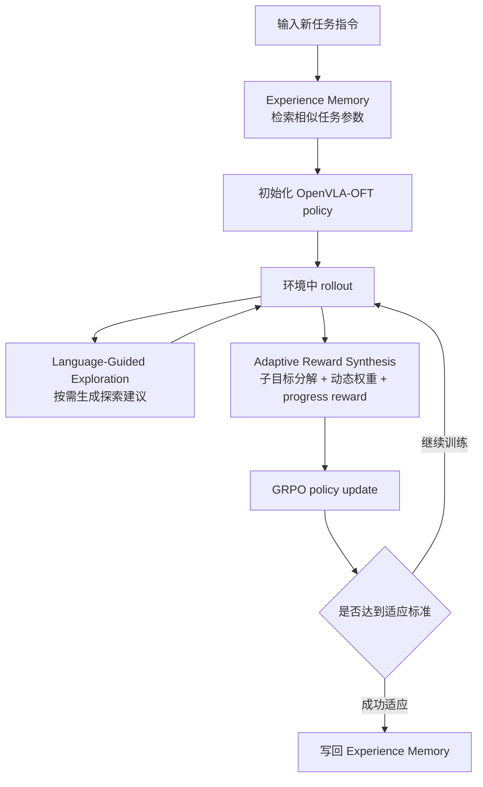

# Agentic-VLA：让 VLA 在线适应任务

> 本文导读 **Agentic-VLA: Efficient Online Adaptation for Vision-Language-Action Models**。论文 arXiv 编号为 `2605.22896v1`，2026 年 5 月 21 日提交，作者为 Ruofan Jin 和 Zaixi Zhang。

## 1. 在线适应解决什么问题

Agentic-VLA 不是世界模型，也不是一个新的机器人仿真器。它讨论的是 VLA 部署后的一个核心问题：已有 VLA 在新任务、新场景里如果表现不够好，能不能不再完全依赖人工重新采示教，而是让模型通过在线交互、语言反馈、动态奖励和经验记忆更快适应。

它的关键词是 **online adaptation**。传统 VLA 训练流程通常是：

```text
专家示教数据 -> SFT / BC 训练 -> 离线评测 -> 部署
```

Agentic-VLA 想把后半段改成：

```text
OpenVLA-OFT 基础策略
    -> 新任务上线
    -> 从 Experience Memory 检索相似任务权重
    -> 在线 rollout
    -> Language-Guided Exploration 给探索建议
    -> Adaptive Reward Synthesis 生成阶段性奖励
    -> GRPO 更新策略
    -> 成功适应后的权重写回记忆库
```

它和 LWD、PRTS、RAW-Dream 都关注离线行为克隆之外的策略改进，但侧重点不同：

- LWD 讲真机机群如何用部署数据做 offline-to-online RL。
- PRTS 讲如何在预训练阶段让 VLA 具备目标可达性意识。
- RAW-Dream 讲如何在任务无关世界模型里做 imagined RL。
- Agentic-VLA 讲如何把 reward synthesis、exploration critic 和 task memory 组成一个 agentic online adaptation loop。

一句话概括：

> Agentic-VLA 的核心不是换 VLA 基座，而是给 OpenVLA-OFT 加一个会设计奖励、会引导探索、会复用旧任务权重的在线适应外环。

## 2. 论文、代码和复现入口

| 条目 | 链接 | 当前状态 |
| :--- | :--- | :--- |
| 论文 | [arXiv:2605.22896](https://arxiv.org/abs/2605.22896) / [HTML](https://arxiv.org/html/2605.22896v1) / [PDF](https://arxiv.org/pdf/2605.22896) | 2026-05-21 提交 |
| 项目页 | 暂未检索到官方独立项目页 | 当前主要公开入口是 arXiv |
| 代码 | 暂未检索到官方 GitHub 仓库 | 可以按论文方法设计复现实验，但不适合写成一键复现教程 |
| 基础策略 | OpenVLA-OFT | 论文实验把 Agentic-VLA 应用到 OpenVLA-OFT，并使用离散 action tokens 适配 RL |
| 主要基准 | LIBERO、RoboTwin 2.0 | 都是已有公开基准，不是作者单独自建的新 benchmark |

截至本文整理时，没有找到作者公开的 Agentic-VLA 官方代码仓库。教程里因此只讲方法、模块、实验结果和复现设计边界，不给出假装可以直接跑通论文结果的命令。真正复现需要自己搭 OpenVLA-OFT、LIBERO / RoboTwin 2.0、GRPO、进度 critic、VLM exploration critic 和 experience memory。

## 3. 总览图：三类 agent 组成在线适应外环


**图 1 Agentic-VLA 框架总览。** 整个系统不是单个 VLA 模型，而是围绕 VLA policy 构建的在线适应闭环：Experience Memory 负责 warm start，Language-Guided Exploration 负责结构化探索，Adaptive Reward Synthesis 负责把任务进展转成可优化奖励。  
来源：[arXiv HTML: Agentic-VLA](https://arxiv.org/html/2605.22896v1)。

这张图可以从右到左读。

右侧是 **Experience Memory**。它保存已经适应过的任务权重和任务语义 embedding。遇到新任务时，系统先根据任务指令检索相似任务，把相似任务的策略参数做加权组合，作为新任务的初始化。这一步解决的是“每个任务都从同一个基础模型冷启动太慢”的问题。

中间是 **VLA policy + online rollout**。基础策略是 OpenVLA-OFT，输入仍然是视觉观测、proprioception 和语言任务，输出是离散 action token 序列。Agentic-VLA 不是把 VLA 替换成一个 agent，而是在 VLA 交互过程中加了几个负责训练过程调度的 agent。

左下是 **Language-Guided Exploration**。普通 RL 在高维机器人动作空间里随机探索很低效。Agentic-VLA 用 VLM 看当前 RGB 图像、任务指令和近期轨迹，生成一句短的操作建议，比如“从左侧接近”“抓取点靠近中心”“降低动作幅度”。这个建议只在探索阶段拼接到任务 prompt 里，引导 policy 采样更有希望的动作。

左上是 **Adaptive Reward Synthesis**。真实部署时通常没有完美 oracle reward；只用成功/失败二值奖励又太稀疏。ARS 先把长时程任务拆成子目标，再根据每个子目标当前是否已经学会来调整 reward weight。模型卡在哪个子目标，就把哪个子目标权重拉高；某个阶段已经稳定掌握，就降低它的训练权重，让学习焦点往后续瓶颈移动。

最后，策略用 **GRPO** 更新。论文附录给出的 group size 是 `8`，max rollout horizon 是 `500`，batch size 是 `32`。成功适应后的策略参数再写回 memory bank，供后续相似任务 warm start。

## 4. 三个核心模块拆解

### 4.1 Adaptive Reward Synthesis：奖励不是固定写死

VLA 在线适应最困难的一点是奖励。真实机器人任务往往不是“每一步都有清晰数值奖励”，而是直到最后才知道任务是否成功。例如“打开炉灶并把 moka pot 放到炉灶上”，如果只看最终成功，前面靠近炉灶、转动旋钮、找到 moka pot、抓取 moka pot、放置 moka pot 这些中间阶段都缺少训练信号。

ARS 做了三件事。

第一，**任务分解**。它用语言模型把长指令拆成子目标：

```text
turn on the stove and put the moka pot on it
    -> locate and approach the stove
    -> turn on the stove
    -> locate the moka pot
    -> grasp the moka pot
    -> place the pot on the stove
```

第二，**能力估计**。系统为每个子目标维护一个近期成功率的指数滑动平均。这个估计不是为了最终评测，而是为了判断当前训练阶段卡在哪里。

第三，**动态 reward weight**。对于已经掌握的子目标，reward weight 降低；对于还没掌握的子目标，reward weight 保持较高。这样自然形成 curriculum：先学会靠近和基础抓取，再逐步把学习压力移到后面的组合动作。

论文中任务分解质量的结果很有代表性：不分解时 LIBERO-Long 成功率为 `91.3%`；固定三步模板是 `93.8%`；语言模型生成子目标是 `98.1%`；人工 oracle 子目标是 `98.4%`。这说明它的 LM decomposition 不是随便写几句解释，而是非常接近人工里程碑的训练结构。

### 4.2 Language-Guided Exploration：探索不是随机抖动作

VLA 的动作空间很复杂。OpenVLA-OFT 这种模型会自回归生成 action token chunk，直接靠随机采样去探索，很多 rollout 会浪费在明显不合理的方向上：靠近角度不对、抓取点太边缘、绕开障碍失败、上一轮已经 overshoot 但还继续加大动作。

LGE 的思路是把 VLM 当成探索 critic。它不直接输出机器人动作，而是输出一句短的自然语言建议。论文附录给出的 prompt 要求 VLM 扮演机器人操作专家，观察当前图像和任务指令，考虑 gripper pose、approach angle、collision、grasp point 和 stability，然后给出一句具体建议。

这个建议会拼接到 VLA 的任务 prompt 上：

```text
原任务：pick up the bowl and place it on the plate
探索建议：approach from the side to avoid collision
增强 prompt：pick up the bowl and place it on the plate. approach from the side to avoid collision
```

注意两个边界。

第一，LGE 只在探索阶段使用。评测时策略仍然用原始任务指令执行，不依赖额外建议。

第二，建议频率会随训练进展下降。刚开始策略弱，建议更频繁；当近期 reward 变高，建议频率降低，让 policy 自己执行。这可以减少对 VLM 提示的过度依赖。

这和 VisualThink-VLA 的 routed visual evidence 不一样。VisualThink-VLA 关注推理时每一步用哪些视觉证据；Agentic-VLA 的 LGE 更像训练时的探索教练，用语言把探索方向从“盲采样”变成“有结构的试错”。

### 4.3 Experience Memory：相似任务不必每次冷启动

Experience Memory 保存三类信息：

| 字段 | 含义 |
| :--- | :--- |
| task embedding | 由冻结语言编码器从任务指令得到 |
| adapted policy parameters | 该任务适应后的策略参数 |
| metadata | 成功率、训练迭代数、任务复杂度等 |

遇到新任务时，系统先计算新任务 embedding，检索最相似的若干 memory entry，然后用相似度加权得到初始化参数。论文使用 memory capacity `100`，retrieval top-k 为 `3`，temperature 为 `0.1`。

这里最容易误解的是“权重平均”。一般来说，随便平均两个独立训练出来的神经网络权重很危险，因为它们可能在不同 loss basin。Agentic-VLA 论文专门解释了为什么这里相对可行：

- 所有策略都从同一个 OpenVLA-OFT 初始化出发。
- 每个任务的在线适应是局部更新，不是完全独立训练。
- 检索很尖锐，只取语义上最相关的少数任务。
- 加权结果只作为 warm start，后续还会继续在线适应修正。

所以这里不是通用模型合并，而是同一基础 VLA 上若干 task-local adapter / policy 参数的 warm-start heuristic。

## 5. 训练闭环：它到底怎样跑起来

可以把 Agentic-VLA 的训练循环写成下面这个流程：



这个流程里最关键的是 **训练过程 agentic**，不是 **执行策略 agentic**。也就是说，VLA 执行动作时仍然是一个 action policy；agentic 部分主要负责给训练过程设计奖励、引导探索、复用经验。

如果把它直接理解成“VLA 变成一个会自己规划、调用工具、长期反思的通用机器人 agent”，就过度宣传了。它更精确的价值是：把在线 RL 里最难工程化的三个环节自动化一部分。

## 6. 结果图：LIBERO 上主要提升在哪里


**图 2 Agentic-VLA 主要实验结果。** 图中展示了 LIBERO 各 suite 的成功率、低数据设置、跨任务迁移和训练效率。核心结论是：提升不只来自更多 RL 迭代，而是来自奖励分解、语言探索和经验记忆的组合。  
来源：[arXiv HTML: Agentic-VLA](https://arxiv.org/html/2605.22896v1)。

论文主表里，Agentic-VLA 在 LIBERO 四个 suite 上都超过 OpenVLA-OFT 和 EVOLVE-VLA：

| 方法 | Spatial | Object | Goal | Long | Avg |
| :--- | ---: | ---: | ---: | ---: | ---: |
| OpenVLA-OFT | 91.3 | 90.1 | 89.8 | 85.8 | 89.2 |
| EVOLVE-VLA | 95.4 | 97.4 | 95.8 | 94.4 | 95.8 |
| Agentic-VLA | 97.2 | 98.6 | 97.4 | 98.1 | 97.8 |

最值得看的是 Long。OpenVLA-OFT 在 LIBERO-Long 上是 `85.8%`，Agentic-VLA 到 `98.1%`，提升 `+12.3`。这符合方法设计：长时程任务更依赖子目标 reward、结构化探索和任务记忆。

低数据设置也比较有说服力。1-shot learning 中，OpenVLA-OFT 平均 `43.6%`，EVOLVE-VLA `61.3%`，Agentic-VLA `70.5%`。这说明它不是只在 50 条 demo 充足设置里锦上添花，而是在少示教条件下也能靠在线适应补一部分数据不足。

跨任务迁移实验是从 LIBERO-Long 训练，再到 LIBERO-Object 上不提供 task-specific demonstrations。SFT direct transfer 是 `0.0%`，EVOLVE-VLA 是 `20.8%`，Agentic-VLA 是 `31.2%`。这个数值离全监督还很远，但从 0 到 31.2 的意义在于：online adaptation + memory + guided exploration 至少能让模型在没有目标任务示教时找到一些可行策略。

训练效率方面，Agentic-VLA 在 LIBERO-Long 达到 90% 成功率需要 `700` iterations / `22.4k` rollouts；EVOLVE-VLA 需要 `1680` iterations / `53.8k` rollouts；SimpleVLA-RL 需要 `2450` iterations / `78.4k` rollouts。论文称约 `2.4x` 更快收敛，这个收益主要来自 memory warm start、LGE 减少无效探索，以及 ARS 给更密集的学习信号。

## 7. 消融图：三个模块都不是摆设


**图 3 Agentic-VLA 组件分析。** 消融实验显示，从二值奖励到 progress reward，再到 ARS、LGE、EM，每个模块都提高成功率并减少迭代数；替换成固定 curriculum、RND/ICM 或随机 retrieval 后性能也下降。  
来源：[arXiv HTML: Agentic-VLA](https://arxiv.org/html/2605.22896v1)。

LIBERO-Long 上的消融结果很清楚：

| 配置 | 成功率 | Progress | Iters |
| :--- | ---: | ---: | ---: |
| OpenVLA-OFT SFT only | 85.8 | - | - |
| Vanilla RL binary reward | 87.7 | 0.04 | 2100 |
| Progress reward | 91.3 | 0.20 | 1850 |
| + ARS | 94.6 | 0.31 | 1200 |
| + LGE | 96.2 | 0.38 | 880 |
| + EM | 98.1 | 0.42 | 700 |

这个表说明三件事。

第一，单纯加 vanilla RL 不够。二值 reward 太稀疏，只把成功率从 `85.8` 推到 `87.7`，进展很有限。

第二，progress reward 是基础，但还不是全部。它能让成功率到 `91.3`，说明稠密进度估计确实比二值奖励更有用；但如果没有动态子目标权重，长任务里仍然容易被固定奖励结构限制。

第三，ARS、LGE、EM 是叠加收益。ARS 帮它知道该学哪个子目标；LGE 帮它更有效探索；EM 帮它从相似任务快速开始。去掉任何一个，效果都会掉。

论文还做了 controlled comparison：固定三步、uniform weight、learning-progress sampling 都不如 ARS；RND、ICM 这类内在奖励探索不如 LGE；random retrieval 不如 task-similarity-based EM。这一点很重要，因为它避免了“只是加了任意 curriculum / 任意 exploration bonus / 任意 warm start 都能涨”的质疑。

## 8. Experience Memory 图：它像任务级策略缓存


**图 4 Experience Memory 分析。** 记忆库把任务语义 embedding 和适应后的策略参数联系起来，新任务通过相似任务检索获得 warm start；这更像任务级策略缓存，而不是通用长期记忆系统。  
来源：[arXiv HTML: Agentic-VLA](https://arxiv.org/html/2605.22896v1)。

Experience Memory 的作用可以理解成一个策略缓存系统。它不是存自然语言日记，也不是存视频片段再让 VLA 重新看一遍，而是存“某类任务适应后哪些策略参数比较好”。

例如已经学过：

```text
open the drawer and put the bowl inside
put the moka pot on the stove
pick up the bowl and place it on the plate
```

当新任务也包含“打开容器、拿取物体、放入目标区域”的结构时，memory retrieval 会让策略从相似任务附近开始，而不是从基础 OpenVLA-OFT 原点开始。这个思路在少样本和跨任务迁移里尤其有价值。

但它也有边界。论文附录列出的失败之一就是 **memory interference**：语义上相似但操作要求不同的任务可能造成负迁移。例如两个指令都提到 drawer / bowl，但一个需要先打开抽屉，一个需要绕开障碍，错误的 warm start 会把策略带到不合适的行为模式。

因此，如果后续要复现或改进 Agentic-VLA，memory 检索不能只看文本相似度。更稳妥的方向可能是同时考虑：

- 任务语言 embedding；
- 初始场景视觉 embedding；
- 操作 primitive 类型；
- 末端执行器和物体拓扑关系；
- 历史 adaptation 是否真的提升该类任务。

## 9. 质性图：在线适应带来的行为变化


**图 5 在线适应后的质性行为。** 论文展示了错误恢复、物体状态变化后的自适应、侧向抓取策略发现，以及探索 critic 给出的子任务顺序建议。  
来源：[arXiv HTML: Agentic-VLA](https://arxiv.org/html/2605.22896v1)。

这组图更适合用来理解“在线适应到底改变了什么”。

第一类是 **Error Recovery**。普通 SFT 策略常见的问题是动作一旦偏离示教轨迹，就继续沿着错误轨迹走，最后失败。Agentic-VLA 在 milk-to-basket 任务里能从抓取 slip 中重新调整 gripper。这类行为不是语言 agent 显式规划出来的，而是在线探索中经历过更多失败和恢复状态后，策略本身学到的闭环修正能力。

第二类是 **Adaptive Object Handling**。当 stove knob 被意外碰偏，SFT 往往继续朝原位置执行；Agentic-VLA 能根据新状态调整轨迹。这说明在线 rollout 数据覆盖了示教之外的扰动状态。

第三类是 **Novel Strategy Discovery**。LGE critic 给出“从侧面接近”的建议后，策略发现了示教中没有出现过的侧向抓取，避免与周围物体碰撞。这就是语言引导探索的价值：不是替 VLA 生成动作代码，而是把探索方向引到语义上合理的区域。

第四类是 **Exploration Suggestions**。在 drawer-and-bowl 任务里，critic 建议先打开抽屉再抓碗，帮助策略发现正确子任务顺序。长时程任务里，顺序错误是常见失败源；如果只靠随机探索，发现正确顺序需要大量 rollout。

## 10. 基准和实验边界

Agentic-VLA 的主要实验不是作者自建闭源 benchmark，而是现有公开基准：

| 基准 | 作用 | 设置 |
| :--- | :--- | :--- |
| LIBERO-Spatial | 空间关系泛化 | 每个任务 50 expert demos，50 trials/task，5 seeds |
| LIBERO-Object | 物体泛化 | 同上 |
| LIBERO-Goal | 目标组合泛化 | 同上 |
| LIBERO-Long | 长时程组合任务 | Agentic-VLA 提升最明显 |
| RoboTwin 2.0 | 双臂 Aloha AgileX 操作 | 50 clean demos/task，100 rollouts/task，含 Easy / Hard domain randomization |

RoboTwin 2.0 的结果说明它不是只在 LIBERO 单臂短任务上有效。代表性子集平均结果里，Agentic-VLA 在 Easy 下 `62.5%`，Hard 下 `34.7%`；对比 RDT 是 `34.5% / 13.7%`，另一个基线是 `46.4% / 16.3%`。Hard 设置加入 clutter、lighting、texture、table height 等随机化，Agentic-VLA 的优势更明显。

但边界也要讲清楚。

第一，论文实验仍然是仿真为主。它没有展示真实机器人上的完整在线适应闭环。附录也承认真实部署会更复杂，需要把 perception、VLM language feedback、online policy update、progress reward estimation 和 memory retrieval 稳定接到真实观测与安全约束下。

第二，reward hacking 仍然存在。论文附录提到失败中约 `12%` 与 progress estimator 给高分但环境判定未成功有关。这说明 ARS 能缓解稀疏奖励问题，但不能保证 learned reward 和真实成功标准完全一致。

第三，系统组件较多。OpenVLA-OFT、GRPO、VLAC / progress critic、Llama-3-8B task decomposition、Qwen3-VL-8B-Instruct / exploration critic、experience memory 都要稳定运行。对于学习者来说，这不是最适合零基础“一键复现”的论文。

第四，算力不算小。论文写明实验使用 `4 NVIDIA A100 80GB GPUs`，单个 LIBERO suite 训练 Agentic-VLA 约 `8` 小时，EVOLVE-VLA 约 `19` 小时，SimpleVLA-RL 约 `32` 小时。

## 11. 如果后续开源，应该怎样复刻

当前没有官方代码仓库，因此不建议在教程里写具体命令。更合理的复现路线是分层设计。

第一层是 **LIBERO + OpenVLA-OFT 基础策略**。先保证基础 VLA 能在 LIBERO 中做 rollout，能记录 observation、instruction、action tokens、success、progress 和 episode metadata。

第二层是 **progress reward baseline**。在不做 ARS / LGE / EM 的情况下，先实现一个 progress critic 或使用现有可用的 VLAC 类奖励模型，跑通 GRPO 更新。这个 baseline 用来证明 online RL 链路能工作。

第三层是 **ARS**。先做任务分解和子目标进度评估，再加入 capability-aware reward weights。这里最容易出问题的是子目标是否可判定、progress signal 是否和环境成功标准一致。

第四层是 **LGE**。用 Qwen3-VL 或其他本地 VLM 生成简短探索建议，并只在 rollout exploration 阶段拼接 prompt。要记录 suggestion 是否真的改变行为，避免只增加推理开销。

第五层是 **EM**。把每个任务适应后的参数、任务 embedding、成功率和训练迭代数写入 memory bank。先用少量任务验证 warm start 是否加速，再扩大到更多任务。

第六层是 **RoboTwin 2.0 或真实机器人迁移**。这一步不应直接开始。需要先解决动作空间、双臂同步、安全停止、domain randomization 和 reward definition。真实机器人上尤其要先做 shadow mode 或离线 replay 验证，不能让未充分验证的在线更新策略直接控制硬件。

## 12. 和最近几篇 VLA 后训练工作的关系

| 方法 | 核心问题 | 主要机制 | 和 Agentic-VLA 的区别 |
| :--- | :--- | :--- | :--- |
| DiT4DiT | 用 diffusion transformer 做动作策略 | DiT policy + LIBERO 训练评估 | 偏策略架构和复现 |
| RAW-Dream | 不收下游 rollout，能否在 world model 里强化 VLA | task-agnostic world model + VLM reward + GRPO | 偏 imagined RL 和世界模型 |
| PRTS | VLA 预训练阶段如何获得目标可达性意识 | reward-label-free contrastive RL | 偏预训练表征 |
| LWD | 真机部署数据如何反过来训练共享 VLA | fleet-scale offline-to-online RL + DIVL + QAM | 偏真机机群数据飞轮 |
| VisualThink-VLA | 推理时如何用视觉证据低延迟思考 | routed visual evidence + frozen VLA | 偏低延迟视觉中间推理 |
| Agentic-VLA | 新任务上如何高效在线适应 | ARS + LGE + EM + GRPO | 偏训练过程 agentic orchestration |

这几篇可以放在同一条学习线上读：VLA 不能只靠静态行为克隆。后训练阶段越来越重要，区别在于每篇把“额外信息”放在哪里：

- RAW-Dream 把额外信息放在 imagined world model rollout。
- LWD 把额外信息放在真实部署数据飞轮。
- VisualThink-VLA 把额外信息放在视觉证据推理接口。
- Agentic-VLA 把额外信息放在训练过程本身：奖励、探索和经验复用都由 agent 动态调度。

## 13. 推荐组队学习题目

在 Task04 里可以这样布置：

> 对比 LWD、RAW-Dream、VisualThink-VLA 和 Agentic-VLA：四者都试图突破静态 SFT VLA 的边界，但分别使用真机部署数据、世界模型想象 rollout、视觉证据推理和 agentic online adaptation。请说明每个方法的训练信号来自哪里、是否需要真实下游交互、是否适合一键复现，以及最主要的失败风险。

交付可以不跑实验，但要回答：

- Agentic-VLA 为什么不是一个新的 VLA 基座？
- ARS 为什么比固定 reward 或固定 curriculum 更适合长时程任务？
- LGE 和 RND / ICM 这类探索方法有什么区别？
- Experience Memory 为什么不是普通模型合并？
- 论文用的是哪些公开 benchmark，哪些结果仍然不能外推到真实机器人？
- 如果要做一个简化版复现，最小模块应该包含哪些？

## 14. 资料来源

本文图片来自 [arXiv HTML: Agentic-VLA](https://arxiv.org/html/2605.22896v1)，为了教程稳定访问已保存到本地 `assets/`。文字内容参考 [arXiv:2605.22896](https://arxiv.org/abs/2605.22896)、[arXiv HTML](https://arxiv.org/html/2605.22896v1) 和 [PDF](https://arxiv.org/pdf/2605.22896)。截至本文整理时，未检索到官方独立项目页或官方 GitHub 仓库。
