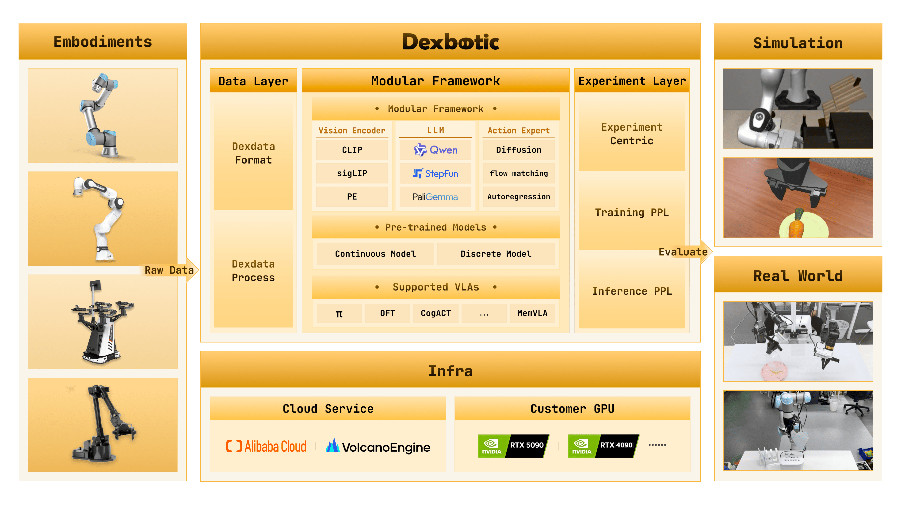
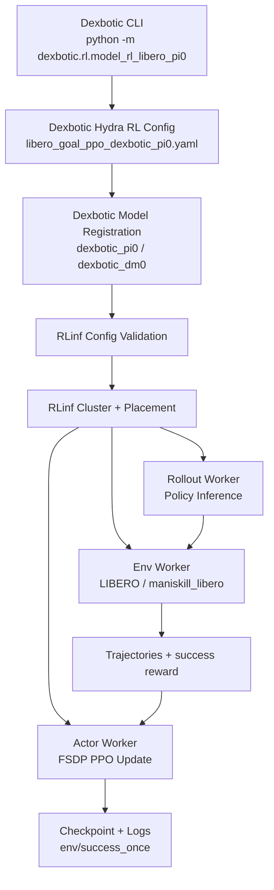

# Dexbotic-RLinf：把 VLA 工程框架接到分布式 RL 后训练

> 项目：Dexbotic + RLinf
> 主题：用 RLinf 作为 Dexbotic 的分布式强化学习后端，对 Dexbotic π0 / DM0 等 VLA 策略做 LIBERO 在线 PPO fine-tuning
> Dexbotic 仓库：https://github.com/dexmal/dexbotic
> Dexbotic 文档：https://dexbotic.com/docs/
> Dexbotic + RLinf 后端文档：https://github.com/dexmal/dexbotic/blob/main/docs/RLinfAsRLBackend.md
> RLinf 仓库：https://github.com/RLinf/RLinf
> RLinf Dexbotic 示例：https://rlinf.readthedocs.io/en/latest/rst_source/examples/embodied/dexbotic.html
> Dexbotic 技术报告：https://arxiv.org/abs/2510.23511

这篇导读放在 VLA 章节里比较合适。它不是新的世界模型，也不是单独提出一个新 VLA 架构，而是一个很典型的 **VLA 工程化后训练组合**：Dexbotic 负责模型、数据、实验配置和用户入口，RLinf 负责分布式 rollout、环境 worker、actor 训练、FSDP、日志和 checkpoint。它回答的是一个很实际的问题：已有 VLA 工具箱如果想做在线 RL fine-tuning，怎样把模型侧和 RL 基础设施侧拼起来，而不是每次在两个仓库之间手工搬 adapter、checkpoint path 和任务配置。

一句话概括：

> Dexbotic-RLinf 的价值不在于“又发明一个 VLA”，而在于把 VLA 模型开发入口和高吞吐 RL 后端打通，让 Dexbotic π0 / DM0 可以在 LIBERO 上用 PPO 做可配置、可扩展的在线后训练。

## 1. 为什么需要这个组合

VLA 复现和 VLA 后训练经常卡在两个相反的问题上。

一边是模型仓库。模型仓库通常熟悉自己的数据格式、tokenizer、action head、checkpoint 命名和推理接口，但不一定有成熟的分布式 RL 训练后端。想给模型加在线 RL，就要自己写 rollout worker、环境并发、actor 更新、权重同步、日志、checkpoint 和多 GPU 放置。

另一边是 RL 基础设施。RL 系统擅长调度 worker、并行采样、优化 actor、管理日志和 checkpoint，但不一定知道某个 VLA 模型到底怎么读取图像、proprioception、语言 prompt，action chunk 怎么生成，flow matching / flow-SDE 参数怎么配置，LIBERO evaluator 又该怎么接。

Dexbotic-RLinf 的设计就是把这两边分开：

- **Dexbotic** 继续作为 VLA 用户入口，保留模型定义、策略 adapter、Dexdata / 数据处理、Hydra 配置、checkpoint lineage 和评测脚本。
- **RLinf** 作为后端，提供 cluster launch、worker placement、rollout collection、environment workers、FSDP actor training、checkpointing、logging 和 embodied RL orchestration。

这比“把 Dexbotic 模型代码复制进 RLinf”更干净，也比“让 Dexbotic 自己重写一个 RL 系统”更现实。

## 2. Dexbotic 本身是什么



**图 1 Dexbotic 工具箱总览。** Dexbotic 把机器人数据、VLM/Action Expert 模型层、实验层、云端/本地训练基础设施和仿真/真机评测入口组织成一个 VLA 开发工具箱。
来源：[dexmal/dexbotic 官方仓库 resources/intro.png](https://github.com/dexmal/dexbotic)。

Dexbotic 是 Dexmal 开源的 VLA toolbox。官方 README 和技术报告都强调它是一个 one-stop VLA development toolbox，目标是让用户在同一个环境里复现、fine-tune、推理和评估多个主流 VLA 方法。

从图 1 可以看到，Dexbotic 的核心分三层：

1. **Data Layer**：统一机器人数据格式，官方称为 Dexdata。它用视频文件和 jsonl 描述每个 episode，jsonl 中记录多视角图像、机器人状态、文本 prompt 等信息。
2. **Model / Modular Framework Layer**：把 VLA 拆成 VLM 与 Action Expert。VLM 部分包含 vision encoder、projector、LLM；Action Expert 可以是 diffusion、flow matching 或 autoregression 等连续/离散动作生成模块。
3. **Experiment Layer**：围绕 experiment-centric 方式组织训练 pipeline、inference pipeline 和 evaluation。用户更多改 Exp 脚本或 Hydra 配置，而不是在大量散落脚本里手工拼接流程。

Dexbotic 当前公开支持的方向包括 π0、OpenVLA-OFT、CogACT、MemVLA、GR00TN1、NaVILA 等。它也提供了若干 Dexbotic 版本的预训练或 fine-tuned checkpoint，用来在 LIBERO、CALVIN、SimplerEnv、ManiSkill2、RoboTwin2.0 等基准上比较。

## 3. RLinf 在这里做什么

RLinf 是一个强化学习基础设施项目，定位是 Reinforcement Learning Infrastructure for Embodied and Agentic AI。对 Dexbotic 这条链路来说，RLinf 不是模型仓库，而是在线 RL 的执行后端。

RLinf 官方 Dexbotic 示例明确写到：RLinf 使用 Dexbotic π0 和 DM0 作为 LIBERO action-generation models，然后用 PPO 做 online fine-tuning。示例覆盖：

| 项目 | 说明 |
| :--- | :--- |
| 环境 | LIBERO |
| 算法 | PPO |
| 任务 | LIBERO Spatial、Object、Goal、10 |
| 模型 | Dexbotic π0、DM0 |
| 硬件 | 官方示例写的是 1 node、8 GPUs |
| 关键监控指标 | `env/success_once` |

这说明 Dexbotic-RLinf 不是一个纯论文概念，而是已经有公开文档、公开仓库和可执行配置的工程组合。它的目标是让用户从 Dexbotic checkpoint 出发，进入 RLinf 的 embodied PPO 训练循环。

## 4. 两种启动方式：RLinf 作为 frontend，或 RLinf 作为 backend

这里最容易混淆。官方现在有两条有效路径。

第一条是 **RLinf 作为 frontend**。用户从 RLinf 仓库启动：

```bash
git clone https://github.com/RLinf/RLinf.git
cd RLinf
bash examples/embodiment/run_embodiment.sh libero_spatial_ppo_dexbotic_pi0
```

这条路径适合已经在 RLinf 生态里工作的人。配置在 RLinf 的 `examples/embodiment/config/` 下面，例如：

- `libero_spatial_ppo_dexbotic_pi0.yaml`
- `libero_spatial_ppo_dexbotic_dm0.yaml`
- `libero_object_ppo_dexbotic_pi0.yaml`
- `libero_goal_ppo_dexbotic_pi0.yaml`
- `libero_10_ppo_dexbotic_pi0.yaml`

第二条是 **RLinf 作为 Dexbotic backend**。用户从 Dexbotic 仓库启动：

```bash
cd /path/to/dexbotic
python -m dexbotic.rl.model_rl_libero_pi0 --suite=libero_goal
```

这条路径是 Dexbotic 官方文档强调的新流程。它让 Dexbotic 做用户入口，RLinf 在内部负责分布式 RL 后端。启动日志里如果出现：

```text
[Dexbotic RL] Launching from Dexbotic entrypoint with RLinf as backend.
```

就说明这次训练是从 Dexbotic 侧启动，并且 RLinf 被作为 backend 调用，而不是让 RLinf 做顶层 frontend。

两条路径的训练语义应该一致：同一个模型、同一个算法、同一个有效配置下，底层仍然是 RLinf 的 cluster、placement、actor、rollout、env worker 和 EmbodiedRunner。区别主要是入口和用户体验。

## 5. 架构链路拆解



这张图可以按数据流来读。

首先，Dexbotic 侧入口 `dexbotic.rl.model_rl_libero_pi0` 选择一个本地 RL config，例如 `libero_goal_ppo_dexbotic_pi0.yaml`。这个配置会组合环境、模型和训练后端，其中模型类型通常是 `dexbotic_pi0` 或 `dexbotic_dm0`，训练后端可以接 FSDP 和 PPO 设置。

然后，`dexbotic.rl.rlinf_registry` 把 Dexbotic 模型注册到 RLinf 的模型注册表。官方文档给出的关键机制是：

```python
from rlinf.models import register_model

register_model("dexbotic_pi0", build_dexbotic_pi0, category="embodied", force=True)
```

在分布式 worker 中，Dexbotic 会通过 `RLINF_EXT_MODULE=dexbotic.rl.rlinf_registry` 让每个 worker 都能 import 这个 registry 并调用 `register()`。这样 RLinf 不需要把 Dexbotic 模型代码内置进去，也能像加载内置模型一样通过 `model_type` 实例化 Dexbotic policy。

最后，`dexbotic.rl._embodied_cli` 做一个薄 adapter：校验配置，创建 RLinf cluster 和 placement strategy，启动 actor、rollout、environment worker groups，然后交给 `EmbodiedRunner` 跑 PPO。

这个设计的关键不是复杂，而是边界清楚：Dexbotic 管模型，RLinf 管训练系统。

## 6. 输入输出和奖励信号

Dexbotic-RLinf 在 LIBERO 上的 observation/action/reward 关系可以整理成下面这张表。

| 字段 | 内容 | 谁负责 |
| :--- | :--- | :--- |
| Observation | LIBERO camera streams 和 proprioception | LIBERO / maniskill_libero env worker 打包，Dexbotic processor 适配 |
| Prompt | LIBERO 自然语言任务指令 | 环境和任务配置提供，Dexbotic policy processor 消费 |
| Action | Dexbotic π0 / DM0 输出的 chunked continuous actions | Dexbotic policy backend 生成，RLinf rollout worker 调用 |
| Reward | LIBERO success signal 或 simulator reward | 环境返回，RLinf PPO 使用 |
| Log metric | `env/success_once` 等训练指标 | RLinf logger / TensorBoard 记录 |

动作 chunk 也要区分。RLinf Dexbotic 示例中，π0 使用 `num_action_chunks: 5`，DM0 使用 `num_action_chunks: 10`。评估时也要对应调整 `--action_chunk`，否则 action horizon 和模型输出不匹配。

## 7. 从公开文档看，应该怎么复刻

这里给一个“读者应该怎么做”的路线，但本教程没有在本地重跑 8 GPU 在线 RL，也不把它包装成已经复现实验结果。

### 7.1 准备 RLinf 环境

官方更推荐 Docker，因为 embodied RL 依赖复杂。RLinf Dexbotic 示例给出的 Docker tag 是：

```bash
docker run -it --rm --gpus all \
  --shm-size 20g \
  --network host \
  --name rlinf \
  -v .:/workspace/RLinf \
  rlinf/rlinf:agentic-rlinf0.3-maniskill_libero

source switch_env dexbotic
```

如果不用 Docker，可以从 RLinf 仓库安装 embodied bundle：

```bash
git clone https://github.com/RLinf/RLinf.git
cd RLinf
bash requirements/install.sh embodied --model dexbotic --env maniskill_libero
source .venv/bin/activate
```

国内网络下可以按官方建议使用镜像或设置 `HF_ENDPOINT=https://hf-mirror.com`，但不要把个人 token 或私有镜像地址写进公开脚本。

### 7.2 下载 Dexbotic checkpoint

RLinf 文档列了两个 Hugging Face checkpoint：

```bash
git lfs install
git clone https://huggingface.co/Dexmal/libero-db-pi0
git clone https://huggingface.co/Dexmal/DM0-libero
```

也可以用 `huggingface-cli`：

```bash
pip install huggingface-hub
huggingface-cli download Dexmal/libero-db-pi0 --local-dir libero-db-pi0
huggingface-cli download Dexmal/DM0-libero --local-dir DM0-libero
```

下载后要把同一个 checkpoint 路径同时填给 rollout model 和 actor model：

```yaml
rollout:
  model:
    model_path: /path/to/downloaded-checkpoint
actor:
  model:
    model_path: /path/to/downloaded-checkpoint
```

这里不要只改 actor。在线 RL 中 rollout worker 用旧策略采样，actor worker 做 PPO 更新，两边模型初始化路径不一致会导致训练行为很难解释。

### 7.3 从 RLinf 侧启动

如果从 RLinf 仓库启动，可以直接跑示例配置：

```bash
cd /path/to/RLinf
bash examples/embodiment/run_embodiment.sh libero_spatial_ppo_dexbotic_pi0
```

这个命令会做三件事：

1. 加载 `examples/embodiment/config/libero_spatial_ppo_dexbotic_pi0.yaml`。
2. 按 `cluster.component_placement` 创建 LIBERO actor、rollout 和 env workers。
3. 跑 PPO，并把日志和 checkpoint 写到 `runner.logger.log_path`。

### 7.4 从 Dexbotic 侧启动

如果更关心 Dexbotic 模型开发体验，可以从 Dexbotic 仓库启动：

```bash
git clone https://github.com/dexmal/dexbotic.git
cd dexbotic
python -m dexbotic.rl.model_rl_libero_pi0 --suite=libero_goal
```

也可以用 Hydra 方式覆盖 config 和 checkpoint：

```bash
python -m dexbotic.rl.model_rl_libero_pi0 \
  --config-name=libero_10_ppo_dexbotic_pi0 \
  actor.model.model_path=/path/to/dexbotic-pi0-checkpoint \
  rollout.model.model_path=/path/to/dexbotic-pi0-checkpoint
```

官方文档写到支持的 suite 包括：

- `libero_10`
- `libero_90`
- `libero_goal`
- `libero_object`
- `libero_spatial`

### 7.5 训练监控和独立评估

训练时最直接的指标是 `env/success_once`。可以用 TensorBoard 看：

```bash
tensorboard --logdir ./logs --port 6006
```

训练后可以用 Dexbotic 的 LIBERO evaluator 做 standalone evaluation：

```bash
python toolkits/standalone_eval_scripts/dexbotic/libero_eval.py \
  --config_name db_pi0_libero \
  --pretrained_path /path/to/checkpoint \
  --task_suite_name libero_spatial \
  --num_trials_per_task 50 \
  --action_chunk 5 \
  --num_steps 10
```

DM0 要切换配置和 action chunk：

```bash
python toolkits/standalone_eval_scripts/dexbotic/libero_eval.py \
  --config_name dm0_libero \
  --pretrained_path /path/to/checkpoint \
  --task_suite_name libero_spatial \
  --num_trials_per_task 50 \
  --action_chunk 10 \
  --num_steps 10
```

## 8. 它和 Agentic-VLA、LWD、PRTS 的区别

Dexbotic-RLinf 很容易和近期几个 VLA 后训练工作混在一起，需要分清：

| 工作 | 重点 | Dexbotic-RLinf 的关系 |
| :--- | :--- | :--- |
| Agentic-VLA | 自动奖励合成、语言引导探索、经验记忆，提升在线适应效率 | 更像算法层外环；Dexbotic-RLinf 更像工程后端和入口打通 |
| LWD | 真机机群部署数据飞轮、offline-to-online RL、QAM / DIVL | LWD 强调真实机器人持续学习；Dexbotic-RLinf 当前公开示例主要是 LIBERO 在线 PPO |
| PRTS | 在 VLA 预训练阶段引入 reward-label-free contrastive RL | PRTS 是模型训练范式；Dexbotic-RLinf 是用已有 Dexbotic 策略继续 RL fine-tuning |
| Robots That Know What to Ask | 人类示教中的欠指定奖励特征与主动提问 | 它解决 reward 对齐；Dexbotic-RLinf 默认使用环境 success/reward 做 PPO |
| RAW-Dream / GE-Sim | 世界模型内 imagined rollout 或 learned simulator | Dexbotic-RLinf 不生成世界，不是世界模型；它连接真实/仿真环境 worker 和 RL 后端 |

一句话：这更像 **VLA 后训练工程框架**，不是单篇算法 SOTA 宣称。

## 9. 它适合作为教程里的什么任务

在组队学习里，Dexbotic-RLinf 适合放到 Task04 进阶复盘，而不是 Task02 入门任务。原因很直接：

- 它涉及 Dexbotic、RLinf、LIBERO、ManiSkill-LIBERO、checkpoint、PPO、FSDP 和多 worker 配置。
- 官方示例推荐 1 node 8 GPUs，普通同学不一定有算力跑完整训练。
- 真正有学习价值的是理解工程边界：模型框架怎么注册到 RL 后端，RL 后端怎么接 actor/rollout/env worker。

推荐交付方式：

1. 画清楚 Dexbotic 和 RLinf 的职责分工。
2. 解释 `dexbotic_pi0` / `dexbotic_dm0` 为什么需要 registry bridge。
3. 对比从 RLinf 侧启动和从 Dexbotic 侧启动的区别。
4. 说明 π0 / DM0 的 checkpoint、action chunk、LIBERO suite 和评估脚本如何对应。
5. 明确自己是否真的跑了训练；如果没跑，只提交方法与工程链路分析，不要伪造结果。

## 10. 复现边界

这条链路是开源的，公开入口比较完整：Dexbotic 仓库、RLinf 仓库、Dexbotic 技术报告、Dexbotic + RLinf 后端文档和 RLinf Dexbotic 示例都能查到。但它仍然不是轻量 notebook 级复现。

主要边界包括：

- 需要较重的 embodied RL 环境，官方推荐 Docker；
- 完整 PPO fine-tuning 推荐多 GPU，普通单卡更适合做配置阅读或短 smoke test；
- LIBERO 环境、ManiSkill-LIBERO 依赖和渲染后端可能带来额外环境问题；
- checkpoint 下载依赖 Hugging Face 和 Git LFS；
- 从 Dexbotic 侧启动时，Python 环境仍然要包含 RLinf embodied runtime；
- 不同入口的有效 config 要保持一致，否则不能直接比较结果。

如果只是学习，不建议一上来跑完整训练。更稳的路径是先读 `docs/RLinfAsRLBackend.md`，确认 registry、entrypoint、config 和 worker 分工；再用 RLinf Dexbotic 示例做一个最短训练 smoke test；最后再考虑完整 LIBERO suite 评测。

## 参考链接

- Dexbotic GitHub：https://github.com/dexmal/dexbotic
- Dexbotic 中文/英文文档：https://dexbotic.com/docs/
- Dexbotic + RLinf 后端文档：https://github.com/dexmal/dexbotic/blob/main/docs/RLinfAsRLBackend.md
- RLinf GitHub：https://github.com/RLinf/RLinf
- RLinf Dexbotic 示例：https://rlinf.readthedocs.io/en/latest/rst_source/examples/embodied/dexbotic.html
- Dexbotic 技术报告：https://arxiv.org/abs/2510.23511
- Dexmal/libero-db-pi0：https://huggingface.co/Dexmal/libero-db-pi0
- Dexmal/DM0-libero：https://huggingface.co/Dexmal/DM0-libero
