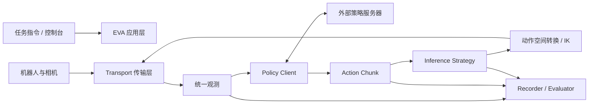

# EVA-Client：从 VLA 权重到真机部署与可审计评测

> 本节定位：VLA 工程部署补充资料。EVA-Client 不负责训练策略，也不是一种新的 VLA 架构；它补齐的是“训练完成之后，如何采集数据、接入策略服务器、稳定执行动作块并留下可复查评测记录”这一段工程链路。

## 1. 项目速览

| 项目 | 信息 |
| :--- | :--- |
| 项目主页 | [EVA-Client Project Page](https://colalab.net/projects/eva-client) |
| 代码仓库 | [Noietch/EVA-CLIENT](https://github.com/Noietch/EVA-CLIENT) |
| 技术报告 | [EVA-Client Technical Report](https://colalab.net/projects/eva-client/paper/EVA_Client_Report.pdf) / [arXiv:2607.02646](https://arxiv.org/abs/2607.02646) |
| 开源协议 | Apache-2.0 |
| 本节核对版本 | 官方仓库提交 `ff36587`，2026-08-19 |
| Python 版本 | `>=3.10,<3.12`，推荐 Python 3.10 |

EVA-Client 面向的不是“再训练一个模型”，而是以下高频问题：

1. 相机、关节状态和任务指令怎样按统一格式送到策略端？
2. 策略一次返回一段 action chunk，机器人怎样连续执行而不频繁停顿？
3. 更换机器人、通信方式或策略后端时，哪些部分可以复用？
4. 真机成功率怎样统计，失败过程怎样回看，日志能否继续用于训练？

它把这些问题拆成传输层、机器人描述、策略客户端、动作调度策略、控制台与记录器，使“模型推理”和“机器人执行”不必写在同一个脚本里。

## 2. 官方总览图：一次评测如何贯穿数据闭环

<p align="center">
  
</p>

**图 1：EVA-Client 官方工作流。** 图片来源：[EVA-Client 官方仓库](https://github.com/Noietch/EVA-CLIENT/blob/main/assets/workflow.png)。

这张图应按从左到右的五段链路理解：

### 2.1 Embodiment：先把本体差异收进统一描述

最左侧展示多种机器人本体。不同机器人在关节数量、双臂分组、夹爪、相机、初始姿态和通信协议上差异很大。EVA-Client 不试图让所有机器人共享同一个驱动，而是把本体结构、关节组、相机和动作空间写入机器人描述，再由传输层接入真实驱动。

因此，换机器人时主要新增的是 robot definition、hardware node 和 config，而不是重写数据采集、策略请求、动作调度和评测界面。

### 2.2 Data Collection：采集、回放与 LeRobot 导出

第二段把遥操作观测与动作记录为 episode，并提供回放和质量检查。数据可导出为 LeRobot v2.1 目录结构，因此它可以接到本教程已有的 SmolVLA、LeRobot 数据处理与训练内容后面。

这里的关键不是“能录视频”，而是把图像、机器人状态、动作、时间戳、任务文本和 episode 元信息对齐。对真机 VLA 来说，错误时间戳、掉帧、相机命名变化或动作维度不一致，往往比模型结构更早导致训练和部署失败。

### 2.3 Policy Training：训练仍由外部框架完成

图中央的 OpenPI、StarVLA、GR00T 和 DreamZero 表示可衔接的策略或训练生态，不表示 EVA-Client 内置了这些训练算法。当前代码中可直接看到的策略客户端包括：

- `openpi`：连接 OpenPI 推理服务；
- `openpi_rtc`：配合 Real-Time Chunking；
- `starvla`：连接 StarVLA 推理端；
- `gr00t`：连接 GR00T 推理端；
- `mock`：无真实模型时验证通信和界面；
- `replay`：用已记录动作进行回放测试。

训练完成后的 checkpoint 由对应框架启动成策略服务，EVA-Client 负责组织观测、请求动作并执行返回的动作块。

### 2.4 Deployment：动作块调度决定“能跑”还是“跑得稳”

图中的同步执行会在等待下一次推理时产生停顿；异步执行让推理和机器人控制重叠，并在新旧动作块之间做衔接。真机上的卡顿、动作跳变和延迟积累，通常就发生在这一层。

### 2.5 Evaluation：评测同时留下可再训练的数据

最右侧不仅展示成功率，还强调视频、机器人状态、动作曲线和 episode 日志。一次评测可以同时成为：

- checkpoint 的成功率测量；
- 失败案例的可视化诊断；
- 人工干预或恢复动作的记录；
- 下一轮数据清洗、模仿学习或在线适应的输入。

## 3. 系统架构：把策略、调度与硬件解耦



### 3.1 Transport：只解决“怎么收发”

传输层负责从执行后端接收相机与机器人状态，并发送控制命令。当前项目提供 ROS1、ROS2、ZMQ 和 LeRobot 数据集离线回放入口。

把传输和策略分开有两个直接收益：同一个策略可换 ROS/ZMQ 后端；同一台机器人也可切换真实硬件、离线数据或 mock 环境做分层排错。

### 3.2 Robot Definition：定义本体契约

机器人描述至少需要明确：

- 关节名称、顺序、维度和左右臂分组；
- 相机名称、图像尺寸和视角；
- 初始姿态、限位与控制频率；
- 策略使用 `JointState` 还是 `EEFPose`；
- 需要末端位姿到关节角转换时的 URDF 与 IK 配置。

EVA-Client 的末端位姿表示可按每臂 `xyz(3) + quaternion(4) + gripper(1)` 组织为 8 维。如果机器人底层接收关节位置，而策略输出末端位姿，可通过 PyRoki 做逆运动学转换。

### 3.3 Policy Client：适配推理服务协议

Policy Client 负责三件事：把统一观测转换成模型输入；向远端或本地推理服务发起请求；把响应还原为统一 action chunk。模型的 tokenizer、checkpoint 加载和 GPU 推理可以继续留在原训练框架中。

这也解释了为什么 EVA-Client 适合做轻量真机客户端：机器人控制机不必同时承担大模型训练环境，策略服务可以部署在另一台 GPU 服务器上，再通过端口转发或局域网连接。

### 3.4 Inference Strategy：处理时间轴，而不是改变模型

| 策略 | 工作方式 | 适用场景 | 主要风险 |
| :--- | :--- | :--- | :--- |
| `sync` | 执行完或请求时阻塞等待下一动作块 | 最容易理解的初次联调 | 推理期间机器人停顿 |
| `async` | 后台预测下一块，并对新旧动作做线性交叠 | 默认连续真机执行 | 需正确设置重叠长度和缓冲区 |
| `naive` | 异步请求，新块到达后直接替换旧缓冲 | 快速验证吞吐 | 边界动作可能跳变 |
| `act` | 对多个重叠预测按时间权重集成 | ACT 类策略 | 需要维护多块预测及其时间位置 |
| `rtc` | 按已承诺执行的动作对新预测进行实时对齐 | OpenPI RTC 等低延迟链路 | 服务端与客户端协议必须匹配 |

如果 action chunk 长度为 $H$、控制频率为 $f_c$、单次推理延迟为 $t_i$，同步执行很容易在 $t_i$ 接近或超过剩余缓冲时停住。异步策略的本质，是在机器人消费当前动作块时提前完成下一次推理，并处理两块动作在时间上的对齐。

### 3.5 Recorder 与 Evaluator：把“成功率”变成证据链

记录器同时保存观测、模型预测、实际执行命令和评测元信息。实际执行动作不一定等于原始预测：它可能经过裁剪、IK、平滑、人工干预或安全过滤。将这些量分开记录，才能回答失败究竟来自模型、通信、调度还是控制器。

## 4. 七个操作页对应什么工作

EVA-Client 控制台将常用流程分为七个页签：

| 页签 | 用途 |
| :--- | :--- |
| `MANUAL` | 手动检查关节、相机、指令和基本控制 |
| `COLLECT` | 录制遥操作或人工示教 episode |
| `REPLAY` | 回放数据，检查同步、视角和动作质量 |
| `DEBUG` | 分段执行模型动作，定位策略或接口问题 |
| `RL` | rollout 中进行人工介入，并观察 critic/value 信号 |
| `EVAL` | 按任务、checkpoint 和试验次数组织真机评测 |
| `RESULT` | 汇总成功率、里程碑、视频和日志 |

推荐按 `MANUAL -> COLLECT/REPLAY -> DEBUG -> EVAL` 的顺序进入真机闭环。不要在相机、关节顺序和急停尚未验证时直接连续运行策略。

## 5. 数据与日志：为什么它能接到 LeRobot 后面

一次采集或 rollout 可形成类似下面的 LeRobot v2.1 结构：

```text
<log_dir>/<task>/
├── data/chunk-000/episode_000000.parquet
├── videos/chunk-000/<camera>/episode_000000.mp4
└── meta/
    ├── info.json
    ├── episodes.jsonl
    ├── episodes_stats.jsonl
    ├── tasks.jsonl
    └── stats.json
```

除训练所需的标准字段外，评测还应保留便于审计的长表或 sidecar：用 `absolute_step` 对齐原始状态、模型动作块、最终执行动作、推理延迟、人工干预和失败标记。项目中的质量检查会关注 episode 过短、时间戳不单调、相机缺失等问题。

这条链路适合形成下面的闭环：

```text
真机示教 -> LeRobot 数据 -> 外部 VLA 训练 -> EVA 部署评测
        ^                                  |
        |------- 失败片段 / 人工介入 -------|
```

## 6. 当前支持范围

截至本节核对版本，官方 Robot Zoo 列出的已支持本体包括：

| 本体 | 形态 |
| :--- | :--- |
| AgileX Piper | 双 6-DoF 机械臂 + 夹爪 |
| ARX R5 | 双 6-DoF 机械臂 + 夹爪 |
| Dual Franka Panda | 双 7-DoF 机械臂 + 夹爪 |
| Galaxea R1 Lite | 双臂 + 躯干 |
| UR5e | 单 6-DoF 机械臂 + 夹爪 |
| AgiBot G2 | 双臂人形机器人，24-DoF body |

仓库还把部分机器人列为开发中或待加入。支持列表会随项目更新变化，部署前应以官方仓库的 `README.md`、`configs/` 和 `examples/hardware/` 三处同时存在为准，而不能只看项目宣传图。

### SO-101 目前能否直接使用？

不能把它写成“已支持”。Issue #94 中作者在 2026-07-09 表示后续会支持；但截至官方提交 `ff36587`，仓库中尚未找到 SO-101 的机器人描述、硬件节点和可运行配置。

若社区要补充 SO-101，最小工作项是：

1. 新增 SO-101 robot definition，固定 Feetech 关节名称、顺序、范围、初始位姿和相机名称；
2. 用 LeRobot/Feetech 接口实现硬件执行节点，并通过现有 ZMQ 或适合的 transport 暴露观测与动作；
3. 明确策略输入输出是关节位置、增量还是其他动作表示，校验维度和单位；
4. 增加采集、部署和评测 config；
5. 配置关节限位、速度限制、急停和单动作块调试；
6. 先用 fake policy 和录制数据做集成测试，再接真实 VLA 服务。

这是一条可行的适配路线，不等于官方现成能力。

## 7. 不接真机的最小体验

项目提供基于随仓库示例数据的 open-loop 配置。它适合先验证安装、页面、数据读取和可视化，不需要 ROS、真实机器人或 VLA checkpoint。

```bash
git clone https://github.com/Noietch/EVA-CLIENT.git
cd EVA-CLIENT

curl -LsSf https://astral.sh/uv/install.sh | sh
uv venv --python 3.10 .venv
source .venv/bin/activate
uv pip install -e ".[dev]"

eva --config configs/00_openloop/dual_agilex_piper_openloop.py
```

启动后按终端提示打开控制台，默认通常为 `http://127.0.0.1:8080`。这一阶段重点检查：

- 页面能否读到 episode；
- 各相机是否与配置名称一致；
- 关节曲线和 3D 场景能否随时间变化；
- 回放、暂停和 episode 切换是否正常。

它只能证明客户端和示例数据链路正常，不能证明某个 checkpoint 能控制真实机器人。

## 8. 真机部署的两进程模式

真实部署通常至少包含两个独立进程：

```text
进程 A：硬件执行节点
  读取相机/关节 -> 发布统一观测
  接收动作命令 -> 经过限位后驱动机器人

进程 B：EVA-Client
  读取 config -> 连接 transport -> 请求策略服务
  调度 action chunk -> 记录与评测
```

官方仓库为不同机器人提供了硬件启动示例，例如：

```bash
# 下面只展示入口形式，运行前仍需安装对应厂商 SDK/ROS 环境
bash examples/hardware/agilex_piper/run_agilex_ros.sh
bash examples/hardware/arx/run_hardware.sh
bash examples/hardware/franka/run_hardware.sh
bash examples/hardware/ur5e/run_hardware.sh

# 另一个终端启动 EVA 配置
eva --config configs/01_deploy/dual_agilex_piper/openpi_qpos.py
```

策略服务器可在同机或远端 GPU 服务器上运行。远端连接时，应显式检查地址、端口、超时、动作频率和网络抖动；不要把控制通道直接暴露到公网。

## 9. 配置文件应该读什么

面对一个新配置，不要只改 IP。建议按以下顺序核对：

| 配置块 | 必查内容 |
| :--- | :--- |
| Robot | 本体类型、关节组、相机、初始姿态、URDF |
| Transport | ROS1/ROS2/ZMQ/dataset、地址、topic 或 channel |
| Policy | backend、服务地址、任务指令、输入图像键 |
| Action | `JointState`/`EEFPose`、维度、单位、夹爪约定 |
| Strategy | sync/async/act/rtc、chunk 长度、重叠与控制频率 |
| Safety | 关节/速度/工作空间限制、超时、急停 |
| Logging | 输出目录、相机视频、状态与评测字段 |

如果出现“界面有图但机器人不动”，优先检查动作空间、关节顺序和执行节点；如果“机器人每隔一段时间停一下”，优先检查推理延迟、chunk 消耗速度和调度策略；如果“动作突然跳变”，优先比较模型原始动作、新旧块交界和实际下发动作。

## 10. 推荐复现路线

本教程暂不提供逐按钮真机复现，但建议按风险从低到高推进：

1. 跑通随仓库提供的 dataset open-loop 示例；
2. 用 `mock` 或 `replay` 验证策略客户端和 action chunk 形状；
3. 启动硬件节点，只读取状态和图像，不下发动作；
4. 在 `DEBUG` 中执行单个短动作块，确认方向、单位和限位；
5. 先用 `sync` 建立可解释基线，再比较 `async`/`act`/`rtc`；
6. 运行少量真实 episode，逐条复核视频、状态、预测和实际动作；
7. 最后再做多 checkpoint、多任务和重复试验的正式评测。

正式报告成功率时，还应写明机器人、任务文本、场景初始化、每任务次数、成功判据、checkpoint、动作调度策略和人工干预规则。否则不同策略的数字不可直接比较。

## 11. 与 every-embodied 现有内容怎样衔接

EVA-Client 最适合放在以下学习链路的末端：

1. 先学习 [RDK-X5 连接 LeRobot 机械臂进行遥操作](../../../03-机器人硬件、lerobot及地瓜RDK-X5开发板控制教程/03RDK-X5连接lerobot机械臂进行遥操作.md) 或仓库内数据采集相关章节，理解 episode 与多模态时间对齐；
2. 再完成 [SmolVLA](../01SmolVLA-LIBERO/01SmolVLA-libero.md)、[OpenVLA](../02OpenVLA复现/02openvla复现.md) 或 [OpenPI / π0](../04mujoco复现ACT、Pi0、SmolVLA/) 的训练与推理；
3. 用 EVA-Client 接入真实本体，处理策略服务、动作块调度、日志和评测；
4. 将失败 rollout 和人工介入数据送回 LeRobot/训练链路，形成数据闭环。

它补的是部署基础设施，而不是替代上述模型教程。

## 12. 使用边界与安全提示

- EVA-Client 统一了接口，但不会自动保证策略动作安全；真实机器人仍需硬件急停、软件限位和现场监护。
- ZMQ 控制通道能够触发真机动作，默认应限制在可信局域网或本机，通过认证隧道访问，不应裸露到公网。
- 评测控制台和日志提高了可审计性，但成功判据仍需任务级定义，不能只凭模型或界面自动推断。
- “支持某策略”通常表示存在客户端协议，不代表仓库附带该策略的训练权重、许可证或完整训练环境。
- “支持某机器人”应以 robot definition、hardware example 和 config 均可核验为准。

## 参考资料

1. [EVA-Client 官方项目页](https://colalab.net/projects/eva-client)
2. [EVA-Client GitHub 仓库](https://github.com/Noietch/EVA-CLIENT)
3. [EVA-Client Technical Report](https://colalab.net/projects/eva-client/paper/EVA_Client_Report.pdf)
4. [arXiv:2607.02646](https://arxiv.org/abs/2607.02646)
5. [every-embodied Issue #94：EVA-Client 推荐](https://github.com/datawhalechina/every-embodied/issues/94)
