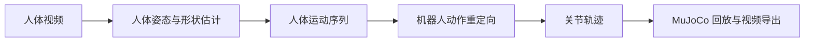

# 机器人操作与运动控制

本专题以“从人体视频生成机器人动作”为完整案例，覆盖人体姿态估计、动作重定向、轨迹可视化和 MuJoCo 视频导出。当前内容聚焦运动复刻；机械臂操作策略见[机器人策略与抓取专题](../06-策略抓取或抓取VLA/README.md)。

## 学习入口

1. [从舞蹈视频到机器人轨迹](Locomotion/01春晚舞蹈机器人复刻.md)：完成环境搭建、人体动作恢复、动作重定向和视频导出。
2. [Seedance 接口准备](Locomotion/补充01seeddanceAPI获取.md)：了解输入视频生成接口及凭据配置。
3. [模型资产下载脚本](Locomotion/video2robot/文件更新说明.md)：配置需要授权下载的人体模型资产。
4. [补丁应用说明](Locomotion/video2robot/PATCHES.md)：在锁定上游版本后应用本仓库补丁。

## 数据流

## 完成标准

- 能说明人体运动恢复和机器人动作重定向的职责边界。
- 能生成一条机器人关节轨迹并在仿真器中回放。
- 能识别关节限位、接触、平衡和模型资产缺失引起的常见问题。
