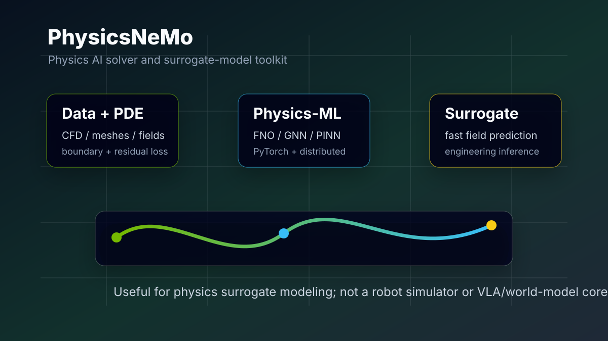
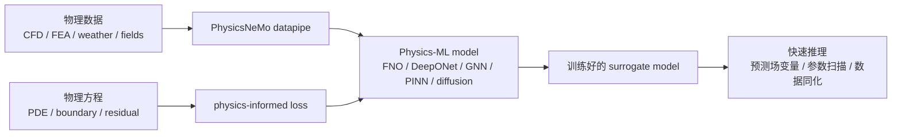

# PhysicsNeMo：NVIDIA 物理 AI 求解器导读

> 官方主页：https://developer.nvidia.com/physicsnemo
> GitHub：https://github.com/NVIDIA/physicsnemo
> 文档：https://docs.nvidia.com/physicsnemo/latest/
> 示例目录：https://docs.nvidia.com/physicsnemo/latest/examples_catalog.html
> 安装文档：https://docs.nvidia.com/physicsnemo/latest/getting-started/installation.html
> 开源协议：Apache-2.0

PhysicsNeMo 是 NVIDIA 面向 Physics AI / AI4Science / 工程仿真的开源深度学习框架。它的主要目标不是训练 VLA，也不是做机器人仿真交互，而是构建、训练、微调和推理物理机器学习模型，例如 neural operator、graph neural network、diffusion model、PINN、天气/气候模型、CFD surrogate、结构力学或电磁场代理模型。

PhysicsNeMo 适合作为物理代理建模的扩展工具。具身机器人同样关心接触、流体、材料、柔体和多物理场，但 MuJoCo、Isaac Sim、ManiSkill、Genesis、Habitat 负责交互式环境和动力学步进；PhysicsNeMo 则用神经网络学习偏微分方程或工程仿真的快速代理求解器，不直接提供机器人调用的 `env.step(action)` 环境。



图 1 PhysicsNeMo 在教程中的定位。这里用本地 SVG 概括其核心链路：物理数据和 PDE 约束进入 Physics-ML 模型，训练出可快速推理的 surrogate model。官方 developer 页提供的多为客户案例图，不是清晰架构图，因此本章用自绘图说明概念。

## 1. PhysicsNeMo 的适用范围

如果目标是复现 OpenVLA、SmolVLA、ACT、机器人抓取、导航、世界模型或真机控制，PhysicsNeMo 不是优先级很高的工具。它不会替代：

- MuJoCo / Isaac Sim / ManiSkill 的机器人动力学仿真；
- Habitat / VLN-CE 的导航环境；
- LeRobot / OpenPI / OpenVLA 的机器人策略训练；
- RAW-Dream / GE-Sim / BWM 这类动作条件世界模型；
- Genesis / SIM1 这类更直接面向机器人或物理仿真的平台。

它更适合这几类问题：

- 用 FNO / DeepONet / Graph Neural Network 学 PDE 解算器；
- 把 CFD、结构力学、电磁、天气等仿真结果训练成 surrogate model；
- 在已有物理数据上加入 PDE residual、边界条件或守恒约束；
- 用 PyTorch + NVIDIA GPU 做大规模 Physics-ML 训练；
- 研究 PINN、neural operator、mesh / point-cloud datapipe、分布式训练。

本节把 PhysicsNeMo 作为物理 AI 求解器扩展：先明确它能解决的问题及其与机器人仿真器的区别，再选择轻量示例验证安装和神经算子流程。

## 2. 名字变化：Modulus 到 PhysicsNeMo

PhysicsNeMo 不是完全凭空出现的新项目。它和 NVIDIA 过去的 Modulus 关系很深。现在官方 GitHub 与文档都使用 PhysicsNeMo 作为主线名称，仓库 README 也写到 PhysicsNeMo 正在进行 v2.0 更新，并提供迁移指南。

可以简单理解为：

```text
NVIDIA Modulus / Modulus Sym
    -> PhysicsNeMo / PhysicsNeMo Sym / PhysicsNeMo CFD / PhysicsNeMo Curator
```

因此，很多老教程、博客、issue 或镜像里还会看到 `modulus` 这个名字。查资料时要注意版本和包名，不要把老的 Modulus 命令直接照搬到新的 PhysicsNeMo 环境里。

## 3. 它到底是不是“物理 AI 求解器”

可以这么说，但要讲清楚“求解器”的含义。

传统物理求解器通常是数值方法：有限差分、有限元、有限体积、谱方法、粒子法、刚体/柔体动力学求解器等。它们直接离散物理方程，在 mesh / grid / particle 上一步步算。

PhysicsNeMo 的“求解器”更像神经代理求解器：



训练阶段，它可能需要大量仿真数据、观测数据或 PDE residual。推理阶段，它可以比传统仿真更快地产生近似解，例如给定边界条件、几何参数或初始场，预测未来场变量、压力、速度、温度、应力或气象变量。

这类模型的核心价值是加速参数扫描、设计优化、数据同化和交互式工程探索，而不是替代所有高保真仿真。

## 4. 核心组件

根据 NVIDIA 官方 README，PhysicsNeMo 是模块化组织的，几个关键组件如下。

| 组件 | 作用 |
| :--- | :--- |
| `physicsnemo.models` | 模型架构库，包含 neural operators、GNN、diffusion、transformer、PINN 等 |
| `physicsnemo.datapipes` | 面向工程/科学数据的数据管线，例如 point clouds、meshes、fields |
| `physicsnemo.distributed` | 基于 `torch.distributed` 的分布式训练工具 |
| `physicsnemo.curator` | 工程数据整理和加速数据策展的子模块 |
| `physicsnemo.sym` | 符号 PDE residual、几何/domain sampling、physics-informed loss 等 |
| `physicsnemo-cfd` | 面向 CFD 工作流和预训练模型推理的领域子模块 |

其中和“物理 AI 求解器”关系最紧的是 `models`、`datapipes` 和 `sym`。如果只是想跑一个神经网络模型，可以只用 core；如果要把 PDE residual、边界条件、几何采样明确写进训练，就会接触 `physicsnemo-sym`。

## 5. 支持哪些模型架构

PhysicsNeMo 官方模型架构页面和 README 提到的代表性模型包括：

- **Fourier Neural Operator (FNO)**：学习函数空间到函数空间的映射，常用于 PDE surrogate。
- **DeepONet**：同样属于 neural operator 路线，用 branch / trunk 网络学习 operator。
- **DoMINO**：NVIDIA 用于几何/工程场预测的一类模型。
- **Graph Neural Networks**：适合 mesh、粒子、图结构或非规则几何。
- **MeshGraphNet**：在 Lagrangian 或 mesh-based 物理系统里常见。
- **XAeroNet**：偏空气动力学代理建模。
- **Diffusion models / correction diffusion / DDPM**：用于概率预测、修正和生成式物理建模。
- **GraphCast / weather models**：面向天气和地球系统建模。
- **Transformers / Transsolver / RNN / SwinVRNN**：用于时空序列和场预测。
- **PINNs**：用 PDE residual 和自动微分把物理约束放进 loss。

对机器人教程来说，最值得知道的是 FNO、GNN、PINN 三类。FNO 对规则网格上的场预测很典型，GNN 对 mesh / graph / particle 更自然，PINN 更强调“没有大量标签数据时，用方程残差约束模型”。

## 6. 和机器人仿真器的区别

这点必须讲清楚，否则很容易误解。

| 问题 | MuJoCo / Isaac Sim / ManiSkill | PhysicsNeMo |
| :--- | :--- | :--- |
| 是否可直接 `step(action)` | 是，典型机器人 RL 环境可以一步步执行动作 | 通常不是，它训练/推理 physics-ML 模型 |
| 主要输入 | 机器人状态、控制量、场景资产、接触参数 | 物理数据、场变量、PDE、边界条件、几何、网格 |
| 主要输出 | 下一步状态、观测、奖励、碰撞/接触结果 | 预测场、代理仿真结果、PDE surrogate 输出 |
| 典型任务 | 抓取、导航、行走、操作、仿真采样 | CFD、天气、结构、电磁、PDE 解算、数据同化 |
| 训练目标 | 策略学习、模仿学习、强化学习 | surrogate modeling、Physics-ML、PINN/neural operator |

所以它不是“更高级 Isaac Sim”。如果要训练机械臂抓杯子，PhysicsNeMo 不是第一选择；如果要学习一个柔性材料、流体场、气动载荷或热场的快速近似模型，它就更相关。

## 7. 安装方式

官方文档写到 PhysicsNeMo 支持两类安装路径：pip / uv 安装，以及 NVIDIA container image。

最简单可以先试 pip：

```bash
pip install nvidia-physicsnemo
```

如果需要符号 PDE、domain、几何采样和 physics-informed loss，可以安装带 `sym` 的扩展：

```bash
pip install "nvidia-physicsnemo[sym]"
```

如果想少踩依赖坑，尤其是跑官方 examples，NVIDIA container 更稳。容器适合训练、运行样例和评估环境一致性。具体镜像 tag 以官方安装页为准，不建议在教程里写死一个长期有效的 tag。

安装后可以做一个最小 import 检查：

```python
import torch
from physicsnemo.models.mlp.fully_connected import FullyConnected

model = FullyConnected(in_features=32, out_features=64)
x = torch.randn(128, 32)
y = model(x)

print(y.shape)
```

这个检查只说明 `physicsnemo` 包能被 import，模型模块能被实例化，不能证明 CUDA、分布式训练、PDE residual 或官方 examples 都已经可用。

## 8. 第一个应该看哪个例子

官方 examples catalog 里有很多任务。对初学者，建议先看 Darcy Flow + FNO。

Darcy Flow 是 neural operator 教程里非常经典的 PDE surrogate 任务。它通常输入渗透率场、边界条件等，输出压力场或相关解。这个任务的优点是：

- 比 CFD 三维大模型轻；
- 比天气模型或大规模 mesh GNN 容易理解；
- 能清楚看到“输入场 -> FNO -> 输出场”的 neural operator 结构；
- 可以扩展到 physics-informed loss 或 PINO。

推荐阅读顺序：

1. `2D Darcy Flow using Fourier Neural Operators`
2. `2D Darcy Flow using Fourier Neural Operators and Physics Losses`
3. PhysicsNeMo model architectures 文档里的 FNO / neural operator 章节
4. `physicsnemo-sym` 里关于 PDE residual 和 geometry/domain 的内容

不建议一开始就跑 GraphCast、气候、CFD 复杂工程案例。那些任务更接近实际应用，但安装、数据和算力门槛明显更高。

## 9. 一个最小理解例子：FNO 在做什么

FNO 可以粗略理解成：模型学习一个从“输入函数”到“输出函数”的映射。普通神经网络学的是向量到向量：

```text
x ∈ R^d -> y ∈ R^k
```

神经算子学的是函数到函数：

```text
a(x, y) -> u(x, y)
```

在 Darcy Flow 里，`a(x, y)` 可以是空间变化的材料/渗透率参数，`u(x, y)` 是 PDE 解出来的压力场。训练好后，给一个新的渗透率场，FNO 可以直接预测整张压力场，而不是重新调用传统 PDE solver。

这就是 PhysicsNeMo 的核心价值：它不是在每次推理时严格求解 PDE，而是训练一个能快速近似 PDE solution operator 的模型。

## 10. 和具身智能可能产生交集的地方

虽然它不是主线工具，但仍然有几个潜在交集。

### 10.1 柔体、流体和材料代理模型

衣物折叠、软体机器人、液体操作、颗粒物操作、厨房任务都涉及复杂物理。主流机器人仿真器对这些问题的精度和速度经常两难。未来可以用 PhysicsNeMo 训练某些场变量或材料响应的 surrogate，再把结果接到机器人策略或任务评估里。

### 10.2 接触事件以外的连续场预测

VLA 和世界模型通常预测图像、动作或低维状态，但真实物理里还有压力场、温度场、流速场、形变场。PhysicsNeMo 更擅长这类连续场代理建模。

### 10.3 工程设计与仿真加速

机器人本体设计、末端执行器设计、无人机外形设计、散热结构设计都可能需要 CFD / FEA。PhysicsNeMo 可以作为“先用高保真仿真生成数据，再训练代理模型做快速参数扫描”的工具。

### 10.4 数据同化和观测补全

如果机器人只有稀疏传感器观测，例如少量力/温度/流速/形变点，Physics-ML 模型可以把观测和物理方程结合起来补全全场。但这已经是偏科研的方向，不适合作为入门教程主线。

## 11. 为什么说它有点“老”

“老”主要体现在方法线索上，而不是项目已经停止维护。

PINN、FNO、DeepONet、MeshGraphNet、GraphCast 这类路线很多都已经发展多年；NVIDIA Modulus 也不是新项目，只是现在改名并整合到 PhysicsNeMo 体系里。对具身智能前沿来说，最近更热的是 VLA、世界模型、真机 RL、数据生成、3D 视觉和机器人 foundation policy；PhysicsNeMo 不在这条最直接的主线上。

但从工程和 AI4Science 角度看，它仍然是活跃项目。GitHub README 显示项目状态为 active，官方文档也在维护新的安装、示例和 v2.0 migration guide。因此更准确的说法是：它的方法方向相对成熟，和我们的机器人教程主线关系较弱，但不是废弃项目。

## 12. 分层复现路线

PhysicsNeMo 的官方示例横跨多个物理领域，完整覆盖并不适合作为单个学习任务。主要原因包括：

- 官方 examples 跨 CFD、天气、PDE、GNN、diffusion，范围太大；
- 很多任务需要专用数据集，不是 `pip install` 后就能跑出有意义结果；
- 大规模 Physics-ML 训练更依赖 NVIDIA GPU 和容器环境；
- 对具身智能同学来说，完整复现收益不如先学 MuJoCo / Isaac / ManiSkill / Genesis；
- PhysicsNeMo 的版本命名和 Modulus 迁移容易让老教程失效。

建议把复现目标降到三个层级：

| 层级 | 目标 | 适合人群 |
| :--- | :--- | :--- |
| L1 | 安装包并跑通 `FullyConnected` import smoke test | 只想知道工具能不能用 |
| L2 | 跑 Darcy Flow FNO 示例 | 想理解 neural operator |
| L3 | 修改 PDE / 数据 / 网络架构，训练自己的 surrogate | AI4Science / 工程仿真方向 |

对具身智能课程，L1 或 L2 已经够用。L3 属于专题研究，不适合塞进通用组队学习任务。

## 13. 推荐阅读和使用顺序

1. 先读 NVIDIA developer page，理解 PhysicsNeMo 的官方定位。
2. 再读 GitHub README，确认 core modules：models、datapipes、distributed、curator、sym。
3. 然后读 installation 文档，选择 pip / uv / container。
4. 接着看 examples catalog，从 Darcy Flow FNO 开始。
5. 最后再看 model architectures，补 FNO、DeepONet、GNN、PINN 的背景。

如果只是做机器人，不需要深入每个模型；能说清楚“它是物理 AI surrogate 框架，不是机器人交互仿真器”，就已经达到本章目标。

## 参考链接

- NVIDIA PhysicsNeMo developer page：https://developer.nvidia.com/physicsnemo
- NVIDIA/physicsnemo GitHub：https://github.com/NVIDIA/physicsnemo
- PhysicsNeMo documentation：https://docs.nvidia.com/physicsnemo/latest/
- Installation guide：https://docs.nvidia.com/physicsnemo/latest/getting-started/installation.html
- Model architectures：https://docs.nvidia.com/physicsnemo/latest/user-guide/model_architectures.html
- Examples catalog：https://docs.nvidia.com/physicsnemo/latest/examples_catalog.html
- PhysicsNeMo Sym：https://github.com/NVIDIA/physicsnemo-sym
- PhysicsNeMo CFD：https://github.com/NVIDIA/physicsnemo-cfd
