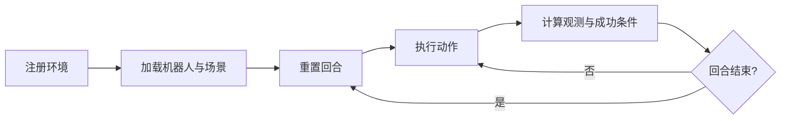

# ManiSkill 自定义任务构建

本节将一个机器人操作目标拆分为 ManiSkill 环境类中的几个必要环节：注册环境、加载场景、初始化回合、计算成功条件，以及按需实现稠密奖励和额外观测。掌握这些接口后，才适合继续进行演示采集或强化学习。

## 任务生命周期



对应到环境类时，最核心的方法如下。

| 接口 | 用途 |
| --- | --- |
| `@register_env` | 注册环境名和默认最大步数 |
| `_load_scene` | 创建地面、机器人以外的物体和传感器 |
| `_initialize_episode` | 为每个并行环境重置位姿并采样随机量 |
| `evaluate` | 返回成功条件和任务诊断指标 |
| `_get_obs_extra` | 向状态观测中增加任务相关信息 |
| `compute_dense_reward` | 为强化学习提供连续奖励，可选 |

## 最小任务骨架

下面的骨架展示了自定义任务的结构。它不包含特定物体的构建细节，需要用当前 ManiSkill 版本提供的 actor builder 和机器人接口补全。

```python
import torch

from mani_skill.envs.sapien_env import BaseEnv
from mani_skill.utils.registration import register_env


@register_env("MyPickTask-v1", max_episode_steps=200)
class MyPickTaskEnv(BaseEnv):
    SUPPORTED_ROBOTS = ["panda"]

    def _load_scene(self, options: dict):
        # Build the table, target object, and goal marker here.
        raise NotImplementedError

    def _initialize_episode(self, env_idx: torch.Tensor, options: dict):
        # Reset only the parallel environments selected by env_idx.
        raise NotImplementedError

    def evaluate(self):
        # Each item is a tensor with one value per parallel environment.
        reached = self._reached_target()
        grasped = self.agent.is_grasping(self.target)
        lifted = self.target.pose.p[:, 2] > self.lift_height
        return {
            "reached": reached,
            "grasped": grasped,
            "lifted": lifted,
            "success": grasped & lifted,
        }
```

`evaluate` 不只返回 `success`。把到达、抓取和抬升分开后，评估时可以定位策略停在哪个阶段，稠密奖励也可以直接复用这些中间量。

## 场景与回合初始化

`_load_scene` 只在环境建立时负责创建对象；`_initialize_episode` 则在每次 `reset` 时更新已存在对象的状态。不要在每个回合中重新构建几何体，否则会破坏并行环境的性能和对象索引。

初始化时还应满足两个约束：

1. 所有随机量都使用环境提供的随机数生成器，使固定种子能够复现相同回合。
2. 使用 `env_idx` 只重置指定子环境，不要修改其他并行回合的状态。

## 成功条件与奖励

成功条件应对应可观测的物理状态，而不是仅检查动作是否执行。例如“拿起物体”至少需要同时验证：

- 夹爪与物体形成有效夹持；
- 物体高度超过阈值；
- 物体在持续数帧中保持抬升状态。

稠密奖励可按“接近—接触—夹持—抬升—保持”分阶段组合。奖励量纲应在并行训练前单独检查，避免某个距离项的数值压过最终成功奖励。

## 注册与验证

将环境模块导入后，先用一个环境检查重置、随机动作和评估输出：

```python
import gymnasium as gym
import my_pick_task  # Registers MyPickTask-v1.

env = gym.make("MyPickTask-v1", num_envs=1, obs_mode="state")
obs, info = env.reset(seed=0)
for _ in range(20):
    obs, reward, terminated, truncated, info = env.step(env.action_space.sample())
env.close()
```

**检查点 1：** 同一种子重置后，目标物体和机器人初始状态应一致。

**检查点 2：** `info` 中应包含 `reached`、`grasped`、`lifted` 和 `success`，且张量第一维与并行环境数相同。

**检查点 3：** 在用随机策略进行的链路检查中，应关注运行时异常、观测形状和成功条件是否可计算，不将随机策略表现当作任务策略成绩。

## 常见问题

- **环境名未注册：** 确认包含环境类的模块已在 `gym.make` 前导入。
- **并行环境重置互相干扰：** 检查 `_initialize_episode` 是否正确使用 `env_idx`。
- **画面正常但始终不成功：** 分别输出接近、夹持和抬升条件，检查阈值、坐标系和接触判定。
- **状态观测缺少任务目标：** 通过 `_get_obs_extra` 提供目标位姿、物体相对位置等信息。

## 参考资料

- [ManiSkill 官方自定义任务教程](https://maniskill.readthedocs.io/en/latest/user_guide/tutorials/custom_tasks/intro.html)
- [ManiSkill 官方快速开始](https://maniskill.readthedocs.io/en/latest/user_guide/getting_started/quickstart.html)
