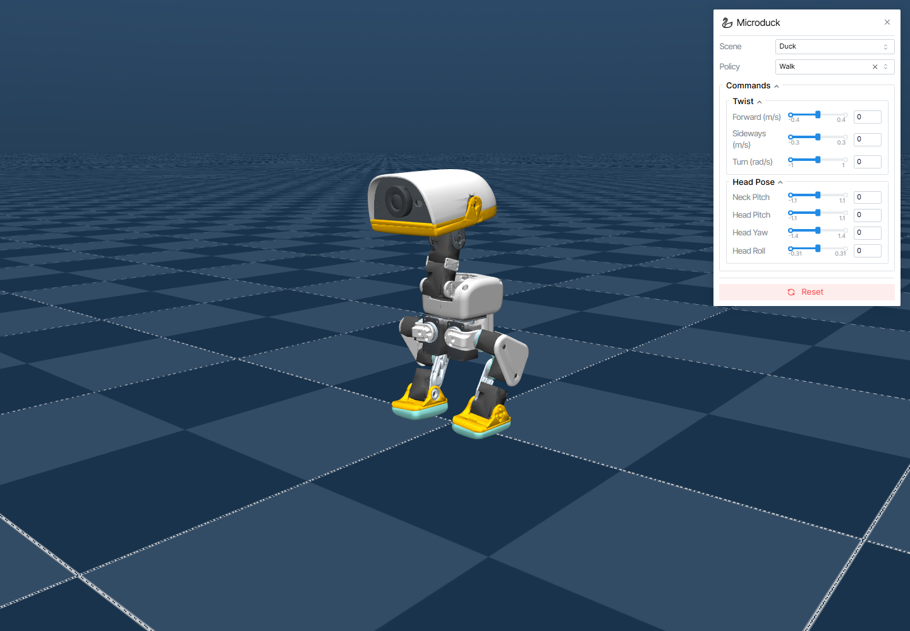
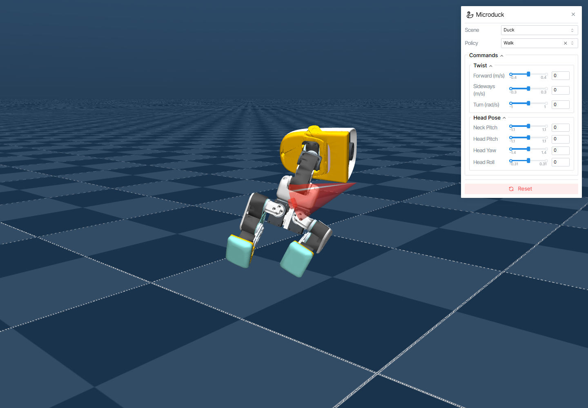
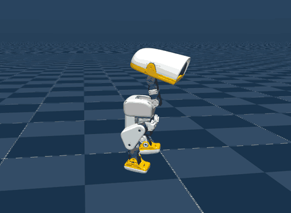
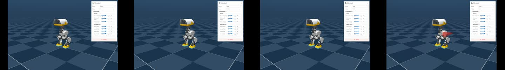

# mjswan + MicroDuck：把策略搬到浏览器里，并用真实物理外力把鸭子甩倒

这一节复现一个很适合公开展示的具身智能小实验：使用官方 mjswan_playground 构建 MicroDuck 的浏览器端 MuJoCo 场景，在浏览器里运行 ONNX 策略控制鸭子，再用鼠标拖拽鸭子的身体，给它施加真实的 MuJoCo 外力。

这里要先把边界说清楚：

- 这不是重新训练 MicroDuck，也不是把一个视频做成可交互的假动画；
- 浏览器端仍然会加载场景、物理引擎、策略模型和控制面板；
- 拖拽时，mjswan 会把指针位移转换成施加在刚体上的力，释放鼠标后由物理引擎继续计算；
- 本节验证的是“策略回放 + 浏览器物理交互 + 静态部署”这条链路，不等于 MicroDuck 真机已经可以安全执行这些动作。

## 1. 这次要跑通什么

最终会得到一个可以通过静态 HTTP 服务打开的网页应用：

1. MuJoCo 模型被压缩成浏览器可加载的场景文件；
2. MicroDuck 的策略被导出为 ONNX；
3. MuJoCo WASM 在浏览器中负责动力学计算；
4. ONNX Runtime Web 负责策略推理；
5. Three.js 负责渲染；
6. 控制面板负责切换场景、策略和速度指令；
7. 鼠标拖拽负责给动态刚体施加外力。

本地复核时，普通回放可以正常显示 MicroDuck；拖拽鸭子以后，画面会出现力箭头，鸭子会因为外力和接触动力学倒下，而不是沿着预先录好的轨迹播放。

图 1：本地构建的 mjswan MicroDuck 浏览器应用，策略控制面板和 MuJoCo 场景均已加载。

图 2：按住鼠标拖拽鸭子时的活动状态。红色箭头表示当前施加的外力，鸭子的姿态变化来自物理仿真。

下面这张动图来自官方 mjswan_playground 项目，用来展示项目原本的浏览器交互效果；上面两张 PNG 则是本次在本地构建并验证得到的截图。

图 3：官方 MicroDuck 浏览器示例。来源：[ttktjmt/mjswan_playground](https://github.com/ttktjmt/mjswan_playground)。

图 4：本地录制的多次人工拖拽示范。视频依次展示右上提拉、左侧推拽和斜向摆动；每次拖拽之间都重置场景，便于比较不同外力方向对姿态和倒地过程的影响。

## 2. 项目和代码入口

| 资源 | 地址 | 作用 |
| --- | --- | --- |
| mjswan 引擎 | [ttktjmt/mjswan](https://github.com/ttktjmt/mjswan) | 将 MuJoCo 模型、控制逻辑和浏览器渲染整合起来 |
| mjswan 文档 | [muwanx.readthedocs.io](https://muwanx.readthedocs.io/) | 安装、示例、构建和浏览器运行说明 |
| mjswan Playground | [ttktjmt/mjswan_playground](https://github.com/ttktjmt/mjswan_playground) | 官方示例项目和构建入口 |
| MicroDuck 示例源码 | [mjswan_playground/microduck](https://github.com/ttktjmt/mjswan_playground/tree/main/src/mjswan_playground/microduck) | MicroDuck 场景、策略和 Builder 配置 |
| MicroDuck 机器人项目 | [pollen-robotics/microduck](https://github.com/pollen-robotics/microduck) | 机器人模型、控制接口和硬件背景 |
| MicroDuck 强化学习环境 | [pollen-robotics/microduck_rl](https://github.com/pollen-robotics/microduck_rl) | 训练环境、策略和部署相关资源 |
| 官方在线预览 | [mjswan.com/s/DOGILsh](https://mjswan.com/s/DOGILsh) | 不安装环境时直接观察官方示例 |

官方 Playground 的 MicroDuck 示例不是一个单独的“视频播放页面”，而是把场景和策略打包成静态网页。构建后的网页不需要 Python 后端来执行每一步仿真，浏览器内的 WASM、ONNX Runtime Web 和 WebGL 会共同完成运行。

## 3. 整体架构

~~~mermaid
graph LR
    A[MicroDuck MJCF / XML 场景] --> B[mjswan_playground Builder]
    C[MicroDuck ONNX policies] --> B
    D[MuJoCo scene assets] --> B
    B --> E[manifest.json]
    B --> F[scene.mjz / model assets]
    B --> G[policy.onnx]
    E --> H[静态 HTTP 服务]
    F --> H
    G --> H
    H --> I[浏览器端 MuJoCo WASM]
    H --> J[ONNX Runtime Web]
    H --> K[Three.js / WebGL]
    I --> L[状态与接触动力学]
    J --> M[14 维动作]
    M --> I
    N[鼠标拖拽] --> O[mjData.xfrc_applied]
    O --> I
    I --> P[下一帧渲染与策略状态]
~~~

### 3.1 构建阶段

构建阶段发生在 Python 环境中。Builder 会收集项目的场景文件、策略文件、资源清单和网页运行时，把它们整理成浏览器可以直接读取的静态目录。

这里的关键产物不是一个新的训练 checkpoint，而是一组运行时文件：

- manifest.json：项目、场景、策略和资源的索引；
- .mjz 或其他场景资源：压缩后的 MuJoCo 模型；
- .onnx：浏览器端策略推理文件；
- .wasm 和 JavaScript：MuJoCo 浏览器运行时；
- index.html、CSS 和前端 bundle：控制面板与渲染入口。

### 3.2 浏览器运行阶段

浏览器打开页面以后，前端读取 manifest.json，选择当前场景和策略，然后加载对应的模型和 ONNX 文件。每一个控制周期大致经过以下流程：

~~~text
读取 MuJoCo 状态
    -> 整理 61 维 observation
    -> ONNX Runtime Web 推理
    -> 得到 14 维 action
    -> 写入 MuJoCo actuator
    -> 计算接触、重力、摩擦和外力
    -> Three.js 渲染下一帧
~~~

鼠标拖拽会插入到物理计算阶段：指针命中一个动态刚体后，拖拽位移会换算为力和力矩，写入 MuJoCo 的外力数组。松开鼠标后，外力被清除，鸭子继续按照当前速度、姿态、接触和策略输出运动。

## 4. 场景、策略和动作接口

### 4.1 官方 MicroDuck 示例包含什么

官方 Playground 的 MicroDuck 入口把多个场景和策略放在同一个浏览器应用里，常见组合如下：

| 场景 | 可观察的策略或动作 | 适合观察什么 |
| --- | --- | --- |
| Duck | Walk、Stand & Pose、Sit / Stand、Ground Pick、Roulade | 行走、站立、坐下、拾取和翻滚 |
| Ball (right foot) | Kick | 右脚踢球 |
| Ball (left foot) | Kick | 左脚踢球 |
| Rollers | Roller Skate、Roller Crouch | 滑轮状态下的姿态和动作 |

不同版本的前端菜单文字可能略有变化。以页面实际列出的场景和策略为准，不要把菜单里的 Scene 和 Policy 当成两个完全独立的机器人：有些策略只在对应场景里有意义。

### 4.2 61 维输入和 14 维动作

MicroDuck 的策略接口延续了官方机器人控制约定。浏览器端示例中的策略通常读取 61 维 observation，并输出 14 维关节动作：

| observation 内容 | 维度 |
| --- | ---: |
| 身体角速度或陀螺仪信息 | 3 |
| 身体坐标系中的重力投影 | 3 |
| 14 个关节位置 | 14 |
| 14 个关节速度 | 14 |
| 上一时刻动作 | 14 |
| 前向、横向和偏航速度指令 | 3 |
| 其余 embodiment command / padding | 10 |
| 合计 | 61 |

这里最容易被忽略的是动作接口。输出的 14 维向量并不是“直接给网页模型的 XYZ 位置”，而是和 MicroDuck 的关节顺序、动作缩放和 position actuator 定义绑定。换机器人、换关节顺序或换动作范围以后，不能只保留一个 ONNX 文件就认为策略仍然兼容。

本地检查的策略文件均能被 ONNX checker 正常读取，策略的 observation/action 形状符合 61 -> 14 契约。这个检查只能说明文件格式和接口正确，不能说明策略在新的机器人或新的物理参数上仍然有效。

### 4.3 浏览器示例与训练环境的区别

MicroDuck 的公开训练资源和浏览器部署资源不是完全同一层：

- 训练时可以使用更复杂的 actuator、随机化、课程学习和训练专用观测；
- 浏览器端需要把模型转换为 WASM 和 ONNX 能够执行的静态资源；
- 浏览器里看到的是导出后的 actor 和运行时场景；
- privileged critic、训练日志、并行环境和 PPO 更新不会在这个页面中运行。

因此，mjswan 适合验证“训练好的策略能否被打包并交互式展示”，不适合替代原始 RL 环境做大规模训练。

## 5. 物理拖拽是怎么工作的

### 5.1 它不是动作策略学出来的甩动

浏览器中拖拽鸭子时，红色箭头和倒地效果很容易让人误以为策略学会了“被人甩倒后恢复”。实际链路是：

1. 鼠标射线命中一个可动态运动的刚体；
2. 前端记录命中点相对于刚体的位置；
3. 拖拽过程中的指针位移被换算成力和力矩；
4. 力写入 MuJoCo 的 mjData.xfrc_applied；
5. MuJoCo 根据质量、惯量、重力、接触和摩擦计算下一步；
6. 页面把当前受力和身体姿态渲染出来。

这是一种 engine-level perturbation，也就是引擎级物理扰动，不是神经网络动作头生成的动作。这个区别很重要：

- 它可以用来测试策略受到外界冲击后的行为；
- 它可以用来制作很直观的浏览器教学演示；
- 它不能单独证明策略具有摔倒恢复能力；
- 真正研究恢复动作，还需要在训练环境中加入外力扰动、恢复奖励和独立测试集。

### 5.2 和我们已有 MicroDuck 任务的关系

我们之前整理的 MicroDuck 篮球平衡任务关注的是自由滚动篮球上的平衡和运动控制；本节的 mjswan 示例关注的是浏览器部署和物理交互。两者可以互相补充，但不要混写：

- 篮球平衡：重点是 RL 任务、接触奖励、LSTM actor、PPO 和 sim-to-real 边界；
- mjswan：重点是 MuJoCo 模型如何进入浏览器、ONNX 如何执行、鼠标外力如何进入物理引擎；
- mjswan 的右脚/左脚踢球场景可以作为网页端踢球展示的参考；
- 要实现我们自己的球门、连续追球、3v3 阵型和符合电机约束的真机策略，仍然需要单独修改场景、策略和部署接口。

## 6. 环境准备

### 6.1 推荐环境

官方仓库的主开发环境是 macOS Apple Silicon 或 Linux x86-64。Windows 用户建议使用 WSL2；如果只想观察已经构建好的网页，浏览器本身不要求本机安装 MuJoCo。

需要准备：

- Git；
- uv；
- 支持 WebGL、WebAssembly 和 Web Workers 的现代浏览器；
- 能够访问 GitHub 的网络环境；
- 足够的磁盘空间存放 Python 环境、前端 bundle 和场景资源。

### 6.2 拉取官方 Playground

在终端中执行：

~~~bash
git clone https://github.com/ttktjmt/mjswan_playground.git
cd mjswan_playground
uv sync --all-extras
~~~

安装完成后，先列出官方示例：

~~~bash
uv run msp list
~~~

正常情况下可以看到 microduck、husky、pacman 和 wbc 等示例。

## 7. 构建和启动 MicroDuck

### 7.1 直接使用官方命令

在 mjswan_playground 根目录中构建 MicroDuck：

~~~bash
uv run msp build microduck --output-dir dist/microduck
~~~

构建成功后，dist/microduck 是一个静态网站目录。不要直接双击 index.html：浏览器会限制模块脚本、WASM 和 worker 的加载，页面可能看起来是黑屏或只显示 Loading。

官方 Playground 也提供直接运行示例的入口：

~~~bash
uv run msp run microduck --port 8092
~~~

如果命令自动获取上游仓库或 GitHub 资产时长时间没有进展，先检查网络和 Git 凭据。也可以按照 src/mjswan_playground/microduck/main.py 中锁定的版本手动下载源码归档，再使用同一套 Builder；不要把整个 Python 缓存目录复制进教程仓库。

### 7.2 使用本节提供的静态服务器

Windows 环境里，某些 Python 版本会把 .js 当作 text/plain 返回，浏览器会报：

~~~text
Expected a JavaScript-or-Wasm module script but the server responded with a MIME type of text/plain
~~~

本节提供的 serve_mjswan.py 会补齐常见 JavaScript、WASM、JSON、ONNX 和 MuJoCo 资源的 MIME 类型，并设置浏览器多线程 WASM 常用的响应头。构建完成后，在本教程目录执行：

~~~bash
python serve_mjswan.py --directory PATH/TO/dist/microduck --port 8092
~~~

然后访问：

~~~text
http://127.0.0.1:8092/
~~~

如果路径包含空格，请给 --directory 的值加引号。服务器只用于本地教学验证，不要把它直接暴露到公网。

### 7.3 自动录制多次拖拽

本节的 record_mjswan_drag_demo.py 使用 Playwright 打开已经运行的网页，自动执行三种拖拽方向，并把原始录制保存为 WebM。它适合重新生成图 4，也方便后续增加新的拖拽动作：

~~~bash
uv run python record_mjswan_drag_demo.py \
  --url http://127.0.0.1:8092/ \
  --output-dir recordings
~~~

录制完成后，可以用 FFmpeg 转成网页和论坛更容易播放的 MP4：

~~~bash
ffmpeg -i recordings/mjswan_microduck_manual_drag_demo.webm \
  -c:v libx264 -pix_fmt yuv420p -movflags +faststart \
  recordings/mjswan_microduck_manual_drag_demo.mp4
~~~

脚本只录制网页视口，不会录入本机地址栏、桌面或其他窗口；视频中的箭头和倒地来自浏览器端 MuJoCo 物理交互。

## 8. 浏览器操作步骤

### Checkpoint 1：基础场景加载

打开页面后，先选择 Duck 场景和 Walk 策略。第一次加载通常需要等待浏览器下载 WASM、场景和 ONNX 文件，页面上的 Loading scene... 消失后再操作控制面板。

此时应该能看到：

- MicroDuck 模型；
- MuJoCo 网格和碰撞场景；
- Scene / Policy / Commands 控制区；
- 速度指令或动作控制滑块；
- 浏览器控制台没有资源 404。

Checkpoint 1 只能说明静态资源、WASM 和渲染链路已经启动，不能说明每个策略都已评测。

### Checkpoint 2：策略回放

提高 Forward 指令，观察鸭子的行走动作。点击 Reset 后再次运行，用来确认 episode reset 会恢复初始状态。

建议依次观察：

1. Duck + Walk：基础行走；
2. Duck + Stand & Pose：站立和姿态动作；
3. Duck + Sit / Stand：坐下和起立；
4. Ball (right foot) + Kick：右脚踢球；
5. Ball (left foot) + Kick：左脚踢球；
6. Rollers：滑轮场景。

不同浏览器、设备和帧率下，策略动作速度可能不同。网页端的运行效果主要用于理解调用链和交互方式，不应直接拿来做定量控制频率结论。

### Checkpoint 3：物理拖拽

切回 Duck 场景，按住鸭子身体并拖动。正常现象包括：

- 拖拽过程中出现力箭头；
- 鸭子的身体姿态发生变化；
- 脚、地面和身体之间仍然按照碰撞和摩擦计算；
- 松开鼠标后，拖拽外力消失；
- 点击 Reset 可以恢复干净的初始状态。

如果拖到了地面网格却没有反应，先把鼠标移动到鸭子身体或腿部的实体模型上。只有命中动态刚体，拖拽才会形成有效的外力。

## 9. 本次本地复核记录

本次没有只停留在阅读项目页，而是按官方源码和 Builder 实际构建了 MicroDuck 静态应用，并使用浏览器做了 smoke test。

| 检查项 | 结果 |
| --- | --- |
| 官方 Playground 环境同步 | 通过，mjswan 0.9.4 |
| 示例列表 | 通过，msp list 可列出 MicroDuck |
| MicroDuck Builder | 通过，生成 manifest.json、场景资源和策略资源 |
| ONNX 文件检查 | 通过，构建目录中的 26 个 ONNX 文件可被 checker 读取 |
| 浏览器 HTTP 服务 | 通过，静态资源返回状态 200 |
| WebGL canvas | 通过，页面检测到 1 个 canvas |
| 页面错误 | 0 个 JavaScript page error |
| 拖拽物理测试 | 通过，出现力箭头并观察到鸭子受力倒地 |

这份记录证明的是构建和交互链路可用，不是训练收敛指标，也不是官方 benchmark。为了让读者能够分辨证据来源，本教程的两张 PNG 都是本地截图，官方动图则单独标注为官方素材。

## 10. 常见问题

### 10.1 页面全黑或一直 Loading

先打开浏览器开发者工具的 Network 面板，检查 .js、.wasm、.mjz 和 .onnx 是否返回 200。然后确认：

- 页面是通过 HTTP 服务打开，而不是 file://；
- 静态服务器没有把 .js 返回为 text/plain；
- 服务器没有把大文件截断；
- 设备浏览器允许 WebGL 和 WebAssembly；
- 首次加载时耐心等待完整资源下载。

### 10.2 只有模型，没有动作

检查 manifest.json 中的策略路径，以及浏览器控制台中的 ONNX Runtime 报错。最常见原因是模型文件路径错误、跨域响应头缺失，或者页面加载的是另一套场景的 policy。

### 10.3 拖拽没有力箭头

拖拽点可能命中了静态地面，也可能当前场景没有可拖拽的动态 body。切换到 Duck 场景，把指针放到鸭子的身体、头部或腿部实体上，再按住并移动。

### 10.4 Windows 上 uv run pytest 出现编码错误

上游部分测试会直接用默认编码读取源文件。Windows 中文代码页下如果出现 UnicodeDecodeError，先设置：

~~~powershell
$env:PYTHONUTF8 = "1"
uv run pytest -q
~~~

如果仍然失败，要区分“测试脚本的默认编码问题”和“浏览器运行失败”。本次浏览器 HTTP、WebGL、ONNX 加载和物理拖拽均已单独验证，不把 Windows 测试编码问题误判成 mjswan 引擎问题。

### 10.5 GitHub 下载很慢

官方 Builder 需要获取依赖仓库或模型资产时，网络质量会直接影响首次构建。建议：

1. 先执行 uv sync --all-extras，确认 Python 依赖完成；
2. 使用官方仓库的固定 commit 下载源码归档；
3. 将大缓存放在仓库外；
4. 不要把 .cache、虚拟环境或完整构建目录提交到 Every Embodied。

## 11. 复现边界和后续改造

### 11.1 这次确实跑通了什么

- MicroDuck 的浏览器端静态应用可以被构建；
- 场景和 ONNX 策略可以由浏览器读取；
- MuJoCo WASM 能够执行动力学；
- 策略回放和网页控制面板可以工作；
- 鼠标外力会进入物理计算，并产生可观察的姿态变化。

### 11.2 这次没有证明什么

- 没有重新训练 MicroDuck policy；
- 没有证明浏览器策略可以直接部署到 RDK X5；
- 没有证明网页端的动作频率等于真实舵机控制频率；
- 没有证明右脚/左脚踢球策略能自动追球、连续踢球或精准射门；
- 没有证明被拖倒以后策略具备学习到的恢复能力；
- 没有把官方 3D 模型和完整训练资产重新打包发布。

如果后续要把这个例子接到我们的鸭子足球线，合理的改造顺序是：

1. 先保留 mjswan 的浏览器物理和控制面板；
2. 加入自定义球门、球场边界和球的碰撞材质；
3. 将球检测、接近、对准和踢球拆成可观察的状态机；
4. 再把训练得到的 policy 导出为浏览器可用的 ONNX；
5. 通过同一套动作接口接到 RDK X5 控制端；
6. 最后再做多鸭子、3v3 和真实电机约束验证。

这样可以把“浏览器展示”和“机器人控制策略”分成两个清楚的层次：网页先负责可视化和交互验证，RDK 再负责真实执行与安全限幅。

## 12. 许可证和素材使用

mjswan 和 mjswan Playground 的代码入口以各自仓库中的许可证为准；MicroDuck 代码和策略资源也应按照上游仓库的许可证使用。MicroDuck 的 3D 模型资产存在单独的非商业署名许可限制，公开教程时应保留来源和许可证说明，不要把本地构建目录中的全部资源直接当作 Every Embodied 自有资产重新发布。

本节只提交：

- 学习者可以阅读的教程文字；
- 小尺寸的本地验证截图；
- 官方公开示例的本地归档副本和来源说明；
- 可复用的静态服务器脚本。

不提交浏览器构建产生的完整 WASM、ONNX、场景包、缓存和虚拟环境。需要完整运行包时，请按照上游仓库和官方构建命令重新生成。

## 13. 参考资料

- [mjswan GitHub](https://github.com/ttktjmt/mjswan)
- [mjswan 文档：Installation](https://muwanx.readthedocs.io/en/latest/getting-started/installation/)
- [mjswan 文档：Examples](https://muwanx.readthedocs.io/en/latest/getting-started/examples/)
- [mjswan Playground](https://github.com/ttktjmt/mjswan_playground)
- [MicroDuck Playground 源码](https://github.com/ttktjmt/mjswan_playground/tree/main/src/mjswan_playground/microduck)
- [Pollen Robotics MicroDuck](https://github.com/pollen-robotics/microduck)
- [Pollen Robotics MicroDuck RL](https://github.com/pollen-robotics/microduck_rl)
- [MuJoCo](https://github.com/google-deepmind/mujoco)
