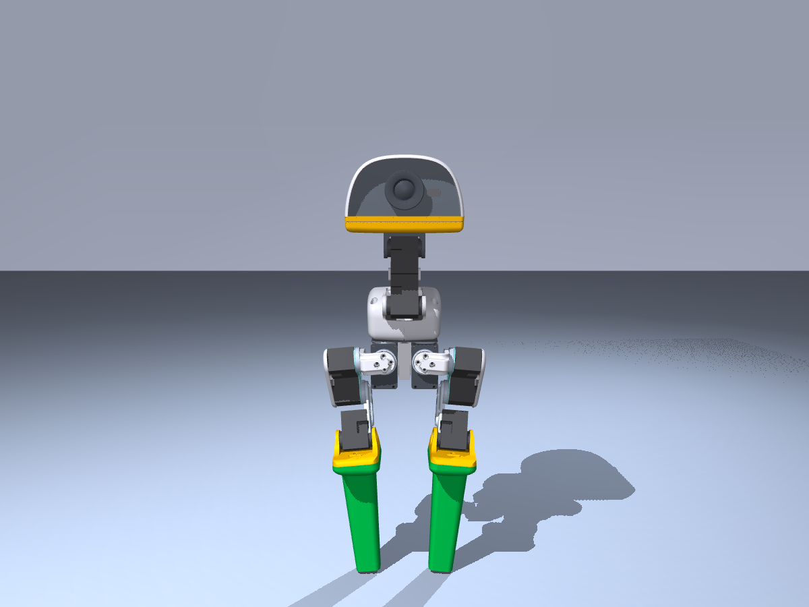
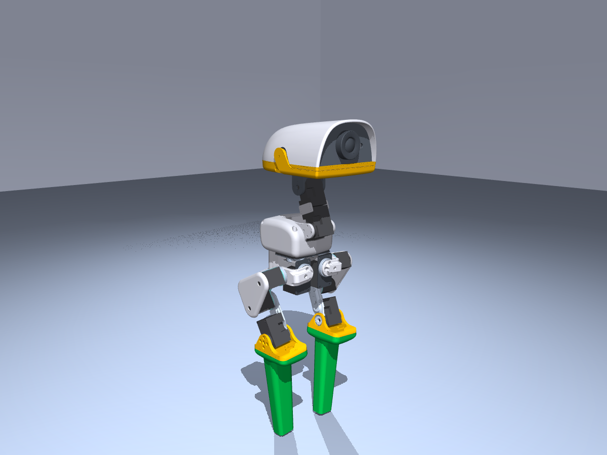
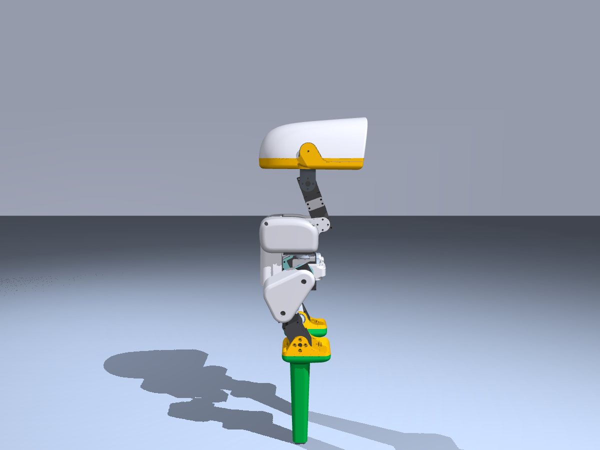
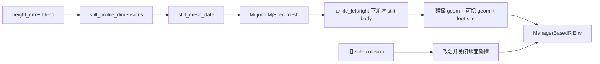
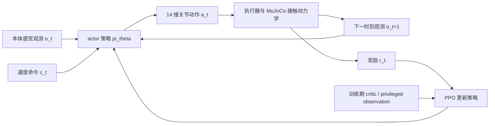
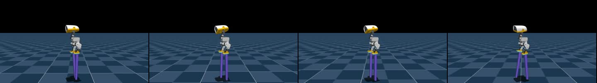
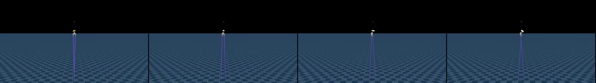
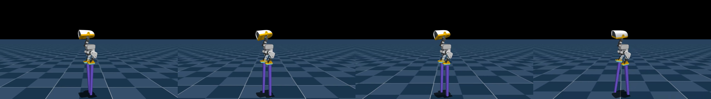
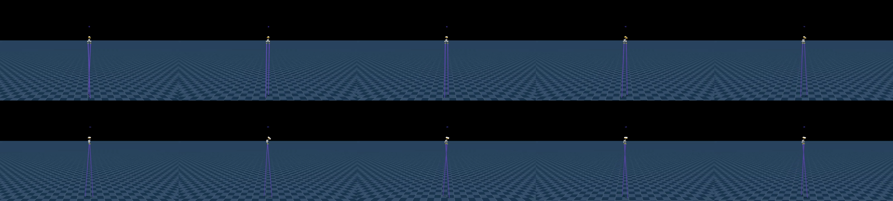

# MicroDuck 高跷行走：从逐级课程学习到 2 m 仿真复现

## 这一节完成什么

最近一段 MicroDuck 视频展示了一个很有意思的运动控制实验：给双足小鸭子安装越来越高的高跷，让它从普通的低高度支撑开始，逐级学习在 10 cm、50 cm，直到约 2 m 的高跷上交替迈步。这个实验真正值得学习的地方，不是把鸭子的腿在画面里拉长，而是把高跷作为新的接触几何、质量和惯性显式加入 MuJoCo，再用强化学习逐阶段提高形态难度。

本节复现的是公开的 **MicroDuck stilt walking** 版本，完成以下内容：

1. 读懂高跷结构、接触几何和机器人形态是怎样进入仿真器的；
2. 理解 `Mjlab-Stilt-Flat-MicroDuck` 的观测、动作、奖励和课程学习设计；
3. 下载公开的 25 cm 和 2 m 策略，在本地 MuJoCo 中完成 ONNX 推理和视频渲染；
4. 了解如何从公开 checkpoint 继续训练，以及为什么不能把 2 m 仿真结果直接当成真机方案；
5. 将这个案例和前面的 MicroDuck 篮球平衡、mjswan 浏览器物理扰动放在同一条运动控制学习路径中。

> **复现边界**：本节使用公开 checkpoint 做策略回放和视频渲染，不重新跑完整的 2 m PPO 训练。公开模型卡明确把这些策略标记为 simulation-only；视频中的高跷也没有经过真机验证。想做真机迁移，必须重新检查结构承载、重心、舵机扭矩、跌倒保护和控制频率。

## 1. 从视频现象回到真实问题

视频里看起来只是“鸭子穿上了高跷”，但对控制器而言，系统同时发生了四类变化：

- **支撑点变化**：脚底原来的接触面不再负责承重，真正接触地面的是高跷末端；
- **支撑多边形变化**：高跷的末端更窄，脚掌滚动、侧向偏移和落脚误差都会变得更敏感；
- **质量和惯量变化**：高跷越高，附加质量越大，腿部摆动时的转动惯量和倒地力矩也会改变；
- **机器人高度变化**：相同的身体姿态会对应不同的脚端高度，重置位置、摄像机距离和接触传感器都需要同步调整。

如果只把地面下移，或者把渲染模型的腿拉长而保留旧脚底碰撞，策略学到的仍然是原来的平地走路问题，并没有学会“在高杠杆支撑上保持平衡”。这个项目的核心做法是：在 MuJoCo 的机器人描述中增加显式高跷 body、mesh、质量、碰撞 geom 和 foot site，同时关闭原脚底的地面碰撞。

## 2. 官方实现和本地复刻资产

| 资源 | 用途 |
| :--- | :--- |
| [MicroDuck stilt policy collection](https://huggingface.co/HannesVonEssen/microduck-stilts) | 10 cm 到 2 m 的 ONNX、manifest、checkpoint 和官方 rollout 视频 |
| [MicroDuck Playground](https://github.com/Vottivott/microduck-playground) | 训练环境、MuJoCo 形态、PPO 入口、评估和导出脚本 |
| [对应固定版本 `c5fcc50`](https://github.com/Vottivott/microduck-playground/tree/c5fcc50219fef01ac9931d0079c583ccbb29b689) | 本节复现所用的源码版本，避免上游后续提交造成配置漂移 |
| [高跷硬件目录](https://github.com/Vottivott/microduck-playground/tree/c5fcc50219fef01ac9931d0079c583ccbb29b689/hardware/stilts) | 参数化 STL、渲染图、打印和结构安全说明 |
| [MicroDuck 原始机器人项目](https://github.com/pollen-robotics/microduck) | 机器人本体、舵机和硬件背景 |
| [MicroDuck 强化学习环境](https://github.com/pollen-robotics/microduck_rl) | 上游 mjlab / MuJoCo Warp / PPO 训练基础 |
| [原始视频号分享](https://weixin.qq.com/sph/AOgguA2tn7) | 本节选题和效果参考；教程中的视频是本地按公开策略重新渲染的结果 |

本地复刻只把小体积的教学证据放进教程：官方高跷渲染图、25 cm 本地 rollout、2 m 本地 rollout和视频抽帧图。模型权重、Python 虚拟环境、MuJoCo 缓存和完整外部仓库仍然放在教程仓库之外，读者按照下面的固定版本和下载命令获取。

## 3. 先看硬件结构：为什么同一个安装接口可以换不同高度

官方设计没有修改 MicroDuck 本体，而是把原来的可拆卸鞋底变成一个可替换 carrier，再把不同高度的 stilt cartridge 用螺钉固定到 carrier 上。这样做有两个好处：

1. 机器人本体、舵机和关节零位不需要因为每个高度重新设计；
2. 训练时可以把“高度”和“支撑形状”拆成两个课程轴，避免一次同时改变太多物理因素。

<table>
  <tr>
    <td align="center"><br><sub>正面</sub></td>
    <td align="center"><br><sub>三分之四视角</sub></td>
    <td align="center"><br><sub>侧面</sub></td>
    <td align="center"><br><sub>打印原型</sub></td>
  </tr>
</table>

**图 1：**同一安装接口下的 MicroDuck 高跷结构。渲染图和打印原型来自官方 Playground 的 `hardware/stilts` 目录；它们说明了结构概念，不等于已经通过真机承载测试。

高跷支持形状由 `blend` 参数控制：`blend=0` 接近 22 mm × 32 mm 的圆角平台，`blend=1` 接近 12 mm 圆形窄支撑，公开策略使用 `blend=0.5`，对应约 17 mm × 22 mm 的末端。高度则单独用 `MICRODUCK_STILT_HEIGHT_CM` 控制。

质量遵循公开实现中的简单审计模型：

```text
每根高跷质量 = 0.012 kg + 0.001 kg/cm × 高跷高度
```

例如，25 cm 版本的名义质量是 37 g/根，2 m 版本是 212 g/根。这个公式是仿真训练的形态参数，不是打印件的实际称重结果；打印材料、填充率、螺钉、橡胶脚垫和结构加强都会改变真实质量。

## 4. 方法拆解：高跷策略到底训练了什么

### 4.1 形态编译：把高跷加入 MuJoCo，而不是只改画面

核心代码在：

```text
src/mjlab_microduck/robot/stilt_constants.py
src/mjlab_microduck/tasks/microduck_stilt_env_cfg.py
```

`stilt_constants.py` 的主要数据流如下：



代码中的关键动作可以概括为：

1. 计算底部支撑环和顶部安装环，生成高跷的凸形 mesh；
2. 把 mesh 作为 MuJoCo 资产加入 robot `MjSpec`；
3. 把原来的左右脚碰撞 geom 改名为 `*_original_sole_disabled`；
4. 在左右脚踝下增加 `stilt_left` 和 `stilt_right` body；
5. 分别增加承重碰撞 geom、紫色可视 geom 和新的脚端 site；
6. 把 foot-contact、foot-height 和 slip 等观测/奖励关联到新的末端位置。

这一步决定了策略究竟面对什么问题。高跷末端的碰撞几何、接触摩擦和高度被送入物理仿真，策略才会因为落脚偏差、身体倾斜和摆腿时的力矩变化受到真实反馈。

### 4.2 课程学习：先缩支撑，再升高度

公开训练记录不是“随机把高跷高度调到 2 m 然后训练一次”，而是一条连续的 checkpoint 迁移链：

| 里程碑 | 高度 | 支撑 blend | 作用 |
| :---: | ---: | ---: | :--- |
| 400 | 2 cm | 0.00 | 宽平台上先学会稳定站立和行走 |
| 500 | 2 cm | 0.25 | 开始收窄支撑形状 |
| 600 | 2 cm | 0.50 | 选定公开策略的约 17 mm × 22 mm 末端 |
| 700–800 | 3–4 cm | 0.50 | 早期高度过渡 |
| 2,000 | 5 cm | 0.50 | 巩固交替步态 |
| 2,100–2,800 | 7.5–25 cm | 0.50 | 以较小高度步长继续上升 |
| 2,900–3,400 | 27.5–50 cm | 0.50 | 扩大高度步长 |
| 3,500–4,200 | 55 cm–1.2 m | 0.50 | 进入极端仿真高度 |
| 4,300 | 1.4 m | 0.50 | 发布的高高度里程碑 |
| 4,600–6,000 | 1.5–1.9 m | 0.50 | 为 2 m 做连续桥接 |
| 6,500 | 2.0 m | 0.50 | 公开的仿真上限策略 |

这种课程的关键是每个阶段只让一个主要变量变难：支撑形状收窄以后先保持高度不变；支撑形状稳定以后再逐步提高高跷。这样，失败时可以判断是“脚底太窄”还是“高度带来的力矩过大”，而不是面对无法归因的混合变化。

### 4.3 PPO、观测和动作接口

策略仍然沿用 MicroDuck 速度控制任务的接口：

| 项目 | 公开约定 |
| :--- | :--- |
| actor observation | `float32 [1, 61]` |
| action | `float32 [1, 14]` |
| 控制频率 | 50 Hz |
| action scale | 以 MicroDuck HOME joint pose 为中心，缩放为 1.0 rad |
| command | `twist=[0.15, 0, 0]`，头部/身体命令为 0 |
| 归一化 | 已经烘焙进每个 ONNX 文件 |
| 算法 | PPO，通过 `rsl_rl` 和 `mjlab` 训练 |

actor 看到的是本体感觉和命令，包括角速度、投影重力、关节位置/速度、上一时刻动作以及速度命令。训练时 critic 还可以使用更完整的 privileged observation，帮助 PPO 估计价值；部署时只需要 actor 的 61 维输入。

这里要特别注意：不同高度的策略不是一个“高度参数可自由外推”的通用 ONNX。每个目录的 `policy.onnx` 都和对应的高跷高度、质量、支撑形状绑定。25 cm 的策略应该搭配 25 cm 的形态，不能拿 2 m 的 STL 或 2 m 的 MuJoCo 几何直接套 25 cm policy。

### 4.4 导出的 checkpoint 不是完整原始 PPO 状态

Hugging Face 中的 `checkpoint.pt` 可以用来继续训练，但公开说明已经明确：原始高跷训练的 critic 和 optimizer snapshot 没有保留。发布的 checkpoint 是：

- 与发布 ONNX actor 精确对应的 actor 权重和观测归一化；
- 一个形状兼容但新建的 critic；
- 清空的 optimizer moments；
- 保守的 `1e-5` learning rate 和 `0.1` exploration standard deviation；
- 对应发布迭代号和课程计数。

因此，继续训练属于 **actor-exact warm start**，不是从原始 PPO 训练中断点逐 bit 续跑。教程里复现的是公开 actor 行为，不能把它描述为“拿到了作者完整训练状态”。

## 5. 从控制角度看：鸭子到底学会了什么

前面的结构、checkpoint 和视频，回答的是“这个项目有什么”。这一节回答更重要的问题：**鸭子到底是怎样从反复试错中学会走高跷的？**

如果只把它写成“下载一个模型，运行一条命令，得到一段视频”，读者很容易误以为这是一段预先录好的动作，或者是把左右脚的关节角度按时间播放出来。实际情况并不是这样。高跷策略是一个部署时持续接收本体感觉、持续输出关节动作的**闭环控制器**；视频只是这个控制器和 MuJoCo 物理世界交互后的结果。

### 5.1 先把问题写成一个控制闭环

在时刻 $t$，策略接收观测 $o_t$ 和速度命令 $c_t$，输出动作 $a_t$：

$$
a_t = \pi_\theta(o_t, c_t)
$$

动作经过关节执行器和接触动力学后，得到下一时刻状态：

$$
s_{t+1} = F(s_t, a_t, \text{contact}, \text{friction}, \text{mass}, \text{inertia})
$$

环境根据这一小段运动是否更接近目标，返回奖励 $r_t$。下一次控制又从新的观测开始。于是训练和部署都可以理解为下面这条链路：



这里有三个容易被忽略的点：

1. **策略不是一次性规划完整步态。** 它每 50 Hz 重新看一次身体状态，再决定下一小步怎么调节关节。
2. **动作不是“让脚移动到某个画面位置”。** 公开 actor 输出的是 14 个关节位置偏移，后面还要经过执行器模型才会变成真实的关节力矩和运动。
3. **奖励不是人工写好的动作标签。** 没有人告诉它“这一帧左脚抬多高、下一帧右脚迈多远”；策略通过奖励知道什么样的运动更稳定、更接近前进命令。

因此，教程里生成的视频不是离线动画，而是一个策略在当前高跷几何、质量、摩擦和碰撞条件下，实时闭环控制出来的轨迹。

### 5.2 61 维观测和 14 维动作分别表示什么

公开策略的运行接口是 `observation: [1, 61] -> action: [1, 14]`。可以把 61 维观测按功能拆成：

| 观测块 | 维度 | 它告诉策略什么 |
| :--- | :---: | :--- |
| 机体角速度 | 3 | 鸭子正在向哪个方向、以多快的速度旋转 |
| 投影重力 | 3 | 重力方向在机体坐标系中的投影，可用来判断身体是否倾斜 |
| 14 个关节位置 | 14 | 当前腿部和身体关节处在什么姿态 |
| 14 个关节速度 | 14 | 各关节正在向哪个方向运动、运动有多快 |
| 上一时刻动作 | 14 | 让策略知道自己刚才发出了什么控制，避免动作跳变 |
| 速度命令 | 3 | 期望的前进、侧向和转向速度 |
| 头部与身体相关状态 | 4 + 6 | 保持和任务接口一致的局部状态量 |

这组输入里没有相机图像，也没有足球、球门或高跷顶部的视觉标记。所以这份策略学到的是**本体感觉运动控制**，不是视觉导航，也不是足球策略。它知道自己的身体正在倾斜、脚是否在动、关节是否接近极限，但不知道场景里出现了什么物体。

输出的 14 维动作也要正确理解。它们是围绕 MicroDuck `HOME` 姿态的关节位置偏移，经过 `action scale=1.0 rad` 的缩放后送入执行器。它不是 14 个独立的“脚步标签”，更不是直接指定机器人在世界坐标中的位置。高跷的长度、质量和接触面最终会改变同一个动作带来的物理结果。

### 5.3 鸭子是怎样学出交替步态的

从控制角度看，一次看起来很简单的“走一步”，至少包含下面几个相互耦合的行为：

1. **先把重心放到当前支撑侧。** 如果两只高跷都承重，策略需要先让身体的投影重心落在仍然接触地面的那一侧附近。
2. **抬起摆动侧。** 摆动侧不能只是抬脚，还要控制腿部姿态和身体角速度，避免抬脚时把身体一起带倒。
3. **把高跷放回可承重的位置。** 过早落地会打滑，过晚落地会失去支撑；高跷越长，落点误差造成的姿态变化通常越明显。
4. **接触后迅速修正。** 接触冲击会改变身体角速度，下一次观测中的投影重力、角速度和关节反馈会把这个变化传给 actor。
5. **重复左右支撑交换。** 当一侧重新稳定后，策略才有机会把负载转移到另一侧。

这不是代码里写死的“左脚、右脚、左脚、右脚”脚本。交替步态来自几个因素共同作用：

- 左右腿结构具有近似对称性；
- 速度跟踪奖励鼓励身体向命令方向前进；
- 足端离地时间和抬脚高度相关奖励，鼓励产生真正的摆动；
- 足端滑移、动作变化率、自碰撞和关节极限惩罚，抑制拖脚、抖动和危险姿态；
- MuJoCo 的接触、摩擦、质量和惯性决定了每次动作的真实后果。

换句话说，策略并没有背下一段视频，而是在物理反馈中逐渐发现：**先稳定支撑，再交换支撑，落地后再修正**，比两只脚同时乱动更容易获得长期奖励。这就是“学会走路”在这个项目里的核心含义。

### 5.4 奖励、critic 和 PPO 各自负责什么

可以把训练期的三个角色分开理解：

| 组件 | 作用 | 部署时是否需要 |
| :--- | :--- | :---: |
| actor $\pi_\theta$ | 根据观测输出下一步关节动作 | 需要 |
| reward | 评价这一步是否更快、更稳、更符合约束 | 不需要 |
| critic $V_\phi$ | 估计当前状态长期还有多大成功机会，帮助 PPO 判断动作好坏 | 通常不需要 |

高跷任务中的奖励重点不是“像某一帧示范视频”，而是对控制结果进行组合评价。公开配置可以概括为：

- 速度和角速度跟踪：有没有按照命令前进、转向；
- 身体姿态和角速度：有没有保持直立，是否出现剧烈摇摆；
- 足端离地、抬脚和空中时间：是否真的形成可行的步态；
- 足端滑移、自碰撞、关节极限：是否出现拖地、撞击或危险姿态；
- 动作变化率和能量相关约束：是否通过高频抖动“投机”获得短期前进。

训练时，critic 可以看到比 actor 更完整的 privileged information，例如仿真状态和接触相关信息，用来更准确地估计“从这个状态继续走下去会不会成功”。这不等于部署时把答案泄漏给了机器人：真正运行在 actor 里的仍然是 61 维本体感觉接口。

PPO 的直观过程是：让旧策略采样许多轨迹，计算每个动作相对于预期的优势 $A_t$，再用裁剪后的概率比更新策略：

$$
L^{\mathrm{CLIP}}(\theta)
=
\mathbb{E}_t\left[
\min\left(
r_t(\theta)A_t,\,
\operatorname{clip}(r_t(\theta),1-\epsilon,1+\epsilon)A_t
\right)
\right]
$$

裁剪的意义是限制单次更新幅度，避免策略因为一批偶然的成功或失败突然改变太多。对高跷这种接触敏感任务来说，稳定的小步更新比激进地改策略更重要。

### 5.5 为什么要做形态课程学习

直接让随机策略在 2 m 高跷上学走路，问题不只是“难一点”，而是探索初期几乎每次都会快速失去支撑，奖励信号很稀疏，策略很难知道应该先改哪一个关节。课程学习把一个极难的问题拆成几个连续的安全台阶：

1. 先在短高跷或接近平面支撑的形态上学会基本速度控制；
2. 再逐步缩小支撑形状、增加摆动和接触的敏感性；
3. 最后逐级提高高跷高度，让已经会走的 actor 适应更大的力臂、质量和姿态变化；
4. 每一级都可以作为下一级的初始化，而不是从完全随机策略重新开始。

所以这里的课程不是“给模型作弊答案”，而是改变任务难度，让奖励和物理反馈在训练早期足够有用。公开发布的 10 cm、25 cm、50 cm、1 m、2 m 等策略应理解为不同课程阶段的专用策略，而不是一个可以任意输入高度、自动保证稳定的通用模型。

### 5.6 这份策略学会了什么，又没有学会什么

**它学会了：**

- 在给定高跷形态和摩擦条件下，按照低速命令维持身体稳定；
- 通过左右支撑交换产生交替步态；
- 根据角速度、重力方向和关节反馈修正落地后的姿态；
- 在训练中见过的一定范围内，适应接触扰动、质量变化和动作噪声。

**它没有学会：**

- 通过摄像头识别足球、球门或障碍物；
- 规划“走到球前、对准、踢球、恢复”的长时序任务；
- 看到任意新高度后自动推导出可靠的高跷策略；
- 证明 2 m 结构可以直接打印、装配并安全承载真实 MicroDuck；
- 替代真机上的电机限位、急停、低层控制和人工安全检查。

这组边界很重要。它说明了为什么高跷策略适合作为运动控制和强化学习教程，也说明了它不能直接代替我们之前做的足球视觉、球门规划或 RDK 端侧部署。

### 5.7 放回 Every Embodied 的鸭子学习主线

把这份复现和教程里其他鸭子实验放在一起，学习问题会更清晰：

| 实验 | 主要输入 | 主要学习目标 | 关键思想 |
| :--- | :--- | :--- | :--- |
| 平地行走 | 本体感觉 + 速度命令 | 学会基本交替步态 | 用 PPO 学闭环运动控制 |
| 高跷行走 | 本体感觉 + 变化后的接触形态 | 学会在更不稳定的支撑上行走 | 形态编译 + 逐级课程学习 |
| 篮球平衡 | 本体感觉 + 球面接触反馈 | 利用身体变化维持平衡 | 接触、摩擦与恢复策略 |
| 足球任务 | 视觉目标 + 本体感觉 | 找球、接近、对准、连续踢球 | 感知、规划和控制的组合 |
| mjswan 交互 | 浏览器输入或外部扰动 | 观察和操控物理系统 | 交互式仿真与可视化验证 |

这样看，MicroDuck 不是“做了几个好玩的网页动画”，而是一个逐步增加问题难度的学习载体：先让鸭子学会控制自己的身体，再让它面对改变后的接触形态，最后把视觉目标、多鸭协作和真实硬件约束接进来。每一个新任务都应该先问清楚三件事：**策略能看到什么、动作能改变什么、奖励到底鼓励什么。**

## 6. 本地环境准备

### 6.1 推荐配置

- Python `>=3.12, <3.13`；
- `uv`；
- Linux + CUDA GPU 更适合完整 PPO 训练；
- Windows 或没有 CUDA 的电脑可以先做公开 checkpoint 的 CPU 推理和视频渲染，但 MuJoCo Warp 编译和物理步进会慢很多；
- 至少预留用于 Python 依赖、模型缓存和视频输出的磁盘空间。

本节使用固定源码版本。不要直接跟随仓库的最新 `main`，否则训练脚本、依赖或任务注册变化后，结果可能和本节不一致。

### 6.2 克隆固定版本并安装依赖

在准备放置外部项目的目录执行：

```bash
git clone https://github.com/Vottivott/microduck-playground.git
cd microduck-playground
git checkout c5fcc50219fef01ac9931d0079c583ccbb29b689
uv sync
```

检查任务是否注册成功：

```bash
uv run list-envs | grep Stilt
```

Windows PowerShell 没有 `grep` 时可以使用：

```powershell
uv run list-envs | Select-String Stilt
```

预期能看到 `Mjlab-Stilt-Flat-MicroDuck`。如果只想验证配置和训练入口，可以先运行仓库自带的测试：

```bash
uv run --with pytest pytest tests/test_stilt_cfg.py tests/test_train_cli.py tests/test_onnx_policy_contract.py -q
```

这个测试只说明任务注册、参数约束和 ONNX 合约可用，不代表 PPO 已经收敛。

## 7. 下载公开策略并做 ONNX 冒烟测试

### 7.1 下载 25 cm 策略

推荐先从 25 cm 开始，它比 2 m 更容易看清腿部交替支撑，也更适合作为第一次复现：

```bash
mkdir -p policies/stilts
uv run hf download HannesVonEssen/microduck-stilts \
  25cm/policy.onnx 25cm/checkpoint.pt 25cm/manifest.json config.json \
  --local-dir policies/stilts
```

如果只做 ONNX 部署，不需要继续训练，可以只下载 `25cm/policy.onnx` 和 `25cm/manifest.json`。如果需要执行下面的 `scripts/export.py` 视频录制，则还需要 `checkpoint.pt`。

用 ONNX Runtime 检查输入输出：

```bash
uv run python -c "import onnxruntime as ort, numpy as np; p='policies/stilts/25cm/policy.onnx'; s=ort.InferenceSession(p, providers=['CPUExecutionProvider']); i=s.get_inputs()[0]; o=s.get_outputs()[0]; y=s.run(None, {i.name: np.zeros((1, 61), dtype=np.float32)})[0]; print(i.name, i.shape, o.name, o.shape, y.shape)"
```

预期结果类似：

```text
obs [1, 61] actions [1, 14] (1, 14)
```

这一步只验证张量接口和模型文件没有损坏。全零 observation 得到的 action 不能当成正常行走效果。

### 7.2 下载 2 m 策略

确认 25 cm 版本后，再下载视频中最夸张的 2 m 版本：

```bash
uv run hf download HannesVonEssen/microduck-stilts \
  200cm/policy.onnx 200cm/checkpoint.pt 200cm/manifest.json \
  --local-dir policies/stilts
```

2 m 版本是极端仿真研究结果，不能把它当成打印件的尺寸建议。公开页面还特别说明，3 m 片段是 2 m 策略的 zero-shot 失败，并不存在一个单独训练好的 3 m 策略。

## 8. 用公开 checkpoint 在 MuJoCo 中生成本地视频

### 8.1 25 cm：先看清动作和接触

`scripts/export.py` 会加载 `Mjlab-Stilt-Flat-MicroDuck`，使用匹配高度编译 MuJoCo 形态，然后调用 checkpoint actor 生成 rollout。下面的命令不训练，只做 4 秒、50 FPS 的本地视频和 ONNX 导出：

```powershell
$env:MICRODUCK_STILT_HEIGHT_CM = "25"
$env:MICRODUCK_STILT_BLEND = "0.5"
uv run python scripts/export.py Mjlab-Stilt-Flat-MicroDuck `
  --checkpoint-file policies/stilts/25cm/checkpoint.pt `
  --device cpu --num-envs 1 `
  --video True --video-length 200 `
  --video-height 720 --video-width 1280 `
  --viewer auto --running-speed 0.15 `
  --onnx-file artifacts/stilts_25cm.onnx
```

Linux/macOS shell 写法如下：

```bash
export MICRODUCK_STILT_HEIGHT_CM=25
export MICRODUCK_STILT_BLEND=0.5
uv run python scripts/export.py Mjlab-Stilt-Flat-MicroDuck \
  --checkpoint-file policies/stilts/25cm/checkpoint.pt \
  --device cpu --num-envs 1 \
  --video True --video-length 200 \
  --video-height 720 --video-width 1280 \
  --viewer auto --running-speed 0.15 \
  --onnx-file artifacts/stilts_25cm.onnx
```

视频默认位于 checkpoint 所在目录下：

```text
policies/stilts/25cm/videos/play/rl-video-step-0.mp4
```

如果使用带 CUDA 的 PyTorch 环境，可以将 `--device cpu` 改为 `--device cuda:0`。不要只看到 Warp 能识别 GPU 就认为 PyTorch 一定是 CUDA 版；训练和 checkpoint actor 推理实际还受 PyTorch wheel 和驱动环境影响。

### 8.2 2 m：复现视频中的极端高度

```powershell
$env:MICRODUCK_STILT_HEIGHT_CM = "200"
$env:MICRODUCK_STILT_BLEND = "0.5"
uv run python scripts/export.py Mjlab-Stilt-Flat-MicroDuck `
  --checkpoint-file policies/stilts/200cm/checkpoint.pt `
  --device cpu --num-envs 1 `
  --video True --video-length 500 `
  --video-height 720 --video-width 1280 `
  --viewer auto --running-speed 0.15 `
  --onnx-file artifacts/stilts_200cm.onnx
```

500 个环境步对应 10 秒，因为这个任务的环境步长是 20 ms。2 m 视频中鸭子相对于画面会更小，这是摄像机距离随高度增大的结果；可以先用 25 cm 片段检查腿部动作，再用 2 m 片段看整体稳定性。

### 8.3 本节本地生成的结果

下面两段视频是按上述公开代码和公开 checkpoint 在本地 MuJoCo 中重新导出的教学素材：

<table>
  <tr>
    <td>
      
      <p><strong>图 2：</strong>25 cm 高跷，4 秒、1280×720、50 FPS。本地复现片段，适合观察交替支撑和紫色高跷接触地面。</p>
    </td>
    <td>
      
      <p><strong>图 3：</strong>2 m 高跷，10 秒、1280×720、50 FPS。本地复现片段，展示极端高度下的仿真行走。</p>
    </td>
  </tr>
</table>

本地复核记录如下：

| 检查项 | 结果 |
| :--- | :--- |
| 源码固定版本 | `c5fcc50219fef01ac9931d0079c583ccbb29b689` |
| 配置和接口测试 | `23 passed` |
| 25 cm rollout | 200 steps，4 s，H.264，1280×720，50 FPS |
| 2 m rollout | 500 steps，10 s，H.264，1280×720，50 FPS |
| ONNX contract | `obs [1,61] -> actions [1,14]` |
| 画面观察 | 两个版本都能看到高跷末端承重和交替支撑，未观察到明显倒地重置 |

这张抽帧图更适合快速比较两种高度；视频本身才是判断步态连续性的依据：



**图 4：**25 cm rollout 抽帧。高跷的紫色 mesh 是仿真场景中的实际可视几何，不是后期叠加。



**图 5：**2 m rollout 抽帧。高度增大后，摄像机需要拉远才能把整个高跷放入画面，所以鸭子本体会显得更小。

## 9. 从头训练：为什么要按课程逐级推进

公开 checkpoint 回放适合先验证代码和接口；如果要研究奖励、质量随机化或更换高跷形状，再从课程阶段继续训练。

### 9.1 先跑训练 smoke test

```bash
export MICRODUCK_STILT_HEIGHT_CM=2
export MICRODUCK_STILT_BLEND=0
uv run train Mjlab-Stilt-Flat-MicroDuck \
  --env.scene.num-envs 64 \
  --agent.max-iterations 5
```

这个 smoke test 只验证：任务能够编译、mesh 能加入 MuJoCo、reset 和 contact 能运行、PPO 能完成几步 rollout 和优化器更新。它不能说明策略已经学会走路。

### 9.2 从公开 actor warm start 继续训练

以 25 cm 为例，先把公开 checkpoint 放进 rsl_rl 的普通 run 目录：

```bash
mkdir -p logs/rsl_rl/stilt_locomotion/release-25cm
cp policies/stilts/25cm/checkpoint.pt \
  logs/rsl_rl/stilt_locomotion/release-25cm/model_2800.pt

export MICRODUCK_STILT_HEIGHT_CM=25
export MICRODUCK_STILT_BLEND=0.5
uv run train Mjlab-Stilt-Flat-MicroDuck \
  --agent.resume True \
  --agent.load-run release-25cm \
  --agent.load-checkpoint model_2800.pt \
  --agent.max-iterations 100
```

续训时先固定形态，观察 value loss、termination rate、foot contact identity 和视频；不要一边提高高度、一边缩小支撑面、一边加大随机扰动。只有当前形态已经稳定，才进入下一个高度阶段。

### 9.3 训练成本和设备选择

完整 4096 环境并行训练依赖 CUDA GPU 和 MuJoCo Warp。普通 Ubuntu 工作站或云 GPU 适合做正式训练；CPU 更适合做配置测试、单环境回放和视频导出。训练命令中的 `4096` 是并行环境数，不是必须一开始就使用的设置：先用 64 环境完成 smoke test，再逐步扩大。

如果训练开始前出现 `cuda device_count == 0`、Warp 无法选择设备或显存不足，优先检查 PyTorch 是否为 CUDA wheel、CUDA 驱动是否匹配以及 `--env.scene.num-envs` 是否过大。不要把这些问题误判成高跷奖励函数错误。

## 10. 常见问题

### 10.1 `policy.onnx` 能加载，但鸭子一开始就倒

优先核对三件事：

1. `MICRODUCK_STILT_HEIGHT_CM` 是否和 policy 目录相同；
2. `MICRODUCK_STILT_BLEND` 是否为发布配置 `0.5`；
3. 是否把普通 `microduck` scene、旧脚底碰撞或不同版本的 HOME pose 混进来了。

高跷策略的输入输出维度相同，并不代表不同形态可以互换。真正的兼容条件包括 mesh、质量、碰撞、foot site、重置高度和策略 checkpoint。

### 10.2 Windows 上运行 `scripts/infer_policy.py` 报 `No module named termios`

这个脚本是带终端按键交互的 demo，直接导入了 Linux 的 `termios` 和 `tty`。Windows 上可以使用本节的 `scripts/export.py` 无头录制路径，它不依赖终端按键；如果要运行交互式 viewer，建议在 Linux/WSL 中执行，或者为本地副本改成平台相关的键盘输入实现。

### 10.3 视频输出为空，或者只有第一帧

确认同时满足：

- 使用 `--agent trained` 的 checkpoint 模式，而不是 dummy agent；
- 传入 `--video True`；
- `--checkpoint-file` 指向真实存在的 `.pt` 文件；
- 使用匹配高度的环境变量；
- 等待 `scripts/export.py` 末尾打印 `Written ...onnx`，再去 checkpoint 所在目录的 `videos/play/` 查找 MP4。

### 10.4 能不能直接打印 2 m 高跷并安装到 MicroDuck

不能这样推断。2 m 版本是极端仿真控制结果，公开硬件说明明确把 50 cm 到 2 m 的 STL 标记为 simulation/reference geometry，而不是整体打印建议。真实实现至少需要重新做：

- 金属或复合材料的连续承载路径；
- 足端弯曲和屈曲分析；
- 螺钉、载荷、冲击和扭矩校核；
- 过流保护、限位和温升测试；
- 松弛安全绳、软地面、急停和空旷跌倒区域。

10 cm 的公开质量审计也只是 64 个环境、10 秒的仿真敏感性检查，不能替代真机测试。3D 文件遵循上游硬件许可，使用前应阅读仓库中的 `LICENSE-HARDWARE`。

## 11. 和 Every Embodied 现有 MicroDuck 内容的关系

这篇和前面两篇内容是递进关系：

- [MicroDuck 篮球平衡](../01-MicroDuck篮球平衡强化学习/README.md)：研究脚下支撑面自由滚动时，如何利用本体感觉和记忆保持平衡；
- [mjswan 浏览器物理扰动](../02-mjswan-MicroDuck浏览器物理扰动/README.md)：研究训练好的策略如何进入浏览器，用 MuJoCo WASM 和鼠标外力进行交互式观察；
- **本篇高跷行走**：研究机器人形态和接触几何发生变化后，如何用 PPO 课程学习获得新的行走策略。

三个案例共同说明一个容易被忽略的事实：运动策略不是脱离机器人形态的纯软件文件。只要支撑面、质量、接触点、动作缩放或关节定义发生变化，就应该重新检查仿真模型、观测契约和策略适用范围。

## 12. 许可证和引用

- 软件代码：按 [MicroDuck Playground LICENSE](https://github.com/Vottivott/microduck-playground/blob/c5fcc50219fef01ac9931d0079c583ccbb29b689/LICENSE) 使用，仓库声明为 Apache-2.0；
- 高跷硬件文件：按 [LICENSE-HARDWARE](https://github.com/Vottivott/microduck-playground/blob/c5fcc50219fef01ac9931d0079c583ccbb29b689/LICENSE-HARDWARE) 使用，不能把 Every Embodied 教程中的本地副本当成自有硬件资产；
- 模型与视频：以 [HannesVonEssen/microduck-stilts](https://huggingface.co/HannesVonEssen/microduck-stilts) 的模型卡、manifest 和文件许可为准；
- 本节本地视频：由公开 checkpoint 和固定源码在 MuJoCo 中重新渲染，用于教程验证和教学展示，不代表官方硬件演示。

### 参考资料

1. [HannesVonEssen/microduck-stilts](https://huggingface.co/HannesVonEssen/microduck-stilts)
2. [Vottivott/microduck-playground](https://github.com/Vottivott/microduck-playground/tree/c5fcc50219fef01ac9931d0079c583ccbb29b689)
3. [高跷训练记录 `experiments/stilts/TRAINING.md`](https://github.com/Vottivott/microduck-playground/blob/c5fcc50219fef01ac9931d0079c583ccbb29b689/experiments/stilts/TRAINING.md)
4. [高跷硬件说明 `hardware/stilts/README.md`](https://github.com/Vottivott/microduck-playground/blob/c5fcc50219fef01ac9931d0079c583ccbb29b689/hardware/stilts/README.md)
5. [Pollen Robotics MicroDuck](https://github.com/pollen-robotics/microduck)
