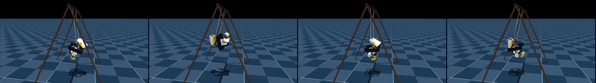
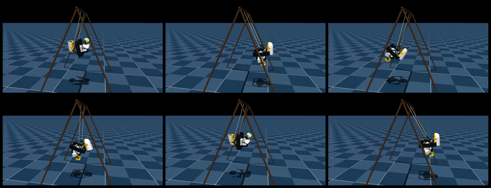
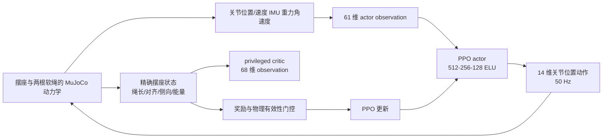

# MicroDuck 摆动旋转：从身体泵摆到物理有效性筛选

## 这一节完成什么

这篇教程复现一个比“让鸭子站稳”更有意思、也更容易被视频误导的任务：MicroDuck 坐在两根软绳悬挂的摆座上，从最低点静止出发，只用自己的头部和腿部动作逐渐把摆幅做大。

视频里常见的说法是“鸭子转了很多圈”，但这里必须先区分两个量：

- **摆动峰峰角**：摆座在一个几何平面内从一侧到另一侧的最大角度范围；
- **累计转数/累计角度**：把后续运动中的角位移不断累加，适合做展示，但不等于摆座一直处于一个合法的 360° 环形运动。

本节采用公开仓库中的 `alpha050` 策略和固定版本源码，重点讲清楚它为什么能“自己泵起来”、奖励如何避免用横向甩动作弊、怎样导出 ONNX，以及为什么“视频里的 2717.8° 累计角度”不能直接写成“已经完成 360° 连续翻环”。

## 1. 先看本地复现结果

公开策略的代表性 rollout 已放在本节资源目录中。视频是固定机位的 MuJoCo 仿真回放，画面中保留了阴影和运行中的最大峰峰角标记。



**图 1：** 使用公开 `alpha050.pt` 在本地导出得到的 36 秒 rollout。它展示的是“从静止开始主动泵摆”，不是外部给摆座施加初始冲量。



**图 1.1：** 本地导出视频的六个时间点。抽帧用于快速检查摆座、鸭子姿态和镜头是否都被正确写入视频。


**图 2：** 两根独立软绳和保留座椅结构。绳子只能受拉，不能把“绷直”和“压缩”都当作合法约束。

## 2. 这个任务真正难在哪里

摆座本身是一个会摆动的动力学系统。鸭子一开始位于最低点，速度和角度都接近零；如果策略只输出一个固定的周期动作，动作相位很快就会和摆座运动错开，能量不是被积累，而是被抵消。

策略需要在每个控制周期里回答一个闭环问题：

> 当前摆座正在向哪边运动？鸭子的身体应该提前伸展还是收缩？哪一组腿部和头部动作能把身体重心的运动投影到摆动方向，而不把能量泄露到横向和偏航方向？

这不是把“秋千角度”塞给策略，然后按角度查表。公开实现明确把精确的绳长、座椅状态和几何量留给 critic 与评估器；actor 主要依靠本体感觉完成部署时可以获得的判断。

## 3. 任务架构：actor、critic 和摆座动力学



**图 3：** 训练链路。actor 负责最终部署动作，critic 可以在训练时使用更多仿真状态，但这些特权状态不能进入部署 ONNX。

### 3.1 Actor 为什么还能够判断摆动相位

actor 的输入契约仍然是 61 维，输出 14 个关节位置动作。输入主要由以下几部分组成：

| 输入组 | 作用 |
|---|---|
| 基座角速度与投影重力 | 判断身体正在怎样旋转、是否偏离直立方向 |
| 14 个关节位置与 14 个关节速度 | 观察腿和头部当前处于什么姿态、运动得多快 |
| 上一时刻动作 | 让策略知道自己刚才给了多大的身体形变 |
| 速度/头部/身体命令 | 保持与 MicroDuck 既有运动控制接口一致 |

摆座的运动不会以“`swing_angle`”这个特权标量直接出现，但会通过基座角速度、重力方向、关节响应和接触结果间接体现出来。策略在时间上连续运行，就能从这些信号估计自己处于上摆、过顶还是下摆阶段。

### 3.2 Critic 为什么可以看到更多状态

critic 的 68 维输入额外包含精确的摆座状态，用来减少价值估计噪声。这样做属于 asymmetric actor-critic：训练时让 critic 更容易评估“这一动作是否真的在增加有效摆幅”，部署时仍然只保留 actor 可获得的传感器输入。

这也解释了一个常见误读：**critic 能看到绳长，不等于鸭子的策略在真机上装了一个理想绳长传感器。** 导出的 ONNX 只应使用 actor 的 61 维输入。

## 4. “自己泵摆”是怎样学出来的

这个行为可以拆成三个层次理解：

1. **能量注入**：身体和腿在摆动的特定相位发生伸展/收缩，把关节运动转化为摆座沿弧线方向的有效能量；
2. **方向约束**：奖励鼓励前后摆动，却惩罚横向位移、横向速度、滚转/偏航角速度和挂点不对齐；
3. **物理边界**：软绳松弛、过度拉伸、身体脱离摆座几何或出现 NaN 时，策略不能靠快速 reset 把问题藏掉。

因此它学到的不是一个“按固定相位摆腿”的动画，而是一个把本体感觉和接触动力学闭环起来的泵摆控制器。换初始噪声或执行器参数后，动作相位仍然要能在反馈中自行修正。

## 5. 奖励与物理有效性筛选

公开配置里最重要的奖励项不是单独的“角度越大越好”，而是一组同时生效的目标：

| 类别 | 代表项 | 目的 |
|---|---|---|
| 进度 | `swing_peak_progress` | 奖励新的有效摆幅前沿，避免只在低幅度来回晃 |
| 高度/能量 | `swing_height`、`swing_late_height`、`swing_energy` | 让能量持续到后半程，而不是前几秒冲高后失控 |
| 平面约束 | `swing_lateral`、`swing_lateral_velocity`、`swing_out_of_plane_angular_velocity` | 把摆动保持在目标平面附近 |
| 机构约束 | `swing_alignment`、`string_slack`、`string_extension_barrier` | 防止挂点错位、绳子深度松弛或超过允许伸长 |
| 控制平滑 | `action_rate_l2`、`joint_torques_l2`、关节限位 | 避免用高频抖动和撞限位换取表面上的角度 |

评估时还要检查：完整时域是否跑完、有没有 reset、绳长是否越过几何包络、侧向位移是否受控、BAM 执行器电压/电流/扭矩是否合理。

## 6. 公开策略的真实指标

本节使用的固定源码版本为：

```text
https://github.com/Vottivott/microduck-playground
commit: c5fcc50219fef01ac9931d0079c583ccbb29b689
```

对应的 `alpha050` 选择结果如下：

| 指标 | 数值 |
|---|---:|
| 随机评估 | 100 个 seed × 36 秒 |
| 严格完整时域通过 | 71/100 |
| 无几何债务通过 | 73/100 |
| 峰峰摆幅中位数 | 163.03° |
| 最好严格 rollout | seed 27，173.20° |
| seed 27 最大横向位移 | 10.35 mm |

视频中出现的 `60 s`、`7 圈`、`2717.8°` 是累计角度的展示指标；公开选择策略的严格峰峰摆幅只有约 173.2°。后来某次 60 秒回放达到 180.2°，但离开了准确几何包络，因此不能把它当作通过物理门控的正式结果。

## 7. 从源码到 ONNX

### 7.1 获取源码和依赖

```bash
git clone https://github.com/Vottivott/microduck-playground.git
cd microduck-playground
git checkout c5fcc50219fef01ac9931d0079c583ccbb29b689
uv sync
```

如果复制命令时发现 commit 不存在，请以官方仓库当前发布的 swing 实验版本为准；教程固定 commit 的目的，是让模型、配置和指标有明确的对应关系。

### 7.2 运行测试和物理审计

```bash
uv run --with pytest pytest tests/test_swing_cfg.py

uv run python scripts/evaluate_swing_checkpoint.py \
  experiments/swing/checkpoints/alpha050.pt \
  --output /tmp/swing-seed27.json \
  --device cpu \
  --duration 36 \
  --seed 27
```

测试只证明配置、任务注册和审计脚本可运行；它不等于完整 100 seed 统计，也不等于真机安全验证。

### 7.3 导出部署策略

```bash
uv run python scripts/export.py Mjlab-SwingPump-MicroDuck \
  --checkpoint-file experiments/swing/checkpoints/alpha050.pt \
  --onnx-file artifacts/microduck-swing.onnx \
  --device cpu

uv run python scripts/verify_swing_onnx_parity.py \
  experiments/swing/checkpoints/alpha050.pt \
  artifacts/microduck-swing.onnx \
  --device cpu \
  --duration 36 \
  --seed 27
```

导出脚本会把 observation normalizer 和训练时的动作 clamp 一起写进图。不要只把 PyTorch actor 的 `state_dict` 手工转换为 ONNX，否则最容易出现输入归一化不一致和动作幅值漂移。

本节 `assets/microduck_swing_alpha050.onnx` 是已经完成的本地导出文件，适合做接口检查，不应被误写成官方硬件部署包。

## 8. 训练而不是只回放

公开仓库给出了从零训练和从 release checkpoint 继续训练的入口：

```bash
# 先做 5 次迭代的 smoke test
uv run train Mjlab-SwingPump-MicroDuck \
  --env.scene.num-envs 64 \
  --agent.max-iterations 5

# 再扩大并行环境数量
uv run train Mjlab-SwingPump-MicroDuck \
  --env.scene.num-envs 4096
```

训练本身是随机优化，不能承诺不同 GPU、MuJoCo Warp、PyTorch 和并行归约实现得到 bitwise 相同的 checkpoint。更合理的复现实验记录应包括源码 commit、随机种子、环境数量、物理有效性门控和完整时域通过率，而不是只贴一段角度最大的录像。

## 9. 这个结果能不能直接上真机

不能直接推出。摆座的坐垫、绳结、框架柔性、碰撞代理、执行器饱和和跌倒保护，都会改变真实系统的动力学。公开仓库已经把 BAM 执行器、电压下垂、摩擦、阻尼、控制延迟和绳子随机化纳入了训练，但这仍然只是仿真中的覆盖范围。

真机研究至少需要：

1. 先固定摆座和安全绳，验证低幅度前后摆；
2. 单独记录每个关节的电流、温升、位置误差和动作频率；
3. 把横向失稳、绳子松弛和座椅脱离作为硬急停条件；
4. 逐步放大摆幅，不以“累计转数”作为唯一目标；
5. 在真实机构标定之后重新评估，不把仿真视频当作硬件承诺。

## 10. 与 Every Embodied 其他 MicroDuck 实验的关系

| 实验 | 主要问题 | 核心学习点 |
|---|---|---|
| 球面平衡 | 脚下支撑面自由滚动 | 本体感觉、接触和恢复 |
| 高跷行走 | 支撑几何和重心高度改变 | 形态编译、课程学习 |
| 摆动旋转 | 外部悬挂动力学和能量注入 | 相位反馈、平面约束、物理门控 |
| mjswan 拖拽 | 训练好策略在浏览器里受外力 | WASM、ONNX 和接触交互 |

这四个案例串起来，才是“机器人学会新动作”的完整视角：先明确接触动力学，再设计可部署观察，最后把奖励和安全约束写成可审计的指标。

## 11. 参考资料与许可

- [microduck-playground 官方仓库](https://github.com/Vottivott/microduck-playground)
- [swing 实验说明](https://github.com/Vottivott/microduck-playground/tree/c5fcc50219fef01ac9931d0079c583ccbb29b689/experiments/swing)
- [公开 Hugging Face 模型 `HannesVonEssen/microduck-swing`](https://huggingface.co/HannesVonEssen/microduck-swing)
- [Pollen Robotics MicroDuck](https://github.com/pollen-robotics/microduck)

源码、模型、摆座硬件文件和视频的许可证并不相同。下载或再发布时应以各自仓库和模型卡的许可为准；Every Embodied 中的本地视频和 ONNX 仅作为教程复现实验材料，不改变上游权利归属。
