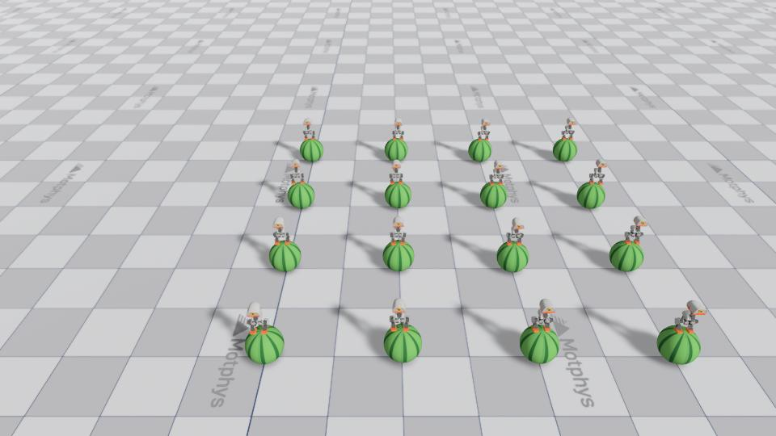
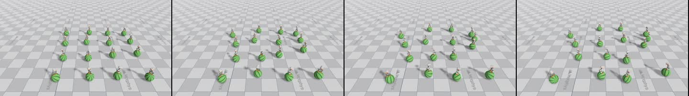
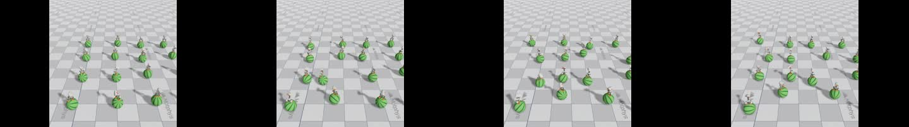
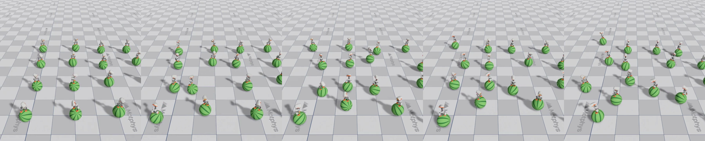
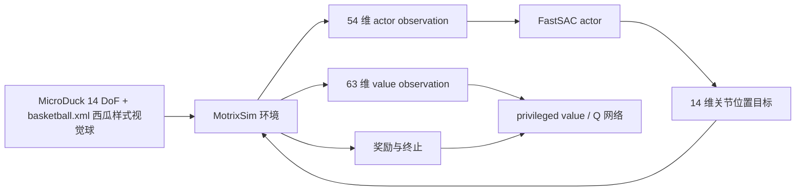

# MotrixLab：MicroDuck 球平衡与 FastSAC 训练

## 这一节解决什么问题

Every Embodied 已经有一篇基于 `microduck-playground` 的篮球平衡教程。本节补充另一条实现路线：使用 Motphys 开源的 **MotrixLab**，直接运行它内置的 `microduck-ball-balance` manager-based 任务和 Motrix FastSAC 训练器。

两条路线都在研究“鸭子站在自由滚动球面上保持平衡”，但并不是同一个 checkpoint、同一套 observation 或同一种算法。把它们并排看，反而更容易理解：**环境、观察、奖励和训练器的改变，会直接改变策略学到的控制方式。**

## 1. 官方资源和本地结果



**图 1：** MotrixLab 官方球平衡任务海报。视频资源来自 MotrixLab 文档的 `_static/videos/microduck-ball-balance.mp4`，不是本教程重新训练的结果。



**图 2：** MotrixLab 官方示例视频，适合先确认任务长什么样，再开始自己的训练。





**本地复现结果：** 使用 MotrixLab 官方 `microduck-ball-balance` 任务，在 Windows CUDA eager 路径下训练到约 5000 迭代后，从 `model_0005002.pt` 录制了 10 秒、720×720 的回放。这个 checkpoint 用来验证“环境—训练—保存—回放—视频导出”链路，不把短训练结果包装成已经收敛的最佳策略。

终止本地训练时控制台记录的状态如下，方便读者理解这个结果的强弱：

| 项目 | 本地记录 |
|---|---:|
| 训练进度 | `5,202 / 20,000` iterations |
| 最近回合 return | `+68.71` |
| 最近回合长度 | `570.6` steps |
| 采样吞吐 | `14,334 env-steps/s` |
| 回放视频 | 10 s，720×720，H.264 |

这些数字是一次 Windows 兼容路径的过程记录，不是 MotrixLab 官方基准，也不等价于跨 seed 的收敛成功率。

官方仓库：

- [MotrixLab GitHub](https://github.com/Motphys/MotrixLab)
- [MotrixLab 中文文档](https://motrixlab.readthedocs.io/zh-cn/stable/)
- [球平衡中文文档](https://motrixlab.readthedocs.io/zh-cn/latest/user_guide/envs/ball_balance.html)
- [MicroDuck 机器人模型](https://github.com/pollen-robotics/microduck)

## 2. 先澄清：任务名叫篮球，但画面里的物体是西瓜样式

用户看到的“西瓜”是有依据的：MotrixLab 官方视频和本地回放中的物体都是绿色条纹球，视觉上就是一个西瓜样式的球体。不过当前公开代码的命名仍然是 `microduck-ball-balance`、`basketball.xml`、`Basketball` 和 `basketball_visual`。这说明 **任务语义是 ball balance，源码命名沿用了 basketball，视觉材质却是西瓜样式**；不能只看文件名判断画面内容。

当前任务的物理球仍然是半径 `0.14 m`、质量 `0.45 kg` 的自由球体，条纹只是视觉 mesh/texture。因而本节已经完成的是：**直接复刻官方西瓜样式球平衡任务**。如果后续要研究“真实西瓜”的质量、惯量、摩擦或不规则外形，则需要另外建模和重新训练，不能仅仅替换贴图。

## 3. MotrixLab 的任务结构



**图 3：** MotrixLab 的球平衡调用链。这里的环境和训练后端由 MotrixLab 统一管理，和 `microduck-playground` 的 PPO/LSTM 方案是两条不同实现。

### 3.1 场景和动力学

配置文件位于：

```text
motrix_envs/src/motrix_envs/locomotion/ball_balance/microduck.py
motrix_envs/src/motrix_envs/locomotion/ball_balance/assets/basketball.xml
```

机器人基座的初始高度设置为 `0.12 + 2 × 0.14 = 0.40 m`，让双脚从球顶附近开始。这个西瓜样式球是自由刚体，不是把一个固定的“平衡台”贴在脚下；一旦脚底的水平投影偏离球心，球就会滚动，机器人必须通过全身关节重新把球拉回双脚下方。

### 3.2 Actor 和 value 的观察

MotrixLab 这个任务不是盲球 actor。actor 会读取球相对机器人坐标系的位置和速度：

| 观察项 | Actor | Value | 说明 |
|---|---:|---:|---|
| 投影重力 | 3 | 3 | 判断身体是否直立 |
| 基座角速度 | 3 | 3 | 判断倾倒趋势 |
| 球相对位置 | 3 | 3 | 球在身体坐标系中的位置 |
| 球相对速度 | 3 | 3 | 球相对机器人如何滚动 |
| 关节位置 | 14 | 14 | 相对默认姿态的偏移 |
| 关节速度 | 14 | 14 | 脚和身体的运动速度 |
| 上一动作 | 14 | 14 | 约束动作连续性 |
| 基座线速度/球世界状态 | — | 9 | value 的特权状态 |

合计为 actor 54 维、value 63 维。它与之前篮球教程中的 61 维 LSTM blind actor 不是同一接口，两个 ONNX 不能直接互换。

### 3.3 动作和底层执行器

动作是 14 维关节位置目标，通过统一的 `action_scale=0.5` 加到默认站立姿态上，再由机器人模型里的位置执行器、PD 增益和力矩限制完成底层控制。训练器输出的是控制目标，不是直接修改球的位置，也不是给球施加脚本化速度。

### 3.4 奖励和终止

配置中的主要奖励包括：

- `upright`：身体保持直立；
- `base_height`：基座高度维持在站球高度附近；
- `ball_under_feet`：球心保持在双脚中点下方；
- `dof_default`：避免关节无意义地大幅偏离默认姿态；
- `action_rate_l2`、`limits_dof_pos`：抑制抖动和撞限位；
- `undesired_contacts`：惩罚躯干等非足端部位发生不期望接触。

终止条件包括基座过低、姿态严重倾斜、球滚出脚底范围、关节角/速度异常。默认回合长度是 20 秒。物理域没有做质量、摩擦和执行器增益随机化；这里的随机性主要来自初始状态和 actor 观察噪声，因此不能直接把训练结果当成 sim-to-real 保证。

## 4. 在 Windows 上安装和运行

MotrixLab 要求 Python 3.10.x 和 `uv`。Windows 下从仓库根目录执行：

```powershell
git clone https://github.com/Motphys/MotrixLab.git
cd MotrixLab
git lfs pull
uv sync --all-packages --extra cuda
```

这里的 `cuda` extra 很重要。直接 `uv sync` 会安装默认的 CPU PyTorch；而默认 FastSAC 配置的异步 collector 会请求 CUDA，表现为：

```text
collector_inference_device='cuda' requested CUDA, but CUDA is unavailable
```

如果只想检查 Python 依赖而不训练，可先确认：

```powershell
.\\.venv\\Scripts\\python.exe -c "import torch; print(torch.__version__); print(torch.cuda.is_available())"
```

Windows 有一个容易踩到的坑：仓库把 CUDA wheel 放在 `cuda` extra 中，而 Windows 下没有可用的官方 Triton wheel。若沿用默认的 `torch.compile` 配置，collector 可能在预热阶段报 `TritonMissing`。本教程的 Windows 复现命令关闭两个编译开关，仍然使用 CUDA 做 eager 前向；Linux + CUDA + Triton 环境可以保留默认编译配置。

### 4.1 直接训练官方任务

用户给出的命令在仓库根目录执行。Windows 下建议直接调用已经同步好的虚拟环境 Python，并关闭依赖 Triton 的编译路径：

```powershell
.\\.venv\\Scripts\\python.exe scripts\\train.py `
  task=microduck-ball-balance/motrix.fastsac `
  play=true `
  algo.agent.compile=false `
  algo.trainer.async_options.collector_compile=false
```

不要在已经安装 CUDA extra 后直接执行不带 extra 的 `uv run`：`uv` 可能按默认依赖重新同步 CPU 版 PyTorch，随后又出现 “CUDA is unavailable”。如果必须使用 `uv run`，写成 `uv run --extra cuda ...`，或者像上面一样直接使用 `.\\.venv\\Scripts\\python.exe`。

默认配置位于：

```text
configs/task/microduck-ball-balance/motrix.fastsac.yaml
```

当前公开配置使用：

| 参数 | 默认值 |
|---|---:|
| 并行环境 | 2048 |
| play 环境 | 16 |
| FastSAC 学习迭代 | 20000 |
| 控制步长 | 0.02 s |
| 仿真步长 | 0.005 s |
| replay batch | 2048 |

它不是“5 到 10 分钟在任何机器上必然完成”的承诺。实际时间会受到 CUDA wheel、显卡、MotrixSim 版本、磁盘和是否打开渲染的影响。首次运行还要等待 Git LFS 资源和 CUDA kernel 缓存。

### 4.2 先做小规模 smoke test

完整训练前建议把环境和迭代数降下来，先验证场景、奖励、collector 和 checkpoint 写盘：

```powershell
.\\.venv\\Scripts\\python.exe scripts\\train.py `
  task=microduck-ball-balance/motrix.fastsac `
  num_envs=64 `
  play_num_envs=4 `
  algo.trainer.num_learning_iterations=5 `
  algo.agent.compile=false `
  algo.trainer.async_options.collector_compile=false `
  play=false
```

这个 smoke test 只证明数据加载、前向、反向和优化器能走通，不证明球平衡已经学会。本机实测该命令返回码为 0，并写出了 `checkpoints/latest.pt`。

### 4.3 回放和结果目录

训练产物写入：

```text
runs/microduck-ball-balance/motrix/torch/fastsac/<timestamp>/
```

训练结束后可以直接回放最近一次带 metadata 的策略：

```powershell
.\\.venv\\Scripts\\python.exe scripts\\play.py env=microduck-ball-balance num_envs=16
```

如果需要记录视频，先查看当前版本 `configs/play.yaml` 和 `scripts/play.py` 支持的字段，再使用 `record_video=true`；不要手动改成旧版本的参数名。最终视频应标注为 MotrixLab 的回放结果，并记录 checkpoint、环境数量和 seed。

## 5. 和已有篮球教程如何对照

| 项目 | `microduck-playground` 篮球任务 | MotrixLab 球平衡 |
|---|---|---|
| 训练算法 | PPO | Motrix FastSAC |
| actor | 带记忆的 LSTM blind actor | manager-based MLP actor |
| actor 是否读球状态 | 主要依赖本体感觉 | 读取球相对位置/速度 |
| 观察契约 | 61 维 recurrent 接口 | actor 54 维、value 63 维 |
| 主要用途 | 更接近公开 MicroDuck 既有策略接口 | 学习 MotrixSim + FastSAC 任务工程链路 |
| 直接互换 checkpoint | 不可以 | 不可以 |

这不是谁“替代”谁的问题。前者适合讲本体感觉和时序记忆，后者适合讲 manager-based 环境、统一配置、异步 collector 和 FastSAC。两边都需要以自己的 observation/action contract 运行。

## 6. 如果要研究“真实西瓜”物理，还需要做什么

当前官方任务已经是西瓜样式视觉球；若要进一步研究真实西瓜，而不是沿用球体近似，需要把它当成一个物理模型扩展：

1. 用 MuJoCo XML 或 mesh 定义西瓜的几何、半径、质量、惯量和摩擦；
2. 决定西瓜是自由滚动、被切平面约束，还是有局部凹槽；
3. 重新定义球相对位置/速度查询和奖励；
4. 重新检查脚底接触、基座高度和终止阈值；
5. 先跑 5–20 个环境的物理 smoke，再扩大到并行训练；
6. 只有拿到跨 seed 的稳定率和视频，才把它称为“西瓜平衡复现”。

当前仓库没有单独命名为 `watermelon` 的任务配置，因此本节不声称已经完成真实西瓜材质、质量和不规则形状的独立研究；本节复现的是官方提供的西瓜样式球平衡任务。

## 7. 参考资料

- [MotrixLab 源码](https://github.com/Motphys/MotrixLab)
- [MotrixLab 球平衡任务源码](https://github.com/Motphys/MotrixLab/blob/main/motrix_envs/src/motrix_envs/locomotion/ball_balance/microduck.py)
- [MotrixLab FastSAC 配置](https://github.com/Motphys/MotrixLab/blob/main/configs/task/microduck-ball-balance/motrix.fastsac.yaml)
- [Every Embodied：MicroDuck 篮球平衡 PPO 教程](../01-MicroDuck篮球平衡强化学习/README.md)
- [Pollen Robotics MicroDuck](https://github.com/pollen-robotics/microduck)
