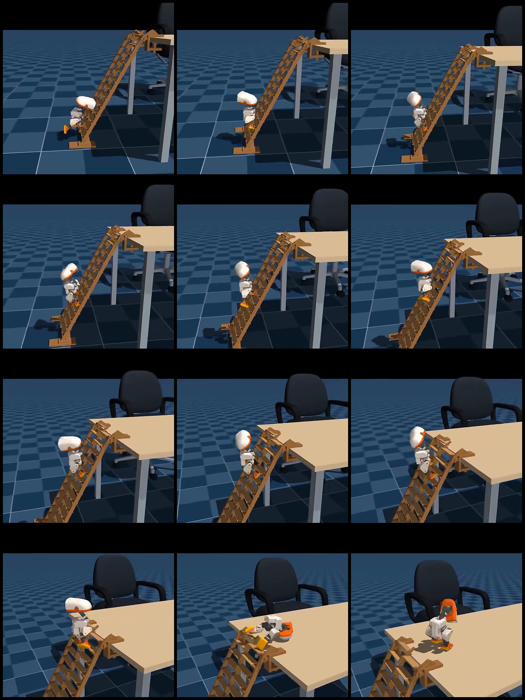
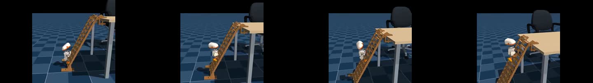
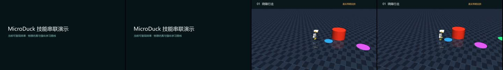
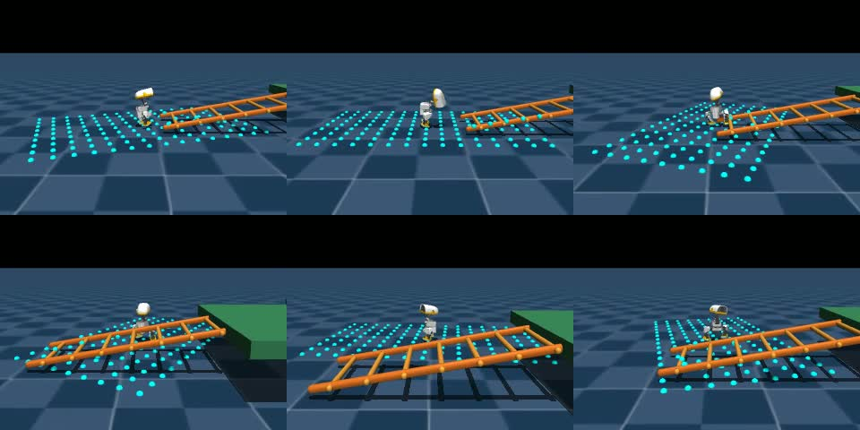
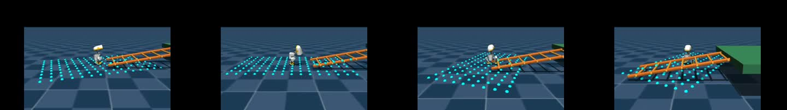
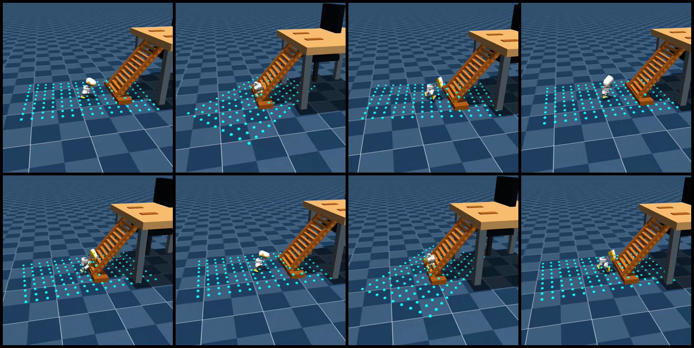
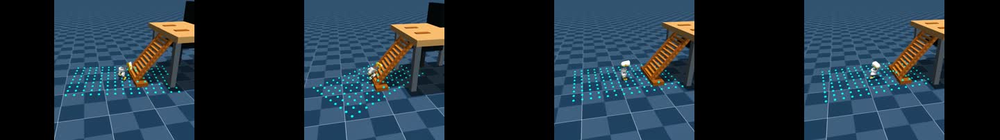
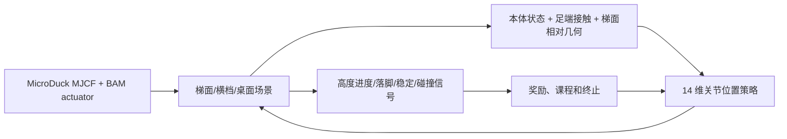

# MicroDuck 梯面攀爬：从视频现象到可复刻的强化学习任务

## 这一节先把边界说清楚

> **截至 2026-09-15 的进度：** 公开资料里已经找到 MicroDuck 的单台阶仿真策略，但还没有找到与本视频完全一致的“14 根斜梯横档 + 顶部翻台”训练代码和 checkpoint。V3 的独立评测已经在 `active_rungs=3`、关闭双支撑桥接后观察到一次真实物理横档完成：`TARGET_STEPS=[28, 76, 77]`、`MAX_PHYSICAL_RUNG_TARGET=1`、`SUCCESS_COUNT=1`。这证明接触状态机和首档落脚链路确实能工作，但不代表已经连续爬梯或登顶；训练已转入 `active_rungs=5` 的单脚交替阶段，继续验证第二、第三根横档和顶部落台。

用户提供的视频展示了一只 MicroDuck 从地面沿着带横档的斜梯向上攀爬，最后把身体翻到桌面上。我们把视频保存成了本节的抽帧参考：



**图 1：** 参考视频的 12 帧抽样。来源：[用户提供的微信视频号链接](https://weixin.qq.com/sph/AE3UDs4BhR)。



**视频 1：** 本节整理的原始参考片段。它用于分析任务阶段和接触关系，不代表视频同款训练代码已经公开。

### 技能串联阶段演示

为了把目前已经跑通的绕障、物理扰动、球面平衡和梯面接触放在同一条叙事里，另有一版统一画幅的阶段组合视频：



这是一版“当前进展串联”，不是完整任务成功视频。片尾把已经验证的技能和仍在训练的 `GroundPick`、连续换档、顶部落台分开标注；最新 V3 checkpoint 的独立评测结果仍以本节的数值和日志为准。

## 现在已经跑通到哪一步

原视频对应的完整“梯子 MJCF + 训练配置 + checkpoint + 评测脚本”仍没有在可核验的公开仓库中找到。但我们已经在公开的 MuJoCo/MicroDuck 训练栈上补出了一个 **本地 V1 实验任务**：

- 注册任务：`Mjlab-Ladder-Climb-MicroDuck`；
- 使用真实 MuJoCo 碰撞几何：两根斜梁、7 根横档、顶部平台和停止挡板；
- 观测增加前方射线扫描，actor 从 61 维扩展为 196 维，critic 为 211 维；
- 奖励使用向前/向上势能差、身体直立、脚端接触和动作平滑项；
- 成功条件要求到达顶部平台且姿态仍然稳定；
- 用公开的 MicroDuck 行走 checkpoint 扩展第一层输入，先做 warm start，再训练梯面策略。

这一版已经在 GPU 上完成了 256 环境、150 次迭代的训练，并导出了 12 秒 H.264 回放。回放中鸭子会走到梯面、与横档发生物理接触并爬到中段，但本轮 `ladder_success=0`，还没有稳定翻上顶部平台。因此它是“物理链路和任务实现已跑通、策略仍需继续训练”的 V1，不是原视频的完整复刻。



**图 2：** 本地 V1 回放的 6 个时刻。青色点是梯面射线观测，橙色几何体是真实碰撞横档；可以看到策略已经进入梯面接触阶段。



**视频 2：** 本地 MuJoCo V1 回放。视频用于证明环境和策略确实运行过；当前结果仍应标注为“部分攀爬”，不能写成“已登顶”。

## 2.1 按原视频重做的 V2 梯子几何

V1 的主要问题不是“把斜坡换了颜色”，而是梯子结构与参考视频不一致。V2 已按原片中的空间关系重做：单个高桌面、两根沿斜面布置的矩形侧梁、14 根密集的横向横档、梯脚落地木块、桌面四条腿，以及桌后方的椅子视觉结构。横档保持世界坐标中的横向轴，不再把横档旋转成竖直栅栏；所有梯梁、横档、桌面和梯脚都是真实 MuJoCo 碰撞几何。梯梁坡度、梯顶搭接位置和桌面高度也按参考画面重新校正，避免出现“两块桌板夹一排竖柱”的错误结构。



**图 3：** V2 的单鸭场景预览。这里展示的是几何和碰撞场景，不代表策略已经登顶。



**视频 3：** V2 无支撑板场景的 warm-start 预览。它用于检查“鸭子从梯脚前接近真实梯子”的场景是否正确；当前 checkpoint 仍会在梯脚附近失败，`ladder_success=0`，不能把这段回放写成完整复刻。

为解决从平地行走直接跳到窄横档导致的探索困难，代码另外提供了一个**只用于训练课程**的支撑阶段：它在相同梯梁、横档和桌面下增加一块可碰撞的连续斜面，先让策略学会沿斜面抬脚和保持身体，再迁移到无支撑板的最终任务。支撑板不是最终展示场景，也不是隐藏的成功捷径。

新增代码：

- [`microduck_video_ladder_env_cfg.py`](./code/microduck_video_ladder_env_cfg.py)：视频比例 V2 场景、真实碰撞几何、无支撑板最终任务和支撑板课程任务；
- [`video_ladder_mdp_terms.py`](./code/video_ladder_mdp_terms.py)：基于脚端位置的横档对齐 shaping，接触和成功仍由 MuJoCo 物理与终止条件判定。

本地验证过的任务名：

```text
Mjlab-Video-Ladder-Climb-MicroDuck          # 最终：无支撑板、横档接触
Mjlab-Video-Ladder-Support-Stage-MicroDuck  # 课程：增加连续支撑板
```

Windows CUDA 环境中可以直接使用已验证的 `.venv` 入口，避免 `uv run` 重新解析出 CPU 版 PyTorch：

```powershell
# 先做物理 smoke
.\.venv\Scripts\train.exe Mjlab-Video-Ladder-Support-Stage-MicroDuck `
  --env.scene.num-envs 32 `
  --agent.max-iterations 5

# 训练课程阶段，再迁移到无支撑板最终场景
.\.venv\Scripts\train.exe Mjlab-Video-Ladder-Support-Stage-MicroDuck `
  --env.scene.num-envs 256 `
  --agent.max-iterations 4000

.\.venv\Scripts\train.exe Mjlab-Video-Ladder-Climb-MicroDuck `
  --env.scene.num-envs 256 `
  --agent.max-iterations 4000 `
  --agent.resume True `
  --agent.load-run <support-stage-run> `
  --agent.load-checkpoint model_*.pt
```

导出单鸭视频时使用 `scripts/export.py` 的 `--num-envs 1`，不要把多环境训练拼图当成最终展示：

```powershell
.\.venv\Scripts\python.exe scripts\export.py `
  Mjlab-Video-Ladder-Climb-MicroDuck `
  --checkpoint-file logs\rsl_rl\ladder_climb_video\<run>\model_*.pt `
  --num-envs 1 `
  --video True `
  --video-length 600 `
  --video-height 720 `
  --video-width 720 `
  --onnx-file artifacts\video_ladder.onnx
```

当前状态如实记录：V2 几何、任务注册、物理 smoke 和单场景预览已完成；本地短训练对照仍为 `ladder_success=0`，最终的稳定登顶 checkpoint 还没有产出。后续要以跨 seed 成功率、最高攀爬高度、横档接触稳定时间和桌面落台视频作为完成标准。

## 2.2 V3：按落脚点规划的物理正确任务

V2 的失败不是“再多训练几轮”就能解释的。检查模型后确认有两个结构性问题：梯子原来使用 `contype=1/conaffinity=1`，而机器人身体的 `self_collision_only` 几何使用 `contype=2/conaffinity=2`，躯干和腿因此可以穿过梯梁；同时奖励只看前进和高度，策略没有理由抬脚去踩下一根横档。

V3 对应的新任务是：

```text
Mjlab-Video-Ladder-Footstep-MicroDuck
```

这版保留视频比例的 14 根离散横档，但把“进度”改成真实落脚状态机：

- 梯梁、横档、梯脚、桌面和落台块统一使用 `contype=3/conaffinity=3`，可以同时碰到脚底的 bit 1 和身体的 bit 2；椅子仍是纯视觉物体；
- 接触传感器从 MuJoCo contact 数据读取 `found/force/dist/pos/normal`，负的 `dist` 作为穿透惩罚；
- 身体接触传感器只匹配原模型命名的 3 个 bit 2 几何（躯干与左右小腿），不会把脚底的合法横档接触误判为身体撞梯；梯子使用 `(3,3)`，脚使用 `(1,1)`，身体使用 `(2,2)`；没有额外添加会改变原模型自碰撞拓扑的躯干代理几何；
- actor/critic 增加未来两根横档的 `dx/dy/dz/yaw`、步态相位、摆动脚、双脚相对位置、真实接触和课程阶段观测；
- 目标横档只有在指定脚真实接触并保持一段时间、且脚端位置落在容差内时才推进；碰撞梯梁的躯干在接近和攀爬阶段直接失败；
- 阶段 A 仍保留完整梯子的真实碰撞，但暂不把身体硬碰撞作为终止条件；进入第 1 根横档阶段后才启用该失败门，同时接触力、穿透和滑移代价从第一步就记录，避免“先学站稳”变成放宽物理；
- 课程阶段是 `0 → 1 → 2 → 3 → 7 → 14` 根横档，其中 2 档是为 MicroDuck 增加的左右脚换档桥接阶段，随后才打开顶部翻台；V3 最终场景没有连续支撑板；
- 阶段 G 只在名义攀爬课程完成后启用小幅域随机化：使用 `dr.pseudo_inertia` 随机质量/惯量，并随机脚底摩擦、BAM 关节摩擦、执行器增益和初始姿态；前面的 A–F 阶段保持确定的接触动力学，便于先学会动作再做 sim-to-real 鲁棒性；
- 移除 V2 的根部前进/高度进度奖励，加入落脚误差、支撑稳定、摆动脚抬升、打滑、冲击和穿透代价；身体对准项使用当前目标横档的势能差，原地站立不会持续领取“前进奖励”。

### V3 参考的人形机器人方法

这版不是凭经验重新发明一个“撞梯子”的奖励，而是把已有双足落脚规划方法迁移到 MicroDuck：

- [HR-LearningHumanoidWalking](https://github.com/qiangsun89/HR-LearningHumanoidWalking) 的 `jvrc_step` 使用未来两个落脚目标、左右脚交替相位，以及单支撑/双支撑阶段的脚端力和速度约束；目标脚真实到位并保持后，才推进落脚序列。V3 的 `ladder_step_targets`、`ladder_phase`、`ladder_phase_contact_velocity` 和物理接触状态机对应这组思路。
- [unitree_dsc_lab](https://github.com/thanhnguyencanh/unitree_dsc_lab) 展示了更近期的楼梯/复杂地形做法：把地形类别、台阶高度、台阶深度和朝向作为显式地形 token，并把教师策略、感知策略和关节策略分阶段训练。它是 Isaac Lab + G1 的实现，V3 当前只借鉴“显式地形信息和分阶段训练”的接口，不直接搬运 G1 checkpoint。
- 这些项目的机器人尺寸、关节数、动作空间和执行器不同，不能直接把人形 checkpoint 塞给 MicroDuck。当前迁移的是规划与训练机制；MicroDuck 仍使用自己的 MuJoCo 梯子、14 维动作、BAM 执行器和真实接触数据。

因此，V3 的验收顺序仍然是：先在单横档上学会“抬脚—接触—承重—保持”，再逐步扩展到 3、7、14 根横档，最后才训练顶部翻台；不使用连续支撑板作为最终任务的隐藏捷径。

### 2.3 梯面、绕障和拾取：目前分别做到哪一步

这三件事可以做成同一套 MicroDuck 教学路线，但成熟度不同，不能用同一个“跑起来”标准混在一起：

| 能力 | 当前可复现内容 | 还缺什么才算完成 |
|---|---|---|
| 梯面攀爬 | `Mjlab-Video-Ladder-Footstep-MicroDuck` 已有真实横档碰撞、落脚目标、相位和接触状态机；短梯评测已完成过首个物理横档 | 连续换档、14 根横档和顶部落台的跨 seed 成功率，以及完整回放视频 |
| 绕障 | `microduck-rl-lab` 已有 `walk_obstacle_entry → walk_obstacle_detour` 路线，可把行走策略送到障碍前、绕到侧面再继续 | 当前路线使用仿真器真值坐标，不是摄像头/ToF 视觉导航；要做成感知版本，需要加入障碍检测和局部目标估计 |
| 拾取 | 官方任务 `Mjlab-GroundPick-Flat-MicroDuck` 已注册，64 环境、5 轮 CPU smoke 已完成，奖励中包含下蹲、嘴部接近、回站和接触相关项 | 仍需用完整 checkpoint 做阶段成功率、嘴部接触和回站视频验收，不能把 smoke 当成已学会拾取 |

因此，近期最稳妥的组合是：用官方行走策略验证绕障路线，用官方 GroundPick 任务继续训练拾取，用 V3 独立任务逐级训练梯面。三者可以最后由 `microduck-rl-lab` 的 mission pipeline 串起来，但串联 pipeline 只是调度器，不能替代每个技能自己的物理验收。

#### 绕障与拾取的最小复现命令

在已经安装好依赖的 Ubuntu 工作站上，先用 64 个环境做 smoke：

```bash
cd /home/ubuntu/workspaces/microduck_rl
MUJOCO_GL=egl .venv/bin/train Mjlab-GroundPick-Flat-MicroDuck \
  --env.scene.num-envs 64 \
  --agent.max-iterations 5 \
  --agent.logger tensorboard \
  --agent.experiment-name ground_pick_smoke
```

组合路线的源码在 `microduck-rl-lab`，其中的绕障段目前是仿真真值路线：

```bash
cd /home/ubuntu/workspaces/microduck-rl-lab
export PYTHONPATH=/home/ubuntu/workspaces/microduck-rl-lab/src:/home/ubuntu/workspaces/microduck_rl/src
export WANDB_MODE=offline
/home/ubuntu/workspaces/microduck_rl/.venv/bin/python \
  -m microduck_playground.cli train --skill all --smoke
```

本次在 Ubuntu 工作站实际完成了这条五技能 smoke：walking、sit/stand、ground-pick、roulade 和 right-foot kick 均成功启动并保存了 `model_4.pt`。这证明任务注册和流水线入口可用，但这些 5 轮 checkpoint 只用于环境冒烟，不能当作已经学会对应技能的最终模型。

完整训练前要分别保存 walking、ground-pick 和 ladder 的 checkpoint，再由 mission 配置串联；不要把一个 walking checkpoint 重命名成“绕障/拾取/爬梯模型”。

V3 的核心实现已合入实验仓库的 [`mdp.py`](https://github.com/Vottivott/microduck-playground/blob/main/src/mjlab_microduck/tasks/mdp.py)；教程配套配置和初始化脚本同步放在：

- [`microduck_video_ladder_footstep_env_cfg.py`](./code/microduck_video_ladder_footstep_env_cfg.py)：V3 场景、接触传感器、观测、奖励、终止和课程配置；
- [`registration_snippet.py`](./code/registration_snippet.py)：新增任务注册块；
- [`prepare_ladder_footstep_bootstrap.py`](./code/prepare_ladder_footstep_bootstrap.py)：将 61/76 维行走 checkpoint 扩展到 V3 的 224/239 维，并把新增观测零初始化；同时清零 checkpoint 中保存的 `common_step_counter`，避免直接跳过课程阶段。
- [`test_video_ladder_footstep_cfg.py`](./code/test_video_ladder_footstep_cfg.py)：直接编译 MuJoCo 模型，检查碰撞掩码、14 根横档、初始无穿透和课程边界。

### V3 先做物理 smoke，再训练

Windows CUDA 环境中使用已经安装好 MuJoCo Warp 和 GPU PyTorch 的 `.venv`，不要让 `uv run` 重新解析成 CPU 环境：

```powershell
# 将已有行走策略扩展成 V3 输入宽度
.\.venv\Scripts\python.exe scripts\prepare_ladder_footstep_bootstrap.py `
  artifacts\running-baseline\checkpoint.pt `
  artifacts\ladder_footstep_bootstrap\checkpoint.pt

# 先从阶段 A 开始做 4 轮 smoke，确认课程没有跳级
.\.venv\Scripts\train.exe Mjlab-Video-Ladder-Footstep-MicroDuck `
  --env.scene.num-envs 32 `
  --agent.max-iterations 4 `
  --agent.resume True `
  --agent.load-run bootstrap_v3 `
  --agent.load-checkpoint model_0.pt
```

如果把 bootstrap 文件放在 `logs/rsl_rl/ladder_climb_footstep/bootstrap_v3/model_0.pt`，上面的恢复参数可以直接使用；否则把 `--agent.load-run` 和 `--agent.load-checkpoint` 换成实际日志目录。

在 `microduck-playground-stilts` 源码根目录中，不依赖 pytest 也可以直接运行物理回归：

```powershell
.\.venv\Scripts\python.exe -c "import importlib.util; p='tests/test_video_ladder_footstep_cfg.py'; s=importlib.util.spec_from_file_location('v3tests',p); m=importlib.util.module_from_spec(s); s.loader.exec_module(m); [getattr(m,n)() for n in dir(m) if n.startswith('test_')]; print('V3_DIRECT_TESTS_PASSED')"
```

本轮本地验收结果：

- V3 任务在 CUDA/MuJoCo Warp 上完成构建，actor/critic 观测维度为 `224/239`，动作维度仍为 `14`；
- 32 环境、4 轮 smoke 完成，`Curriculum/ladder_stage` 从 `0` 开始，没有恢复旧行走 checkpoint 的全局步数而跳到 14 档；
- 32 环境、8 轮阶段 A 回放中 `ladder_body_collision=0`，说明训练入口不会因初始探索阶段的身体碰撞终止而把样本全部清空；
- 512 环境的阶段 A/B 已能完成入口目标的部分接触转移；阶段 C 的独立评测（`active_rungs=3`，含两个入口目标和第一根物理横档）最新结果为 `MAX_ENTRY_TARGET=1/2`、`MAX_PHYSICAL_RUNG_TARGET=0`、`SUCCESS_COUNT=0`。这说明状态机和真实接触审计已经在工作，但当前策略还停在梯脚入口，不能当作已经跨过物理横档；
- 直接编译 MuJoCo 模型检查通过：14 根横档、无连续支撑板、初始姿态无梯面穿透；将躯干故意放入横档时，MuJoCo contact 数据能产生身体 bit 2 与梯子 bit 3 的实际接触；
- 身体接触传感器改为 bit 2 几何精确匹配后，4 环境 CUDA/MuJoCo Warp 阶段 B 冒烟训练通过，观测仍为 `224/239`、动作仍为 `14`；脚踩横档不会触发身体撞梯终止，身体几何撞梯仍会记录并按阶段终止；
- 这只是物理与训练链路验证，不是完整攀爬结果。当前没有宣称单横档 90%、三横档 80% 或顶部登台成功率，也没有把短训练输出当作最终展示视频。

后续训练应按 A–G 阶段逐级推进，并分别记录单横档、三横档、七横档、十四横档和顶部落台的成功率。G 阶段的随机化从全局步数 `4500 × 24` 开始，不能在训练一开始就打开，否则容易把接触问题和 sim-to-real 扰动混在一起。V2 的“撞梯回放”继续保留为失败案例，不放进教程精选结果。

导出某个课程阶段的回放时，必须显式设置课程计数；否则新建的播放环境会从阶段 A 开始：

```powershell
.\.venv\Scripts\python.exe scripts\export.py `
  Mjlab-Video-Ladder-Footstep-MicroDuck `
  --checkpoint-file logs\rsl_rl\ladder_climb_footstep\<run>\model_*.pt `
  --curriculum-step 4800 `
  --num-envs 1 `
  --video True `
  --video-length 300
```

为了方便继续实验，本节把新增的环境配置和 warm-start 脚本放在 [`code/`](./code/) 中：

- [`microduck_ladder_env_cfg.py`](./code/microduck_ladder_env_cfg.py)：梯面场景、射线观测、奖励、终止和任务注册所需的环境配置主体；
- [`ladder_mdp_terms.py`](./code/ladder_mdp_terms.py)：向前/向上势能差和顶部平台成功条件；
- [`registration_snippet.py`](./code/registration_snippet.py)：把新任务挂到 `list-envs` 注册表的最小片段；
- [`prepare_ladder_bootstrap.py`](./code/prepare_ladder_bootstrap.py)：把公开行走策略的 61/61 维输入扩展到梯面任务的 196/211 维，并对新增观测列做零权重初始化。

这些文件是教程配套的实验补丁，不冒充 MicroDuck 官方发布物。真正复现实验时，还需要把奖励函数和任务注册代码合入 `microduck_rl` 的对应模块。

## 1. 为什么这不是普通的 rough-terrain walking

普通 rough terrain 主要要求机器人在未知的小台阶、坡面和高度扰动上保持行走。视频里的斜梯则多了几类约束：

- 脚必须在窄横档上形成可靠支撑，而不是只在连续地面上滚动接触；
- 身体要沿斜面上升，质心投影不能持续落到支撑多边形外；
- 横档之间存在离散间隙，抬脚高度、前向摆幅和落脚时机都要匹配；
- 接近桌面时，最后一步不是“继续走”，而是一个带有跨越、落台和重新站稳的过渡动作；
- 一旦卡在横档、打滑或倒下，训练器必须把失败定义成可度量的终止，而不是让策略靠撞击获得偶然的高度。

所以要复刻的是一个 **contact-rich locomotion / climbing** 任务，而不是给 walking 视频换一个斜坡背景。

## 2. 已经可以直接借鉴的开源项目

| 项目 | 能直接复用什么 | 不能直接证明什么 |
|---|---|---|
| [pollen-robotics/microduck](https://github.com/pollen-robotics/microduck) | 机器人本体软件、模型背景和运行时接口 | 没有提供这段梯面攀爬训练任务 |
| [pollen-robotics/microduck_rl](https://github.com/pollen-robotics/microduck_rl) | MuJoCo/MuJoCo Warp、BAM 执行器、14 动作/本体感觉接口、平地/粗糙地形训练 | 当前公开任务列表里没有视频同款梯子环境 |
| [Motphys/MotrixLab](https://github.com/Motphys/MotrixLab) | MotrixSim 场景、manager-based 任务、FastSAC 和并行训练工程 | `microduck-ball-balance` 是篮球平衡，不是梯面攀爬 |
| [bihaokun/microduck-step-up-policy](https://github.com/bihaokun/microduck-step-up-policy) | 25 mm 单台阶的 `step_up_walk`、头部刹车/站立恢复策略、ONNX/checkpoint、仿真评测和完整源代码快照 | 只验证了单台阶；策略不自动识别台阶，也没有连续斜梯或真机验证 |
| [craigm26/duckbench](https://github.com/craigm26/duckbench) | MuJoCo 物理基准、MicroDuck 策略服务，以及 stairs/ball challenge 的评分和审计框架 | 是评测和基准工具，不是可直接加载的完整爬梯策略 |
| [microduck-stairs-challenge](https://huggingface.co/datasets/craigm26/microduck-stairs-challenge) | 可量化的 MicroDuck 楼梯挑战、稳定落台和评分思路 | 它不是视频同款的斜梯攀爬 checkpoint |
| [open-microduck](https://github.com/SaberOnGo/open-microduck) | 独立社区对仿真、sim-to-real 参数和粗糙地形的整理 | 不是 Pollen 官方仓库，不能替代上游实现 |

其中最适合拿来做第一版基线的是官方 `microduck_rl` 的 rough-terrain 任务；单台阶项目可以用来校准“抬脚—上台—恢复”的动作先验，楼梯挑战可以用来校准“真正站到踏面上”的评测口径。两者都不能直接替代我们的连续斜梯任务。公开的单台阶项目报告的是 25 mm 台阶、13/14 个确定性测试状态稳定通过，并明确标注为仅仿真验证；楼梯挑战则是仿真评分包，不是训练好的连续楼梯策略。

## 3. 复刻架构应该怎样拆



**图 4：** 可复刻的任务闭环。第一版不要追求一次性学会完整攀爬，先把“站在横档上不摔倒”和“跨过一个台阶”拆成可以验证的阶段。

### 3.1 场景层

建议把几何分成四个模块：

1. **斜梯主体**：两根侧梁和若干横档，横档之间有明确间距；
2. **起始地面**：让机器人从可控的站立姿态进入第一根横档；
3. **顶部平台**：模拟视频中桌面的接管区域；
4. **安全包络**：侧面软挡板或虚拟碰撞区，用来统计越界而不是放任机器人掉到无限深处。

第一版应使用 box/capsule 等简单碰撞几何，不要先导入高面数网格。梯子真实外观可以用 visual mesh 表达，训练碰撞则尽量保持低复杂度，否则失败原因很难区分是策略问题还是窄相交导致的数值问题。

### 3.2 观测层

至少需要：

- 基座姿态、角速度和重力投影；
- 14 个关节的位置和速度；
- 左右脚的位置、速度和接触状态；
- 当前目标横档或平台的相对方向/高度；
- 上一时刻动作和动作变化率；
- 可选的局部深度/射线信息，用来判断前方横档高度和空隙。

如果要保持与官方 MicroDuck 运动策略相近的部署接口，可以把新信息压缩成命令向量或少量局部几何特征，保持 61→14 的控制契约；如果目标是研究视觉攀爬，则应该明确增加视觉 encoder，而不是悄悄把完整梯子状态喂给 actor。

### 3.3 奖励层

一个可解释的第一版奖励可以写成：

| 奖励组 | 目标 |
|---|---|
| 向上进度 | 鼓励基座/质心沿梯面上升，但限制单步跳跃式奖励 |
| 落脚质量 | 鼓励脚底在目标横档附近形成稳定接触 |
| 身体稳定 | 惩罚过大的 roll/pitch、横向速度和关节冲击 |
| 任务阶段 | 跨过横档、站稳、登上平台分别设置 latch/阶段奖励 |
| 能耗和动作平滑 | 惩罚大动作、关节限位和高频抖动 |
| 失败门控 | 掉梯、躯干撞击、足端卡入几何体、数值发散直接终止 |

尤其要防止“高度进度奖励”被策略利用成跳跃或撞击。楼梯任务必须把有效脚底支撑、身体朝向和完整稳定时间写进成功条件。

## 4. 推荐的训练课程

不建议一上来把视频中的整段斜梯、桌面和复杂摩擦都放进 4096 个环境里。可以按以下课程逐级增加难度：

1. **阶段 A：单横档站稳**。机器人从横档上开始，先学习 3–5 秒保持姿态；
2. **阶段 B：地面到单横档**。固定台阶高度，奖励跨越后站稳；
3. **阶段 C：连续低台阶**。随机横档间距和轻微摩擦，限制落脚冲击；
4. **阶段 D：斜梯**。逐步提高坡度、横档间距和目标高度；
5. **阶段 E：顶部平台**。加入最后一步跨越与平台恢复；
6. **阶段 F：扰动和域随机化**。再加入质量、摩擦、执行器延迟和初始姿态扰动。

每阶段都应保存跨 seed 的成功率、最大上升高度、稳定时间、碰撞次数和首次失败位置。只保存一段“刚好爬上去”的视频，无法说明策略已经学会了稳定攀爬。

## 5. 现阶段可以怎样跑开源基线

### 5.1 官方 MicroDuck rough-terrain 基线

在 `microduck_rl` 仓库根目录先确认当前任务注册表，因为上游任务名可能更新：

```bash
uv sync
uv run list-envs
```

根据当前公开任务表，粗糙地形基线通常从以下任务开始：

```bash
uv run train Mjlab-Velocity-Rough-MicroDuck
```

这一步的目标是验证：机器人本体、BAM 执行器、粗糙地形、策略输入输出和视频导出链路都正常。它不是梯面攀爬结果。

#### 5.1.1 本次粗糙地形复现素材

本次使用公开的 [`RemiFabre/microduck-rough-walk-g`](https://huggingface.co/RemiFabre/microduck-rough-walk-g) 策略，在 Ubuntu 工作站用 MuJoCo 离屏渲染了一段可展示回放。策略接口保持公开模型的 `61-D observation -> 14-D action`，控制频率为 50 Hz，速度命令为 `vx=0.30 m/s`。

复现脚本：

```bash
python scripts/render_rough_walk_video.py \
  --policy /path/to/policy.onnx \
  --output outputs/rough_walk_g_reproduction.mp4 \
  --seconds 12 \
  --command 0.30
```

为了让素材中的地形变化在一段视频里真正进入运动范围，可以使用紧凑课程和近景镜头：

```bash
MUJOCO_GL=egl python scripts/render_rough_walk_video.py \
  --policy /path/to/policy.onnx \
  --output outputs/rough_walk_g_compact_close.mp4 \
  --seconds 18 --width 1280 --height 720 \
  --command 0.30 \
  --camera-distance 1.45 --camera-lookahead 0.52 \
  --compact-course --center-y-gain 1.0 --max-lateral-command 0.30
```

修正版 Ubuntu 工作站回放中，公开策略保持 `61-D observation -> 14-D action` 接口，根部前进约 `0.88 m`，`y` 范围约为 `-0.225–0.012 m`，根部高度约为 `0.114–0.135 m`，未触发摔倒。展示场景改成连续、横向覆盖的低矮台阶带，并用横向速度闭环把视频路线保持在课程中心附近；这不是重新训练得到的策略，只是对没有目标点输入的公开速度策略增加回放控制。精选视频和轨迹审计文件位于 `microduck-live-materials-20260912/08_latest_additions/04_rough_walk_g_reproduction/`，推荐使用 `05_workstation_reproduction_centered_course_v2.mp4`。该视频用于说明公开 rough-terrain 策略的推理与渲染链路，不等同于原作者完整训练场景，也不代表已经完成实体鸭子部署；模型卡明确将其定位为仿真验证策略。

### 5.2 楼梯挑战基线

`craigm26/microduck-stairs-challenge` 更适合用来学习评测设计：它把“是否真的站到台阶踏面上”从“脚碰到台阶”中区分出来，并用稳定落台和多个测试格评价结果。这个思路可以直接借鉴到我们的梯面任务：成功条件必须包含支撑、姿态和持续时间。

### 5.3 MotrixLab 路线

MotrixLab 当前已经可以直接跑 `microduck-ball-balance`，但没有公开的梯子任务。要在 MotrixLab 中实现视频同款任务，需要新增：

```text
motrix_envs/src/motrix_envs/locomotion/ladder_climb/
configs/task/microduck-ladder-climb/motrix.fastsac.yaml
```

新任务应复用 `Microduck` robot registry、manager observations/actions/rewards/terminations，再注册梯面场景和接触查询。训练器可以先用 FastSAC 做 smoke；真正比较算法时再和官方 PPO 方案对齐并控制变量。

### 5.4 本地 MuJoCo V1 的运行流程

下面是本次实际使用的流程。`microduck_rl` 的任务注册 API 会随上游版本变化，运行前先用 `list-envs` 确认任务名：

```bash
git clone https://github.com/Vottivott/microduck-playground.git
cd microduck-playground
uv sync
uv run list-envs
```

将本节 [`code/`](./code/) 中的环境配置和 warm-start 脚本复制到对应目录，并把 `Mjlab-Ladder-Climb-MicroDuck` 注册到任务表后，可以先做 5 次迭代的物理 smoke：

```bash
uv run train Mjlab-Ladder-Climb-MicroDuck \
  --env.scene.num-envs 32 \
  --agent.max-iterations 5
```

再用公开行走 checkpoint 生成梯面输入维度的初始化权重，启动小规模训练：

```bash
python scripts/prepare_ladder_bootstrap.py \
  --source artifacts/running-baseline/checkpoint.pt \
  --output artifacts/ladder_bootstrap/checkpoint.pt

uv run train Mjlab-Ladder-Climb-MicroDuck \
  --env.scene.num-envs 256 \
  --agent.max-iterations 4000 \
  --agent.resume True \
  --agent.load-run bootstrap \
  --agent.load-checkpoint model_0.pt
```

Windows 上如果 `uv run` 重新解析依赖导致装回 CPU 版 PyTorch，应该直接调用已经验证过 CUDA 的环境入口，例如：

```powershell
.\.venv\Scripts\train.exe Mjlab-Ladder-Climb-MicroDuck `
  --env.scene.num-envs 256 `
  --agent.max-iterations 4000
```

回放时使用训练输出的 `model_*.pt`：

```powershell
.\.venv\Scripts\play.exe Mjlab-Ladder-Climb-MicroDuck `
  --checkpoint-file logs\rsl_rl\ladder_climb\<run>\model_*.pt `
  --num-envs 1 --video True --video-length 600
```

本节 V1 的 150 次迭代只是“环境和物理接触验证”，不足以作为最终训练预算。下一步应按第 4 节做单横档、低坡度、连续横档、完整斜梯和顶部平台的 curriculum，而不是直接把 4000 次整梯训练当成必然成功。

## 6. 这段视频目前能否称为“开源复刻”

目前不能这样写。比较准确的状态是：

- 视频现象已核实为斜梯/横档攀爬；
- MicroDuck 本体、MuJoCo 训练栈、粗糙地形基线和楼梯挑战资源是公开的；
- 视频同款梯子模型、连续斜梯训练脚本、checkpoint 和完整指标尚未在可核验的公开仓库中找到；
- `microduck-step-up-policy` 是目前最接近、也最适合先复现的公开单台阶参考，但它是“固定 25 mm 台阶 + 外部切换恢复策略”，不能当作视频同款连续爬梯；
- `duckbench` 和 `microduck-stairs-challenge` 更适合借鉴接触、稳定落台、穿透和多状态评分方法；
- Every Embodied 现在提供的是原视频分析、粗糙地形公开基线、V3 真实接触实验补丁和继续训练路线。当前工作站训练的入口阶段还没有确认物理横档成功，后续必须先拿到单横档真实接触 checkpoint，再公开视频和完整指标。

这条边界反而很重要：公开教程应该把“已跑通的基线”“借鉴的评测方法”和“待实现的新任务”分开，避免把视觉效果误写成算法复现。

## 7. 参考资料

- [Pollen Robotics MicroDuck](https://github.com/pollen-robotics/microduck)
- [Pollen Robotics MicroDuck RL](https://github.com/pollen-robotics/microduck_rl)
- [MotrixLab](https://github.com/Motphys/MotrixLab)
- [MicroDuck Step-Up Policy（25 mm 单台阶）](https://github.com/bihaokun/microduck-step-up-policy)
- [duckbench：MicroDuck MuJoCo 基准与挑战工具](https://github.com/craigm26/duckbench)
- [Microduck Stairs Challenge 数据集与评分说明](https://huggingface.co/datasets/craigm26/microduck-stairs-challenge)
- [open-microduck 独立复现项目](https://github.com/SaberOnGo/open-microduck)
- [LadderMan：感知楼梯攀爬研究参考](https://arxiv.org/abs/2606.05873)
