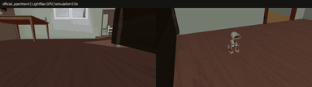
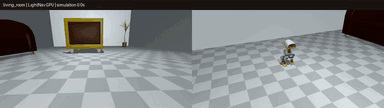
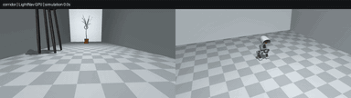

# MicroDuck 任务演示总览

这里按任务展示演示，GPU 推理在前、BPU 推理在后。展开条目可以看更多版本；训练、模型来源和实现步骤见各任务教程。

GPU 在工作站计算动作；BPU 在 RDK X5 计算动作，工作站负责仿真与画面渲染。网页展示的是已保存的任务视频，重跑步骤见 [Notebook 说明](../../03-Notebook/README.md)。

## Notebook：每项任务一组

| Notebook 与任务 | GPU 推理 | BPU 推理 |
| --- | --- | --- |
| `01` 篮球平衡 |  |  |
| `02` 浏览器物理扰动 |  |  |
| `03` 高跷行走 |  |  |
| `04` 摆动旋转 |  |  |
| `05` 球平衡 FastSAC |  |  |
| `06` 梯面攀爬 |  逐级爬梯，登桌站稳 |  梯面接触 |
| `07` 行走策略接入 |  |  |

上述 7 本 Notebook 保存了 64 个代码单元的执行计数与输出；下方第 8 本导航 Notebook 新增 12 个已执行代码单元，8 本合计保存 76 个代码单元的输出。运行状态和可选步骤见 [Notebook 说明](../../03-Notebook/README.md)。原始 MP4 不提交，页面展示压缩 GIF。

## LightNav-0 多场景导航

[第 8 本 Notebook](../../03-Notebook/08_LightNav0_视觉语言导航_GPU_多场景.ipynb) 在 GPU 上接入预训练导航模型，读取第一视角图像与语言指令。三个场景分别生成视频；运行步骤、控制接口与模型来源见[导航教程](../../02-可运行代码/lightnav-learning/README.md)。

| 官方住宅 | 自建客厅 | 自建走廊 |
| --- | --- | --- |
|  住宅里寻找左侧桌子 |  客厅里接近扶手椅 |  走廊里寻找盆栽 |

## 梯面攀爬与登桌

逐级踩横档，登桌后起身站稳。双策略切换、训练方法和模型来源见[梯面攀爬教程](../06-MicroDuck梯面攀爬强化学习导读/README.md)。

## 高跷行走：25 cm 与 200 cm

不同高度下交替支撑行走。形态课程、模型来源和尺寸配置见[高跷行走教程](../03-MicroDuck高跷行走强化学习复现/README.md)。

## 其它任务版本

以下收录各任务的更多动作和训练阶段。

行走、绕障与命令编舞

速度与朝向命令：

障碍场景：

篮球平衡

浏览器物理扰动

通过鼠标拖动小鸭子施加外力，观察仿真中的受力与运动变化。

摆动旋转

摆动与旋转动作。

球平衡与 FastSAC 训练

FastSAC 球面平衡训练。

梯面攀爬：动作分析与训练阶段

完整爬梯与登桌见上方演示；以下依次记录动作参考和 V1/V2/V3 训练阶段。实现过程见[梯面攀爬教程](../06-MicroDuck梯面攀爬强化学习导读/README.md)。

横档接触、梯脚接近和起始姿态。

技能串联总览

多任务剪辑；各任务的完整演示见上方对应条目。

## 素材与复现

- 所有提交的视频预览均为 GIF；前 7 本 Notebook 用 GIF 相对链接展示视频，第 8 本保留小尺寸图像与轨迹图，运行后在单元内播放导航 MP4。
- 原始 MP4 留在仿真工作站，减小克隆和浏览开销。各任务的环境、模型、指标与复现步骤见对应任务 README。
- 运行 Notebook 可生成新的任务 MP4 与评测报告。
