# MicroDuck 任务演示总览

这里按任务拆分演示，每本 Notebook 的 GPU 与 BPU 视频各自对应同一任务；展开条目可以看完整任务列表和额外版本。

**视频说明：** GPU GIF 展示 Notebook 中保存的策略推理回放；BPU GIF 展示 RDK X5 执行策略推理、Ubuntu 运行仿真的板端闭环记录。生成新 BPU 视频时，运行对应单元并连接任务 HBM、RDK 服务和仿真工作站。浏览器扰动演示通过鼠标拖动施加外力；梯面 Notebook 展示横档接触阶段，逐级攀爬演示见下方社区复现。

## Notebook：每项任务一组

| Notebook 与任务 | GPU 推理 | 先前保存的 BPU 闭环回放 |
| --- | --- | --- |
| `01` 篮球平衡 | 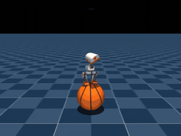 | 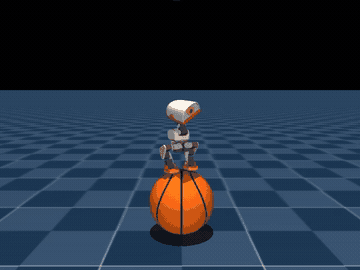 |
| `02` 浏览器物理扰动 | 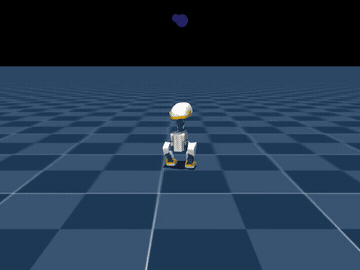 | 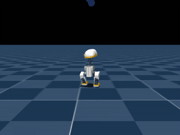 |
| `03` 高跷行走 | 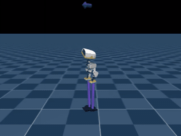 | 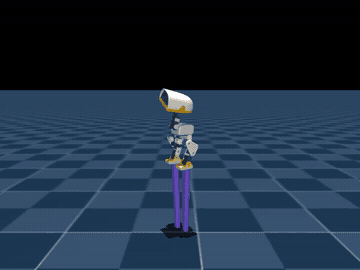 |
| `04` 摆动旋转 | 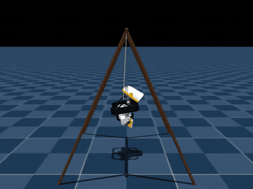 | 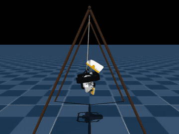 |
| `05` 球平衡 FastSAC | 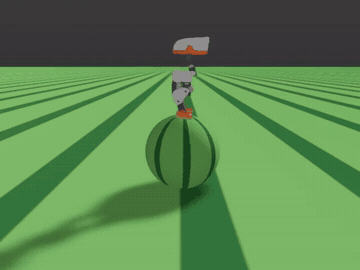 | 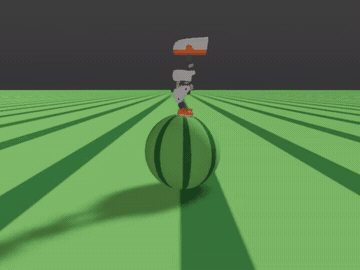 |
| `06` 梯面攀爬 | 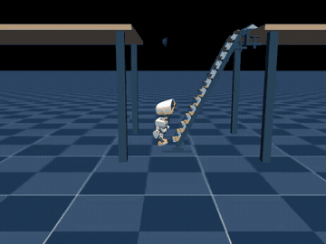 | 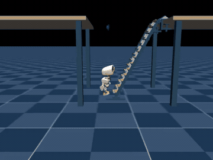 |
| `07` 行走/导航接入 | 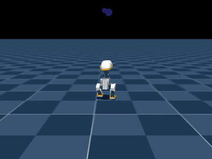 | 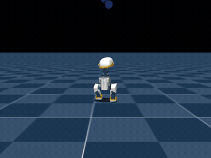 |

上述 7 本 Notebook 共保存了 64 个代码单元的执行计数与输出。完整执行快照在 Notebook 中；为避免重复存储大段 MP4，视频输出改为链接到本目录的压缩 GIF。运行状态和可选步骤见 [Notebook 说明](../../03-Notebook/README.md)。

## 梯面攀爬：逐级踩横档

社区复现视频展示小鸭子逐级踩上梯子横档：[播放 11.77 秒攀爬视频](https://huggingface.co/HannesVonEssen/microduck-climb/resolve/main/media/preview.mp4)。同一项目提供攀爬与起身策略、ONNX、PPO 检查点、环境代码和梯子模型：[模型与演示页](https://huggingface.co/HannesVonEssen/microduck-climb) · [训练与复现代码](https://github.com/Vottivott/microduck-playground/tree/main/experiments/desk-climb)。本专题的本地横档接触阶段回放见下方“梯面攀爬”条目。

## 高跷行走：25 cm 与 200 cm

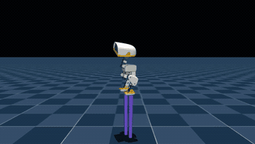

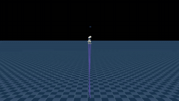

社区还发布了 10 cm 至 2 m 的八档高跷策略，每档包含独立视频、ONNX 和训练检查点：[高跷策略与视频合集](https://huggingface.co/HannesVonEssen/microduck-stilts)。其中 [200 cm 仿真视频](https://huggingface.co/HannesVonEssen/microduck-stilts/resolve/main/200cm/preview.mp4)展示了交替支撑行走。

## 其它任务版本

以下收录 Notebook 双视频之外的任务策略、本地回放和阶段性实验。

行走、绕障与命令编舞

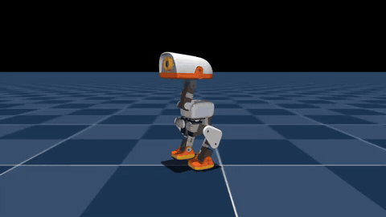

训练策略的命令编舞回放：

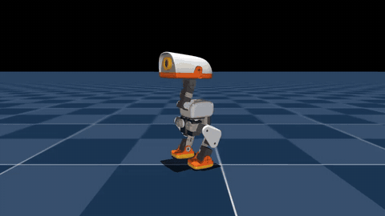

MuJoCo 障碍几何中的行走回放：

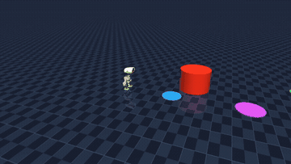

篮球平衡

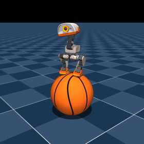

浏览器物理扰动

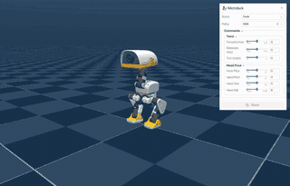

通过鼠标拖动小鸭子施加外力，观察仿真中的受力与运动变化。

摆动旋转策略与本地回放

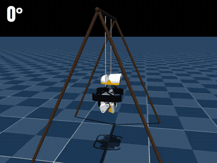

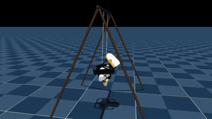

查看 alpha050 策略的摆动与旋转动作回放。

球平衡：MotrixLab 策略与本地 FastSAC

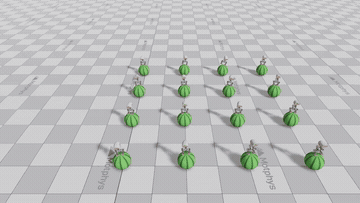

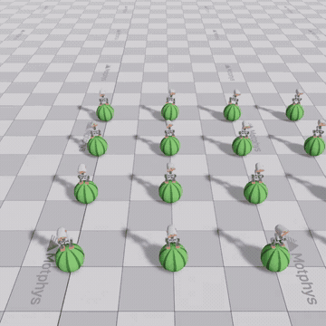

本地 FastSAC 5000 iteration 短训策略回放。

梯面攀爬：社区逐级攀爬与本地接触阶段

社区复现提供攀爬策略、起身策略、PPO 检查点、训练代码和梯子模型。演示中小鸭逐级踩上横档：[观看 11.77 秒攀爬视频](https://huggingface.co/HannesVonEssen/microduck-climb)；[直接打开 MP4](https://huggingface.co/HannesVonEssen/microduck-climb/blob/main/media/preview.mp4)；[训练与复现代码](https://github.com/Vottivott/microduck-playground/tree/main/experiments/desk-climb)。

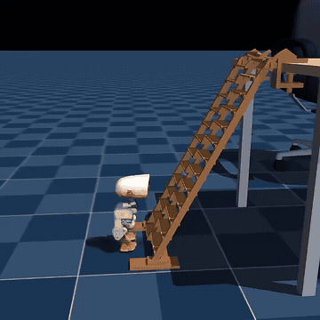

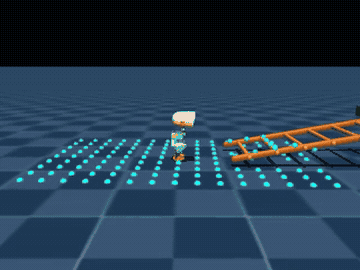

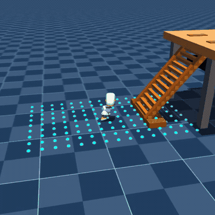

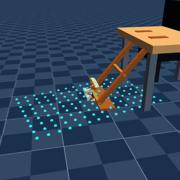

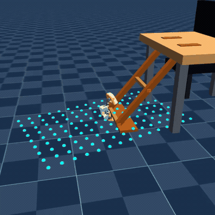

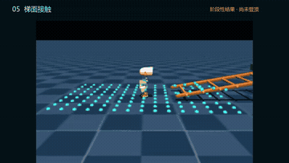

本地回放记录横档接触、靠近梯脚和不同训练阶段；社区逐级爬梯视频展示完整攀爬动作。

技能串联总览

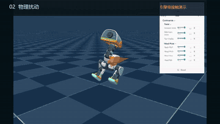

这是多任务剪辑总览；各任务的独立回放见上方对应条目。

## 素材与复现

- 所有提交的视频预览均为 GIF；Notebook 输出中的 MP4 已替换为 GIF 相对链接。
- 原始 MP4 不进入主仓库，减小克隆和浏览开销。各任务的环境、模型、指标和完整回放说明见对应任务 README。
- RDK X5 的板端任务视频属于每任务独立推理；Ubuntu 负责物理仿真和编码，BPU 负责动作推理。标注为“已保存”的视频可直接预览；运行 Notebook 的 BPU 单元可生成新的板端闭环视频。
