# BWM：同济 Boundless 团队的动作条件世界模型

这一节对应同济大学 Boundless Large Model Lab 开源的 **Boundless-World-Model**，简称 **BWM**。项目仓库为 [boundless-large-model/boundless-world-model](https://github.com/boundless-large-model/boundless-world-model)，模型权重发布在 [BLM-Lab/Boundless-World-Model](https://huggingface.co/BLM-Lab/Boundless-World-Model)。

BWM 承接 RAW-Dream、WoG、WALL-WM、RoboDream 与 Gamma-World，并将自身定义为 **physically consistent, action-conditioned video world model**，目标是为机器人操作提供低成本、高保真的视频级世界模拟器。

学完这一节后，大家需要抓住一个核心判断：

> BWM 不是 VLA 策略本身，也不是只看文本生成视频的普通视频模型；它是在 Wan2.2-TI2V-5B 的基础上，把机器人动作轨迹作为条件注入视频扩散模型，让模型从初始观测和动作序列出发，自回归生成后续机器人操作视频。

它的用途可以概括为：

```text
初始图像 / 历史视频帧
        +
机器人动作轨迹
        ↓
动作条件视频世界模型
        ↓
未来操作视频 rollout
        ↓
评估动作是否合理、生成数据、辅助策略训练或调试
```

这类模型和 VLA 的关系是互补的。VLA 输出动作，BWM 预测这些动作在视觉世界里会带来什么后果。它不直接控制机器人，但可以成为数据引擎、策略评估器或 imagined rollout 模块。

## 1. 开源状态和入口

| 项目 | 当前状态 |
| :--- | :--- |
| GitHub | [boundless-large-model/boundless-world-model](https://github.com/boundless-large-model/boundless-world-model)，Apache-2.0 |
| Hugging Face | [BLM-Lab/Boundless-World-Model](https://huggingface.co/BLM-Lab/Boundless-World-Model) |
| 基座模型 | [Wan2.2-TI2V-5B](https://github.com/Wan-Video/Wan2.2) |
| 依赖框架 | [DiffSynth-Studio](https://github.com/modelscope/DiffSynth-Studio) |
| 评测榜单 | [WorldArena Hugging Face Space](https://huggingface.co/spaces/WorldArena/WorldArena) |
| 已发布 | 推理代码、模型定义、模型权重 |
| 未发布 | 训练代码、技术报告仍在撰写中 |

当前最适合做的不是从头复现训练，而是：

1. 阅读模型思路，理解动作条件世界模型和普通视频生成模型的区别。
2. 下载 Wan2.2-TI2V-5B base model 和 BWM checkpoint。
3. 使用仓库自带 `demo/` 数据跑一次 `scripts/infer_example.sh`。
4. 对照生成视频，分析机器人动作、物体状态和接触关系是否保持一致。

## 2. WorldArena 成绩怎么看

<p align="center">
  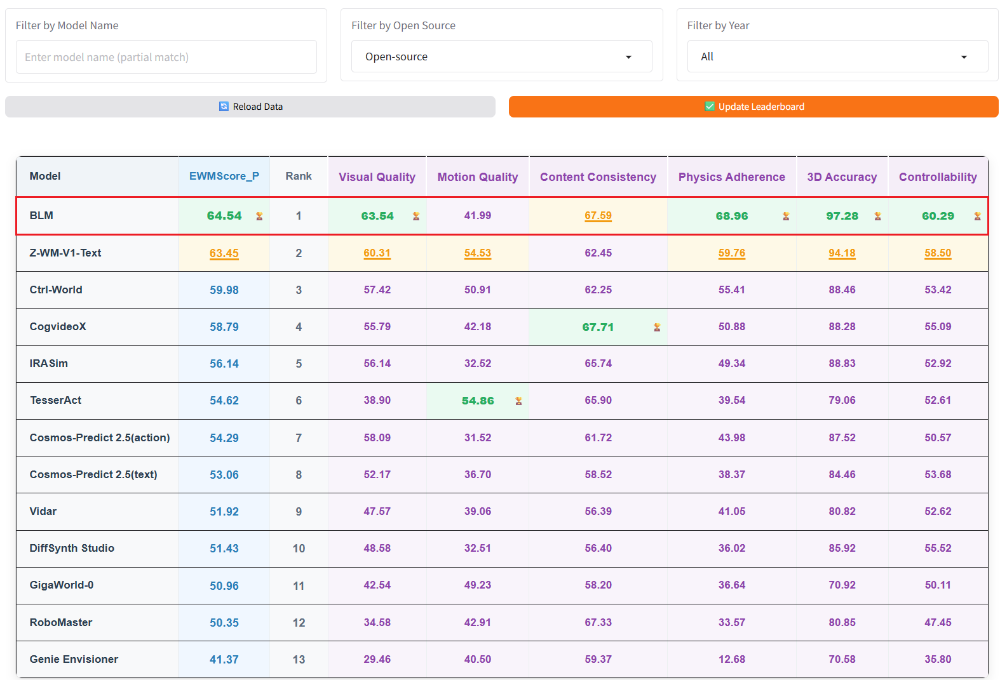
</p>

**图 1 WorldArena Track 1 开源榜。** BLM 在开源模型中排第 1，指标覆盖视觉质量、运动质量、内容一致性、物理遵循、3D 准确性和可控性。

来源：[BWM 官方 GitHub 仓库](https://github.com/boundless-large-model/boundless-world-model)。

<p align="center">
  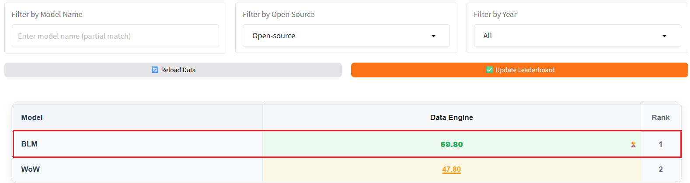
</p>

**图 2 WorldArena Track 2 Data Engine 开源榜。** README 中标注 BLM 在 Track 2 Data Engine 开源模型中排第 1。

来源：[BWM 官方 GitHub 仓库](https://github.com/boundless-large-model/boundless-world-model)。

<p align="center">
  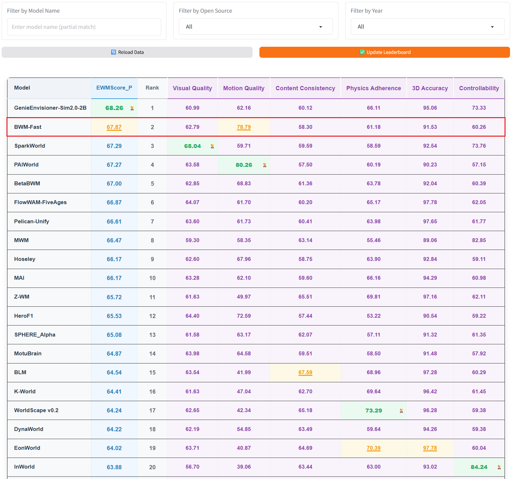
</p>

**图 3 WorldArena Track 1 overall 榜。** README 中标注 BWM-fast 在 Track 1 overall 排第 2，也就是用户提到的“开源第 1、闭源第 2”对应的主要来源。

来源：[BWM 官方 GitHub 仓库](https://github.com/boundless-large-model/boundless-world-model)。

这些榜单要分开理解。

| 名称 | 直观含义 | BWM/BLM 的位置 |
| :--- | :--- | :--- |
| Track 1 open-source | 只看开源模型的 action-conditioned world model 排名 | BLM 排第 1 |
| Track 2 Data Engine open-source | 只看开源数据引擎相关排名 | BLM 排第 1 |
| Track 1 overall | 开源和闭源模型一起比较 | BWM-fast 排第 2 |

WorldArena 的指标并不只看“视频像不像”。从榜单列名可以看到，它同时评估 Visual Quality、Motion Quality、Content Consistency、Physics Adherence、3D Accuracy、Controllability。对机器人世界模型来说，最后三项尤其关键：模型必须保持物体身份、空间结构、动作条件和物理约束的一致性，否则生成视频再漂亮，也不能拿来服务机器人。

## 3. BWM 在世界模型谱系里的位置

可以从下面几类世界模型的关系中理解 BWM：

| 方法 | 输入条件 | 输出 | 主要用途 |
| :--- | :--- | :--- | :--- |
| RAW-Dream | 当前图像、任务、动作、world model reward | imagined rollout 及 RL 更新 | 在任务无关世界模型中强化 VLA |
| WoG | 未来观测蒸馏出的 latent condition | 动作相关条件特征 | 增强 VLA 动作预测 |
| WALL-WM | 当前观测、事件级动作条件 | 事件级未来视频和动作 | 长时域预演 |
| RoboDream | robot-only 轨迹、scene prior、object prior | 合成机器人示教视频 | 数据生成 |
| Gamma-World | 多智能体多视角观测和动作 | 共享世界视频流 | 多智能体世界建模 |
| **BWM** | 初始帧/历史帧 + 机器人动作轨迹 | 动作条件未来视频 rollout | 机器人操作世界模拟、数据引擎、评测 |

BWM 和 WALL-WM 最接近，都是动作条件视频世界模型。但 BWM 当前开源更偏工程推理入口：它已经给出基于 Wan2.2-TI2V-5B 的推理代码、checkpoint、demo 数据和 WorldArena 结果图。WALL-WM 更强调事件级世界动作建模的论文方法拆解。两者可以放在一起对比。

## 4. 总体架构：Wan2.2 视频模型如何接动作

Hugging Face 模型卡给出的关键信息是：

| 属性 | BWM 当前公开信息 |
| :--- | :--- |
| Base Model | Wan2.2-TI2V-5B |
| Resolution | 480 x 640 |
| Frames | 81 frames |
| Control Signals | Robot action trajectories |
| Architecture | Trainable DiT + Action Encoder |

仓库推理配置里使用的是 `configs/infer/infer.yaml`，公开参数包括 `height=672`、`width=896`、`num_frames=57`、`num_history_frames=9`、`fps=24`、`action_dim=14`、`action_type=eef_abs`、`action_mode=adaln`。这说明实际 demo 配置和模型卡摘要并不完全等价：模型卡描述能力边界，仓库配置描述当前示例推理 profile。

可以把 BWM 的开源架构理解成下面这条链：

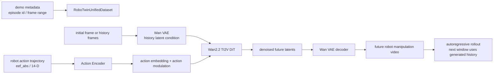

这里有几个关键点。

第一，BWM 不是文本驱动。推理配置里 `text_mode: none`，代码里也把 Wan2.2 TI2V 的文本路径关掉。模型主要依靠历史视频帧和动作轨迹控制未来生成。

第二，动作不是后处理标签，而是进入 DiT 生成过程。开源代码中 `WanVideoActionEncoder` 会把动作序列编码成 `action_emb` 和 `action_mod_emb`。在 `action_mode=adaln` 下，动作调制会加到时间调制 embedding 上，同时动作 embedding 会进入上下文序列。这相当于让每个去噪步骤都知道“机器人接下来要怎么动”。

第三，BWM 用历史帧约束自回归生成。`scripts/infer.py` 会先保留输入视频的历史帧，然后按窗口生成未来帧；生成下一段时，会把已经生成的视频帧作为新的历史条件。这个设计让它能做长时域 rollout，而不是只生成一个固定短片段。

## 5. 自回归 rollout：为什么它像低成本模拟器

仓库 README 说 BWM 可以作为 robotic manipulation 的低成本高保真 simulator。这里的 simulator 不能理解成 MuJoCo / Isaac Sim 那种显式物理引擎。它更像一个神经视频模拟器：

| 传统物理仿真器 | BWM 这类视频世界模型 |
| :--- | :--- |
| 输入 URDF/MJCF、物理参数、控制量 | 输入初始视觉观测、历史帧、动作轨迹 |
| 显式模拟刚体、关节、碰撞、接触 | 从数据中学习视觉和物理后果 |
| 输出状态、图像、力学量 | 主要输出未来视频 |
| 可解释、可控，但建模成本高 | 真实感强、建模成本低，但物理可靠性需评测约束 |

BWM 的自回归逻辑来自 `scripts/infer.py`：

1. 从 demo metadata 里读取一个 episode。
2. 读取初始视频帧和动作轨迹。
3. 取 `num_history_frames` 作为历史条件。
4. 根据动作序列生成当前窗口的未来帧。
5. 把新生成的帧拼回 history。
6. 重复直到覆盖目标 episode 长度。
7. 输出 `outputs/inference/episode*.mp4`。

这就是它“像模拟器”的地方：给定动作序列，它会把动作执行后的视觉后果滚出来。但它也有边界：输出主要是视频，不是可查询的完整物理状态；模型可能在长时域中积累误差；它能否支持策略闭环训练，还要看动作空间、观测接口、误差评估和 reward 设计如何接上。

## 6. 定性结果：看它到底会预测什么

下面几组 GIF 都来自官方 README。它们展示的是 BWM 在 WorldArena test set 上从初始帧和动作序列自回归生成的操作视频。

<table>
  <tr>
    <td width="50%" align="center">
      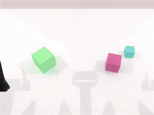
      <br><strong>图 4a 按大小排列积木</strong>
    </td>
    <td width="50%" align="center">
      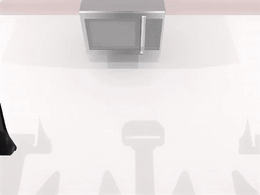
      <br><strong>图 4b 打开微波炉</strong>
    </td>
  </tr>
  <tr>
    <td width="50%" align="center">
      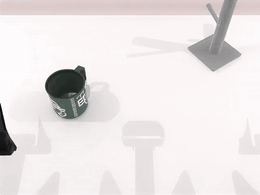
      <br><strong>图 4c 挂杯子</strong>
    </td>
    <td width="50%" align="center">
      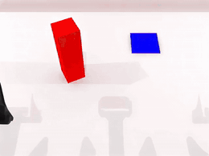
      <br><strong>图 4d 双臂递交积木</strong>
    </td>
  </tr>
</table>

来源：[BWM 官方 GitHub 仓库](https://github.com/boundless-large-model/boundless-world-model)。

这些例子覆盖了几种不同难点。

按大小排列积木考察的是多物体身份保持、空间顺序和接触稳定性。如果世界模型只会生成“看起来像机器人在动”的视频，很容易出现积木身份漂移、大小关系错乱或放置后抖动。

打开微波炉考察的是 articulated object。门不是自由漂浮物体，而是绕铰链旋转，状态从关闭变成打开，并且需要在后续帧里持续保持。

挂杯子考察的是细粒度 affordance。模型必须知道杯柄、挂钩、夹爪接触位置和最终悬挂状态之间的关系。

双臂递交积木考察的是多臂协同和遮挡。两只机械臂接近同一个物体时，世界模型需要保持物体连续性，避免短暂遮挡后物体消失或跳变。

<p align="center">
  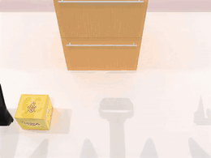
</p>

**图 5 长时域约束放置。** 把物体放进柜子需要运输、遮挡处理和最终空间约束，比单步抓取更考验长时域一致性。

来源：[BWM 官方 GitHub 仓库](https://github.com/boundless-large-model/boundless-world-model)。

这类例子最值得关注的不是单帧画质，而是物理和任务状态是否持续一致。一个高质量世界模型至少要做到：物体不乱变、夹爪和物体接触关系合理、动作条件能控制变化方向、任务完成后的状态能保留。

## 7. OOD 泛化：换初始场景后还能不能滚

<table>
  <tr>
    <td width="50%" align="center">
      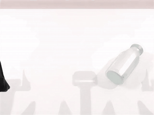
      <br><strong>图 6a OOD 初始场景示例 1</strong>
    </td>
    <td width="50%" align="center">
      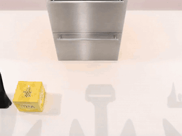
      <br><strong>图 6b OOD 初始场景示例 2</strong>
    </td>
  </tr>
</table>

来源：[BWM 官方 GitHub 仓库](https://github.com/boundless-large-model/boundless-world-model)。

官方 README 还展示了 OOD generalization：用 GPT-Image-2 生成新的初始场景，再沿用原始机器人动作序列，让 BWM 自回归 rollout。这个测试想回答的问题是：模型是不是只记住了 benchmark 初始帧，还是能在物体外观、布局或背景变化后继续按照动作条件预测动态。

这里要谨慎理解。OOD GIF 能说明模型有一定外观迁移能力，但它不等于真实闭环泛化已经解决。原因有三点：

- 动作序列仍然来自原 benchmark，不是模型自己规划出来的。
- 初始图由图像生成模型构造，和真实传感器噪声、相机标定、机器人控制误差仍有差距。
- 视频 rollout 成功不等于策略执行成功，除非后续把它接入 reward、policy update 或在线闭环评估。

## 8. 如何跑官方推理 demo

官方 README 当前仍将训练代码标记为 `Coming soon`，因此本节提供推理最小运行验证，不包含训练复现。

建议准备一台 Linux + CUDA 机器。README 推荐 Python 3.10.20、PyTorch 2.8.0 cu128、DiffSynth 2.0.11。仓库依赖还包括 `numpy==1.26.4`、`omegaconf==2.3.0`、`imageio`、`imageio-ffmpeg`、`pyarrow`、`Pillow`、`einops`、`tqdm`、`safetensors`。

在项目根目录执行：

```bash
git clone https://github.com/boundless-large-model/boundless-world-model.git
cd boundless-world-model

conda create -n BWM python=3.10.20
conda activate BWM

pip install torch==2.8.0 torchvision==0.23.0 torchaudio==2.8.0 \
  --index-url https://download.pytorch.org/whl/cu128
pip install diffsynth==2.0.11
pip install -r requirements.txt
```

下载 Wan2.2-TI2V-5B base model：

```bash
modelscope download --model Wan-AI/Wan2.2-TI2V-5B \
  --local_dir models/Wan2.2-TI2V-5B
```

下载 BWM checkpoint：

```bash
hf download BLM-Lab/Boundless-World-Model step-12000.safetensors \
  --local-dir ckpt/BLM
```

复制本地路径配置：

```bash
cp scripts/local.example.sh scripts/local.sh
```

然后编辑 `scripts/local.sh`，把路径改成自己的机器路径。官方 example 的关键变量是：

```bash
export CUDA_VISIBLE_DEVICES="0"

CONFIG_PATH="configs/infer/infer.yaml"
PYTHON_BIN="python"
MODEL_PATHS="/path/to/Wan-AI/Wan2.2-TI2V-5B"
CKPT_PATH="ckpt/BLM/step-12000.safetensors"
DATASET_BASE_PATH="demo"
DATASET_METADATA_PATH="demo/demo.jsonl"
ACTION_STAT_PATH="demo/stat.json"
OUTPUT_PATH="outputs/inference"
MAX_SAMPLES="1"
```

运行推理：

```bash
bash scripts/infer_example.sh
```

成功时，脚本会打印 resolved config、sample 信息、窗口 rollout 进度，并在 `outputs/inference/` 下生成 `episode*.mp4`。这个 smoke test 证明四件事：Wan2.2 base 能加载、BWM checkpoint 能加载、demo 视频和动作轨迹能读取、动作条件自回归生成链路能跑通。

它不证明三件事：不证明训练代码可用，不证明能复现 WorldArena 榜单分数，也不证明你的自定义机器人数据可以直接得到同等效果。

## 9. 配置参数怎么理解

`configs/infer/infer.yaml` 里有几个参数值得单独看。

| 参数 | 示例值 | 含义 |
| :--- | :--- | :--- |
| `num_frames` | `57` | 每个生成窗口处理的帧数 |
| `num_history_frames` | `9` | 作为条件输入的历史帧数 |
| `time_division_factor` | `4` | 对齐 Wan latent 时间分组 |
| `action_type` | `eef_abs` | 使用末端执行器绝对位姿类动作 |
| `action_dim` | `14` | 动作维度，通常对应双臂或多自由度末端状态 |
| `action_mode` | `adaln` | 动作通过 AdaLN/时间调制方式注入 DiT |
| `cfg_scale` | `1.0` | 推理时 classifier-free guidance 强度 |
| `num_inference_steps` | `50` | 扩散去噪步数 |
| `fps` | `24` | 输出视频帧率 |

如果要接自己的数据，最关键的不是先改模型，而是先把数据接口对齐：视频帧、动作序列、episode metadata 和 action normalization statistics 必须一致。否则模型即使能跑，也可能因为动作尺度或时间对齐错误生成错误动态。

## 10. 它和 VLA 复现有什么关系

BWM 本身不是策略，但它对 VLA 有三种潜在用途。

第一是 **离线评估动作序列**。给定 VLA 输出的动作轨迹，BWM 可以生成视觉后果，帮助判断动作是否会导致物体移动、门打开、杯子挂住或任务失败。

第二是 **数据生成**。如果世界模型足够可靠，可以用它扩展不同初始状态、物体外观和动作变体下的视频监督，服务下游策略训练。

第三是 **imagined rollout / RL**。类似 RAW-Dream 的思路，未来可以把 BWM 接 reward model 或 VLM judge，在模型生成的视频里评估动作好坏，再反过来改进 policy。

但这些用途都依赖一个前提：世界模型必须对动作敏感，并且物理误差足够小。如果模型只是生成视觉上合理的视频，却不严格遵守动作条件，那它会误导策略训练。

## 11. 当前边界

BWM 现在很值得跟，但使用时要注意边界。

第一，技术报告还没发布。很多训练细节、数据配方、WorldArena 提交策略和 ablation 还无法从论文中系统确认。

第二，训练代码还没发布。当前教程只能指导大家跑推理和读模型结构，不能承诺复现训练过程。

第三，WorldArena 成绩来自官方 README 和榜单截图。它说明 BWM 在该榜单协议下很强，但不等于在所有机器人、所有相机、所有动作空间里都可靠。

第四，BWM 输出主要是视频。它不像 MuJoCo 或 Isaac Sim 那样给出可解释的物理状态、接触力、关节状态和碰撞约束。如果要把它用于闭环控制，需要额外设计状态抽取、reward、uncertainty 和失败检测。

## 12. 这篇最值得学习的点

BWM 最值得学习的是它把通用视频生成基座改造成机器人世界模型的工程路线：

| 设计点 | 价值 |
| :--- | :--- |
| 选择 Wan2.2-TI2V-5B | 继承强视频生成先验，而不是从零训练视频扩散模型 |
| 引入 Action Encoder | 让机器人动作轨迹进入生成过程，模型不只是“续写视频” |
| 使用 AdaLN 动作调制 | 让动作影响扩散去噪过程中的时序动态 |
| 历史帧条件 | 保持初始场景、物体身份和局部视觉一致性 |
| 自回归窗口 rollout | 支持长时域视频预测 |
| WorldArena 多指标评测 | 不只看画质，也看可控性、物理遵循和 3D 准确性 |

对课程同学来说，这篇可以作为“具身世界模型工程化”的很好入口。它既有榜单成绩，也有代码和权重；同时又保留了足够多未发布细节，提醒我们不要把世界模型的演示视频直接等同于可用仿真器。

## 13. 参考链接

- [Boundless-World-Model GitHub](https://github.com/boundless-large-model/boundless-world-model)
- [BLM-Lab/Boundless-World-Model Hugging Face](https://huggingface.co/BLM-Lab/Boundless-World-Model)
- [WorldArena Hugging Face Space](https://huggingface.co/spaces/WorldArena/WorldArena)
- [Wan2.2 GitHub](https://github.com/Wan-Video/Wan2.2)
- [DiffSynth-Studio GitHub](https://github.com/modelscope/DiffSynth-Studio)
- [WorldArena GitHub](https://github.com/tsinghua-fib-lab/WorldArena/)
- [ABot-PhysWorld GitHub](https://github.com/amap-cvlab/ABot-PhysWorld)
