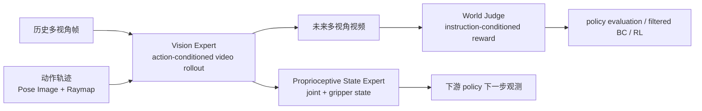
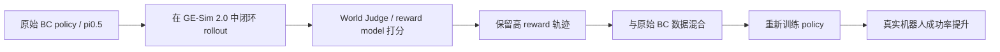

# GE-Sim 2.0：闭环视频世界模拟器导读

> 本文导读 **GE-Sim 2.0: A Roadmap Towards Comprehensive Closed-loop Video World Simulators for Robotic Manipulation**。论文 arXiv 编号为 `2605.27491v1`，2026 年 5 月 26 日提交。项目来自 AgiBot、BUAA、LV-NUS Lab、TJU 等团队，官方项目页为 [ge-sim-v2.github.io](https://ge-sim-v2.github.io/)，代码仓库为 [AgibotTech/GE-Sim-V2](https://github.com/AgibotTech/GE-Sim-V2)。

## 1. 从视频生成到闭环世界模拟

GE-Sim 2.0 的全称是 **Genie Envisioner World Simulator 2.0**。它不是 VLA 策略本身，也不是 MuJoCo / Isaac Sim 这类显式物理引擎。它更准确的定位是：

```text
多视角历史视频帧
    +
机器人动作轨迹
    ↓
动作条件视频世界模型
    ↓
未来多视角 rollout 视频
    +
预测的机器人本体状态
    +
可外接/论文提出的任务评价奖励
```

GE-Sim 2.0 的核心问题不是“策略如何输出动作”，而是“给定策略动作后，世界模型能否像模拟器一样生成后果，并支持策略在学习到的世界中闭环执行、评估和学习”。因此，本章从世界模型与闭环模拟的角度展开。

这篇的价值在于它把 **action-conditioned video generation** 往 **closed-loop world simulator** 推了一步。GE-Sim 1.0 / BWM / WALL-WM 这类方法已经能根据动作生成未来视频，但对机器人策略训练来说，只会生成视频还不够。真正闭环还缺三件事：

1. 策略下一步还需要 proprioception，不能只看视频。
2. rollout 结果需要自动打分，否则每段视频都要人工看。
3. 生成速度要足够快，否则不能大规模评估策略。

GE-Sim 2.0 对应补了三个模块：

- **Proprioceptive State Expert**：从视频 latent 解码双臂关节角和夹爪状态。
- **World Judge**：根据任务指令和生成视频给出成功/进度信号。
- **Acceleration Framework**：用少步推理和跳帧让 rollout 更快。

一句话概括：

> GE-Sim 2.0 的核心不是“视频更像”，而是把视频世界模型做成一个可被策略调用的闭环环境接口。

## 2. 论文、项目、代码和权重入口

| 条目 | 链接 | 当前状态 |
| :--- | :--- | :--- |
| 项目页 | [GE-Sim 2.0 Project Page](https://ge-sim-v2.github.io/) | 官方项目页，含架构、能力展示和应用场景 |
| 论文 | [arXiv:2605.27491](https://arxiv.org/abs/2605.27491) / [HTML](https://arxiv.org/html/2605.27491v1) / [PDF](https://arxiv.org/pdf/2605.27491) | 2026-05-26 提交 |
| GitHub | [AgibotTech/GE-Sim-V2](https://github.com/AgibotTech/GE-Sim-V2) | 已开源代码，仓库包含 server、examples、docs、tests 和 openpi 子模块 |
| Hugging Face | [agibot-world/Genie-Envisioner-Sim-v2.0](https://huggingface.co/agibot-world/Genie-Envisioner-Sim-v2.0) | 已发布 2B world simulator 权重和 pi05 demo policy 权重 |
| Released world model | `gesim_community_v2.0.1_g01op_distill_2B` | 针对 Genie-01 / G01 + OmniPicker 后训练和蒸馏 |
| Demo policy | `pi05_gesim_g01op_test` | 用于 demo task 的闭环 rollout |
| World Judge | 论文提出，HF 模型卡写 `coming soon` | GitHub README 当前说明默认不内置 reward model，需要通过 `RewardClient` 外接 |
| License | GitHub 页面显示 Apache-2.0；README 进一步说明部分数据/代码为 CC BY-NC-SA 4.0 | 复用时需要分别看上游 Diffusers、Cosmos、openpi、Gemma Terms 和仓库说明 |

开源状态要读细。GitHub News 写明 2026-06-25 已发布代码和模型权重；Hugging Face 模型卡写明 released checkpoints 包括 2B world simulator 和 pi05 policy。与此同时，HF 也写到 World Judge `coming soon`，GitHub README 代码示例中 `reward` 默认为 `None`，除非接入自定义 `RewardClient`。因此当前可以复现的是 **replay、world-model server、closed-loop pi05 rollout 和 dashboard**；论文里完整 World Judge reward 学习闭环还不能按官方代码一键复现。

## 3. 总览图：从视频生成到闭环世界模拟器


**图 1 GE-Sim 2.0 总览。** 上半部分是 action-conditioned multi-view rollout：模型根据多视角历史帧和动作轨迹生成未来视频。下半部分是闭环能力：State Expert 给策略补 proprioception，World Judge 给 rollout 打分，二者让世界模型不仅能“看起来像”，还可以被策略评估和继续调用。  
来源：[AgibotTech/GE-Sim-V2 官方 GitHub 仓库](https://github.com/AgibotTech/GE-Sim-V2)。

这张图可以按三层理解。

第一层是 **视觉世界模拟**。输入不是文本 prompt，而是机器人真实观测和动作轨迹。GE-Sim 2.0 接收 head view、left wrist、right wrist 等多视角历史帧，再把 dual-arm action trajectory 投影成空间对齐的动作条件，生成未来多视角视频。

第二层是 **本体状态闭环**。普通视频世界模型只输出图像，策略下一步仍然缺少关节角、夹爪开合等 proprioception。GE-Sim 2.0 用 State Expert 从视频 latent 中预测双臂 joint angles 和 gripper states，这样下游 VLA / policy 可以拿到下一 chunk 所需的视觉和状态观测。

第三层是 **奖励闭环**。World Judge 读取生成的 rollout 和任务指令，输出 ongoing / success 信号。它的目标是把“人工看视频判断成败”变成机器可验证 reward，让世界模型能用于 policy evaluation、数据筛选和 reward-driven learning。

因此它比“动作条件视频生成”多了一步：它试图变成一个 learned environment。

## 4. 论文架构图：GE-Base、GE-Sim 和 GE-Sim 2.0 的关系


**图 2 论文 Figure 1。** GE-Sim 2.0 沿用 GE-Sim 的动作条件视频生成骨架，但在其上增加状态专家和世界判别器，把纯视觉 rollout 扩展成能被策略闭环使用的模拟环境。  
来源：[arXiv HTML: GE-Sim 2.0](https://arxiv.org/html/2605.27491v1)。

论文里先定义了两个前置概念。

**GE-Base** 是多视角视频世界基础模型。它把机器人世界建模成 multi-view text-and-image-to-video generation：给定初始多视角观测、语言指令和长程记忆帧，模型自回归预测未来多视角视频 chunk。它使用 Cosmos-Predict2-2B-Video2World DiT 作为 backbone，通过 latent flow-matching 训练，并使用 cross-view attention 保持视角一致性。

**GE-Sim** 把 GE-Base 从文本驱动改成动作驱动。也就是不再让文本指令直接驱动未来视频，而是把低层机器人动作轨迹作为条件输入，让视频变化跟随动作。这里的动作是双臂 14 维 end-effector action：

```text
left arm:  position + orientation + gripper openness
right arm: position + orientation + gripper openness
```

为了把低维动作对齐到高维视频 latent，GE-Sim 使用了两类空间条件：

- **Pose Image**：把末端执行器位置、方向轴和夹爪开合渲染到像素平面。
- **Camera Raymap**：把每个像素对应的相机射线编码进去，让模型显式知道多视角几何。

这两个条件下采样到 latent 分辨率后，与 noisy video latent 沿 channel 维拼接。这个设计很关键：动作不是附在文本里，也不是后处理控制信号，而是像空间图层一样直接进入视频扩散模型。

**GE-Sim 2.0** 则在 GE-Sim 基础上解决闭环缺口：



这就是“closed-loop video world simulator”的含义：视频生成只是底座，state 和 reward 才让策略能在里面继续运行。

## 5. Action Condition：为什么叫 pixel-aligned

项目页强调 **Pixel-aligned Action Condition**。这个名字不是装饰词，它对应的是动作条件的空间对齐方式。

如果把机器人动作只编码成一个向量，再通过 MLP 注入视频模型，模型需要自己推断“这串数字对应画面里的哪只手、哪个像素、哪个视角”。这对多视角机器人视频很难，尤其是腕部相机和头部相机看到的末端执行器位置完全不同。

GE-Sim 的处理是把动作转成与图像同分辨率对齐的条件图层：

1. 用机器人 FK 和相机标定把末端执行器位置投影到每个相机视角。
2. 把末端姿态的方向轴画成图像平面上的方向编码。
3. 把夹爪开合渲染成可见的 gripper openness cue。
4. 叠加每个像素的 camera raymap。
5. 把这些条件下采样到 latent 空间，与视频 latent 拼接。

这个设计的直觉是：

```text
动作向量告诉模型“机器人要怎么动”
像素对齐动作条件告诉模型“机器人会在画面哪里动”
raymap 告诉模型“这个画面来自哪个相机几何”
```

所以它比纯 action token 更适合多视角视频世界模型。尤其在 head view、left wrist、right wrist 同时生成时，同一个末端动作在不同视角中的投影位置不同，raymap 和 pose image 能减少跨视角错位。

## 6. State Expert：从视频 latent 还原机器人 proprioception


**图 3 Vision Expert 与 Proprioceptive State Expert。** Vision Expert 先生成未来视觉状态；State Expert 再从视频 latent 预测双臂关节角和夹爪开合，使世界模型输出从“未来图像”扩展到“未来视觉 + 未来本体状态”。  
来源：[arXiv HTML: GE-Sim 2.0](https://arxiv.org/html/2605.27491v1)。

为什么需要 State Expert？因为真实 VLA / policy 通常不是只吃图像。很多策略输入包括：

- 多视角 RGB；
- 机器人关节角或末端位姿；
- 夹爪开合；
- 上一段动作或 proprio history。

如果世界模型只生成未来视频，下游 policy 在世界模型中闭环执行时只能用“上一轮 commanded action”近似下一轮 state。但真实机器人里 commanded action 和 actual state 不一定一致。原因包括：

- 夹爪打滑；
- 接触导致末端偏移；
- 机械臂顺应性；
- 关节执行误差；
- 物体阻挡或碰撞；
- 长时程累积误差。

GE-Sim 2.0 的 State Expert 直接从世界模型视频 latent 中解码实际的 joint angles 和 gripper states。论文还使用 history-state augmentation 让它对时间错位和低频扰动更稳，包括 delta-index shift 和 temporal resampling。直觉上，这是为了让 state expert 不只记住完美同步轨迹，而能适应策略和世界模型之间的一点时间错位。

对课程同学来说，这个模块是理解“闭环”的关键：只生成视频不是闭环 simulator，能返回 policy 下一步需要的状态，才接近 `env.step(action) -> obs, reward, state, info` 的接口。

## 7. World Judge：世界模型需要自己打分


**图 4 World Judge。** World Judge 用视觉编码器处理 rollout frames，用文本编码器处理任务指令，再输出每帧或每段的 ongoing / success 信号，让生成视频可以转成自动评估和奖励。  
来源：[arXiv HTML: GE-Sim 2.0](https://arxiv.org/html/2605.27491v1)。

World Judge 要解决的是一个非常实际的问题：世界模型生成的视频如果只能给人看，就很难服务大规模策略训练。策略评估需要 reward，数据筛选需要 reward，offline-to-online 或 model-based RL 也需要 reward。

GE-Sim 2.0 的思路是让 VLM-based judge 看生成 rollout 和任务指令，判断任务是否正在进展、是否成功。项目页里称它为 integrated world-judge reward model；论文把它用于 closed-loop policy evaluation 和 WM-filtered behavior cloning。

但开源边界要写清楚：当前 Hugging Face 模型卡写 **World Judge (coming soon)**；GitHub README 的 `WorldModelEnv` 示例也说明，如果没有 attach `RewardClient`，`reward` 默认为 `None`。也就是说：

```text
论文方法：GE-Sim 2.0 包含 World Judge 作为闭环奖励模块
当前开源仓库：world model / server / demo policy 可跑，reward 需要自定义 RewardClient 或等待官方进一步发布
```

这不是小细节。很多人看到“闭环世界模拟器”会以为下载仓库后就能直接得到自动 reward。实际当前开源版本更适合先做 replay 和 closed-loop rollout；如果要做 reward-driven learning，需要自己接奖励模型或等待官方发布 World Judge。

## 8. 加速：为什么 2.3 秒生成 25 帧很重要

项目页和论文都强调 GE-Sim 2.0 的 acceleration framework：25-frame rollout 在单张 H100 上约 `2.3s`，推理时支持最多 `4x` frame skipping。

这个指标为什么重要？因为世界模型如果只是离线生成几个 demo 视频，慢一点也能接受；但如果要做 policy evaluation，就要跑很多：

```text
任务数 x 初始状态数 x policy checkpoint 数 x rollout seeds x action chunks
```

假设每段 25 帧需要几十秒，那么根本无法用于策略筛选或闭环训练。2.3 秒虽然还不是传统物理仿真器的速度，但已经把视频世界模型推进到“可批量评估”的范围。

论文附录写到，DMD2 acceleration 使用 frozen teacher、student 和 fake-score critic，student 目标是 4 inference steps，训练时随机 1 到 4 步，支持一到少步推理。可以把它理解为把原本多步去噪的 video world model 蒸馏成更快的 few-step simulator。

这里也有边界：加速越强，视频细节和物理一致性越容易受影响。所以 GE-Sim 2.0 同时评估 fidelity 和 closed-loop consistency，而不是只报吞吐。

## 9. WorldArena 第一怎么看


**图 5 WorldArena leaderboard。** 论文显示 GE-Sim 2.0 在 WorldArena public leaderboard 上取得 overall top score，2B 参数规模下超过多个机器人世界模型和闭源通用视频生成器。  
来源：[arXiv HTML: GE-Sim 2.0](https://arxiv.org/html/2605.27491v1)。

用户提到的“全球第一”对应的核心来源是 WorldArena 榜单结果。论文摘要写得很明确：GE-Sim 2.0 在 only 2B parameters 下 tops the public WorldArena leaderboard，并且超过 dedicated robotic world models 与 closed-source general video generators。Hugging Face 模型卡也写它是 **WorldArena CVPR Challenge champion**。

这一能力需要结合其输入输出边界理解。

强在三点：

1. **2B 规模**。不是用超大闭源视频模型硬压，而是在机器人动作条件世界模型设置下做出了高分。
2. **多指标**。WorldArena 不只看画质，也看动作可控性、物理遵循、多视角一致性和任务相关性。
3. **闭环方向**。论文不仅报视频指标，还做 closed-loop policy consistency、World Judge reward quality 和 WM-filtered BC。

边界也有三点：

1. 榜单第一不等于任意真实机器人上都能替代物理仿真器。
2. WorldArena 仍然是 benchmark 协议，不能覆盖所有接触、柔性物、透明物体、力控和安全约束。
3. 当前开源权重是 G01 + OmniPicker 版本，G02 支持还在 roadmap。

所以更准确的说法是：

> GE-Sim 2.0 在 WorldArena 公共榜单上取得第一，证明它是当前很强的机器人视频世界模拟器；但它还不是通用可验证物理引擎。

## 10. 定性结果：为什么比只看画质更重要


**图 6 Pull out plug 定性对比。** GE-Sim 2.0 不仅要让机械臂运动像，还要生成“插头被拔出、台灯熄灭”这种任务状态变化。Ctrl-World 和 DreamDojo 在动作跟随和状态变化上失败。  
来源：[arXiv HTML: GE-Sim 2.0](https://arxiv.org/html/2605.27491v1)。


**图 7 Pour water 定性对比。** 倒水任务考验抓取、提起、倾倒、水流和容器关系。GE-Sim 2.0 在动作跟随和水流生成上更接近真实轨迹。  
来源：[arXiv HTML: GE-Sim 2.0](https://arxiv.org/html/2605.27491v1)。

这两组图说明世界模型不能只看“画面清不清楚”。机器人任务里更重要的是：

- 动作条件有没有被遵守；
- 物体状态是否真的改变；
- 接触是否合理；
- 多视角是否一致；
- 失败轨迹是否能被真实生成，而不是被模型美化成成功。

Pull out plug 的难点是因果状态变化：插头拔出后台灯应该熄灭。Pour water 的难点是液体和容器交互。传统刚体仿真器做液体很难，普通视频生成器又可能只生成“像倒水”的视觉幻觉。GE-Sim 2.0 用大量真实机器人交互数据和动作条件训练，目标就是减少这种 hallucination。

项目页还给了一个很直观的例子：如果只用 expert data 训练，会出现夹爪没有真正抓住毛巾但毛巾跟着移动的幻觉；加入 teleoperation、deployment、interaction 和 failure data 后，这类幻觉减少。这说明失败数据和非专家交互数据不是脏数据，而是世界模型学习真实接触边界的重要来源。

## 11. 长时域和闭环一致性


**图 8 长时域 replay 质量。** 论文把视频分成连续 10 秒段评估 PSNR，GE-Sim 2.0 在长时域 rollout 中退化更慢。  
来源：[arXiv HTML: GE-Sim 2.0](https://arxiv.org/html/2605.27491v1)。


**图 9 世界模型成功率与真实机器人结果对齐。** 每个点表示一个任务，越接近灰色 `y=x` 线，说明世界模型里测得的成功率越接近真实机器人成功率。加入 state conditioning 后对齐更好。  
来源：[arXiv HTML: GE-Sim 2.0](https://arxiv.org/html/2605.27491v1)。

图 9 对机器人世界模型尤其关键。很多视频模型可以生成漂亮结果，但在里面评估策略时并不可靠。一个策略在世界模型里成功，不代表真实世界也成功；如果两者偏差很大，世界模型会误导策略训练。

GE-Sim 2.0 用 closed-loop policy rollout 对比真实机器人结果，发现 full model with state conditioning 更接近真实世界成功率。这支持了前面 State Expert 的设计：只有视觉不够，策略下一步需要更真实的 proprioceptive state。

论文还给了 confusion matrix：


**图 10 闭环仿真和真实任务成败的一致性。** 相比 Ctrl-World，GE-Sim 2.0 有更高 true-positive rate，说明它更能保留真实任务成功模式。  
来源：[arXiv HTML: GE-Sim 2.0](https://arxiv.org/html/2605.27491v1)。

这类评估比单纯 FVD 更接近机器人需求。最终我们关心的是：这个 learned simulator 能不能帮我们判断某个策略真实能不能完成任务。

## 12. WM-filtered BC：世界模型怎样反过来提升策略


**图 11 WM-filtered behavior cloning。** 策略先在 GE-Sim 2.0 中 rollout，World Judge 或 reward model 筛出高回报合成轨迹，再混入原始行为克隆数据训练 π0.5，多个接触密集任务上成功率提升。  
来源：[arXiv HTML: GE-Sim 2.0](https://arxiv.org/html/2605.27491v1)。

这张图回答了“世界模型除了生成视频还能干什么”。

流程可以写成：



这不是传统意义上的纯 synthetic data augmentation。它的关键是 **filtered**：世界模型生成或评估出的轨迹必须经过 reward / judge 筛选，保留更可能成功的样本。如果不筛选，世界模型中的错误轨迹、幻觉成功和动作不一致样本可能会污染策略。

这条线和 RAW-Dream、LWD、Agentic-VLA 可以放在一起看：

- RAW-Dream 在世界模型里 imagined rollout，用 VLM reward 做 RL。
- LWD 用真实部署数据做 offline-to-online RL。
- Agentic-VLA 用 reward synthesis 和 exploration critic 做在线适应。
- GE-Sim 2.0 用 learned world simulator rollout 和 judge reward 做 filtered BC / policy evaluation。

它们都在回答同一个问题：VLA 不能只靠静态专家示教，部署前后都需要更便宜、更自动的反馈信号。

## 13. 官方开源仓库怎么跑

当前仓库已经给了比较实用的入口。建议学习者先跑 **replay**，再跑 **closed-loop rollout**，不要一上来改模型或接自己的机器人。

### 13.1 安装

官方 README 给出的安装方式是：

```bash
git clone --recursive https://github.com/AgibotTech/GE-Sim-V2.git gesim
cd gesim

# GPU world-model server
pip install -e ".[server]"

# 或只安装 client
pip install -e .

# 如果要跑 pi05 policy client
pip install -e third_party/openpi/packages/openpi-client
```

这里 `--recursive` 很重要，因为仓库包含 `third_party/openpi` 子模块。不开子模块会导致 pi05 policy serving 相关代码缺失。

### 13.2 下载权重

```bash
huggingface-cli download agibot-world/Genie-Envisioner-Sim-v2.0 \
  --include "checkpoints/**" \
  --local-dir .
```

这个命令会下载两个主要 checkpoint：

```text
checkpoints/gesim_community_v2.0.1_g01op_distill_2B
checkpoints/pi05_gesim_g01op_test
```

前者是 GE-Sim 2.0 world simulator，后者是用于 demo 任务的 pi05 policy。下载后需要把 `configs/gesim_v2.yaml` 里的 `checkpoint` 指到 world model 文件夹。

### 13.3 Replay 一个记录好的 episode

两个终端运行：

```bash
# terminal 1: world-model server
MODEL=gesim_v2 CONFIG=configs/gesim_v2.yaml bash scripts/serve_world_model.sh
```

```bash
# terminal 2: replay
python examples/replay.py \
  --server http://localhost:9000 \
  --episode assets/demo_000 \
  --output-dir outputs/replay
```

这个 smoke test 的意义是验证 world-model server、demo bundle、action conditioning 和视频输出链路可用。它不需要策略闭环，只是把记录好的 episode 输入世界模型做生成。

### 13.4 闭环 policy rollout

三个终端运行：

```bash
# terminal 1: world-model server
MODEL=gesim_v2 CONFIG=configs/gesim_v2.yaml bash scripts/serve_world_model.sh
```

```bash
# terminal 2: pi05 policy server
OPENPI_CKPT=checkpoints/pi05_gesim_g01op_test bash scripts/serve_policy_pi05.sh
```

```bash
# terminal 3: closed-loop rollout
python examples/closed_loop.py \
  --server http://localhost:9000 \
  --policy ws://localhost:8000 \
  --episode assets/demo_000 \
  --steps 8
```

这一步才接近 `env.step(actions)`。GitHub Quickstart 的 Python 示例显示：

```python
from gesim import WorldModelEnv
from gesim.policies import OpenPIPolicy

env = WorldModelEnv("http://localhost:9000")
policy = OpenPIPolicy("ws://localhost:8000")
policy.reset()
obs = env.reset("assets/demo_000", conditioning="action")

for _ in range(8):
    actions = policy.infer(obs)
    obs, reward, state, info = env.step(actions)

env.save_video("rollout.mp4")
```

这里 `state` 是 `(T, 16)` 预测机器人状态。`reward` 默认是 `None`，除非你通过 `WorldModelEnv(reward=...)` 接了 RewardClient。

### 13.5 Dashboard

world-model server 会在 `http://localhost:9000` 提供 live dashboard。可以看到：

- 当前 phase；
- step count；
- policy commanded action；
- world model predicted robot state；
- 最新生成帧预览。

如果只是想看 dashboard，不加载真实模型，可以运行：

```bash
python -m gesim.server --demo
```

然后打开浏览器访问 server URL。这适合做 UI 和接口理解，不代表模型推理已经成功。

## 14. 官方 rollout 示例：成功和失败都要看

官方仓库提供了 pi05 policy 在 GE-Sim 2.0 中闭环 rollout 的示例。每个 clip 把 head、left wrist、right wrist 三个视角横向拼接。强策略能完成任务，弱策略会出现 missed grasp、dropped object 等失败。

<table>
  <tr>
    <td width="33%" align="center">
      
      <br><strong>图 12a 成功 rollout 示例 1</strong>
    </td>
    <td width="33%" align="center">
      
      <br><strong>图 12b 成功 rollout 示例 2</strong>
    </td>
    <td width="33%" align="center">
      
      <br><strong>图 12c 成功 rollout 示例 3</strong>
    </td>
  </tr>
</table>

来源：[AgibotTech/GE-Sim-V2 官方 GitHub 仓库](https://github.com/AgibotTech/GE-Sim-V2)。

<table>
  <tr>
    <td width="33%" align="center">
      
      <br><strong>图 13a 失败 rollout 示例 1</strong>
    </td>
    <td width="33%" align="center">
      
      <br><strong>图 13b 失败 rollout 示例 2</strong>
    </td>
    <td width="33%" align="center">
      
      <br><strong>图 13c 失败 rollout 示例 3</strong>
    </td>
  </tr>
</table>

来源：[AgibotTech/GE-Sim-V2 官方 GitHub 仓库](https://github.com/AgibotTech/GE-Sim-V2)。

为什么失败示例也很重要？因为一个可用的 world simulator 必须能生成失败。只会把所有动作都美化成成功的视频模型，不能用于策略评估；它会让弱策略在模拟器里看起来很强，最终误导真实部署。

GE-Sim 2.0 的训练数据包含 teleoperation、on-robot policy deployment、rich object interaction、successful executions 和 failure trajectories。失败轨迹对学习边界状态很重要，例如抓空、掉落、滑动、接触不稳定和任务阶段顺序错误。

## 15. 和 BWM、τ0-WM、RAW-Dream 的关系

| 方法 | 主要输入 | 主要输出 | 核心用途 | GE-Sim 2.0 的区别 |
| :--- | :--- | :--- | :--- | :--- |
| BWM | 初始图像 / 历史帧 + 动作轨迹 | 动作条件未来视频 | 低成本视觉世界模拟、WorldArena 评测 | BWM 更偏视频 rollout；GE-Sim 2.0 补 state expert、judge、server/client 闭环接口 |
| τ0-WM | 多视角观测、语言、状态、候选动作 | action chunk、未来视频、progress score | 执行前 propose/evaluate/revise | τ0-WM 把动作生成和动作评估统一；GE-Sim 2.0 更像外部 world simulator 环境 |
| RAW-Dream | VLA action + task-agnostic world model + VLM reward | imagined RL 更新 | 在世界模型中强化 VLA | RAW-Dream 偏训练范式；GE-Sim 2.0 偏可服务化的 learned simulator |
| WALL-WM | 当前观测 + 事件级动作条件 | 事件级未来视频/动作 | 长时程事件级预演 | GE-Sim 2.0 更强调多视角、proprioception 和 policy closed-loop consistency |
| RoboDream | robot-only 轨迹 + scene/object priors | 合成机器人示教视频 | 数据生成 | GE-Sim 2.0 更强调动作条件闭环评估，而不是主要做数据合成 |

这几篇可以放在同一个世界模型方向里读。它们共同回答“机器人能不能在真实执行前先预演”，但 GE-Sim 2.0 的特点是把预演结果包装成环境接口：

```text
env.reset(...)
obs, reward, state, info = env.step(actions)
```

这比“生成一个 mp4 给人看”更接近机器人训练系统需要的形式。

## 16. 当前复现边界

GE-Sim 2.0 已经比很多前沿世界模型更可操作，但仍有边界。

第一，当前 released checkpoint 是 **G01 + OmniPicker** 版本。Hugging Face 写明它是 post-trained on Genie-01(G01) + OmniPicker(OP) data，G02 支持在 roadmap。其他机器人不能直接假设即插即用。

第二，World Judge 尚未完整开源。论文和项目页展示了 integrated world judge，但 HF 模型卡写 `coming soon`，GitHub README 说明 reward 默认为空，需要接入 `RewardClient`。当前公开版本因此不包含可直接运行的 reward-driven learning 完整链路。

第三，它不是严格物理仿真器。它主要输出视频和预测状态，不提供可验证接触力、碰撞约束、刚体求解器、关节动力学和安全边界。对真实机器人训练来说，仍然需要真实验证和安全门控。

第四，视频世界模型有 hallucination 风险。即使 GE-Sim 2.0 比前代减少了动作跟随失败，长时域、遮挡、柔性物、透明物体、液体和细接触仍然可能出错。

第五，算力门槛不低。论文报的是单 H100 2.3 秒 25 帧 rollout；普通消费级 GPU 能否稳定跑完整 server，要看显存、kernel、diffusers/cosmos 依赖和 checkpoint 配置。

## 17. 组队学习推荐题

在 Task04 世界模型方向可以这样布置：

> 对比 BWM、τ0-WM、GE-Sim 2.0：三者都和动作条件视频世界模型有关，但 BWM 主要展示动作条件视频 rollout，τ0-WM 统一动作生成、视频预测和测试时动作修正，GE-Sim 2.0 则把世界模型包装成可闭环调用的 simulator。请说明三者的输入输出、是否返回 proprioception、是否内置 reward、当前开源边界和适合复现的最小 demo。

交付可以不训练模型，但要讲清楚：

- GE-Sim 2.0 为什么不只是视频生成模型？
- Pixel-aligned Action Condition 解决了什么问题？
- State Expert 为什么对闭环 policy rollout 必要？
- World Judge 当前论文里有，开源仓库里哪些部分还需要等待或自接？
- `WorldModelEnv.step(actions)` 返回的 `obs / reward / state / info` 分别代表什么？
- WorldArena 第一说明了什么，不能说明什么？

## 18. 推荐阅读顺序

建议按下面顺序读：

1. 先看项目页的 Architecture Diagram，理解三大新能力：state、judge、acceleration。
2. 看 GitHub README 的 Quickstart，确认它已经从论文方法走到可运行 server/client。
3. 看 arXiv Figure 1-3，弄清 action-conditioned rollout、State Expert、World Judge。
4. 看 Figure 7-10，理解 WorldArena、真实机器人对齐、WM-filtered BC 和 confusion matrix。
5. 最后读 docs 里的 installation、replay、closed-loop 和 adding rewards。

这篇最值得带走的观点是：

> 机器人世界模型的下一步不是只生成更好看的未来视频，而是输出策略能继续使用的状态，并给 rollout 结果提供可机器验证的评价信号。

## 19. 资料来源

本文图片来自 [GE-Sim 2.0 官方项目页](https://ge-sim-v2.github.io/)、[AgibotTech/GE-Sim-V2 官方 GitHub 仓库](https://github.com/AgibotTech/GE-Sim-V2) 和 [arXiv HTML](https://arxiv.org/html/2605.27491v1)，为了教程稳定访问已保存到本地 `assets/`。文字内容参考 [arXiv:2605.27491](https://arxiv.org/abs/2605.27491)、[GitHub README](https://github.com/AgibotTech/GE-Sim-V2)、[Hugging Face 权重页](https://huggingface.co/agibot-world/Genie-Envisioner-Sim-v2.0) 和官方项目页。
