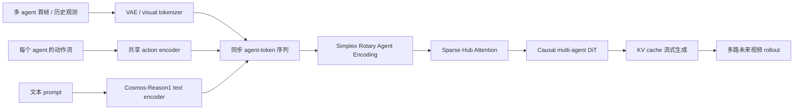

# Gamma-World：从单智能体世界模型走向多智能体共享世界

这篇导读对应论文 **Gamma-World: Generative Multi-Agent World Modeling Beyond Two Players**，项目名也写作 **γ-World**。它由 NVIDIA、清华大学、多伦多大学和 Vector Institute 共同完成，arXiv 版本发布于 2026-05-27，项目页在 2026-05-28 放出，代码和训练 pipeline 在 2026-06-16 开源。

本章适合放在 `17-具身世界模型` 章节中，接在 LeWM、RISE、RAW-Dream、WoG、WALL-WM、RoboDream 之后。它不是 VLA 基座，也不是单纯的视频生成模型，而是一个面向交互式仿真的 **多智能体生成式世界模型**：给定多个 agent 的同步观测和动作，生成同一个共享世界中多个视角的未来视频。

学完这一章后，重点抓住一个判断：

> γ-World 的核心不是“把多个单人世界模型并排跑”，而是在模型结构里显式加入 agent 轴，让多个可独立控制的 agent 在同一个生成世界里保持因果耦合、视角一致和实时响应。

## 1. 项目、论文、代码和模型入口

| 项目 | 信息 |
| :--- | :--- |
| 项目页 | [NVIDIA Research: γ-World](https://research.nvidia.com/labs/sil/projects/gamma-world/) |
| 论文 | [arXiv:2605.28816](https://arxiv.org/abs/2605.28816) |
| HuggingFace Paper | [Gamma-World: Generative Multi-Agent World Modeling Beyond Two Players](https://huggingface.co/papers/2605.28816)，2026-05-28 为 `#1 Paper of the day` |
| 代码仓库 | [nv-tlabs/Gamma-World](https://github.com/nv-tlabs/Gamma-World)，Apache-2.0 |
| 模型权重 | [chijw/Gamma-World](https://huggingface.co/chijw/Gamma-World) |
| 基座 | [nvidia/Cosmos-Predict2.5-2B](https://huggingface.co/nvidia/Cosmos-Predict2.5-2B) / Cosmos-Predict2.5 系列 |
| 文本编码器 | [nvidia/Cosmos-Reason1-7B](https://huggingface.co/nvidia/Cosmos-Reason1-7B)，需要接受 NVIDIA Open Model License |
| 官方文档 | [Setup](https://github.com/nv-tlabs/Gamma-World/blob/main/docs/setup.md)、[Inference](https://github.com/nv-tlabs/Gamma-World/blob/main/docs/inference.md)、[Training](https://github.com/nv-tlabs/Gamma-World/blob/main/docs/training.md) |

HuggingFace “日榜第一”说明这篇在社区热度上很高，但它不是一个独立的机器人成功率排行榜。看技术价值时，还是要回到论文里的三个核心问题：多智能体身份如何表示、agent 之间如何通信、如何做到实时流式 rollout。

## 2. 官方效果预览：多个 agent 活在同一个生成世界里

<p align="center">
  
</p>

**图 1 官方 intro 视频转 GIF。** γ-World 从多个 agent 的初始视角和动作流出发，生成同一个共享环境里的多路未来视频。不同 agent 可以独立控制，但它们看到的是同一个会随大家动作共同变化的世界。

来源：[γ-World NVIDIA 项目页](https://research.nvidia.com/labs/sil/projects/gamma-world/)。

这张动态图里最重要的不是画质，而是“共享世界一致性”。如果 agent A 往前走、agent B 转头看，两个视角中环境变化应该互相兼容；如果一个 agent 改变了场景中的状态，另一个 agent 的视角不能像在另一个平行宇宙里一样无感。单智能体世界模型通常只预测一个控制流对应的未来，而 γ-World 要同时处理多条动作流和多路视角。

## 3. 为什么多智能体世界模型不是简单拼接

过去很多交互式世界模型可以理解成“一个玩家操作一个世界”：

```text
first frame + prompt + one action stream -> future video
```

多智能体场景需要变成：

```text
shared initial world
  + agent_1 observation/action
  + agent_2 observation/action
  + ...
  + agent_N observation/action
  -> synchronized future videos for all agents
```

直接把多个视角在空间上拼接，或者给每个玩家分配一个固定 slot embedding，会遇到三个问题。

| 问题 | 具体表现 | 后果 |
| :--- | :--- | :--- |
| 独立可控性 | 每个 agent 都有自己的动作流，模型不能把所有动作混成一个全局控制信号 | A 的动作可能错误影响 B 的局部运动，或 B 的动作被忽略 |
| 置换对称性 | agent 的编号不应该带有“玩家 1 永远特殊、玩家 2 永远次要”的语义 | 训练两个玩家后，很难自然扩到四个玩家 |
| 通信成本 | 如果所有 agent token 做 dense all-to-all attention，复杂度随 agent 数平方增长 | 四人、八人场景延迟和显存会快速变差 |

γ-World 的设计正是围绕这三点展开：用 **Simplex Rotary Agent Encoding** 表示身份，用 **Sparse Hub Attention** 负责跨 agent 通信，再用 **block-causal student + KV cache + few-step distillation** 做实时流式生成。

## 4. 总览图：共享世界、多路视角、动作响应

<p align="center">
  
</p>

**图 2 γ-World teaser。** 图中同时展示两智能体和四智能体场景，以及真实机器人双臂协调。它要生成的是同一环境里多个 agent 的同步未来，而不是互不相干的几段视频。

来源：[γ-World NVIDIA 项目页](https://research.nvidia.com/labs/sil/projects/gamma-world/)。

这张图可以按三层读。

第一层是 **game scene**。Minecraft 风格的多人环境提供离散键盘动作和连续相机动作，适合验证“多人共享场景 + 动作响应 + 视角一致”。

第二层是 **multi-agent scaling**。论文重点展示从 two-agent 训练泛化到 four-agent 推理，不需要为四人场景重新训练一个固定 slot 模型。

第三层是 **robotics coordination**。真实机器人场景中，论文把左右机械臂视为两个 agent，每个 agent 有自己的连续末端动作。这个实验说明 γ-World 的多智能体接口不只适用于游戏控制，也可以套到机器人多臂协同场景。

## 5. 方法图：显式 agent 轴 + causal multi-agent DiT

<p align="center">
  
</p>

**图 3 γ-World 方法图。** 模型接收同步的多 agent 观测和动作，把每个 agent 的视觉/action stream token 化，再通过 Simplex Rotary Agent Encoding 和 Sparse Hub Attention 生成未来多视角 rollout。

来源：[γ-World NVIDIA 项目页](https://research.nvidia.com/labs/sil/projects/gamma-world/)。

把这张图拆开后，可以看到 γ-World 的主链路：



关键点是 `agent` 被建模成一个显式轴，而不是把所有图片粗暴拼到一起。论文附录给出的实现细节是：游戏输入每个 agent 每帧有 25 维动作，包含 23 个离散键盘控制和 2 个连续相机控制；机器人输入每个机械臂每帧有 10 维连续动作，包含 3D 末端位置、6D 姿态和 gripper 开合。

## 6. Simplex Rotary Agent Encoding：为什么不用普通玩家编号

多智能体模型必须知道“这是哪个 agent 的 token”，但这个身份不能写死成普通 slot。比如训练时只有两个玩家，如果模型学到“slot 0 总是左边玩家、slot 1 总是右边玩家”，推理时加入第三、第四个玩家就会很别扭。

γ-World 用的是 **Simplex Rotary Agent Encoding**。直观理解：

- 不是给 agent 学一个可训练 embedding。
- 不是简单用整数编号 0、1、2、3。
- 而是把 agent 放到 rotary angle space 中一个正单纯形的顶点上。

正单纯形的好处是：每个顶点之间距离相等。换句话说，每个 agent 都有不同相位，但任意两个 agent 之间没有“谁更特殊”的偏置。这就对应论文里说的 permutation-equivalent：交换 agent 顺序后，模型不应该因为 slot 编号本身改变语义。

可以把它理解成：

```text
普通 slot embedding：
agent_0 有固定角色偏置
agent_1 有固定角色偏置
agent_2 训练时可能没见过

Simplex RoPE：
agent A/B/C/D 都拿到不同旋转相位
任意两个 agent 的几何关系等价
模型更容易从 2-agent 泛化到 4-agent
```

论文实现中还用了一个很有用的训练 trick：使用大小为 4 的 simplex pool，但训练时只激活 2 个 runtime slots；每步随机采样 2 个顶点并打乱 agent slot 顺序，迫使模型不要记死 slot，而是通过 simplex marker 区分玩家。这就是它能讲“two-player training -> four-player inference”的基础之一。

## 7. Sparse Hub Attention：多 agent 通信不能全量两两互看

<p align="center">
  
</p>

**图 4 Sparse Hub Attention 效率对比。** Dense cross-agent attention 的计算随 agent 数快速增长；Sparse Hub Attention 通过少量 hub token 作为共享通信通道，把跨 agent 通信成本从平方级压到线性级。

来源：[γ-World NVIDIA 项目页](https://research.nvidia.com/labs/sil/projects/gamma-world/)。

如果有 N 个 agent，最直接的办法是所有 agent token 做 dense all-to-all attention。这样表达能力强，但复杂度是 `O(N^2)`，agent 越多越难实时。

Sparse Hub Attention 的想法很像给多智能体系统建一个“共享公告板”：

```text
agent_1 tokens -> hub tokens <- agent_2 tokens
agent_3 tokens -> hub tokens <- agent_4 tokens
```

每个 agent 主要看自己的 token 和 hub token；hub token 汇总跨 agent 信息，再广播回各个 agent。这样 agent 之间不需要两两密集 attention，也能通过 hub 交换共享世界状态。

论文默认使用 `K = 8` 个 hub tokens。附录消融显示，K 从 1 增到 8 后质量明显提升，继续增到 32/128 会略有改善，但计算开销也会增加。因此 K=8 是一个偏工程化的折中：足够承载跨 agent 交互，又不会把通信通道变得太重。

## 8. Teacher、Causal Student 和 Few-Step Distillation

γ-World 要做实时交互，不能只追求离线视频质量。论文把训练分成三阶段：

```text
bidirectional teacher -> causal student -> DMD / few-step student
```

| 阶段 | 作用 | 特点 |
| :--- | :--- | :--- |
| Bidirectional teacher | 学高质量多智能体未来分布 | 可以看完整上下文，质量高，但不能实时流式 |
| Causal student | 学块级自回归生成 | 只看过去 block，支持 KV cache，但质量会下降 |
| DMD / few-step student | 把 causal student 压成少步采样 | 4 步 denoising，面向 24 FPS 交互响应 |

这三个阶段对应一个典型工程取舍：高质量 diffusion teacher 往往慢，causal streaming student 能交互但质量差一些；蒸馏的目标就是尽量保留 teacher 的质量，同时保留 student 的在线生成能力。

官方推理文档里给了三个模式：

| `--mode` | 含义 | 采样 |
| :--- | :--- | :--- |
| `bidirectional` | full-context teacher | 约 35 steps，single-shot |
| `causal` | block-causal student | 约 35 steps，KV-cache |
| `causal_few_step` | distilled streaming student | 4 steps `[1000, 750, 500, 250]`，KV-cache |

所以课程复现时应优先跑 `causal_few_step`。它不是最强离线质量模式，但最符合 γ-World 的核心卖点：动作响应式、流式、接近实时。

## 9. 双人互动、四人泛化和机器人协同

<p align="center">
  
</p>

**图 5 两智能体互动结果。** 两个 agent 可以独立输入动作，但生成结果仍然保持同一世界中的时空一致。

来源：[γ-World NVIDIA 项目页](https://research.nvidia.com/labs/sil/projects/gamma-world/)。

<p align="center">
  
</p>

**图 6 四智能体泛化视频转 GIF。** 官方结果展示了从 two-agent 训练到 four-agent 推理的零样本扩展。

来源：[γ-World NVIDIA 项目页](https://research.nvidia.com/labs/sil/projects/gamma-world/)。

<p align="center">
  
</p>

**图 7 真实机器人双臂协调。** 论文使用 RealOmin-Open 数据，把左右机械臂视为两个互相影响的 agent，动作格式是连续末端位姿和夹爪开合。

来源：[γ-World NVIDIA 项目页](https://research.nvidia.com/labs/sil/projects/gamma-world/)。

机器人这部分要读得冷静一些。它说明同一套多智能体世界模型接口可以接入真实机器人双臂数据，但它还不是一个机器人闭环控制器，也不是可以替代 Isaac Sim / MuJoCo 的物理仿真器。它生成的是动作条件视频 rollout，用于理解多 agent 未来观测，而不是直接输出真实机器人力控轨迹。

## 10. 实验结果怎么读

论文把 γ-World 和 Solaris、frame concat 等 baseline 做了对比。下面只摘最关键的 FVD/FID 结果，数值越低越好。

| 方法 | Memory FVD / FID | Grounding FVD / FID | Movement FVD / FID | Building FVD / FID | Consistency FVD / FID |
| :--- | :--- | :--- | :--- | :--- | :--- |
| Frame concat | 450.6 / 69.8 | 528.3 / 63.2 | 556.9 / 65.0 | 551.8 / 87.3 | 576.0 / 123.2 |
| Solaris | 333.8 / 51.7 | 301.9 / 36.1 | 311.1 / 36.3 | 448.6 / 71.0 | 443.1 / 94.8 |
| γ-World | 184.1 / 24.8 | 199.3 / 24.0 | 191.5 / 21.2 | 264.5 / 32.1 | 280.0 / 46.9 |

这张表说明它不是只在一个单项上好看，而是在记忆、语言/目标 grounding、移动、建造和一致性这些多人交互维度上都明显优于 baseline。尤其是 Consistency，它对应的正是多智能体共享世界最容易崩的地方。

架构消融也值得看：

| 组合 | Agent Encoding | Interaction | FVD | FID | LPIPS | PSNR | SSIM |
| :--- | :--- | :--- | :--- | :--- | :--- | :--- | :--- |
| Spatial concat | None | Full | 312.4 | 38.7 | 0.326 | 24.8 | 0.782 |
| Sequence concat | None | Full | 285.6 | 35.2 | 0.298 | 25.6 | 0.798 |
| Sequence concat | View embedding | Full | 256.3 | 32.4 | 0.281 | 26.4 | 0.815 |
| Sequence concat | Simplex | Full | 228.5 | 29.6 | 0.265 | 27.5 | 0.830 |
| γ-World full | Simplex | Sparse Hub | 223.4 | 30.2 | 0.269 | 27.7 | 0.836 |

这张表的读法是：先从 spatial concat 变成 sequence concat，说明把 agent/时间组织成更合适的 token 序列有帮助；再从 view embedding 换成 Simplex，说明置换对称身份编码有帮助；最后换成 Sparse Hub，FVD 和 SSIM 继续更好，同时换来更好的 scaling。

## 11. 怎么复现：当前最现实的学习路线

γ-World 已经开源代码和训练 pipeline，但完整训练很重。官方附录写到 teacher 和 causal student 都在 32 张 NVIDIA GB200 上训练，普通学习者不应该一上来复刻全量训练。建议按下面顺序做：

### 11.1 环境准备

官方要求：

- Linux x86-64。
- NVIDIA Ampere 架构或更新 GPU。
- NVIDIA driver `>=570.124.06`，CUDA 12.8.1 兼容。
- glibc `>=2.35`，例如 Ubuntu 22.04+。
- `git-lfs`，因为仓库里有 LFS 管理的示例/资产。

推荐先用官方 Docker 或 `uv` 环境，不建议在旧 conda 环境里硬装。

```bash
git clone https://github.com/nv-tlabs/Gamma-World.git
cd Gamma-World
git lfs pull

sudo apt update && sudo apt -y install curl ffmpeg libx11-dev tree wget
curl -LsSf https://astral.sh/uv/install.sh | sh
source "$HOME/.local/bin/env"
uv python install
uv sync --extra=cu128
source .venv/bin/activate
```

如果使用 CUDA 13.0，例如 DGX Spark 或 Jetson AGX，官方文档要求换成：

```bash
uv sync --extra=cu130
```

### 11.2 权重下载

Gamma-World 会用到三类权重：

| 组件 | HuggingFace repo | 内容 |
| :--- | :--- | :--- |
| World-model networks | `chijw/Gamma-World` | `bidirectional/`、`causal/`、`causal-few-step/` 的 `model.safetensors` |
| VAE tokenizer | `chijw/Gamma-World` | `tokenizer.pth` |
| Text encoder | `nvidia/Cosmos-Reason1-7B` | 文本 prompt 编码器 |

需要先准备 HuggingFace token，并在 Cosmos-Reason1-7B 页面接受 NVIDIA Open Model License。

```bash
uv tool install -U "huggingface_hub[cli]"
hf auth login
hf download chijw/Gamma-World --local-dir ./checkpoints/Gamma-World
hf download nvidia/Cosmos-Reason1-7B --local-dir ./checkpoints/Cosmos-Reason1-7B
```

如果联网顺畅，也可以直接用官方默认的 `hf://` URI，让脚本首次运行时自动下载。

### 11.3 最小推理 smoke test

官方仓库自带 `data/` 示例。每个 sample 目录包括：

- `first_frame.png`：横向拼接的多玩家首帧。
- `prompt.txt`：文本提示。
- `action_left.json` / `action_right.json`，或 `action_0.json` 到 `action_N.json`：每个 agent 的动作序列。

最小推理命令：

```bash
torchrun --nproc_per_node=1 scripts/inference.py \
    --mode causal_few_step \
    --eval-dir data \
    --n-players 2 \
    --max-eval-samples 1 \
    --output results/examples
```

成功后应看到：

```text
results/examples/<sample>/generated.mp4
```

这个 smoke test 证明三件事：环境能加载、HuggingFace 权重能取到、`causal_few_step` 推理链路能生成视频。它不证明你复现了论文指标，也不证明真实机器人场景可用。

### 11.4 四智能体测试

四智能体不需要重新训练，但输入样本必须匹配四个 agent：

- `first_frame.png` 需要横向拼接四个 view。
- 动作文件需要 `action_0.json`、`action_1.json`、`action_2.json`、`action_3.json`。
- 推理时设置 `--n-players 4`。

示例命令形态：

```bash
torchrun --nproc_per_node=1 scripts/inference.py \
    --mode causal_few_step \
    --eval-dir /path/to/four_player_samples \
    --n-players 4 \
    --output results/four_player
```

这里真正难的是准备合规的四玩家输入数据，而不是改一行参数。教程作业中如果没有数据，可以先阅读官方四智能体可视化，不强行复刻四人 demo。

### 11.5 训练入口

官方训练是三阶段：

```text
Cosmos-Predict2.5-2B init
  -> bidirectional teacher
  -> causal student
  -> DMD / causal_few_step student
```

训练前要把 Cosmos-Predict2.5-2B checkpoint 转成 DCP：

```bash
PRETRAINED_CKPT=$(uvx "hf>=1.3.5" download nvidia/Cosmos-Predict2.5-2B \
    --repo-type model \
    --revision 15a82a2ec231bc318692aa0456a36537c806e7d4 \
    base/pre-trained/d20b7120-df3e-4911-919d-db6e08bad31c_ema_bf16.pt)

python scripts/convert_checkpoint_to_dcp.py \
    --input "$PRETRAINED_CKPT" \
    --output /path/to/converted_pretrained_dcp
```

官方训练文档里给了 8 卡 `torchrun` 入口，但论文级训练量远高于普通学习者资源。对开源教程来说，更合理的实践目标是：

- 先跑通推理。
- 再读懂 `gamma_world/_src/gamma_world/datasets/` 的多 agent 数据格式。
- 最后只做 mock data 或小数据 smoke training，验证 trainer 和 config 链路。

## 12. 和本仓库其他世界模型的关系

| 教程 | 类型 | 和 γ-World 的区别 |
| :--- | :--- | :--- |
| LeWM | 早期具身世界模型导读与复现 | 更偏单智能体机器人世界建模入门 |
| RISE | 世界模型 + 自我改进策略 | 重点是用 imagined rollout 改策略 |
| RAW-Dream | 任务无关 WM 中强化 VLA | 用视频世界模型和 VLM reward 做 VLA 后训练 |
| WoG | 条件空间世界模型 | 把未来观测压成动作相关 latent condition |
| WALL-WM | 事件级世界动作模型 | 按事件边界预演动作和视频 |
| RoboDream | 可组合世界模型数据合成 | 用 robot-only 轨迹、scene/object prior 合成示教 |
| γ-World | 多智能体生成式世界模型 | 重点是共享世界、多 agent 独立控制、置换对称和实时流式 rollout |

如果按“世界模型到底在预测什么”来分类，γ-World 预测的是 **多 agent 同步未来视频**。如果按“它服务什么机器人问题”来分类，它服务的是多机器人、多臂协作、多人游戏/仿真数据生成，以及未来可能的多智能体策略训练。

## 13. 局限和后续可追踪问题

第一，当前主要实验仍集中在 Minecraft 风格游戏环境，机器人部分是定性展示和真实双臂数据上的未来帧生成，还不能等同于闭环机器人控制成功率。

第二，实时 24 FPS 是在官方设定和硬件目标下的工程结果。普通单卡环境能否达到同样帧率，取决于 GPU、分辨率、玩家数、采样模式和 I/O。

第三，四智能体泛化来自 two-agent training + simplex pool + permutation training 的结构设计，但更多 agent、更复杂物理接触、更长时域记忆仍然是开放问题。

第四，Sparse Hub Attention 用 hub token 压缩跨 agent 通信，效率很好，但 hub 容量过小可能丢失细粒度交互；hub 容量过大又会接近 dense communication 的成本。

第五，它还不是传统物理仿真器。它可以生成 action-conditioned video rollout，但不提供严格的碰撞、动力学、接触力和可验证状态转移。对机器人训练来说，它更像“可交互视频世界模型”和“数据生成/评估辅助工具”，不是 MuJoCo / Isaac Sim 的直接替代。

## 14. 推荐阅读顺序

建议按下面顺序读：

1. [扩散数理基础及问题解析入门](../1、扩散数理基础及问题解析入门/扩散数理基础及问题解析入门.md)：先理解视频扩散和采样的基本概念。
2. [WoG 条件空间世界模型导读](../WoG条件空间世界模型导读/README.md)：理解世界模型不一定都要显式生成完整未来视频。
3. [RAW-Dream 任务无关世界模型强化 VLA 导读](../RAW-Dream任务无关世界模型强化VLA/README.md)：理解视频世界模型如何服务 VLA 后训练。
4. [RoboDream 可组合世界模型数据合成导读](../RoboDream可组合世界模型数据合成导读/README.md)：理解世界模型和数据合成的关系。
5. 本文：理解多智能体世界模型为什么需要新的 agent identity、cross-agent communication 和 streaming inference 设计。

## 15. 参考链接

- [γ-World NVIDIA Project Page](https://research.nvidia.com/labs/sil/projects/gamma-world/)
- [Gamma-World GitHub](https://github.com/nv-tlabs/Gamma-World)
- [Gamma-World HuggingFace Model](https://huggingface.co/chijw/Gamma-World)
- [Gamma-World HuggingFace Paper](https://huggingface.co/papers/2605.28816)
- [Gamma-World arXiv](https://arxiv.org/abs/2605.28816)
- [Cosmos-Predict2.5-2B](https://huggingface.co/nvidia/Cosmos-Predict2.5-2B)
- [Cosmos-Reason1-7B](https://huggingface.co/nvidia/Cosmos-Reason1-7B)
