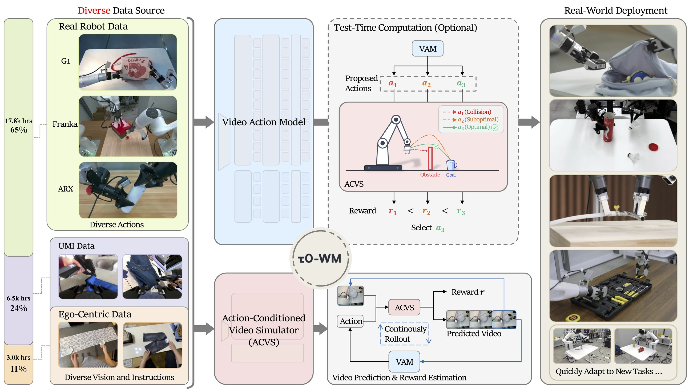
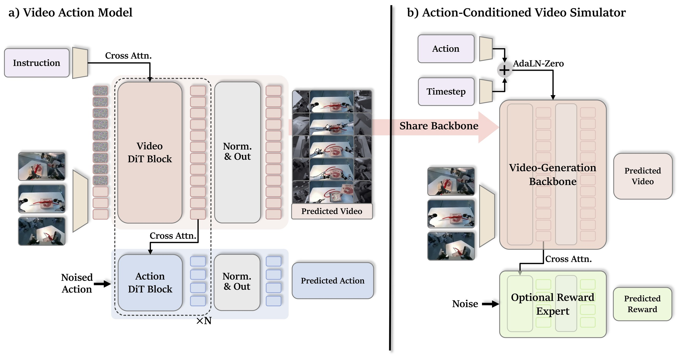
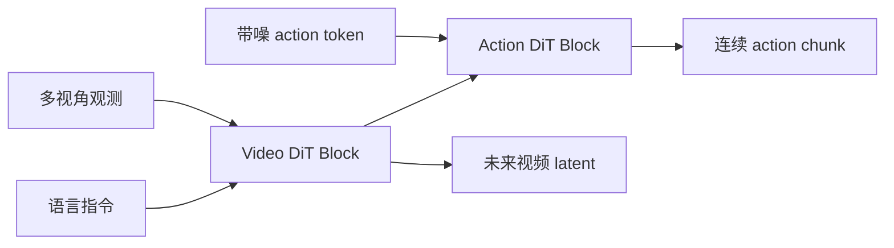
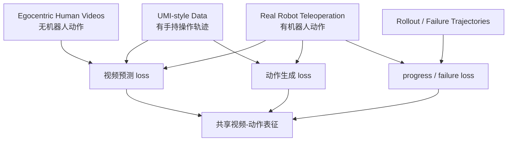
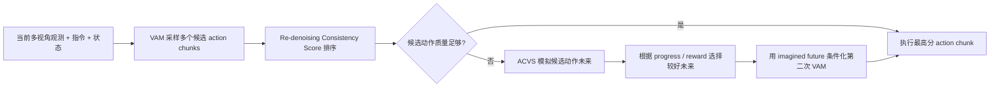
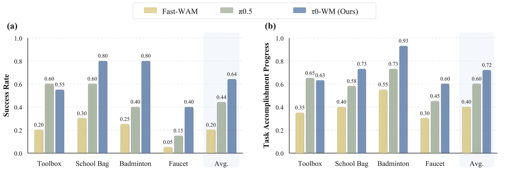

# τ0-WM：统一视频-动作世界模型导读

> 本文导读论文 **τ0-WM: A Unified Video-Action World Model for Robotic Manipulation**。它来自 Shanghai Innovation Institute 与 AGIBOT Finch，项目页发布时间为 2026-05-31。官方把它定位为一个面向机器人操作的开源 video-action world model：既能预测动作，也能预测动作导致的未来视频，还能在测试时用 imagined future 评估和修正动作。

## 1. 先说结论

τ0-WM 不是单纯的 VLA，也不是只会生成视频的世界模型。它试图把三件事放到同一个框架里：

1. **Action Generation**：像策略模型一样，根据多视角观测、语言指令和机器人状态输出可执行 action chunk。
2. **Video Prediction**：像视频世界模型一样，预测未来多视角视觉 latent / 视频。
3. **Action Evaluation**：像 learned simulator / reward model 一样，给候选动作 rollout 出未来，并估计任务进度分数。

一句话概括：

> τ0-WM 的核心不是“机器人会生成视频”，而是让机器人在执行前先提出动作、想象动作后果、评估后果，再必要时修正动作。

τ0-WM 虽然包含策略接口，但核心创新是把策略、视频预测、动作条件模拟器和测试时计算统一为世界模型式决策机制，因此本章从世界模型角度展开。

## 2. 论文、项目和开源状态

| 条目 | 链接 | 当前状态 |
| :--- | :--- | :--- |
| 项目页 | [AGIBOT Finch τ0-WM](https://finch.agibot.com/research/tau0-wm) | 官方项目页，含图、视频、论文、代码和 HF 入口 |
| 论文 | [arXiv:2606.01027](https://arxiv.org/abs/2606.01027) / [HTML](https://arxiv.org/html/2606.01027v1) | 2026-05-31 提交 |
| PDF | [官方 PDF](https://finch-static.agibot.com/VAM/blog/tau_0_wm.pdf) | 项目页直接链接 |
| GitHub | [sii-research/tau-0-wm](https://github.com/sii-research/tau-0-wm) | 官方实现，Apache-2.0；已发布 post-training 与 inference 代码 |
| Hugging Face | [sii-research/tau-0-wm](https://huggingface.co/sii-research/tau-0-wm) | VAM 预训练权重入口，模型卡显示 Apache-2.0 |

开源状态要读得细一点。GitHub README 写明：

- 2026-06-26 发布了 post-training training 和 inference code。
- VAM pretrained weights 已放在 Hugging Face。
- Simulator pretrained weights 仍写着 will be released soon。
- Test-Time Computation 代码会随 Simulator 权重进一步发布。

所以当前可以学习和二次开发的重点是 **VAM 权重、post-training pipeline、policy server / client inference 链路**；完整复现论文里的 ACVS simulator-based rectification，还需要等官方继续放出 Simulator 权重和对应 TTC 代码。

## 3. 它为什么值得放进世界模型线

可以从下面几类世界模型的谱系中理解 τ0-WM：

| 方法 | 世界模型预测什么 | 怎样服务机器人 |
| :--- | :--- | :--- |
| LeWM | latent future / dynamics | 建立世界模型基础概念 |
| RISE | action-conditioned future + value | 在想象中做 policy improvement |
| RAW-Dream | task-agnostic video rollout + VLM reward | 用 world model 做 VLA 后训练 |
| WoG | action-relevant future condition | 不生成完整视频，把未来压成动作条件 |
| WALL-WM | event-level world-action video modeling | 把动作和视频事件对齐 |
| RoboDream | robot-only trajectory + scene/object priors | 合成机器人示教视频数据 |
| Gamma-World | 多智能体同步未来视频 | 多 agent 共享世界 rollout |
| BWM | action-conditioned robot video rollout | 低成本视觉世界模拟 |
| **τ0-WM** | **未来视频 + executable action chunk + progress score** | **执行时 propose / evaluate / revise 动作** |

τ0-WM 和 BWM、WALL-WM 最接近，都在“动作条件视频世界模型 / world-action model”这条线上。但 τ0-WM 更进一步：它不只是生成动作条件未来视频，还把 **动作生成器 VAM** 和 **动作条件视频模拟器 ACVS** 接到一个测试时决策闭环里。

## 4. 总览图：从多源数据到真实部署



**图 1 τ0-WM 总览。** 左边是多源异构数据，中间是 Video Action Model 与 Action-Conditioned Video Simulator，右边是真实机器人任务部署。图中最重要的不是“5B 很大”，而是它把不同来源的数据按各自能提供的监督信号接进统一模型。  
来源：[τ0-WM 官方项目页](https://finch.agibot.com/research/tau0-wm)。

这张图可以按四块读。

第一块是 **Diverse Data Source**。官方项目页写 τ0-WM 使用约 27,300 小时异构数据：

| 数据来源 | 时长 | 占比 | 提供什么监督 |
| :--- | :--- | :--- | :--- |
| Real-robot teleoperation | 17,800 小时 | 65% | 多视角真实机器人观测、机器人状态、可执行 action |
| UMI-style data | 6,500 小时 | 24% | 更丰富的操作行为和场景，带动作相关信号 |
| Egocentric human interaction data | 3,000 小时 | 11% | 第一人称人类交互视频，提供物体运动、接触、任务时序 |

这里的关键是 **不要强行把所有数据当成同一种数据**。人类第一人称视频有丰富视觉动态，但没有机器人控制空间里的动作标签；真实机器人数据有动作标签，但采集贵、覆盖窄。τ0-WM 用 modality-specific supervision masks，让每个样本只监督它真实拥有的信号。

第二块是 **Video Action Model, VAM**。它是 policy-facing interface：输入多视角图像、语言指令和机器人状态，输出未来视觉 latent 与 continuous action chunk。

第三块是 **Action-Conditioned Video Simulator, ACVS**。它不是给一个文本 prompt 生成视频，而是给定当前观测、指令和候选 action chunk，预测这串动作会导致什么未来，并输出 dense task-progress / reward score。

第四块是 **Test-Time Computation**。部署时不是只采样一个动作就执行，而是采样多个候选动作，用 re-denoising consistency 和 simulator-based scoring 排序；如果候选质量低，就用模拟出来的未来反过来修正动作。

## 5. 方法图：VAM 和 ACVS 是两个互补接口



**图 2 τ0-WM 方法架构。** 左边是 VAM，右边是 ACVS。VAM 负责动作生成，ACVS 负责动作后果模拟和奖励评估，两者共享视频生成 backbone。  
来源：[τ0-WM 官方项目页](https://finch.agibot.com/research/tau0-wm)。

### 5.1 左半边：Video Action Model

VAM 的输入包括：

- multi-view observations：多视角当前观测。
- language instruction：自然语言任务指令。
- robot state：机器人 proprioception / end-effector state。
- noised action：扩散式动作分支中的带噪动作 token。

VAM 的输出包括：

- predicted video：未来视觉 latent / 视频预测。
- predicted action：连续 action chunk。

图里的结构很关键：



Video DiT 分支不是一个旁路装饰。Action DiT 通过 layer-wise cross-attention 读取视频中间表征，所以动作分支被迫使用“未来会怎么变化”的表示来预测动作。这一点和普通 action-only policy 不一样。

普通 VLA 往往是：

```text
image + language + state -> action
```

τ0-WM 的 VAM 更像：

```text
image + language + state -> future visual latent + action
```

这就把未来预测变成了控制相关训练目标，而不是额外可视化结果。

### 5.2 右半边：Action-Conditioned Video Simulator

ACVS 的输入是：

```text
current observation + instruction + candidate action chunk
```

输出是：

```text
predicted multi-view future + dense task-progress score
```

这和 VAM 的方向正好互补：

| 模块 | 问的问题 | 输入 | 输出 |
| :--- | :--- | :--- | :--- |
| VAM | 我现在应该做什么 | 观测、指令、状态 | action chunk + future latent |
| ACVS | 如果做这串动作会怎样 | 观测、指令、候选动作 | 未来视频 + progress / reward |

ACVS 不是传统物理仿真器。它没有显式接触力、刚体状态、碰撞求解器，也不能保证像 MuJoCo / Isaac Sim 那样严格可验证。它更像一个 **learned visual consequence evaluator**：用视频世界模型预测动作后果，再用 task-progress score 给候选动作排序。

## 6. 5B 和 5.5B 口径怎么理解

外部传播常说 τ0-WM 是 5B 级具身世界模型。论文架构细节里写得更具体：VAM builds on Wan2.2-TI2V-5B，并加入约 0.5B 参数的 Action DiT branch，所以 VAM 总参数量约 5.5B。

两个说法并不矛盾：

| 口径 | 含义 |
| :--- | :--- |
| 5B | 项目传播中强调的视频 diffusion backbone / world model 规模 |
| 5.5B VAM | 论文架构里把 5B video DiT backbone 和 0.5B Action DiT 分支合在一起算 |

本章统一使用 **5B 级开源具身世界模型** 的表述，并在架构细节中注明 VAM 的 5.5B 口径。

## 7. 异构数据训练：每种数据只监督它真的有的信号

τ0-WM 的数据设计很值得学习。它没有只依赖昂贵的真实机器人数据，也没有幻想人类视频可以直接提供机器人动作标签，而是把数据分层使用。



这个设计背后的判断很现实：

- 真实机器人数据最值钱，因为它把视觉和 robot control space 绑定起来。
- UMI-style 数据能扩大操作场景和行为多样性，但和目标机器人 embodiment 仍有差异。
- 人类第一人称视频最便宜、覆盖最广，但缺少可执行机器人动作。
- failure / rollout 数据对 reward / progress 学习很重要，因为成功示教很少告诉模型“哪里会失败”。

modality-specific supervision masks 的作用就是：如果某条数据没有动作标签，就不要对它计算 action loss；如果某条数据没有某个相机视角，就不要让缺失视角产生错误监督；如果有 failure/progress 信号，就用它训练 ACVS 的评价能力。

这点和很多多模态预训练很像：真正难的不是把数据堆起来，而是让不同数据在同一个模型里各司其职。

## 8. Test-Time Computation：先提议，再评估，再修正

τ0-WM 最有意思的地方是部署时的计算逻辑。它不是传统 feed-forward policy：

```text
observation -> action -> execute
```

而是：



这里有两个关键技巧。

**Re-denoising Consistency Score** 用来判断候选动作是否和模型学到的条件动作分布一致。直觉上，如果一个动作 chunk 重新加噪、再去噪后仍然能回到相近动作，说明它处在模型认为可靠的区域；如果一致性差，说明这个候选可能不稳定。

**Simulator-based Rectification** 则更像 world model planning：当候选动作质量低时，让 ACVS 预测不同候选动作的未来视频和任务进度，挑出更有希望的 imagined future，再把这个未来作为条件去生成修正后的 action chunk。

这也是 τ0-WM 和很多 VLA 的本质差异：VLA 通常把模型算力花在一次前向推理上，τ0-WM 把额外算力花在执行前的动作评估和修正上。

## 9. 实验结果怎么读



**图 3 真实机器人任务成功率和任务进度对比。** 论文比较 Fast-WAM、π0.5 和 τ0-WM，在四个未出现在预训练数据中的精细操作任务上统计 success rate 与 task accomplishment progress。  
来源：[τ0-WM 官方项目页](https://finch.agibot.com/research/tau0-wm)。

实验覆盖三个机器人 embodiment：

- AGIBOT-G01。
- ARX manipulators。
- 双臂 Franka。

任务包括 Toolbox、School Bag、Badminton、Faucet，都是长时程或精细几何对齐任务。论文强调这些任务不在预训练语料中，用来测试泛化和 post-training 后的执行能力。

从图 3 可以读出几个重点：

| 对比项 | 观察 |
| :--- | :--- |
| Fast-WAM | 在这些任务上整体较弱，尤其长流程和精细对齐场景吃亏 |
| π0.5 | 是强 VLA baseline，在 Toolbox 等任务上有竞争力 |
| τ0-WM | 平均成功率和平均任务进度最高，在 School Bag、Badminton、Faucet 上优势明显 |

注意这里的 π0.5 是 baseline，不是 τ0-WM 的基座。τ0-WM 的核心基座是 Wan2.2-TI2V-5B 视频 diffusion backbone，再加 action branch 和 simulator/evaluation 机制。

论文还做了数据消融。比较 Robot-only 和 Robot+UMI+Ego 可以看到：

| 设置 | 任务 | Clean | Cluttered | Avg |
| :--- | :--- | :--- | :--- | :--- |
| Robot-only | Zero-shot Pen-to-holder | 0.22 | 0.06 | 0.14 |
| Robot+UMI+Ego | Zero-shot Pen-to-holder | 0.56 | 0.53 | 0.55 |
| Robot-only | SFT Object-wipe-place | 0.85 | 0.55 | 0.70 |
| Robot+UMI+Ego | SFT Object-wipe-place | 0.90 | 0.75 | 0.83 |

这张表说明异构数据不是宣传点，而是确实影响 zero-shot 和 SFT 表现。尤其 cluttered 场景里，Ego / UMI 带来的视觉交互多样性会让模型更稳。

## 10. 代码仓库能复现到什么程度

官方 GitHub 当前给出的可操作入口包括：

```bash
git clone https://github.com/sii-research/tau-0-wm.git
cd tau-0-wm
pip install -r requirements.txt
```

仓库 README 的主线可以分成三块。

### 10.1 预训练 VAM 推理

需要准备：

- τ0-WM VAM pretrained weight。
- Wan2.2-TI2V-5B 权重。
- VAE 权重。
- text encoder / tokenizer 权重。

然后修改：

```text
configs/deployment/tau_pretrain_rela_eef6d.yaml
```

主要替换这些字段：

```text
diffusion_model.model_path
vae_path
text_encoder.checkpoint_path
text_encoder.tokenizer_path
```

仓库提供 policy server 方式运行：

```bash
bash run_infer_server.sh $HOST $PORT
python web_infer_utils/simple_client.py
```

这里的 simple client 只是随机观测示例，能验证服务链路，不代表真实机器人任务已经跑通。真正接入机器人时，需要把多视角图像、双臂末端位姿、夹爪状态和 action layout 对齐。

### 10.2 Post-training

仓库提供下游任务 post-training 入口：

```bash
bash scripts/train.sh main.py \
    configs/tau_model/posttrain_taco_play_abs.yaml \
    runner/posttrain.py
```

下游任务需要三类文件：

| 文件 | 作用 |
| :--- | :--- |
| LeRobot-format dataset | 训练数据，官方建议 LeRobot >= 0.4.0 |
| `configs/data/<task>/*.yaml` | 定义 dataset class、路径、统计文件、action/state layout |
| `configs/tau_model/*.yaml` | 定义模型、训练参数、权重路径和输出目录 |

如果大家未来要复现，建议先用官方示例 `taco_play`，不要一开始接自己的机器人数据。原因是 action/state layout 很容易错：末端位姿、四元数顺序、夹爪开合范围、绝对/相对动作表示都必须和模型配置一致。

### 10.3 Action Space

仓库 README 写得比较具体：

- server 输入的 state 是双臂末端执行器绝对位姿，共 14 维：左右臂各自 `xyz + quaternion`，四元数顺序为 `xyzw`。
- gripper state 是 2 维，范围 0 到 120，0 表示 open，120 表示 close。
- server 输出 action shape 为 `{T, 16}`。
- 输出顺序是左臂末端位姿、左夹爪 openness、右臂末端位姿、右夹爪 openness。
- 预训练阶段内部预测的是相对末端位姿，包含 20 维：每只手 `xyz + 6d-rotation`，代码会自动做 quaternion 与 6D rotation 转换。

这部分对复现非常关键。很多 VLA / WAM 复现失败不是模型跑不起来，而是 action space 对不齐：坐标系、四元数顺序、夹爪开合方向、绝对/相对动作混了，结果策略看起来“能推理”，但动作完全不可执行。

## 11. 当前不建议怎么复现

这篇暂时不建议大家把完整论文实验重跑一遍，原因有三个。

第一，模型和依赖很重。Wan2.2-TI2V-5B + VAM 权重不是普通笔记本任务，真实部署还涉及多视角相机、机器人状态接口和 server-client 延迟。

第二，论文里的完整 test-time computation 依赖 Simulator 权重和更完整 TTC 代码。GitHub README 目前明确说 Simulator pretrained weights 和 TTC 代码后续继续发布。

第三，真实机器人任务不是公开标准 benchmark。论文展示的是 AGIBOT-G01、ARX、双臂 Franka 上的真实操作任务；没有对应硬件和数据，很难复刻同一成功率。

因此本教程当前建议把复现目标分成三档：

| 档位 | 目标 | 适合人群 |
| :--- | :--- | :--- |
| 读懂方法 | 看论文、项目页和代码结构，理解 VAM / ACVS / TTC | 组队学习同学 |
| 跑通代码链路 | 下载 VAM 权重和 Wan2.2，启动 policy server，用 simple client smoke test | 有大显存 GPU 的同学 |
| 下游微调 | 准备 LeRobot-format 数据，改 data YAML 和 training YAML | 有机器人数据或仿真数据的同学 |
| 完整复现 TTC | 等 Simulator 权重和 TTC 代码继续发布 | 做机器人世界模型研究的同学 |

## 12. 和 π0.5、Fast-WAM、BWM 的区别

| 方法 | 类型 | 核心问题 | τ0-WM 与它的关系 |
| :--- | :--- | :--- | :--- |
| π0.5 | VLA / policy baseline | 从视觉语言输入预测动作 | τ0-WM 把它作为强 baseline，对比说明 world-model-style prediction 和 TTC 的价值 |
| Fast-WAM | video-action model baseline | 强调更快的 WAM 推理 | τ0-WM 对比其在长时程精细任务上的表现 |
| BWM | action-conditioned video world model | 根据初始图像和动作生成未来视频 | τ0-WM 更强调动作生成、动作评估和测试时修正 |
| RAW-Dream | world model + VLM reward + RL | 在 imagined world model 中强化 VLA | τ0-WM 更偏部署时 proposal-evaluation-revision，不是主要做 RL 后训练 |
| WALL-WM | event-level world-action modeling | 把视频事件和动作块对齐 | τ0-WM 更强调统一 VAM + ACVS 接口和异构数据预训练 |

如果只从“是否能输出 action”看，τ0-WM 像 VLA；如果只从“是否能预测未来视频”看，它像视频世界模型。但它真正的定位是 **world-action model**：动作和未来不是两个任务，而是同一套预测表征的两个接口。

## 13. 这篇论文真正的创新点

可以把创新点拆成四个层次。

### 13.1 统一接口

过去很多方法把 policy learning 和 world modeling 分开：

```text
policy: observation -> action
world model: observation + action -> future
reward model: future -> score
```

τ0-WM 把它们统一到共享视频 diffusion backbone 上，让 action branch 和 simulator branch 使用同一类未来预测表征。这样世界模型不是训练时的辅助 loss，而是部署时可以调用的决策模块。

### 13.2 异构监督

真实机器人数据、人类视频、UMI-style 数据和 failure rollout 很难直接混训。τ0-WM 的处理方式是统一模型、分开监督：有动作就训动作，没有动作就只训视频，有 progress/failure 就训评价，没有某个视角就 mask 掉。

这对机器人很现实，因为未来很长时间里，机器人数据都不可能像互联网图文那样干净统一。

### 13.3 测试时计算

τ0-WM 把“多采样、打分、必要时模拟修正”做成部署机制。这点和大语言模型里的 test-time compute 思路类似：不是只依赖一次前向，而是在关键状态花更多计算，换取更稳的动作。

机器人里这件事尤其重要，因为一次错误执行可能会把物体碰飞、卡住、掉落，后续很难恢复。

### 13.4 真实机器人多 embodiment 验证

论文没有只在一个固定机器人上测，而是在 AGIBOT-G01、ARX、双臂 Franka 上做实验。这说明它的接口设计至少考虑了 embodiment diversity。不过这还不等于“任意机器人即插即用”，因为 action space、状态定义和控制器仍然需要工程适配。

## 14. 局限和需要冷静看的地方

这篇很强，但不要被“最大规模”“开源”“世界模型”几个词带跑。

第一，它不是传统仿真器。ACVS 可以预测视频和 progress score，但不能提供严格物理状态、接触力、碰撞约束和可验证动力学。

第二，完整 TTC 目前还没完全开源。VAM 权重和部分代码可用，但 Simulator 权重和完整 test-time computation 还在官方计划中。

第三，真实机器人评测规模有限。四个任务很有挑战，但还不能代表所有操作任务和所有机器人 embodiment。

第四，模型很重。论文附录写真实机器人推理在单张 RTX 5090 上部署，标准配置约 220 ms per query，缓存文本表示后约 180 ms，进一步优化可到约 140 ms。这个速度对闭环 action chunk 执行可以接受，但不是低成本边缘部署模型。

第五，未来视频预测不等于可靠控制。视频看起来对，不代表动作在真实接触中一定稳定。尤其插入、柔性物体、细小零件、遮挡后的接触状态，都可能需要触觉或力反馈。

## 15. 组队学习里怎么使用这篇

建议把 τ0-WM 放在世界模型方向 Task04，和 RAW-Dream、WALL-WM、BWM 一起对比。

推荐作业题：

> 对比 RAW-Dream、BWM、τ0-WM：三者都使用视频世界模型，但它们分别是在训练时改进策略、生成动作条件视频，还是在部署时评估和修正动作？

交付建议：

1. 画出 VAM 和 ACVS 的输入输出。
2. 解释为什么 τ0-WM 不是 π0.5 基座。
3. 说明 27.3K 小时异构数据各自提供什么监督。
4. 解释 re-denoising consistency 和 simulator-based rectification 的直觉。
5. 写清楚当前 GitHub / HF 能复现什么，暂时不能复现什么。

## 16. 推荐阅读顺序

如果时间有限，建议这样读：

1. 先看项目页总览图，理解 diverse data、VAM、ACVS、TTC 四块。
2. 再看论文 Figure 2，弄清 VAM 和 ACVS 的共享 backbone。
3. 读论文 Section III，理解异构数据和 supervision masks。
4. 读 Section IV / V，分别看 VAM 和 ACVS。
5. 读 Section VI，理解 test-time computation。
6. 最后看 GitHub README，确认当前代码、权重和复现边界。

这篇最值得带走的观点是：

> 机器人世界模型不应该只停留在“生成未来视频给人看”，而应该成为执行时可调用的动作评估器和修正器。

## 17. 引用与图片来源

本文图片来自 [τ0-WM 官方项目页](https://finch.agibot.com/research/tau0-wm)，为了教程稳定访问已压缩保存到本地 `assets/`。论文内容参考 [arXiv:2606.01027](https://arxiv.org/abs/2606.01027)、[官方 PDF](https://finch-static.agibot.com/VAM/blog/tau_0_wm.pdf)、[GitHub 仓库](https://github.com/sii-research/tau-0-wm) 和 [Hugging Face 权重页](https://huggingface.co/sii-research/tau-0-wm)。
