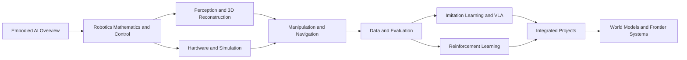

# Every Embodied Book Map

This map answers three questions: where to start, which chapters depend on one another, and what a reader should be able to complete after following a path. The existing directory numbers remain unchanged; the four volumes organize the learning sequence without moving source files.

## 1. Curriculum Graph

## 2. Volume I: Embodied AI Foundations

| Order | Topic | Core Question | Learning Outcome |
| --- | --- | --- | --- |
| 1 | [Embodied AI overview](./en/01-embodied-ai-overview/README.md) | What modules make up an embodied system? | Draw the closed loop connecting perception, decision making, control, and the environment. |
| 2 | [Robotics foundations and control](./en/02-robot-basics-control-and-hand-eye-coordination/README.md) | How is robot motion represented and controlled? | Compute coordinate transforms, forward and inverse kinematics, and basic control quantities. |
| 3 | [Vision and 3D reconstruction](./en/04-computer-vision-and-3d-reconstruction/README.md) | How does a robot obtain targets and spatial information from images? | Run a segmentation, localization, depth-estimation, or mapping example. |

After Volume I, run the [minimal MuJoCo experiment](./examples/README.md) to connect coordinates and trajectories with physics stepping.

## 3. Volume II: Learning and Decision Making

| Order | Topic | Core Question | Learning Outcome |
| --- | --- | --- | --- |
| 4 | [Deep and reinforcement learning](./en/05-deep-and-reinforcement-learning/README.md) | How does a policy learn from rewards or demonstrations? | Explain policies, values, replay data, and training curves. |
| 5 | [Robot operation and motion control](./en/07-robot-operation-and-motion-control/README.md) | How is a task objective converted into executable motion? | Distinguish planning, control, imitation learning, and reinforcement learning. |
| 6 | [VLA policies](./en/06-manipulation-and-vla/README.md) | How do images, language, and robot states produce actions? | Complete data preparation, training, inference, and closed-loop evaluation. |
| 7 | [Navigation and VLN](./en/08-navigation-and-vln/README.md) | How does a robot localize, plan, and interpret a language goal? | Run a navigation baseline and explain its principal metrics. |
| 8 | [Datasets and evaluation benchmarks](./en/09-data-and-benchmarks/README.md) | How is a trustworthy training and evaluation protocol constructed? | Inspect dataset structure, task denominators, and result aggregation. |

Volume II does not require a single fixed order. For manipulation, follow `05 -> 07 -> 06 -> 09`. For navigation, follow `04 -> 08 -> 09`.

## 4. Volume III: Systems and Simulation

| Topic | Intended Reader | Main Content |
| --- | --- | --- |
| [Hardware, LeRobot, and RDK-X5](./en/03-robot-hardware-lerobot-and-rdk-x5/README.md) | Readers connecting cameras, robot arms, or edge devices | System images, device communication, teleoperation, sensors, and data collection |
| [Simulation tools and data generation](./en/10-simulation-tools-and-frontiers/README.md) | Readers selecting or migrating a simulator | MuJoCo, Isaac, Genesis, soft-body simulation, and synthetic data |
| [Engineering utilities](./en/11-auxiliary-tools/README.md) | Readers maintaining development and debugging workflows | Containers, remote development, networking, logs, and common tools |
| [Robot and mechanism design](./en/21-robot-design/README.md) | Readers constructing robot models or mechanical parts | Parametric modeling, format export, robot descriptions, and structural checks |

The topics in Volume III are largely independent. Choose the target hardware or simulator first, then enter the corresponding laboratory; installing every tool at once is unnecessary.

## 5. Volume IV: Frontiers and Projects

| Topic | Material Type | Recommended Approach |
| --- | --- | --- |
| [Frontier project reproductions](./en/13-frontier-project-reproduction/README.md) | Multimodal robotics, drones, and integrated applications | Start from the project objective, then reproduce the environment, model, and evaluation in order. |
| [Competition case studies](./en/15-challenges/README.md) | Task protocols, baselines, and post-competition reviews | Read the rules and evaluation protocol before the implementation and debugging record. |
| [Focused study programs](./en/16-study-programs/README.md) | Multi-week courses and complete experimental workflows | Follow the task sequence within one program. |
| [Embodied world models](./en/17-world-models/README.md) | Action-conditioned video, state prediction, and policy evaluation | Learn diffusion-model foundations before entering a specific system. |
| [Drone systems](./en/18-drones/README.md) | Dynamics, control, planning, and trajectory optimization | Progress from control foundations to trajectory planning. |

## 6. Appendices and Community Material

- [Interview questions](./en/12-interview-questions/README.md) support review but do not replace the main chapters.
- [References and further reading](./en/14-references/README.md) collect official documentation, papers, project pages, and extended reading.
- [Monthly study groups](./en/19-monthly-team-learning/README.md) preserve course schedules and learning routes.
- [Publication archive](./en/20-wechat-articles/README.md) preserves community-facing articles derived from the textbook.

## 7. Learning Checkpoints

After completing a path, verify that you can answer the following questions:

1. Where do observations, states, actions, rewards, and success conditions come from?
2. Can you run a minimal example without changing its task definition and locate its outputs?
3. Can you distinguish an environment check, a short training check, and a formal evaluation?
4. Can you explain how training data differ from evaluation initial states?
5. Can you use logs, videos, and metrics to identify the stage where a task failed?

If two or more questions remain unanswered, return to the corresponding foundation topic before continuing to a larger model or integrated project.
