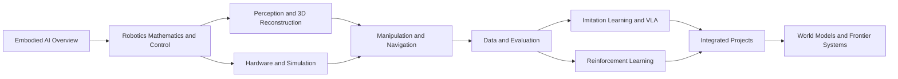

# Every Embodied Book Map

This map explains where to start, which topics depend on one another, and what a reader should be able to complete after each path. Existing directory numbers are preserved; the four volumes organize learning order without moving source files.

## Curriculum Graph

## Volume I: Foundations

1. [Embodied AI overview](./en/01-embodied-ai-overview/README.md)
2. [Robotics foundations and control](./en/02-robot-basics-control-and-hand-eye-coordination/README.md)
3. [Vision and 3D reconstruction](./en/04-computer-vision-and-3d-reconstruction/README.md)
4. [Minimal MuJoCo experiment](./examples/README.md)

## Volume II: Learning and Decision Making

1. [Deep and reinforcement learning](./en/05-deep-and-reinforcement-learning/README.md)
2. [Robot manipulation and motion control](./en/07-robot-operation-and-motion-control/README.md)
3. [VLA policies](./en/06-manipulation-and-vla/README.md)
4. [Navigation and VLN](./en/08-navigation-and-vln/README.md)
5. [Datasets and evaluation benchmarks](./en/09-data-and-benchmarks/README.md)

## Volume III: Systems and Simulation

1. [Hardware, LeRobot, and RDK-X5](./en/03-robot-hardware-lerobot-and-rdk-x5/README.md)
2. [Simulation tools and data generation](./en/10-simulation-tools-and-frontiers/README.md)
3. [Engineering utilities](./en/11-auxiliary-tools/README.md)
4. [Robot and mechanism design](./en/21-robot-design/README.md)

## Volume IV: Frontiers and Projects

1. [Frontier project reproductions](./en/13-frontier-project-reproduction/README.md)
2. [Competition case studies](./en/15-challenges/README.md)
3. [Focused study programs](./en/16-study-programs/README.md)
4. [Embodied world models](./en/17-world-models/README.md)
5. [Drone systems](./en/18-drones/README.md)

## Learning Checkpoints

After completing a path, verify that you can answer the following questions:

1. Where do observations, states, actions, rewards, and success conditions come from?
2. Can you run a minimal example without changing its task definition and locate its outputs?
3. Can you distinguish an environment check, a short training check, and a formal evaluation?
4. Can you explain how training data differ from evaluation initial states?
5. Can you use logs, videos, and metrics to identify the stage where a task failed?
