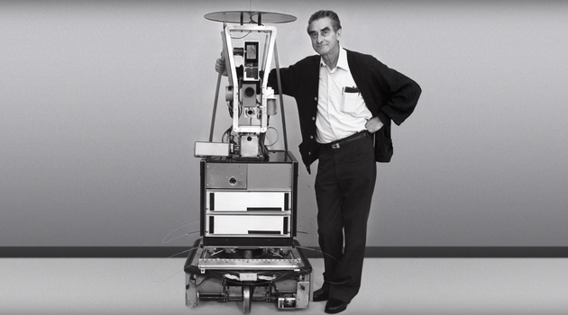
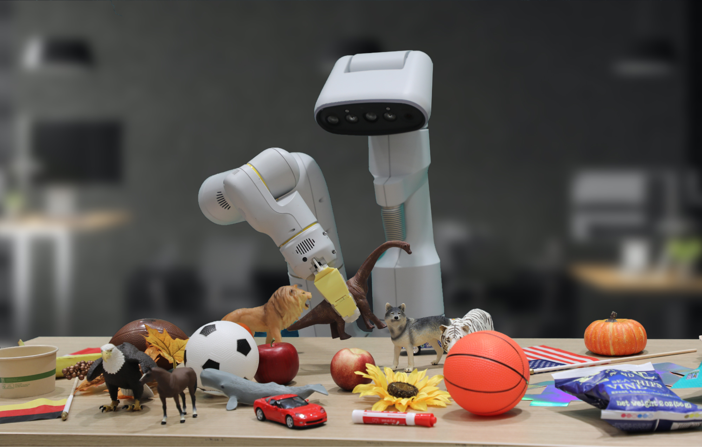

# **From "Virtual Brain" to "World Walker": A Deep Analysis of a Long Article on "Embodied AI"**

> The ultimate goal of AI is not to output text and images on a screen, but to truly enter our physical world, understand it, and breathe together with it. Today, let us open the door to the future and welcome the next paradigm shift in artificial intelligence—embodied AI.

---

## 1. What is embodied AI? — It lies beyond mere thinking, and lies in “action”

You may be familiar with "artificial intelligence," such as ChatGPT that converses with you and Midjourney that paints for you. They are excellent "digital brains" that process vast amounts of information, perform logical reasoning, and generate content. However, they all exist in a virtual world of data—they are <strong> "disembodied" </strong> entities, like "brains in a jar." They know all the information about the word "apple," but never "touch" the coolness and smoothness of an apple, nor can they "pick" it.

**Embodied AI**, on the other hand, aims to break through this hierarchical barrier.

> **Core Definition:** Embodied AI refers to intelligent systems that can perceive, interact with, and learn in the real world through a physical body (such as robots or self-driving cars). It emphasizes that an agent must have a “body” to interact with the environment via this body, thereby gaining a deeper and more physically accurate understanding of the world.

In simple terms, embodied AI = **intelligent brain + moving body**.

This is not just about equipping AI with wheels and arms; it represents a profound philosophical and technological transformation. It posits that true intelligence emerges through continuous interaction and feedback with the environment, rather than being created out of thin air. Just like human infants, they do not learn by reading encyclopedias, but by grasping, crawling, falling, and exploring to understand the world.

### Key Three Elements:

1. **Body**: The physical form of the agent, including various sensors (such as cameras, lidar, tactile sensors) for perception, and actuators (such as motors, robotic arm, wheels) for action.

2. **Brain**: The core of intelligent algorithms, responsible for processing data from sensors, thinking, making decisions, and sending commands to actuators. This typically involves cutting-edge AI technologies such as deep learning, reinforcement learning, and large language models.

3. **Environment**: The physical world in which the agent operates. It is the stage for the agent's learning and practice, filled with uncertainty, dynamic changes, and complex physical laws.

---

## II. The Development Trend: From "On the Brink of Collapse" to "Flying Fast"

Embodied AI is not a concept that can be achieved overnight. Its development history is a story of the intertwined evolution of robots and artificial intelligence technologies.

### **Phase 1: Pioneers of Early Steps (Mid-20th Century - Late 20th Century)**

- **Theoretical beginnings:** Pioneers of cybernetics such as Norbert Wiener first proposed ideas about the interaction between machines and environments.

- **Iconic project:** Between 1966 and 1972, the Stanford Research Institute developed the world’s first truly embodied AI robot, **Shakey**. It is regarded as the “ancestor” of embodied AI. Shakey could perceive its environment, make plans, and perform simple tasks (such as pushing boxes). Although slow in movement, it was the first to integrate perception, reasoning, and action into a single system, which is of great significance.

*The robot "ancestor" — Shakey*

### **Phase 2: Enabling Deep Learning (Early 21st Century - 2020)**

- **Technical Breakthrough:** With the significant improvement in computing power and the maturity of deep learning algorithms, Computer Vision technology has given robots more sensitive “eyes”. Meanwhile, Reinforcement Learning enables robots to learn complex skills through “trial and error” without humans having to write all the rules.

- **Star players:** <strong> Boston Dynamics </strong> has become the absolute focus of this era. From the BigDog robot to the Atlas humanoid robot capable of parkour and backflips, it demonstrates to the world the remarkable achievements of embodied AI in locomotion and balance capabilities.

*The Atlas robot moves with great speed and demonstrates exceptional athletic ability*

### **Phase 3: Large Models Usher in a New Era (2021 - Present)**

- **Paradigm shift:** Large language models (LLMs) represented by GPT-3 and PaLM exhibit strong general understanding and reasoning capabilities. Researchers are delighted to find that LLMs can serve as the “brain” of embodied AI, responsible for understanding high-level instructions and breaking them down into specific steps that robots can execute.

- **Representative Breakthroughs:**

- **Google's RT-2 model:** It was demonstrated for the first time that visual and language models can be directly transferred to robot control, achieving end-to-end control of "Vision-Language-Action." This allows robots to understand complex commands like "Adjust the bottle on the table that is about to fall down."

- **Tesla's Optimus robot:** Designed to create a universal "humanoid worker," it leverages Tesla's strong visual perception and AI computing capabilities in autonomous driving.

- **Figure AI and OpenAI collaboration:** Integrating ChatGPT’s dialogue and reasoning capabilities into the Figure 01 robot enables it to engage in natural human conversations, understand tasks, and execute them—marking an important milestone in the generalization of embodied AI.

*With the help of large models, robots are becoming more and more "smart".*

---

## III. Broad Application Areas: Intelligence is "Entering" Reality

When AI has a physical form, its value will extend beyond the digital world, profoundly transforming all aspects of our lives.

### **1. Industrial Manufacturing and Logistics**

This is the field where embodied AI is first implemented and is also the most mature. From robotic arms on highly automated car production lines to Kiva robots that efficiently sort packages in Amazon warehouses, they are handling increasingly complex, repetitive, or dangerous tasks, significantly improving production efficiency.

### **2. Home Services and companionship**

Imagine that in the future, robots in homes will not only mop floors and sweep, but also tidy up rooms, cook meals, take care of pets, and even become caring companions for the elderly and playmates for children. With technological advancements and reduced costs, universal service robots entering households is no longer science fiction.

### **3. Medical Health and Rehabilitation**

- **Surgery robots:** Represented by the "Da Vinci" surgical robots, they can assist doctors in performing more precise and minimally invasive surgeries.

- **Rehabilitation robot:** Helps patients with limited mobility undergo rehabilitation training.

- **Smart prosthetic:** Can understand the wearer's intentions and enable more natural and flexible movements.

### **4. Scientific Exploration and Special Operations**

In environments beyond human reach or extremely dangerous, embodied AI will become our "embodiment".

- **Deep Space Exploration:** Such as NASA's "Perseverance" Mars rover, which explores, samples, and analyzes on the Martian surface autonomously.

- **Deep Sea Exploration:** Autonomous underwater vehicles (AUVs) explore the mysterious underwater world.

- **Disaster rescue:** In post-disaster scenes such as earthquakes and fires, robots can replace rescue personnel to enter dangerous areas for search and rescue operations.

---

## IV. Challenges and Future Prospects

The path to general embodied AI is still long and challenging.

### **Core Challenges:**

- **The "Sim-to-Real" gap:** Models trained in the simulator often fail to adapt to the real world, as the real world is full of details and surprises that cannot be fully captured by the simulator.

- **Generalization ability:** How to enable a robot to make correct decisions and actions when facing objects and environments it has never seen before is key to achieving "generalization".

- **Data scarcity:** Unlike the endless text and image data on the internet, high-quality robot interaction data is both expensive and difficult to obtain.

- **Security and Ethics:** For an AI system with powerful physical capabilities, ensuring that its behavior is secure, controllable, and aligned with human ethics is a matter that must be taken seriously.

### **Future Outlook:**

Despite numerous challenges, the future is ahead. With the continuous integration of large models, new materials, and sensor technologies, we can expect:

1. **Stronger versatility:** Future robots will no longer be "specialists" but "versatile experts" capable of learning and adapting to various tasks like humans.

2. **More natural human-robot interaction:** We can collaborate with robots using natural language, gestures, or even eye contact. They will become seamless partners in our lives.

3. **Physical Emergence of Intelligence:** Ultimately, the goal of embodied AI is to enable agents to spontaneously learn and emerge higher-level forms of intelligence that we have not even preset, through complex interactions with the physical world.

**Conclusion:**

From "thinkers" in the virtual world to "actors" in the physical world, embodied AI is leading AI onto a new great journey. It is not only a technological leap, but also relates to how we define "intelligence" and what kind of intelligent species we hope to coexist with.

This door has been opened. The world behind it is full of challenges and endless possibilities. Let us witness together how this "new species" driven by code and gears will learn, grow, and ultimately change the world.
