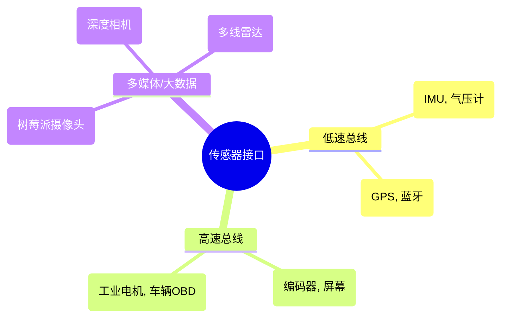

<!-- Generated by the offline translation workflow.
Source: 03-机器人硬件、lerobot及地瓜RDK-X5开发板控制教程/06传感器选型与数据采集.md
Source SHA-256: 001343767576f7a69636bf450d0ec8bd113e52d02f3bc109ac78c6e08d558bf2
Model: tencent/Hy-MT2-1.8B-GGUF:Q4_K_M
Review machine-translated technical claims before relying on them.
-->
# Sensor: The robot's perception system

Sensors are the "senses" of a robot. This chapter will explain how to make a robot "see" the world, including the classification of sensors, communication protocols, and basic algorithms for data processing.

## 1. Sensor Classification System

### 1.1 Proprioceptive
Measure the robot's own state.
* **Encoder**: Measures the motor's rotation angle and speed. It is divided into **incremental** (position lost when power is off) and **absolute** (position remembered even when power is off).

* **IMU (Inertial Measurement Unit)**: Includes an accelerometer (for measuring linear acceleration/gravity direction) and a gyroscope (for measuring angular velocity). It is the core sensor for e-bikes and drones.


Figure 1: Principle of Photoelectric Encoder

### 1.2 Exteroceptive Perception
Measuring the external environment.
* **LiDAR**:
    * **2D LiDAR**: Scans a plane and outputs a point cloud of distances. Used for SLAM mapping.
    * **3D LiDAR**: Multi-line scanning, used for autonomous driving.
    * **Principle**: ToF (Time of Flight) or triangulation.
* **Camera**:
    * **RGB**: Ordinary color image.
    * **RGB-D (Depth Camera)**: Such as RealSense, Kinect. Can output color and pixel distances simultaneously.
* **Ultrasonic/Microwave**: Used for close-range obstacle avoidance or passing through smoke.


Figure 2: Principle of lidar triangular ranging

---

## 2. Hardware Interfaces and Communication Protocols

When selecting sensors, not only the performance matters, but also whether the interface matches the development board (such as Raspberry Pi, RDK-X5).

| Protocol | Lines | Speed | Features | Applications |
| :--- | :--- | :--- | :--- | :--- |
| **UART (Serial)** | 2 (TX, RX) | Low/Medium | Asynchronous, point-to-point, simple | GPS, Bluetooth modules, lidar |
| **I2C** | 2 (SDA, SCL) | Medium | Synchronous, bus-based, master-slave architecture | IMU, temperature and humidity sensors, magnetometer |
| **SPI** | 4 (MOSI, MISO...) | High | Full-duplex, high speed | High-frequency IMU, color screen |
| **USB** | 4+ | Very High | Highly versatile | Cameras, high-end radars |




------

## 3. Signal processing: From noise to true value

Sensor data always contains noise. Using the raw data directly can cause the robot to jitter or even lose control.

### 3.1 Common Noise Handling

- **Low-pass Filter**: Removes high-frequency jitter.
- **Kalman Filter**: Optimal estimation, combining predicted values and observations.
- **Complementary Filter**: Commonly used in IMU attitude calculation (combining accelerometer and gyroscope).

### 3.2 Complementary Filter Principle

- **Accelerometer**: Good low-frequency performance (accurate over time, indicates the direction of gravity), but experiences strong high-frequency vibrations.
- **Gyroscope**: Good high-frequency performance (fast dynamic response), but has temperature drift, and will drift over long-term integration.
- **Formula**: $\theta = \alpha \cdot (\theta + \omega \cdot dt) + (1-\alpha) \cdot \theta_{acc}$

------

## 4. Python Practice: IMU Data Fusion (Complementary Filtering)

This example simulates the generation of sensor data with noise, and uses complementary filtering to fuse stable attitude angles.


```Python
import numpy as np
import matplotlib.pyplot as plt

def complementary_filter_demo():
    # 1. 模拟真实角度 (正弦波运动)
    t = np.linspace(0, 10, 1000)
    dt = t[1] - t[0]
    true_angle = 10 * np.sin(2 * np.pi * 0.5 * t) # 真实角度

    # 2. 模拟传感器读数 (添加噪声)
    # 陀螺仪测的是角速度 (真实角度的导数) + 漂移 + 噪声
    true_gyro = 10 * 2 * np.pi * 0.5 * np.cos(2 * np.pi * 0.5 * t)
    gyro_reading = true_gyro + 0.5 # 模拟漂移 bias

    # 加速度计测的是角度 (假设静态) + 高频强噪声
    acc_reading = true_angle + np.random.normal(0, 2.0, len(t))

    # 3. 互补滤波算法
    fused_angle = []
    angle_est = 0.0
    alpha = 0.98 # 信任陀螺仪积分的权重 (0.95-0.99)

    for i in range(len(t)):
        # 陀螺仪积分项 (预测)
        gyro_rate = gyro_reading[i]
        angle_pred = angle_est + gyro_rate * dt

        # 加速度计观测项
        acc_obs = acc_reading[i]

        # 融合
        angle_est = alpha * angle_pred + (1 - alpha) * acc_obs
        fused_angle.append(angle_est)

    # 4. 绘图对比
    plt.figure(figsize=(12, 6))
    plt.plot(t, acc_reading, 'g-', alpha=0.3, label='Accelerometer (Noisy)')
    # 纯积分陀螺仪 (用于展示漂移)
    gyro_only = np.cumsum(gyro_reading) * dt
    plt.plot(t, gyro_only, 'k--', alpha=0.5, label='Gyro Only (Drift)')

    plt.plot(t, fused_angle, 'b-', linewidth=2, label='Fused Result (Complementary)')
    plt.plot(t, true_angle, 'r--', linewidth=1, label='True Angle')

    plt.title('Sensor Fusion: Complementary Filter Demo')
    plt.xlabel('Time (s)')
    plt.ylabel('Angle (deg)')
    plt.legend()
    plt.grid(True)
    plt.show()
    print("滤波完成：请观察蓝色曲线如何兼顾了绿色的'绝对位置'和陀螺仪的'平滑性'")

if __name__ == "__main__":
    complementary_filter_demo()
```

