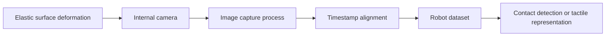

# Integrating a DTact Visual-Tactile Sensor

DTact observes deformation of an elastic surface with an internal camera and records contact as an image sequence. The stream can support first-contact detection, slip detection, grasp-stability estimation, and local geometry analysis. This section presents a hardware-independent integration path that can be synchronized with robot demonstrations.

## Data Flow



Each tactile frame should be stored with a monotonic timestamp, joint positions, gripper opening, task identifier, episode index, and frame index. Force, torque, or motor-current estimates can be added when available.

## Environment Preparation

If the capture program uses ROS, install its workspace and dependency-management tools:

```bash
sudo apt update
sudo apt install -y \
  python3-rosdep \
  python3-rosinstall \
  python3-rosinstall-generator \
  python3-wstool \
  build-essential
```

These packages do not provide the DTact camera driver. Install the V4L2 driver or the vendor driver required by the actual camera.

## Device Check

List the available video devices:

```bash
v4l2-ctl --list-devices
```

Then inspect the resolutions and frame rates supported by the selected device:

```bash
export TACTILE_DEVICE=/dev/video2
v4l2-ctl --device "$TACTILE_DEVICE" --list-formats-ext
```

If the device number changes after reboot, create a stable name with a `udev` rule instead of hard-coding `/dev/video2` in the capture program.

## Calibration and Synchronization

1. Record a no-contact background image.
2. Press a known probe at several positions to verify illumination, field of view, and deformation direction.
3. Record a monotonic clock in the image process and use the same time base for robot state.
4. Run one slow gripper-closing trial and verify that tactile deformation aligns with the change in gripper opening.

During contact, deformation should change continuously and the aligned robot state should not show a persistent delay of several frames.

## Dataset Interface

In a LeRobot dataset, store tactile images under separate observation keys such as `observation.images.tactile_left` and `observation.images.tactile_right`. External cameras describe the environment, while tactile cameras describe the contact interface, so their image statistics should be computed separately before training.

For general sensor-selection and acquisition guidance, see [Sensor Selection and Data Acquisition](./06-sensor-selection-and-data-acquisition.md).
