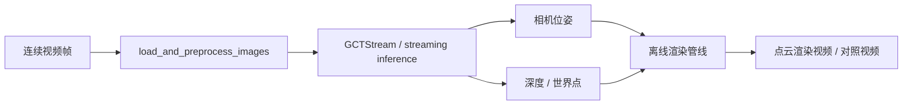

<!-- Generated by the offline translation workflow.
Source: 04-具身场景的计算机视觉、3D重建/03-LingBot-Map视频流式三维重建.md
Source SHA-256: 2a49738714b68a56ba0ec9fd54c5fb57699b1e0a4e8d4c279f8289b6fed94687
Model: tencent/Hy-MT2-1.8B-GGUF:Q4_K_M
Review machine-translated technical claims before relying on them.
-->
# 03-LingBot-Map: From video scanning to 3D point cloud map

LingBot-Map is a streaming 3D reconstruction project for long videos. It can estimate the camera trajectory, depth, point cloud, and visual rendering results from continuous video frames, making it suitable for understanding the process of “a robot holding a camera scans the environment, gradually forming a spatial map”.

This chapter will achieve three goals:

- Reproduction of the official continuous scene `university` locally, generating a point cloud rendering video.
- Explanation of the code entry, data flow, and research approach of LingBot-Map.
- Providing a lightweight Web demo: after uploading the video, call the local inference script to output the comparison between the original video and the point cloud rendering.

> Explanation: The output of LingBot-Map is more similar to “streaming camera pose + depth + point cloud/pixel rendering”, rather than training videos into a complete 3D Gaussian Splatting scene in real time. It can serve as a spatial understanding input for 3DGS, NeRF, SLAM, or robot navigation frontends, but the focus of this chapter’s reproduction is video scanning mapping and point cloud visualization.

## 1. Effect Preview

This chapter uses the official example `example/university`. It is a continuous single-scene sequence of a campus snow scene, and its movement trajectory is not a simple straight line, making it suitable for demonstrating the "scanning while walking" effect.

Enter video preview:

<video controls muted preload="metadata" width="100%">
  <source src="../../04-具身场景的计算机视觉、3D重建/assets/lingbot-map/university_input.mp4" type="video/mp4">
</video>

Point cloud rendering results:

<video controls muted preload="metadata" width="100%">
  <source src="../../04-具身场景的计算机视觉、3D重建/assets/lingbot-map/university_pointcloud.mp4" type="video/mp4">
</video>

Original frame vs. point cloud rendering comparison:

<video controls muted preload="metadata" width="100%">
  <source src="../../04-具身场景的计算机视觉、3D重建/assets/lingbot-map/university_compare.mp4" type="video/mp4">
</video>

If the document site does not play videos directly, you can view the GIF preview:


Point cloud keyframe thumbnail:


## II. Environment Preparation

It is recommended to create a new independent mamba environment, as LingBot-Map relies on PyTorch, CUDA extensions, Kaolin, viser, and rendering packages simultaneously. Mixing it with ordinary embodied simulation environments can easily cause conflicts.

The following command assumes that the reader has cloned LingBot-Map to `$PROJECT_ROOT`:

```bash
export PROJECT_ROOT=/path/to/lingbot-map
cd "$PROJECT_ROOT"
```

Create environment:

```bash
mamba create -n lingbot-map python=3.10 -y
mamba activate lingbot-map
```

Install PyTorch. The official README recommends PyTorch 2.8.0 + CUDA 12.8, as the Kaolin required by the batch rendering pipeline has pre-compiled wheels:

```bash
pip install torch==2.8.0 torchvision==0.23.0 --index-url https://download.pytorch.org/whl/cu128
```

Install project and render dependencies:

```bash
pip install -e .
pip install -r demo_render/requirements.txt
```

If you want to use offline point cloud rendering, you need to compile and render the CUDA extension:

```bash
cd demo_render/render_cuda_ext
python setup.py build_ext --inplace
cd ../..
```

After downloading the weight, place it in:

```text
$PROJECT_ROOT/checkpoints/lingbot-map-long.pt
```

The official weights can be downloaded from the Hugging Face or ModelScope links in the project README. For long videos and large scenes, `lingbot-map-long.pt` is preferred.

### Notes on CUDA and Blackwell

1. If the server is a Blackwell architecture GPU, it is recommended to use PyTorch versions 12.8 or higher with CUDA. Some tools will prompt "SM 12.x requires CUDA >= 12.9" when checking the capabilities of SM 12.x. If the inference can proceed normally, this prompt may not hinder the smoke test. If compilation errors occur with CUDA kernels, FlashInfer, or Kaolin, upgrade the system's CUDA Toolkit or use a CUDA version compatible with the PyTorch toolkit.

## III. Official Continuous Scenario Smoke Test

The official repository includes several example sequences:

| Scenario | Feature | Recommendations for this chapter |
| :--- | :--- | :--- |
| `university` | Continuous movement outdoors on campus, with trees, railings, buildings, and ground layers | Recommended |
| `loop` | Closed loop motion in indoor corridors | Suitable for discussing closed loops and drift |
| `courthouse` | Circling around building exteriors | Suitable for building scanning |
| `oxford` | Exterior views of campus buildings | Suitable for large outdoor scenes |

Run the `university` example used in this chapter:

```bash
export PROJECT_ROOT=/path/to/lingbot-map
cd "$PROJECT_ROOT"
mamba activate lingbot-map

python demo_render/batch_demo.py \
  --input_folder example \
  --scenes university \
  --image_range 0:240:2 \
  --output_folder outputs/official_university_scan \
  --model_path checkpoints/lingbot-map-long.pt \
  --config demo_render/config/outdoor_large.yaml \
  --num_scale_frames 4 \
  --use_sdpa \
  --video_width 640 \
  --video_height 360 \
  --video_fps 12 \
  --camera_vis default \
  --frame_tag \
  --save_predictions \
  --video_suffix _pointcloud
```

After the operation is completed, focus on checking:

```text
outputs/official_university_scan/university_pointcloud.mp4
outputs/official_university_scan/university_pointcloud_combined.mp4
outputs/official_university_scan/batch_results.json
```

In this chapter's smoke test, 120 frames were used. The log shows that the inference speed is approximately ten to fifteen FPS, and over a million point clouds/pixels are generated for rendering. The actual speed varies depending on the GPU, CUDA, resolution, number of frames, and rendering parameters.

## IV. Using Your Own Video Scanning Environment

If the reader has a video they recorded, they can directly send it to `--video_path`. It is recommended to test with continuous single-shot videos first, to avoid frequent editing, rapid zooming, significant motion blur, and large areas of pure sky.

```bash
export PROJECT_ROOT=/path/to/lingbot-map
export VIDEO_PATH=/path/to/your_scan_video.mp4
cd "$PROJECT_ROOT"
mamba activate lingbot-map

python demo_render/batch_demo.py \
  --video_path "$VIDEO_PATH" \
  --target_frames 120 \
  --output_folder outputs/my_scan \
  --model_path checkpoints/lingbot-map-long.pt \
  --config demo_render/config/outdoor_large.yaml \
  --num_scale_frames 4 \
  --use_sdpa \
  --video_width 640 \
  --video_height 360 \
  --video_fps 12 \
  --camera_vis default \
  --frame_tag \
  --save_predictions \
  --video_suffix _pointcloud
```

Shooting suggestions:

- Single-scene continuous movement is more suitable for reconstruction than editing videos.
- It can turn, circle, and make slight up-and-down movements; a straight line path is not required.
- The camera movement should have parallax; pure in-place rotation or distant translation makes it difficult to restore stable scale.
- For outdoor scenes, try to minimize the pure sky portion; use a sky mask if necessary.
- First conduct a smoke test with 60 to 120 frames, and add longer videos only after confirming stability.

## 5. Web demo

The tutorial repository provides a minimal Web wrapper, with the following directory:

```text
tools/lingbot_map_web_demo/
```

It does not have the LingBot-Map weights built-in, and it does not write the running results to the tutorial repository. Readers need to tell it the location of the LingBot-Map project and the checkpoint location using environment variables:

```bash
export LINGBOT_MAP_ROOT=/path/to/lingbot-map
export LINGBOT_MAP_CKPT=/path/to/lingbot-map/checkpoints/lingbot-map-long.pt
export LINGBOT_MAP_PYTHON=/path/to/mamba/envs/lingbot-map/bin/python
export LINGBOT_MAP_RUN_ROOT=/path/to/lingbot_map_runs

cd /path/to/every-embodied/tools/lingbot_map_web_demo
pip install -r requirements.txt
python app.py
```

Open the browser and visit:

```text
http://127.0.0.1:7860
```

After uploading a continuous video, the Web demo will call `demo_render/batch_demo.py` and display it on the page:

- Original input video;
- Point cloud rendering video;
- Original video and point cloud rendering comparison video;
- Execution logs and output directory.

This Web demo is suitable for tutorial presentation and smoke test, but not recommended for direct use as a production service. Long video inference will consume a lot of memory and disk space. Public deployment also requires a task queue, concurrency limits, file cleanup, and access control.

## VI. How to Match Code and Papers

The key data flow of LingBot-Map can be simplified to:



Main entrance:

| File | Function |
| :--- | :--- |
| `demo.py` | Interactive 3D viewer, suitable for short sequence debugging. |
| `demo_render/batch_demo.py` | Offline batch processing entry, suitable for video, long sequences, and tutorial output generation. |
| `lingbot_map/` | Model, loading, visual tools, and inference implementation. |
| `demo_render/rgbd_render/` | Rendering predicted depth, camera, and point cloud as video. |
| `demo_render/render_cuda_ext/` | CUDA extensions related to point cloud/pixel rendering. |

From the perspective of the paper's approach, LingBot-Map focuses on the memory of online spaces in long video scenarios. The model does not process a single frame in isolation each time, but maintains the state across frames, using the content seen earlier as context for understanding subsequent frames. The advantage of this approach is that when the robot moves along corridors, campus roads, or rooms, it does not need to wait for the complete video to end before reconstructing, but can update the spatial representation while inputting data.

It can be understood as three levels of capabilities:

1. Visual encoding: Convert each image frame into features.
2. Temporal aggregation: Use streaming states to retain information from previous frames, reducing redundant calculations in long videos.
3. Geometric output: Predict cameras, depth, and world points, and then convert them into point cloud or voxel rendering results.

Therefore, the question it answers is not “to create a fully editable 3DGS model from the video,” but “to continuously recover three-dimensional structures that can be used for navigation, inspection, and visualization from the video stream from a robot’s perspective.”

## VII. Common Questions

**1. Is the output real-time 3DGS?**

No. It can generate streaming geometric estimates in real time or near real time, but this chapter focuses on point cloud/pixel rendering. 3DGS usually also requires explicit Gaussian parameter optimization or training processes.

**2. Why is continuous video more important than edited videos?**

Rebuild the geometric consistency between adjacent frames. Video editing suddenly switches locations and perspectives, and the model forces discontinuous spatial relationships together, leading to drift, misalignment, or broken point clouds.

**3. Must Blackwell GPU be upgraded with CUDA?**

If the PyTorch wheel, FlashInfer, Kaolin, and the CUDA extension of this project all work properly, you can temporarily leave the system CUDA off. If issues such as SM 12.x incompatibility, CUDA extension compilation failures, or kernel launch errors occur, consider upgrading to a newer CUDA Toolkit and ensure that the versions of PyTorch, drivers, compiler, and dependent libraries are consistent.

**4. Should the original video, weights, and output NPZ be submitted to the tutorial repository?**

Not recommended. The tutorial repository only retains the compressed preview MP4/GIF/JPG. Weights, original videos, a large number of `.npz` prediction files, and long video outputs should be stored in a local data directory or external object storage.

## VIII. References

- LingBot-Map official repository and README.
- LingBot-Map paper PDF.
- Official example `example/university`. In this chapter, only the compressed teaching preview is submitted; the original weights, original sequences, or large-scale prediction files are not.
