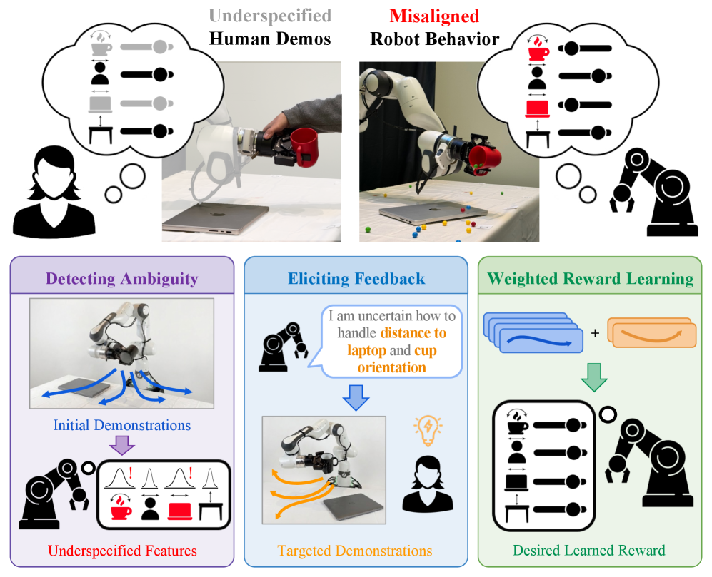
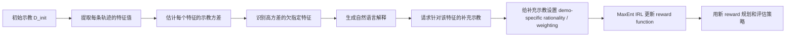
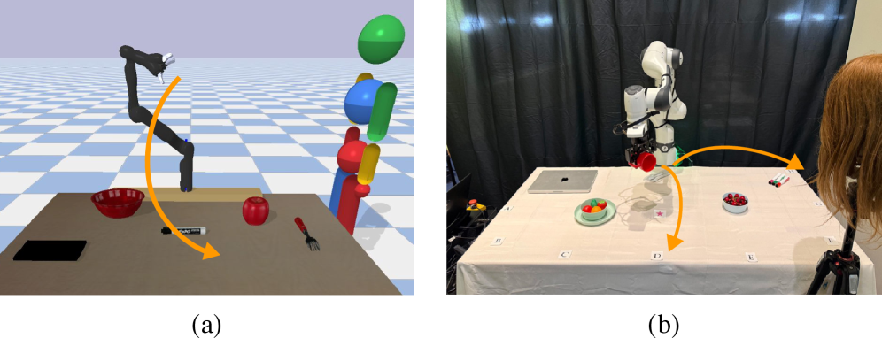
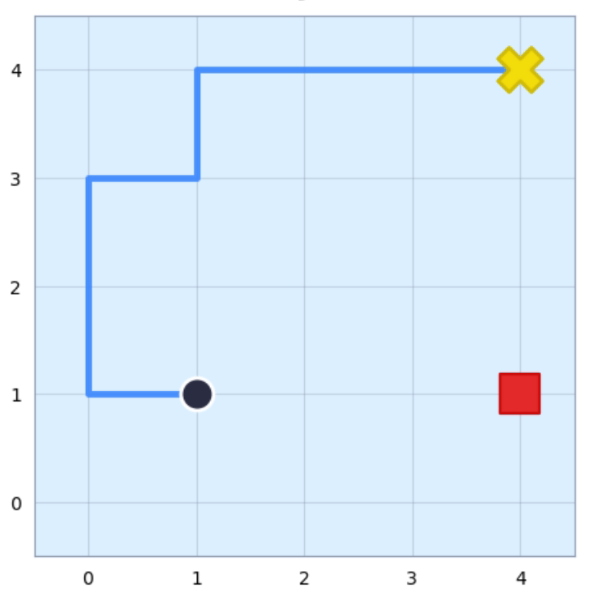
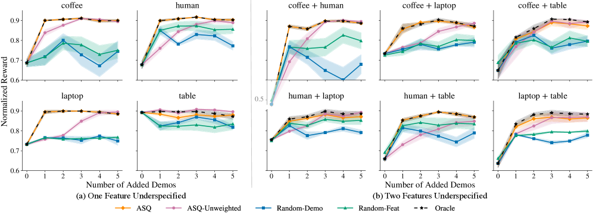
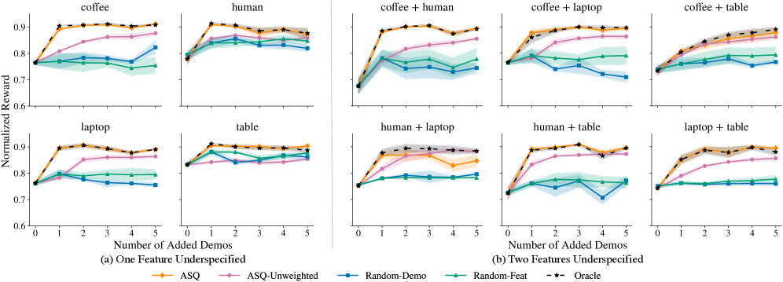
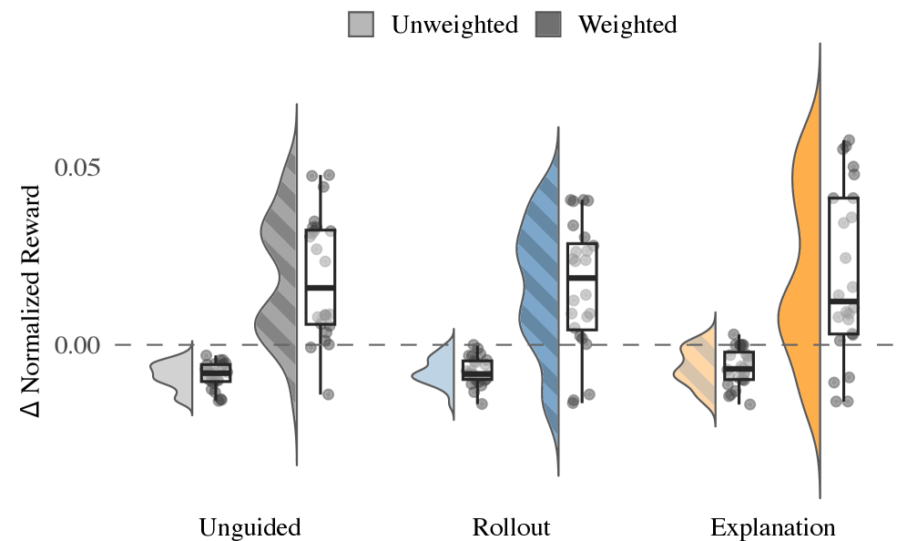
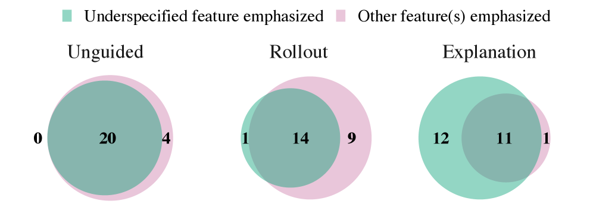
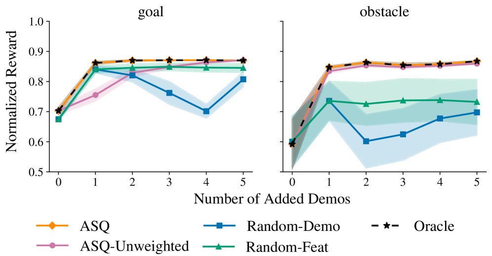

# Robots That Know What to Ask: Active Questioning by Robots and Correction Rewards Misalignment

> Paper: *Robots That Know What to Ask: Recovering Misaligned Rewards through Targeted Explanations*
> Authors: Helena Merker, Nick Walker, Andreea Bobu
> Conference: Robotics: Science and Systems, RSS 2026
> arXiv: https://arxiv.org/abs/2605.22986
> RSS page: https://roboticsconference.org/program/papers/116/
> Code status: As of 2026-07-18, no official project pages or code repositories were found by the authors; this tutorial primarily relies on the paper, arXiv HTML figures, and RSS information.

This article is suitable to be placed under “Depth and Reinforcement Learning in Embodied Scenarios”, rather than in the world model or VLA foundation sections. It does not focus on “how robots simulate future scenarios within the world model”, nor on “upgrading to a more powerful vision-language-action model”. Instead, it addresses a more fundamental issue that is often overlooked: human demonstrations to robots may not fully express the actual task objectives, and the reward functions learned by robots from these incomplete demonstrations could be misaligned. Thus, can robots determine for themselves “what information is missing” and then specifically request additional demonstrations from humans?

One-sentence summary: It introduces ASQ (Ambiguity-Sensitive Querying), using the variance signal of feature distribution during teaching to identify “under-specified features”, and then explaining in natural language that “I am not sure about this dimension” so that humans can provide more targeted corrective demonstrations, thereby correcting the reward misalignment in reinforcement learning.

## Why this is needed

Many robot learning methods assume one thing: although human teaching may not be perfect, it at least covers the important dimensions of the task. For example, when a robot needs to move a cup, the real preferences of humans might be:

- The cup should remain upright;
- The cup should be close to the table;
- The cup should not hit the laptop;
- The cup should not be near people.

The problem is that humans may not be able to cover all targets simultaneously during teaching. Some targets may be overlooked due to cognitive burden, some may be difficult to demonstrate because of the limitations of the robotic arm movement, and some may simply not be covered by the training scenarios. As a result, although there seems to be a lot of teaching, a key feature is actually not clearly explained.

This leads to reward ambiguity. When robots use MaxEnt IRL or similar methods to infer reward weights from demonstrations, they may assume that a certain feature is unimportant, and thus perform actions that "humans do not want but the training data does not specify." The main goal of this paper is to address this "misalignment in rewards caused by insufficient specification in demonstrations".

## Overview of Methods

Image source: arXiv HTML, Figure 1, *Robots That Know What to Ask*.

This figure is the most important entry point in the entire text. On the left, it shows the conventional process of teaching-based reward: humans provide a set of demonstrations, and robots learn the reward function using these trajectories, then plan their actions based on the learned rewards. The problem lies in the middle: if certain task-relevant features are not fully reflected during teaching, the reward that the robot learns will be biased.

The right side shows the core approach of ASQ:

1. First, observe the value distribution of each feature in the existing demonstrations.
2. If a feature is stably optimized by humans, its variation in the demonstrations is usually small.
3. If a feature is not stably expressed, its variation in the demonstrations will be greater.
4. The robot identifies features with high variance and suspected under-specification.
5. The robot explains its uncertain features in natural language.
6. Humans provide additional demonstrations around the selected feature.
7. The reward learner uses these additional demonstrations as targeted corrective demonstrations and updates the reward with a more appropriate weight.

It can be understood as a kind of "active inquiry during reward-based learning". The robot doesn't simply say, "Please demonstrate it again," but instead says, "I'm not sure if you want me to stay away from the laptop. Please demonstrate it again regarding this point."

## Breakdown of Core Innovations

### 1. Explicitly model "incomplete teaching"

In the past, many inverse reinforcement learning or learning from demonstration methods treated the demonstration as direct evidence of task preference. As long as humans demonstrate a certain trajectory, the algorithm tends to believe that this trajectory reflects human preferences in all features.

This article points out that this assumption is too strong. Human demonstrations may be "rational" only in some aspects. For example, the demonstrator mainly paid attention to not spilling the cup, but didn't keep the laptop away. If the algorithm regards this demonstration as evidence that "all features are equally important," it will misinterpret the reward.

So the first step for ASQ is not to immediately collect more data, but to determine: which dimension of supervision is missing in the existing data.

### 2. Find under-specified dimensions using feature variance

The key observation in the article is simple, but useful:

- Features that have been stabilized are usually consistent in the teaching trajectory;
- Features that have not been stabilized show greater variation in the teaching trajectory.

For example, if people always pay attention to keeping the cup upright, the inclination angle of all the cups in the demonstrations will be relatively small, and the variance will also be low. Conversely, if people do not pay attention to staying away from the laptop during the demonstration, the distance between different demonstration trajectories and the laptop may vary greatly. ASQ uses this statistical signal to determine which features may have been overlooked.

The advantage of this design is that it does not require a robot to perform numerous failed rollouts first, nor does it require humans to write a complete reward set. It utilizes the collected demonstrations.

### 3. It is not just asking "show it again", but explaining "what am I missing".

ASQ's questions are not about randomly collecting more demonstrations, but rather targeted explanations. The robot will use natural language to tell humans about the unspecified features it has identified, and then let humans provide additional demonstrations around these features.

This point is very important. Simply showing a failed rollout to people and asking them to guess where the robot made a mistake may not be effective. Humans may observe the robot's behavior, but they may not be able to infer which feature is missing in the reward learner. In real user experiments, it was also observed that under Rollout conditions, participants often make incorrect judgments about the missing features; under Explanation conditions, participants are more likely to focus on the highlighted features.

### 4. demo-specific rationality / weighting

The article also emphasizes that supplementary teaching and initial teaching should not be treated equally.

If the human provides the demonstration under the prompt "Please focus on the distance from the laptop", then these demonstrations provide stronger supervision for the 'laptop distance' feature. However, they may not supervise all other features equally well. Therefore, during reward learning, it is necessary to use demo-specific rationality or weighting, and encode the information about "which feature this demonstration primarily targets".

This is also why the Explanation condition is valuable: only when the robot explicitly tells humans which feature to focus on can the algorithm be confident that the supplementary demonstrations are indeed targeted. In the case of Unguided or just providing Rollout, humans may focus on any target dimension, and the algorithm cannot reliably weight a specific feature.

### 5. LLM Filtering in Multi-feature Scenarios

In the 8-feature experiment, task-related features and irrelevant distractions coexist. If variance is used directly to identify highly variable features, the algorithm may treat irrelevant distractions as subjects that need to be analyzed. Therefore, this paper introduces LLM filtering: first, a language model filters out obviously irrelevant features based on task semantics, and then variance detection is performed on the remaining candidates.

This is not about treating the LLM as a final reward model, but rather as a semantic filter. Its role is more like "first removing obviously irrelevant items from a pile of environmental objects," and then handing them over to statistical detection for processing.

## Experimental Environment

Image source: arXiv HTML, Figure 2, *Robots That Know What to Ask*.

The paper mainly uses two types of experimental environments:

1. **JacoRobot simulation desktop manipulation environment**: A 7-degree-of-freedom Jaco robotic arm moves a coffee cup on a table with obstacles. This environment is used to compare the performance of ASQ, random queries, and Oracle methods in terms of reward recovery.
2. **Real Franka robotic arm user experiment**: In real desktop tasks, participants receive corrective demonstrations to evaluate how different feedback methods affect reward correction.

The appendix also provides a GridRobot navigation environment to demonstrate a more simplified two-dimensional navigation reward restoration process.

Image source: arXiv HTML, Figure 7, *Robots That Know What to Ask*.

GridRobot is more like a teaching environment: its state, actions, and features are easy to control, making it suitable for reproduction of the basic ideas of ASQ. If you really want to create a minimal reproduction, you can start with an environment in the style of GridWorld / GridRobot instead of using a real robotic arm directly.

## How to analyze simulation experiments

Image source: arXiv HTML, Figure 3, *Robots That Know What to Ask*.

Figure 3 shows the situation where one or two unspecified features are missing in JacoRobot. The vertical axis represents the normalized reward; a higher value indicates that the learned reward is closer to the true goal. The horizontal axis represents the number of additional corrective demonstrations collected.

The core conclusion from the figure is:

- ASQ is significantly better than random queries and passive data addition;
- ASQ can get closer to Oracle more quickly;
- The more unspecified features there are, the less efficient random data collection becomes, as random teaching may not exactly cover the missing dimensions;
- The sample efficiency of targeted explanation-guided demonstrations is higher.

Here, Oracle can be understood as an ideal query tool that knows exactly which feature is lacking. The significance of ASQ is to use the taught variance signal as close as possible to Oracle without knowing the actual gap.

Image source: arXiv HTML, Figure 4, *Robots That Know What to Ask*.

Figure 4 is closer to a real-world scenario: the environment contains not only task-related features, but also distractions. For example, there are many objects on the table, but not all of them belong to the target dimensions of the reward. The paper includes 4 task-related features and 4 irrelevant distractor objects in the 8-feature setting.

This experiment aims to illustrate two points:

1. Just looking at the variance is not enough; distractions may also cause high variance.
2. After combining with LLM filtering, ASQ can first eliminate candidates that are semantically irrelevant, and then identify the truly under-specified task features.

This is very practical for robot systems in the era of large models. In real-world desktop tasks, the feature space is usually not clean, and robots encounter far more objects than task targets. Using language/semantic filtering first, followed by trajectory statistics for active querying, is a relatively reliable combination.

## How to Analyze Real User Experiments

Image source: arXiv HTML, Figure 5, *Robots That Know What to Ask*.

In real user experiments, the paper compares three conditions:

- **Unguided**: No additional feedback is provided; only prompts for supplementary demonstration.
- **Rollout**: Shows the behavior of the robot after receiving a reward, allowing the user to judge where it is incorrect.
- **Explanation**: Directly states that "the robot is unsure about which feature," prompting the user to provide more demonstration around that feature.

The task objectives include keeping the cup upright, close to the tabletop, away from the laptop, and away from people. The study recruited 12 participants using a within-subjects design, and measured the reward correction effect using normalized reward recovery.

Figure 5 highlights that only the Explanation condition brings a positive reward improvement on average. Rollout does not perform significantly better than Unguided. Intuitively, showing people failed behaviors is not the same as explaining what is missing about the model; humans may notice that the action is poor, but they cannot accurately guess the specific ambiguity of the reward learner.

Image source: arXiv HTML, Figure 6, *Robots That Know What to Ask*.

Figure 6 further shows how the participants themselves reported what they focused on during teaching. Under Explanation conditions, participants more often reported emphasizing the unspecified features of the robot roll call; under Rollout conditions, participants were more likely to focus on other features or multiple features simultaneously.

This explains why Explanation + weighting is more effective: it doesn't just encourage people to provide more data, but aligns human attention with the reward uncertainty of the algorithm.

## Appendix: GridRobot Results

Image source: arXiv HTML, Figure 8, *Robots That Know What to Ask*.

The GridRobot results can serve as a reference for teaching reproduction. It does not require a real robotic arm or complex visual perception, only:

- A small discrete environment;
- Several manually defined features, such as distance to the target, whether near obstacles, and whether passing through dangerous areas;
- A set of deliberately under-specified demonstrations;
- A MaxEnt IRL or simplified reward fitting implementation;
- An active query policy that selects features for additional teaching based on feature variance.

If a "lightweight reproduction version" is to be created later, it is recommended to start from this direction instead of directly replicating the JacoRobot or Franka user experiments.

## Where is it truly superior?

This article does not succeed by relying on the scale of large models, nor by relying on the accumulation of robot hardware. Its strength lies in clearly identifying a long-standing but implicit issue: limited teaching data is not the only problem; "biased" and "under-specified" teaching data can also cause the reward to deviate.

Its contributions can be summarized in three points:

1. **Clear problem definition**: Instead of saying broadly that "human demonstration is imperfect," it specifically points out that task-relevant features may be underspecified.
2. **Simple and effective query criteria**: Use the variance of features in the demonstration to determine which target dimensions are not well expressed.
3. **Reasonable human-robot interaction closed loop**: The robot first explains the uncertainty, then requests targeted demonstrations, and finally updates the reward using feature-level weighting.

This is very valuable for embodied AI tutorials, as it helps everyone examine the "robot goals from human data science" more closely. Many VLA, RL, and world model post-training tasks require reward or preference signals; if these signals are not well-defined, even strong post-training can optimize along incorrect goals.

## It doesn't solve anything

Also, be clear about the boundaries:

1. It relies on a explicit world model. The robot must be able to map the trajectory onto a set of interpretable features in order to compute which feature has high variance. In end-to-end pixel-level VLA, if there are no intermediate features such as objects, distances, poses, or contacts, this approach cannot be directly applied.
2. It is not a general-purpose question-answering agent. The robot does not freely ask any questions; instead, it determines which dimension is underspecified within a predefined set of features.
3. It is not a world model. It does not generate future videos, provide a simulation interface `step(action)`, or train policies in an imagined rollout.
4. It is not a one-click reproduction project. At the time of compilation, no official code repository was found; real user experiments also require a robot platform and subject procedures, resulting in high reproduction costs.
5. It primarily verifies reward recovery, not a large-scale general manipulation success rate ranking. Experiments show that targeted explanations can improve reward learning, but this does not mean the alignment problem of open-world robots has been solved.

## Relationship with VLA / world model work

This can complement the recent directions:

- **With Agentic-VLA**: Agentic-VLA focuses on the online adaptation outer loop of VLA, with the core being automatic reward synthesis, exploration, and experience memory. ASQ addresses the under-specification of rewards caused by human demonstration, and can serve as a human-in-the-loop reward repair module.
- **With RAW-Dream / GE-Sim 2.0**: The world model can generate rollouts in imagination, but imagined RL still requires rewards. ASQ reminds us that if rewards or VLM judges are insensitive to certain features, optimization within the world model will also amplify errors.
- **With VisualThink-VLA**: VisualThink-VLA enables VLA to think and act using visual evidence. ASQ can clarify which visual/spatial features are part of the task goal through human explanation and demonstration calibration.
- **And traditional IRL / preference learning**: ASQ resembles a combination of active learning, human explanation, and MaxEnt IRL, making it suitable for courses on reward learning and robot reinforcement learning.

## Where should we start if we want to reproduce it

Currently, it is not recommended to use it as a mandatory reproduction task for group learning, but it can be used for a light-level concept reproduction:

1. Create a two-dimensional GridWorld or simplified tabletop environment.
2. Define 3 to 5 features, such as target distance, obstacle distance, proximity to an object, and path length.
3. Generate demonstrations manually, deliberately leaving one feature unstabilized for optimization.
4. Learn a reward using MaxEnt IRL or linear reward fitting.
5. Calculate the variance of each feature in the demonstrations, and select candidates with high variance.
6. Generate natural language prompts, such as "I'm not sure if I should stay away from the obstacles. Please provide some demonstrations that emphasize staying away from them."
7. Add targeted demonstrations and compare whether reward recovery improves.

If you want to get closer to a real robot, additional elements are needed:

- Trajectory feature extractor, such as object distance, cup posture, end effector path, collision/contact events;
- Planner or trajectory optimizer, generating behaviors using learned rewards;
- Human teaching interface, such as kinesthetic teaching, remote manipulation, VR/hand controller control;
- Subject experiment protocol, including condition randomization, NASA-TLX or subjective preference questionnaires;
- Ground truth for reward recovery or agent evaluation metrics.

## Questions suitable for team learning

It can be used as an advanced review question for the manipulation direction of Task04. Recommended questions:

1. Why does “extra instruction exposure” not necessarily correct the reward?
2. How does ASQ determine which feature is under-specified?
3. Why may rollout feedback be inferior to feature-based explanations?
4. What role does demo-specific rationality / weighting play in reward learning?
5. If ASQ is integrated into VLA or the world model during training, which layer should it be connected to?

A better task is not to reproduction the real robotic arm, but to draw a flowchart of “teaching -> feature variance -> under-specification detection -> interpretation questioning -> supplementary teaching -> reward update”, and use a small example to illustrate how the reward misalignment occurs.

## Recommended Reading Order

1. First, read Figure 1 in the paper to understand what problem ASQ addresses by correction.
2. Then, read Figure 3 and Figure 4 to see why the targeted query is more effective than the random query in the simulation.
3. Next, read Figure 5 and Figure 6 to understand why the Explanation in real user experiments makes sense.
4. Finally, read the Appendix on GridRobot and use it as a reference for minimal reproduction.

## Reference Links

- arXiv abstract page: https://arxiv.org/abs/2605.22986
- arXiv HTML: https://arxiv.org/html/2605.22986v1
- RSS 2026 paper page: https://roboticsconference.org/program/papers/116/
- Nick Walker publications: https://nickwalker.us/publications/
