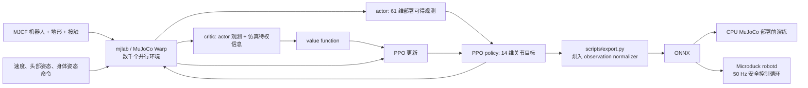

<!-- Generated by the offline translation workflow.
Source: 05-具身场景的深度和强化学习/05-OpenDuckMini与Microduck双足强化学习/README.md
Source SHA-256: 5bac52fb3c21abd62791181d3f5c6834c150491878379388a9880a5b002c1c0c
Model: tencent/Hy-MT2-1.8B-GGUF:Q4_K_M
Review machine-translated technical claims before relying on them.
-->
# Open Duck Mini and Microduck: Walking from URDF Model to Dual-Body Reinforcement Learning

This section breaks down two generations of open-source bipedal robots named “Little Ducks”: [Open Duck Mini v2](https://github.com/apirrone/Open_Duck_Mini/tree/v2) and [Microduck](https://github.com/pollen-robotics/microduck). We do not consider them as two scripts in the same repository, but rather examine the entire chain: where the robot description files are downloaded, how the reinforcement learning environment is assembled, how PPO learns speed tracking, and why the checkpoint must go through the official export script to become an ONNX policy usable by a real robot.

After completing this section, everyone should be able to:

- Define the responsibility boundaries for the four projects: Open Duck Mini v2, Open Duck Playground, Microduck, and Microduck RL;
- Only download the URDF of Open Duck Mini v2 and its STL mesh, and verify that all assets are complete;
- Run the smoke test for `64 个环境 x 5 次迭代` on Microduck RL before initiating formal training;
- Play back the policy, record simulation videos, export ONNX with normalized observations, and perform pre-deployment testing in CPU MuJoCo;
- Determine what additional engineering steps are needed for a policy that “moves in simulation” to achieve stable 50 Hz movement on a real robot.

## 1. First, clarify the four items

The “Open Duck” project has gone through multiple iterations in mechanical design, reference action generation, MuJoCo reinforcement learning, and operation on the new generation real robot. The names are similar, but the file formats and commands cannot be mixed together.

| Item | Role | Robot Description | How to Use During Learning |
| :-- | :-- | :-- | :-- |
| [Open Duck Mini v2](https://github.com/apirrone/Open_Duck_Mini/tree/v2) | An open-source mechanical and embedded resource center measuring about 42 cm | `robot.urdf` and `robot.xml`, STL files stored in the same directory | Learn URDF, mechanical structure, and early sim-to-real |
| [Open Duck Reference Motion Generator](https://github.com/apirrone/Open_Duck_reference_motion_generator) | Generates gait reference motions using Placo | Contains URDF and mesh files for multiple generations of Duck | Generates `polynomial_coefficients.pkl` for imitation rewards |
| [Open Duck Playground](https://github.com/apirrone/Open_Duck_Playground) | MuJoCo Playground/JAX training pipeline for Open Duck Mini v2 | Uses MJCF from the repository | Reproduction of the walking policy of the older Duck |
| [Microduck RL](https://github.com/pollen-robotics/microduck_rl) + [Microduck](https://github.com/pollen-robotics/microduck) | Training and real robot versions of a new generation duck measuring about 25 cm and weighing 800 g | The training pipeline uses MJCF; no URDF as the entry point | Learn the complete chain from `mjlab + MuJoCo Warp + PPO + ONNX + 50 Hz runtime` |

> **Key judgment:** If your goal is to “download the URDF for mechanical structure research,” start with Open Duck Mini v2; if you aim to “run the current official reinforcement learning training,” start with Microduck RL. Directly replacing the URDF of Open Duck Mini v2 into Microduck RL will not succeed automatically, as the joint names, degrees of freedom, component masses, colliders, and the observation/action contracts for the policy are different.

## II. Establish an intuitive understanding of the official effect first

<p align="center">
  
</p>

**Figure 1: Overview of the Microduck RL official project.** The new generation of projects does not train a single walking policy, but incorporates tasks such as speed tracking, standing up, sitting, grasping, kicking the ball, forward roll, and skating into a shared task registry. They share a 61-dimensional actor observation and 14-dimensional action contract, allowing the real robot to switch between walking, standing, and skill policies during operation.

<p align="center"><sub> Source: The top image on the `microduck_rl` repository README page by Pollen Robotics. The original project was released under the Apache-2.0 license. </sub></p>

<video controls muted playsinline preload="metadata" width="100%">
  <source src="../../../05-具身场景的深度和强化学习/05-OpenDuckMini与Microduck双足强化学习/assets/official_videos/microduck_real_walking.mp4" type="video/mp4">
</video>

**Video 1: Microduck real robot walking clip.** This material is from the real robot demonstration on the Microduck RL official project page. The tutorial extracted the first 20 seconds and converted it into a H.264 MP4 format that is easier to play in a browser. This shows the effects of the official policy, not the result of this tutorial being retrained locally.

<video controls muted playsinline preload="metadata" width="100%">
  <source src="../../../05-具身场景的深度和强化学习/05-OpenDuckMini与Microduck双足强化学习/assets/local_videos/microduck_4096env_6000iter_walk.mp4" type="video/mp4">
</video>

**Video 2: The results of reinforcement learning on the 4096 environment completed in this tutorial.** We started from the `29e887e` version of `microduck_rl`, trained 6000 PPO iterations on `Mjlab-Velocity-Flat-MicroDuck`, and then replayed with the final `model_5999.pt` using the fixed `0.4 m/s` forward command. The recording excluded the external pushing events during the testing phase, but no post-processing was performed on the checkpoint, nor were any successful segments trimmed.

| Reproduction Experiment Items | Actual Values |
| :-- | :-- |
| Number of Parallel Environments | 4096 |
| Sampling Steps per Environment per Round | 24 |
| PPO Iterations | 6000 |
| Total Simulation Transitions | 589,824,000 |
| Training Time | 1 hour 27 minutes 41 seconds |
| Final Mean Reward / Mean Episode Length | 119.57 / 972.52 |
| Exported ONNX Contract | `[1, 61] -> [1, 14]` |

These values are used to indicate the source and reproduction scale of the videos presented in this section. They should not be ranked directly alongside other experiments based solely on the code version, random seed, and curriculum.

<video controls muted playsinline preload="metadata" width="100%">
  <source src="../../../05-具身场景的深度和强化学习/05-OpenDuckMini与Microduck双足强化学习/assets/local_videos/microduck_command_dance.mp4" type="video/mp4">
</video>

**Video 3: The command choreography completed using the same walking policy for the tutorial.** This is not a separate training dance checkpoint, but rather `vx / vy / yaw rate` and the four-dimensional head pose commands are changed over time. The already trained 61-dimensional policy executes head nod, side movement, left/right turning, forward/backward steps, and arcs in real time. The entire 12-second video is from a continuous closed loop rollout, without modifying the robot’s posture frame by frame.

<video controls muted playsinline preload="metadata" width="100%">
  <source src="../../../05-具身场景的深度和强化学习/05-OpenDuckMini与Microduck双足强化学习/assets/official_videos/open_duck_mini_v2_sim_walking.mp4" type="video/mp4">
</video>

**Video 4: Official simulation of Open Duck Mini v2 walking.** This video is from the “Turning MuJoCo Playground” section of the Open Duck Mini v2 project. It corresponds to the older 42 cm robot, but not to the 14-degree-of-freedom policy contract of the new Microduck.

## III. The Complete Training Process from the Architecture Diagram



**Figure 2: Data flow of Microduck RL.** This architecture consists of five essential modules that cannot be skipped.

### 1. Robot and actuator models

The main MJCF of Microduck RL is located at:

```text
src/mjlab_microduck/robot/microduck/
├── robot_walk.xml
├── robot_allcollisions.xml
├── robot_allcollisions_rollers.xml
├── robot_*_backlash.xml
└── scene*.xml
```

`robot_walk.xml` is used for speed tracking, reducing unnecessary contact between the torso and head; `robot_allcollisions.xml` retains body collisions for standing up, sitting, grasping, and forward roll; the rollers version adds non-driven wheels on the feet. In training, the motor is not treated as an ideal PD actuator, but instead a [BAM](https://github.com/Rhoban/bam) Dynamixel XL330 actuator model is used, incorporating factors such as back EMF, Coulomb/static friction, load-related friction, and battery voltage.

### 2. Observation, Command, and Action Contracts

The actor input of the new policy is 61 dimensions, and the output is a 14-dimensional joint motion. The command slots are fixed as follows:

```text
twist 速度命令 3 维
+ head pose 命令 4 维
+ body pose 命令 6 维
= 13 维命令子向量
```

The remaining observations come from the IMU, joint position/velocity, and historical actions. The actor does not use the base linear velocity that is difficult to obtain reliably with a real robot; the critic can additionally access this simulation true value during training. This is a typical asymmetric actor-critic architecture: the value network uses more complete information to accelerate learning, while the policy network remains viable for deployment.

### 3. Rewards are not a single "move forward" item

Rewards and constraints for the main task `Mjlab-Velocity-Flat-MicroDuck` can be roughly divided into:

| Category | Representative Item | Function |
| :-- | :-- | :-- |
| Task Reward | linear/angular velocity tracking | Track `vx, vy, yaw rate` command |
| Posture Reward | upright, pose, head pose tracking | Avoid tipping over for speed while maintaining head control |
| Gait Reward | air time, foot clearance, swing height | Encourage feet to truly leave the ground and prevent sliding on the ground |
| Smoothness and Safety | action rate, self collision, foot slip | Suppress high-frequency jitter, self-collision, and excessive foot slipping |
| Curriculum Learning | standing fraction, head-pose range, reward weight | First learn basic gait, then gradually increase command range and intensity |

What is most worth learning here is not a specific weight, but the competition among reward items. For example, the foot-slip penalty is too heavy, which suppresses the pivot motion required for the small robot to turn in place; the action-rate is too high from the first step, forcing the agent to stay still before it even learns how to walk. Therefore, the official configuration uses a curriculum approach, allowing smooth constraints and a broader command range to be introduced gradually in later stages.

### 4. Four-layer protection for Sim-to-real

Microduck RL does not rely on a perfectly accurate simulator, but it does four things simultaneously:

1. Use BAM to reduce the gap in actuators between ideal motors and small servos;
2. Perform domain randomization on mass/inertia, center of mass, friction, voltage, IMU installation deviation, encoder zero offset, and action latency;
3. Provide a `Backlash` task variant that simulates gear backlash using a driven-free passive joint;
4. Before the real robot, reenact the same observation/action contract and policy switching as runtime using `infer_policy.py`.

## IV. Recommended Main Line: Train the New Microduck Walking Policy

### 0. Environmental Prerequisites

Official project requirements:

- Linux x86_64 or officially adapted Linux ARM environment;
- Supports CUDA GPUs of the current training stack, and training is performed via MuJoCo Warp. No specific graphics card model is required;
- Python `>=3.12,<3.13`, created by `uv` using `uv.lock`;
- For formal training,Weights & Biases is used by default to save experiments and checkpoints.

First, check the GPU and basic tools:

```bash
nvidia-smi
git --version
curl --version
```

### 1. Clone and Install

Working directory: Any Linux workspace without spaces.

```bash
curl -LsSf https://astral.sh/uv/install.sh | sh
source "$HOME/.local/bin/env"

git clone https://github.com/pollen-robotics/microduck_rl.git
cd microduck_rl
uv sync

# 正式训练前登录 W&B，用于记录曲线和 checkpoint
uv run wandb login
```

If the local environment is not convenient for the time being, you can also execute the same set of commands on a cloud development machine. For example, after creating a Linux development instance with free computing power, you can directly enter the Jupyter Terminal from the console or copy the SSH command to log in, without having to modify the training code of Microduck RL.

> [!TIP]
> **Recommended mirror for free computing power: [ Mujoco physics engine: Robotics learning research and simulation to reality ](https://www.gpufree.cn/images/101302)**
>
> This mirror is prepared with Ubuntu 22.04, CUDA 12.8, MuJoCo 3.4.1, `mujoco_warp`, and `mujoco_playground`. It is suitable for observing the simulation via remote desktop from a browser, or you can directly run the following commands using Jupyter or SSH. The Playground environment included in the mirror is not the locked environment of the Microduck RL project; therefore, `git clone` and `uv sync` still need to be executed. Do not skip the installation of project-specific dependencies.

It is recommended to store projects, dependency caches, and training outputs on the data disk instead of the default system disk:

```bash
export WORKSPACE=/root/gpufree-data/microduck
export UV_CACHE_DIR=/root/gpufree-data/.cache/uv

mkdir -p "$WORKSPACE" "$UV_CACHE_DIR"
cd "$WORKSPACE"

git clone https://github.com/pollen-robotics/microduck_rl.git
cd microduck_rl
uv sync
```

Next, continue to follow the same order of smoke test, formal training, and ONNX export as in this section. In this way, `logs/`, checkpoint, video recordings, and `output.onnx` are all stored in the data disk directory and can be downloaded via the Jupyter file list. Before leaving for a while, shut down the instance in the console; once the results have been downloaded and no longer needed, then decide whether to release the instance, to avoid confusing "shutting down" with "deleting data".

When downloading the CUDA wheel for ARM devices such as DGX Spark/GB10 or Jetson for the first time, the official recommendation is to increase the `uv` timeout:

```bash
export UV_HTTP_TIMEOUT=600
uv sync
```

**Checkpoint 1:** Do not train immediately. First, ensure the task registry and CPU unit tests are functioning properly.

```bash
uv run list-envs | grep MicroDuck
uv run --with pytest pytest tests/
```

Seeing tasks such as `Mjlab-Velocity-Flat-MicroDuck` and successful testing only proves that dependencies, the registry, and configuration constraints are functional, but it does not mean that GPU training can operate stably for a long time.

### 2. Five essential iterations of smoke test

The official maintainer explicitly recommends in `AGENTS.md` to run 64 parallel environments and perform 5 PPO iterations before long training:

```bash
uv run train Mjlab-Velocity-Flat-MicroDuck \
  --env.scene.num-envs 64 \
  --agent.max_iterations 5
```

**Checkpoint 2:** What this small test aims to prove is:

- MuJoCo Warp can create a parallel environment on CUDA;
- The actor observation and action dimensions are consistent with the model;
- Each reward/termination/event can be processed once;
- Rollout does not produce NaN within a few steps;
- Checkpoint can write to the `logs/` directory.

It does not prove that the policy has learned to walk. It is normal for the actions during 5 iterations to remain close to randomness.

### 3. Formal Training

```bash
uv run train Mjlab-Velocity-Flat-MicroDuck \
  --env.scene.num-envs 4096
```

The experience provided in the official README is that available walking patterns can be seen in about 1–2 hours in a 4096 environment, but the actual convergence time is affected by the GPU, current configuration, random seed, and curriculum. Do not treat this number as a strict guarantee.

The complete command used in this video section is as follows. `WANDB_MODE=offline` ensures that the training logs are written locally, which is suitable for workstations where W&B is not connected temporarily. When cloud-based experiment tracking is required, remove this option and execute `wandb login` in advance.

```bash
WANDB_MODE=offline uv run train Mjlab-Velocity-Flat-MicroDuck \
  --env.scene.num-envs 4096 \
  --agent.max_iterations 6000 \
  --agent.save-interval 500 \
  --agent.run-name every-embodied-4096x6000
```

If the goal is to fully experience the entire process of "training, saving a checkpoint, exporting to ONNX, and replaying," you can use the 64 environments used in the smoke test, but increase the number of iterations. Below is a practice configuration that is easier to start on a regular development machine or cloud instance:

```bash
uv run train Mjlab-Velocity-Flat-MicroDuck \
  --env.scene.num-envs 64 \
  --agent.max_iterations 10000
```

Here, `64 x 10000` represents the teaching configuration after reducing the parallel scale. It is not equivalent to directly using the results of five smoke tests as training outcomes, nor does it correspond to the training efficiency of the official 4096 environment configuration. During the first practice, you can stop actively after confirming that the checkpoint is properly written and the reward curve continues to change, then proceed to the export step. If a better gait is required, extend the training or increase the number of parallel environments.

At least the following should be monitored during a normal training:

| Metric | What to Look At | Common Misjudgments |
| :-- | :-- | :-- |
| mean reward | Long-term trend is upward, not every iteration | Only focusing on total reward, ignoring how the policy exploits rewards |
| episode length | Interpreted together with the current curriculum stage and fall rate | Longer is always better |
| velocity tracking | Both linear and angular velocities improve | Thinking that moving forward means mastering turning |
| penalty terms | The weighted penalty should be non-positive | The sign is reversed; the policy scores by self-collision and other behaviors |
| Motion and posture videos | Whether it scratches the ground, jumps with the buttocks, pushes the head against the ground, or high-frequency shaking | Only looking at the curve, ignoring physical behavior |

The official command form for restoration after interruption is:

```bash
uv run train Mjlab-Velocity-Flat-MicroDuck \
  --env.scene.num-envs 4096 \
  --agent.run-name resume \
  --agent.load-checkpoint model_29999.pt \
  --agent.resume True
```

### 4. Playback and recording of walking or dance videos

The official quickstart uses the W&B run path to locate the checkpoint:

```bash
uv run play Mjlab-Velocity-Flat-MicroDuck \
  --wandb-run-path <entity/project/run_id>
```

If the checkpoint is saved locally, it can be played back directly using `--checkpoint-file`:

```bash
uv run play Mjlab-Velocity-Flat-MicroDuck \
  --checkpoint-file logs/rsl_rl/velocity/<run-name>/model_<iteration>.pt
```

The official `play` command is suitable for interactive observation, but the Viser service will continue to run after recording a specified number of frames. To automatically generate a short, close-up tracking video with a limited duration on a desktopless Linux workstation, this tutorial provides `record_microduck_policy.py`:

```bash
export EVERY_EMBODIED=/path/to/every-embodied

MUJOCO_GL=egl uv run python \
  "$EVERY_EMBODIED/05-具身场景的深度和强化学习/05-OpenDuckMini与Microduck双足强化学习/record_microduck_policy.py" \
  --checkpoint logs/rsl_rl/velocity/<run-name>/model_<iteration>.pt \
  --output-dir artifacts/microduck-video \
  --frames 600 \
  --width 960 \
  --height 540 \
  --speed 0.4 \
  --seed 42
```

`--motion walk` is the default mode. The script will disable external force events during training, set the fixed forward velocity command, and actively shut down the environment after recording 600 frames. The video is written to `artifacts/microduck-video/`. It only changes the playback conditions; it does not alter the checkpoint. The recordings serve as physical evidence for gait, foot slip, falls, and tremors, and cannot be replaced by a total reward curve.

#### Use the same policy to orchestrate a dance routine

The 61-dimensional observation of the walking policy already includes the `twist(3) + head_pose(4) + body_pose(6)` command slot, so there is no need to retrain the policy for each action display. After adding `--motion dance`, the script will write a set of bounded, continuously changing commands within 12 seconds:

```bash
MUJOCO_GL=egl uv run python \
  "$EVERY_EMBODIED/05-具身场景的深度和强化学习/05-OpenDuckMini与Microduck双足强化学习/record_microduck_policy.py" \
  --checkpoint logs/rsl_rl/velocity/<run-name>/model_<iteration>.pt \
  --output-dir artifacts/microduck-dance \
  --motion dance \
  --frames 600 \
  --width 960 \
  --height 540 \
  --seed 42
```

| Time | Main commands written | Visible actions |
| :-- | :-- | :-- |
| 0–2 s | Speed at zero, sinusoidal head movement | Original head movement, swaying, and tipping |
| 2–4 s | `vy` variation left and right | Lateral steps |
| 4–6 s | `yaw rate` variation left and right | Turning left and right |
| 6–8 s | `vx` positive and negative changes | Forward and backward movement |
| 8–10 s | Positive `vx` plus fixed `yaw rate` | Moving along an arc |
| 10–12 s | Overlap of side movement, turning, and head commands | Combined final action |

During each control cycle, the script first updates the command tensor in `command_manager`, then constructs observations, calls the policy, and advances MuJoCo. The actions are still output by the PPO policy, rather than directly writing the preset joint angles into the simulation. All velocities and head commands are limited within the sampling range during policy training.

Here, it is necessary to distinguish between "command choreography" and "new skill training". Command choreography reuses existing walking policies, making it suitable for rapid verification of unified command interfaces; forward rolls, kicks, and roller skating rotations change the contact mode or robot model, requiring training for their respective official tasks:

| Technique to be demonstrated | Official task | Whether the walking checkpoint is reused |
| :-- | :-- | :-- |
| Sit down and stand up | `Mjlab-SitStand-Flat-MicroDuck` | No |
| Forward roll | `Mjlab-Roulade-Flat-MicroDuck` | No |
| Kicking the ball | `Mjlab-BallKick-Flat-MicroDuck` | No |
| Roller skating rotation | `Mjlab-Spin-Flat-MicroDuck` | No, using the rollers model |

The Microduck RL currently does not have a registered task named `Dance`. Therefore, this tutorial accurately labels the above video as command choreography. If we want to train dance skills that can withstand disturbances and be triggered arbitrarily, we should add task configurations with phases or reference movements, rather than treating the demonstration script as training results.

### 5. Export ONNX and CPU MuJoCo experiments

```bash
uv run scripts/export.py Mjlab-Velocity-Flat-MicroDuck \
  --wandb-run-path <entity/project/run_id> \
  --onnx-file output.onnx

uv run scripts/infer_policy.py --walking output.onnx --new-cmd-obs
```

`scripts/export.py` is not just changing the suffix of the PyTorch network. It also incorporates the observation normalizer used during training into the ONNX computation graph. Manual conversion of checkpoints may fail completely during deployment due to unnormalized inputs, even if the dimensions match.

Before opening the MuJoCo window, it is recommended to perform a non-monitor-dependent ONNX contract check:

```bash
uv run python - <<'PY'
import numpy as np
import onnxruntime as ort

session = ort.InferenceSession("output.onnx")
model_input = session.get_inputs()[0]
model_output = session.get_outputs()[0]
print(f"input : {model_input.name} {model_input.shape} {model_input.type}")
print(f"output: {model_output.name} {model_output.shape} {model_output.type}")

assert model_input.shape == [1, 61], model_input.shape
assert model_output.shape == [1, 14], model_output.shape
action = session.run(None, {model_input.name: np.zeros((1, 61), dtype=np.float32)})[0]
assert action.shape == (1, 14) and np.isfinite(action).all()
print("ONNX contract and one-step inference: PASS")
PY
```

The 61-dimensional input of the current policy consists of 48-dimensional ontology observations and 13-dimensional commands, with the command layout being `twist(3) + head_pose(4) + body_pose(6)`. `infer_policy.py` is used to support compatibility with old checkpoints, and a 51-dimensional input is still constructed by default, which is 48-dimensional ontology observations plus the old 3-dimensional commands. Therefore, if the new model omits `--new-cmd-obs`, `Got: 51 Expected: 61` will occur. Here, the inference parameters need to be corrected; the model input cannot be arbitrarily truncated or zero-padded at the end, as the semantics and arrangement of the command slots must also remain consistent with the training.

`infer_policy.py` supports keyboard speed commands, and can also load policies such as walking, standing, sit-stand, and roulade simultaneously:

```bash
uv run scripts/infer_policy.py \
  --walking walk.onnx \
  --standing stand.onnx \
  --sitstand sitstand.onnx \
  --roulade roulade.onnx \
  --new-cmd-obs
```

This step requires checking three things: whether the ONNX input/output is `[1,61] -> [1,14]`, whether the command slots match the runtime, and whether there is a sudden posture change during policy switching.

`infer_policy.py` uses the native MuJoCo interaction window and requires a valid desktop session and OpenGL context. When started via a pure SSH terminal, `GLXBadDrawable` may still occur after model dimension correction; this is a display link error, which is a separate issue from ONNX itself. When keyboard control is required, the command should be run in the local desktop or in a remote desktop/VNC session terminal. If you only want to verify the model on a server without a desktop, run the contract check first; when generating non-interactive videos, use the recording script from the previous section and enable EGL:

```bash
MUJOCO_GL=egl uv run python \
  "$EVERY_EMBODIED/05-具身场景的深度和强化学习/05-OpenDuckMini与Microduck双足强化学习/record_microduck_policy.py" \
  --checkpoint logs/rsl_rl/velocity/<run-name>/model_<iteration>.pt \
  --output-dir artifacts/microduck-video
```

If the contract check passes but the interaction window fails, focus only on `DISPLAY`, remote desktop sessions, and OpenGL/GLX, and do not re-export ONNX. If the contract check itself fails, then return to checkpoint, export script, and observation contract for troubleshooting.

### 6. Real robot deployment boundaries

The `robotd` in the Microduck real robot repository runs at 50 Hz, reads the IMU and servo states, generates a 61-dimensional observation, calls the ONNX policy, and converts the 14-dimensional action into joint targets. However, there must still be a connection from `output.onnx` to the real robot:

- Joint order, direction, zero position, and limit verification;
- IMU coordinate system and installation deviation calibration;
- Disconnection, overheating, fall, abnormal motion amplitude, and policy loading failure protection;
- Slight hanging test, support frame test, and landing test with safety rope, followed by free walking.

Therefore, the commands in this section are limited to the CPU MuJoCo experiment. Without completing the above hardware calibration and security access setup, do not write new policies directly onto the real robot.

## 5. Download Open Duck Mini v2 URDF and complete mesh

The `robot.urdf` of Open Duck Mini v2 is not a single-file model. It contains 21 links and 20 joints, and references 45 types of STL meshes in the same directory. Only `robot.urdf` can be downloaded from the GitHub webpage, and `body_front.stl not found` type errors will occur during loading.

### Method A: Sparse clone robot model directory

```bash
git clone --depth 1 --filter=blob:none --sparse --branch v2 \
  https://github.com/apirrone/Open_Duck_Mini.git
cd Open_Duck_Mini
git sparse-checkout set mini_bdx/robots/open_duck_mini_v2
```

The key files after downloading are:

```text
Open_Duck_Mini/mini_bdx/robots/open_duck_mini_v2/
├── robot.urdf
├── robot.xml
├── robot_motors.xml
├── config.json
├── *.stl
└── *.part
```

Run the following command for integrity check:

```bash
MODEL_DIR=mini_bdx/robots/open_duck_mini_v2
test -f "$MODEL_DIR/robot.urdf"
test "$(find "$MODEL_DIR" -maxdepth 1 -name '*.stl' | wc -l)" -gt 0
grep -n 'mesh filename' "$MODEL_DIR/robot.urdf" | head
```

In URDF, the mesh path is written in a format like `package:///body_front.stl`. Different loaders have different interpretations of empty package names; if the viewer cannot find the mesh, the package/resource root should be pointed to this model directory instead of removing all mesh references.

In an environment where ROS is installed, you can first perform an XML/link tree check:

```bash
check_urdf "$MODEL_DIR/robot.urdf"
```

`check_urdf` has been verified in the target simulator for grid paths, inertia, collision bodies, and joint directions. It is merely the first structural check.

### Method B: Download the URDF from the reference action repository

If the goal is to generate imitation learning reference trajectories, cloning the reference-motion repository is more appropriate. This repository uses Git LFS:

```bash
sudo apt update
sudo apt install -y git-lfs
git lfs install

git clone https://github.com/apirrone/Open_Duck_reference_motion_generator.git
cd Open_Duck_reference_motion_generator
git lfs pull

uv run scripts/auto_waddle.py -j4 \
  --duck open_duck_mini_v2 \
  --sweep

uv run scripts/fit_poly.py --ref_motion recordings/
uv run scripts/replay_motion.py -f recordings/<motion-file>.json
```

The number of parallel processes should be explicitly specified after `-j`, for example, in `-j4`. The official README warns that using `-j` alone will attempt to occupy all CPU cores, and ordinary machines may become unresponsive due to memory and scheduling pressures.

## VI. Reproduction of the Old Open Duck Mini v2 Training Line

If your goal is the 42 cm Open Duck Mini v2, you should use the corresponding Open Duck Playground instead of the new Microduck task.

```bash
git clone https://github.com/apirrone/Open_Duck_Playground.git
cd Open_Duck_Playground

curl -LsSf https://astral.sh/uv/install.sh | sh
source "$HOME/.local/bin/env"

uv run playground/open_duck_mini_v2/runner.py \
  --task flat_terrain_backlash \
  --num_timesteps 300000000
```

Playback the exported ONNX:

```bash
uv run playground/open_duck_mini_v2/mujoco_infer.py \
  -o <path-to-policy.onnx>
```

If you want to enable the imitation reward, you need to copy the `polynomial_coefficients.pkl` generated in the previous section to:

```text
playground/open_duck_mini_v2/data/polynomial_coefficients.pkl
```

Then, in `playground/open_duck_mini_v2/joystick.py`, set `USE_IMITATION_REWARD` to `True`. This is a separate reproduction line for the old robot model, and its checkpoint should not be directly placed in the new Microduck `robotd`.

## VII. Common Failures and Troubleshooting

| Phenomenon | Cause | Handling |
| :-- | :-- | :-- |
| `uv sync` downloading CUDA wheel fails to complete | ARM requires downloading several GB of dependencies for the first time | Retry after `export UV_HTTP_TIMEOUT=600` |
| GPU not found during training start | CPU-only PyTorch is installed, or CUDA/driver is unavailable | Check `nvidia-smi` and `uv run python -c "import torch; print(torch.cuda.is_available())"` |
| URDF shows only axes, no robot appearance | Only `robot.urdf` is downloaded, or resource root is incorrect | Download the entire `open_duck_mini_v2/` directory, pointing the resource root to the STL directory |
| Training reward increases but robot does not move | Rewards exploit loopholes, such as shaking in place or local contact with the ground | Record and replay to check tracking, air-time, slip, and action-rate separately |
| Simulation replay works, but manually exported ONNX fails | Observation normalizer is not included in the computation graph | Export using only `scripts/export.py` |
| ONNX Runtime reports `Got: 51 Expected: 61` | The new 61-dimensional model uses the old 51-dimensional inference observations | First check the ONNX contract, then add `--new-cmd-obs` to `infer_policy.py` |
| Remote execution reports `GLXBadDrawable` | SSH session lacks a valid desktop/GLX context, or the graphical window is broken | Switch interactive replay to running on the local desktop or VNC; use `MUJOCO_GL=egl` for no-screen recording |
| Policy causes high-frequency jitter on the real robot | Action latency, joint order, zero position, or actuator dynamics mismatch | Return to CPU MuJoCo exercises and small-scale floating tests; stop trial-and-error on the ground |
| Reference generator indicates STL storage representation error | Git LFS grid not pulled | Execute `git lfs pull` in the repository |

## VIII. Recommended Learning Order

1. First, watch the two official videos in this section to understand the target effects of real robot and simulation.
2. Explore the model directory of the sparse cloned Open Duck Mini v2 to clarify the relationships between URDF, STL, link, and joint.
3. Run CPU tests and `64 env x 5 iterations` smoke tests successfully in Microduck RL.
4. Start formal training in the 4096 environment while watching item rewards and behavior videos.
5. Generate ONNX using the official export script, and simulate keyboard control and policy switching in CPU MuJoCo.
6. Only after passing the observation contract, joint calibration, and hardware safety mechanisms will we proceed to use a real robot.

## 9. Reference Materials and Source of Materials

- [Pollen Robotics Microduck on a real robot](https://github.com/pollen-robotics/microduck)
- [Pollen Robotics Microduck RL](https://github.com/pollen-robotics/microduck_rl)
- [Open Duck Mini v2](https://github.com/apirrone/Open_Duck_Mini/tree/v2)
- [Open Duck Playground](https://github.com/apirrone/Open_Duck_Playground)
- [Open Duck Reference Motion Generator](https://github.com/apirrone/Open_Duck_reference_motion_generator)
- [BAM: Better Actuator Models](https://github.com/Rhoban/bam)
- [mjlab](https://github.com/mujocolab/mjlab)
- [MuJoCo Playground](https://github.com/google-deepmind/mujoco_playground)
- [microduck Whiteboard Complete Training Guide (Bilibili)](https://www.bilibili.com/video/BV1jUtG6KEiC/)

Both of the two videos and the header image in this section are from the above official project page. The videos have only been converted in format, scaled, and cut up; the experimental content remains unchanged. The software code for Microduck and Microduck RL is licensed under Apache-2.0, and the 3D models in Microduck RL are licensed under Creative Commons BY-SA-NC. The code and mechanical assets of Open Duck Mini should also follow the current `LICENSE` and third-party asset statements of the corresponding repositories. The Bilibili tutorial only provides a link to the original page and does not reproduce its video files in this repository.
