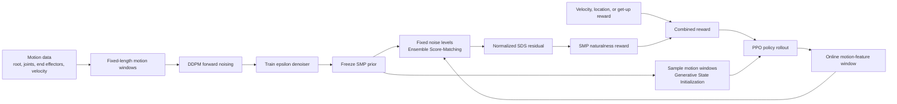

<!-- English translation reviewed after the offline workflow rejected leaked Markdown protection tokens.
Source: 05-具身场景的深度和强化学习/06-SMP可复用分数匹配运动先验/README.md
Source SHA-256: 01ec99105bf2e78edf3c39d3090cb571e9630723e675a00aef8ed57007ae71de
-->
# SMP: Training Humanoid Robots with Reusable Score-Matching Motion Priors

This chapter introduces [SMP (Score-Matching Motion Priors)](https://yxmu.foo/smp-page/). A compact motion diffusion model is first trained on motion data and then frozen. During reinforcement learning, the frozen model becomes a motion-naturalness reward. The same prior can therefore guide velocity tracking, steering, target-location, dodging, and interaction tasks without retraining a discriminator for every new controller.

Two codebases must be distinguished:

- [xbpeng/MimicKit](https://github.com/xbpeng/MimicKit) is the original reference implementation released by the paper authors.
- [SUZ-tsinghua/smp](https://github.com/SUZ-tsinghua/smp) is an `mjlab`-based course reproduction for Unitree G1. It provides the G1 feature pipeline, four downstream tasks, and three pretrained motion priors.

After this chapter, you should understand why SMP is not an ordinary motion generator, how a diffusion model becomes a PPO reward, what ESM, Adaptive Normalization, and GSI solve, and how to skip prior pretraining and start G1 reinforcement learning with the released checkpoints.

## 1. What Problem Does SMP Solve?

Adversarial motion priors such as AMP usually train a discriminator together with the current policy. When the downstream task changes, the policy visits a different state distribution, so the discriminator often has to be retrained while continuing to access the original motion dataset. SMP separates the process into two stages:

1. **Prior pretraining:** train a diffusion denoiser on fixed-length motion windows.
2. **Downstream control:** freeze the diffusion model, use it to score whether policy motion remains close to the motion distribution, and convert that score into a PPO reward.
3. **Task reuse:** replace the task reward and environment for a new objective without retraining the motion prior.

The core idea is therefore:

> **A frozen diffusion model scores a motion window, and that score regularizes a reinforcement-learning policy.**

The official project demonstrates one prior reused across tasks, more than 100 styles, style composition, joint human-object motion, and transfer to a physical G1. The paper appears in ACM Transactions on Graphics for SIGGRAPH 2026; arXiv v3 was updated in April 2026.

## 2. Official Results

<p align="center">
  
</p>

**Figure 1. Official SMP motion-style examples.** The colored characters show different motion styles. The point is that a frozen prior can constrain multiple natural behaviors instead of fitting a separate reference trajectory for each task.

<p align="center"><sub>Source: the official `xbpeng/MimicKit` repository. The original image was resized for the web.</sub></p>

<video controls muted playsinline preload="metadata" width="100%">
  <source src="../../../05-具身场景的深度和强化学习/06-SMP可复用分数匹配运动先验/assets/official_videos/smp_pipeline.mp4" type="video/mp4">
</video>

**Video 1. Official SMP pipeline.** A motion diffusion model is pretrained on reference motions. During PPO, noise is added to a policy motion window, the frozen denoiser predicts that noise, and the prediction residual becomes the motion-prior reward. The project-page video was converted to browser-compatible H.264 MP4.

<video controls muted playsinline preload="metadata" width="100%">
  <source src="../../../05-具身场景的深度和强化学习/06-SMP可复用分数匹配运动先验/assets/official_videos/g1_forward.mp4" type="video/mp4">
</video>

**Video 2. G1 forward task from the Tsinghua reproduction.** The task samples target speeds from `0.5-5.0 m/s`. This is the command range, not proof that every rollout stably reaches 5 m/s. Actual root velocity must be measured from rollout logs.

<video controls muted playsinline preload="metadata" width="100%">
  <source src="../../../05-具身场景的深度和强化学习/06-SMP可复用分数匹配运动先验/assets/official_videos/g1_steering.mp4" type="video/mp4">
</video>

**Video 3. G1 steering task from the Tsinghua reproduction.** The target velocity and body-facing direction may differ, so the policy must discover natural side steps and cross steps under SMP guidance.

<p align="center"><sub>Videos 2 and 3 come from the `assets` branch of `SUZ-tsinghua/smp`; the source GIFs were converted to H.264 MP4.</sub></p>

## 3. Architecture: How a Diffusion Prior Enters PPO



**Figure 2. SMP training and reuse pipeline.** The upper path trains the motion diffusion prior once. The lower path can be repeated for many tasks. The same frozen prior scores motion and generates diverse initial states.

### 3.1 Motion-window representation

The diffusion model consumes structured motion states rather than rendered images. The G1 reproduction uses a 10-frame window with 59 features per frame:

```text
root_pos(3)
+ root_rot(6)
+ joint_pos(29)
+ end_effector_pos(15)
+ root_linear_velocity(3)
+ root_angular_velocity(3)
= 59 dimensions / frame
```

The five tracked end effectors are the two feet, torso, and two hands. Spatial quantities are transformed into the yaw-local frame of the final window frame, and root position is made relative to that frame. This removes world translation and global heading so the prior learns how the body moves rather than where an environment is placed in the simulation grid.

### 3.2 DDPM noise predictor

Gaussian noise is added to a normalized motion window $x_0$:

$$
x_t=\sqrt{\bar\alpha_t}x_0+\sqrt{1-\bar\alpha_t}\epsilon,
\qquad \epsilon\sim\mathcal N(0,I).
$$

The denoiser $\epsilon_\theta(x_t,t)$ learns to recover the injected noise. The G1 reproduction uses an L1 noise-prediction loss. The goal is not necessarily to generate a complete trajectory frame by frame; the denoiser learns local directions of the motion-data distribution at multiple noise scales.

### 3.3 SDS turns denoising error into reward

For a new policy motion window, SMP adds noise and evaluates:

$$
e_t(x_0)=\left\|\epsilon_\theta(x_t,t)-\epsilon\right\|^2.
$$

A window close to the training-motion manifold is easier for the frozen denoiser to interpret, so its residual tends to be smaller. Unnatural or out-of-distribution motion produces a larger residual. An exponential mapping converts the residual into a nonnegative reward:

$$
r_{\mathrm{SMP}}(x_0)=
\exp\left(-\lambda\,\bar e(x_0)\right).
$$

PPO does not backpropagate through and update the diffusion model. The prior remains frozen; policy-gradient updates still optimize only the controller.

### 3.4 ESM evaluates several noise levels

Evaluating SDS at one random timestep creates a high-variance reward. Small-noise steps emphasize motion detail, while large-noise steps emphasize global structure. Ensemble Score-Matching (ESM) aggregates a fixed timestep set $K$:

$$
\bar e(x_0)=\frac{1}{|K|}\sum_{t\in K}
\frac{e_t(x_0)}{\mu_t+\varepsilon}.
$$

The G1 reproduction defaults to `(8, 15, 22)`. Averaging several scales reduces reward variance without evaluating every diffusion timestep at every environment step.

### 3.5 Adaptive Normalization aligns reward scales

Raw SDS errors differ substantially across timesteps and diffusion checkpoints. If they are averaged directly, a naturally large-error timestep can dominate the reward. SMP keeps a running mean $\mu_t$ for each timestep and normalizes before aggregation, reducing manual tuning of `sds_loss_scale`.

The G1 repository also emphasizes `datasets/norm_stats.npz`. Motion features are normalized with q01/q99 statistics computed from a sufficiently broad dataset and mapped to `[-1,1]`. Statistics from one narrow clip can saturate when PPO explores out-of-distribution states, exactly where reliable prior guidance is most important.

### 3.6 GSI samples initial states from the prior

Generative State Initialization (GSI) samples motion windows from the frozen diffusion model. The final frame initializes the simulator and the entire window warms the online feature buffer. This provides diverse standing, walking, running, or fallen states and makes the SMP reward valid from the first environment step.

The multi-motion MimicKit tasks enable GSI by default, so downstream PPO no longer reads the raw motion files. “No motion data during policy training” does not mean SMP is data-free: the diffusion prior must still have been pretrained on motion data.

## 4. Original SMP vs. the G1 Reproduction

| Item | Original SMP / MimicKit | `SUZ-tsinghua/smp` G1 reproduction |
| :-- | :-- | :-- |
| Role | Paper reference implementation | `mjlab`-based course reproduction |
| Robot scope | Multiple characters and tasks, including a physical G1 demo | Unitree G1 simulation task configurations |
| Simulator entry | MimicKit backends such as Isaac Gym, Isaac Lab, and Newton | Pinned `mjlab` revision + MuJoCo |
| Reward composition | $w_t r_{task}+w_s r_{SMP}$ | $r_{task}\times r_{SMP}$ |
| Released priors | Paper configurations and selected models | Three G1 priors of about 2.8 MB each |
| Downstream tasks | Location, steering, dodgeball, and single-motion imitation | Forward, steering, target location, and get-up |
| G1 scope | Paper includes a sim-to-real demonstration | README explicitly describes a course reproduction, not a complete hardware deployment stack |

The original additive reward independently balances task completion and motion quality:

$$
r=w_{task}r_{task}+w_{SMP}r_{SMP}.
$$

The G1 reproduction intentionally uses multiplicative gating:

$$
r=r_{task}\cdot r_{SMP}.
$$

The product is high only when the task is completed with natural motion, removing one task-to-prior weight ratio. The tradeoff is that either factor near zero suppresses the full reward, making GSI and reward-scale behavior more important early in training. This is a reproduction-specific design, not the original paper recipe.

## 5. G1 Repository Modules

```text
smp/
├── datasets/
│   ├── pretrain_ckpt/        # Three released frozen priors
│   └── norm_stats.npz        # Motion-feature q01/q99
├── scripts/
│   ├── csv_to_npz.py         # Replay, FK, interpolation, windowing
│   ├── compute_norm_stats.py # Feature quantiles
│   ├── pretrain.py           # DDPM epsilon-predictor training
│   ├── train.py              # Register SMP tasks and call mjlab train
│   └── play.py               # Load and replay a policy
└── src/smp/
    ├── pretrain/             # Dataset, denoiser, scheduler
    └── rl/
        ├── events.py         # Prior loading and GSI reset/refresh
        ├── rewards.py        # ESM SDS and task x SMP reward
        ├── utils.py          # 59-D MotionFeatureBuffer
        └── tasks/            # Forward/Steering/Location/Getup
```

The released checkpoints are wired into their task configurations:

| Checkpoint | Training motion | Default tasks |
| :-- | :-- | :-- |
| `pretrained_loco.pt` | walk / jog / run | `Smp-Forward-G1` |
| `pretrained_lafan_run.pt` | LAFAN run subset | `Smp-Steering-G1`, `Smp-Location-G1` |
| `pretrained_getup_f2s2.pt` | fall-to-stand | `Smp-Getup-G1` |

You can therefore try PPO without first downloading LAFAN1 or running 10,000 diffusion-pretraining epochs.

## 6. Fast Reproduction with Released Priors

### 6.1 Environment boundary

Use Linux with an NVIDIA GPU and a working CUDA driver for practical training. The project requires Python `>=3.10,<3.14`; `uv.lock` pins dependencies, including a specific `mjlab` Git revision. The repository does not document native Windows or AMD ROCm training.

Run from a normal Linux workspace:

```bash
curl -LsSf https://astral.sh/uv/install.sh | sh
source "$HOME/.local/bin/env"

git clone https://github.com/SUZ-tsinghua/smp.git
cd smp
uv sync
```

**Checkpoint 1:** Verify that the three priors are real files rather than Git LFS pointers:

```bash
ls -lh datasets/pretrain_ckpt/*.pt
uv run python -c "import torch; print(torch.cuda.is_available(), torch.__version__)"
```

The current `.pt` files are about 2.8 MB each.

### 6.2 Five-iteration smoke test

```bash
uv run scripts/train.py Smp-Forward-G1 \
  --env.scene.num-envs=64 \
  --agent.max-iterations=5
```

If your pinned CLI exposes underscores, check `uv run scripts/train.py --help` and use `--agent.max_iterations=5`. This smoke test verifies environment creation, prior loading, GSI, the 59-D feature buffer, three-timestep ESM, PPO backpropagation, and checkpoint writing. It does not demonstrate learned walking.

### 6.3 Full training

```bash
uv run scripts/train.py Smp-Forward-G1 \
  --env.scene.num-envs=4096
```

Other registered tasks are:

```bash
uv run scripts/train.py Smp-Steering-G1 --env.scene.num-envs=4096
uv run scripts/train.py Smp-Location-G1 --env.scene.num-envs=4096
uv run scripts/train.py Smp-Getup-G1 --env.scene.num-envs=4096
```

The default RL configuration uses 30,000 maximum iterations. Track task reward, SMP reward, raw SDS error, episode length, target speed, and measured speed separately. Total reward alone cannot reveal whether the controller truly follows commands or is dominated by prior reward.

### 6.4 Replay and record video

```bash
uv run scripts/play.py Smp-Forward-G1 \
  --wandb-run-path <org>/<project>/<run> \
  --num-envs 4
```

Record a reproducible rollout:

```bash
uv run scripts/play.py Smp-Forward-G1 \
  --wandb-run-path <org>/<project>/<run> \
  --num-envs 1 \
  --video \
  --video-length 600 \
  --video-width 1280 \
  --video-height 720
```

Videos are written under the checkpoint run's `videos/play/` directory. For a local checkpoint, replace `--wandb-run-path` with `--checkpoint-file /path/to/model.pt`.

**Checkpoint 2:** Inspect the command arrow, travel direction, foot slip, upper-body oscillation, and recovery. For the 5 m/s claim, log the mean and standard deviation of measured root velocity and the fraction of successful episodes instead of relying on a command range or one video.

## 7. Full Route: Train a Prior from LAFAN1

Only take this route when changing motion style, feature layout, or robot morphology.

### 7.1 Download retargeted G1 motion

```bash
uv pip install -U huggingface_hub

hf download lvhaidong/LAFAN1_Retargeting_Dataset \
  --repo-type dataset \
  --include "g1/*.csv" \
  --local-dir datasets/csv/_lafan_dl

mkdir -p datasets/csv/lafan
mv datasets/csv/_lafan_dl/g1/*.csv datasets/csv/lafan/
```

`csv_to_npz.py` scans only the first level of `--input-dir`, so the CSV files must not remain under a nested `g1/` directory.

### 7.2 Replay, interpolate, and window the CSV files

```bash
uv run scripts/csv_to_npz.py \
  --input-dir datasets/csv/lafan \
  --output-dir datasets/npz/lafan
```

The script reads headerless CSV files in the 29-joint G1 order, performs forward kinematics in MuJoCo, interpolates 30 fps to 50 fps, and writes `(N, 10, 59)` NPZ windows.

### 7.3 Compute normalization statistics

```bash
uv run scripts/compute_norm_stats.py \
  --input-dir datasets/npz/lafan \
  --output datasets/norm_stats.npz
```

The defaults compute per-feature q01/q99. Unless you change the 59-D feature layout, prefer the statistics computed from the broad LAFAN G1 set over statistics from one narrow running clip.

### 7.4 Train the diffusion prior

```bash
uv run scripts/pretrain.py \
  --data-dir datasets/npz/forward/ \
  --num-layers 2 \
  --no-use-ema \
  --save-interval 5000 \
  --num-epochs 10000 \
  --train-split 1.0 \
  --d-model 128
```

The final prior is written to `logs/pretrain/<name>/<timestamp>/pretrained.pt`. When attaching a new checkpoint to RL, verify window length, feature dimension, q01/q99, joint order, end-effector order, and control frequency. A successful `load_state_dict` does not prove those semantic contracts match.

## 8. Running the Original MimicKit Implementation

Use MimicKit for the original reward recipe, style composition, or dodgeball experiments:

```bash
git clone https://github.com/xbpeng/MimicKit.git
cd MimicKit
# Install the Isaac Gym, Isaac Lab, or Newton backend selected in the README.
pip install -r requirements.txt
```

Download the assets, pretrained models, and motion data from the [official installation section](https://github.com/xbpeng/MimicKit#installation), then extract them into `data/`. Cloning code alone is insufficient.

Train a location policy with the released LaFAN1 prior:

```bash
python mimickit/run.py \
  --mode train \
  --num_envs 4096 \
  --engine_config data/engines/isaac_gym_engine.yaml \
  --env_config data/envs/smp_location_humanoid_env.yaml \
  --agent_config data/agents/smp_task_humanoid_agent.yaml \
  --visualize false \
  --out_dir output/
```

Train a new prior:

```bash
python tools/diffusion_model/train_tinymdm.py \
  --cfg_path tools/diffusion_model/config/tinymdm_multi_clip.yaml \
  --out_dir output/smp_prior
```

Then update the agent configuration:

```yaml
smp_prior_cfg: output/smp_prior/diffusion_config.yaml
smp_prior_model: output/smp_prior/model.pt
```

MimicKit documents this tuning priority for the original additive reward:

```text
smp_reward_weight > sds_loss_scale >= diffusion_steps
```

Do not apply it mechanically to the reproduction's multiplicative reward.

## 9. Troubleshooting

| Symptom | Check first | Why |
| :-- | :-- | :-- |
| `uv sync` stalls at `mjlab` | GitHub connectivity, pinned revision, CUDA wheel | One dependency comes from a Git revision rather than only PyPI |
| Motion CSV not found | CSV files directly under `--input-dir` | The conversion script is non-recursive |
| Checkpoint loads but SMP reward is abnormal | Feature dimension, window size, q01/q99, control frequency | The prior and environment share semantic contracts |
| Reward rapidly approaches zero | GSI, feature saturation, SDS running mean | Multiplication amplifies prior-score failures |
| Reward rises but actual speed is low | Plot target speed and root velocity separately | `0.5-5.0 m/s` is a command range, not a measured guarantee |
| Simulation looks good but hardware fails | Dynamics randomization, observation contract, latency, safety layer | The G1 repository is a simulation reproduction, not a deployment stack |

## 10. Value and Limitations

SMP compresses motion data into a frozen, reusable reward model. It is more modular than retraining a discriminator for every controller and gives a task policy more freedom than strict frame-by-frame reference tracking. The project's three-second-data and one-prior-many-tasks experiments test these properties directly.

Keep three boundaries in mind:

1. **The prior is not a physics simulator.** Contact, dynamics, and task success are still computed by MuJoCo, Isaac Gym, or another environment.
2. **Natural does not mean correct.** SMP constrains the motion distribution; task rewards still specify where to go, how fast to move, and whether an object was manipulated.
3. **A simulation reproduction is not a hardware system.** Deployment also requires observation alignment, actuator modeling, latency randomization, system identification, and safety control.

## 11. Recommended Learning Order

1. Study Figure 2 and Video 1 to understand “diffusion model as reward” rather than “diffusion model as direct controller.”
2. Clone `SUZ-tsinghua/smp` and run the 64-environment smoke test with a released prior.
3. Read `src/smp/rl/rewards.py` alongside the ESM, normalization, and multiplicative-reward equations.
4. Replay forward and steering policies while logging command and measured velocity separately.
5. Only then download LAFAN1, train a new prior, and modify style or morphology.

## 12. References

- [Official SMP project page](https://yxmu.foo/smp-page/)
- [SMP paper, arXiv:2512.03028](https://arxiv.org/abs/2512.03028)
- [Original implementation: xbpeng/MimicKit](https://github.com/xbpeng/MimicKit)
- [Unitree G1 course reproduction: SUZ-tsinghua/smp](https://github.com/SUZ-tsinghua/smp)
- [LAFAN1 G1 retargeting dataset](https://huggingface.co/datasets/lvhaidong/LAFAN1_Retargeting_Dataset)
- [mjlab](https://github.com/mujocolab/mjlab)
- [Discovery source: Xiaohongshu “Open Source | Up to 5 m/s, a first look at SMP”](https://www.xiaohongshu.com/explore/6a8cf8eb0000000010022cf6)

All images and videos in this chapter come from the official project page or the repositories listed above. The tutorial only converts formats and resizes media; third-party reposts are not used as technical evidence.
