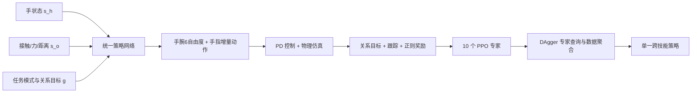

<!-- Generated by the offline translation workflow.
Source: 05-具身场景的深度和强化学习/07-UniCross统一跨技能灵巧操作导读/README.md
Source SHA-256: ae45a97f58747c84084678123ea87eaf16147a43c60518134fb891a88281c993
Model: tencent/Hy-MT2-1.8B-GGUF:Q4_K_M
Review machine-translated technical claims before relying on them.
-->
# UniCross: Using unified relationships to describe the concatenation of grasping, moving, and manipulation

[UniCross](https://zdchan.github.io/UniCross/) is formally known as *Unified Cross-Skill Dexterous Manipulation Synthesis*. It focuses not on “how to re-train a grasping policy,” but on a more fundamental question: whether grasping, moving, hand rotation, and hand translation can be expressed as the same task, enabling a single policy to continuously perform multiple delicate manipulations.

This work is suitable for inclusion in the sections on reinforcement learning and dexterous manipulation, rather than those on VLA or world model. Its input consists of structured hand, object, and target states, and the output is commands for the wrist and finger joints; training relies on simulation, PPO, and DAgger, without language models, image-language models, or future video generation modules.

After completing this section, you should be able to answer four questions:

- Why UniCross does not train, run, and switch the four skills separately;
- How “hand-object relationship movement” unifies the skills with significant differences in contact modes;
- Why ten PPO experts can be distilled into a strategy of the same structure using a regular DAgger;
- What the paper results prove, and which reproduction manipulations cannot be supported by current public materials.

## I. Papers and Public Resources

| Resource | URL | Current Function |
| :-- | :-- | :-- |
| Project Homepage | [zdchan.github.io/UniCross](https://zdchan.github.io/UniCross/) | Official videos, method overview, and cross-hand results |
| Paper | [arXiv:2607.28198](https://arxiv.org/abs/2607.28198) | Full methods, experiments, ablation studies, and hyperparameters |
| Code | The `Code` button on the project page is still a placeholder | No reliable cloning or execution commands can be provided for now |

As of September 4, 2026, the project page has published papers and numerous result videos, as well as demonstrated the effects in Isaac Gym, Isaac Lab, and mjlab. However, the `Code` button still does not point to any available repository. Therefore, this section provides an introduction to the methods and a checklist for reproduction preparation, without presenting the yet-to-be-published engineering directories or commands as already operational tutorials.

## II. First, see what it has unified

<video controls muted playsinline preload="metadata" width="100%">
  <source src="../../../05-具身场景的深度和强化学习/07-UniCross统一跨技能灵巧操作导读/assets/official_videos/mano_skill_composition.mp4" type="video/mp4">
</video>

**Video 1: UniCross’s continuous skill combination.** The same policy involves grasping, moving, and manipulation in sequence. The key is not just that each step succeeds, but that the state of the hand and object at the end of one step can directly serve as the effective initial state for the next step. Source: [ UniCross official project page ](https://zdchan.github.io/UniCross/).

The paper divides the dexterous manipulation in which "the object is always stabilized by the hand" into four types of relational movements:

| Skill | Unchanged relationship | Changed relationship | Intuitive meaning |
| :-- | :-- | :-- | :-- |
| Grasp | Pose of the object in the root coordinate system | Position of the hand in the root coordinate system | Hand approaches and encloses a stationary object |
| Relocate | Pose of the object relative to the hand | Pose of the hand and the object in the root coordinate system | After grasping firmly, use the wrist to move the object to the target pose |
| Rotate | Pose of the wrist in the root coordinate system, position of the object relative to the hand | Orientation of the object relative to the hand | Wrist remains still, fingers change contact to rotate the object around a specified axis |
| Translate | Pose of the wrist in the root coordinate system, orientation of the object relative to the hand | Position of the object relative to the hand | Wrist remains still, the object slides along a specified axis within the hand |

This perspective avoids the habit of writing tasks separately for each contact mode. grasping requires establishing contacts, while rotation and translation require continuously redefining those contacts. On the surface, they differ greatly; but all can be described as “tracking certain hand-object relationships, fixing other relationships, and releasing the remaining degrees of freedom”. This unification occurs at the task formulation level, rather than forcing four completely different policies together later on.

## III. Dissect the complete data flow from the architecture diagram

  

**Figure 1 UniCross overall framework.** On the left, each skill is trained using unified observation, network, action, and reward. On the right, ten experts are first identified, and then combined into a unified policy using DAgger. Source: [ UniCross official paper Figure 2](https://arxiv.org/abs/2607.28198).

### 1. Unified observation is not simply combining a skill ID

The policy observation should be written as:

$$
o_t=(s_t^h,s_t^o,g_t).
$$

Three of them perform different responsibilities respectively.

**Hand state $s_t^h$.** It includes the current joint position $q_t$ and the previous target joint position $q_{t-1}^{target}$. The latter helps the policy understand what the executor was just requested to do, reducing temporal ambiguity when only focusing on the current position.

**Interactive perceived object description $s_t^o$.** For each hand link, the model reads:

- Binary state of contact with the object $c_t$;
- Contact force amplitude $f_t$;
- Three-dimensional distance vector from this link to the nearest point on the object surface $v_t$.

This is not a direct input of object categories or complete meshes. The distance vector describes the local geometry, while contact and force describe the current constraint state; together, they tell the policy “which finger is close to where, whether it has touched, and how tightly it holds”. In the ablation study, after removing the contact term, the rotation success rate dropped from `98.8%` to `82.7%`, and the average rotation amount decreased from `13.6 rad` to `8.78 rad`, indicating that dynamic hand manipulation particularly depends on the contact state.

**Relationship target $g_t$.** This is a 55-dimensional target feature:

$$
g_t=[I_t,d_t^h,g_t^{current},g_t^{target}].
$$

$I_t$ is the one-hot encoding for ten expert modes, and $d_t^h$ is the three-dimensional target axis in the hand coordinate system. The latter two items describe the pose of the current and target hand-object multi-coordinate systems respectively. The ten modes come from `1 个抓取 + 1 个搬移 + 6 个旋转方向 + 2 个平移方向`.

### 2. Why use both hand frame and root frame

Writing the target only in the world coordinate system will cause the policy to mistake the global position change for the skill itself; writing the target only in the hand coordinate system cannot describe where the wrist should move the object. UniCross maintains both:

- The position and pose of the object in the hand coordinate system $(x_o^h,q_o^h)$;
- The position and pose of the object in the root coordinate system $(x_o^r,q_o^r)$;
- The position and pose of the hand in the root coordinate system $(x_h^r,q_h^r)$.

The root pose is established at the beginning of each episode using the initial wrist pose, and remains unchanged thereafter. In this way, the movement target can be expressed in the root pose, while the rotation and translation within the hand can be expressed in the hand pose, thereby reducing the dependence on the absolute world position.

### 3. Unify the action space

The action covers six virtual wrist joints and all finger joints. The policy outputs the incremental action $a_t$, which is then converted into the target joint positions:

$$
q_t^{act}=\operatorname{clamp}(q_t^{ref}+\alpha\odot a_t,q_{min},q_{max}).
$$

The reference value for the fingers is the target position at the previous moment, while the reference value for the wrist comes from the current relationship target. Finally, the PD controller converts the target position into joint moments. The residual-type motion allows for more continuous changes in the fingers, and also enables wide-range wrist movements without relying entirely on the policy to explore from zero.

### 4. Unified Reward Structure

Four skills share the same reward structure:

$$
r_t=r_t^{goal}+r_t^{track}+r_t^{reg}.
$$

| Component | Main signals | Problem solved |
| :-- | :-- | :-- |
| $r_t^{goal}$ | link-object distance, contact state, contact force, object motion along the target axis | Ensure stable holding while moving in the task direction |
| $r_t^{track}$ | Error in the pose of the hand and object relative to the target in the root/hand frame | Transform four different tracking tasks into a single target tracking system |
| $r_t^{reg}$ | Finger deviation from initial posture, wrist velocity, energy, and drop penalty | Suppress jitter, excessive movements, energy consumption, and loose hand penalties |

"The unified reward" does not mean that the weight of each item is exactly the same. The system will still adjust the weight of interaction targets based on skills, but the semantics and structure of the reward items remain unchanged. Therefore, the state distributions learned by different experts are more easily compatible.

## IV. Why train ten experts first, and then distill a policy

A single policy is used to grasp ten different modes simultaneously, and severe gradient competition occurs in the early stage: grasping requires first getting close to and establishing contact, while rotation demands that the object has been grasped before switching fingers. UniCross first trains experts using PPO separately, avoiding cold start for all skills from the same random policy.

After all experts share the observations, actions, networks, and reward structures, the distillation of the unified policy becomes straightforward:

1. Run the current policy to check the access status;
2. Query the corresponding expert action based on the `(物体, 技能)` of this environment;
3. Add the new status and expert action to the replay buffer;
4. Update the policy using MSE behavior cloning loss;
5. Repeat the collection and aggregation to reduce the error accumulation after the policy deviates from the expert distribution.

This is the standard DAgger, rather than a specially designed mixture-of-experts router. The expert query rate configured in the paper is `100%`, the replay buffer is `1,000,000`, each rollout iteration uses `32` steps, and a maximum of `3500` epochs are trained. In the ablation table, the unified policy is almost equal to that of the ten experts; for example, the rotation success rate is `98.8%` versus `99.1%`. This indicates that what truly matters is the compatible task space established earlier, rather than how complex the distillation algorithm itself is.

## 5. How to conduct the experiment and how to read the numbers

### 1. Data and Simulation Protocols

The paper is mainly trained in Isaac Gym, with a physical frequency of `120 Hz` and a control frequency of `20 Hz`. The training objects are randomly generated from boxes and cylinders, divided into two types: wrapable and slender. There are a total of `400` training objects and `400` test objects. PPO uses a discount factor of `0.99`, GAE of `0.95`, and a batch size of `32768`; the rotation episode is `400` steps, and other skills are `64` steps.

This is not a total score obtained by applying a pre-existing public benchmark, but a skill protocol developed by the paper itself. The definition of success for each type of skill varies:

| Skill | Main Success Conditions |
| :-- | :-- |
| Grabbing | Execute 75 steps, lift the wrist after step 50, and ensure the object does not fall during the entire process |
| Moving | Move to the target position `3 cm`, in a posture `0.15 rad`, and without falling |
| Rotating | Rotate by more than $\pi/2$ within 400 steps without falling |
| Translating | Move more than `5 cm` in the target direction within 50 steps without falling |

Therefore, we cannot simply compare the success rates of different columns, nor can we combine the rotation angle and the translation centimeters into a single score.

### 2. Single Skill Performance

In the general setup of the paper, UniCross achieved success rates for four types of skills: grasping `98.7%`, moving `99.0%`, rotating `98.8%`, and translating `99.1%`. The comparison methods include GraspXL, RotateIt, and individual hand translation methods; there is no existing method that fully corresponds to moving, so the authors established a baseline using finger and wrist PD control.

These high success rates indicate that the unified policy does not significantly sacrifice individual skill capabilities, but this cannot be directly inferred as the actual robot success rate. The paper presents the motion synthesis and policy compatibility in simulation, without reporting real dexterous hand closed loop experiments.

### 3. Unseen objects, disturbances, and hand shapes

For unseen objects, sphere, hexagonal prism, and elongated octagonal prism were used. The policy was trained only on box/cylinder shapes, yet the results remained close to the trained shapes. In the perturbation experiment, a random force of up to `10 m_obj g` was continuously applied to the objects, but the four skill levels decreased only slightly.

<table>
  <tr>
    <td width="50%"><video controls muted playsinline preload="metadata" width="100%"><source src="../../../05-具身场景的深度和强化学习/07-UniCross统一跨技能灵巧操作导读/assets/official_videos/allegro_skill_composition.mp4" type="video/mp4"></video></td>
    <td width="50%"><video controls muted playsinline preload="metadata" width="100%"><source src="../../../05-具身场景的深度和强化学习/07-UniCross统一跨技能灵巧操作导读/assets/official_videos/sharpa_skill_composition.mp4" type="video/mp4"></video></td>
  </tr>
  <tr>
    <td align="center">Allegro Hand</td>
    <td align="center">Sharpa Wave</td>
  </tr>
</table>

**Video 2: Skill combinations for different hand shapes.** The author did not directly copy Allegro’s joint weights into Sharpa; instead, a unified policy was trained for each form under the same task description. What is demonstrated here is the transferability of the formulation, not zero-shot deployment across hands using the same checkpoint. Source: [ UniCross official project page ](https://zdchan.github.io/UniCross/).

The paper has also been verified on 26-DoF MANO and 28-DoF Sharpa Wave (both counted as 6 virtual wrist degrees of freedom). The success rate for the four types of Sharpa remains `99.1% / 98.0% / 98.5% / 99.0%`; due to the more limited joint range and reduced rotation and translation ranges in MANO, the success rate for all four tasks still exceeds `94%`.

### 4. Long-term Combination

What truly tests the unified policy is the combined task. Paper report:

| Sequence | grasping SR | moving SR | manipulation SR | overall SR |
| :-- | --: | --: | --: | --: |
| Grasp + Relocate + Rotate | 99.7 | 92.2 | 95.1 | 87.4 |
| Grasp + Relocate + Translate | 99.9 | 98.3 | 98.0 | 96.3 |

It is normal for the overall success rate to be lower than the individual success rates at each stage, as all three stages must succeed in a continuous rollout. The rotating chain is more difficult because the palm may be in a downward or oblique downward position after moving, making it easier for objects to slip off.

## VI. The Relationship between Isaac Gym, Isaac Lab, and mjlab

<video controls muted playsinline preload="metadata" width="100%">
  <source src="../../../05-具身场景的深度和强化学习/07-UniCross统一跨技能灵巧操作导读/assets/official_videos/mjlab_implementation.mp4" type="video/mp4">
</video>

**Video 3: The running results of mjlab shown on the official project page.** The paper explains that Isaac Gym is used for training, and the project page demonstrates the performance of three implementations: IsaacLab, IsaacGym, and mjlab. The video confirms that the author has successfully run the model across different simulators, but before the code entry is made available, it cannot be concluded whether the installation steps, version locking, asset permissions, or the simultaneous release of the three backends are available in the public repository. Source: [ UniCross official project page ](https://zdchan.github.io/UniCross/).

After the code is made open, the reproduction should be carried out in the following order:

1. First, fix the commit, simulator version, and hand asset version provided by the author;
2. Perform a smoke test using one object, one grasping expert, and a small number of parallel environments;
3. Check the shape and coordinate system of the contact flag, contact force, and nearest-surface vector;
4. Train ten experts separately and review the success criteria for each skill;
5. Then launch DAgger to examine expert queries, buffer growth, and the unified policy MSE;
6. Finally, conduct a continuous three-stage evaluation, and the average value of a single skill cannot replace the overall success rate.

Before the official repository is available, it is not recommended to design a new set of engineering parameters based on the paper and call it “UniCross reproduction”. The hardest parts to complete are not PPO, but rather the hand collision geometry, contact sensing definition, object sampling, initial grasping distribution, and the rules for updating target relationships.

## VII. What makes this work strong, and its boundaries

The most valuable innovation of UniCross is not a larger network, but finding a task coordinate system that maintains consistency across skills. Unified observation and rewards make the expert state distribution naturally compatible, allowing ordinary DAgger to distill data with near-zero loss; the same policy can also continue to utilize current interactions during skill switching, without having to reset the object or return to the preset palm-up posture.

The boundaries are also clear:

- It is a state-based simulation control that does not handle real RGB, natural language, or open vocabulary tasks;
- Different dexterous hands require separate policy training, and no single checkpoint can control all dexterous hands;
- The training subjects are mainly programmed basic geometries, and even without shape testing, they remain close to these geometric families;
- The paper lacks real robot experiments, and domain randomization only proves the robustness of simulation perturbations;
- There is no available code repository currently, so strict end-to-end reproduction auditing cannot be achieved.

Therefore, UniCross is more like an infrastructure component for “generalized dexterous manipulation tasks”. In the future, when visual perception, language goals, or VLA are integrated onto it, VLA can be responsible for proposing relationship goals and skill sequences, while the UniCross-style low-level policy is responsible for continuous execution under contact constraints. This layered interface is easier to verify than having VLA directly output all finger joints, and it is also more suitable for long-duration skill combinations.

## VIII. Reference Materials

1. Hui Zhang, Julian Ferchow, Jie Song, Mirko Meboldt. [UniCross: Unified Cross-Skill Dexterous Manipulation Synthesis](https://arxiv.org/abs/2607.28198), 2026.
2. [UniCross official project page](https://zdchan.github.io/UniCross/).
