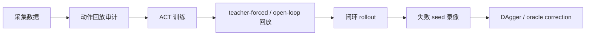

# Policy Diagnosis and Physical Success Evaluation

This section is designed for those who have completed the ACT, SmolVLA, or pi_0 basic training. After learning this section, instead of only focusing on the loss or the `success` provided by the environment, you can use videos, object states, and phased diagnosis to determine whether the grasping task has been truly completed.

This chapter is recommended as an advanced experiment following `3.train.ipynb`, `4.deploy.ipynb`, `7.pi0.ipynb`, and `8.smolvla.ipynb`. It does not replace the original training notebook, but adds a method for determining whether the policy has truly been implemented successfully.

## Why additional diagnosis is needed

In the MuJoCo task where a cup is placed on a plate, the geometric success criteria for the environment sometimes treat edge cases as successful. For example, the cup isn’t actually held by the gripper but is pushed close to the plate by its edge; or the cup has already tipped over, but its position is just near the plate. Such results are confusing for learners: the logs indicate success, yet the video clearly shows it’s not a deployable grasping strategy.

Therefore, this section divides the success into two layers:

| Metric | Meaning | Questions that fit the answer |
| --- | --- | --- |
| `legacy_success` | Original environment `check_success()` | Does the policy meet the original geometric termination conditions? |
| `physical_success` | The target cup is lifted, placed on the plate, and finally in a basically upright position | Has the policy actually completed grasping, moving, and placing? |

It is recommended to use `physical_success` when reporting model results, and keep `legacy_success` as a control. When there are discrepancies between the two, prioritize opening the video for review.

## Criteria for Determining Physical Success

The recommended criteria for judgment are as follows:

1. The original success condition of the environment is true;
2. The target cup is lifted at least `0.03 m` from its initial height;
3. The lifting state lasts for several control ticks to avoid misjudgment due to sudden collision;
4. The local z-axis of the final cup remains roughly upward, preventing the cup from being judged as successful when it falls.

This policy is not designed to reduce the success rate, but to make the success rate closer to the actual behavior seen in the video. When debugging the policy, you can divide each rollout into four categories:

| Failure Type | Common Phenomena | Priority Checks |
| --- | --- | --- |
| No Contact | Gripper remains near the cup or plate | Image conditions, initial pose, language commands, closed loop offset |
| Insufficient Lift | Encountered the cup but fails to hold firmly | Gripper motion, approach trajectory, motion normalization |
| Misplaced Placement | Cup is lifted but lands far from the plate | Chunk length, end-stage teaching, Dagger correction |
| Cups Falling | Cups near the plate but not upright | Release timing, placement height, final stability |

## ACT Diagnosis Main Line

The focus of ACT debugging is not simply increasing the training steps, but rather distinguishing three issues:

1. Whether the data can be successfully replayed;
2. Whether the model learns the actions under teacher-forced/open-loop conditions;
3. Whether the model deviates gradually during closed loop deployment due to early biases.

The recommended diagnostic order is as follows:



If both data action playback and closed loop attempts fail, repair the data first; if the open-loop is successful but the closed loop fails, prioritize DAgger, reset-aligned data, or error correction for the failed state; if only the gripper release fails, check the gripper tag, tail release action, and gripper head separately.

## DAgger and oracle correction

In this task, the core value of Dagger is to restore the state after the policy closed loop deviates. A teachable approach is:

1. First, train a reset-start policy;
2. Use this policy to run several previous steps, such as the first 40 control steps;
3. Switch to scripted oracle when the policy tends to deviate;
4. Save the oracle suffix as correction data;
5. When merging data, explicitly record the timestamp offset or source flag to prevent data from different phases from contaminating each other;
6. Apply weighted sampling to the correction data to avoid a small amount of correction data from disrupting the original reset-start behavior.

It is particularly recommended to record the source of each data merge, the episode scope, and the sampling weights. More Dagger data is not always better; if the full-reset failure-bucket data is directly mixed into the main training, it may degrade the successful reset-start behavior.

## SmolVLA Diagnosis Main Line

The advantage of SmolVLA is its stronger language conditions and visual foundation, but be cautious of color or task distribution biases. In the red cup and blue cup tasks, it is recommended to evaluate fixed language instructions separately:

```bash
python audit_language_policy_physical.py \
  --policy-type smolvla \
  --policy-path ./ckpt/your_smolvla_checkpoint/checkpoints/000500/pretrained_model \
  --instruction "Place the red mug on the plate." \
  --seeds 0 1 2 3 4 5 6 7 8 9 \
  --max-action-steps 600 \
  --output-jsonl outputs/eval_red.jsonl \
  --summary-json outputs/summary_red.json
```

The same set of seeds should be run in the red cup and the blue cup separately, so as to determine whether the model has truly learned the task or only favors one color or a certain type of pose.

In our migration experiment, simply copying the Blue Cup episode significantly improves the success rate of the Blue Cup, but it may harm the Red Cup. A more reliable approach is to use `WeightedRandomSampler` to weight the target object frame, rather than copying the Parquet episode. This conclusion is suitable for classroom discussion: data augmentation is not just about "adding more data," but also about checking whether it disrupts the original distribution.

## Smoke test before pi_0 migration

pi_0 depends on PaliGemma. The first run involves Hugging Face gated model permissions and a large model weight download. It is recommended to run a smoke test first, rather than starting the long training directly:

```bash
RUN_SMOKE=1 RUN_FULL_TRAIN=0 ./run_pi0_train_eval_after_hf_ready.sh
```

This smoke test proves only a few things:

1. The Hugging Face token can access `google/paligemma-3b-pt-224` and `lerobot/pi0`;
2. `demo_data_language` can be correctly loaded by LeRobot;
3. The pi_0 policy can construct and complete a 1-step training;
4. The checkpoint saving process is normal.

It does not prove that pi_0 has converged, nor does it represent the final success rate. After formal training, the red and blue cups still need to be evaluated using the same `physical_success` set of metrics.

## Suggested public scripts

To make this section a reproduction-ready experiment rather than just text, it is recommended to keep the public version of the following script in the tutorial directory. Before publishing, the local absolute path, private IP, token, remote account, and large file paths should be replaced with variables or placeholders.

| Script | Purpose | Release Notes |
| --- | --- | --- |
| `audit_language_policy_physical.py` | Conduct a rigorous physical success rate assessment for SmolVLA / pi_0 | Do not hardcode the remote path; output JSONL and summary |
| `record_language_policy_video.py` | Record videos of the success or failure of a single seed | The video should not be submitted to the repository by default |
| `train_model_weighted_episode_sampler.py` | Perform weighted sampling training for language tasks | Maintain the behavior of the original `train_model.py`, with weights controlled by environment variables |
| `run_pi0_train_eval_after_hf_ready.sh` | pi_0 permission check, 1-step smoke testing, official training and evaluation interfaces | Tokens are read only from environment variables or interactive input |
| `compare_eval_summaries.py` | Generate a table of red/blue success rates for multiple checkpoints | Output a small TSV/Markdown table; do not save large logs |

## Tutorial Organization Suggestions

It is recommended to use a "two-layer structure" for this part:

1. **Chapter 06 Technical Text**: Located in the current MuJoCo ACT / pi_0 / SmolVLA directory, this section serves as an advanced chapter of the original tutorial, explaining diagnostic methods, scripts, and experimental procedures.
2. **Special Team Learning Entry**: Create 4 to 5 tasks under `16-专题组队学习` so that users can complete the environment, data, ACT diagnosis, SmolVLA comparison, and pi_0 smoke weekly.

This way, it does not disrupt the main flow of "collection - training - deployment" in the original tutorial, while providing a complete task rhythm for team-based learning.
