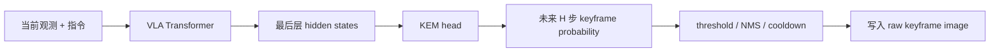
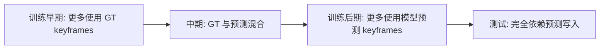

<!-- Generated by the offline translation workflow.
Source: 06-策略抓取或抓取VLA/大模型控制、VLA、VLM/06EventVLA视觉证据记忆导读/README.md
Source SHA-256: eda92f9dad1b4598d73ae0fe3698585bbe20a78df84851cb3fc348adda89fc01
Model: tencent/Hy-MT2-1.8B-GGUF:Q4_K_M
Review machine-translated technical claims before relying on them.
-->
# EventVLA: Event-Driven Visual Evidence Memory

The full name of EventVLA is **EventVLA: Event-Driven Visual Evidence Memory for Long-Horizon Vision-Language-Action Policies**. It is not a traditional world model, and it does not predict future videos. What it addresses is a very practical issue: in long-term robot tasks, key visual evidence may only appear briefly in the middle, and then get obscured, removed, or become invisible. If VLA only looks at the current frame and short history, it will forget this evidence.

After completing this section, everyone needs to focus on one sentence:

> The core of EventVLA is not to "make robots imagine the future," but to "let robots save key images that may be used in the future, and then review them again when predicting future actions."

## 1. Paper, Code, and Resource Status

| Item | Current Status |
| :--- | :--- |
| Paper | [arXiv:2606.20092](https://arxiv.org/abs/2606.20092) |
| Project Page | [EventVLA Project Page](https://ganlin-yang.github.io/EventVLA.github.io/) |
| Code | [InternRobotics/EventVLA](https://github.com/InternRobotics/EventVLA) |
| Model Weights | [Hugging Face: ganlinyang/EventVLA](https://huggingface.co/ganlinyang/EventVLA) |
| Dataset | [Hugging Face: RoboTwin-MeM](https://huggingface.co/datasets/ganlinyang/RoboTwin-MeM) |
| Open Source Boundaries | Simulation training/ evaluation code, RoboTwin-MeM data, and checkpoint have been released; real-world inference/evaluation code and real-world fine-tuned model are still in Todo |

Therefore, EventVLA can currently be regarded as an "open-source project for running simulation evaluations," but it is not suitable to directly promise that everyone can completely reproduce the machine results.

## 2. Understand what it aims to solve with a single diagram

<p align="center">
  
</p>

**Figure 1 EventVLA Overview.** On the left is shown non-Markov long-time domain tasks: the task success depends on evidence that appears during the process, but this evidence cannot be seen in current observations. On the right is presented the sparse visual evidence memory approach of EventVLA: instead of incorporating all historical frames into the model, a small number of key visual events are actively captured.

Source: [ EventVLA official project page ](https://ganlin-yang.github.io/EventVLA.github.io/).

When processing long tasks with the standard VLA, three types of memory bottlenecks typically occur:

| Issue | Typical Manifestation |
| :--- | :--- |
| Evidence disappearance | The robot briefly sees the target color, label, order, or route, but loses it after a change in perspective |
| Excessive history | Placing a large number of historical frames directly can cause memory issues, latency, and redundancy |
| Over-compression | Compressing history into a latent memory may lose details, especially for multi-event tasks |

The choice of EventVLA is simple: **it only stores a small number of raw keyframe images**. It does not encode keyframes into a neural memory vector, but instead preserves the original image form of key visual evidence, which can then be used as additional visual input for VLA.

## 3. Architecture breakdown: visual anchors + KEM + raw image memory

<p align="center">
  
</p>

**Figure 2 EventVLA framework.** When reading this figure, focus on three aspects: the fixed visual anchors ensure stability of the context, KEM predicts which future steps are worth being stored in memory, and the memory buffer feeds back to VLA in the form of key frames from the original image.

Source: [EventVLA arXiv HTML](https://arxiv.org/html/2606.20092v1).

The memory of EventVLA consists of two parts:

```text
M_t = foundational visual anchors + event keyframes
```

### 3.1 Foundational visual anchors

Visual anchors are fixed rules that do not require learning. They usually include:

- Initial frame: Keep the global scene layout at the start of the task.
- Short-term historical window: Preserve the recent movement trends and the current interaction phase.

This design is crucial. Many tasks do not necessarily require dynamic keyframes; the initial layout and recent frames are sufficient. The ablation study shows that removing the initial frame or short-term history significantly reduces the effect. This indicates that EventVLA does not simply "select keyframes" but combines long-term anchors, short-term movements, and dynamic evidence.

### 3.2 KEM：Keyframe Evidence Memory

KEM is the most critical module of EventVLA. It does not review the entire video to select frames later, but predicts on the current VLA hidden states: **which steps within the future action horizon will contain task-critical visual evidence**.

It can be understood as the following chain:



This "predicting future write points" design is more robust than a regular memory buffer, as it combines action planning and memory writing. The model does not store everything it sees, but determines "which visual evidence will be useful at the next moment."

### 3.3 raw image memory

EventVLA stores the key frames of the original image, rather than compressed latent features. This may not seem impressive, but it is very important. In multi-event tasks, different key evidence may be hidden in color, object position, route, sequence, and occlusion relationships. Forcing them into a single vector can easily create an information bottleneck.

The process that is closer to the actual code logic is:

```text
KEM 预测未来 offset
-> 记录 target_step 的 pending request
-> 环境或数据管线推进到 target_step
-> 取回对应原图
-> 选主视角图像
-> append 到 runtime keyframe image bank
-> 去重、按时间排序、只保留最多 max_keyframes 张
-> 下一次 forward 作为 memory_keyframe_images 输入模型
```

Therefore, the "memory" of EventVLA is not an implicit state within the neural network, but a set of images and metadata maintained by Python/runtime. This approach reduces the cost of explanation and makes debugging more intuitive: everyone can directly extract key frames of the model for inspection.

## 4. Online writing control: Why NMS, cooldown, and FIFO are needed

KEM outputs the probability for each time step within the future horizon. If only high probabilities are written, multiple consecutive frames near key frames will be written into the buffer, which quickly fills up with redundant frames. Therefore, EventVLA requires an online writing control mechanism:

| Mechanism | Function |
| :--- | :--- |
| confidence threshold | Accept only candidate keyframes with high confidence levels |
| 1D NMS | Combine consecutive high-probability peaks into a sparse event |
| temporal cooldown | Prevent repeated writing of almost identical frames in a short period |
| FIFO buffer | Discard older keyframes when the capacity is exceeded |

This part is a highly engineered design, but it is very important for the effect. Without these mechanisms, the memory buffer will degenerate from "key evidence memory" into a "collection of short-term screenshot duplicates".

## 5. Automatic Supervision: Qwen3-VL Annotates Key Frames

KEM needs to know which frames are critical frames. If labeled entirely manually, the cost would be very high. EventVLA uses an offline VLM pipeline to automatically extract task-critical intermediate event timestamps from demonstration videos and task descriptions. The paper and appendix mention using Qwen3-VL for this purpose.

This has two effects:

- Advantages: It can be extended to handle more demonstrations without the need for manual frame-by-frame annotation.
- Risks: The supervision quality of KEM depends on VLM’s judgment of task-critical evidence. If automatic annotation is incorrect, the model will adopt a biased writing policy.

Additionally, keyframe supervision is not a single hard label. In actual physical interactions, a period of time can contain valid evidence; for example, several frames after the lid is opened can show the internal color. EventVLA uses soft labels to mitigate time ambiguity, which is more reasonable than simply marking a 0/1 timestamp.

## 6. Training Course: From teacher memory to predict memory

If training relies entirely on predicted keyframes from the start, the early model is likely to write incorrect memories. If training always uses ground-truth keyframes, inference introduces a train-test gap because ground truth is unavailable. EventVLA therefore adopts a teacher-to-student curriculum:



The purpose of this training design is to have the model first learn how to act when there is correct memory, and then gradually learn to write correct memories on its own.

## 7. RoboTwin-MeM: Specifically for Measuring Non-Markov Memory

<p align="center">
  
</p>

**Figure 3 RoboTwin-MeM benchmark.** This benchmark specifically designs tasks that require remembering key visual evidence that appears midway. The blue boxes in the figure indicate the intermediate keyframes that need to be retained.

Source: [EventVLA arXiv HTML](https://arxiv.org/html/2606.20092v1).

The significance of RoboTwin-MeM is that it is not an ordinary long-time-domain manipulation benchmark, but specifically tests whether a task can still be completed after the evidence disappears mid-process. The official dataset includes two formats: LeRobot 2.1 and HDF5. The tasks include:

```text
cover_blocks_hard
find_seal_and_seal_stamp
pick_objects_in_order
pick_the_unhidden_block
press_button_keyframe
put_back_block_hard
rearrange_blocks_hard
reproduce_route
```

These tasks cover scenarios such as transient recognition, event counting, in-context imitation, and sequential tracking. For long-time-domain VLAs, they more effectively expose the issue of "forgetting intermediate evidence" compared to ordinary pick-and-place methods.

## 8. How to read the real robot results

<p align="center">
  
</p>

**Figure 4: EventVLA real robot execution sequence.** The frame marked with a blue box is the key visual evidence that the policy autonomously captures and stores in memory. When looking at this figure, note that the key frames are not the final action results, but rather the evidence needed for subsequent decision-making.

Source: [EventVLA arXiv HTML](https://arxiv.org/html/2606.20092v1).

The section on real robots explains that this method is not purely a simulation concept, but the current open-source boundaries need to be clarified: The real-world inference/evaluation code and the real-world fine-tuned model in the official README are still pending. Therefore, it is not recommended to say “Everyone can directly reproduce the real-world experiment” in the tutorial. A more appropriate statement would be:

- Simulation evaluation can be conducted using the official code and released checkpoints.
- Real robot experiments can start by reading papers and video materials, waiting for the official deployment code and model to be available.
- If you have a dual-robot platform, you can refer to its memory design, but it should not be assumed that the official real robot pipeline is ready to run with a single click.

## 9. What is recommended to do first if everyone wants to reproduce

We will not go into detail about the manual commands, but only provide a reproduction path. The official README recommends two environments:

| Environment | Function |
| :--- | :--- |
| RoboTwin-MeM environment | Runs simulation tasks and assets |
| EventVLA environment | Runs model training, inference, and policy server |

It is recommended that you follow the following order:

1. clone [InternRobotics/EventVLA](https://github.com/InternRobotics/EventVLA).
2. Prepare the RoboTwin-MeM simulation environment and assets.
3. Set up the EventVLA environment, and install `requirements.txt`, `flash-attn`, and editable packages.
4. Download the EventVLA checkpoints and RoboTwin-MeM dataset from Hugging Face.
5. First, run a single-task evaluation to ensure that the policy server, simulation environment, and checkpoint can communicate.
6. Then, conduct an 8-task batch evaluation.
7. If training is required, use the training script under `examples/RoboTwin-Mem/train_files/`.

Key configurations in the official README include:

```text
memory_ablation_mode: pure_image_keyframe_memory
keyframe_image_memory.enabled: true
keyframe_train_memory_source: teacher_to_predict
keyframe_eval_memory_source: predict
max_keyframes: 4
temporal image anchors: first frame, t-30, t-15, current frame
action horizon: 50
maximum training steps: 100000
```

These configurations are more worth understanding first than simply "running the command successfully". They directly correspond to the method design of EventVLA: a maximum of 4 keyframes are stored, using the initial frame and short-term history as anchors. During training, it transitions from teacher memory to predicted memory.

## 10. Differences from WALL-WM

Both EventVLA and WALL-WM use the word "event", but the core issues are completely different:

| Comparison Items | EventVLA | WALL-WM |
| :--- | :--- | :--- |
| Core Issues | How to remember key visual evidence that disappears | How to simulate and execute events based on fixed action chunks that break semantics |
| Event Granularity | Single or a few key frames | A semantic action event |
| Main Modules | KEM + raw image memory | multi-view video DiT + action DiT |
| Predicts future videos? | No | Yes, predicts latent features of future event videos |
| More like a world model? | No | Yes, World Action Model |

One-sentence summary: **EventVLA is memory-first, while WALL-WM is event-world-model-first.**

## 11. Reference Materials

- Paper: [EventVLA: Event-Driven Visual Evidence Memory for Long-Horizon Vision-Language-Action Policies](https://arxiv.org/abs/2606.20092)
- Project Page: [EventVLA Project Page](https://ganlin-yang.github.io/EventVLA.github.io/)
- Code: [InternRobotics/EventVLA](https://github.com/InternRobotics/EventVLA)
- Model: [Hugging Face: ganlinyang/EventVLA](https://huggingface.co/ganlinyang/EventVLA)
- Dataset: [Hugging Face: RoboTwin-MeM](https://huggingface.co/datasets/ganlinyang/RoboTwin-MeM)
- Dependent Projects: [RoboTwin 2.0](https://github.com/robotwin-Platform/RoboTwin), [RMBench](https://github.com/robotwin-Platform/RMBench), [StarVLA](https://github.com/starVLA/starVLA)
