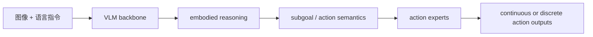

# WALL-OSS: From VLM to Open Source VLA Model

WALL-OSS corresponds to the paper **Igniting VLMs toward the Embodied Space**. It is an open-source VLA model series released by X Square Robot. You can consider it as the "actual model layer" in the WALL ecosystem that can be used for training, evaluation, and deployment. It is not a world action model paper like WALL-WM, nor is it an engineering framework like WALL-X.

After completing this section, everyone needs to make a judgment:

> The focus of WALL-OSS is to integrate the visual language understanding ability of pre-trained VLM into the robot action space, enabling the model to perform embodied reasoning and generate executable actions.

## 1. Paper, code, and weight entry points

| Item | Current Status |
| :--- | :--- |
| Paper | [arXiv:2509.11766](https://arxiv.org/abs/2509.11766) |
| Code Framework | [X-Square-Robot/wall-x](https://github.com/X-Square-Robot/wall-x) |
| Hugging Face Organization Page | [x-square-robot](https://huggingface.co/x-square-robot) |
| LeRobot Documentation | [WALL-OSS in LeRobot](https://huggingface.co/docs/lerobot/en/walloss) |
| Common Models | `wall-oss-0.5`、`wall-oss-flow`、`wall-oss-flow-0.1`、`wall-oss-fast` |
| Recommended Reproduction Method | Do not perform pre-training from scratch; prioritize downloading checkpoints and use WALL-X or LeRobot for post-training/assessment |

As of June 29, 2026, WALL-OSS is more suitable as an open-source reproduction entry point than WALL-WM: it includes model weights, a training/inferencing framework, and a LeRobot integration document. If people only want to "test the WALL series", they should start with WALL-OSS or WALL-OSS-0.5.

## 2. Understand WALL-OSS in one picture

<p align="center">
  
</p>

**Figure 1: Overview of WALL-OSS in the LeRobot documentation.** This figure highlights that WALL-OSS has been integrated into the LeRobot ecosystem. It can be used as a `wall_x` policy for subsequent training, evaluation, and deployment.

Source: [ Hugging Face LeRobot WALL-OSS documentation ](https://huggingface.co/docs/lerobot/en/walloss).

The core contradiction of WALL-OSS is: pre-trained VLM is good at understanding images and language, but it does not inherently master the robot action space. Several conditions must be met for robot actions:

- The spatial geometry must be accurate, such as the relative position between the gripper and the object.
- The timing sequence must be consistent, such as the order of approaching, closing, lifting, moving, and lowering.
- The action representation must be stable, such as continuous control, diffusion/flow matching, or FAST-style action tokens.
- Do not damage the original visual language capabilities of VLM.

Therefore, WALL-OSS is not just "adding a linear action head to VLM". Its goal is to integrate vision-language reasoning, subgoal decomposition, and fine-grained action synthesis into a unified VLA framework.

## 3. Several Paradigms for Migrating from VLM to Action Modeling

<p align="center">
  
</p>

**Figure 2: Different paradigms of VLM to VLA.** The blue section in the figure represents the weights inherited from pre-trained VLM; DAM and CAM correspond to discrete action modeling and continuous action modeling, respectively. When reading this figure, pay attention to whether the action tokens and visual language tokens share the same backbone, and whether action generation actually enters the inference path of VLM.

Source: [WALL-OSS arXiv HTML](https://arxiv.org/html/2509.11766v1).

There are roughly three types of common routes for VLA:

| Route | Method | Risk |
| :--- | :--- | :--- |
| Only using the action head | VLM encodes images and text, and predicts actions with a small input | The combination of action generation and language reasoning is weak |
| Discrete action tokens | Discretize continuous actions into tokens and generate them using a language model | It is easy to sacrifice control precision |
| Continuous action modeling | Use diffusion/flow matching to predict continuous actions | Training stability and preserving the VLM prior are more challenging |

The policy of WALL-OSS takes into account both discrete and continuous actions, allowing the model to first establish embodied semantic-action associations, and then use a continuous control branch to support high-frequency execution.

## 4. Architecture breakdown: tightly-coupled VLA

<p align="center">
  
</p>

**Figure 3: WALL-OSS architecture.** The focus of this figure is not a single head, but rather "how visual, linguistic, and action tokens interact within the same system." WALL-OSS aims to prevent action branches from being completely separate from the VLM backbone.

Source: [WALL-OSS arXiv HTML](https://arxiv.org/html/2509.11766v1).

The LeRobot documentation summarizes the core innovations of WALL-OSS into several sections:

| Module | Function |
| :--- | :--- |
| Embodied perception-enhanced multimodal pretraining | Enhances spatial, causal, and operational understanding using visual-language-action data |
| Unified Cross-Level CoT / Uni-CoT | Integrates high-level instruction understanding, sub-task decomposition, and fine-grained action synthesis into a continuous chain |
| MoE action heads | Dynamically activates different experts based on the task stage, supporting discrete or continuous action modeling |
| Two-stage training | First uses discrete action priors to enhance semantic-action alignment, then applies flow matching for continuous control |

You can understand its training objective as progressing from "understanding the scenario" to "executing actions":



The value of this design is that it brings the action generation closer to the internal reasoning process of VLM, rather than simply attaching an action regressor at the last layer.

## 5. Training Pipeline: Inspiration to Integration

<p align="center">
  
</p>

**Figure 4 WALL-OSS training and inference pipeline.** When looking at this figure, it can be divided into two steps: first, the model establishes an embodied action prior, and then this prior is used in continuous high-frequency action generation.

Source: [WALL-OSS arXiv HTML](https://arxiv.org/html/2509.11766v1).

The LeRobot documentation describes the training paradigm as two stages:

| Stage | Function | Intuitive Explanation |
| :--- | :--- | :--- |
| Inspiration | Injects prior knowledge of discrete actions to enhance spatial understanding and semantic-action alignment | First, let the model know how "language and manipulation stages correspond" |
| Integration | Uses flow matching for high-frequency continuous control | Then, let the model output executable continuous actions |

This approach is more stable than directly fine-tuning the action head on small data, as it acknowledges the distribution differences between VLM and robot control. The capabilities of VLM are not directly equivalent to action capabilities; a intermediate bridge is required.

## 6. Data source: Why it isn't based solely on robot data

<p align="center">
  
</p>

**Figure 5: Overview of WALL-OSS multi-source data.** The figure combines self-collected actions, open-source actions, and multimodal VQA, indicating that WALL-OSS not only trains robot trajectories but also retains visual language understanding data.

Source: [WALL-OSS arXiv HTML](https://arxiv.org/html/2509.11766v1).

The challenge with these VLA models is that if they are trained only using robot action data, the data scale is usually insufficient, and the original image-text understanding ability of VLM is easily damaged. If only image-text data is used, executable actions cannot be learned. Therefore, WALL-OSS requires a combination of both:

- Manipulation data of autonomous robots.
- Open-source robot manipulation data.
- Multimodal VQA / vision-language data.
- Long-time-domain manipulation, reasoning, and instruction following tasks.

This is also why people should lower their expectations when trying to reproduce it: **pre-training WALL-OSS from scratch is not a simple tutorial project**. A more realistic approach is to download the official checkpoint and perform post-training on one's own LeRobot data or LIBERO.

## 7. How to understand WALL-OSS, WALL-OSS-0.5, FLOW, and FAST

The models listed in the WALL-X README currently include:

| Model | Recommended Interpretation |
| :--- | :--- |
| `wall-oss-0.5` | The 2026 version is more of a deployment-ready VLA. The model card refers to it as a 4B VLA, based on a 3B VLM backbone with action components. |
| `wall-oss-flow` | A version generated using flow/diffusion-style continuous actions. |
| `wall-oss-flow-0.1` | One of the early/upgraded branches of the flow version. |
| `wall-oss-fast` | A version using FAST-style action prediction. |

In tutorials or experiments, do not mix up these names. The safest way is:

- When introducing the methods in the WALL-OSS paper, refer to “WALL-OSS series”.
- When writing the open-source reproduction entry, clearly point to a specific checkpoint, such as `x-square-robot/wall-oss-0.5` or `x-square-robot/wall-oss-flow`.
- When using the LeRobot documentation, configure it using `policy.type=wall_x` and `policy.pretrained_name_or_path=...`.

## 8. If everyone wants to reproduce, which path should they take first?

It is not recommended to reproduce the paper pre-training from scratch at the beginning. The recommended approach is:

1. **Quickly understand the model**: Read Figures 2, 3, and 4 of the WALL-OSS paper to understand the relationship between discrete actions, continuous actions, Uni-CoT, and MoE action heads.
2. **Download checkpoint**: Select a model from [HF x-square-robot](https://huggingface.co/x-square-robot), such as `wall-oss-0.5` or `wall-oss-flow`.
3. **Choose the engineering entry point**:
   - If you prefer to align with the official WALL stack: use [X-Square-Robot/wall-x](https://github.com/X-Square-Robot/wall-x).
   - If you prefer to align with the community ecosystem: use [LeRobot WALL-OSS documentation](https://huggingface.co/docs/lerobot/en/walloss).
4. **Prepare data**: Use LeRobot format data, such as LIBERO or data collected from your own robot, as a priority.
5. **Run short-term post-training training or evaluation**: First, verify that model loading, data reading, action branches, and the evaluation environment work properly.

The minimum configuration approach in the LeRobot documentation is:

```bash
lerobot-train \
  --dataset.repo_id=your_dataset \
  --policy.type=wall_x \
  --output_dir=./outputs/wallx_training \
  --job_name=wallx_training \
  --policy.repo_id=your_repo_id \
  --policy.pretrained_name_or_path=x-square-robot/wall-oss-flow \
  --policy.prediction_mode=diffusion \
  --policy.attn_implementation=eager \
  --steps=3000 \
  --policy.device=cuda \
  --batch_size=32
```

This command is more suitable as a “direction guide” and is not the direct reproduction result promised by this tutorial. Before running it, you need to adjust it according to your GPU, dataset, LeRobot version, and checkpoint name.

## 9. Its relationship with WALL-WM

WALL-OSS and WALL-WM both originate from the WALL ecosystem, but they focus on different research topics:

| Comparison Items | WALL-OSS | WALL-WM |
| :--- | :--- | :--- |
| Goal | Convert VLM into an executable VLA | Model world actions based on semantic events |
| Output | Actions or action distributions | future video latents + action trajectories |
| Open-source Maturity | Code, models, and LeRobot documentation available | Papers are published; complete paper-level checkpoint/data recipes require further tracking |
| Recommended Practices | Post-training evaluation and deployment | Reading papers and participating in discussion sessions |

So, if people ask, "Can I reproduction the WALL series now?", the answer is usually: **You can first reproduce the post-training or evaluation of WALL-OSS/WALL-X; it is not recommended to write up a complete reproducible tutorial for WALL-WM at this time.**

## 10. Reference Materials

- WALL-OSS paper: [Igniting VLMs toward the Embodied Space](https://arxiv.org/abs/2509.11766)
- WALL-X code: [X-Square-Robot/wall-x](https://github.com/X-Square-Robot/wall-x)
- LeRobot documentation: [WALL-OSS](https://huggingface.co/docs/lerobot/en/walloss)
- Hugging Face organization page: [x-square-robot](https://huggingface.co/x-square-robot)
- WALL-OSS-0.5 model: [x-square-robot/wall-oss-0.5](https://huggingface.co/x-square-robot/wall-oss-0.5)
- WALL-OSS-FLOW model: [x-square-robot/wall-oss-flow](https://huggingface.co/x-square-robot/wall-oss-flow)
- WALL-OSS-FAST model: [x-square-robot/wall-oss-fast](https://huggingface.co/x-square-robot/wall-oss-fast)
