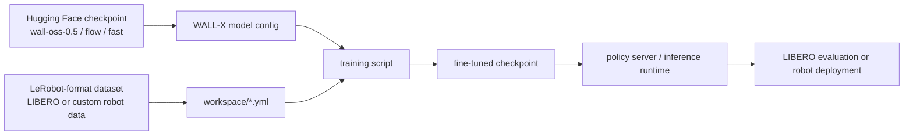
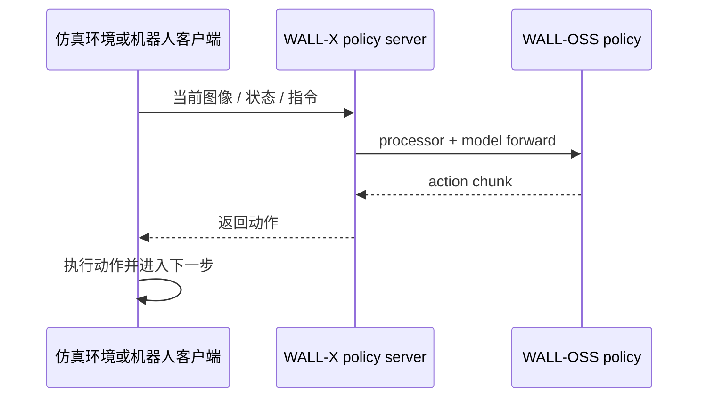

# WALL-X: An open-source engineering framework for the WALL series

WALL-X is not a single paper, but an open-source engineering stack provided by X Square Robot for the WALL series models. It can be understood as: **the code entry point for downloading the WALL-OSS model, preparing LeRobot data, configuring training, starting inference services, conducting evaluation, and deployment**.

After completing this section, everyone needs to make a judgment:

> WALL-X is the main engineering entry point for reproduction of WALL-OSS, but it cannot be automatically equivalent to the complete paper reproduction package of WALL-WM.

## 1. Repository and Resource Status

| Item | Current Status |
| :--- | :--- |
| Code Repository | [X-Square-Robot/wall-x](https://github.com/X-Square-Robot/wall-x) |
| License | The repository provides Apache-2.0 license |
| Supported Models | `wall-oss-0.5`, `wall-oss-flow-0.1`, `wall-oss-flow`, `wall-oss-fast` |
| Main Capabilities | LeRobot data preparation, model configuration, flow/FAST action branches, serving, evaluation, CUDA op compilation |
| Recommended Uses | Training after WALL-OSS-0.5, LIBERO/LeRobot data evaluation, service-based inference |

The News in the WALL-X README mentions WALL-OSS, WALL-OSS-0.5, and WALL-WM simultaneously. This may lead people to mistakenly think that "the full code for WALL-WM can also be reproduced with a single click". A more cautious understanding is:

- WALL-X currently provides the training and inference stack for the WALL series open-source models.
- `workspace/README.md` focuses on fine-tuning, simulation evaluation, and real robot deployment of **Wall-OSS-0.5**.
- The paper and PDF of WALL-WM have been published, but the weights, event data, and training recipe for the complete world action model at the event level cannot be directly confirmed from the WALL-X model list.

## 2. The position of WALL-X in the entire link



**Figure 1: WALL-X engineering pipeline.** The value of WALL-X lies in connecting models, data, configurations, training, and deployment. It does not merely provide a model definition file, but offers an engineering framework that allows experiments to be conducted around WALL-OSS.

If you are creating an open-source tutorial, the WALL-X article should not be titled “Introduction to Paper-Based Methods”, but rather “How to Determine Which Entry to Start Running”. It should be presented as a navigation guide for engineering.

## 3. Most Important Capabilities in the Repository

According to the official README, WALL-X covers several capabilities:

| Capability | How it should be explained in the tutorial |
| :--- | :--- |
| LeRobot data preparation | Organize robot trajectory into a format readable by LeRobot, reducing the cost of integrating proprietary data |
| model configuration | Specify checkpoint, processor, action dimensions, data paths, and training hyperparameters using YAML |
| flow-matching action branch | Designed for continuous actions, suitable for high-frequency control |
| FAST action branch | Focused on faster action token / action prediction approaches |
| serving and evaluation utilities | Serve the policy as a service, which is then invoked by simulation or robot clients |
| CUDA operator sources | Compile custom CUDA ops during installation, requiring a compatible CUDA/PyTorch/flash-attn environment |

This also indicates that the main challenge in reproducing WALL-X lies not in the large number of commands, but in the environment version, CUDA compilation, LeRobot version, checkpoint path, and data format.

## 4. It is recommended to start with Wall-OSS-0.5

The official `workspace/README.md` clearly states that the current open-source release is for **Wall-OSS-0.5**. If you use `WALL-OSS-FLOW` or `WALL-OSS-FAST`, the README suggests switching back to the old version of the code.

This sentence is very important for the tutorial. When writing the reproduction plan, do not mix up all checkpoints. Suggestions:

| Goal | Recommended Choice |
| :--- | :--- |
| First time to reproduce WALL-X | `wall-oss-0.5` + current main branch |
| Want to test the old flow/FAST model | Switch to the corresponding historical commit according to the official instructions |
| Want to integrate LeRobot community tools | Follow `policy.type=wall_x` in the LeRobot documentation |
| Want to reproduction the WALL-WM paper | Not recommended for now; track whether the official releases a separate checkpoint and data recipe |

## 5. Key Points for Environment and Installation

The official WALL-X environment is roughly as follows:

```bash
conda create --name wallx python=3.10
conda activate wallx

pip install -r requirements.txt
pip install "dmuon @ git+https://github.com/X-Square-Robot/dmuon.git"

git clone https://github.com/huggingface/lerobot.git
cd lerobot
git checkout c66cd401767e60baece16e1cf68da2824227e076
pip install --no-deps -e .
cd -

MAX_JOBS=8 pip install --no-build-isolation -e .
```

When reproducing, pay attention to the following points:

- Is the Python version 3.10?
- Do CUDA, PyTorch, and flash-attn match?
- Has LeRobot been checked out to the official commit?
- Is `--no-deps` used to install LeRobot to avoid overwriting WALL-X dependencies?
- Is compilation of CUDA extensions allowed when installing WALL-X?

These checks are more important than blindly rerunning commands. Many VLA engineering failures are not due to model issues, but rather to flash-attn, CUDA extension, LeRobot dependencies, or torch version conflicts.

## 6. Model Download and Path Configuration

WALL-X recommends downloading two types of model files first:

| File | Function |
| :--- | :--- |
| WALL-OSS checkpoint | Model weights and configuration, e.g., `x-square-robot/wall-oss-0.5` |
| Qwen2.5-VL processor | Tokenizer/processor for VLM input processing |

The example entry is as follows:

```bash
huggingface-cli download x-square-robot/wall-oss-0.5 \
  --local-dir /path/to/wall-oss-0.5

huggingface-cli download Qwen/Qwen2.5-VL-3B-Instruct \
  --local-dir /path/to/Qwen2.5-VL-3B-Instruct
```

In the tutorial, `/path/to/...` should not be replaced with the author's machine path. It is recommended to define it uniformly:

```bash
export MODEL_ROOT=/path/to/models
export DATA_ROOT=/path/to/data
export WALLX_ROOT=/path/to/wall-x
```

Then use the corresponding path in YAML to facilitate others' migration to your server.

## 7. Data and Training Configuration

The training configuration of WALL-X is centered around `workspace/example/*.yml`. Several types of fields need attention:

| Configuration Field | Function |
| :--- | :--- |
| `model.config_path` | Points to `config.json` in WALL-OSS checkpoint |
| `model.processor_path` | Points to Qwen2.5-VL processor |
| `model.pretrained_path` | Points to pre-trained weights |
| dataset path | Points to LeRobot format data |
| robot DOF | The action dimension must match the robot data |
| action branch | flow / FAST / other prediction modes |
| batch size / steps | Adjusted according to memory capacity |

If everyone is just writing open-source tutorials, they can set the reproduction goal to “smoke test level”:

- The model and processor can be loaded.
- LeRobot data can be read.
- Training forward/backward can run a few steps.
- Output checkpoint can be saved.
- Evaluation or fake inference can return actions.

This type of smoke test proves that the engineering link is functional, but it does not prove that the model meets the performance requirements stated in the paper.

## 8. Reasoning services and evaluation links

The practice form of WALL-X is usually a policy server + environment/robot client:



**Figure 2 Inference service call chain.** This service-oriented design facilitates the separation of model processes and simulation/robot control processes, as well as the deployment of GPU inference and robot control on different machines.

The most common entry during evaluation is:

- LIBERO simulation evaluation.
- Post-training and validation on the proprietary LeRobot format data.
- Fake inference / serving smoke test.
- Real robot deployment, but this requires additional hardware interfaces and security controls, and cannot be used automatically in general tutorials.

## 9. Relationship with LeRobot Integration

The LeRobot documentation has already exposed WALL-OSS as a policy:

```text
policy.type=wall_x
```

This is very valuable for open-source tutorials. Since many readers are already familiar with the LeRobot data format and training commands, testing WALL-OSS directly in LeRobot is easier than configuring it entirely according to the native WALL-X method.

Two routes can be selected in this way:

| Route | Suitable for |
| :--- | :--- |
| Native WALL-X | Those who want to stay close to the official X Square Robot engineering stack and may later deploy WALL-OSS-0.5 |
| LeRobot Integration | Users with LeRobot data or those familiar with `lerobot-train` |

## 10. Why this tutorial does not include a step-by-step reproduction at present

WALL-X has a reproduction option for the entrance, but a complete step-by-step tutorial is still required:

- Specific checkpoint version.
- Specific code commit.
- Specific LeRobot commit.
- Specific CUDA/PyTorch/flash-attn combination.
- Dataset size, download method, and disk layout.
- Whether to run LIBERO, real robot data, or proprietary data.

When these variables are not fixed, simply writing a "from zero to running smoothly" section easily turns into a bunch of unmaintainable commands. A better approach now is: first explain the engineering stack, model selection, and reproduction boundaries in this chapter; if `wall-oss-0.5 + LIBERO` is decided to be run later, then write a separate tutorial for reproducible reproduction.

## 11. Reference Materials

- WALL-X code:[X-Square-Robot/wall-x](https://github.com/X-Square-Robot/wall-x)
- WALL-X workspace guide：[workspace/README.md](https://github.com/X-Square-Robot/wall-x/blob/main/workspace/README.md)
- WALL-OSS-0.5 model:[x-square-robot/wall-oss-0.5](https://huggingface.co/x-square-robot/wall-oss-0.5)
- WALL-OSS-FLOW model:[x-square-robot/wall-oss-flow](https://huggingface.co/x-square-robot/wall-oss-flow)
- WALL-OSS-FAST model:[x-square-robot/wall-oss-fast](https://huggingface.co/x-square-robot/wall-oss-fast)
- LeRobot WALL-OSS documentation: [https://huggingface.co/docs/lerobot/en/walloss](https://huggingface.co/docs/lerobot/en/walloss)
- LeRobot: [https://github.com/huggingface/lerobot](https://github.com/huggingface/lerobot)
- LIBERO: [https://github.com/Lifelong-Robot-Learning/LIBERO](https://github.com/Lifelong-Robot-Learning/LIBERO)
