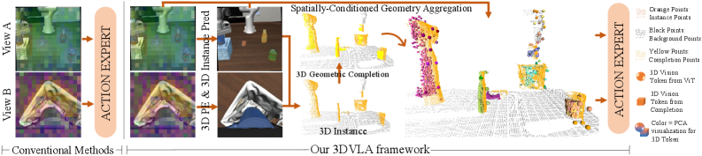
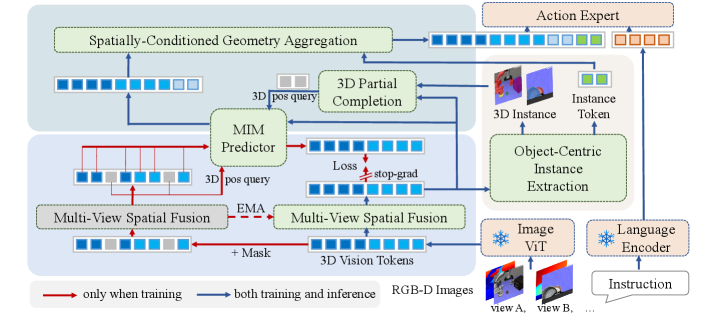
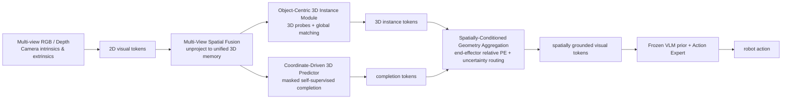
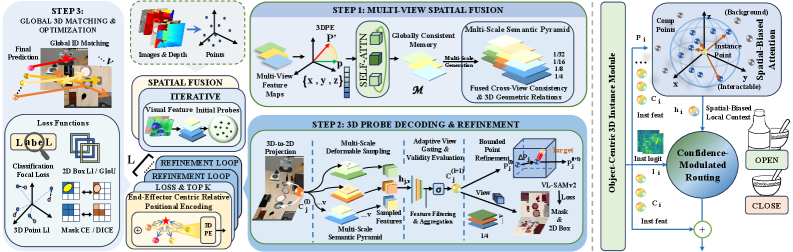
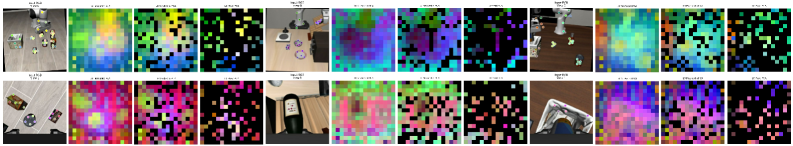
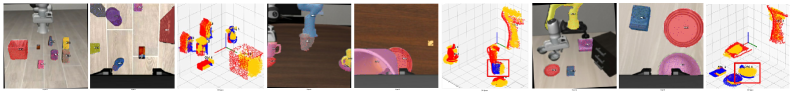

<!-- Generated by the offline translation workflow.
Source: 06-策略抓取或抓取VLA/大模型控制、VLA、VLM/09-3DVLA三维空间实例增强VLA导读/README.md
Source SHA-256: df2bf2ede7c9797c3bc3fd9e0f9361d5586c6302759ca47a8f9fa32d5e10ac22
Model: tencent/Hy-MT2-1.8B-GGUF:Q4_K_M
Review machine-translated technical claims before relying on them.
-->
# 3DVLA: A plug-and-play framework that injects three-dimensional space and instance understanding into VLA

This introduction corresponds to the paper **3DVLA: Enhancing Vision-Language-Action Models via 3D Spatial and Instance Understanding**, from the Wang Xuan Institute of Computer Science at Peking University. It was submitted to arXiv on 2026-05-28. It is suitable to be placed in the `06-策略抓取或抓取VLA/大模型控制、VLA、VLM` section of this repository, following OpenVLA, DiT4DiT, EventVLA, and WALL-OSS/WALL-X.

After completing this section, everyone needs to grasp a key judgment:

> 3DVLA does not re-train a new VLA base, but instead inserts a set of 3D space, 3D instance, and occlusion completion modules between the visual tokens and action experts of the existing VLA, making the originally 2D VLA more stable in understanding where objects are, which instance is the target, and what the occluded geometric structure might be.

This piece is very suitable for the “manipulation control” path, and can also serve as a bridge between “perception mapping” and “VLA frontier”. It focuses not just on object recognition, but on turning the understanding of 3D space into tokens that can be used for action prediction.

## 1. Paper and Code Status

| Item | Current Status |
| :--- | :--- |
| Paper | [arXiv:2605.29416](https://arxiv.org/abs/2605.29416), submitted on 2026-05-28 |
| arXiv HTML | [3DVLA HTML](https://arxiv.org/html/2605.29416v1) |
| Author Institution | Wangxuan Institute of Computer Technology, Peking University |
| Code Status | As of 2026-07-18, the official GitHub repository for this paper has not been found |
| Notes | The searched [UMass-Embodied-AGI/3D-VLA](https://github.com/UMass-Embodied-AGI/3D-VLA) is another 2024 paper titled **3D-VLA: A 3D Vision-Language-Action Generative World Model**, not the Peking University paper in 2026 with 3DVLA |
| Reproduction Suggestion | Currently suitable for writing method introductions and follow-up tracking entries, but not suitable for creating a "one-click reproduction of paper results" section |

It should be explained clearly: if users search for `3DVLA`(https://github.com/umass-dsst/ee-keep) on GitHub now, they will easily find UMass’s `3D-VLA` from 2024. It also relates to robotics and 3D/VLA, but the topic, author, and objective of the method are different. Therefore, this repository should not be regarded as the code for Peking University’s 3DVLA. For this paper by Peking University, it is more appropriate to first read the method diagram and experiment table, and wait until the official repository is available before looking up the reproduction guide.

## 2. What problem does this actually solve?

Traditional VLA typically takes multi-view RGB images, language instructions, and historical observations as inputs, and outputs action tokens, final pose increments, or action chunks. The advantage of such models is that they can inherit the semantic understanding capability of VLM, but there is also a clear issue: many VLAs still integrate data based on 2D image tokens, resulting in insufficient understanding of the 3D spatial relationships that robots truly care about.

The paper breaks down this problem into three specific challenges:

| Pain points | Specific manifestations | Impact on robot manipulation |
| :--- | :--- | :--- |
| Weak 3D spatial positioning | Multi-view images are merely loosely spliced or fused, without being explicitly unified into a single 3D coordinate system | After the camera angle or object position changes, the model does not know where the object is in the robot coordinate system |
| Weak 3D instance understanding | Objects are treated as 2D regions, lacking consistent instance representation across views | The same cup appears differently in two cameras, making it easy for the model to mix up the target instance, background instance, or occluded area |
| Vulnerable reasoning under occlusion | When the target object is partially hidden, 2D tokens only see a fragmented appearance | Tasks such as grasping, placement, and wiping require inferring the invisible parts, and pure 2D VLA easily leads to motion drift |

The core idea of 3DVLA is: neither to overthrow the existing VLA nor to train a separate heavy 3D perception network that is incompatible with VLM. Instead, 3D geometric information should be formatted into tokens that VLA can process, and then these tokens are injected into the action expert.

It can be understood as:

```text
多视角 RGB / 深度 / 相机参数
        ↓
统一到 3D 空间的视觉记忆
        ↓
抽取跨视角一致的 3D instance token
        ↓
对遮挡区域做 3D feature completion
        ↓
按夹爪相对位置聚合成 affordance-aware token
        ↓
拼回原 VLA token 流，交给 action expert 输出动作
```

So it is not as simple as "another point cloud encoder". The real key is: **the 3D token must be compatible with the original VLA 2D/VLM token, and it must also be usable by the downstream action expert.**

## 3. Overview Diagram: Why It's Called Plug-and-Play

<p align="center">
  
</p>

**Figure 1 3DVLA Overview.** The orange section indicates 3D instances with consistent perspectives, while the yellow section represents the completion of occluded geometry. The goal of 3DVLA is not to replace VLA, but to aggregate these spatial tokens back into an action model.

Source: [3DVLA arXiv HTML](https://arxiv.org/html/2605.29416v1).

This diagram can be understood in three layers.

The first layer is the input from the traditional VLA. The robot sees multi-view images, receives language commands, and then must output an action. Without 3D assistance, the model can only estimate “where the target is roughly” in the image plane, but it is difficult to determine the true spatial offset of the target relative to the gripper.

The second layer is the 3D understanding added by 3DVLA. It extracts 3D instances from multiple perspectives, ensuring that the same object corresponds to a single 3D entity in different views; at the same time, it performs geometric completion for structures that are occluded or invisible from certain angles.

The third layer is the usage method on the action side. 3DVLA does not ultimately output a separate 3D detection result for people to see. Instead, it injects the 3D instance token, completion token, and spatial offset into the action expert, making the action generation more stable.

"Plug and play" is mainly reflected in two aspects:

- The large VLM backbone is frozen; there is no need to discard the existing VLA pre-trained knowledge.
- The new 3D module outputs features compatible with the VLA token stream, which are then concatenated into the visual tokens for use by the action expert.

This is also what distinguishes it from many 3D perception methods. Ordinary 3D detection or point cloud segmentation can produce boxes, masks, or point clouds, but it is not always clear how to integrate into the VLA token/action structure. 3DVLA focuses on "how to turn 3D understanding into useful information for action prediction".

## 4. Overall Architecture: Four Modules Integrated Together

<p align="center">
  
</p>

**Figure 2: 3DVLA overall architecture.** The paper divides the method into four modules: Multi-View Spatial Fusion, Object-Centric 3D Instance Module, Coordinate-Driven 3D Self-Supervised Predictor, and Spatially-Conditioned Geometry Aggregation.

Source: [3DVLA arXiv HTML](https://arxiv.org/html/2605.29416v1).

This figure is the most important figure in the entire paper. The four modules can be translated into more straightforward terms:

| Module | Chinese Understanding | Problem Solved |
| :--- | :--- | :--- |
| Multi-View Spatial Fusion | Multi-view Spatial Fusion | Elevate 2D tokens seen by different cameras into a unified 3D memory |
| Object-Centric 3D Instance Module | Object-centered 3D Instance Module | Use 3D probes to find object instances consistent across views |
| Coordinate-Driven 3D Self-Supervised Predictor | Coordinate-driven 3D Self-supervised Predictor | Perform feature completion for occluded or unseen geometric structures |
| Spatially-Conditioned Geometry Aggregation | Spatially-conditioning Geometry Aggregation | Aggregate 3D instances / completions based on the relative position of the gripper into tokens usable by the action expert |

The simplified data flow is as follows:



Note that `Camera intrinsics & extrinsics` here is crucial. 3DVLA does not guess 3D from a single RGB image, but uses multi-view observations, depth, and camera parameters to bind image tokens to continuous 3D coordinates. Without this geometric alignment, it degenerates into a simple multi-view feature fusion.

## 5. Module 1: Multi-View Spatial Fusion

This module solves the problem of "the same world is seen by multiple cameras".

Many VLA models also support multi-view images. However, the common approach is to directly concatenate the tokens of images from different views, or perform attention fusion within the transformer. In this way, the model sees multiple 2D planes, lacking a unified 3D reference frame. For example, the left camera sees the cup on the right side of the image, while the wrist camera sees the cup in the center of the image. These two 2D positions cannot directly tell the action expert where the cup is relative to the gripper.

The 3DVLA approach is to bind visual features with 3D coordinates. It uses camera internal and external parameters, as well as depth values, to map multi-view features into a unified 3D space, and then uses a transformer encoder to establish geometric correspondences across views. The paper also uses Continuous 3D RoPE to encode relative 3D distances into the query/key of attention, enabling the model to perceive Euclidean distance relationships.

This step has two benefits:

- **Cross-view consistency**: The same physical point does not become a completely different token just by changing the camera.
- **Action availability**: The position of objects can be placed within the spatial reference frame required for robot manipulation, rather than staying in image coordinates.

This is also what distinguishes it from "multi-view image stitching". Image stitching only increases the number of 2D tokens, while 3DVLA puts the tokens back into three-dimensional space.

## 6. Module 2: Object-Centric 3D Instance Module

<p align="center">
  
</p>

**Figure 3 3D instance modeling and geometric aggregation.** On the left, instances with consistent perspectives are modeled using 3D probes; on the right, instance tokens and completed geometries are aggregated based on spatial conditions, and then fed into the action model.

Source: [3DVLA arXiv HTML](https://arxiv.org/html/2605.29416v1).

In robot manipulation, simply "seeing an object" is not enough. The model must also know which object is the target, its position in 3D space, and how it relates to the gripper. 2D masks or 2D boxes have a natural problem in multi-view scenarios: the same object may differ in shape, size, and visible area across different cameras. If each view uses a separate instance, ID conflicts are likely to occur.

The 3D Instance Module of 3DVLA uses **3D probe**. Each probe contains two types of states:

- Semantic state: What is this entity, and what are its semantic features;
- 3D reference point: The reference position of this entity in the continuous 3D space.

The probe will be projected into different camera perspectives, sampling texture and semantic information from multi-scale 2D features. To avoid noise caused by occluded or unclear views, the module also introduces occlusion-aware gating to reduce the weight of unreliable perspectives.

The most notable aspect here is **global 3D matching**. Instead of performing 2D Hungarian matching in each perspective individually, the paper projects the pseudo-labels from the 2D box/mask back to the 3D centroid, and then performs global matching in the 3D space. In this way, the same physical object corresponds to the same 3D instance, avoiding conflicts in IDs across different perspectives.

Pseudo-labels come from frozen perception models, such as open-world detection/splitting models like VL-SAM-v2. This design allows 3DVLA to avoid additional manual instance-level annotation, yet it can still train the instance module using pseudo-masks and pseudo-boxes.

## 7. Module 3: Coordinate-Driven 3D Self-Supervised Predictor

<p align="center">
  
</p>

**Figure 4: Coordinate-driven 3D self-supervised predictor.** This branch retains the masked self-supervised predictor, which queries 3D tokens at occluded or unobserved positions during inference to complete the invisible geometry.

Source: [3DVLA arXiv HTML](https://arxiv.org/html/2605.29416v1).

This module is a rather ingenious part of the paper. Many self-supervised visual methods use masked predictions during pre-training, but discard the predictor when deploying downstream, retaining only the encoder. In contrast, 3DVLA utilizes this predictor: since robot manipulation often encounters occlusions, the predictor fills in the features in the 3D coordinate space for the invisible regions.

During training, it defines two types of coordinates:

- mask coordinates: the positions that are hidden during self-supervised prediction training;
- completion coordinates: the geometric positions that are invisible or obscured in the real scene.

The model learns to infer invisible structures from visible perspectives through asymmetric multi-view masking. In this case, ordinary 2D interpolation is not sufficient; otherwise, the model might learn to "copy answers from neighboring pixels". The paper uses 50% asymmetric masking, requiring the model to utilize cross-perspective 3D geometric relationships to recover features.

To generate completion coordinates, the process in the paper is roughly as follows:

1. Reverse-project the 2D mask into a raw point cloud;
2. Denoise using density clustering;
3. Predict the complete shape using a pre-trained point cloud completion network;
4. Sample invisible structures from areas far from visible points;
5. Obtain a uniform completion query using farthest point sampling.

During reasoning, instead of randomly masking, the completion coordinates are directly used to query the continuous space to generate occluded features. For robots, this is equivalent to providing the action expert with a "possible complete geometric structure" hint when part of the target is obscured.

It addresses not the issue of visual aesthetics, but the problem of motion stability. For example, the gripper can only see one side of the cup, but grasping requires estimating the center and boundaries of the entire cup; pure 2D tokens are prone to deviation, while 3D completion tokens can provide more complete spatial cues.

## 8. Module 4: Spatially-Conditioned Geometry Aggregation

3D information must ultimately serve actions; otherwise, it is just an additional perception result. 3DVLA does two things in aggregation.

The first is **end-effector centric relative positional encoding**. Robot actions are typically performed relative to the gripper. Providing the policy with an absolute world coordinate of an object is not sufficient; the model must learn the “relative offset from the object to the gripper” and the relationship between robot kinematics. 3DVLA converts the geometric representation directly into the offset relative to the end-effector, then encodes it into tokens using sinusoidal / MLP methods, along with instance and completion features.

This step is very engineering-oriented. What a robot really needs to know is not "the cup is at world coordinate x=0.4", but rather:

```text
目标相对夹爪：前方 8 cm，左侧 2 cm，下方 4 cm
```

This relative coordinate system is more direct for action generation.

Second is **uncertainty-guided routing**. If the 2D vision is already very certain, forcing the injection of a large number of 3D completion features into the instance token may contaminate the originally reliable visual representation. The paper uses the classification logit estimated by the instance module to estimate uncertainty, and then decides whether to inject local 3D geometric context.

This routing concept can be simply understood as:

| Visual State | Whether More 3D Completion is Needed |
| :--- | :--- |
| Clear target, high instance confidence | Less injection to preserve the original VLM/VLA representation |
| Target obscured, blurred view, uncertain instances | More injection to use 3D completion for reasoning |

The paper also mentions that the final linear layer of routing should be initialized to zero, and a constant bias should be set, so that training starts close to an identity mapping. This detail is important: it prevents the new 3D module from disturbing the features of the pre-trained VLA at the beginning.

## 9. Multi-perspective Consistency and Occlusion Completion Effect

<p align="center">
  
</p>

**Figure 5: Consistency of multiple views and 3D completion.** The left and middle sides show that the same instance remains consistent under different perspectives, while the right side illustrates the relationship between visible points and completed geometry in world coordinates.

Source: [3DVLA arXiv HTML](https://arxiv.org/html/2605.29416v1).

Although this image is not large, the information is highly concentrated. It shows the most core capability of 3DVLA compared to a regular 2D VLA:

- The same object maintains consistent instance across different cameras;
- The 2D mask of the object can be projected back into 3D space;
- Hidden or unseen structures can be generated using the completion predictor;
- These results are not the final output, but will continue to be converted into tokens for the action expert.

For real manipulation tasks, such capabilities are particularly important. Tabletop robots often encounter situations where wrist cameras block the view, grippers cover the targets, only parts of objects inside containers are visible, or both arms overlap each other. A pure 2D model would treat “invisibility” as “no information,” while 3DVLA attempts to fill in the missing information from multiple perspectives and 3D geometry.

## 10. How to read the experimental results

The paper mainly evaluates on two simulation benchmarks: LIBERO-Plus and RoboTwin 2.0. The metric is the success rate.

### 10.1 LIBERO-Plus

LIBERO-Plus is a benchmark for conducting robustness analysis on LIBERO, including disturbances such as Camera, Robot, Language, Light, Background, Noise, and Layout. The main results reported in the paper are as follows:

| Method | Camera | Robot | Language | Light | Background | Noise | Layout | Avg. |
| :--- | ---: | ---: | ---: | ---: | ---: | ---: | ---: | ---: |
| WorldVLA | 0.1 | 27.9 | 41.6 | 43.7 | 17.1 | 10.9 | 38.0 | 25.0 |
| OpenVLA | 0.8 | 3.5 | 23.0 | 8.1 | 34.8 | 15.2 | 28.5 | 15.6 |
| NORA | 2.2 | 37.0 | 65.1 | 45.7 | 58.6 | 12.8 | 62.1 | 39.0 |
| UniVLA | 1.8 | 46.2 | 69.6 | 69.0 | 81.0 | 21.2 | 31.9 | 42.9 |
| π0-Fast | 65.1 | 21.6 | 61.0 | 73.2 | 73.2 | 74.4 | 68.8 | 61.6 |
| RIPT-VLA | 55.2 | 31.2 | 77.6 | 88.4 | 91.6 | 73.5 | 74.2 | 68.4 |
| OpenVLA-OFT | 56.4 | 31.9 | 79.5 | 88.7 | 93.3 | 75.8 | 74.2 | 69.6 |
| π0 | 61.0 | 40.8 | 63.5 | 89.3 | 84.1 | 80.1 | 76.4 | 69.4 |
| π0.5 | 71.2 | 77.1 | 89.9 | 94.7 | 94.0 | 84.2 | 84.3 | 84.2 |
| π0.5 + 3DVLA | 75.6 | 77.4 | 88.6 | 97.4 | 97.7 | 85.3 | 86.6 | 86.0 |

What is most worth looking at in this table are the Camera and Layout sections. 3DVLA has improved these spatial disturbances, indicating that 3D space anchoring is indeed more sensitive to perspective and layout changes. It doesn't drastically increase all metrics, but continues to improve the average success rate to 86.0 on an already strong π0.5 foundation.

Also, pay attention to a boundary: On Language, π0.5 is 89.9, and π0.5 + 3DVLA is 88.6, which is slightly lower. This indicates that the main value of 3DVLA is not enhanced language understanding, but rather enhanced robustness in 3D space and occlusion.

### 10.2 RoboTwin 2.0

RoboTwin 2.0 emphasizes manipulation tasks involving multiple perspectives, contact, dual arms, occlusion, and rich physics. Paper report:

| Method | Easy | Hard |
| :--- | ---: | ---: |
| DP | 28.0% | 0.6% |
| ACT | 29.7% | 1.7% |
| RDT | 34.5% | 13.7% |
| DP3 | 55.2% | 5.0% |
| π0 | 46.4% | 16.3% |
| π0 + 3DVLA | 54.5% | 23.2% |
| X-VLA | 70.0% | 39.0% |
| X-VLA + 3DVLA | 72.6% | 42.1% |

Two things can be seen here.

First, 3DVLA can be applied to different VLA baselines. With π0 plus 3DVLA, Easy increases from 46.4% to 54.5%, and Hard increases from 16.3% to 23.2%. With X-VLA plus 3DVLA, Easy increases from 70.0% to 72.6%, and Hard increases from 39.0% to 42.1%. This supports the "plug-and-play" approach.

Second, the improvement of Hard tasks is more meaningful. Hard tasks typically involve stronger occlusions, more complex contacts, and finer spatial relationships. The improvement by 3DVLA on Hard tasks indicates that 3D instances and completions are not only useful in simple visual perturbations.

### 10.3 Ablation Experiments

Add the modules step by step for the paper ablation:

| Model | Instance | Predictor | Routing | RoboTwin Easy | RoboTwin Hard |
| :--- | :---: | :---: | :---: | ---: | ---: |
| π0 baseline |  |  |  | 46.4% | 16.3% |
| A | ✓ |  |  | 50.1% | 18.9% |
| B | ✓ | ✓ |  | 53.4% | 21.8% |
| C | ✓ | ✓ | ✓ | 54.5% | 23.2% |
| X-VLA baseline |  |  |  | 70.0% | 39.0% |
| A | ✓ |  |  | 71.3% | 40.4% |
| B | ✓ | ✓ |  | 72.1% | 41.6% |
| C | ✓ | ✓ | ✓ | 72.6% | 42.1% |

This ablation is clear: the 3D instance module, 3D predictor, and routing all have benefits, but these benefits are not achieved by a single module alone. The three can be understood as:

- Instance is responsible for "which object is in which 3D position";
- Predictor is responsible for "what the invisible parts might be";
- Routing is responsible for "when to inject these 3D information into the original VLA token".

## 11. Training and computing cost

The appendix of the paper provides some very useful implementation details.

The training policy is two-stage:

| Phase | Training Content | Purpose |
| :--- | :--- | :--- |
| Stage 1 | Multi-View Spatial Fusion, 3D Instance Module, action expert | First learn stable 2D-to-3D instance anchoring |
| Stage 2 | Freeze the Stage 1 modules, train 3D Self-Supervised Predictor and Geometry Aggregation, and continue updating the action expert | Then learn occlusion completion and geometry aggregation to avoid early training failure due to continuous feature regression |

The paper also states that the large VLM backbone remains frozen during training, and only the newly added 3D perception modules and downstream action experts are updated. The Object-Centric 3D Instance Module initializes 100 state probes. After matching and uncertainty filtering, a maximum of 16 highly confident instance tokens are retained per scene. The 3D Predictor can handle up to 6 occluded instances, with 5 completion coordinate queries sampled for each instance.

In terms of computing power, the paper reports that the two-stage training was completed on a single node with 4 NVIDIA A800 GPUs: Stage 1 took approximately 5 hours, and Stage 2 took approximately 9 hours, with a total training time of about 14 hours. The evaluation is more time-consuming, with the main bottlenecks being simulation rendering and physics steps, rather than model inference; the paper uses 8 A800 GPUs to complete the full simulation evaluation, which takes about 14 hours.

This means that 3DVLA is not a system that requires pre-training a large-scale VLA from scratch. The computational requirements are still high, but as a plug-in enhancement module for VLA, the training cost is much lower than that of a training base.

## 12. Its differences from other 3D / VLA methods

| Method | Core Idea | Differences from 3DVLA |
| :--- | :--- | :--- |
| OpenVLA / π0 / π0.5 | Directly map visual language to actions using VLM prior | Strong semantics, but 3D space and instance understanding still need improvement |
| DP3 | Use 3D point cloud to generate visuomotor policy | More point cloud-based policy; 3DVLA emphasizes compatibility with VLM/VLA tokens and pre-trained priors |
| DiT4DiT | Use diffusion transformer for visual/action generation | Focus on action generation paradigm; 3DVLA focuses on 3D perception injection |
| EventVLA | Long-term domain visual evidence memory | Solves long-term memory issues, but does not directly address 3D instance and occlusion completion |
| WALL-OSS / WALL-X | Open-source VLA model and engineering framework | Solves model/training/deployment entry points; 3DVLA is a spatial understanding enhancement plugin |
| LeWM / RAW-Dream / RoboDream | World model, imagination rollout, or data synthesis | 3DVLA is not a world model; it does not generate future videos, mainly enhancing 3D representations of current observations |

One-sentence identification:

> 3DVLA does not transform VLA into a world model, nor convert VLA into a pure point cloud policy. Instead, it adds a layer of trainable, pluggable 3D spatial instance understanding compatible with VLM tokens to the existing VLA.

## 13. How to follow up after reproduction

Since the official code has not been released yet, it is not recommended to attempt reproduction by hand. However, a checklist for subsequent reproduction can be prepared in advance.

| Module | Required for subsequent reproduction |
| :--- | :--- |
| Base VLA | π0 / π0.5 / X-VLA or the actual open-source configuration by the author |
| Multi-view input | RGB, depth, camera intrinsics, camera extrinsics |
| Pseudo-label generation | frozen perception model, such as open-world detection/segmentation models like VL-SAM-v2 |
| 3D instance | state probes, 3D matching, mask/box/centroid losses |
| 3D completion | point cloud completion network, mask coordinates, completion coordinates |
| Action expert | Aligned with the action space, action chunks, and control frequency of the target VLA |
| Benchmark | LIBERO-Plus, RoboTwin 2.0 official evaluation protocol |

If the official code is available later, it is recommended to prioritize reproduction of the three minimal issues:

1. **Can the inference or evaluation demo run successfully**: First, verify the repository dependencies, model loading, and benchmark interfaces.
2. **Can a baseline + 3DVLA gain be reproduced**: Prioritize using RoboTwin 2.0’s π0 + 3DVLA or X-VLA + 3DVLA.
3. **Can 3D instances and completion tokens be visualized**: Not only check the success rate, but also ensure that the 3D module truly learns cross-view consistency.

## 14. Notable Boundaries

First, 3DVLA is not a strong world model. It cannot predict future videos or perform multi-step physical interactions internally. What it enhances is the 3D space/instances representation under current observations.

Second, it relies on multiple viewpoints, depth, and camera geometry. Without reliable camera calibration and depth alignment, the foundation of Multi-View Spatial Fusion becomes weak. In real robot reproduction, calibration errors may be more problematic than those described in the paper.

Third, the quality of pseudo-labels affects the instance module. The paper uses a frozen perception model to generate 2D box/mask pseudo-labels and then projects them back to 3D. If the detection or segmentation model performs poorly in the target domain, the 3D instance learning will also be biased.

Fourth, the current code has not been officially released. This article should serve as a guide to the method and an entry for subsequent tracking, and should not be described as “the results of the paper can now be reproduced with one click”.

Fifth, its experiments are mainly simulation benchmarks. LIBERO-Plus and RoboTwin 2.0 are both valuable, but they have not yet demonstrated the same gains under complex occlusion, calibration errors, sensor noise, and contact deviations in real robots.

## 15. Reading order of other articles in this tutorial

It is recommended to read in the following order:

| Article | What to Learn First |
| :--- | :--- |
| [Simulation of OpenVLA](../02-openvla-reproduction/02-openvla-reproduction.md) | Basic input/output and deployment methods of VLA |
| [MuJoCo ACT/Pi0/SmolVLA](../04-mujoco-reproduction-act-pi0-smolvla/README.md) | Robot action policies, data collection, and simulation training |
| [DiT4DiT-LIBERO](../05DiT4DiT-LIBERO/01-dit4dit-libero-training-and-evaluation.md) | How diffusion / transformer generate actions |
| [EventVLA](../06-eventvla-visual-evidence-memory-guide/README.md) | Visual evidence memory in long-term domain tasks |
| [WALL-OSS / WALL-X](../07-wall-oss-open-source-vla-model-introduction/README.md) | Open-source VLA models and engineering frameworks |
| This Article 3DVLA | How 3D space, instances, and occlusion completion enhance VLA |

If I had to summarize this in one sentence:

> The value of 3DVLA lies in transforming “which object the robot sees in 3D space, what might be missing, and where these geometric information are relative to the gripper” into tokens that the VLA action expert can directly use.

## 16. Reference Links

- Paper:[3DVLA: Enhancing Vision-Language-Action Models via 3D Spatial and Instance Understanding](https://arxiv.org/abs/2605.29416)
- arXiv HTML image-text version:[https://arxiv.org/html/2605.29416v1[[EE_KEEP_0003]]
- Note the distinct projects with the same name:[UMass-Embodied-AGI/3D-VLA](https://github.com/UMass-Embodied-AGI/3D-VLA)
