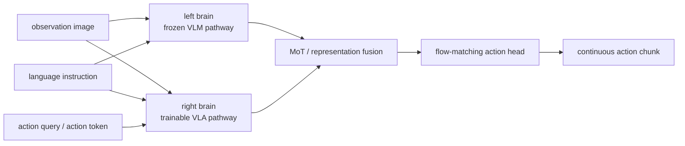

# PhysBrain 1.0: First learn physical basics, then study robot control

This section corresponds to the paper **PhysBrain 1.0 Technical Report**, with paper number [arXiv:2605.15298](https://arxiv.org/abs/2605.15298). The project page is [phys-brain.github.io](https://phys-brain.github.io/), and the VLA code repository is [Phys-Brain/PhysBrain-VLA](https://github.com/Phys-Brain/PhysBrain-VLA).

PhysBrain 1.0 belongs to the VLA manipulation-policy route and connects 3DVLA's spatial understanding with later policy training. It serves robot control and VLA post-training; it does not provide a simulator-style `step(action)` interface or generate video rollouts of future trajectories.

After completing this section, everyone needs to grasp a key judgment:

> The key to PhysBrain 1.0 is not “imitating actions from more robot trajectories”, but rather compiling large-scale human first-person videos into structured physical common-sense supervision, training a VLM that understands physical relationships, contact processes, spatial distances, and action feasibility, and then adapting it through ability preservation and language sensitivity to transfer this physical prior knowledge into robot action generation.

In other words, it follows this path:

```text
人类第一人称视频
        ↓
结构化物理元信息
        ↓
深度增强和物理 QA
        ↓
PhysBrain VLM
        ↓
TwinBrainVLA + LangForce
        ↓
机器人控制策略
```

This trajectory complements many recent VLA works: WALL-OSS focuses more on the open-source model and engineering entry from VLM to VLA, 3DVLA emphasizes 3D space and instance token injection actions experts, and PhysBrain 1.0 highlights “where physical common sense comes from, and how it is not overwritten by robot trajectory data during VLA fine-tuning”.

## 1. Papers, Projects, and Open Source Status

| Item | Current Status |
| :--- | :--- |
| Paper | [arXiv:2605.15298](https://arxiv.org/abs/2605.15298), submitted on 2026-05-14 |
| Official Project Page | [PhysBrain 1.0](https://phys-brain.github.io/) |
| VLA Code Repository | [Phys-Brain/PhysBrain-VLA](https://github.com/Phys-Brain/PhysBrain-VLA), Apache-2.0 |
| Hugging Face Paper Page | [HF Papers: 2605.15298](https://huggingface.co/papers/2605.15298) |
| Model Collection | [PhysBrain 1.0 VLA collection](https://huggingface.co/collections/Phys-Brain/physbrain-10-vla) |
| Publicly Available Checkpoints | RoboCasa-GR1, LIBERO, SIMPLER-Bridge, SIMPLER-Fractal |
| Recommended Reproduction Method | Do not train the data engine and VLM from scratch; prioritize reading the methods, download the checkpoint, and load the VLA adaptation code in the starVLA framework |

It is necessary to clarify the open-source boundaries here. Currently, the [ PhysBrain-VLA](https://github.com/Phys-Brain/PhysBrain-VLA) repository has made the model code and checkpoint entry on the VLA side available. The README also indicates that it is based on the `starVLA` scaffold. It is required to copy `physbrain_vla/PhysBrainVLA.py` into `starVLA/model/framework/`, and then load and deploy it according to the standard checkpoint workflow of starVLA.

However, it is not a complete training repository that covers "from 3000 hours of human videos to PhysBrain VLM and all robot benchmarks" in one click. The data engine, all annotated data, complete training scripts, and large-scale computing resources should not be considered fully available by default. In the tutorial, it is more suitable as a guide to the methodology and an entry point for checkpoint reuse, rather than a guarantee of reproducing the entire paper process.

## 2. What problem does it actually solve

Many VLA training logic can be summarized as:

```text
机器人观测 + 语言指令 + 示教动作
        ↓
行为克隆 / diffusion / flow matching
        ↓
新场景执行
```

This route is effective, but there is a major issue: the robotic arm trajectory is expensive, and its coverage is limited. A robotic arm dataset may contain many grasping, placement, and drawer-opening trajectories, yet it struggles to cover the diverse physical phenomena in the human daily world, such as transparent bags, flexible objects, whether containers are full, the order of hand-object contact, occlusion and depth relationships between objects, and the typical physical reasons for action failures.

The key point of PhysBrain 1.0 is that human first-person videos inherently contain extensive manipulation experiences. When humans cook, organize, assemble, perform experiments, or follow industrial processes, hands, objects, tools, contact, movement, occlusion, state changes, and task stages are all present in the videos. The problem is that these videos cannot be directly used to train robot control, as they lack robot actions and uniform structured labels.

So the paper made a conversion:

| Information implied in the original video | Supervision explicitly extracted by PhysBrain |
| :--- | :--- |
| What is on the desktop | `scene_elements`: main manipulable objects, adjacent objects, materials, geometry, state |
| How hands and objects approach, contact, and separate | `spatial_dynamics`: initial layout, relative position changes, evolution of spatial relationships |
| What steps are actually being performed by the person | `action_execution`: brief task intent and detailed execution process |
| How far objects are from the camera/hands | depth-aware relations: relative depth, absolute distance, accessibility |
| What should be done next in this action | physical QA: next-step prediction, operability, safety, long-term planning |

The value of this approach is that it does not require human videos to correspond exactly with robot actions. Human videos are used first to train the “physical understanding brain,” while robot data is used to train “how the body performs.” This is what the paper repeatedly emphasizes: **understanding first, action next**.

## 3. Overview: What Tasks Have Been Verified by PhysBrain 1.0

<p align="center">
  
</p>

**Figure 1: Overview of the evaluation of PhysBrain 1.0.** This figure is not a model structure diagram, but a summary of the overall results provided in the paper: on the left is the VLM QA benchmark, and on the right are robot control benchmarks such as SimplerEnv, LIBERO, and RoboCasa-GR1.

Source: [PhysBrain 1.0 arXiv HTML](https://arxiv.org/html/2605.15298v1).

Figure 1 can be read in two lines.

The first line is on the VLM side. PhysBrain 1.0 doesn't just say "I can ultimately control the robot"; it first validates physical common sense and general visual language abilities on multi-modal understanding benchmarks such as ERQA, PhysBench, MME, MMMU, OCRBench, RealWorldQA, and TextVQA. This design aims to prove that the supervision generated from human first-person video conversion is not just providing extra features for the robot's action head, but truly improves the spatial, state, planning, and physical understanding of the base VLM.

The second line is on the VLA side. The paper validates the control capabilities on SimplerEnv-WidowX, SimplerEnv-GoogleRobot, LIBERO, and RoboCasa-GR1, with an emphasis on out-of-domain scenarios. The narrative presented in the paper is: if the VLM has a stronger physical prior regarding human interaction, then after adapting to limited robot data, it will have more stable control over new environments, objects, and tasks.

It cannot be simply understood as “PhysBrain trained a world model”. It did not generate an interactive environment or update the policy during imagined rollouts. Instead, it adds a physical common-sense pretraining stage before VLA and uses architectural and loss design to preserve that knowledge during VLA fine-tuning.

## 4. Data Engine: Compiling first-person videos into physical QA

<p align="center">
  
</p>

**Figure 2: From human first-person video to structured physical QA.** A short video segment is first sampled evenly into multiple frames, then parsed into `scene_elements`, `spatial_dynamics`, `action_execution` and depth information, and finally rendered as a trainable natural language QA.

Source: [PhysBrain 1.0 arXiv HTML](https://arxiv.org/html/2605.15298v1).

This image is key to understanding PhysBrain. It does not directly turn the video into a caption, such as "A person using chopsticks to handle meat in the kitchen." Such captions are useful for VLM, but too vague for robot control. What robots really need is a more detailed physical description:

- What is the main manipulable object, and what is its material and condition;
- What obstacles are present nearby that may affect the manipulation;
- From which direction does the hand approach, and does contact occur;
- How does the object change relative to the tabletop, sinker, or tools;
- Is the action pressing, flipping, grasping, placing, rotating, or stabilizing;
- Which objects are closer, farther, higher, or lower;
- What should be done next if the task needs to continue.

The paper designs this process into three layers.

The first layer is **structured scene metadata**. Each video clip will be parsed into a JSON-style source record, and the core fields include:

| Field | What is recorded | Why it is useful for robots |
| :--- | :--- | :--- |
| `scene_elements` | Main object, adjacent objects, environment, material, geometry, and physical state | Ensures the model knows that an object includes operational attributes such as rigidity, transparency, flexibility, and whether it is full or not |
| `spatial_dynamics` | Initial layout, hand-object distance changes, relative position changes of objects | Allows the model to learn spatial processes like "approach, contact, move, separate" |
| `action_execution` | Short intentions and detailed execution steps | Breaks observed actions into executable steps, rather than just providing video summaries |
| `depth_info` | Center point of the object, relative depth, absolute distance, etc. | Provides 3D and metric grounding for subsequent QA |

The second layer is **depth enhancement**. The paper uses the Depth Anything v3 series depth models to add point-wise depth and distance information to objects with grounding metadata. This step is very important: pure language descriptions often remain limited to “left, right, close, far”, but robot actions typically require continuous displacement, end pose, and spatial scale. With depth information introduced, QA questions can include “which object is closer”, “how far apart are the two”, and “is this position reachable?”, which pushes the spatial understanding of VLM from semantic relationships to physical dimensions.

The third layer is **physical QA generation**. Structured records are not the ultimate training objective; the ultimate goal remains natural language question answering. This approach has two advantages: on one hand, VLM can learn in a familiar QA format; on the other hand, the content of QA comes from structured records, allowing control over issues related to objects, space, depth, state changes, action feasibility, and long-term plans.

The QA family listed in the paper is very diverse and can be roughly divided into four categories:

| Category | Representative Issues | Training Benefits |
| :--- | :--- | :--- |
| Space and Metrics | Spatial relationships, distance and depth, size estimation, coordinate grounding, perspective reasoning | Enhances 3D spatial understanding and metric grounding |
| Actions and Planning | Next-step prediction, route planning, operability and safety, long-term planning | Improves embodied decision-making |
| Dynamics and Causality | Object state changes, action recognition, temporal order, action localization, counterfactual reasoning | Learns about interactions, changes, and consequences of actions |
| General Capability Preservation | Counting, fine-grained attributes, existence checks, OCR, chart analysis, scientific knowledge, visual logic | Prevents the model from only solving "robotics problems" and retains general VLM capabilities |

This explains why PhysBrain is not just a “video annotation dataset”. It is more like a physical supervision compiler: it breaks down videos into physical records that machines can inspect, then renders these records into various QA tasks, and uses the QA tasks to train a more stable embodied VLM.

## 5. PhysBrain base model: Why we cannot rely solely on robot trajectory

<p align="center">
  
</p>

**Figure 3: Coverage of the human-first-person video data presented on the PhysBrain project page.** The footage comes from homes, laboratories, and industrial processes, highlighting that physical common sense supervision is not limited to desktop robotic arm teaching.

Source: [ PhysBrain 1.0 official project page ](https://phys-brain.github.io/).

Although this diagram is not a network structure diagram, it effectively illustrates the data philosophy of PhysBrain. Traditional robot data are usually limited to fixed robotic arms, fixed cameras, fixed tasks, and fixed objects. They are straightforward for action learning, but their coverage of "physical common sense in the world" is limited.

Human first-person videos are the opposite: they are not robot action data, and cannot directly supervise robotic arm joints or end effectors. However, they cover a wide range of real physical interactions, including kitchens, laboratories, factories, home organization, handheld tools, flexible objects, transparent containers, occluding objects, and complex contacts. PhysBrain chooses to learn physical understanding from these videos first, and then apply that understanding to robots.

This is also the relationship between it and the trajectory data of the Open X-Embodiment robot class: the robot trajectory enables the policy to learn “how this body moves”, while human videos help the VLM learn “what actions are reasonable in this world, what states may occur, and which spatial relationships are important”. The two are not a substitute relationship.

A simplified data flow is as follows:

```mermaid
flowchart LR
    A["Ego4D / BuildAI / EgoDex / EPIC / SEA-Small<br/>human egocentric clips"] --> B["quality filtering<br/>visual quality + camera motion"]
    B --> C["structured meta extraction<br/>scene_elements / spatial_dynamics / action_execution"]
    C --> D["depth-aware augmentation<br/>relative depth + metric distance"]
    D --> E["physical QA generation<br/>multi-model annotator pool"]
    E --> F["PhysBrain VLM training<br/>mixed with general multimodal data"]
    F --> G["VLA adaptation<br/>TwinBrainVLA + LangForce"]
    G --> H["robot actions<br/>SimplerEnv / LIBERO / RoboCasa / real Franka"]
```



The most important aspect of this process is the "structured intermediate layer". If a large model is directly asked to generate QA from videos, it is easy to obtain Q&A with a unified style but unstable physical basis. PhysBrain first requires the model to output structured meta-information, and then generates QA based on that meta-information. This essentially breaks down video supervision into intermediate representations that are checkable, combinable, and expandable.

## 6. TwinBrainVLA: Left brain memory retention, right brain learning control

<p align="center">
  
</p>

**Figure 4 TwinBrainVLA dual brain structure.** The left pathway retains general visual language capabilities, while the right pathway focuses on robot motion adaptation. Both pathways interact through mechanisms such as MoT, with the goal of minimizing the forgetting of VLM capabilities during learning and control.

Source: [ PhysBrain 1.0 official project page ](https://phys-brain.github.io/).

There is a common issue when migrating VLM to VLA: the size of the robot data is much smaller than that of general image-text data, and it is also highly concentrated. If the entire VLM is directly used for behavior cloning, the model may learn visual shortcuts from a specific benchmark, but this will damage its original language comprehension, spatial reasoning, and generalization abilities. This is exactly what the paper emphasizes: capability-preserving adaptation.

The intuition of TwinBrainVLA can be summarized as:

| Component | Function | Intuitive Explanation |
| :--- | :--- | :--- |
| Frozen left brain | Preserves the general visual language representation of PhysBrain/VLM | Prevents small robot trajectories from ruining the general capabilities |
| Trainable right brain | Adapts to robot actions and specific embodiments | Learns to convert observations, language, and action tokens into executable policies |
| MoT / feature fusion | Enables interaction between two pathways | The right brain can utilize the physical common sense of the left brain, but cannot completely rely on visual shortcuts |
| Flow-matching action head | Generates continuous action chunks | Handles continuous, high-dimensional, time-related action outputs in robot control |

From the comments and implementations in the open-source code, it can be seen that TwinBrainVLA clearly distinguishes between left and right brain inputs. The left brain processes vision and language, while the right brain processes vision, language, and action query / action token under different modes. This is not aimed at the "bionic" concept, but rather to separate the two objectives:

- Preserve the physical common sense and language understanding that PhysBrain has learned;
- Allow a trainable branch to absorb robot data, action space, and embodiment-specific behaviors.

This is more stable than simply using an external action head. The problem with a simple action head is that if the backbone freezes too much, the action adaptation may be insufficient; if full fine-tuning of the backbone is performed, it is easy to forget. TwinBrainVLA uses a dual pathway to separate and handle these conflicting goals.

You can understand it with the following simplified diagram:



If only considering the execution phase, the model receives the current image, language instructions, and the robotic arm's pose, and outputs a sequence of actions. The action generation uses flow matching / diffusion-style continuous motion, rather than discretizing all actions into language tokens. This approach is more suitable for continuous control scenarios such as the robotic arm's end pose, gripper opening and closing, and joint control.

## 7. LangForce: Preventing VLA from "just looking at diagrams without acting"

<p align="center">
  
</p>

**Figure 5 LangForce training policy.** This figure emphasizes that when adapting to VLA, not only should the actions be fitted, but the action branches must also maintain sensitivity to language targets, preventing the model from completing the training set tasks solely relying on visual distribution shortcuts.

Source: [ PhysBrain 1.0 official project page ](https://phys-brain.github.io/).

A common hidden issue in VLA behavior cloning is: if the training set task is very fixed, the visual scene itself can strongly suggest an action, and the model may not truly understand the language. For example, if there is only a cup on the table in the scene and the instruction is “pick up the cup,” the model can guess the action just by looking at the image; however, when there are multiple objects, similar items, long instructions, or combined targets, it tends to ignore the linguistic details.

PhysBrain refers to this problem as the visual shortcut dilemma. The goal of LangForce is to ensure that VLA training not only fits actions, but also maintains the condition that "language indeed affects actions".

From the comments on the open-source implementation, it can be seen that LangForce uses two input organization methods: prior and posterior.

| Mode | Input Order | Function |
| :--- | :--- | :--- |
| Left Brain | `V + L` | Preserves the baseline understanding of visual language; does not directly use action tokens |
| Right Brain Prior | `V + A + L` | Enables the model to interpret language under action conditions |
| Right Brain Posterior | `V + L + A` | Closer to the action prediction path during execution |

`V` indicates visual observation, `L` indicates language commands, and `A` indicates action tokens or action queries. The core principle of LangForce can be understood as a language likelihood ratio constraint: the language interpretation ability under action conditions should not degrade too much compared to the baseline path that only relies on visual language. In open-source code comments, it is written in a similar manner:

```text
log p(L | V, A_prior) - sg(log p(L | V))
```

Here, `sg` indicates stop-gradient. Intuitively, when the right brain learns actions, it cannot simply take visual features from the left brain and ignore language; it needs to maintain a statistical association between actions and language. This helps reduce the risk of "performing the action just by looking at the image in the training set, but failing when using a different language during testing."

The value of LangForce lies not in a specific formula itself, but in highlighting a practical issue in VLA-based training: action supervision can lead models to rely on visual shortcuts, especially when working with small-scale datasets, fixed tasks, and narrow object distributions. Language sensitivity must be explicitly protected within the training objectives.

## 8. Differences from the world model

PhysBrain is often discussed in topics such as world model, physical common sense, and robot control. However, it differs from RAW-Dream, WoG, WALL-WM, RoboDream, and Gamma-World in this repository `17-具身世界模型`.

| Method Type | Input/Output | Whether it rolls out like a simulator | Representative Examples |
| :--- | :--- | :--- | :--- |
| Video/Action World Model | Current observation, action, or condition; predicts future images/state/events | Usually can generate future segments; some methods serve imagined RL | RAW-Dream, WALL-WM, Gamma-World |
| Conditional Space World Model | Distill action-related latent conditions from future observations | May not explicitly generate complete future videos | WoG |
| Data Synthesis World Model | Combine robot-only trajectory, scene priors, and object priors to generate teaching videos | More like a data synthesis engine, not a real-time simulator | RoboDream |
| Physical Common Sense Enhanced VLA | Learn physical QA from human videos and transfer it to VLA control | No rollout; not an interactive environment | PhysBrain 1.0 |

Therefore, PhysBrain can be referenced from the world model chapter, but the main chapter should be placed under VLA/manipulation control. It is not about "simulating future decisions within the brain," but rather "first learning the physical laws from human videos into VLM common knowledge, and then using this common knowledge for VLA to control robots."

## 9. How to read the experimental benchmark

PhysBrain 1.0 has a wide range of experiments, but it is necessary to understand what each benchmark is proving.

| Evaluation Category | Benchmark | Main Evidence |
| :--- | :--- | :--- |
| VLM QA | ERQA, PhysBench, MME, MMMU, OCRBench, RealWorldQA, TextVQA | Whether PhysBrain improves spatial awareness, depth perception, visual language, physical reasoning, and general capabilities |
| Simulation Control | SimplerEnv-WidowX, SimplerEnv-GoogleRobot | Whether the physical common-sense prior transfers to desktop manipulation and OOD scenarios |
| Long-Domain/Multi-Task Control | LIBERO | Whether it can increase task success rate on robot manipulation benchmarks |
| Humanoid/General Robot Environment | RoboCasa-GR1 | Whether it can be transferred to more complex household tasks and GR1-related environments |
| Real Robot Validation | Franka single-object grasping and long-domain semantic commands | Whether improvements are also observed in real robots |

In the real Franka results reported in the paper, PhysBrain 1.0 increased the average success rate of grasping single-object vegetables from 47.1% to 63.3%, and the average success rate of long-duration semantic commands increased from 31.0% to 45.0%. These results indicate that this approach does not merely rely on offline QA or simulation benchmarks.

But two points also need to be noted.

First, the scale of real robots is still limited. It can prove that "the migration direction of Physical Common Sense Enhancement VLA is feasible," but it cannot alone prove that generalization in open-world robots has been achieved.

Second, many strong outcomes depend on robot adaptation specific to the benchmark. PhysBrain initially learns physical common sense, but the executable policy still requires robot data and embodiment-specific adaptation. It cannot be understood as “just watching human videos and directly controlling any robotic arm”.

## 10. If everyone wants to reproduce, what is recommended?

This section does not recommend reproducing the training from scratch for now. A more realistic approach is to reuse checkpoints and read the code.

### 10.1 Reading Order

It is recommended to read in the following order first:

1. Read the abstract and Section 2 of the paper to understand how the data engine converts human videos into structured physical QA.
2. Examine the `TwinBrainVLA` and `LangForce` diagrams on the project page to grasp that VLA adaptation is not a standard action head.
3. Open [PhysBrain-VLA](https://github.com/Phys-Brain/PhysBrain-VLA) and `physbrain_vla/PhysBrainVLA.py`, focusing on left brain / right brain, prior / posterior, LLR loss, action query, and flow matching action head.
4. Download a checkpoint from Hugging Face that is closest to your target benchmark.

### 10.2 Available Models Entry

The following models should be given priority for attention currently:

| Model | Purpose |
| :--- | :--- |
| [PhysBrainVLA-RoboCasaGR1](https://huggingface.co/Phys-Brain/PhysBrainVLA-RoboCasaGR1) | Tasks related to RoboCasa-GR1 |
| [PhysBrainVLA-LIBERO](https://huggingface.co/Phys-Brain/PhysBrainVLA-LIBERO) | Evaluation related to LIBERO |
| [PhysBrainVLA-SIMPLER-Bridge](https://huggingface.co/Phys-Brain/PhysBrainVLA-SIMPLER-Bridge) | Tasks related to SimplerEnv Bridge / WidowX |
| [PhysBrainVLA-SIMPLER-Fractal](https://huggingface.co/Phys-Brain/PhysBrainVLA-SIMPLER-Fractal) | Tasks related to SimplerEnv Google Robot / Fractal |

### 10.3 Minimum Code Integration Approach

The access method provided in the official README currently is based on `starVLA`. You can consider the following command as an example of directory organization:

```bash
git clone https://github.com/Phys-Brain/PhysBrain-VLA.git
git clone <starVLA-repo-url> starVLA

cp PhysBrain-VLA/physbrain_vla/PhysBrainVLA.py \
  starVLA/starVLA/model/framework/
```

Next, proceed according to the checkpoint loading and deployment method of starVLA. The complete command is not written here because the installation, configuration, benchmark runner, and checkpoint parsing method of `starVLA` itself must follow the official environment. A more reliable approach for tutorial readers is to first complete the three checks:

| Check Item | Purpose |
| :--- | :--- |
| Whether `PhysBrainVLA` can be imported | To verify that the Python environment, dependencies, and file locations are correct |
| Whether the target HF checkpoint can be loaded | To confirm that the model weight path, configuration, and tokenizer/action head are aligned |
| Whether a benchmark inference can be performed | To ensure the closed loop of the interfaces for observation, language instruction, proprio state, and action output |

A smoke test only proves that the model can be loaded, forward inference works, and the action output shape is correct; it does not prove the success rate of the paper, nor does it indicate that the real robot can be directly deployed.

## 11. This idea is highly worth learning from

PhysBrain 1.0 is most worth learning from not as a single module, but for its redivision of the VLA data bottleneck:

| Problem | Traditional Approach | PhysBrain Approach |
| :--- | :--- | :--- |
| Robot data is too expensive | Continue to expand robot trajectory collection | First learn physical common sense using human first-person videos |
| Video supervision is too coarse | Use captions or standard VQA | First extract structured physical meta-information, then generate QA |
| VLM fine-tuning is easy to forget | Freeze the backbone or use low learning rate tuning | Maintain the dual-brain structure for general pathways, with right brain adapted control |
| VLA easily relies on images only | Behavior cloning to fit actions | LangForce retains constraints on the language-based action branch |
| Insufficient detail of spatial relationships | Use 2D semantic relationships | Introduce depth enhancement, metric distance, and physical QA |

For students involved in embodied AI courses or projects, this article can provide three specific insights.

First, robot control does not necessarily have to be learned from the robot's trajectory. Although human videos do not feature robot actions, they can provide more fundamental physical knowledge such as object states, contact processes, spatial arrangements, and operational feasibility.

Second, data engineering is more important than model names. What makes PhysBrain unique is not just the use of a strong VLM, but also the design of a supervision chain that goes from video to structured records to QA. This chain explicitly exposes "physical factors," reducing information loss in ordinary captions.

Third, post-VLA training should prevent a collapse in capabilities. Many models appear to be able to perform actions on benchmarks, but they fail quickly when switching languages, scenarios, or objects. TwinBrainVLA and LangForce both address this real-world issue: how to enable the model to learn actions while preserving its language, spatial, and physical understanding.

## 12. Current boundaries and reading reminders

Finally, clarify the boundaries clearly.

PhysBrain 1.0 is not a simple VLA base release like pi0.5, OpenVLA, or WALL-OSS; it is more like a system report that combines "pretrained physical common sense + VLA adaptation".

It is not a manipulable world model. It cannot be understood as an interactive simulator that can be controlled using the keyboard keys up, down, left, and right, and where future trajectory can be rolled out.

Its VLA-side code and checkpoint already have public access points, but the complete data engine and large-scale training pipeline are not suitable for assumption of full reproduction. The most appropriate learning objectives currently are: understanding how structured physical supervision is constructed, how TwinBrainVLA retains general capabilities, how LangForce restricts visual shortcuts, and how these designs serve robot control.

## 13. Reference Links

- [PhysBrain 1.0 Technical Report, arXiv:2605.15298](https://arxiv.org/abs/2605.15298)
- [PhysBrain 1.0 official project page](https://phys-brain.github.io/)
- [Phys-Brain/PhysBrain-VLA code repository](https://github.com/Phys-Brain/PhysBrain-VLA)
- [PhysBrain 1.0 VLA Hugging Face collection](https://huggingface.co/collections/Phys-Brain/physbrain-10-vla)
- [Hugging Face Papers: PhysBrain 1.0 Technical Report](https://huggingface.co/papers/2605.15298)
- [PhysBrain / PhysVLA early project page](https://zgc-embodyai.github.io/PhysBrain/)
