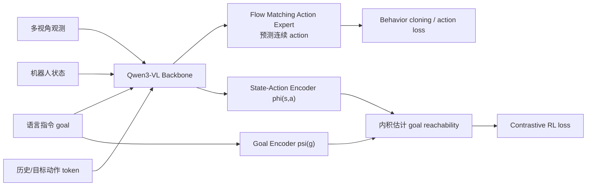

# PRTS: Incorporate Reinforcement Learning Native Goal Reachability into VLA Pre-training

> Introduction to this article: **PRTS: A Primitive Reasoning and Tasking System via Contrastive Representations**. This work was conducted by teams from China Telecom Artificial Intelligence Research Institute (TeleAI), Tsinghua University, Shanghai Jiao Tong University, and Fudan University. PRTS is a native reinforcement learning-based VLA foundation model. The core idea is not to add reinforcement learning after behavior cloning, but to integrate reward-label-free contrastive reinforcement learning into the VLA pre-training process itself.

## 1. Why PRTS Matters

There are two reasons why PRTS is worth including in this tutorial.

First, it raises a clear issue in its approach: **Most VLAs only learn “what an expert does under this state”, but do not explicitly learn “how far the current state and action are from the language goal”.** This leads to models being prone to mimicking only local actions during long-term tasks, disturbance recovery, changing initial poses, or changing language expressions, without a sense of task progress.

Second, there are clear public results on the benchmark. The official GitHub News states: `PRTS-Droid` ranks 3rd on the MolmoSpaces Leaderboard, with a success rate of `42.4%`, surpassing models such as NVIDIA DreamZero, MolmoAct2, and π0.5. The search results for the MolmoSpaces `/ms` list also show the `PRTS-Droid, TeleAI` Combined entry, the TOP3 ranking field, and the 5B parameter scope.

One-sentence summary:

> The key to PRTS is not “using a larger VLA backbone,” but instead treating the language goal as a goal, constructing a trajectory temporal structure for contrast RL supervision, so that the same Qwen3-VL backbone can learn both action generation and goal-reachability awareness.

PRTS changes the VLA pre-training objective: the model learns not only to imitate expert actions, but also to estimate how states and actions relate to a language goal. This creates a direct comparison with behavior-cloning-only policies and provides a shared framework for analyzing long-horizon control, disturbance recovery, and goal progress.

## 2. Papers, Projects, Code, and Weights

| Entry | Link | Current Status |
| :--- | :--- | :--- |
| Paper | [arXiv:2604.27472](https://arxiv.org/abs/2604.27472) / [HTML](https://arxiv.org/html/2604.27472v1) | Submitted on 2026-04-30 |
| Project Page | [rhodes-team-prts.github.io](https://rhodes-team-prts.github.io/) | Official project page |
| GitHub | [TeleHuman/PRTS](https://github.com/TeleHuman/PRTS) | Official implementation; the minimal SFT post-training code, LIBERO evaluation, and CRL value visualization scripts are open-sourced |
| Pre-trained Weights | [TeleEmbodied/PRTS-4B](https://huggingface.co/TeleEmbodied/PRTS-4B) | Publicly available; the HF model card states that it is based on Qwen3-VL-4B, with approximately 167B tokens pre-trained |
| LIBERO Checkpoint | [TeleEmbodied/PRTS-4B-LIBERO](https://huggingface.co/TeleEmbodied/PRTS-4B-LIBERO) | The official README refers to the LIBERO number as corresponding to the checkpoint |
| MolmoSpaces Leaderboard | [MolmoSpaces Leaderboard](https://molmospaces.allen.ai/leaderboard/ms) | `PRTS-Droid, TeleAI` ranked in TOP3; the official README records 42.4% SR |

The open-source boundaries should be clearly written. The current release plan in the GitHub README shows:

- The PRTS arXiv preprint is now available.
- The PRTS-4B pre-trained checkpoint is now available.
- Examples of the Standard LIBERO LeRobot-v2.1 dataset are now available.
- The minimal SFT post-training code for LIBERO + real-robot platforms is now available.
- The LIBERO evaluation of PRTS is now available.
- The PRTS-4B post-trained checkpoint for LIBERO is now available.
- The CRL value visualization scripts are now available.
- The PRTS-4B post-trained checkpoint for SimplerEnv WidowX is still in planning.

Note also the license: The GitHub README states that the project uses **CC BY-NC 4.0**. The code and weights can be used for academic and non-commercial purposes, but commercial use is not permitted under this license.

## 3. MolmoSpaces Ranking Instructions

MolmoSpaces is an open embodied AI ecosystem and benchmark system launched by Ai2. According to the official introduction, it unifies over 230,000 indoor environments, more than 130,000 object models, and 42 million stable grasping annotations, and supports common simulators such as MuJoCo, Isaac, and ManiSkill. MolmoSpaces-Bench covers static manipulation, mobile manipulation, navigation, and multi-room long-term tasks, serving to evaluate the generalization ability of robot policy in large-scale diverse scenarios.

PRTS has attracted attention this time because `PRTS-Droid` has entered the MolmoSpaces policy leaderboard in the global TOP3. It is recommended to distinguish between the two numbers:

| Number | Source | Meaning |
| :--- | :--- | :--- |
| `42.4%` SR | PRTS official GitHub News | The success rate of PRTS-Droid on MolmoSpaces Leaderboard |
| `65.36` | MolmoSpaces `/ms` ranking search results | One of the Combined / score fields displayed on the leaderboard page |

For tutorials, there is no need to state that "PRTS has fully surpassed all VLA". A more accurate statement would be:

> On the public embodied evaluation platform MolmoSpaces, TeleAI's PRTS-Droid ranked in the top 3. This indicates that reward-label-free contrastive RL pretraining is competitive in open-scenario evaluations such as DROID / MolmoSpaces.

## 4. Why behavior cloning alone is insufficient

Traditional VLA training can often be summarized as:

```text
图像 + 语言指令 + 机器人状态
        ↓
预测专家动作
```

This is behavior cloning. It is very effective, but it has a blind spot: the model only knows what the current expert did, and may not know whether **this action brings the task closer to success**.

For example, the instruction is "put the cup in the box". The robot may be in several states at present:

- The gripper just approaches the cup.
- The cup has been captured.
- The cup has moved above the box.
- The cup falls to the edge of the tabletop.
- The cup is placed in the box, but the lid is not closed.

Behavior cloning can mimic these local actions in the training trajectory. However, if a state deviates from the teaching, it may not know whether it is closer or farther from the target. PRTS aims to create a quantifiable sense of task progress within VLA: the matching degree between the current state-action and the language goal approximately represents the probability of reaching the target by continuing from here.

The paper refers to this as **goal-reachability awareness**.

## 5. Main Architecture Diagram: Qwen3-VL + Flow Matching Action Expert + CRL


**Figure 1: PRTS Overview.** On the left are multi-view images, text robot status, language instructions, and action tokens; in the middle is the Qwen3-VL backbone and the flow matching action expert; on the right is the language-conditioning contrastive RL branch, which estimates goal reachability using the inner product of state-action embeddings and goal embeddings.
Source: [TeleHuman/PRTS official GitHub](https://github.com/TeleHuman/PRTS).

This image can be read in four parts.

The first block is **input token stream**. PRTS doesn't just focus on a single image; it includes egocentric view, wrist view, vision tokens, textual robot state, instruction, and action tokens. The textual robot state is an important detail: the robot state is placed into a sequence that can be processed by the language model, allowing the backbone to consider visual, linguistic, state, and action contexts simultaneously.

The second block is **Designed Single-Forward Attention Mask**. The mask in the lower left corner of the figure indicates which tokens can interact with each other. Its purpose is to enable the behavior cloning action prediction and CRL value learning to be completed within a single forward pass, while preventing information that should not be leaked from entering the causal path. For example, the CRL action and CRL goal are not simply interacting with each other, but rather use self-supervised goals to construct a suitable context.

The third part is **Flow Matching Action Expert**. PRTS ultimately needs to output continuous robot actions, so it connects with the flow matching action expert in the Qwen3-VL representation. Using the DiT structure, it predicts denoised actions from noised actions. This approach is consistent with modern continuous action VLA: instead of hard-discretizing complex 6DoF/joint actions into language tokens, a continuous generative model is used to process the actions.

The fourth section is **Language-Conditioned Contrastive RL**. This is the core of PRTS: constructing a state-action encoder `phi(s,a)` and a goal encoder `psi(g)`, such that their inner product approaches `log Q(s,a,g)`, which means "the reachability from the current state-action to the language goal g".

You can understand it with the following simplified diagram:



## 6. How does CRL "train without rewards"?

PRTS's CRL does not rely on manually annotated rewards. Instead, it utilizes the natural temporal structure of the demonstration trajectory.

In a successful trajectory, the state closer to the end is usually closer to the language target. For example, “open the drawer and put an object in it”:

```text
t0: 机器人还没接触抽屉
t1: 夹爪靠近把手
t2: 抽屉打开
t3: 物体放入抽屉
t4: 任务完成
```

PRTS constructs contrast supervision from this trajectory structure: under the same task objective, the state-action that can lead to success should be closer to the goal embedding; the goals that do not match or the error stages should be farther away. The paper uses geometric temporal weighting so that different time steps have varying contributions to the supervision strength.

This is what it means by "reward-label-free":

| Ordinary RL | PRTS CRL |
| :--- | :--- |
| Requires environmental reward or manual success labels | Construct target accessibility supervision from offline trajectory sequences |
| Usually trains an additional value / Q network | The value head is trained together with the VLA backbone |
| Much more expensive than BC | Officially claims to have nearly the same compute as BC |
| Common after post-training | PRTS is used in pre-training |

Note that this does not mean that PRTS does not need robot data. It still requires a large amount of action annotations and embodied reasoning data. The "no reward" refers to the absence of additional manual reward labels, not the lack of data or unsupervised training.

## 7. Value Visualization: Is the Model Really Tracking Task Progress?


**Figure 2: Visualization of the CRL value in PRTS.** The green curve corresponds to correct commands, while the red curve corresponds to incorrect commands. As the task progresses, the goal-reachability value for correct commands increases overall, whereas that for incorrect commands remains low.
Source: [ TeleHuman/PRTS official GitHub](https://github.com/TeleHuman/PRTS).

This diagram is very suitable for explaining the differences between PRTS and ordinary VLA.

Two language goals are given on the left:

- Correct instruction: Put both shoes in the shoe box, and close the right gripper on the shoe box.
- Incorrect instruction: Put soy sauce and the green cup in the shoe box, and close the right gripper on the shoe box.

The trajectory keyframes on the right side show the actual task progress: the first shoe is picked up, the first shoe is placed inside, the second shoe is placed inside, the box lid is closed, and the box is almost fully closed. The green value curve gradually rises near these key stages and finally reaches a higher score; the red curve remains lower at all times.

This indicates that the PRTS value is not merely about checking if the image resembles the training data, but also determining whether the task is closer to completion under language target conditions. For robot control, this capability is very important: once the action deviates from the teaching, the model needs to know whether the current state can still lead to the goal, rather than simply mechanically repeating the next step.

## 8. Task generalization: Why long-horizon and novel instructions benefit more


**Figure 3: Example of real task generalization in PRTS.** The figure shows two-armed tasks such as Paper Rubbish, Place Block, Pick Shoes, and Stack Cups. In the left-side text, the crossed out items represent training/original instructions, while the bolded items represent new objects or targets used during testing.
Source: [ TeleHuman/PRTS official GitHub](https://github.com/TeleHuman/PRTS).

This diagram shows not just simple grasping, but the task execution after changes in commands and objects. The advantages of PRTS should be understood from two perspectives.

First is **change in language goal**. For example, in the original task, it might be catching paper balls, but during testing, a wireless mouse is used instead; or it might be putting blocks together, but during testing, a soy sauce bottle is used. Pure behavior cloning easily binds the common objects and action templates learned during training, while CRL aligns state-action with language goals, which helps maintain the task sense under new instructions.

The second is **long-term phase changes**. Tasks like Stack Cups and Pick Shoes are not completed in a single grasping step, but involve multiple sequential phases. The robot needs to know “which step has been completed, and whether the next step is still moving toward the goal.” The goal-reachability representation is precisely designed to address this limitation.

The paper also emphasizes that PRTS benefits more significantly in long-horizon, contact-rich, zero-shot novel-instruction settings. This is consistent with the method design: the longer and more disturbed tasks require the model to understand task progress, rather than just mimicking local actions.

## 9. Real Hardware Platforms


**Figure 4: PRTS real robot testing hardware.** On the left is the RealMan dual-arm system, and on the right is the Flexiv Rizon 4s single-arm system. The figure indicates the head camera, wrist camera, gripper, and default perspective.
Source: [ TeleHuman/PRTS official GitHub](https://github.com/TeleHuman/PRTS).

PRTS not only conducts simulation benchmarks, but also performs real robot evaluations. The paper mentions two types of real platforms:

| Platform | Form | Task Characteristics |
| :--- | :--- | :--- |
| RealMan Dual-Arm | Two arms, head camera, two wrists cameras, two grippers | Multi-task mixed training to evaluate long-term performance and multi-task interference |
| Flexiv System | 7DoF single arm, main camera, wrist camera, Robotiq gripper | Fine-grained, high-contact tasks to assess spatial grounding and error accumulation |

The real tasks included in the paper report include Office Long Term, Stack Cups, Flip Tennis Tube, Gear Assembly, Block Combination, and Flower Arrangement. It should be noted that these are real experiments, but they are not public hardware benchmarks that can be reproduction by anyone with a single click. In tutorials, they are better used as evidence of the method’s effectiveness, rather than guarantees that the same results will be achieved on local machines.

## 10. Pre-training efficiency and post-training cost


**Figure 5: PRTS pre-training efficiency diagram.** The official figure emphasizes that PRTS achieves goal-reachability by integrating CRL targets into a single forward pass, at a computational cost close to that of BC.
Source: [ TeleHuman/PRTS official GitHub](https://github.com/TeleHuman/PRTS).

An important selling point of PRTS is that it does not use a heavy online or offline RL pipeline to remedy VLA, but instead shapes the representation with additional contrast targets during pre-training. The advantage of this approach is:

- During the training phase, offline trajectory data can be utilized, avoiding online trial and error in a real environment.
- No manual reward labels are required.
- There is no need to train an entirely separate value model additionally.
- During the post-training phase, ordinary flow matching / SFT action experts can still be used.

A key piece of information provided in the paper on LIBERO is that PRTS achieves an average SR of 98.4 on the standard four-set LIBERO, which is close to or matches the best prior results. It is also more stable compared to ABot-M0 under the same post-training budget. Especially in the Long suite, the value of goal-reachability-aware representation is more evident.

## 11. What does MolmoSpaces actually illustrate?

MolmoSpaces TOP3 is a result worth mentioning in the news, but it demonstrates a rather specific phenomenon:

On the larger-scale, multi-scenario robot policy list with zero-shot generalization, such as MolmoSpaces, PRTS-Droid's checkpoint is highly competitive.

It cannot be directly output:

- PRTS has surpassed all models in all real robot tasks.
- Each checkpoint of PRTS cannot be directly applied to any robot.
- Contrastive RL pretraining has replaced both behavior cloning and post-training methods.

A more accurate judgment is: MolmoSpaces ranking emphasizes the core argument of PRTS papers, that is, **adding target accessibility awareness to VLA pre-training can indeed improve open scenarios and long-term generalization capabilities**.

## 12. How to reproduce now

The most realistic way to reproduction currently is not pre-training PRTS from scratch, as the official HF model card indicates that pre-training used approximately 167B tokens and 64 H100 GPUs. For tutorial learning, it is recommended to proceed in three stages.

### 12.1 Load only the checkpoint

HF model card provides the minimum loading method:

```bash
pip install "transformers==4.57.3" torch safetensors huggingface_hub \
    numpy pillow sentencepiece protobuf colorama tokenizers
pip install accelerate
```

```python
import torch
from transformers import AutoConfig, AutoModel, AutoProcessor

repo_id = "TeleEmbodied/PRTS-4B"

config = AutoConfig.from_pretrained(repo_id, trust_remote_code=True)
model = AutoModel.from_pretrained(
    repo_id,
    trust_remote_code=True,
    torch_dtype=torch.bfloat16,
    device_map="auto",
)
processor = AutoProcessor.from_pretrained(repo_id, trust_remote_code=True)
```

This smoke test can only indicate that:

- HF weights can be downloaded.
- Custom code can be loaded by `transformers`.
- The model structure and processor can be initialized.

It cannot explain:

- The robot action output can now control real hardware.
- MolmoSpaces ranking can be reproduction locally.
- CRL value visualization and LIBERO evaluation have been successfully implemented.

### 12.2 Example of Running LIBERO / LeRobot

If you want to reproduce further, it is recommended to start with the official LIBERO checkpoint and LeRobot-format data. The official GitHub provides directories such as `configs`, `examples`, `scripts`, and `prts`, and has released minimal SFT post-training code.

Learning order suggestions:

1. Clone the repository.
2. Install `requirements.txt`.
3. Download `TeleEmbodied/PRTS-4B-LIBERO`.
4. Use the official LIBERO LeRobot-v2.1 data.
5. Run the evaluation first, and then consider changing the post-training configuration.

Do not modify the data of your robotic arm from the beginning. The input of PRTS includes various tokens such as visual information, text status, instructions, action tokens, CRL actions/goals, etc. If the action layout and mask are incorrect, the model may run but the results will be invalid.

### 12.3 Reproduction of MolmoSpaces Ranking

MolmoSpaces reproduction requires more conditions:

- DROID corresponds to the checkpoint or fine-tuning launcher.
- MolmoSpaces benchmark environment.
- Specified tasks, scenarios, cameras, robot initial states, and evaluation protocol.
- Compatible with policy wrapper and MolmoSpaces evaluation harness.

The official GitHub News states that the MolmoSpaces checkpoint was trained with the latest DROID fine-tuning launcher. A complete leaderboard run requires substantial compute and engineering dependencies, so this chapter first uses the leaderboard to verify the public result and then studies the method through the released LIBERO training and evaluation entry points. Readers with the required resources can extend the same workflow to a full MolmoSpaces evaluation.

## 13. Relationship with Other VLAs

| Method | Main Focus | Difference from PRTS |
| :--- | :--- | :--- |
| OpenVLA / OpenVLA-OFT | Open-source VLA foundation and fine-tuning pipeline | PRTS emphasizes goal reachability in CRL pre-training |
| π0 / π0.5 | Strong VLA policy baseline | π0.5 is used as a comparison object in PRTS papers and MolmoSpaces |
| 3DVLA | Injecting VLA with 3D space and instance tokens | PRTS is not a geometric module, but learning of goal reachability representations |
| PhysBrain | Extracting physical common sense from human videos and adapting it to VLA | PRTS constructs CRL goal-reachability supervision from offline trajectory sequences |
| RAW-Dream | Reinforcing VLA within a task-agnostic world model | PRTS does not use world-model rollout RL; it redesigns the VLA pretraining objective. |
| WALL-OSS | Open-source VLA model and engineering framework | PRTS highlights reward-free contrastive RL into pre-training |

If categorized by "Why VLA failed":

- 3DVLA believes failures often stem from insufficient understanding of 3D space and instances.
- PhysBrain believes failures often stem from a lack of physical common sense.
- PRTS believes failures often stem from insufficient task progress and goal accessibility.

These three articles can be placed in the same Task04 for comparison, making them ideal for team-based learning.

## 14. Limitations and Areas That Require Caution

First, MolmoSpaces TOP3 is a strong ranking result, but the rankings are updated. The tutorial describes the status retrieved as of 2026-07-18, and the rankings may change later.

Second, PRTS is not a cost-free RL. It does not require manual reward labels, but it still requires a large amount of offline trajectory, action annotations, and embodied reasoning data. The HF model uses approximately 167B tokens in pre-training scale, with 64 H100 models.

Third, commercial use is restricted. The current project license is CC BY-NC 4.0, and it cannot be used for commercial products by default.

Fourth, reproducing the full MolmoSpaces ranking is not a lightweight task. It requires the MolmoSpaces environment, DROID checkpoint, a testing harness, and high computational power.

 fifthly, goal-reachability is not a universal reward. It helps the model assess task progress, but in extreme contact, flexible objects, sensor noise, actuator errors, and unseen hardware, post-training, controller adaptation, and safety constraints are still required.

## 15. Recommended Tasks

In team learning, you can place PRTS in the manipulation control direction Task04:

> Comparison of 3DVLA, PhysBrain, and PRTS: All three enhance VLA from three perspectives—3D space, physical common sense, and target accessibility. What are their inputs, training signals, output actions, and open-source boundaries?

Recommended delivery:

- Explain why PRTS is called reward-label-free contrastive RL.
- Draw the relationship between `phi(s,a)`, `psi(g)`, and the action expert.
- Describe what MolmoSpaces TOP3 has proven, and what it has not proven.
- Indicate up to which stage the current PRTS-4B, PRTS-4B-LIBERO, and GitHub code can be reproduced.
- Compare PRTS with π0.5: π0.5 is the baseline, not the PRTS foundation.

## 16. Citations and Image Sources

The images in this article are from [ TeleHuman/PRTS official GitHub ](https://github.com/TeleHuman/PRTS). To ensure stable access for the tutorial, they have been saved locally `assets/`. The content of the paper refers to [ arXiv:2604.27472](https://arxiv.org/abs/2604.27472), [ PRTS-4B Hugging Face model card ](https://huggingface.co/TeleEmbodied/PRTS-4B), [ MolmoSpaces Leaderboard ](https://molmospaces.allen.ai/leaderboard/ms), [ MolmoSpaces paper ](https://arxiv.org/abs/2602.11337) and [ Introduction to Ai2 MolmoSpaces ](https://allenai.org/blog/molmospaces).
