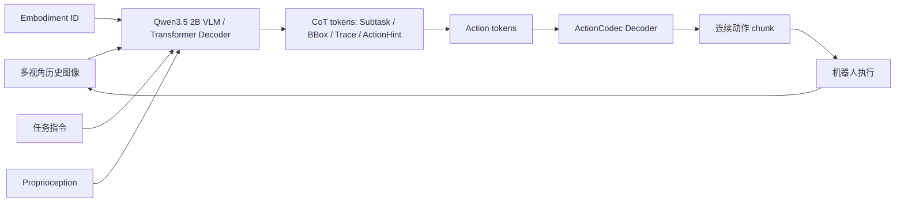

<!-- Generated by the offline translation workflow.
Source: 06-策略抓取或抓取VLA/大模型控制、VLA、VLM/12-Galaxea-G0.5自回归VLA导读/README.md
Source SHA-256: fbf7071e88dae9f4860844d37f5a88917bda919db02e51f2c7df8f78fae8f09c
Model: tencent/Hy-MT2-1.8B-GGUF:Q4_K_M
Review machine-translated technical claims before relying on them.
-->
# Galaxea G0.5: Unified memory, CoT, and action tokens into an autoregressive VLA stream

> Introduction to this article: **Galaxea G0.5 Technical Report**. G0.5 is an autoregressive Vision-Language-Action model released by Galaxea in June 2026. Its core approach is not to treat the VLM as a visual language encoder followed by a separate action head, but instead to let the same transformer decoder directly generate reasoning tokens and action tokens, placing “what is seen, the current sub-task, the goal location, and which set of action tokens to output” within the same next-token prediction chain.

## 1. Let's start with the conclusion: Why memory + CoT + action representation can lead to success

If we were to summarize G0.5 in one sentence, it would be:

> G0.5 combines the multi-perspective visual memory from the past few seconds, optional structured Chain-of-Thought, and cross-ontology action tokenization into a single autoregressive sequence, enabling VLA to move beyond “viewing the current frame -> autoregressing actions” to “reading historical observations -> generating intermediate reasoning -> writing action tokens -> decoding into action chunks”.

It is indeed a noteworthy path in the current VLA. The public results provided by the official README and model cards include: DROID zero-shot `82.5%`, Bridge-SimplerEnv `87.3%`, RoboTwin 2.0 `93.3%`, LIBERO `98.9%`, BEHAVIOR-1K task success score `0.3136`, and the average success rate after fine-tuning of R1-Lite / R1-Pro real robots `76.7%`.

But this "SOTA" needs to be understood calmly. The strength of G0.5 is not a single trick, but a combination of three factors:

1. **Autoregressive unified interface**: The reasoning text and action tokens are all generated by the same decoder, rather than an external planner generating reasoning and another action head generating actions.
2. **ActionCodec action representation**: Different robot actions are mapped to a shared 27-dimensional action space, and then discretized into tokens using a residual vector quantizer, enabling the autoregressive VLA to actually output actions in the token space.
3. **Visual memory and structured CoT**: A 5-second window of 6 historical images is used, and `Subtask`, `BBox`, `Trace`, and `ActionHint` among other structured intermediate tokens are allowed to be generated, allowing the subsequent action tokens to directly attend to these intermediate results.

So it is suitable to be placed in the `06-策略抓取或抓取VLA/大模型控制、VLA、VLM` section of this tutorial, after PRTS. G0.5 is neither a world model nor a navigation planning framework, but an important engineering advancement in the VLA structure and action representation.

## 2. Papers, Projects, Code, and Weights

| Entry | Link | Current Status |
| :--- | :--- | :--- |
| Technical Report | [Galaxea G0.5 Technical Report](https://opengalaxea.github.io/G05/Galaxea_G0_5.pdf) | Technical report for 2026 |
| Project Page | [opengalaxea.github.io/G05](https://opengalaxea.github.io/G05/) | Official project page, including images, videos, and benchmark demonstrations |
| GitHub | [OpenGalaxea/GalaxeaVLA](https://github.com/OpenGalaxea/GalaxeaVLA) | Official open-source repository, containing training, evaluation, and deployment interfaces |
| Model Weights | [OpenGalaxea/G05](https://huggingface.co/OpenGalaxea/G05) | Hugging Face gated model, requires login and condition agreement |
| Dataset | [OpenGalaxea/Galaxea-Open-World-Dataset](https://huggingface.co/datasets/OpenGalaxea/Galaxea-Open-World-Dataset) | Official open-world robot dataset |
| Old G0-VLA | [OpenGalaxea/G0-VLA](https://huggingface.co/OpenGalaxea/G0-VLA) | Historical weights for G0 / G0Plus |

The open-source boundaries should be specified explicitly. The GitHub README states that content related to G0.5 will follow the **G0.5 Community License Agreement** starting from 2026-06-16. Non-commercial use is permitted, including academic research, personal use, education, and testing; commercial deployment, providing services to third parties, or productization require separate commercial authorization. The HF model card also indicates that although the model repository is publicly accessible, downloading files requires agreeing to access conditions.

## 3. Input and Output: What Does It Eat and Spit Out?

The input for G0.5 can be written as:

```text
过去 5 秒内采样的 6 帧多视角 RGB 图像
    + Embodiment ID / embodiment text
    + 自然语言任务指令
    + Proprioception / robot state
```

Output can be written as:

```text
可选 CoT reasoning tokens
    + 必需 action token sequence
    -> ActionCodec decoder
    -> 连续机器人控制动作 chunk
```

A typical generated fragment looks like:

```text
Subtask: grasp the towel
BBox: {"towel": [[x1, y1], [x2, y2]]}
Trace: Left <loc0543><loc0436>; Right None
ActionHint: close the left gripper while moving forward
Action:
<left_control_0><action0689><action1450>...
<right_control_0><action2144><action5012>...
<left_gripper><action0000><action1002>...
```

The most important thing here is not whether the model outputs something that looks like reasoning, but **that reasoning tokens and action tokens are generated continuously within the same assistant span**. This means that in the context of the action token generation, `Subtask`, `BBox`, `Trace`, and `ActionHint` can be directly seen earlier. If CoT is an external module or offline annotation, the action head can only indirectly utilize it; the design of G0.5 is to allow the action token itself to continue generating along this token stream.

## 4. Overview Diagram: G0.5 Converts Robot Control into a Token Stream


**Figure 1: Example of the unified action flow for G0.5.** On the left are sensor images and natural language tasks; on the right, the assistant first generates `Subtask` and `BBox`, and then continues to generate action tokens. It can be seen that the action chunks are executed in 16 steps each. During execution, the model continues to close the loop and replan after new observations occur.
Source: [ G0.5 official project page ](https://opengalaxea.github.io/G05/).

This figure can directly answer the core question of "Is memory + CoT + action representation SOTA?":

First, G0.5 explicitly describes robot control as a **chat-like sequence**. System messages include embodiment, control frequency, and action space; user messages contain task instructions; the sensor area provides visual observations; and the assistant output includes both thinking fields and action fields.

Second, the actions are not natural language sentences, but structured action tokens. For example, `<left_control_0><action0012><action1254>...` represents an action token for a certain residual quantization round of the left arm; `<left_gripper>` is followed by a gripper token. Multiple sets of action tokens are combined, and then decoded by ActionCodec into continuous control commands.

Thirdly, the execution is a chunked closed-loop. In the diagram, the first action segment has been executed `16/16 steps`, and the second segment is currently in progress `4/16 steps`. This indicates that G0.5 does not predict the entire trajectory at once, but generates subsequent action chunks based on new observations each time.

## 5. ActionCodec: Why Action Representation is Key


**Figure 2: ActionCodec tokenizer for G0.5.** Different robots have different degrees of freedom and motion layouts. G0.5 first maps the active moving parts to a shared action space, then uses a residual vector quantizer to generate discrete action tokens, and finally the action decoder reconstructs the continuous motion of the corresponding components.
Source: [OpenGalaxea/GalaxeaVLA official repository ](https://github.com/OpenGalaxea/GalaxeaVLA).

There are two common ways to act with VLA:

| Path | Advantages | Issues |
| :--- | :--- | :--- |
| Autoregressive for continuous actions / diffusion / flow matching | Suitable for high-dimensional continuous control, with smooth actions | Not naturally compatible with LLM token generation interfaces |
| Discrete action tokens | Can share the autoregressive interface with language tokens | If tokenization is poor, it will reduce control precision and cross-robot generalization |

G0.5 Choose the second route and use ActionCodec to mitigate the discretization issue.

The official README states that G0.5 maps the actions of heterogeneous robots to a shared 27-dimensional action space:

```text
left_control(9)
left_gripper(1)
right_control(9)
right_gripper(1)
lower_body(7)
```

The key to this design is **grouping components by part**. Bilateral robots, single-arm robots, mobile chassis, and humanoid robots do not have the same number of degrees of freedom. G0.5 does not force all robots to produce a full 27-dimensional motion; instead, it only generates active motion groups. The `Activated Parts` on the left side of the figure indicates which components are required for the current robot and action, while the tokenization output on the right side generates tokens only for these components. Idle or non-existent degrees of freedom do not require the generation of meaningless tokens.

The function of the Residual Vector Quantizer can be understood as multi-round fine-tuning:

```text
连续动作 chunk
    -> action encoder
    -> 第 0 轮 VQ code 给出粗动作
    -> 第 1 轮 VQ code 修残差
    -> ...
    -> action token 序列
    -> action decoder 重构连续控制
```

The advantage of this approach is that action tokens can be generated by a LLM-style decoder, without relying on a single rough discrete code to represent complex actions. For robots, this is more reasonable than simply binning each joint angle, as real actions often involve component relevance and temporal continuity.

## 6. Token Template: CoT is not free-form, but a structured interface


**Figure 3: Token sequence template for G0.5.** The conditioning segment contains images, embodiments, tasks, and states; the generative segment is generated by the assistant. The CoT span can include `Subtask`, `BBox`, `Trace`, and `ActionHint`, followed by the generation of `Action: <action_codes>`.
Source: [OpenGalaxea/GalaxeaVLA official repository ](https://github.com/OpenGalaxea/GalaxeaVLA).

This figure is important because it explains that the CoT of G0.5 is not just letting the model "think". It defines CoT as an intermediate variable available for robot control:

| Field | Meaning | Helps with the action |
| :--- | :--- | :--- |
| `Subtask` | Current atomic sub-task | Breaks long tasks into short stages, such as first grasping a towel, then moving it to the pool |
| `BBox` | Key target box | Maps language targets to image positions to reduce the probability of grabbing the wrong object |
| `Trace` | 2D gripper landing trace | Provides the gripper landing point and rough trajectory to help align action tokens with the target |
| `ActionHint` | Frame-level action prompt | Uses phrases to constrain action trends, such as approaching, closing the gripper, and moving above the container |

These fields are optional. The diagram also indicates that the CoT span can sample any subset, or even no-CoT. In other words, G0.5 does not require a complete explanation for every step; it may generate intermediate reasoning depending on the complexity of the task.

From the perspective of training objectives, the conditioning segment is input from the user side and does not compute loss; the reasoning tokens and action tokens on the assistant side are trained using cross-entropy. This is what makes G0.5 "LLM-like": actions are also included in next-token prediction, rather than training a separate action regression model outside of the language model.

## 7. Visual Memory: Why 6 Frames in the Last 5 Seconds

Many VLA failures are not due to unclear single frames, but because the system doesn't know what happened just now in a single frame. For example:

- The towel has been touched by the gripper, but in the current frame, it still appears near the tabletop.
- The drawer was just opened, and the target object only appeared in the first few frames.
- The robotic arm blocks the view of the target, so only the gripper and background are visible in the current frame.
- In a long task, the current step depends on whether the previous step was completed.

G0.5 uses a multi-second visual history. It sends the 6 frames of multi-view RGB images from the past 5 seconds to the visual encoder and injects historical information using factorized spatial-temporal attention. The official README also mentions that stochastic history-frame dropout is used during pre-training to reduce the risk of the model memorizing a fixed combination of historical frames; the historical tokens are discarded in the last layer to control inference latency.

This can be understood as a **short-term visual working memory**. It does not store minute-level experiences like database queries, nor is it a world model rollout; rather, it provides the action generator with the visual context of the recent seconds, allowing the model to know “which stage of the task process the current action is in”.

## 8. Multi-ontology data: Why we need Embodiment ID


**Figure 4: G0.5 involves multiple robotic arms.** The project page shows various types of robots, including two-armed mobile robots, single-armed robotic arms, and humanoid platforms. Different bodies have different motion spaces, so embodiment conditions and unified action encoding are necessary.
Source: [G0.5 official project page ](https://opengalaxea.github.io/G05/).

G0.5 pre-training was conducted on robot demonstrations from 14 embodiments, while mixing large-scale web and embodied VQA data. There is a key design detail: **the embodiment id is not an auxiliary label, but part of the input sequence**. The model needs to know whether it is controlling R1 Lite, R1 Pro, SO-100/101, DROID/Franka, or another robot form.

This is related to ActionCodec:

```text
同一句指令：pick up the towel
    + R1 Lite embodiment -> 双臂 + 底盘布局
    + SO-101 embodiment  -> 低成本单臂布局
    + DROID embodiment   -> Franka / DROID 控制布局
    -> 生成不同 active action groups
```

If the embodiment condition is not met, the unified action token will become a ambiguous interface. The same `<left_control_0>` may have no meaning for different robots, or it may correspond to completely different physical actuators.

## 9. Data distribution: What it learns are manipulation terms in an open world


**Figure 5: Data actions and object distributions displayed on the G0.5 project page.** The upper part shows high-frequency action words, while the lower part shows high-frequency object words. You can see operation words such as `pick`, `place`, `move`, `put`, and `take`, as well as common objects like towel, spoon, cloth, bowl, water, and cup.
Source: [G0.5 official project page ](https://opengalaxea.github.io/G05/).

The G0.5 task is not just overfitting on a single tabletop benchmark. It emphasizes open-world manipulation, so the dataset covers a wide range of home, kitchen, retail, and office scenarios, as well as numerous everyday objects and actions. The official dataset description states that the Galaxea Open-World Dataset contains 500+ hours of real movement manipulation data and provides data in RLDS and LeRobot formats.

This explains why G0.5 is competitive in tasks like “Pick up Anything & Place Anywhere”: the model has not only seen a few fixed types of blocks/cups, but has also been exposed to many everyday manipulation languages and object visual appearances during pre-training.

However, it is also important to note that data diversity does not guarantee success for every task. The generalization of VLA is still limited by camera perspective, motion interfaces, gripper capabilities, object material, contact dynamics, task safety constraints, and the quality of post-training data.

## 10. Training objective: Use the same CE objective for VQA and action

The pre-training of G0.5 is not a pure robot trajectory training. The official README states that it is initialized from Qwen3.5 2B VLM, and trained on robot demonstrations in 14 embodiment types, large-scale web data, and embodied VQA data. Robot action samples and VQA samples use the same cross-entropy objective, with a VQA-to-action mixing ratio of `1:4`.

This choice has two meanings.

First, retain the VLM capabilities. Many VLA models, if trained only on action data, are prone to losing language understanding, visual question answering, and open vocabulary grounding abilities. G0.5 continues to combine VQA, so that the model can still understand tasks, objects, and scenarios.

Second, incorporate the actions into language model-style training. As long as the actions can be discretized into tokens by ActionCodec, the model can use the same CE loss as language to learn action sequences. This is also the core of "VLM-as-Actor": it is not the VLM that provides features, and the action expert takes control; rather, the VLM decoder itself is a action token generator.

You can understand it through the following process:



## 11. DROID zero-shot: What does it prove?


**Figure 6: Results of G0.5 in DROID zero-shot evaluation.** The official project page compares `π0.5-DROID`, `MolmoAct2-DROID`, and `G0.5-DROID`. G0.5 has the highest average success rate in the bar chart.
Source: [G0.5 official project page ](https://opengalaxea.github.io/G05/).

The DROID zero-shot results indicate that under real robot data and task settings such as DROID/Franka, the autoregressive action token sequence with G0.5 has strong zero-shot manipulation capabilities. The number provided in the official README is `82.5%` zero-shot success on DROID.

What it cannot explain is:

- G0.5 enables zero-sample deployment for any robot.
- G0.5 has resolved all long-term household manipulation tasks.
- The Action token is definitely better than flow matching / diffusion action head across all tasks.

A more accurate conclusion is: One key argument supporting the DROID result with G0.5 is that **as long as the action tokenization is good enough, an autoregressive decoder can directly generate actions, rather than only performing language planning or visual encoding**.

## 12. Pick-and-Place Benchmark: Why Post-Large Training Is Effective


**Figure 7: The data scale curve of G0.5 under the "Pick up Anything & Place Anywhere" setting.** The horizontal axis represents the post-training data scale, while the vertical axis shows the language following rate and task success rate. G0.5 shows a significantly higher curve than π0.5 under zero-shot, 1H, 10H, and 50H settings.
Source: [; G0.5 official project page: ](https://opengalaxea.github.io/G05/).

This figure is suitable for connection with actual projects. Many teams do not have thousands of hours of robot data and can only train after using a small amount of task data. The G0.5 curve shows that strong pre-trained models can quickly adapt to tasks after 1H, 10H, and 50H post-training, especially when the language following rate increases significantly.

However, it is also necessary to clearly understand the evaluation definition. The Pick-and-Place Benchmark is an officially defined task that involves multiple objects and containers. The task requires the model to first identify targets based on language, then pick them, and finally place them. It is very valuable, but it does not cover all general real-home tasks. It is more suitable as a local evidence for "language grounding + generalization of picking and placing actions".

## 13. CoT ablation: Why AR + CoT is more suitable for long-term tasks


**Figure 8: G0.5 on CoT and action head probe experiments.** The figure compares them. `FM, no CoT`、`FM, CoT`、`AR, no CoT`、`AR, CoT` Four combinations, with a high process score and language following in the two long-term task scenarios of Air Fryer and Cook Bacon.`AR, CoT` The improvement is most evident.
Source:[G0.5 Official Project Page](https://opengalaxea.github.io/G05/)。

This experiment answers a common question: Will CoT be just a "nice explanation" with no real help for robot control?

The conclusion from the project page is: on a single-phase PP Bench, enabling CoT does not significantly improve the success rate of AR; however, for long-term tasks with five phases such as Air Fryer and Cook Bacon, which have never been seen before, the improvement caused by CoT is evident. The reason is also reasonable: short tasks have few decomposable structures, so there is limited room for CoT to play a role; long tasks require breaking down stages, identifying objects, and planning action sequences first, and structured CoT is more likely to help action tokens follow the task progress.

More importantly, it is the difference between AR and FM. The explanation presented on the G0.5 project page is: AR action tokens and CoT are generated in the same process, and action tokens can directly attend to the preceding CoT; whereas flow-matching experts usually can only condition on the hidden state summary, and using CoT is a more indirect approach. Therefore, under the condition of matched CoT, the AR head benefits more.

## 14. Relationship with G0 / G0Plus

G0.5 is not the earliest Galaxea VLA. It is a new generation model following G0 and G0Plus.

| Version | Main Form | Understanding in the current tutorial |
| :--- | :--- | :--- |
| G0 | dual-system VLA, VLM for multi-modal planning, VLA for fine-grained execution | More like a combination of planner + executor |
| G0Plus / G0Tiny | Larger-scale teleoperation/web data, lighter edge models, G0Plus task checkpoint | Old release line, historical weights remain in HF |
| G0.5 | Unified autoregressive VLA, reasoning tokens and action tokens generated simultaneously | The current most important path to read about |

The official README also clearly states that the current branch focuses on G0.5. The old G0Plus Dockerfiles, Fold Towels/Handover Gift demo guides, and pi0/pi0fast training configs are no longer included in this branch. If you need the old file layout, you need to check the specified historical commits.

## 15. How to reproduce now

It is not recommended to write the tutorial as "reproduce the G0.5 training from scratch". A more realistic approach is to reproduce it in three stages.

### 15.1 Only check code and weight entries

Basic environment requirements provided in the official README:

| Mode | VRAM Requirement | Example GPU |
| :--- | :--- | :--- |
| Inference | `> 8 GB` | RTX 3090 / RTX 4090 |
| Full fine-tuning | `> 70 GB` | A100 80GB / H20 96GB |

The official testing environment includes Linux, Python `>=3.10.16,<3.11`, CUDA 12.8, PyTorch 2.7.1 cu128 wheels, `flash-attn-4`, `flash-linear-attention`, and `ffmpeg`.

Minimum installation path:

```bash
git clone https://github.com/OpenGalaxea/GalaxeaVLA
cd GalaxeaVLA
uv sync --index-strategy unsafe-best-match
source .venv/bin/activate
```

Download HF model:

```bash
huggingface-cli download OpenGalaxea/G05 \
    --repo-type model \
    --local-dir checkpoints
```

Note: The HF repository requires login and consent for access conditions. The complete checkpoint layout is quite large; the official README states that a RoboTwin checkpoint contains approximately 55GB of data. A single G0.5 model checkpoint is about 11GB, and sharing `action_tokenizer.pt` amounts to approximately 484MB.

### 15.2 Run the official lightweight validation

The official README suggests running a lightweight check before expensive tasks:

```bash
python tools/resolve_config.py r1pro --key model.model_arch
python tools/resolve_config.py r1pro --key data.embodiment_datasets.galaxea_r1pro.dataset_groups
python -c "import torch, g05; print(torch.__version__); print(g05.__file__)"
```

This smoke test can only indicate that:

- The code environment can be imported.
- The configuration system can parse it.
- The PyTorch and `g05` package paths are visible.

It cannot explain:

- The model weights have been fully downloaded.
- The real robot can execute safely.
- The LIBERO / RoboTwin / DROID benchmarks have been reproduced.

### 15.3 Select an official entry to continue

If it is just for learning, the priorities can be arranged like this:

| Goal | Official Entry | Difficulty |
| :--- | :--- | :--- |
| View model and configuration | `tools/resolve_config.py` | Low |
| LIBERO evaluation | `experiments/libero` / `scripts/run/eval_libero.sh` | Medium, requires LIBERO simulator |
| RoboTwin 2.0 evaluation | `experiments/robotwin` | Medium-High, requires RoboTwin dependencies and assets |
| SO-100/101 deployment | `experiments/so100` | Medium-High, requires real hardware |
| R1 Lite / R1 Pro deployment | `experiments/r1lite` / `experiments/r1pro` | High, requires Galaxea hardware and ROS2 |
| DROID / Franka deployment | `experiments/droid` + `OpenGalaxea/droid-franka-client` | High, requires Franka/DROID control link |

Don't change your robot from the start. The G0.5 action token is linked to the embodiment, parts meta, dataset stats, and ActionCodec tokenizer. When switching robots, the most common mistakes are not in the model forward, but in the action layout, normalization stats, active parts, ROS topics, and safety limits.

## 16. Relationship with other VLAs

| Method | Key Enhancements | Differences from G0.5 |
| :--- | :--- | :--- |
| OpenVLA / OpenVLA-OFT | Open-source VLA foundation and fine-tuning pipeline | G0.5 emphasizes VLM-as-Actor and autoregressive action tokens more heavily |
| π0 / π0.5 | Strong continuous action VLA baseline | G0.5 uses π0.5 as a comparison point for DROID / PP Bench on the project page |
| EventVLA | Visual evidence memory | G0.5’s visual memory refers to short-term multi-frame history, not an event memory library |
| 3DVLA | 3D space and instance understanding | G0.5 focuses on token flow, ActionCodec, and CoT |
| PhysBrain | Physical常识 pre-training | G0.5 emphasizes action representation and multi-ontology control interfaces more |
| PRTS | CRL goal reachability pre-training | G0.5 focuses more on autoregressive interfaces and action tokenization |
| RAW-Dream | World model-based imagined RL | G0.5 is not a world model rollout, but a VLA policy that directly outputs actions |

If classified by "Why VLA failed":

- EventVLA believes the failure stems from the loss of long-term visual evidence.
- 3DVLA believes the failure arises from insufficient understanding of 3D space and instances.
- PhysBrain believes the failure is due to a lack of physical common sense.
- PRTS believes the failure results from insufficient target accessibility and task progress awareness.
- G0.5 believes the failure also stems from fragmented interfaces: reasoning, action representation, and cross-ontology control are not integrated into a single trainable, generative, and deployable token stream.

## 17. Limitations and Areas Needing Careful Consideration

First, although the public weight of G0.5 is available on HF, it requires access conditions and cannot be downloaded anonymously without any restrictions. The G0.5 Community License also restricts commercial use.

Second, ActionCodec addresses the issue of unified action representation, but it does not allow any new robot to be directly integrated. The new embodiment still requires clear definitions of active parts, action dimensions, normalized statistics, control frequency, observation cameras, and safety control links.

Third, CoT is helpful, but it shouldn't be too long. The benefits of CoT in short tasks are limited; in longer tasks, if the grounding is incorrect, the subsequent action tokens may continue along the wrong target.

Fourth, visual memory is short-term history, not long-term task memory. The 6 frames in the last 5 seconds are suitable for supplementing recent state changes, but they cannot replace long-term semantic memory, retrieval-based experience databases, or world model planning.

 fifth, the benchmark results depend on the protocol. DROID, Bridge-SimplerEnv, RoboTwin, LIBERO, BEHAVIOR-1K, robots for real R1 tasks, bodies, data, and evaluation criteria all differ, so one average number cannot be used to summarize the model capabilities.

## 18. Recommended Tasks

In team learning, G0.5 can be placed in the manipulation control direction Task04:

> Compare EventVLA, PRTS, and G0.5: How do each of them address the issues of VLA in terms of visual memory, target accessibility, and unified autoregressive action sequences? What are their inputs, training signals, action outputs, and reproduction boundaries?

The assignment can answer these questions:

- Why is G0.5 referred to as VLM-as-Actor, rather than VLM-as-Encoder?
- How is the 27-dimensional shared action space of ActionCodec organized?
- What intermediate information correspond to `Subtask`, `BBox`, `Trace`, and `ActionHint` respectively?
- Why is AR + CoT more significant in long-term tasks than no-CoT?
- To what stage can the current official code and weights be reproduced, and which require a real robot or high computing power?

## 19. Citations and Image Sources

The images in this article are from the [G0.5 official project page ](https://opengalaxea.github.io/G05/) and [OpenGalaxea/GalaxeaVLA official repository ](https://github.com/OpenGalaxea/GalaxeaVLA). They have been saved locally `assets/` to ensure stable access for the tutorial. The text content is based on [Galaxea G0.5 Technical Report](https://opengalaxea.github.io/G05/Galaxea_G0_5.pdf), [OpenGalaxea/G05 Hugging Face model card ](https://huggingface.co/OpenGalaxea/G05) and [Galaxea Open-World Dataset ](https://huggingface.co/datasets/OpenGalaxea/Galaxea-Open-World-Dataset).
