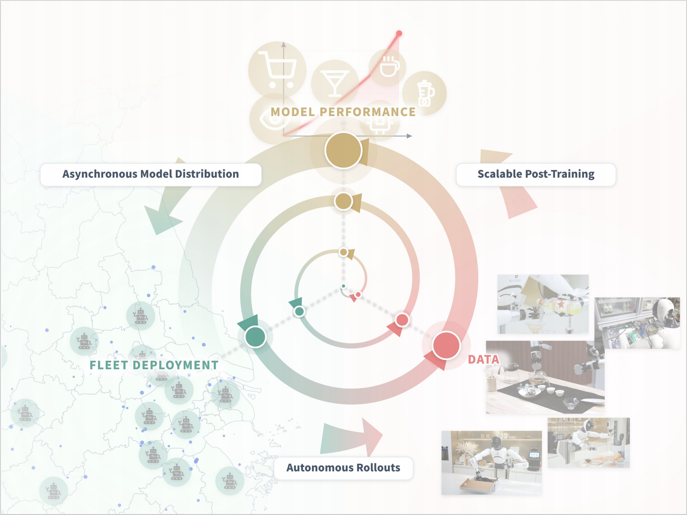
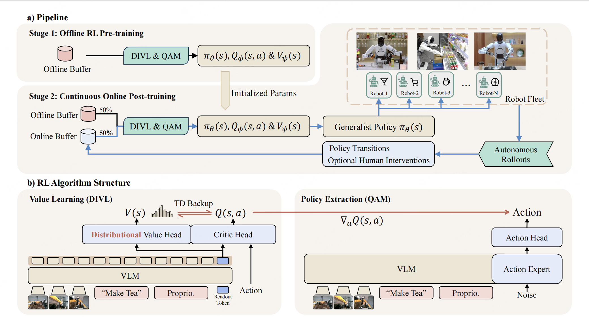
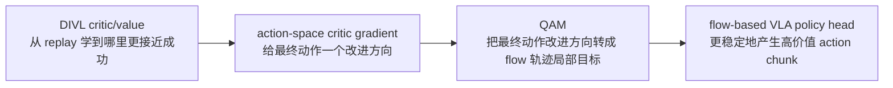
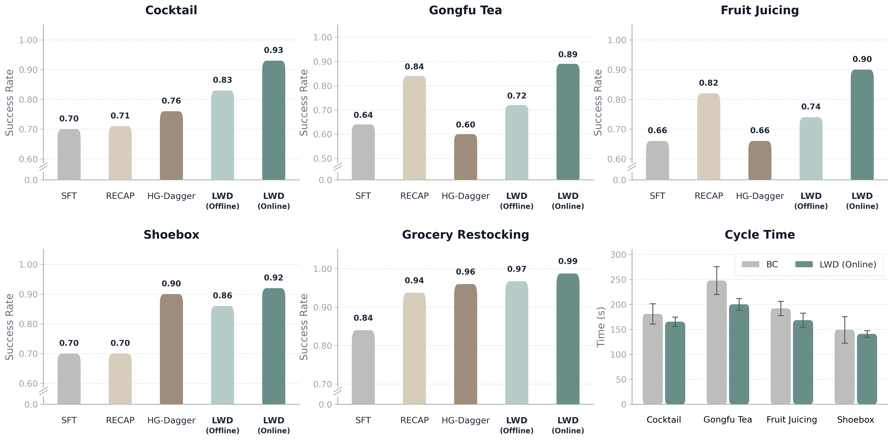

<!-- Generated by the offline translation workflow.
Source: 06-策略抓取或抓取VLA/大模型控制、VLA、VLM/14-LWD真机机群强化学习导读/README.md
Source SHA-256: fb5d354b793f7ced5b5a17c14b24b602578f8d005c9cc89fe8631af5a2533133
Model: tencent/Hy-MT2-1.8B-GGUF:Q4_K_M
Review machine-translated technical claims before relying on them.
-->
# LWD: Reinforcement Learning Introduction to Zhenyuan Robot Real Robot Fleet

> Introduction to this paper **Learning while Deploying: Fleet-Scale Reinforcement Learning for Generalist Robot Policies**. This work is from Shanghai Innovation Institute, AGIBOT Finch, and Columbia University. The arXiv ID is `2605.00416v1`, and the official project page was released on April 30, 2026.

## 1. Let's start with the conclusion: What exactly does LWD do

The full name of LWD is **Learning While Deploying**, which can be directly translated as “learning while deploying”. The problem it aims to solve is straightforward: general VLA relies solely on offline teaching pre-training, making it difficult to cover long-tail objects, user commands, failure states, environmental changes, and mid-course corrections encountered during real deployment. Once the robot is deployed in a real scenario, it continuously generates new experiences; if these experiences are only used for logging and cannot be used to update the shared policy, the most valuable real robot data is wasted.

LWD transformed the deployment process into a closed loop:

```text
离线预训练 VLA
    ↓
部署到多台真实机器人
    ↓
收集成功、失败、恢复、人类干预和历史 rollout
    ↓
用离线到在线 RL 更新同一个共享 VLA
    ↓
重新部署更强的策略
```

It is neither a single-task RL algorithm, nor does it involve “training an expert policy for each task”. The paper emphasizes **fleet-scale offline-to-online RL for generalist VLA policies**: data is collected continuously across 8 real manipulation tasks on 16 AgiBot G1 dual-robotics, allowing a shared general policy to improve as the fleet gains experience. The tasks include grocery replenishment, making oolong tea, mixing cocktails, juicing, and packing shoe boxes, with long-duration tasks typically lasting 3 to 5 minutes.

One-sentence summary:

> The key to LWD is not simply “migrating” the QAM, nor replacing actors with attention heads. Instead, it involves integrating **DIVL value learning + QAM policy extraction + real robot fleet data wheel** into the general VLA deployment and training process.

It should be placed in `06-策略抓取或抓取VLA/大模型控制、VLA、VLM`. The reason is that the training subject of LWD is the VLA policy, and the core issue is how the robot manipulation policy can continuously improve from real robot deployment data. It is neither a world model nor a pure simulation benchmark.

## 2. Papers, Projects, and Reproduction Entries

| Entry | Link | Current Status |
| :--- | :--- | :--- |
| Paper | [arXiv:2605.00416](https://arxiv.org/abs/2605.00416) / [HTML](https://arxiv.org/html/2605.00416v1) | Submitted on 2026-05-01 |
| Project Page | [AGIBOT Finch LWD](https://finch.agibot.com/research/lwd) | Official project page, containing method diagrams, result figures, and real robot task videos |
| PDF | [lwd-paper.pdf](https://finch-static.agibot.com/LWD/lwd-paper.pdf) | PDF version of the paper on the official project page |
| Code | No independent code repository entry displayed on the official project page currently | Suitable for method reading, system analysis, and reproduction design; not recommended for creating a one-click reproduction tutorial |
| Related Prerequisites | [Q-learning with Adjoint Matching](https://arxiv.org/abs/2601.14234) | The flow policy policy extraction method used in LWD |

The open-source boundaries need to be clearly stated: as of the time of this article’s compilation, the official project page provides papers, figures, and videos of the real robot, but no code repository for direct experiment reproduction, model weights, or deployment scripts for the robot side are available. Therefore, this chapter does not provide step-by-step reproduction instructions, but instead explains the principles, system structure, data closed loop, and where to start reproduction after the code is made publicly available.

## 3. Overview Chart: Deployment Is Not the End Point



**Figure 1: LWD deployment data wheel.** The pre-trained VLA is first deployed on real robots, which generate online interaction data across multiple tasks. These data are mixed with offline replay to update the shared policy, and the updated policy is then re-deployed back into the fleet.
Source: [AGIBOT Finch LWD official project page ](https://finch.agibot.com/research/lwd).

The most important aspect of this diagram is changing "deployment" from the testing phase to the training phase. The traditional process usually looks like this:

```text
收集示教 -> 训练模型 -> 部署测试
```

The LWD process becomes:

```text
收集示教 -> 离线 RL 预训练 -> 部署 -> 收集真实经验 -> 在线后训练 -> 再部署
```

The real experience here is not just successful teaching. The paper takes a broader view of the data generated during deployment:

- Successful rollout: The policy completes the task independently.
- Failed rollout: The policy fails, but the failure state is useful for value learning.
- Partial progress: The task is not fully completed, but several intermediate stages have been achieved.
- Recovery: The robot recovers from a deviation state.
- Human intervention: Humans take over or correct at critical moments.
- Play data: Humans intentionally explore failure modes and boundary states.

This is also the difference between LWD and ordinary imitation learning. Behavior cloning can only directly utilize the action label “what the expert did here”; LWD aims to leverage “how good this trajectory ultimately is, how close it is to success, and which failure states should be avoided”. A large amount of failed and semi-successful data in real robot deployment can instead provide learning signals for the critic.

## 4. Method Diagram: DIVL is responsible for evaluation, QAM is responsible for extracting the policy



**Figure 2: LWD training structure.** On the left is a two-stage pipeline: first, RL pre-training is performed on the offline buffer; then continuous post-training is carried out using mixed replay of the offline and online buffers. On the right is the algorithm structure: the VLM-based policy outputs action chunks through the policy head, while the critic and distributional value learn the TD target. The QAM loss converts the critic gradient into a stable update for the flow policy.
Source: [AGIBOT Finch LWD official project page ](https://finch.agibot.com/research/lwd).

This image can be divided into three modules.

The first block is the **data layer**. LWD has a static offline buffer, as well as an continuously growing online buffer. The offline buffer comes from manual demonstrations, historical policy rollouts, and play data; the online buffer comes from robot fleets in deployment. The total amount of offline data counted in the paper appendix is `652.5h`, where expert demonstrations account for `336.6h`, successful rollouts for `88.8h`, failed rollouts for `39.2h`, and play data for `187.9h`. In terms of tasks, long-duration tasks make up a larger proportion, as tasks such as making tea, mixing drinks, juicing, and packing shoeboxes have longer episodes.

The second section is **value learning**. LWD uses Distributional Implicit Value Learning, abbreviated as **DIVL**. A conventional critic might only return a scalar value, but real robot replay is complex: near the same state, there may be successes, failures, takeovers, recoveries, and actions generated by different policy versions. A scalar value would easily average out these results, resulting in high-reward but rare behavior patterns being erased. DIVL instead learns the distribution of replay action-values, and selects a quantile statistic from this distribution as the TD bootstrap target. This retains the in-distribution improvement concept of IQL while being more suitable for heterogeneous replay and sparse rewards.

The third section is **policy extraction**. The LWD policy is a flow-based action generator. It does not simply output an action vector, but generates action chunks through a multi-step generation process. Traditional RL may need to perform reverse propagation on the entire flow/ODE to directly maximize the critic, which is costly and unstable. LWD uses **Q-learning with Adjoint Matching (QAM)**: the gradient of the critic on the final action guides policy updates, but the full-trajectory critic-guided optimization is replaced with a local regression objective on the flow trajectory. This avoids fragile multi-step backpropagation across the entire generation process, and also eliminates the need for tractable action likelihoods.

## 5. QAM is not Query Attention Module, nor is it "removing actor"

This is easily misled by abbreviations. In LWD, QAM is:

```text
Q-learning with Adjoint Matching
```

It is not the `Query Attention Module` commonly found in visual models, nor is it "replacing the actor network with an attention head". A more accurate understanding is:

```text
critic/value 负责判断动作好不好
        ↓
critic 对最终动作给出改进方向
        ↓
QAM 把这个方向变成 flow 生成过程中的局部监督
        ↓
更新 VLA 的 flow-based policy head
```

So, LWD does not completely remove the 'actor' concept. In the actor-critic context, an 'actor' is a policy that outputs actions; in LWD, this policy still exists, but it is not a small MLP actor, rather a flow-based action head behind the VLM/VLA backbone. QAM performs **policy extraction**: it stabilistically "extracts" the value information learned by the critic into the generative policy.

It can be compared with common RL updates:

| Method | Policy Form | Challenges in Update | Handling of LWD |
| :--- | :--- | :--- | :--- |
| SAC / TD3 and other traditional actor-critic | Explicit actor output continuous actions | Direct gradient computation for actions | Not suitable for direct integration into the large VLA flow policy |
| Behavior cloning | Mimicking expert actions | Lacks value information from failures and sparse rewards | Useful for pre-training, but underutilizes deployment data |
| Direct backpropagation of critic to flow policy | Multi-step generative action policy | Requires backpropagation through the entire generation process, costly and unstable | QAM replaced by local adjoint matching |
| LWD | VLM-based policy + flow action head | Needs stable improvement of generative action chunks from the critic | DIVL learns values, QAM extracts policies |

Therefore, if you want to answer the question "Is it about migrating QAM and replacing the actor with an attention head?", you can say:

> Not exactly. LWD does use QAM, but QAM is a critic-guided policy extraction method for flow policy; the actor does not disappear, but is taken over by the flow-based policy head of the general VLA. The attention head may be a module within the VLM/VLA architecture, but it is not the core algorithm replacement point in the LWD paper.

## 6. Why use DIVL: Real robot replay is not a clean teaching set

If all the data is generated through expert teaching, behavior cloning can learn a lot. However, the data distribution after deployment is more complex:

```text
成功轨迹 + 失败轨迹 + 历史策略轨迹 + 人类接管 + 探索失败模式
```

The value of these data lies not in “clean action tags,” but in “rich result information.” For example, in the tea brewing task, the robot may correctly pick up the teapot, but the water pouring angle is off; in the cocktail mixing task, the robot may successfully open the bottle, but it fails to pour the liquid later; in the supermarket restocking task, the robot may identify the correct item, but its placement posture is not up to standard. Behavior cloning makes it difficult to determine from these trajectories which step is a positive progress and which step leads to subsequent failure.

The role of DIVL is to establish value coordinates for these mixed trajectories. It does not require all data to come from the current policy, nor does it require each trajectory to be expert-guided. Instead, it estimates from replay “what reward distribution might be achieved after continuing a certain state-action chunk”. In tasks with sparse rewards over long durations, multi-step TD targets can propagate the success signal at the end point forward, allowing intermediate states to also receive progress information.

This is particularly important for real robots. The cost of trial and error with a real robot is high, and it cannot be sampled infinitely like in a game environment. Meanwhile, the real environment keeps changing. The core engineering judgment in LWD is: since the deployment of a robot will generate a large amount of off-policy experience, the algorithm should be able to process these data, rather than treating them merely as failure logs that need manual cleaning.

## 7. Why use QAM: The action object of VLA is no longer a regular actor

Many new VLAs no longer output single-step deterministic actions, but instead output action chunks, or even generate action sequences in the form of diffusion/flow matching. The advantage is strong expressiveness, allowing modeling of multi-modal action distributions; the downside is that RL updates become more difficult.

For an ordinary actor, after the critic provides `∇a Q(s, a)`, the actor parameters can be directly updated to move the action in the direction of a higher Q. However, the final action of the flow policy is the result of a multi-step generation process:

```text
noise / initial action
    -> flow step 1
    -> flow step 2
    -> ...
    -> final action chunk
```

If the critic gradient is directly reversed from the final action chunk to all flow steps, the training will be both slow and unstable. The idea behind QAM is to transform the improvement direction of the critic in the final action into a target that can be regressed for each local flow step through adjoint matching. In this way, policy update is more similar to supervised regression, rather than direct optimization with high variance and high cost on the entire generated trajectory.

For tutorial readers, QAM can be understood as a bridge:



This bridge enables RL to guide generative action models, without requiring the policy to provide simple action likelihoods, and without having to directly reverse the full ODE / flow process.

## 8. Result Figure: Strong Points in Long-Term Real Robot Tasks



**Figure 3: Success rate and execution time results of LWD.** The official project page shows that LWD can continuously improve the success rate compared to several post-training baselines. The improvement is more significant for long-term tasks, while reducing the average cycle time for some long-term tasks.
Source: [AGIBOT Finch LWD official project page ](https://finch.agibot.com/research/lwd).

The overall conclusion from the paper abstract is: on 16 dual-arm robots and 8 real manipulation tasks, a shared generalist policy improves as the fleet experience accumulates, achieving an average success rate of `95%`. The maximum gain is observed in long-term tasks. The official project page further emphasizes that LWD not only increases success rates but also reduces the average cycle time for long-term tasks, indicating that the policy achieves success not by performing more slowly or conservatively, but by improving efficiency on some tasks simultaneously.

Three boundaries need attention here.

First, the LWD results are primarily **real robot system outcomes**, which is strong, but this also means it is difficult for external learners to reproduce the experiments directly. Reproduction requires multiple dual-armed robots, a deployment scheduling system, an online replay buffer, task reward definitions, a human control interface, and stable safety policies.

Second, the paper uses the AGIBOT self-organizing population and task system, which is not a public simulation benchmark like LIBERO where everyone can run locally. The tutorial can help you learn the methods and system design, but it cannot be equated with "open-source benchmark ranking efforts".

Third, a high average success rate does not mean that all long-term robot manipulations are resolved. The contribution of LWD is to incorporate real robot deployment data into the RL wheel and demonstrate its feasibility in a set of complex tasks; open issues still include reward design, anomaly safety, cross-hardware migration, long-term stable operation, data privacy, and online update risk control.

## 9. Relations with SOP, PRTS, and Dexora

LWD is placed in the VLA section, forming a clear line with the recent methods:

| Method | Core Issue | Training Signal | Difference from LWD |
| :--- | :--- | :--- | :--- |
| SOP | How to scale up the VLA online post-training system | Online rollout / post-training system | More focused on a scalable online post-training system framework |
| PRTS | How to enable goal reachability awareness during the VLA pre-training phase | Reward-label-free contrastive RL | More focused on VLA pre-training representations and goal reachability |
| Galaxea G0.5 | How to integrate memory, CoT, and action tokens into an autoregressive VLA | Structured CoT + action tokens | More focused on autoregressive action representation |
| Dexora | How to collect data and train high-DoF dual-arm VLA | High DoF teaching + quality-aware training | More focused on embodiment and teleoperation quality modeling |
| LWD | How to continuously improve general VLA performance based on real robot experience after deployment | DIVL critic/value + QAM policy extraction + online replay | More focused on real robot swarm RL data accumulation |

These papers can be read together. PRTS focuses on "target accessibility during pre-training", Dexora focuses on "high-DoF hand embodiment and data quality", and LWD focuses on "how to continuously utilize real interaction experiences after deployment". They all address the same major issue: VLA cannot remain limited to static offline behavior cloning; it must make better use of targets, physics, failures, and real interactions.

## 10. How to replicate if it is open-sourced later

Currently, it is not recommended to write a tutorial that says "download code and run training". A more reasonable approach is to divide it into three levels.

The first level is **paper review**. Focus on reading the four issues:

1. What are the offline buffer and online buffer in LWD respectively?
2. Why is DIVL more suitable than scalar value regression for heterogeneous replay?
3. How does QAM convert the critic gradient into local regression supervision for the flow policy?
4. In long-term tasks, why can RL leverage failure, recovery, and partial progress more effectively than simple behavior cloning?

The second level is **simulation concept replication**. If there are no real robot conditions later, a scaled-down version can be created first in LIBERO, RoboTwin, ManiSkill, or a self-built MuJoCo task:

```text
离线示教 buffer
    + 历史 rollout buffer
    + 新 policy 在线 rollout
    -> 训练 critic/value
    -> 用 QAM 或近似 policy extraction 更新 flow/diffusion policy
    -> 对比 BC、offline RL、offline-to-online RL
```

This version cannot prove the real robot fleet-scale capabilities of LWD, but it can help understand the algorithm closed loop.

The third tier is **real robot system replication**. This requires more engineering conditions:

- At least one robotic arm platform capable of stable, repeatable task execution.
- A safe, cancellable online rollout mechanism.
- Definitions for success/failure rewards for each episode.
- Capability to record images, state, actions, language instructions, policy version, intervention markers, and terminal rewards.
- Ability to mix sample offline data, historical rollouts, and online rollouts.
- A sufficiently stable basic VLA or diffusion/flow action policy.

When replicating with a real robot, safety gate control must be implemented first, rather than directly applying online RL. The deployment policy should limit speed, force, working space, collision areas, and failure recovery methods; the policy updated online should also be checked first in offline replay, simulation, or shadow mode, before being applied to the real robot gradually.

## 11. Recommended Team Learning Topics

In Task04, it can be arranged like this:

> Compare PRTS, Dexora, and LWD: PRTS incorporates target accessibility into VLA pre-training; Dexora addresses high-DoF dual-arm data and training quality issues; LWD transforms the real-world deployment process into an offline-to-online RL data cycle. Please explain which type of data each method uses, which bottleneck in VLA it addresses, and where the current reproduction boundaries lie.

The delivery can be done without running experiments, but it must be explained clearly:

- Why isn’t LWD a typical behavior cloning?
- What is the relationship between DIVL and IQL?
- Why is QAM suitable for the flow-based VLA action generator?
- What does the experiment with 16 real robots and 8 tasks indicate, and what doesn’t it indicate?
- Which modules are needed to create a simplified LWD in an open-source simulation?

## 12. Source of Information

The images in this article are from the [AGIBOT Finch LWD official project page ](https://finch.agibot.com/research/lwd). To ensure stable access for the tutorial, they have been saved locally as `assets/`. The text content is referenced from [arXiv:2605.00416](https://arxiv.org/abs/2605.00416), [arXiv HTML](https://arxiv.org/html/2605.00416v1), [ official PDF](https://finch-static.agibot.com/LWD/lwd-paper.pdf), and related QAM papers [arXiv:2601.14234](https://arxiv.org/abs/2601.14234).
