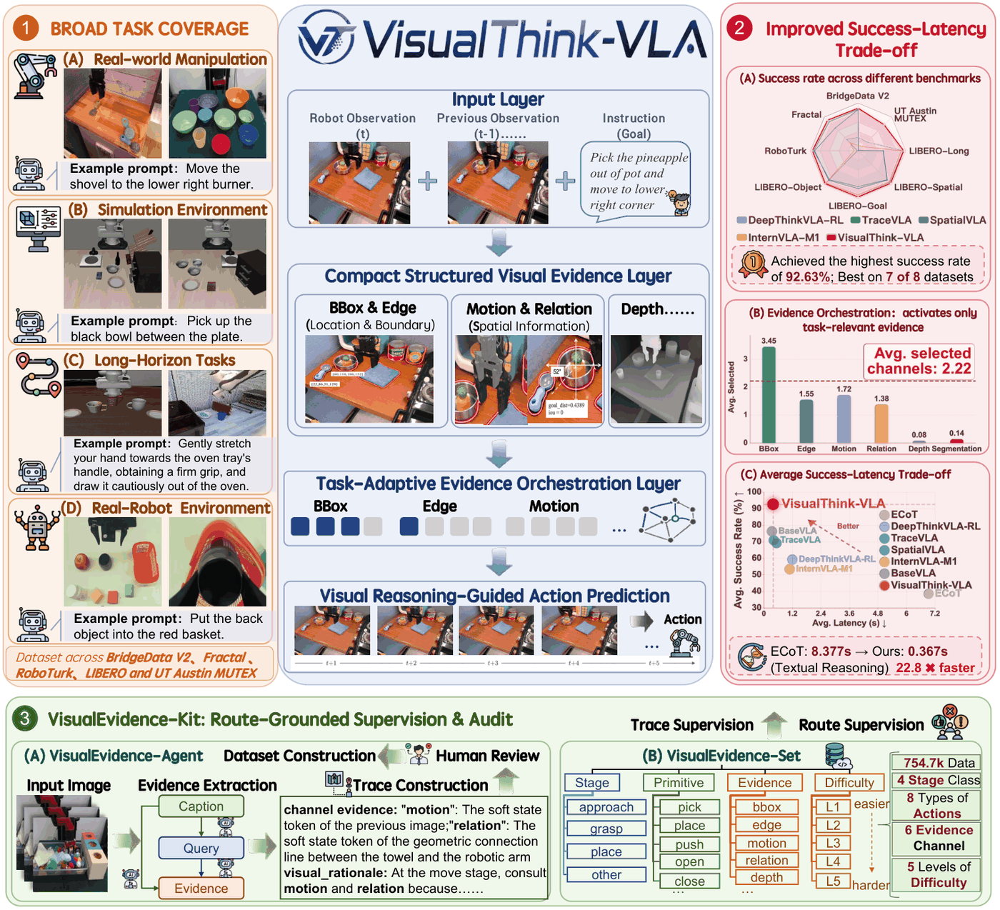
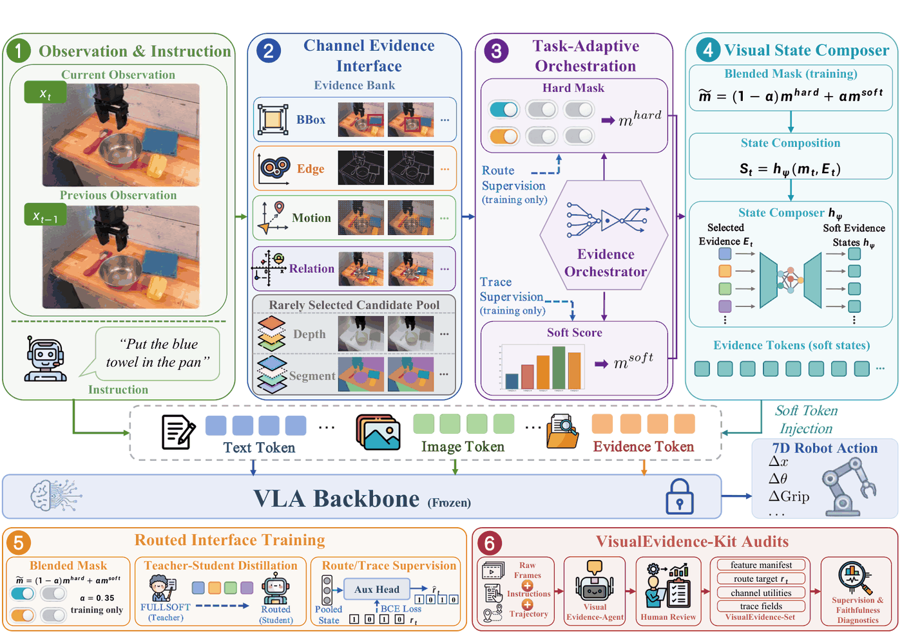
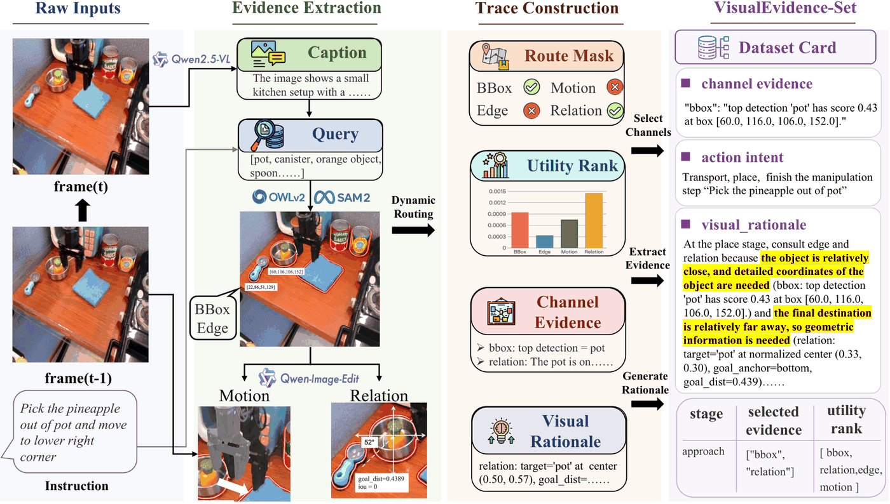
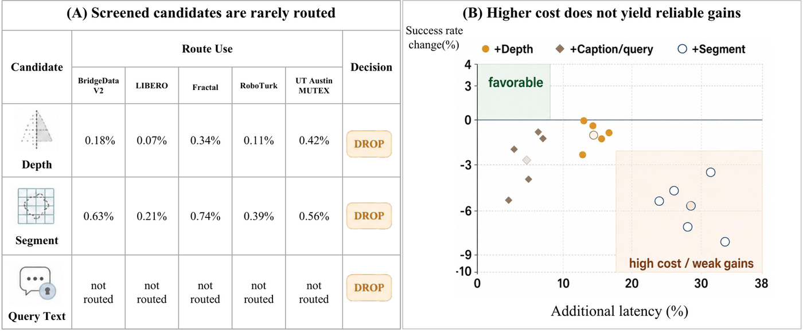

# VisualThink-VLA: Think and Act with Visual Evidence

> Introduction to this paper **VisualThink-VLA: Visual Intermediate Reasoning for Effective and Low-Latency Vision-Language-Action Policies**. The arXiv ID of the paper is `2605.30011v1`, and it was submitted on May 28, 2026. The authors include Mingjian Gao, Wenqiao Zhang, Yuqian Yuan, Yang Dai, Binhe Yu, Zheqi Lv, Haoyu Zheng, Jiaqi Zhu, Zhiqi Ge, Zixuan Wan, Siliang Tang, and Yueting Zhuang.

## 1. Why Reason with Visual Evidence

VisualThink-VLA discusses a very practical issue within VLA: how should robots "think before acting".

In recent years, the VLA reasoning enhancement approach often involves the model first generating a text-based Chain-of-Thought, and then performing actions based on that reasoning. This seems natural in offline evaluations, but two issues arise when applied to closed loop robot control.

First, text-based reasoning is not necessarily suitable for manipulation. When a robot needs to grasp a red bowl, avoid obstacles, touch along the edge, and determine the relative relationships between objects, the key information is often position, boundaries, movement, and spatial relationships, rather than a long explanation in natural language. Free-text CoT may introduce irrelevant descriptions into action prediction, thereby interfering with control.

Second, the text CoT has a significant delay. The paper reports that the ECoT has a single-step delay of `8.377s` on BridgeData V2, while VisualThink-VLA reduces the delay to `0.367s`, achieving an acceleration of approximately `22.8x`. For real robots, this is not a minor optimization: seconds-level inference is difficult for closed loop control, and sub-second levels are closer to deployable policies.

The core judgment of VisualThink-VLA is:

```text
A robot does not have to reason in prose.
A more suitable intermediate representation is compact, routable,
and auditable visual evidence.
```

Therefore, it is neither a world model nor a completely new VLA base training. It is more like adding a **visual evidence intermediate layer** to the frozen VLA:

```text
Current RGB frame + previous frame + language instruction
    -> extract bbox, edge, motion, and relation evidence
    -> route the evidence channels required by the current action
    -> compose lightweight visual states
    -> predict actions with the frozen VLA backbone
```

VisualThink-VLA joins EventVLA, G0.5, PRTS, and LWD in exploring how VLA can move beyond direct behavior cloning. Its distinctive focus is the **efficiency and auditability of visual intermediate reasoning**: the policy selects task-relevant visual evidence before acting and retains evidence channels that can be inspected.

## 2. Papers, Code, and Reproduction Entries

| Entry | Link | Current Status |
| :--- | :--- | :--- |
| Paper | [arXiv:2605.30011](https://arxiv.org/abs/2605.30011) / [HTML](https://arxiv.org/html/2605.30011v1) / [PDF](https://arxiv.org/pdf/2605.30011) | Submitted on 2026-05-28 |
| GitHub | [DCDmllm/VisualThink-VLA](https://github.com/DCDmllm/VisualThink-VLA) | Official code repository, MIT License |
| Code Status | The GitHub README indicates that the code skeleton was initially released in May 2026 | Includes evidence extraction, router training, adapter training, VisualEvidence-Set construction, and evaluation scripts |
| Large Assets | The README states that OpenVLA checkpoints, perception model cache, raw robot data, feature manifest, training checkpoints, and evaluation logs are not included in the repository | External model and data paths are required for reproduction |

The most suitable learning approach currently is: first read the methods, then run through the lightweight pipeline structure in the code repository to understand how evidence extraction, router, adapter, and audit are connected. To completely reproduction all the benchmarks in the paper and real robot results, you need OpenVLA/Prismatic, LIBERO, SAM2, grounding DINO, Qwen2.5-VL, robot data, trained router/adapter checkpoint, and evaluation environment. It cannot be achieved by executing a single command to obtain the paper tables directly.

## 3. Overview Chart: Replace Long Text CoT with Visual Evidence



**Figure 1: Overview of VisualThink-VLA.** On the left, it explains its coverage of various manipulation scenarios; in the middle, it shows the trade-off between success rate and latency; on the right, it demonstrates how VisualEvidence-Kit constructs route-grounded supervision and audit data.
Source: [DCDmllm/VisualThink-VLA official repository ](https://github.com/DCDmllm/VisualThink-VLA).

This diagram can be understood at three levels.

The first layer is the **task motivation**. VLA often encounters multiple object interference, spatial relationships, contact geometry, and long-term phase changes during real-world manipulations. It is certainly possible to directly convert images into actions, but when the scene is complex, a policy is required to have some “intermediate basis” to determine which visual cues should be relied upon for the current manipulation.

The second layer is **efficiency constraints**. If the intermediate basis is a long text CoT, reasoning becomes slower; if it is a complete segmentation image, depth map, or dense side cue, it may introduce redundancy or errors into the action decoder. VisualThink-VLA chooses a middle ground: it retains only compact visual evidence, and activates only the necessary evidence channels at each step.

The third layer is **auditability**. It does not compress all visual evidence into an unexplainable latent, but instead retains the route mask and channel-grounded traces. This allows us to ask: Does this policy actually examine bbox, edge, motion, or relation? If a certain channel counterfactual is removed, is the action truly affected? This is closer to faithfulness in robotics control than generating a pleasant natural language explanation afterwards.

## 4. Method Diagram: Six Candidate Channels, Four Deployment Channels



**Figure 2: VisualThink-VLA architecture.** The system first extracts six types of candidate visual evidence from the current frame, the previous frame, and language instructions. After channel screening, four deployment channels are retained. The router selects evidence based on current decisions. Visual State Composer injects the routed evidence into the frozen VLA backbone. The dashed lines indicate the supervision paths that are not required during training or inference.
Source: [ DCDmllm/VisualThink-VLA official repository ](https://github.com/DCDmllm/VisualThink-VLA).

The most crucial design in the paper is the **Visual Evidence Interface**. It first constructs six types of candidate evidence:

| Channel | Function | Visual Example |
| :--- | :--- | :--- |
| `bbox` | Target position and detection box | Locating the red bowl, blue cup, and target square when grasping multiple objects |
| `edge` | Boundary and contact geometry | Estimating object contours during insertion, pushing, pulling, edge contact, and rotation |
| `motion` | Short-term changes | Determining whether an object is pushed, has moved, or the current phase has changed |
| `relation` | Instruction-related spatial relationships | "Place it on the left side of the box" "Put the cup into the plate" |
| `depth` | Monocular geometric depth | Estimating front-back distance and local geometry |
| `segment` | Object region mask | Segmenting the target region and interference regions |

But during the final deployment, not all six are used. The channel screening in the paper found that `depth` and `segment` yield low benefits and high overhead in their benchmark settings, easily increasing side-perception overhead. Therefore, the operational evidence bank retains four channels in the end:

```text
bbox + edge + motion + relation
```

This is the "less is more" principle of VisualThink-VLA: instead of feeding all perception results to VLA, the router selects the most relevant visual evidence at each step. For example, it may rely more on bbox when near the target; on contact and redirection, it relies more on edge/motion; and when processing commands like "left, inside, beside", it relies more on relation.

## 5. Freezing the VLA backbone: It is not retraining a large base

The GitHub README clearly states that VisualThink-VLA keeps the base VLA frozen. This point is very important.

Many VLA improvement methods re-tune a large number of backbone parameters, which is costly and may also undermine the original generalization ability. VisualThink-VLA operates more like an external visual reasoning layer:

```text
Frozen VLA backbone
    + evidence extractor
    + task-adaptive router
    + Visual State Composer / routed adapter
    -> action prediction
```

Among these, the evidence extractor is responsible for converting raw observations into compact evidence vectors; the router is responsible for selecting channels; and Visual State Composer is responsible for projecting the routed channel vectors into a small number of learned visual states and inserting them before action decoding. During reasoning, it does not generate text, does not call the online image editing model, and does not output a human-readable long explanation.

This is also the difference between it and G0.5 / CoT VLA. G0.5 incorporates structured CoT and action tokens into an autoregressive stream; VisualThink-VLA tries to minimize text token decoding, placing intermediate reasoning on visual evidence tokens / soft states.

## 6. Task-Adaptive Router: Not fixed to all evidence

The router of VisualThink-VLA predicts the selection probability of each evidence channel, and then converts it into a hard routing mask during reasoning through the hardening operator. In other words, at each step, it does not fixly open four channels, but dynamically selects them.

During training, using a hard route directly would be too fragile. Therefore, the paper adopts soft-hard collaborative masks: a mixed soft/hard route is used during training, and the hard route is used during inference. To enable the sparse route to inherit the capabilities of dense evidence, VisualThink-VLA also trains a `FullSoft` teacher. The `FullSoft` examines four deployment channels at each step, while the VisualThink-VLA student learns on the sparse channels selected by the router, and performance is maintained through teacher-student distillation.

This design addresses a specific contradiction:

```text
Dense evidence:
    信息充分，但慢，且可能引入干扰。

Sparse routed evidence:
    快，干扰少，但训练不稳、容易漏掉关键信息。

FullSoft teacher + routed student:
    用 dense teacher 提供容量，再让 sparse student 学会按需选择。
```

The paper results also support this conclusion: VisualThink-VLA has an average success rate of `90.10%` in internal comparisons, with an average delay of `0.395s`; FullSoft has an average success rate of `89.83%`, with an average delay of `0.470s`. This indicates that sparse routing not only saves computation, but also has a slightly higher average success rate than dense teacher, possibly because it filters out some irrelevant or conflicting evidence.

## 7. VisualEvidence-Kit: Supervision and auditing are not free text interpretations



**Figure 3 VisualEvidence-Kit workflow.** VisualEvidence-Agent extracts candidate visual evidence from the robot trajectory, evaluates the channel utility, constructs a channel-grounded trace, and undergoes manual review to generate a VisualEvidence-Set that can be used for router training and faithfulness auditing.
Source: [DCDmllm/VisualThink-VLA official repository ](https://github.com/DCDmllm/VisualThink-VLA).

VisualEvidence-Kit is a notable part of this paper. Many "explainable robot policies" tend to provide explanations only after the action is taken: the policy first outputs an action, and then a language model generates an explanation. Such explanations may not actually be involved in the action decision-making.

VisualThink-VLA requires, in turn, an auditable evidence path. VisualEvidence-Agent does four things:

1. **Evidence extraction**: Extract candidate channel features for each decision context.
2. **Route and utility assessment**: Estimate the route target and counterfactual utility of each channel for the current action.
3. **Trace construction**: Record the manipulation stage, primitive, evidence dependence, difficulty, and selected evidence to form a structured channel-grounded trace.
4. **Human review**: Conduct manual checks for consistency and filter out unreliable labels.

The final VisualEvidence-Set contains `754.7k` visual-thinking VLA instructions, which can be used for route supervision, trace-supervised adapter refinement, and counterfactual faithfulness tests. The paper emphasizes that these traces are used during training and auditing, and no VisualEvidence-Agent is required for reasoning, nor is it necessary to generate the trace fields.

For tutorials, it is important to clarify this: VisualEvidence-Kit is not a heavy interpreter that the robot runs online during control, but rather a **data toolchain for constructing supervision and verifying the credibility of routing**.

## 8. Channel Screening: Why remove depth and segment



**Figure 4: Evidence channel filtering.** The initial candidates include six types of evidence, but after paper screening, only four deployment channels `bbox / edge / motion / relation` are retained; `depth` and `segment` can be used for diagnosis or filtering and do not belong to the default operational interface.
Source: [DCDmllm/VisualThink-VLA official repository ](https://github.com/DCDmllm/VisualThink-VLA).

In robot vision, it is easy to have an intuitive belief that depth, segmentation, detection, motion, and relationships are all provided to the model—the more information, the better. However, the VisualThink-VLA experiments show that this intuition is not always valid.

There are three types of reasons.

First, additional channels increase the perception overhead. In real-time control, each step involves depth estimation, segmentation, detection, and relationship reasoning, which accumulates latency.

Second, additional channels introduce noise. Errors in segmentation boundaries, drift in depth estimation, and errors in the target mask under occlusion can all mislead the action decoder.

Third, there is competition among the evidence. The action decoder may be distracted by too many auxiliary tokens, which can undermine attention on the truly critical evidence. For example, multi-object pick-place mainly requires bbox and relation, while contact-sensitive redirection mainly requires edge/motion. Incorporating inefficient channels together may not be better.

Therefore, the approach of VisualThink-VLA is not "the more and stronger the multimodal information," but rather **finding a small yet effective visual evidence interface through filtering and routing**.

## 9. Experimental results: Strength is considered in both success rate and latency

There are four categories of representative results in the paper.

First is the multi-benchmark control comparison. VisualThink-VLA was evaluated on BridgeData V2, Fractal, RoboTurk, LIBERO-Object, LIBERO-Goal, LIBERO-Spatial, LIBERO-Long, and UT Austin MUTEX. Compared to the matched BaseVLA re-evaluation, its success rate improved in 7 out of 8 benchmarks. On BridgeData V2, BaseVLA is `75.37% / 0.345s`, VisualThink-VLA is `89.49% / 0.367s`, and ECoT is `85.09% / 8.377s`. This indicates that it does not simply increase success rate by using longer reasoning, but adds visual intermediate reasoning in areas close to the BaseVLA latency.

Second is backbone portability. The paper tests three bases—OpenVLA, Octo, and SmolVLA—on the VisualEvidence-Set test split. VisualThink-VLA improves the success rates of `+16.37`, `+10.87`, and `+11.95`, while the delay only increases by approximately `0.05s` to `0.10s`. This supports its use as a plug-and-play visual reasoning layer, rather than a modification specific to OpenVLA.

Thirdly, there is a comparison of internal interfaces. Prompt-text evidence can increase the success rate, but the average latency reaches `1.428s`; Heavy dense evidence has an average latency of `0.592s`; FullSoft is `0.470s`; VisualThink-VLA is `0.395s`, with an average success rate of `90.10%`. This result indicates that structured visual evidence is more suitable for low-latency control than free-text evidence, and sparse routing is more efficient than dense side cues.

Fourth is the real robot closed loop evaluation. The paper uses a PIPER NERO 7-DoF robotic arm and a fixed external RGB camera, covering four types of tasks: multi-object pick-place, relation-sensitive placement, contact-sensitive reorientation, and two-stage compositional task. VisualThink-VLA outperforms BaseVLA in all four tasks, and surpasses FullSoft in three tasks; the average completion time `25.6s` is lower than FullSoft’s `30.2s`, with an average of only selecting `1.83` evidence channels.

These results indicate that the core value of VisualThink-VLA is not "an additional explanation module," but rather finding a more practical intermediate reasoning interface for VLA: sufficiently visual, compact, fast, and auditable.

## 10. How to read a code repository

The official repository currently provides a research pipeline. It is recommended to read it in the following order.

Step 1: Extract evidence:

```bash
git clone https://github.com/DCDmllm/VisualThink-VLA
cd VisualThink-VLA

conda create -n visualthink-vla python=3.10 -y
conda activate visualthink-vla
pip install -r requirements.txt
pip install -e .

python scripts/extract_visual_evidence.py \
  --image_path path/to/current.png \
  --prev_image_path path/to/previous.png \
  --instruction "pick up the red bowl" \
  --output_dir outputs/evidence_one
```

The goal of this command is not to reproduce paper metrics, but to clarify how a single frame’s current image, the previous frame, and language instructions transform into visual evidence. It helps understand what format these channels in `bbox / edge / motion / relation` take in the code.

Step 2: Check the router:

```bash
python scripts/train_evidence_router.py \
  --feature_manifest outputs/features/feature_manifest.jsonl \
  --config configs/evidence_router.yaml \
  --output_dir outputs/router
```

The router training depends on the feature manifest and route supervision. When there is no complete VisualEvidence-Set, you can first read the configuration and scripts to understand the data flow of input fields, output checkpoint, and route mask.

Step 3: Check FullSoft and VisualThink-VLA adapter:

```bash
python scripts/train_visualthink_adapter.py \
  --mode full \
  --feature_manifest outputs/features/feature_manifest.jsonl \
  --model_path path/to/openvla \
  --config configs/visualthink_adapter.yaml \
  --output_dir outputs/fullsoft

python scripts/train_visualthink_adapter.py \
  --mode visualthink \
  --feature_manifest outputs/features/feature_manifest.jsonl \
  --model_path path/to/openvla \
  --config configs/visualthink_adapter.yaml \
  --gate_checkpoint_dir outputs/router \
  --teacher_adapter_dir outputs/fullsoft \
  --output_dir outputs/visualthink
```

Note that `path/to/openvla`, perception checkpoint, data manifest, and training outputs should not be placed in the tutorial repository. The official README also emphasizes that these important assets should be stored outside the Git repository and passed via command-line parameters.

Step 4: Check VisualEvidence-Set and audit:

```bash
python scripts/build_visualevidence_set.py \
  --feature_manifest outputs/features/feature_manifest.jsonl \
  --gate_checkpoint_dir outputs/router \
  --visualthink_checkpoint_dir outputs/visualthink \
  --output_path outputs/visualevidence/visualevidence_set.jsonl

python scripts/audit_faithfulness.py \
  --feature_manifest outputs/features/feature_manifest.jsonl \
  --model_path path/to/openvla \
  --visualthink_checkpoint_dir outputs/visualthink \
  --evidence_trace_manifest outputs/visualevidence/visualevidence_set.jsonl \
  --output_dir outputs/audit
```

The key focus of this part is faithfulness audit: whether the evidence derived from routing truly affects the actions, rather than just serving as a posteriori explanation.

## 11. Relationship with other VLA inference methods

| Method | Intermediate Reasoning Form | Advantages | Differences from VisualThink-VLA |
| :--- | :--- | :--- | :--- |
| ECoT / text CoT | Autoregressive text reasoning | Intuitive explanation | High latency; text may lack visual grounding |
| TraceVLA / SpatialVLA | Intermediate information in images or space | Closer to visual space | May introduce more dense side cues |
| Galaxea G0.5 | Structured CoT + action token flow | Reasoning and actions unified in an autoregressive sequence | VisualThink-VLA avoids long-text decoding; uses visual soft states to condition actions |
| EventVLA | Long-time-domain visual evidence memory | Solves long-term visual evidence forgetting | VisualThink-VLA focuses on the evidence routing required for single-step decisions |
| PRTS | Goal reachability / CRL pre-training | Gives VLA awareness of goal-reachability | VisualThink-VLA focuses on the visual evidence interface and low-latency control |
| LWD | Offline-to-online RL after real robot deployment | Continuously improves the policy using real deployment data | VisualThink-VLA focuses on the reasoning interface; LWD focuses on the deployment data feedback loop |

VisualThink-VLA can be understood within the category of "visual reasoning VLA". It doesn't make the model say more, but enables the model to see what is right before taking action.

## 12. Recommended Team Learning Topics

In Task04, it can be arranged like this:

> Compare EventVLA, G0.5, and VisualThink-VLA: EventVLA focuses on long-term visual evidence memory, G0.5 emphasizes structured CoT and action token streams, while VisualThink-VLA emphasizes low-latency routed visual evidence. Please explain which bottleneck of VLA each of these three approaches addresses, and analyze the trade-offs between textual CoT, visual evidence tokens, and action tokens.

The delivery does not require completing the full training, but you must answer:

- Why does VisualThink-VLA believe textual CoT is not suitable for real-time robot control?
- Why are only four of the six candidate channels retained in the final version?
- `FullSoft` What problems do "teacher" and "routed student" each solve?
- Why does VisualEvidence-Kit emphasize counterfactual faithfulness?
- Which pipelines can be reproduction in the code repository currently, and which still rely on external models/data/checkpoints?

## 13. Source of Information

The images in this article are from the [DCDmllm/VisualThink-VLA official repository ](https://github.com/DCDmllm/VisualThink-VLA). To ensure stable access for the tutorial, they have been saved locally as `assets/`. The text content is referenced from [arXiv:2605.30011](https://arxiv.org/abs/2605.30011), [arXiv HTML](https://arxiv.org/html/2605.30011v1), and the official GitHub README.
